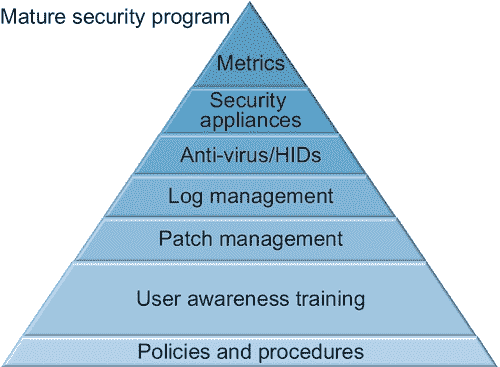

# 一、什么是安全感知程序？

比尔·加德纳 马歇尔大学，美国西弗吉尼亚州亨廷顿

## 摘要

并非所有的攻击都是技术性的。现在，我们已经围绕我们的网络建立了技术防御，社会工程被用于大多数最近的入侵。对社会工程的唯一防御是一个引人入胜的安全感知程序。安全感知程序有助于策略的制定和实现，同时有助于限制组织的计算机和电信服务用户的行为。安全感知程序有助于限制组织敏感和机密数据的泄露风险。安全感知程序是一个正式的计划，其目标是培训用户了解组织信息的潜在威胁，以及如何避免可能使组织数据面临风险的情况。

关键词

安全

意识

政策

政策制定

政策实现

节约成本

产量增加

正式程序

## 简介

安全感知程序是一个正式的计划，其目标是培训用户了解组织信息的潜在威胁，以及如何避免可能使组织数据面临风险的情况。

安全感知程序的目标是降低组织的攻击面，使用户能够承担保护组织信息的个人责任，并强制实现组织已有的保护数据的策略和程序。政策和程序可能包括但不限于计算机使用政策、互联网使用政策、远程访问政策以及其他旨在管理和保护组织数据的政策。

在信息安全中，人是最薄弱的环节。人们想要乐于助人。人们想做好工作。人们希望为他们的同事、客户和供应商提供良好的客户服务。人们很好奇。社会工程师试图利用人类的这些特征。“社会工程被定义为欺骗人们泄露访问权限或机密信息的过程”。唯一已知的对社会工程攻击的防御是有效的安全感知程序。除非用户了解社会工程师的战术和技术，否则他们将成为牺牲品，并将组织的数据置于风险之中。

对最近的违规行为的调查将揭示，其中大多数利用了对人类的剥削。一个例子是 RSA 漏洞[ [2](#bb0015) ]，老练的攻击者使用有针对性的鱼叉式网络钓鱼窃取 RSA SecurID 认证令牌，导致美国国防承包商洛克希德·马丁[ [3](#bb0020) ]的进一步漏洞。另一个例子是针对谷歌和其他大型软件公司的“Aurora”攻击，该攻击使用一种将用户发送到一个网站的攻击，该网站通过尖端的 0day 漏洞感染用户。结果是包括源代码在内的大量知识产权从谷歌和 Adobe 等公司被盗。

现在网上的坏人都不会试图突破防火墙闯入。坏人绕过防火墙。组织已经花费数十亿美元开发针对在线攻击者的分层防御。有一些解决方案，如防病毒、入侵检测系统、入侵防御系统以及其他保护信息的技术解决方案。有了这些复杂的解决方案，攻击者现在转向更有针对性的攻击，集中于诱骗用户点击链接或打开附件。

Dave Kennedy 的社会工程师工具包在模拟社会工程师攻击方面做得非常好，例如网站、附件、人机界面设备(HID)和 QR 攻击，供防御者用来测试他们自己的环境。这听起来可能很简单，但是如果大多数用户收到一个似乎来自人力资源部门的附件，看起来像是组织中每个人加薪的电子表格([图 1.1](#f0010) )，他们会怎么做？好奇心可能不仅仅会杀死猫；这也可能会使您的数据面临风险。

<figure class="fig">

<figcaption id="ca0010">Figure 1.1 Social-Engineer Toolkit (SET).</figcaption>

</figure>

虽然 SET 是一种技术工具，但它的目标是使用非技术手段来利用人类，人类反过来利用计算机，从而导致数据泄露[ [6](#bb0035) ]。SET 可以很容易地将网站克隆到攻击者的机器上，然后将漏洞插入到网站中。此时，攻击者会试图将用户定向到克隆的站点。这可能是通过鱼叉式网络钓鱼实现的，向用户发送伪装成链接缩短服务的链接，或者购买一个域名来托管看起来合法的克隆网站。一旦用户进入克隆的站点，攻击者就可以使用许多不同的攻击媒介来窃取信息或安装后门程序，使攻击者能够像合法用户一样访问系统。SET 还能够对这些攻击进行编码，因此它们不会被用于检测恶意软件和入侵的反病毒软件和其他软件检测到。凭据收集攻击是通过克隆 Twitter、脸书等网站，甚至是银行或信用卡网站的用户名和密码文件来实现的。当用户试图登录网站时，SET 会窃取用户名和密码，并让用户登录合法网站。我们将在本书后面更详细地讨论 SET。

安全感知程序也是成熟安全计划的一个组成部分。政策和程序是第一个构件。下一层是安全感知程序，也称为用户意识培训。只有具备了这两个要素，我们才能进入下一步，即补丁管理、日志管理、防病毒/HIDS、安全设备，最后是指标。多年来，组织一直在安全方面投入资金，而这些钱本可以更好地用于培训他们的用户([图 1.2](#f0015) )。这本书的重点是逐步建立一个安全感知程序，最终目标是建立一个成熟的安全程序。

<figure class="fig">

<figcaption id="ca0015">Figure 1.2 Elements of a mature security program.</figcaption>

</figure>

## 政策制定

策略开发设定了组织用户的目标、限制和期望。根据组织的规模，这些政策可以是针对组织的 IT 和人力资源结构的特定部门的许多文档，或者对于较小的组织，这些政策可以是概述使用组织的电话、计算机、电子邮件和其他数字资产的人的限制和职责的单个文档。

最常见的政策是计算机使用政策。可以在单独的文档中处理的其他单独的策略包括电子邮件使用、互联网使用、电话使用和传真使用。计算机使用，有时也称为可接受的使用政策，定义了用户对计算机和电信资源的访问级别以及他们使用这些资源的权利和限制。可接受使用的最大目标是定义使用的终止和滥用的开始。例如，在大多数组织中，如果用户在工作时间访问色情和赌博网站，将被视为滥用。如果员工在工作时间使用电话和电子邮件服务进行过多的个人交流，也将被视为滥用。大多数组织都知道一些个人使用是必要的，可接受的使用政策定义了组织的设备和服务的可接受和不可接受的使用。

一些组织的使用政策基于互联网上的模板[ [7](#bb0040) ]。虽然这些类型的模板很有用，但重要的是要记住，它们需要定制，以定义您组织的需求和使命。

组织的人力资源部门也需要参与进来。在许多情况下，政策的特定部分会有处罚，由人力资源部强制执行。在大多数情况下，政策和程序的制定必须考虑到法规。HIPAA/HITECH 可能涵盖那些处理健康数据的组织。处理信用卡交易的组织可能会被 PCI DSS 覆盖。具体来说，HIPAA/HITECH 安全规则的物理标准解决了包括工作站使用在内的问题，164.310(b)；工作站安全，164.310(c)；设备和媒体控制，164.310(d)(1)。HIPAA/HITECH 还要求惩罚那些不遵守安全规则管理标准下的政策的人，特别是授权和/或监督、劳动力许可程序和终止程序，164.308(a)(3)。

## 政策实现

没有执行力的政策是对时间的浪费，也是对组织的损害。有效的安全感知程序的目标之一是通过教育用户了解策略和组织的期望来执行策略。

没有比不强制执行的政策更无用的了。许多组织花费大量时间制定政策。很多时候，这些政策会被夹在某人办公室的架子上。

向用户提供可接受使用和其他策略的副本是一个很好的开端，但是大多数时候，用户不会花时间去阅读这些信息。应使用安全感知程序来审查这些政策，尤其是适用于组织的通信和信息技术基础设施的使用、滥用和滥用处罚的政策。

本书的目标是说明如何建立一个有效的安全感知程序，从获得管理层的认可到使用有效的度量标准来衡量计划。它也是为从管理层到数字前线的 It 经理的任何有兴趣开始安全感知程序的人编写的。虽然我们将在本书中涵盖很多内容，但最终目标是让您能够开发一个引人入胜的安全感知程序，帮助您的组织在面临在线威胁时管理其风险。

## 节约成本

数据泄露要花钱。如果您是受 HIPAA/HITECH 或 PCI DSS 等法规约束的组织，数据泄露的罚款可能高达数百万美元，具体取决于泄露的规模。此外，许多州现在都有违规通知法，要求丢失数据的组织通知受影响的人丢失了什么，并在某些情况下为受影响的人提供信用保护。Ponemon Institute 和赛门铁克在 2013 年 6 月发布了一份报告，发现 2012 年全球每条记录的平均违规成本为 136 美元。

2012 年 5 月，美国卫生与公众服务部民权办公室因健康数据泄露对爱达荷州立大学罚款 40 万美元。2012 年 6 月，阿拉斯加州卫生与人类服务部(DHHS)同意支付 170 万美元，以解决潜在的违反 HIPAA/HITECH [ [10](#bb0055) ]的问题。

支付卡行业对数据泄露事件规定了每次高达 50 万美元的罚款。2010 年，总部位于田纳西州纳什维尔的运动服装公司 Genesco 因违反 PCI DSS 法规被罚款 1300 多万美元，此前该公司发现自己遭到黑客攻击，监管机构也发现了违规行为。

## 产量增加

恶意软件和计算机问题的减少可以减少停机时间，提高组织的生产效率。IT 和安全团队实际上可以花时间积极主动地推进组织的使命，而不是被动地应对病毒和其他恶意软件感染，并调查可能的实际数据泄露[[13](#bb0070)。

一些感染和违规可能会导致数天甚至数周的停机时间。这些种类的中断会导致组织的利润减少，在某些情况下会使组织面临民事法律诉讼、可能的监管行动以及可能的客户和业务合作伙伴损失。

一些数据泄露不是外部因素造成的，而是员工的错误，例如关闭防火墙或没有正确配置网站不向公众显示机密数据[[15](#bb0080)。如果没有正确完成工作的知识，员工会继续犯错。

安全感知程序的最终目标是管理组织的风险。大多数组织都有安全计划来保证员工的工作安全。安全感知程序的目标应该是保护组织的数据安全。

## 管理层买入

建立安全感知程序的第一步也是最重要的一步是获得组织管理结构的批准和支持。如果没有管理人员的支持，政策将无法成文，政策将无法实现，管理人员和员工将会反对任何关于保护组织信息的结构、规则或限制。即使面对 HIPAA/HITECH 和 PCI DSS 等法规，如果没有组织管理层的支持，安全感知指标也会失败。

管理层认同从向管理层展示风险开始，然后说明安全感知程序将如何帮助他们管理风险。第二步是向管理层展示这样的计划如何支持组织的业务目标，包括政策制定、政策实现、成本节约和产量增加。

说明风险包括特定于组织所在行业的案例研究。例如，如果您的组织是一家律师事务所，请使用案例研究和因用户犯错误而被攻破的律师和律师事务所的示例。说明攻击者的狡猾也很重要。大多数人在想到安全性时会想到日常的非目标病毒感染，而最危险的攻击者是技术先进的黑客，他们试图窃取知识产权、金融信息和商业机密。

管理层并不总是乐于接受变化，尤其是当他们认为这样的变化会妨碍组织的业务目标时。用非技术术语与管理层适当沟通是获得管理层认同的关键。当自上而下的管理者理解安全感知程序的目的和目标，并且这种计划符合组织的业务目标(主要是赚钱)时，他们将更容易接受实现安全感知程序。

在本书的剩余部分，我们将继续从零开始，用很少的钱或不用钱来研究安全感知程序的具体步骤。常识性方法是应对大量现代信息威胁的最佳方式。虽然有些组织提供付费的、通常是固定的安全感知程序，但本书的重点是让人们有理由在自己的组织内建立自己的计划，无论这些组织是小型、中型还是大型企业或公司，也无论它们是非营利组织还是学校。这些信息中的大部分也将被家庭用户用来在面临在线威胁时更好地管理他们的风险，但是家庭用户超出了本书的范围。

<footer>

## 笔记

[1] 社会工程框架。[http://www . Social-engineer . org/framework/Social _ Engineering _ Defined](http://www.social-engineer.org/framework/Social_Engineering_Defined)【2013 年 6 月 2 日访问】。

[2] 数字道:全球网络共享空间中不断发展的敌对行为。[http://Jeffrey carr . blogspot . com/2011/06/18-days-from-0 day-to-8k-RSA-attack . html](http://jeffreycarr.blogspot.com/2011/06/18-days-from-0day-to-8k-rsa-attack.html)【2013 年 6 月 3 日访问】。

[3] 《信息周刊》安全性:RSA 漏洞:八个月后。[http://www . information week . com/security/attacks/RSA-breach-eight-months-late/231903048](http://www.informationweek.com/security/attacks/rsa-breach-eight-months-later/231903048)【2013 年 6 月 3 日访问】。

[4] 《连线》:新的细节显示，谷歌黑客攻击极其复杂。[http://www.wired.com/threatlevel/2010/01/operation-aurora/](http://www.wired.com/threatlevel/2010/01/operation-aurora/)【03 . 06 . 13 访问】。

[5] TrustedSec:社会工程师工具包。[https://www . trusted sec . com/downloads/social-engineer-toolkit/](https://www.trustedsec.com/downloads/social-engineer-toolkit/)【2013 年 6 月 4 日访问】。

[6] 社会工程框架:基于计算机的社会工程工具:社会工程师工具包(SET)。[http://www . Social-Engineer . org/framework/Computer _ Based _ Social _ Engineering _ Tools:_ Social _ Engineer _ Toolkit _(SET)](http://www.social-engineer.org/framework/Computer_Based_Social_Engineering_Tools:_Social_Engineer_Toolkit_(SET))【04 . 06 . 13 访问】

SANS:信息安全政策模板。[http://www.sans.org/security-resources/policies/](http://www.sans.org/security-resources/policies/)【04 . 06 . 13 访问】。

[8] Ponemon 和赛门铁克发现大多数数据泄露都是由人为和系统错误造成的。[http://www.symantec.com/about/news/release/article.jsp?prid = 2013 06 05 _ 01&om _ ext _ cid = biz _ socmed _ Twitter _ Facebook _ market wire _ LinkedIn _ 2013 jun _ world wide _ CostofaDataBreach](http://www.symantec.com/about/news/release/article.jsp?prid=20130605_01&om_ext_cid=biz_socmed_twitter_facebook_marketwire_linkedin_2013Jun_worldwide_CostofaDataBreach)【05 . 06 . 13 访问】。

HHS 因健康数据泄露对爱达荷州立大学罚款 40 万美元。[http://health it security . com/2013/05/22/hhs-fines-Idaho-state-university-400k-for-data-breach/](http://healthitsecurity.com/2013/05/22/hhs-fines-idaho-state-university-400k-for-data-breach/)【2013 年 6 月 6 日访问】。

[10] 阿拉斯加 DHSS 以 1，700，000 美元了结 HIPAA 安全案件。[http://www . hhs . gov/ocr/privacy/hipaa/enforcement/examples/Alaska-agreement . html](http://www.hhs.gov/ocr/privacy/hipaa/enforcement/examples/alaska-agreement.html)【2013 年 6 月 6 日访问】。

[11] PCI-DSS:安全-惩罚。[https://financial.ucsc.edu/Pages/Security_Penalties.aspx](https://financial.ucsc.edu/Pages/Security_Penalties.aspx)【06 . 06 . 13 访问】。

[12] 零售商反对 PCI 因违约后不遵守规定而被罚款，起诉 Visa。[http://www . sc magazine . com/retailer-fights-PCI-fines-for-不合规-违约后-起诉-visa/article/284088/](http://www.scmagazine.com/retailer-fights-pci-fines-for-noncompliance-after-breach-sues-visa/article/284088/)【2013 年 6 月 6 日访问】。

[13] 停机时间被评为数据泄露的最高风险。[http://www . information week . com/security/management/down-rated-top-risk-of-data-explosions/228201056](http://www.informationweek.com/security/management/downtime-rated-top-risk-of-data-breaches/228201056)【2013 年 6 月 7 日访问】。

[14] HHS 因健康数据泄露对爱达荷州立大学罚款 40 万美元。[http://health it security . com/2013/05/22/hhs-fines-Idaho-state-university-400k-for-data-breach/](http://healthitsecurity.com/2013/05/22/hhs-fines-idaho-state-university-400k-for-data-breach/)【2013 年 6 月 7 日访问】。

官员们说，布鲁克海文的数据泄露“是笔误”。[http://www . news day . com/long-island/towns/brookhaven-data-breach-was-文书-错误-官员-say-1.5426405](http://www.newsday.com/long-island/towns/brookhaven-data-breach-was-clerical-error-officials-say-1.5426405)【2013 年 6 月 7 日访问】。

</footer>

