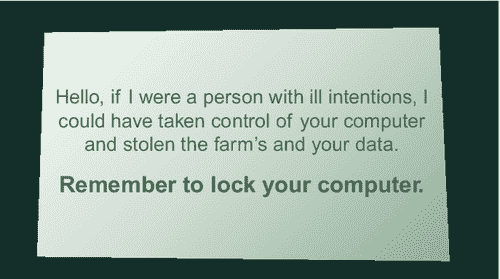

<section epub:type="chapter">

<header>Chapter 6

# 为什么目前的项目不起作用

<address>

比尔·加德纳 马歇尔大学，美国西弗吉尼亚州亨廷顿

</address>

<section epub:type="preamble">

## 摘要

作为教学工具的讲座已经死了。目前的项目不起作用，因为我们依赖旧的教学模式。人们以不同的方式学习。有些人是视觉学习者，而有些人通过阅读或讨论学得更好。我们需要从一成不变的网络培训转向交互式的实践学习，以建立更有效的安全意识计划。

</section>

关键词

视觉

音频

动手

培训

学习

内容交付

同伴指导

</header>

<section>

## 讲座作为教学工具已经过时了

没有人喜欢听讲座，也许除了讲课的人。对演讲者来说，讲课是一种主动的练习。对那些参加的人来说，讲座是一种被动的练习。在传递信息时，被动学习不如主动学习有效。事实上，许多高等教育界人士认为，讲座这种有着几个世纪历史的教学技术已经死亡。

研究表明，我们应该做一些大学在过去几年中一直在努力的事情:用主动学习取代被动学习。取决于如何实施的主动学习被称为“同伴教学”或“互动学习”这些技巧让学生对自己的学习负责，并在与要学习的材料互动中培养与其他学生的互动。

“同伴指导”和“互动学习”的形式是给学生布置阅读任务或观看视频，然后将学生分成小组与材料互动。这些互动包括写作业、小组讨论、作为一个团队完成分配的任务，有时还需要小组评分。有时，学生们根据流行的游戏节目形式玩问答游戏来吸引素材。积分可以奖励糖果或者团体等级[ [4](#bb0025) ]。

我们知道我们现在所做的并不奏效，因为我们几乎每天都能看到利用他人来获取数据的违规案例。用户也显示出信息不适的迹象。大多数用户认为他们永远不会被骗去点击链接或打开附件，因为他们认为自己是精明的互联网用户。

英国电信首席安全技术官 Bruce Schneier 在 2013 年 3 月为 Darkreading.com 网站撰写了一篇评论文章，称花在 T2 用户意识培训上的钱应该花在更好的系统设计上。这篇文章在信息安全领域引起了轩然大波。有些人同意他的观点，但大多数人不同意。每个人都同意我们必须做些什么，甚至 Schneier 说，“安全是一个过程，而不是一个产品”。如果我们从不告知终端用户威胁，他们将永远不会知道。

安全意识与其他意识活动有许多共同之处。其他宣传活动使用令人难忘的代言人，如熊斯莫奇和犯罪犬麦克格拉夫。他们也有令人难忘的口号，如“只有你可以防止森林火灾，”和“咬一口犯罪。”在信息安全意识领域，我们未能实现这两个简单的目标，因为我们一直在争论安全意识计划的有效性。

正如 Bruce Schneier 所说，“安全是一个过程，而不是一个产品”。安全过程是一条漫长而艰难的道路，首先要获得管理层的认可，起草并实施政策，让用户知道他们可以利用组织的技术资源做什么，不可以做什么，建立有效的安全意识计划，然后使用有意义的标准来衡量该计划的有效性。

一旦收集和处理了度量标准，这个周期就从审查策略、认知计划和度量标准开始，并根据组织的需求进行更改。

做点什么总比什么都不做好。这本书背后的主要目的是给人们工具去做一些事情，而不是什么都不做。虽然确保您的组织拥有最新的安全产品以及您的 IT 员工接受过适当的安全培训是有价值的，但是如果您忽略了人的因素，那就是浪费时间和金钱。下一代防火墙、防病毒软件、入侵检测系统、入侵防御系统和 web 应用程序防火墙都是很好的产品，但是这些产品不能防止员工做出错误的决定，点击链接、打开附件以及社会工程师采用的其他非技术性攻击。

基于世代和教育背景，人们有不同的学习风格。现在参加工作的这一代人与三十年前参加工作的人相比，学习的方式有很大不同。有些人通过阅读学得更好，有些人是视觉学习者，有些人通过倾听学得最好。

七种学习风格

■ 视觉(空间):你更喜欢使用图片、影像、空间理解。

■ 听觉(听觉-音乐):你更喜欢用声音和音乐。

■ 言语(语言学):无论是在演讲还是写作中，你都喜欢使用词语。

■ 身体(动觉):你更喜欢使用你的身体、双手和触觉。

■ 逻辑(数学):你更喜欢运用逻辑、推理和系统。

■ 社交(人际):你更喜欢在群体中或与其他人一起学习。

■ 孤独(内省):你更喜欢独自工作，利用自学。

为什么要学习风格？了解学习风格的基础

你的学习风格比你意识到的更有影响力。你喜欢的风格会引导你学习的方式。它们也改变了你内在描述经历的方式，你回忆信息的方式，甚至你选择的词语。我们将在本章中探讨更多的这些特性。

研究表明，每种学习方式都使用大脑的不同部分。通过在学习过程中让更多的大脑参与进来，我们记住了更多我们所学的东西。使用脑成像技术的研究人员已经能够找出大脑中负责每种学习方式的关键区域。

例如:

■ 视觉:大脑后部的枕叶管理视觉。枕叶和顶叶都管理空间方位。

■ 听觉:颞叶处理听觉内容。右颞叶对音乐尤其重要。

■ 言语:颞叶和额叶，尤其是被称为布洛卡区和韦尼克区的两个专门区域(在这两个脑叶的左半球)。

■ 身体:小脑和运动皮层(位于额叶后部)处理我们大部分的身体运动。

■ 逻辑:顶叶，尤其是左侧，驱动着我们的逻辑思维。

■ 社交:额叶和颞叶处理我们的大部分社交活动。边缘系统(除海马体外未显示)也影响社交和独处风格。边缘系统与情感、情绪和攻击性有很大关系。

■ 孤:额叶和顶叶，以及边缘系统，也活跃着这种风格[ [9](#bb0050) ]。

最好的策略是教授多种学习方式，看看哪种最适合你的组织。研究表明，动手学习比其他类型的学习更容易被记住。动手学习是主动学习。传统的安全意识计划由幻灯片、讲座和视频组成。如果幻灯片、讲座和视频是面对面进行的，而不是通过网站进行，这是朝着更积极的学习迈出的一步，因为它为培训师和参与者提供了互动的机会。

“主动学习”被定义为“…一种课堂教学方法，在这种方法中，学生通过说、写、读、思考或提问来接触材料，换句话说，就是通过积极主动。”主动学习摒弃了简单地向员工讲授安全最佳实践的旧做法。该方法通过涉及谈话、阅读、写作、思考和提问的练习将安全意识计划提升到一个新的水平。

例如，不要告诉用户什么是好的密码策略，而是问他们是否可以解释密码的最佳实践，并讨论什么是好的密码。另一个例子是让学员讨论他们过去遇到过的恶意软件的类型，他们认为它是如何进入他们的计算机的，以及他们认为攻击者的目的是什么。这将有助于向用户说明，恶意软件不仅仅是使他们的计算机变慢的不便之处，而是网络犯罪分子试图从他们的计算机上窃取数据，将他们的计算机用作僵尸网络的一部分，使用他们的计算机隐藏儿童色情和其他违禁品，或者使用他们的计算机获得滩头阵地，以进一步攻击组织的网络并窃取更多数据。这两个例子都涉及讨论，但是如果你让他们写下他们的答案，然后进行讨论，这两个例子都可以成为很好的写作和讨论练习。另一个练习是让受训者阅读组织的一个或多个安全策略，然后思考为什么要有这样的策略，并询问组织为什么需要这样的策略。

如您所见，这一过程在员工开始时可能需要几分钟，在每年的安全意识日可能需要一个小时。主动学习练习将要求组织实施持续学习范式([图 6.1](#f0010) )。我个人的一个例子是，当人们没有锁定电脑屏幕时，我会把提醒卡放在他们的桌子上。

<figure class="fig">

<figcaption id="ca0010">Figure 6.1 Screen locking reminder card.</figcaption>

</figure>

虽然用户觉得提醒很烦人，但随着时间的推移，我们让人们变得更加遵守这项政策。如果组织投入更多的时间、金钱和价值，安全意识计划将变得更加有效。一年一次还不够。快速浏览一下因社会工程攻击而导致的持续数据泄露的新闻，或者快速浏览一下的[http://www.ponemon.org/](http://www.ponemon.org/)数据泄露的持续成本应该足以说明，尽管安全意识项目正在变得越来越好，但我们做得还不够。组织每年在安全产品上花费数百万美元来保护他们的网络优势。组织还需要开始为安全意识计划投入时间和资金，以保护他们自己、他们的业务合作伙伴和他们的客户免受社会工程攻击。

建立安全意识计划是一个过程。一个人所能做的最重要的事情就是在开始这个过程的时候，把目标放在心里。没有一个组织是完全安全的，也没有一个安全意识计划可以完全保护您免受入侵。违规仍然会发生，但是通过适当的努力，您可以使您的组织更加安全，并有望减少遭受社会工程违规的可能性。

</section>

<footer>

<section epub:type="bibliography">

## 笔记

[1] 讲座死了吗？[http://www . theatlantic . com/health/archive/2013/01/is-the-lecture-dead/272578/](http://www.theatlantic.com/health/archive/2013/01/is-the-lecture-dead/272578/)【2013 年 10 月 24 日访问】。

【2】演讲的黄昏。[http://harvardmagazine.com/2012/03/twilight-of-the-lecture](http://harvardmagazine.com/2012/03/twilight-of-the-lecture)【2013 年 10 月 24 日访问】。

[3] 物理套件:同伴指导问题。[http://www.physics.umd.edu/perg/role/PIProbs/](http://www.physics.umd.edu/perg/role/PIProbs/)【2013 年 10 月 24 日访问】。

[4] 如何用游戏点燃点对点学习[http://www . quora . com/Michelle-jara milla/Posts/How-to-Ignite-Peer-to-Peer-Learning-with-Games How-to-Ignite-Peer-to-Peer-Learning-with-Games](http://www.quora.com/Michelle-Jaramilla/Posts/How-to-Ignite-Peer-to-Peer-Learning-with-GamesHow-to-Ignite-Peer-to-Peer-Learning-with-Games)【2013 年 10 月 24 日访问】。

[5] 关于安全意识培训[http://www . dark reading . com/hacked-off/On-Security-Awareness-Training/240151108](http://www.darkreading.com/hacked-off/on-security-awareness-training/240151108)【2013 年 11 月 29 日访问】。

[6] 安全意识培训是否真的提高了企业安全性[http://www . safe light Security . com/Does-Security-Awareness-Training-Actually-Improve-Enterprise-Security/](http://www.safelightsecurity.com/does-security-awareness-training-actually-improve-enterprise-security/)【2013 年 11 月 29 日访问】。

[7] 关于安全教育和意识的辩论[https://www . trusted sec . com/March-2013/The-Debate-on-Security-Education-and-Awareness/](https://www.trustedsec.com/march-2013/the-debate-on-security-education-and-awareness/)[2013 年 11 月 29 日访问]。

[8] 安检过程[https://www.schneier.com/essay-062.html](https://www.schneier.com/essay-062.html)【2013 . 11 . 29 访问】。

[9] 学习风格概述[http://www.learning-styles-online.com/overview/](http://www.learning-styles-online.com/overview/)【2014 年 5 月 24 日访问】。

[10] 利用学习方式创新提高保留率[http://ieeexplore.ieee.org/xpl/login.jsp?tp=&ar number = 483166&URL = http % 3A % 2F % 2 fieeexplore . IEEE . org % 2 fxpls % 2 fabs _ all . JSP % 3 farnumber % 3d 483166](http://ieeexplore.ieee.org/xpl/login.jsp?tp=&arnumber=483166&url=http%3A%2F%2Fieeexplore.ieee.org%2Fxpls%2Fabs_all.jsp%3Farnumber%3D483166)【2014 年 5 月 24 日访问】。

[11] 基于技术的实践活动是否通过强化认知知识和记忆来增强学习？[http://files.eric.ed.gov/fulltext/EJ458788.pdf](http://files.eric.ed.gov/fulltext/EJ458788.pdf)【2014 年 5 月 24 日访问】。

[12] 明尼苏达大学教学与学习中心[http://www1.umn.edu/ohr/teachlearn/tutorials/active/](http://www1.umn.edu/ohr/teachlearn/tutorials/active/)【2014 年 5 月 24 日访问】。

</section>

</footer>

</section>