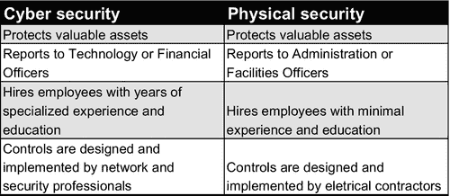
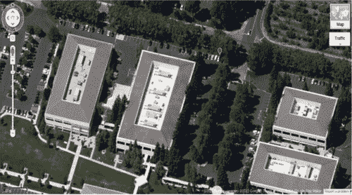
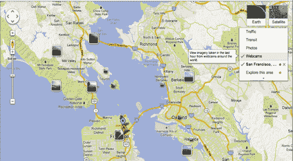
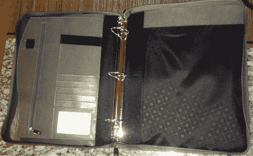
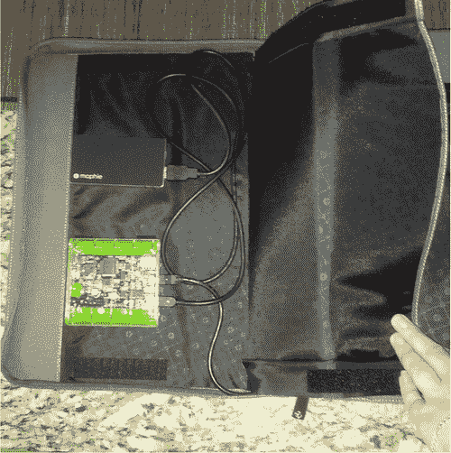
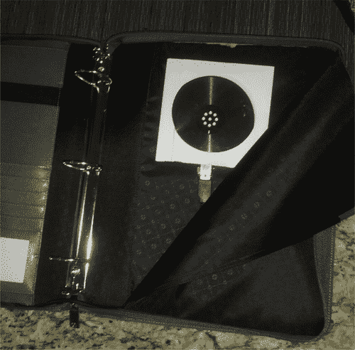
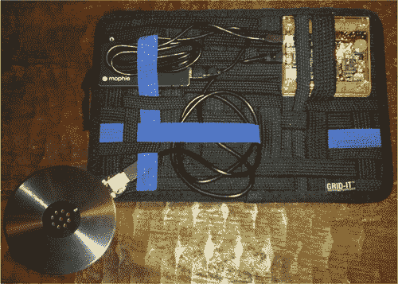
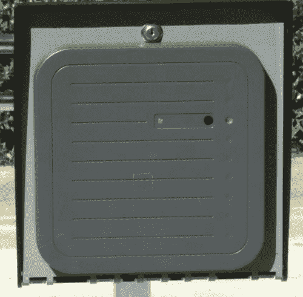
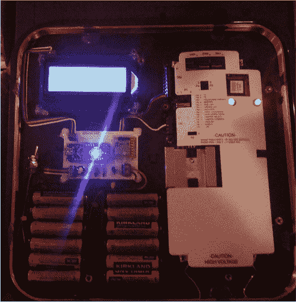

Chapter 8

# 人身安全

<address>

Valerie ThomasSecuricon，美国弗吉尼亚州洛顿

</address>

## 摘要

当有人提到物理安全时，通常会想到栅栏和保安的画面。虽然这些都是组件，但创建物理安全计划还有许多其他元素。在本章中，我们将讨论建筑安全、数据中心安全、物理安全评估以及物理安全对员工的意义。

关键词

物理安全

自然威胁

无意的威胁

人类的威胁

红队

侦察

## 什么是物理安全？

物理安全描述了旨在控制未经授权的人员访问建筑物、设施或资源的安全措施。未授权人员包括希望对受保护环境造成损害的攻击者和意外入侵者，例如可能不知道受限区域[ [1](#bb0010) ]的员工。物理安全可分为三个基本级别:外围安全、内部安全和内部安全。

### 外围安保

建筑红线定义外部周界。对于一些组织来说，这包括一栋建筑；对其他人来说，这是一个由多栋建筑和停车设施组成的校园。保护外围安全的目的是控制谁可以步行或开车进入地产[ [2](#bb0015) ]。

### 内周界安全

内周界由建筑物面向外的门、窗和墙组成。控制进出大楼的人员(和时间)是保护内部边界的目标。

### 内部安全

建筑物的内部构成了内部安全等级。内部安全的目标是仅向授权员工提供对建筑物部分的适当访问。这不仅是为了安全，也是为了员工在含有危险化学品的环境或工作条件下的安全。

## 物理安全层

物理安全层采用各种方法和工具来支持其目的。这些层的一部分将包含在上面讨论的所有三个物理安全级别中。

### 威慑

威慑层包括可以阻止或阻止攻击发生的环境结构。这些例子如下:

■ 栅栏

门

■ 剃刀丝

■T2】减速带

■ 检查站

■ 车辆障碍

■ 车辆高度限制

■ 战壕

■T2】灯光

■ 警告信号

这些结构可以组合起来，集中外围的入口和出口点的数量，并创建多个检查站。

### 控制

物理安全控制是指限制进入受限区域的能力。控制特征被用于所有安全级别。控制可以是机械的、程序的或电子的。例如:

■ 转门或陷阱

■T2】电子卡系统

■ 机械按键

■ 组合保险柜和门

■ 警卫部队授权

■ 签到本

■ 通过安全护卫进入

除了访问控制之外，这些项目中的许多都提供了责任。电子或纸质的签到和签出日志可用作进入受控建筑或房间的证明。

### 检测

当检测到未经授权的访问时，检测和警报系统会触发响应。检测设备的目的是警告物理安全人员可能的入侵。一些例子包括如下:

■ 报警系统或灯光的运动传感器

■ 电子卡系统报警功能

■ 玻璃破碎探测器

如果您的组织雇用了警卫部队，这些设备将提醒他们关注的领域，以便进一步调查。一些组织没有警卫力量，依靠警察对报警系统的反应。

### 识别

识别层侧重于视频监控。虽然摄像机可以用作威慑和检测设备，但它们的主要目的是用于历史分析。如果探测设备发出警报，可以使用摄像机来验证该区域的活动。如果攻击已经发生，视频镜头可用于识别攻击者及其攻击造成的损害。

## 对人身安全的威胁

攻击者不是物理安全的唯一威胁。三种主要的物理安全威胁如下:

■ 外部——通常被称为自然威胁。这包括火灾、洪水、地震、飓风和龙卷风。

内部——这一类别包括无意的破坏行为，如坏的管道或线路、洒出的饮料、操作失误和掉落的设备。

■ 人类——被认为是故意的破坏行为。这些威胁包括盗窃、破坏、蓄意破坏和间谍活动。根据攻击者的目标，黑客可以结合一个或多个这些威胁。

## 为什么物理安全对认知计划很重要

物理安全通常与网络安全分开管理；但是，这两个部门都在保护相同的任务:关键项目、公司基础设施和知识产权。虽然这两个部门保护相同的资产，但网络安全被视为更专业化的职业道路。这种认知造成了安全人格的分裂，如图 8.1 所示。

<figure class="fig">

<figcaption id="ca0010">Figure 8.1 The split personality of security.</figcaption>

</figure>

一个组织可以有一个价值数百万美元的网络安全计划，配备最新的技术和专业人员，但是如果攻击者可以简单地走进他们的大楼并获得网络访问权，那么安全实施就是有缺陷的。正如在第 7 章中提到的那样，物理安全漏洞和社会工程密不可分。员工的物理安全意识对于成功保护组织信息和员工安全至关重要。为了对您的员工进行有关人身攻击的适当教育，我们已经详细说明了红队或身体评估小组在获得对建筑物或校园的未授权访问时将遵循的典型步骤。

## 物理攻击是如何工作的

组织通常雇佣安全公司来执行物理渗透评估。物理渗透测试评估目标设施的控制措施，以防止进入、延迟进入，以及在某些情况下安全部队的反应时间。根据组织最大的物理安全问题，评估目标可能会有所不同。一些示例目标包括:

■ 进入内部周界

■ 进入建筑物的任何或所有部分

■ 获得数据中心或其他高调目标的访问权

■ 通过技术或非技术手段获取敏感信息

■ 获得网络和/或计算机访问权限

物理安全评估的基本过程有三个阶段:侦察、攻击计划和攻击执行。与社会工程攻击类似，评估团队的大部分时间都花在侦察和规划阶段。

### 侦察

高质量的侦察对物理攻击的成功至关重要。设身处地为评估小组成员着想。如果你要未经授权走进一栋大楼，难道你不想在袭击前掌握尽可能多的信息吗？最有可能的是，评估小组实际上并不在目标设施附近。大多数组织不会资助评估小组进行为期数周的旅行，因此需要进行场外和现场勘察。

#### 场外侦察

利用各种因特网资源可以获得关于一个组织的大量信息。在此阶段，尽可能多地收集有关目标位置、物理环境、平面图、日常运营和安全控制的信息，将增加评估团队的成功机会。下面讨论场外侦察的主要领域。

##### 地图

异地侦察的第一步是了解地形。感谢谷歌和必应地图，这比以往任何时候都容易([图 8.2](#f0015) )。这两个地图程序都提供了美国各地的鸟瞰图，在大多数情况下还提供了街景。

<figure class="fig">

<figcaption id="ca0015">Figure 8.2 Aerial image from Google Maps.</figcaption>

</figure>

了解目标设施和周围地区是场外侦察阶段的主要重点。在线地图和街道图像用于

■ 确定周边安全机制，包括围栏、大门和检查站

■ 定位建筑物停车场或车库

■ 识别潜在的进入点，包括门、装卸台和地下停车场

■ 识别垃圾箱的位置

■ 查看周边区域

古老的房地产谚语“位置，位置，位置”也适用于物理评估世界。目标的周围区域在评估动态中起着很大的作用。场外侦察阶段最重要的目标之一是定位潜在的现场侦察区域。如果目标位于被办公楼、咖啡店和餐馆包围的人口密集区，评估小组将有许多现场侦察区域。然而，如果目标位于农村地区，现场侦察选项可能会极其有限。在一些人口密集的地区，您可以利用互联网交通和气象摄像机来接近实时地查看您的目标区域([图 8.3](#f0020) )。谷歌地图为特定地点提供了网络摄像头选项。

<figure class="fig">

<figcaption id="ca0020">Figure 8.3 Camera locations via Google Maps.</figcaption>

</figure>

除了谷歌地图，搜索城市赞助的交通和天气相机也可能提供有价值的结果。

##### 公司网站

虽然公司网站上列出的信息可能被认为是平凡的，但它可以为物理评估团队提供丰富的信息。公司网站上的关键信息包括:

■ 运营时间——通常与客户服务和公共关系电话号码一起列出，运营时间提供了关于目标建筑何时可能是空的或只有最少员工在场的洞察。如果公司网站显示 24/7 客户服务可用，那么呼叫中心的工作人员可能整晚都在现场。

■ 解决具体问题——在此阶段，物理评估团队能否获得平面图还不确定。但是，通过检查邮寄地址或员工目录的详细信息，团队可能能够创建一个楼层地图的路线估计。例如，如果客户服务的地址列为 145 East Main Street，2nd floor，评估小组可以开始创建一个粗略的建筑平面图。

■ 照片信息——照片对评估团队来说是一个有价值的信息来源。公司通常包括他们的建筑大堂区、健身中心、杂货店和建筑的其他公共区域的照片。这些照片可以组合在一起，为评估团队提供建筑物前门后面的基本布局。此外，通过在公司照片的背景中放置安全摄像机、警报面板、ID 卡读卡器和员工 ID 卡，可以收集有关组织安全状况的信息。

##### 其他来源

公司网站和地图程序并不是攻击者唯一有用的信息来源。通常，可以从房地产公司、建筑许可证和社交媒体获得信息:

■ 除了所有权，关于总面积和地产线的详细信息可以从税务记录中获得。

房地产公司——如果目标建筑为房地产公司所有，他们的网站可能会提供该建筑的详细信息，包括健身中心、地下停车场、现场安全监控和租车服务。房地产公司通常有多张建筑物内部和外部的照片来吸引潜在客户。对这些照片进行分析，以获得与公司网站上的照片相似的信息。此外，还可以确定目标组织是租赁整栋建筑还是部分建筑。给房地产经纪人打个电话就能确认房子的可用性。评估小组成员通常将房地产公司视为对租赁目标建筑中的空间感兴趣的虚构企业，并在现场勘察阶段安排参观可用的办公空间。

社交媒体——利用社交媒体向评估团队提供员工名单。搜索 LinkedIn 等流行的网络网站，可以为团队成员提供目标公司员工的姓名、职称和照片。此外，其他社交媒体网站被用来收集和分析由员工上传的照片，这些照片可以提供 ID 卡照片或其他有用的信息。

完成场外勘测阶段后，评估小组将了解

■ 评估范围内有哪些建筑

■ 建筑周边

■ 进行现场侦察的潜在地点

■ 基础周界安全知识

■ 房屋所有权或租赁

■ 营业时间

■ 大堂区基本景观

■ 正在使用的身份证读卡器

■ 可以进入建筑的公共事件

■ 入口街景

■ 潜在吸烟区

#### 现场踏勘

虽然大部分研究发生在场外侦察期间，但现场侦察侧重于观察建筑操作和员工意识。现场侦察阶段的目标是收集足够的信息来计划攻击。

##### 监视

到达目标位置后，团队成员将开车或步行经过建筑物，观察活动水平和观察时间。目标是确定全天不同时间的活动水平。最好在夜间进行首次行驶，因为该建筑不太可能被高度占用。夜间监视的目标包括:

■ 识别警卫部队是否存在。

记录建筑物特定区域的灯是否亮着。

确定下班后清洁人员是否在场。

定位垃圾箱并评估其周围的安全控制。

记录员工是否进出大楼。

如果垃圾箱看起来无人看守，评估小组可能会执行垃圾箱搜索，以检索被丢弃的敏感信息。

日间监控可以全天在多个位置进行。团队成员将分散开来，以便观察建筑的各个侧面。并不是所有的监控都是在车里用望远镜进行的。在人口高度密集的地区，最好的监视位置通常是在公共场所，如咖啡店、餐馆、人行道旁的长椅，或者步行在该区域周围。评估小组成员经常用衣服、帽子和配饰来改变他们的外表，以避免长时间靠近建筑物的一个人受到怀疑。日间监控目标包括以下内容:

■ 确定吸烟区，因为它们是收集信息或尾随进入大楼的理想地点。

■ 记录每个入口的进出观察。员工会为彼此开门吗？

■ 记录大多数员工早上上班，晚上下班的时间。

■ 确定是否通过射频识别(RFID)应答器控制停车场。

如果大楼通过 Zipcar 或 Hertz 等公司提供每小时一次的租车服务，如果有 RFID 标签，就预订汽车并记录下来。

■ 获取员工身份证照片。大多数员工在公共场所，如咖啡店，都会穿它们。

记录警卫人员是否在场以及他们在整个设施中的位置。

■ 记录员工着装。如果团队成员计划扮演员工，他们需要相应地着装。

正如您所看到的，简单地观察和记录建筑物周围的活动可以为攻击者提供有关其安全状况的大量信息。

##### 房地产会议

如果评估小组能够在到达之前安排与建筑房地产代理的会议，只有一两个小组成员将参加会议，以防止引起怀疑。在导游的带领下参观大楼是团队成员观察大楼运作并询问与大楼和办公空间相关的问题的理想机会。如果可能的话，团队将在目标公司所在的楼层选择一个可用的办公空间，并在单独的楼层选择一个额外的空间。评估团队将提出以下一些问题:

■ 大楼需要门禁卡才能进入吗？

■ 各个办公场所需要同一个门禁卡还是单独的门禁卡？

■ 全天候可用吗？

■ 大楼有现场警卫人员吗？

■ 办公室清洁包括在月租里吗？

清洁工什么时候进入办公室？

办公场所有报警系统吗？

除了列出的问题，团队成员还应该询问办公场所的其他细节(与安全无关),以避免引起怀疑。

##### RFID 凭证窃取

许多组织利用 RFID 访问系统来防止未经授权进入他们的设施。这些访问系统依靠 ID 卡和读卡器来验证一个人的访问级别。大多数身份证是基于邻近的。当 ID 卡被举向阅读器时，它接收来自阅读器的电力以验证其内容。门控制器和服务器然后确定出示的凭证是否被允许进入安全区域。读取和复制 ID 卡的内容会危及一些 RFID 出入卡系统。两种流行的 RFID 凭证捕获设备是 Proxmark3 和 Bishop Fox 远程 RFID Stealer。这些设备可以读取和存储在读取范围内的 RFID 卡的内容。这些设备的两个主要挑战是在不引起怀疑的情况下足够接近目标人物，以及运输必要的电源和天线硬件。一些设计包括使用 Velcro 将五金件连接到活页夹的内部。乍一看，活页夹似乎未经修改。然而，隔间隐藏了 Proxmark3、电源和天线([图 8.4](#f0025)–[8.6](#f0035))。

<figure class="fig">

<figcaption id="ca0025">Figure 8.4 Binder to conceal Proxmark3 hardware.</figcaption>

</figure>

<figure class="fig">

<figcaption id="ca0030">Figure 8.5 The Proxmark3 and power supply inside the binder.</figcaption>

</figure>

<figure class="fig">

<figcaption id="ca0035">Figure 8.6 The antenna inside the binder.</figcaption>

</figure>

Proxmark3 的另一个移动设计包括用松紧带将组件固定到组织器上([图 8.7](#f0040) )。这些组织器在市场上有多种尺寸。

<figure class="fig">

<figcaption id="ca0040">Figure 8.7 Proxmark3 with organizer.</figcaption>

</figure>

在移动过程中，组织器将所需的组件和电缆固定到位。然后，评估小组成员将组织者插入一个基本的笔记本电脑套中，以便在不引起怀疑的情况下携带。

虽然 Proxmark3 易于运输，但它可以读取 ID 卡内容的范围大约为 6 英寸。将伪装的标记 3 定位在 6 英寸以内。一个人的身份证是相当困难的，即使在人口密集的地区。为了解决这个问题，毕晓普福克斯公司的员工发明了一种远程 RFID 窃取器[ [4](#bb0025) ]。该设计利用了远程 RFID 读卡器，如图[图 8.8](#f0045) 所示。

<figure class="fig">

<figcaption id="ca0045">Figure 8.8 Commercial long-range RFID reader.</figcaption>

</figure>

设计者修改了设备，使其包括独立电源、数据存储和显示功能([图 8.9](#f0050) )。

<figure class="fig">

<figcaption id="ca0050">Figure 8.9 Bishop Fox Long-range RFID Stealer.</figcaption>

</figure>

修改后的读卡器首先读取卡内容，在 LCD 上显示数据，然后将卡内容写入 microSD 卡，以便在计算机上进行分析。评估小组在现场踏勘时利用 RFID 证件窃取技术收集身份证信息。一旦收集并分析了卡信息，该团队将把适当的电子内容写入 ID 卡。最后，队员会创建一个虚构的身份证打印件，包括队员的照片；贴在编程好的身份证上；并层压成品。这一过程产生的身份证很可能通过基本的视觉检查和访问控制系统。

### 攻击策划

在规划阶段，评估团队分析收集的数据，以确定执行攻击的最佳行动方案。策划攻击的关键决策点包括:

■ 什么时候是进攻的理想时机？

■ 营业时间

■ 工作时间后，当清洁人员在场时

■ 营业时间过后大楼空无一人

■ 什么是初级方法？

■ 冒充员工

■

■ 声称来自电信提供商或供应商

■ 伪装成清洁工

如果第一种方法失败了，第二种方法是什么？

■ 团队成员需要哪些配件来完成分配的任务？

■ 合适的服装(清洁工制服或公司 polo 衫)

■ 与职责相关的工具

■ 身份证

■ 名片

■ 遏制情况下目标公司的授权书

### 攻击执行

攻击执行阶段是物理攻击过程中最短的阶段。在攻击过程中，评估小组成员之间保持联系至关重要。如果主要攻击失败，团队可以立即执行次要攻击。蓝牙耳机和手持无线电是评估团队最常用的通信机制。一旦攻击成功，团队进入内部，典型的步骤包括:

■ 拍照证明团队的成功。

■ 如果团队也在执行网络渗透测试，定制的恶意后门将被上传到拥有提升访问权限的员工的桌面上。这些员工是在人身攻击前通过社交网络被发现的。

■ 获得对服务器机房或数据中心的访问权。

收集公开展示在桌子上、键盘下和文件柜中的敏感数据。

■ 获得高级管理职位。

评估小组通常在现场停留大约 20 分钟，这取决于安全监控计划。一般来说，评估小组在现场的时间越少越好，以避免被发现。

## 最大限度地降低物理攻击的风险

如上所述，物理攻击需要大量耗时的研究。然而，用于策划攻击的大部分信息都是公开的。评估组织遭受物理攻击风险的最常用方法是执行物理安全评估或物理渗透测试。物理渗透测试通常由专业顾问执行，可以突出潜在的薄弱环节。

### 准备身体评估

如果您过去没有执行过物理安全评估，可以采取特定的规划步骤来确保获得满意的结果。

#### 设定目标

明确的目标是物理安全评估最重要的规划项目之一。您最关心您的物理安全计划的哪些方面？共同目标包括以下内容:

■ 进入受控区域，如数据中心

■ 绕过外围安全控制

■ 评估电子安全控制

一些组织选择执行零知识物理安全评估。这种类型的评估不向评估小组提供任何背景信息，并允许小组破坏任何安全控制以获得对尽可能多的设施的访问权。

#### 宣布禁区

列出评估团队无权进入的特定区域。一些组织使用可能伤害评估团队的危险材料。公司总裁办公室经常被宣布为物理安全评估的禁区。

#### 时间表

为评估团队执行攻击选择一系列可接受的日期和时间。确保关键人员(如物理安全总监和 CIO)随时可以确认评估团队的目标，并在发现评估团队时进行识别。

#### 授权书

授权书通常被称为“出狱自由卡”，列出了团队成员的名字以及他们的评估目标摘要。应列出员工姓名(如物理安全总监)和电话号码，以便保安人员联系并核实授权活动。

即使对于最成熟的组织来说，物理安全评估也是一次大开眼界的经历。最重要的是，这是一次实际的学习经历，将为改善您组织的物理安全状况提供有价值的见解。

### 负担不起物理安全评估？

虽然物理安全评估为当前部署的防御机制提供了价值和洞察力，但它们是有代价的。如果您的组织负担不起外部供应商提供的物理安全评估，可以在没有外部帮助的情况下采取一些预防措施:

■ 执行您自己的侦察—您组织的网络或物理安全团队可以执行侦察阶段列出的步骤。这种非侵入性评估可以揭示物理安全程序中的几个漏洞。

■ 完整的安全走查—安全走查是另一种非侵入性评估，涉及审查暴露在办公桌或公共场所的信息。找到几条处理不当的敏感信息可能表明员工缺乏意识。

■ 看着门——简单地观察员工如何进出大楼就能提供关于物理安全意识状态的有价值的信息。如果员工为后面的人开门，执行严格的身份证扫描政策可能会消除尾随。

物理安全不仅仅是围栏和保安。将物理安全威胁纳入您的意识计划将提高您组织的整体安全性。

<footer>

## 笔记

[1] 物理安全[http://www . police . PSU . edu/Physical-Security/what-is-Physical-Security . cfm](http://www.police.psu.edu/physical-security/what-is-physical-security.cfm)【最后访问时间:2014 年 5 月 25 日】。

[2] 如何保护您的建筑和财产[http://biz security . about . com/od/physical security/a/What _ is _ physical _ security . htm](http://bizsecurity.about.com/od/physicalsecurity/a/What_is_physical_security.htm)【最后访问时间:2014 年 5 月 25 日】。

[3] 保护您的系统:物理安全[http://nces.ed.gov/pubs98/safetech/chapter5.asp](http://nces.ed.gov/pubs98/safetech/chapter5.asp)[上次访问时间:2014 年 4 月 29 日]。

[4] RFID 攻击工具[http://www . bishop fox . com/resources/Tools/RFID-hacking/Attack-Tools/](http://www.bishopfox.com/resources/tools/rfid-hacking/attack-tools/)【最后访问时间 2014 年 5 月 26 日】。

</footer>

