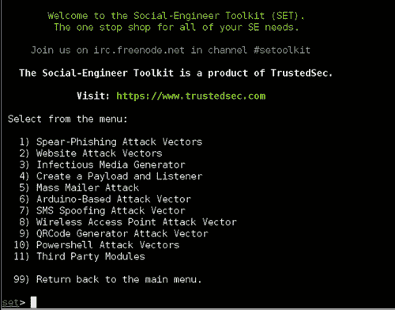
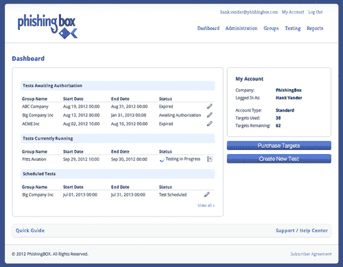
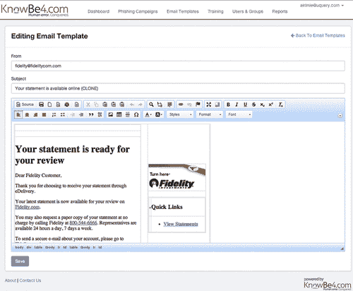
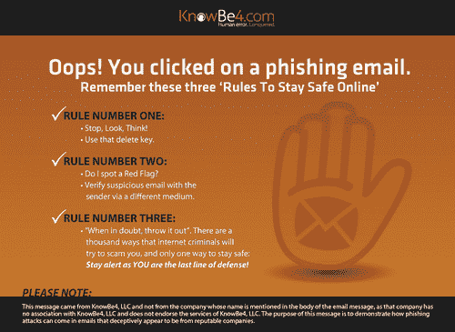

Chapter 11

# 创建模拟网络钓鱼攻击

<address>

Valerie ThomasSecuricon，美国弗吉尼亚州洛顿

</address>

## 摘要

执行模拟网络钓鱼评估可能是一个令人生畏的过程。这一章一步一步地介绍评估，揭开评估过程的神秘面纱。讨论了各种工具和技术，使读者能够为他们的组织选择最佳的工具和方法。尽管工具和技术是该过程的主要部分，但是必须协调其他元素才能执行成功的评估。本章还讨论了模拟网络钓鱼评估的规划和协调要素。

关键词

网络钓鱼

模拟网络钓鱼评估

攻击

协调

报告

## 模拟网络钓鱼攻击

出于多种原因，模拟网络钓鱼攻击在组织中日益流行。如果实施得当，模拟网络钓鱼攻击可以用作培训工具，测试对攻击的抵抗力，并为管理层提供衡量标准。虽然模拟网络钓鱼攻击很有用，但如果您以前没有创建过，它们也可能有点吓人。在这一章中，我们将一步一步地介绍这个过程，并讨论一些有助于这个过程的工具。一开始，模拟网络钓鱼活动可能会让人不知所措。请记住，您不是在一次测试组织中的每个人。这些活动或评估可以很容易地分成小组。

## 了解人的因素

网络钓鱼电子邮件利用人类的各种情绪来达到预期的目的。通常，网络钓鱼电子邮件会制造一种紧迫感，声称如果不立即采取行动，收件人的帐户将被禁用。另一种流行的攻击是电子贺卡电子邮件。这种攻击表示有人向用户发送了一张电子贺卡，用户必须点击链接才能取回。说服员工成为攻击目标的其他策略包括使用他们的名字或发送看似来自同事的电子邮件。

## 方法论

如果您希望将模拟网络钓鱼练习纳入您的认知计划，这里有一个高级方法[[2](#bb0015)]:

■ 通过测试所有员工建立基线

■ 培训所有员工(使用你选择的技术)

■ 继续测试员工

■ 通过嵌入式或持续培训来教育员工

■ 向管理层汇报结果

■ 根据需要进行调整

如果您的组织规模较小，这个事件周期可能需要几周时间，如果您的组织拥有数百到数千名员工，则可能需要几个月时间。

## 开源工具、商业工具还是供应商执行的？

选择评估工具时，需要考虑许多因素，包括

■ 费用

■ 员工人数

■ 内置训练选项

■T2】使用频率

■T2】技术要求

■ 好用

■ 长期指标报告

尽管所有这些因素都很重要，但您组织中的员工数量和分配的预算通常是最大的决定因素。

### 开源工具

开源软件/工具是指“其源代码可供使用并获得许可的软件，其中版权所有者提供研究、更改和向任何人出于任何目的分发软件的权利。”简而言之，它几乎是免费的。因此，通常无法保证软件及其对您环境的影响。此外，支持通常仅限于软件/开发人员/用户论坛和有限的电子邮件回复。虽然单独阅读文本可能会令人害怕，但网络社区中的大多数渗透测试人员、漏洞分析师和其他技术人员都使用一个或几个开源工具来完成他们的工作。在这些技术人员需要的所有能力中，大多数不是由盈利性公司制造的，因此有理由依赖开源社区。

针对网络钓鱼活动最流行的开源工具是 TrustedSec 的 Dave Kennedy 开发的社会工程师工具包(SET)。它被认为是社会工程的"事实上的"工具([图 11.1](#f0010) )。SET 可以安装在网络内部或外部的机器上，这取决于您的社会工程场景。

<figure class="fig">

<figcaption id="ca0010">Figure 11.1 Main menu of the Social-Engineer Toolkit.</figcaption>

</figure>

赞成的意见

除了免费，SET 还为网络钓鱼活动提供各种资源，包括

■

■ 抓取登陆页面输入的密码等信息

■ 提示用户从登陆页面运行程序

■

■ 创建电子邮件附件的能力

■ 与 Metasploit 框架集成高级测试选项

我们会定期发布更新，并广泛提供文档来帮助您入门。总的来说，SET 是一个非常灵活的工具，可以为精通技术的用户开发定制的网络钓鱼活动。

骗局

虽然 SET 是一个强大的工具，但它可能并不适合所有环境，原因如下:

■ 必须安装在 Linux 机器上

■ 基于命令行

■ 需要 Apache web server 和 Metasploit 框架的基础知识

■ 工具本身不存储长期指标。它们必须从报告中记录下来，并保存在其他地方

■ 电子邮件组不存储在工具中，必须单独维护

■ 没有专门的支持中心提供帮助

SET 为用户提供了许多针对网络钓鱼活动的基本和高级选项。不熟悉 Linux、Apache 和 Metasploit 框架的用户可能会发现该工具很难使用。长期用户需要单独跟踪指标、电子邮件组和活动历史。更多关于 SET 的信息可以在 TrustedSec 的网站[http://www.trustedsec.com](http://www.trustedsec.com)找到。

### 商业工具

如果您更喜欢基于图形的工具，商业产品可能最适合您。这些产品主要基于网络，通过供应商的基础设施托管。换句话说，你不需要任何硬件或 Linux 知识就可以入门。网络钓鱼活动工具的市场正在迅速扩大。一些最受欢迎的供应商是 KnowBe4、PhishingBox 和 PhishMe。

赞成的意见

■ 预配置的邮件和登陆页面模板。

■ 能够用图形工具改变登陆页面外观，而不是修改页面源代码。

大多数产品都包含针对未通过评估的员工的内置培训。

产品是基于网络的，所以不需要安装软件。

许多产品都允许你使用公司的邮件服务器。

用户指南和其他文档可用。

如有疑问，供应商可提供支持。

骗局

■ 认购费用

■ 有些产品需要长期合同

■ 通常要求每年发送最少数量的电子邮件

商业工具也使得一次管理多个评估变得容易。[图 11.2](#f0015) 是 PhishingBox 的仪表盘。仪表板突出显示正在进行、已安排或等待授权的评估。选择正在进行的评估将为您提供已打开的电子邮件数量等最新信息。

<figure class="fig">

<figcaption id="ca0015">Figure 11.2 Dashboard Screen of PhishingBox.</figcaption>

</figure>

开始使用供应商工具的最大障碍是导入目标电子邮件地址。大多数工具需要特定格式的电子邮件地址、姓名和部门。如果您选择使用供应商的电子邮件服务器来执行测试，可能需要与您的电子邮件团队进行一些额外的协调，以便将供应商的服务器列入白名单，以确保邮件传递。

#### 选择商业工具

为了选择最适合您组织的工具，您应该对以下问题有所了解(或估计):

■ 你的年度预算是多少？

你想发多少封电子邮件，多久发一次？

您是否希望为未通过评估的员工提供即时培训材料？

你想在你的电子邮件中包含附件吗？

许多供应商提供免费试用许可和现场演示。考虑腾出时间进行现场演示。它不仅为您提供了该工具的概述，还为您提供了就特定特性和功能提出问题的机会。在做出选择之前，评估几种不同的工具。需要记住的一些评估标准是

■ 战役创建的难易程度

■ 邮件和登陆页面模板的质量和数量

■ 修改模板的简易性

■ 自动将名字和部门插入电子邮件的能力

■ 轻松创建自己的电子邮件和登录页面

■ 报表生成和导出选项

■ 长期度量跟踪

■ 邮件群管理

■ 安排电子邮件发送的能力

■ 可用用户指南和文档

### 供应商履约

发起网络钓鱼活动并不适合所有人。如果您的预算支持更昂贵的解决方案，那么聘请供应商来执行评估可能适合您。几乎所有宣传网络钓鱼活动工具的供应商都将网络钓鱼评估作为专业服务提供。一年只执行一次或两次网络钓鱼评估的组织通常会选择这种方法。

赞成的意见

■ 容易实现。

■ 无需购买或订购软件。

许多供应商不需要长期合同。

骗局

■ 最贵的方案。

■ 长期指标跟踪可能不可用。

■ 取决于供应商的供货情况。

尽管供应商将在评估的大部分方面承担繁重的工作，但作为客户，您必须提供一些项目，包括目标电子邮件地址列表和电子邮件发送时间表。最重要的是，您的组织必须在内部进行协调，为评估做准备，以避免安全小组和组织中其他关键职位之间的混乱。

## 开始之前

在这一过程中，业务协调至关重要。在执行网络钓鱼练习之前，必须通知组织中的关键人员，以防止将网络钓鱼练习误认为是真正的攻击。您的首席信息安全官(CISO)必须了解所有计划的和正在进行的演习。公司事故响应小组(IRT)的经理/负责人应在执行之前被告知所有演习。经理可能会选择通知他们的团队，以避免花费时间和资源进行练习。经理也可以选择不通知他们的团队，以评估他们对攻击的反应。

报告对公司网络的黑客攻击/渗透是一件非常敏感的事情。大多数人不愿意承认违规行为已经发生，并试图保持沉默。虽然这可能会为公司“挽回面子”，但总体而言并不能帮助所有公司，因为攻击数据/媒介可能会被传递以防止行业中其他地方的违规行为。除非法律、法规或政策另有明确要求，否则最终决定权通常由公司的首席执行官和/或董事会成员与公司的法律团队和公共关系办公室合作授予。如果要向外部机构报告事故，确保高级管理层参与其中，并遵守适用的法律/政策。

通知服务台经理也是一个很好的做法，因为他们可能会接到目标员工的电话。虽然服务台经理很少通知员工潜在的操作，但他们可以确保处理可疑电子邮件的程序是最新的，以供员工参考。服务台经理报告练习期间收到的电话和电子邮件数量也很重要。

创建一个联系人列表，其中包含相关方的信息。确保每个主要联系人也有一个备用联系人。根据您选择的网络钓鱼电子邮件类型，通知可能会有所不同。例如，如果您创建了一封看似来自人力资源部门的电子邮件，那么人力资源经理应该在网络钓鱼练习之前得到通知。如果员工开始联系原始部门，这种管理层通知可以防止混乱和恐慌。

## 确定攻击目标

模拟攻击可以根据您的需要简单或复杂。它们可以用来测量许多结果，包括

■ 只点击，

■ 在登陆页面点击输入信息，

■ 在登陆页面点击输入密码，

■ 打开一个附件。

如果您的组织没有进行过模拟攻击，那么“仅点击”目标是一个很好的起点。

## 选择收件人

首先选择要评估的员工将有助于确定您想要执行的攻击类型。为了便于管理，可以将员工分组。如果您的组织跨越多个时区，请确保将相似时区的员工分组。在非工作时间收到的电子邮件会被认为是可疑的。对于非技术员工来说，一般或公司特定类型的攻击最有可能导致点击。对于更多的技术员工来说，鱼叉式网络钓鱼攻击更有可能导致点击。

## 选择一种网络钓鱼攻击

如前所述，网络钓鱼电子邮件利用人类的情感欺骗受害者。这基本上意味着，在选择电子邮件主题时，天空是没有限制的。

### 一般

一般的网络钓鱼攻击可以针对组织中的任何人。这些类型的邮件是你最初几封邮件的良好开端。一些主题如下:

■ 您的包裹已经发货！单击此处跟踪交付进度。

■ 任何类型的寻求捐赠的慈善机构。

有人给你寄了一张电子贺卡！单击此处检索它。

许多这样的例子可以在一年中使用，但最理想的是在使用卡片的节日，如情人节和 11 月到 12 月。许多购买的解决方案都有内置的一般信息来帮助您入门。

### 特定公司

有道德的黑客在对组织的网络进行渗透测试时，通常会使用这些类型的攻击。原因很简单，这种攻击很容易构建，而且在大多数情况下都很有效。它们不仅在渗透测试中有效，而且在现实生活中也有效。只需很少的搜索时间，攻击者就可以找到该公司的网站或附属合作伙伴，例如

■ 计时软件厂商或网站，

■ 网络电子邮件网站，

■ 基于 web 的 VPN 网站，

■ 健康福利提供者。

来自这些网站的信息可以用来模仿合法的电子邮件。此外，网站本身可以被复制，以诱使员工在单击网络钓鱼邮件中的链接后输入信息，如他们的用户名和密码。

### 鱼叉式网络钓鱼

据软件公司趋势科技称，91%的网络攻击始于鱼叉式网络钓鱼电子邮件[ [3](#bb0020) ]。鱼叉式网络钓鱼电子邮件的目标是一个人或组织内的一个小组。攻击者搜索大量来源来推断员工的工作职能以及他们与哪些公司、个人或团体有关联，以便创建一个可信的攻击。鱼叉式网络钓鱼邮件

■ 称呼收信人的名字，

■ 似乎是由收件人熟悉的人或供应商发送的，

■ 包括一个带有标志和联系信息的适当签名块，

■ 通常包含受感染的附件，

■ 可以包含一个类似于发送者的网站的链接([abcbank.com](http://abcbank.com)而不是[abc-bank.com](http://abc-bank.com))

虽然其他网络钓鱼电子邮件发送量很大，但鱼叉式网络钓鱼电子邮件发送给的员工很少，通常不到五个。但是，额外的研究时间通常会有回报，因为鱼叉式网络钓鱼邮件的成功率最高。

## 撰写电子邮件

一旦您选择了目标群体和电子邮件类型，就该继续创建电子邮件内容了。以下是创建真实网络钓鱼邮件的一些关键要素:

■ 使用吸引眼球的主语。

在邮件正文中创造一种紧迫感，这将激励收件人采取行动。

■ 包括徽标和其他适用的图像。

确保发件人的姓名和电子邮件地址与你邮件的主题相匹配。

如果你的电子邮件看起来来自某个人，附上完整的签名栏。

对于看似自动生成的电子邮件，请在邮件末尾附上隐私声明。

如果使用供应商工具，可以在图形编辑器中编辑电子邮件外观。[图 11.3](#f0020) 是厂商knowe 4 的合成工具截图。这个特殊的模板包括一个登录页面(单击链接后浏览器将转到该页面)，它显示在右侧。如果您使用 SET，电子邮件内容需要是带有适当 HTML 标签的纯文本格式。

<figure class="fig">

<figcaption id="ca0020">Figure 11.3 E-mail composition screen of KnowBe4.</figcaption>

</figure>

### 格式化链接

除非您使用附件进行攻击，否则您的电子邮件将包含一个链接，供员工点击。链接或统一资源定位符(URL)的外观在评估中起着重要作用。如果网址看起来可疑或拼写错误，员工就不太可能点击。

图形编辑工具可以让你轻松地修改一个网址的显示文本，使其显示为[http://abc.com](http://abc.com)，但一旦点击就会转到【http://cba.com】T2。使用这种技术将教会你的员工如何修改 URL，以及如何在点击之前验证链接的真实目的地。

## 创建登录页面

如果员工点击附带的链接([图 11.4](#f0025) )，将会转到登录页面。如果您的评估目标是记录点击的员工人数，这是显示消息通知员工模拟网络钓鱼评估和展示培训材料的绝佳机会。

<figure class="fig">

<figcaption id="ca0025">Figure 11.4 Basic landing page of KnowBe4.</figcaption>

</figure>

如果攻击目标是确定员工是否会点击并输入信息，那么登录页面必须有接受输入的区域。最常见的输入是帐户密码；但是，您可以定制登录页面以适应攻击目标。所有商业工具都有一个接受输入的登录页面选择。如果您想使用属于您的组织的网页，大多数工具都有导入功能。一旦您提供了网址，SET 将克隆一个网站。

## 发送电子邮件

现在，您已经创建了收件人列表、电子邮件和登录页面，在按下发送按钮之前，还需要执行一些质量控制步骤:

■ 通过向自己发送钓鱼电子邮件，测试电子邮件在您的电子邮件客户端和 web 客户端(如果适用)中的外观。

■ 点击附带的链接，测试登陆页面。如果您的组织使用多种浏览器，则在所有批准的浏览器中进行测试。

■ 通知本章前面讨论的联系人列表中的相关方。包括电子邮件、登录页面和培训页面的屏幕截图(如果适用)。还包括发送电子邮件的日期和时间。

### 时机就是一切

电子邮件发出后，将会对您的评估结果产生重大影响。理想情况下，邮件应该在上午或下午员工可能在办公桌前的时候发出。此外，在安排电子邮件传递时，请记住收件人所在的时区。

每个人偶尔都需要休假。如果联系人列表中的任何人将在评估期间休假，请确保在发送任何电子邮件之前让他们的后备联系人参与进来。此外，负责发送电子邮件和跟踪其进度的人员需要能够回答问题。不要开始锻炼，第二天就不在办公室。

## 追踪结果

所有的工具，商业的和开源的，都有跟踪能力来帮助你监控你的评估状态。虽然个别跟踪功能可能会有所不同，但大多数工具都会指出

■ 如果电子邮件被打开，

■ 如果接收者点击了链接，

■ 如果信息被输入到登陆页面，

■ 如果链接被点击了不止一次。

商业工具将存储每次评估的结果信息，以便在附加评估后进行比较报告。SET 不存储结果信息，因此需要单独跟踪记录，很可能是在电子表格中。当向管理层和其他相关方报告结果以表明后续培训的有效性时，比较报告是关键。

结果跟踪不仅仅包括点击次数。要跟踪的其他重要结果包括

■ 求助台来电举报邮件，

■ 收到向安全部门举报的邮件，

■ 打电话给保安，

■ 打电话给相关部门，如人力资源部

不当报告表明员工不熟悉收到可疑信息后应遵循的程序。培训程序可以调整，以加强适当的程序。

## 评估后跟进

评估完成且所有结果都记录在案后，花点时间与联系人名单上的人进行行动后会议。讨论评估结果以及是否有任何意外结果。使用此信息为将来的评估更改程序和联系人列表。

<footer>

## 笔记

[1] 开源软件定义[http://en.wikipedia.org/wiki/Open-source_software](http://en.wikipedia.org/wiki/Open-source_software)【2014 年 5 月 26 日访问】。

[2] 高效员工钓鱼培训的七个习惯[http://threatsim . com/resources/white-Seven-Habits-Phishing](http://threatsim.com/resources/whitepaper-seven-habits-phishing)【2014 年 12 月 2 日访问】。

[3] 震惊:故障点钓鱼培训不起作用[http://blog . knowbe 4 . com/bid/371048/震惊-故障点钓鱼培训不起作用](http://blog.knowbe4.com/bid/371048/SHOCKER-Point-Of-Failure-Phishing-Training-Does-Not-Work)【2014 年 17 月 2 日访问】。

[4] 91%的网络攻击始于鱼叉式网络钓鱼电子邮件[http://news . tech world . com/security/3413574/91-of-cyber attack-begin-with-spear-phishing-email/](http://news.techworld.com/security/3413574/91-of-cyberattacks-begin-with-spear-phishing-email/)[2014 年 17 月 2 日访问]。

</footer>

