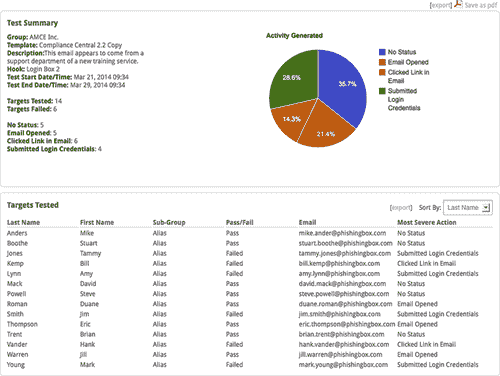
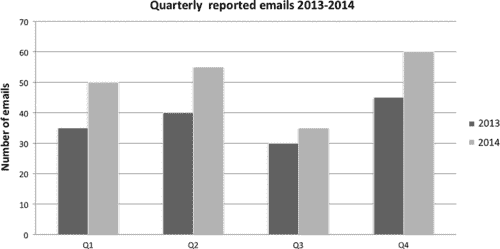
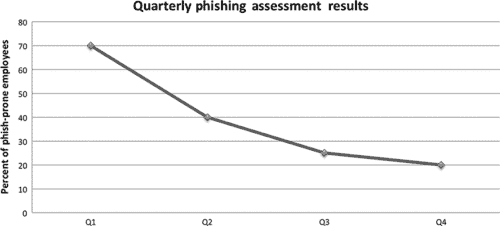
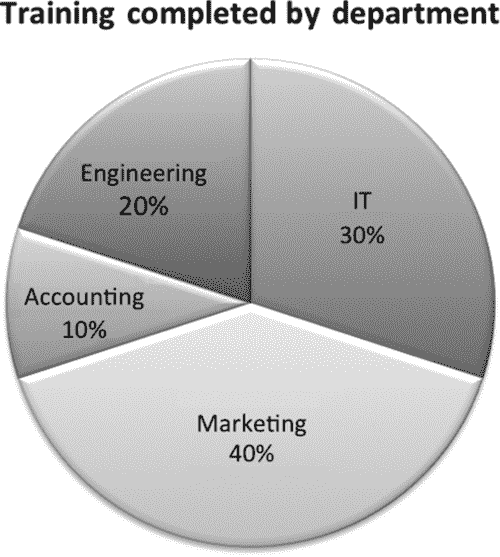

<section epub:type="chapter">

<header>Chapter 13

# 衡量有效性

<address>

Valerie ThomasSecuricon，美国弗吉尼亚州洛顿

</address>

<section epub:type="preamble">

## 摘要

衡量意识计划的有效性可能具有挑战性，尤其是对于那些没有风险管理背景的人。本章包括选择有价值的测量和创建可用的度量。详细讨论了指标的正确报告和呈现，因为这对于获得高级管理层的理解和支持至关重要。

</section>

关键词

测量值

指标

指标计划

图表

报告

</header>

<section>

## 衡量有效性

意识计划中经常被遗忘的部分是跟踪进展和衡量影响的方法。这些指标将用作调整计划和向高级管理层报告进展的指南。如果您的组织有风险管理团队，请咨询他们当前的度量项目。他们收集的部分数据可能会用于认知培训指标。

</section>

<section>

## 测量与指标

这些信息类型通常可以互换使用；然而，它们并不相同。

测量值是通过计数[ [1](#bb0010) ]在特定时间确定的值。测量的一个例子是上个月报告的被感染计算机的数量。

度量是通过对测量结果的分析产生的。指标是在一定时间内进行的两次或多次测量的比较，并与预定的基线[[1](#bb0010)进行比较。例如，第二季度受感染计算机的数量比第一季度增加了 5%。可用的度量取决于准确的测量。

</section>

<section>

## 创建指标

成功的度量项目包括定义明确的度量和获得度量的必要步骤。记录所需的测量和负责人是关键。下面的例子来自 SANS 社区网站[ [2](#bb0015) ]。我们提供了许多认知计划资源，包括一个样本矩阵，网址为[https://www . securingthehuman . org/resources/security-awareness-roadmap/](https://www.securingthehuman.org/resources/security-awareness-roadmap/)。每个指标至少应包含以下部分。

<section>

### 度量名称

指标名称应该是一个高级主题，可以通过一种或多种类型的测量来计算。对于本例，我们将使用网络钓鱼检测。

</section>

<section>

### 什么是测量

测量值是客观的原始数据，这意味着不需要人为解释就可以获得测量值。衡量网络钓鱼检测的标准是向安全团队报告的可疑电子邮件的数量。此衡量标准旨在评估遵循适当程序报告可疑邮件的员工数量。虽然这种测量本身就足够了，但是额外的测量可以提供更多的洞察力。衡量服务台电话或可疑电子邮件的数量也很有用，因为它可以显示没有遵循正确程序的员工数量。

可以收集的测量值数量没有限制。与评估相关的网络钓鱼检测的一些额外衡量标准包括

■ 发送邮件数

■ 打开的邮件数量

■ 点击链接的员工人数

■ 录入信息的员工人数

</section>

<section>

### 如何测量

获取网络钓鱼检测测量值的一种常见方法是进行评估。继续以网络钓鱼检测为例，在每次网络钓鱼评估结束时，将收集向安全部门报告的可疑电子邮件数量的测量值([图 13.1](#f0010) )。如果您使用的是商业工具，每次评估期间发送的电子邮件数量可从报告屏幕中获得。

<figure class="fig">

<figcaption id="ca0010">Figure 13.1 Reporting menu of PhishingBox.</figcaption>

</figure>

</section>

<section>

### 测量时

应在每次评估结束时获取网络钓鱼练习测量结果。如果您的组织执行一年两次的评估，则每半年收集一次数据。但是，并非所有报告的电子邮件都与评估相关。因此，非评估数据应每月收集一次。

</section>

<section>

### 谁来衡量

此指标存在多个信息源。安全小组收集收到的可疑电子邮件的数量。与网络钓鱼评估相关的数据由评估联系人收集。问讯台收集收到的与网络钓鱼电子邮件有关的电子邮件和电话数量。

</section>

</section>

<section>

## 附加测量

既然我们已经介绍了一个示例，下面是一些其他有用的测量方法:

■ 感染机器数量

■ 完成意识培训的员工人数

■ 参加午餐和学习人数

■ 安全意识网站点击量

■ 发送给安全组的一般问题数量

■ 全年员工考试成绩

■ 留在公共区域的敏感文件数量

■ 解锁的无人值守电脑数量

■ 大楼外佩戴胸卡的员工人数

如果您的认知计划是新的，那么您的测量可能会更侧重于部署。即使您的认知计划没有完全实施，收集运营测量对于证明随时间推移的改进也很重要。

</section>

<section>

## 报告指标

指标旨在为查看者提供做出决策所需的信息。但是，如果指标显示不正确，它们将被认为是无效的，并且在认知计划中反映不佳。正确展示指标的秘诀是理解目标受众。

一种流行的演示风格是分层方法。在最高层，高级管理层对提供项目成熟度、成本和收益洞察的高级信息感兴趣。必须表明意识计划对组织的整体安全文化产生了积极的影响。中间层，即中层管理人员，需要部门级别的信息来评估绩效水平和潜在的业务影响。最低层由认知项目经理和人员组成。这一层需要详细的信息，以便调整程序内容，获得更好的性能。

<section>

### 构建您的演示文稿

一旦确定了你的受众并选择了合适的指标，就该开始制作你的演示文稿了。呈现指标的一些关键要素如下:

<section>

#### 简介

提供该计划的简短介绍。如果计划正在部署中，请提供部署计划、关键里程碑和迄今取得的成就的简要概述。

</section>

<section>

#### 指标是如何得出的

从较高的层面解释获得了哪些测量值以及如何收集这些测量值。时间是决策的一个重要因素，所以也要包括测量的频率。

</section>

<section>

#### 指标

如上所述，只包括与您的受众相关的指标。图表是最流行的度量报告样式。然而，图表只有在以有意义的方式描述数据时才有用。为您的数据选择正确的图表类型至关重要。图表的三个主要类别是比较、过渡和组合。

比较图表最适合用来识别数字的高点和低点。两年内每个季度报告的可疑电子邮件数量最好用这种格式表示([图 13.2](#f0015) )。簇状条形图和柱形图是最流行的表示方法。

<figure class="fig">

<figcaption id="ca0015">Figure 13.2 Clustered column chart.</figcaption>

</figure>

转换图表是基于时间的数据理解变化率的理想工具。安全意识网站的访问量和遭受网络钓鱼攻击的员工人数都是转换图的绝佳候选对象([图 13.3](#f0020) )。折线图和面积图最适合表示这种类型的数据。

<figure class="fig">

<figcaption id="ca0020">Figure 13.3 Line chart with data points.</figcaption>

</figure>

组合图表表示数据值如何分解成段。每个部门完成的认知培训最好用一个构成图来表示。许多网络钓鱼评估的详细信息也可以通过这种方式呈现。打开网络钓鱼电子邮件的员工百分比、点击所附链接的员工百分比以及未打开电子邮件的员工百分比可以用一个组合图来表示([图 13.4](#f0025) )。饼图是这类数据最流行的表示方式；然而，也可以使用堆积条形图。

<figure class="fig">

<figcaption id="ca0025">Figure 13.4 Pie chart with percentages.</figcaption>

</figure>

使用在颜色和灰度上容易看到的基本色。虽然鲜艳的颜色选择很诱人，但如果投射出来，通常很难看到。最重要的是，保持幻灯片和报告部分简单。一张幻灯片应该只讨论一个主题。在幻灯片上混合主题和指标通常会分散观众的注意力，使演示难以理解。

</section>

</section>

</section>

<footer>

<section epub:type="bibliography">

## 笔记

[1] 安全指标指南[http://www . docs TOC . com/docs/7264928/Guide-To-Security-Metrics-SHIRLEY-C-PAYNE-DIRECTOR-IT/](http://www.docstoc.com/docs/7264928/Guide-to-Security-Metrics-SHIRLEY-C-PAYNE-DIRECTOR-IT/)。

[2] 安全意识路线图[https://www . securingthehuman . org/resources/Security-Awareness-Roadmap/](https://www.securingthehuman.org/resources/security-awareness-roadmap/)。

[3] 制定有效信息安全治理的指标[http://www . is ACA . org/Journal/Past-Issues/2007/Volume-2/Pages/Developing-Metrics-for-Effective-Information-Security-Governance 1 . aspx](http://www.isaca.org/Journal/Past-Issues/2007/Volume-2/Pages/Developing-Metrics-for-Effective-Information-Security-Governance1.aspx)。

[4] 为数据选择正确的图表类型，[http://www . tutorial 9 . net/tutorials/we B- tutorials/select-the-Right-Chart-Type-for-your-Data/](http://www.tutorial9.net/tutorials/web-tutorials/selecting-the-right-chart-type-for-your-data/)。

</section>

</footer>

</section>