第 1 章翻垃圾箱

黑客窃取机密数据的方式多种多样，但你知道吗？他们甚至不接触网络就能从公司网络上窃取敏感数据。你可能认为我说的是无线技术，根本不需要任何“接触”，但我不是。做一个好的运动员，不要读在这一页的顶端用大的粗体字母写的两个“D”字，并且当我告诉你黑客可以不依靠一点点技术(双关语)完成这一点时，表现出惊讶。或者，不要装模作样，假装不惊讶。事实上，也许你最好继续认为你的个人或公司秘密不会暴露在某个垃圾箱里，等着一个没有技术含量的黑客把它们抢走。在那种情况下，你最好跳过这一章。

# 翻垃圾箱入门

翻垃圾箱包括……*潜入*垃圾箱*寻找有价值的信息。我知道，在这个短语的定义中使用这个短语是不好的形式，但这就是垃圾箱搜寻，或者说*用*来形容它。如今，潜水是可选的。正如下面这张照片所示，我发现一些有趣的东西就挂在外面，等着被人抢走。*

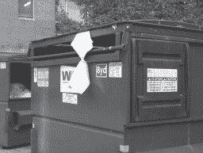

我总是在普通的视野中发现有价值的垃圾，就像下一张照片中显示的保险账单，通过透明的垃圾衬垫可以看到。

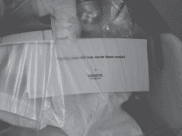

下一张照片显示了一堆属于网络管理员的废弃文档。我用我强大的直觉判断出这些是一个管理员的。

从下一张照片来看，“弗瑞德”显然对他的工作不满意——他正努力在网上冲浪[careerbuilder.com](http://careerbuilder.com)寻找一份新工作。这份打印资料揭示了弗雷德的很多情况。根据这份文件你还能告诉我关于他的什么？

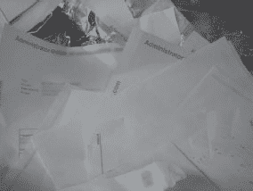

首先，弗雷德很有可能获得了某种四年制学位，否则他不会打印出一份需要那么多学校教育的职位描述。从这个职位的薪水来看，他的年薪很可能不到 8 万美元，他正在寻找一份全职工作，而且他很可能在国防航空业工作。诸如此类的东西让我想写外国情报机构招募傻瓜。忘掉所有寻找目标的名字、电子邮件地址、雇主、教育背景、国防部隶属关系和职业抱负的辛苦工作。要找到有价值的招聘目标，只需要一场无脑的垃圾清扫。

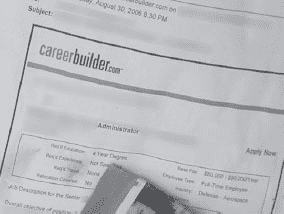

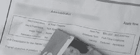

个人信息是一回事，但我也经常发现敏感的公司信息。下一张照片显示了一份采购订单，详细说明了一家公司数千美元的采购。

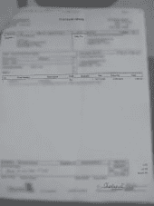

虽然这份表格已经过时，但它列出了大量信息，包括客户的姓名、地址和电话号码、服务描述(这是技术性的，揭示了客户内部工作的信息)以及授权管理人员的签名(如果经理仍然受雇于服务公司，这可能对伪造者有用)。

采购订单不是什么大事，但我认为下一份文件可能是。上面标着“禁止传播”

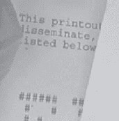

传播是一个如此大的词，我想人们可能不明白它的意思。当需要丢弃(或者我应该说*扔掉)*文档时，这导致了明显的问题。然而令人困惑的短语比比皆是，比如*专有信息。我发现它写在下一份文件上，那份文件躺在一个垃圾箱外的地上。*

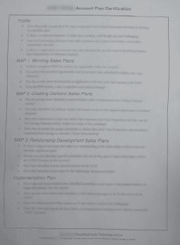

更明确的说法可能是“仅供内部使用”但即使是这个短语显然也有些令人困惑，因为我发现它写在这个现在著名的垃圾箱悬挂文件上。

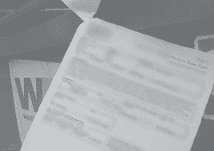

我想我错过了像这样的警告短语的要点。伊尼戈·蒙托亚在《公主新娘》中说得很对，他说“你一直在用那个[短语]。我不认为它意味着你认为它意味着什么。”我投票赞成禁止专有信息和不传播等令人困惑的短语。我赞成在每份文件上打上更清晰的标语，比如“放在停车场，让每个人都可以阅读”至少，到了该扔东西的时候，人们不会搞不清楚该怎么办。

如果你认为走过一个垃圾箱并拿掉里面的东西需要很大的努力，我有个好消息。有时候，如果你真的很幸运，你所要做的就是在刮风的日子里站在停车场里，等着敏感的东西迎面吹来。有一天，我的好朋友迈克在工作中就遇到了这种情况。他拿走了那份令人不快的文件，在发现它不属于他的雇主后，他与我分享了这份文件。现在我在和你分享。

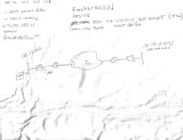

对于没有受过训练的人来说，这一堆乱七八糟的东西可能看起来不怎么样，但是任何一个技术人员都会告诉你，这张地图概括了控制计算机网络所需的一切。(模糊的)IP 地址是一个真实的活动地址，用户名(admin)和密码(模糊的，以字母“G”和“a”开头)提供了作为管理员登录机器所需的一切。另一个写在页面顶部的密码(模糊，以“R0ck3t”开头)提供了对另一个私有 IP 地址(模糊，以“0.57”结尾)的访问，或许还可以访问私有网络上的其他机器。路由和子网图以及诸如包过滤和严格路由之类的术语表明这个涂鸦者在技术上是内行，而诸如 AES128、MD5 和 ipsec 之类的术语表明他或她至少有一定的安全意识，但简单的事实仍然是，这份文件被扔在一边(以及迈克没有费心从空气中取出的其他文件)，好像它不重要。

高科技攻击者可能会花费数小时、数天或数周时间拨弄外部盒子，试图绕过 AES-128 加密和 IPSEC，以访问其背后的专用网络。即使这样，他或她也要努力绕过内部机器的安全系统，才能接触到“火箭”盒子。另一方面，一个没有技术含量的黑客可以在瞬间绕过整个网络的安全，只要从他脸上撕下一份文件，然后把它挂在手上。

幸运的是，这种停车场草料相当罕见。诚然，我只见过少数如此明目张胆的案例。大多数时候，我不得不挑战极限，把头伸进垃圾箱，向里面窥视。我在一个垃圾箱里发现了下一份文件，上面放着一个打开的类似文件的盒子。该文档列出了客户名称、账户信息、销售代表的便捷列表、他们获得的佣金以及他们的社会保险号。一家竞争公司可能对这些文件感兴趣，但一个身份窃贼会对此大做文章。

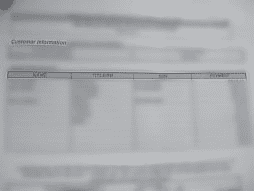

当我发现下一张照片中的垃圾箱时，我很失望，因为它显然刚刚被清空。散落的白色信封看起来无伤大雅，直到我读到红色粗体字的*医疗保健信息*。下一张照片中展示的信封粗糙、撕裂的边缘似乎表明，一些傻瓜在邮件中收到了发票，打开它，塞回信封，然后扔给了像我这样令人毛骨悚然的(有才华的)非技术黑客。如果这是我的发票，我会把它撕碎，然后用碎片来填充我的猫砂盒——这似乎让最热衷于翻垃圾箱的人都望而却步。

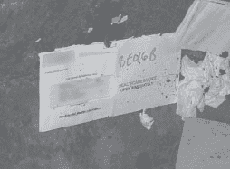

但是白色信封并不是唯一一个出现在垃圾箱里的。我又发现了几个信封，每一个都有相同的红字，意识到其他的信封(就像下一张照片中的那个)都没有打开过，而且每一个都有不同的邮寄地址。

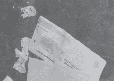

出于好奇，我走到大楼前查看租户名单。果然，建筑指南列出了我在废弃信封上看到的医疗服务提供者的名字。那一刻，我知道这不是一个粗心的病人，而是一个粗心的医护人员。

我依稀记得一些关于立法的事情，这些立法威胁对泄露病人信息的医疗服务提供者进行严厉的惩罚。后来的谷歌搜索(是的，谷歌，而不是雅虎，谢谢)显示，1986 年国内税收服务法的修正案，缩写为 HIPAA(健康保险便携性和责任法案)，涉及病人隐私。具体而言，它说明了“通过制定和执行标准来保护健康数据的保密性和安全性”，并威胁对公然滥用其建议标准的行为处以高达 25 万美元的罚款。虽然我知道这不是一个 25 万美元的罪行，但我知道某个地方的某个人可能会被责骂，知道这家公司在做什么。

你告诉他们了吗？

我有一种感觉，我会把这个边栏放在每一章，但它值得重复。我一直看到这种近乎犯罪的疏忽，但我几乎没有报告过。从道德的角度来看，我知道我应该这么做，但是我很不幸的报道了我的发现。我因为试图做正确的事情而被责骂、被威胁要采取法律行动、被骚扰了太多次。所以现在，我退出了报道游戏。相反，我在我的书和演讲中使用这些照片的编辑版本，以提高对问题严重性的认识。至少通过这种方式，这些照片可以起到某种积极的作用。

那么有什么解决办法呢？首先，提高对垃圾重要性的认识。像下一张照片中的标志是一个很好的提醒。

一把锁住垃圾箱门的锁也是一个不错的选择。

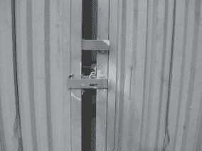

即使这扇门被锁上了，一个积极的捡垃圾者也会跳过栅栏。一把门锁和一把垃圾箱锁结合起来是个不错的主意，但是当涉及到压制危险的垃圾箱文件时，黄金法则是粉碎一切。但是粉碎是一个主观的词。碎纸机种类繁多，每一种都提供不同的安全等级。通用切条碎纸机会将文件碎成垂直的条，这些条可以很容易地重新组合。横切粉碎机将水平切割垂直条。产生的碎片越小，重组文档就越困难。例如，一个基本的条形碎纸机将文件切割成 1/8 英寸乘 1 1/8 英寸的碎片，就像这张照片中显示的那样。

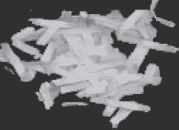

这是一款顶级的超高性能扫描仪，可以将文件清除成 1 毫米 x 5 毫米的灰尘颗粒(见下一张照片)，这甚至会让世界上最好的间谍机构感到沮丧。

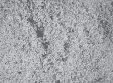

[表 1.1](#tbl1.1) 列出了从最不安全到最安全的碎纸机规格。

表 1.1 碎纸机规格

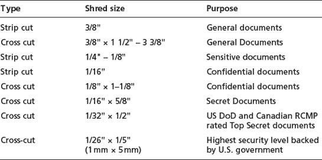

办公用品商店里一台像样的“微型切纸机”售价约为 200 美元，可以将纸张、光盘甚至信用卡切割成 3/32 × 5/16 的碎片，安全性高于一般水平。一般来说，你会得到你所付出的。无论你选择什么，都比把文件完整地扔进垃圾桶或放在停车场要好。

在坏人之前知道你的垃圾里有什么也是很聪明的。如果你负责公司的安全，考虑至少每周去一次你的垃圾箱。感受一下被扔出去的东西，以及当它落在绿色大盒子里时的状况。如果你是一个想要保护自己隐私的消费者，买一个私人碎纸机，和你的家人讨论一下在扔掉之前应该粉碎什么。如果你的家人拒绝服从，你可以考虑重新安置他们。如果它们不是特别吵，你可能会发现盖子上有锁的垃圾箱的另一个伟大用途。

(开个玩笑！)