第二章尾随其后

黑客和忍者走在一起就像…聪明人和隐形刺客。好吧，在现实中，他们真的不会很好地在一起，除非你有一个非常聪明的忍者或一个非常致命的黑客，在这种情况下，我们更多地谈论忍者黑客，这是一个完全不同的品种。别让我开始谈论海盗忍者黑客。但是我跑题了。黑客和忍者都喜欢穿黑色衣服，而且他们都有溜进建筑物和融入阴影的能力。他们还可以一起表演烟雾魔术——让他们毫发无损地穿过墙壁，被一团看起来很酷(但很臭)的烟雾吞没。你说不可能？几乎没有。请继续阅读，因为我揭示了另一个纯粹的，没有技术含量的黑客(忍者)魔术。

附注——我谦卑地向我的 Bujinkan 兄弟姐妹们道歉，因为他们对忍者的描述很老套(但与文化相关)。

# 尾随跟踪简介

尾随简单地说就是跟随一个被授权的人进入一栋建筑——基本上，就是骑在他们的尾巴上。当我建议尾随进入一个名副其实的堡垒时，文斯选择了毛巾把戏。在这种情况下，他的想法更好，但尾随仍然是进入安全建筑的最佳非技术方法之一。尾随已经成为一个家喻户晓的术语，意味着这是一个常见的问题。

几年前，我受命对一个州政府机构进行物理评估。该设施分为两个不同的区域:一个开放区，以适应一般公众和限制区的国家雇员。我们的任务是进入禁区，进入里面封闭的电脑网络。我们最初的侦察显示，开放区和限制区是相连的，但一名武装警卫站在相连的走廊上。通往安全区域的前门也受到类似的保护。装有刷卡器的门(没有一个看起来容易被毛巾欺骗)保护着每个侧门。对我的团队来说，更糟糕的是，带着标记的车辆的武装警卫在停车场巡逻。

尽管一开始被重重的安全措施吓住了，我们还是继续监视，最终找到了宝藏。我们挤在安全区域的侧门附近，发现一群员工一边抽烟一边聊天。我立刻知道我们找到了进去的路。我们前往最近的加油站，在那里我买了一包烟和一个打火机。

我已经准备好以一名电话技师的身份进入这栋大楼。我穿着粗糙的牛仔裤、工作靴和印有电话公司标志的白色 t 恤。我的衣领上别着一个电话公司的员工徽章。我的亮黄色工具箱上有电话公司的标志，透明的顶部露出一小叠品牌付费电话的信息条。工具箱里装满了电话测试设备。一顶破旧的安全帽使整个造型更加完美。

当然，官方的装扮完全是捏造的。我从网上下载了电话公司的标志。我自己用烫印转印纸打印了这件 t 恤。我在家用打印机上打印了这个徽章，然后用一个 2 美元的工具包把它贴在了一起。付费电话条是从一些当地付费电话中解放出来的。手机测试设备是合法的，从各种渠道收集的，就是为了这样一个场合。我发现安全帽被丢弃在路边。它破旧的状况使它更有说服力。

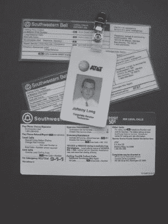

接近这群吸烟者将是一个坏主意，不管我是一个多么好的演员。如果他们看到我从停车场走过来，他们会认为我是局外人。相反，如果他们走出大楼，发现我已经在那里，在烟雾中，他们可能会认为我是从大楼里出来休息的。

这群吸烟的人回到屋里后，我赶紧走到侧门，点燃了一支烟。两名员工最终走了出来，并开始相互交谈。我漫不经心地点点头，加入了他们的闲聊。他们喋喋不休地谈论着公司的政治，我在适当的时候点点头，确保不时地向空中吹气，让他们相信我对香烟很熟悉。我咕哝着电话系统最近出了什么问题。他们笑着同意了(对我来说很幸运)，我试着不被香烟噎住，一直在想我是不是像我感觉的那样变绿了。当他们熄灭他们的烟，他们刷他们的徽章回到里面。我把香烟弹到马路上——这是公司吸烟者的大忌——并为他们开着门。他们感谢我的友好姿态，我跟在他们后面鱼贯而入。让我再说一遍。他们感谢我为他们开门，尽管事实上我刚刚因为他们闯入了他们的大楼。一进去，我就有了自己的方式。

我穿过大楼，从未被挑战。有一次，我甚至走过保安办公室。接待员看到我时显得很惊讶，直到我指着一张空桌子告诉她电话坏了。她不确定电话是否坏了，但她让我进去了。毕竟，我是打电话的。我扑通一声把工具箱放在桌子上，拿起电话，听到拨号音。我摇摇头，把手机放回支架上，从桌子上拿起我的工具箱，还有一叠看起来很重要的文件。我离开办公室，抱怨愚蠢的工作订单，抱怨他们总是给我错误的杰克号码，抱怨这让我看起来像个白痴。接待员咯咯地笑着告诉我随时回来。我想她喜欢我。可能是头盔的原因。

总而言之，这是美好的一天。我们用一系列简单的，非科技的攻击摧毁了另一个堡垒。我们带着一大堆证明我们进去过的文件离开了，我的平装本大小的电脑装载了数百兆的敏感国家数据。员工们从未质疑过我，因为他们认出了我衬衫和徽章上的标志。由于商标和装备看起来合法，我可能是我看起来是谁。但是我故意扮演了一个来自错误的电话公司的技术员的角色。我选择的公司是一家公认的数据和语音服务提供商，但他们不提供本地硬件支持。用外行人的话来说，即使我是那家电话公司的雇员，我也没有权利呆在那里，即使我有，我也不会去测试手机。

归根结底就是扮演一个令人信服的角色。我使用古老的尾随技术进入大楼，然后加入一剂有益的社会工程，与我在大楼里遇到的每个人攀谈。每个员工都对我信以为真，尽管他们中的任何一个人都可以立即阻止这次闯入。

电话技术人员的玩笑并不是我唯一能做的。视情况而定，我可以扮演送货员、电工、水管工、电梯修理工或任何其他类型的服务人员。选择是无穷无尽的。我所需要做的就是在正确的时间出现在正确的地方，展现出令人信服的风度，并打扮好这个角色。找到合适的地点和时间需要耐心。闲聊需要练习。

修饰部分需要更多的工作，但即使这样也是相对简单的。让我们来看看怎样才能得到正确的外观。

## 修整零件

拍张照片会有帮助。起初，我对此有困难。想到人们会被我的跟踪方式吓到，我记得我会尽我所能阻止他们当场抓住我。我在开车时拍摄了这张电话服务技术人员的照片。

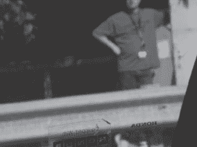

看看我窗户上完美聚焦的贴纸(是的，狂热的非技术黑客，我当时开的是本田)。更糟糕的是，那个家伙看到我给他拍照，并在我开车经过时转过头来看着我。他可能记下了我的车牌号，然后打给了当地的电话技师跟踪热线。秘密行动到此为止。有一次，我甚至走出人行道，走进一排灌木丛，抓拍一张高质量的隐蔽照片，照片上是一个正在靠近的送货员。照片没有出来，但至少我交了一个新朋友。送货员人很好，帮我走出了多刺的冬青树丛。

最终，我学会了听从自己的建议，现在我选择了一个更简单的方法——我只需要*请求*允许我的目标拍几张照片。我礼貌地问(避免那些跟踪者的感觉)，大多数人都很乐意答应我。在某些情况下，我会编造一个我的孩子喜欢大卡车的故事，并问我的目标是否介意摆个姿势快速拍照。毕竟，谁会拒绝一个小孩的幸福呢？下一张照片中的送货员非常乐于助人。我拍了一张他的卡车、他的服装甚至他的员工徽章的照片——足够多的细节来拼凑一个令人信服的送货员角色。

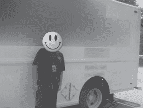

不要开枪打信使！

所以送货员让我给他拍照。如果我用他的照片穿成他的样子闯入某个地方，他应该被解雇，甚至被斥责吗？几乎没有。如果我能打扮成送货员在目标大楼里闲逛，帮助自己快速获取机密文件，那我的目标的安全程序就有问题了。归根结底，大多数人都是从表面上看待这个世界。如果员工在徽章或 polo 衫上看到一个熟悉的标志，他或她会自然而然地认为我就是表面上的那个人。面对一个不熟悉的人在社交上很尴尬，但正如我已经说过的——只需要一个警惕的人就能阻止我的团队前进。

很抱歉，我模糊了下一张照片中所有可辨认的东西，但请相信我的话；是另一家热门快递公司的送货员。

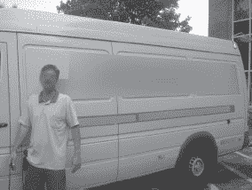

下一张照片中的电话技术人员正在他的笔记本电脑上努力工作，这时我拍下了这张照片。由于他很有礼貌地允许我给他拍照，我选择不去拍他的照片。

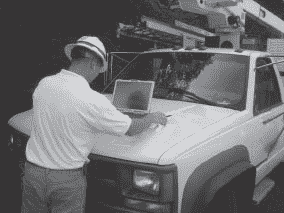

如果我告诉你下一张照片中的一个打电话的人是个骗子，你会怎么想？你能告诉我是哪一个吗？

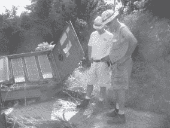

下一张照片里的家伙是燃气和电力技术员还是黑客？他戴着一顶看起来很正式的帽子，上面有恰到好处的汽油和电力标志，他还带着一个电子小发明。考虑到这正是很多天然气和电力公司的员工在做现场工作时穿的衣服，你可能永远也不会知道其中的区别。

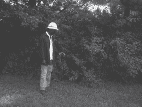

作为最后一个例子，考虑下一张照片中的技术人员。像这样的场景在今天的高科技环境中是比较常见的。他显然在思考一个普通人永远无法完全理解的深层技术问题。在他辛苦工作的时候打扰他似乎很不礼貌，所以我就拍了一些照片。

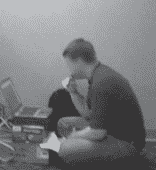

然而，正如下一张照片所示，他不是普通的技术人员。是的，他把他的笔记本电脑接入了 ATM 机。

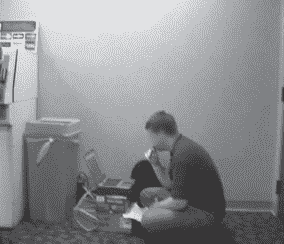

这会不会让他更加怀疑刚才的自己？可能不会。他可能是黑客吗？也许吧。几率表明他就是他看起来的那个人——一个 ATM 修理工，带着 ID 徽章，什么都有。但是不是每个正派的 ATM 黑客都带着某种看起来合法的徽章吗？

作为一个有安全意识的公民，当需要逮捕你的第一个潜在黑客时，你很可能会对这种情况产生严重的疑虑。接近任何核心技术人员都是一个愚蠢的想法。技术人员对这类事情会很生气。此外，如果你打断他的话，他会很生气的，而且他事实上是在努力做他那份报酬很低的工作。另一方面，如果这个家伙有胆量在一个繁忙的走廊里黑进一台自动取款机，他可能会毫不犹豫地说出一个厚颜无耻的谎言来让你离开。如果他真的有本事，他会说服你拿走你的员工徽章，这样他就不会再为保护你的银行账户不受邪恶的自动取款机黑客攻击而与 T2 发生纠纷。

正确评估形势可能会令人眼花缭乱，但幸运的是，你不需要扮演义务警员。如果你觉得有什么不对劲，就告诉有人付钱来关心你。保安、警察、空警、带镜子的特勤局特工和学校十字路口警卫都非常关心保护他们负责的人。即使他们除了保护自己什么都不在乎，他们中的大多数人还是喜欢他们的工作带来的收入。因此，如果你告诉他们一个潜在的安全威胁，他们很有可能要么采取行动，要么在那个特定的坏人结束抢劫时被解雇。不管怎样，让他们有机会做好自己的工作，总比扮演全职的大厅班长要好。我相信你有比惹恼无辜的旁观者更重要的事情要做。

对于那些负责保安、警察、空警、戴着镜子的特工和学校道口警卫的人来说:确保你的人了解足够多的信息，知道如何处理“访客”，他们往往不会选择木板，而是做正确的事情。并且留意那些似乎会引起尾随的情况。例如，下一张照片显示了一名女子刷卡进入美国政府机构的安全门。

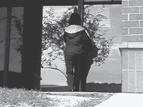

下一张照片显示了大约十秒钟后的同一扇门。

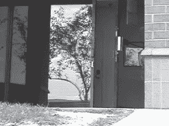

大约 15 秒钟后，门终于关上了，给了入侵者足够的时间溜进去。偷东西的女士不见了。注意这些情况。坏人当然知道。

## 现实世界的尾随练习

尾随描述了跟随一个人进入安全区域的行为，但是进入仅仅是开始。和我一起向你展示典型的尾随会议是什么样子的。我跟随一名员工从侧门进入目标大楼。虽然我跟在那个员工后面，但后来我意识到门甚至没有锁。然而，它确实挂着一个*紧急出口专用*标志。一进大楼，我就准备好了相机。当我这么做的时候，我发现另一个员工在走廊徘徊。我把相机放在腰间，拍下了下面的一系列照片。

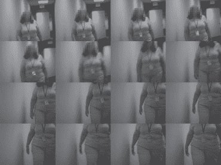

这位女士面容和善，非常有礼貌。我为抓拍这一系列展示她挂绳和徽章细节的连珠炮似的照片感到难过，但她不是唯一一个没有安全意识的员工。我在大楼里拍了一些其他的徽章照片。

当我在大厅徘徊时，我发现这个垃圾袋放在一扇锁着的办公室门外。

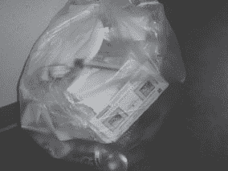

透明的袋子里露出了一堆非常典型的办公室垃圾:香蕉皮、汽水罐、纸盘和美国运通卡。

大楼内的大多数办公室都被锁上了，由感应卡读卡器保护着。选择无技术的方法，我忽略了这些锁定的空间，继续游荡。下一张照片是我在一间办公室套房外拍的。

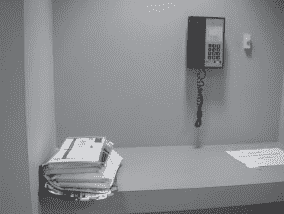

这部手机远没有想象中的有趣。它列出了电话的呼叫功能，而不是方便的个人目录:呼叫等待、电话会议、呼叫转移和呼叫暂留。另一方面，那堆邮件似乎很有趣。由于采取了不干涉的方式，我没有翻阅它，但最上面的信封是另一张美国运通账单。

当我继续在走廊徘徊时，我发现一扇开着的门，看起来像是看门人的壁橱。我斜着身子往里面看了一眼，然后呆住了。

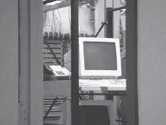

这不是看门人的储藏室，这是一个网络储藏室。这个尾随者的圣杯就在我面前，敞开着，完全无人照管。不仅如此，每个控制台都被登录，允许我对公司的电话和计算机网络系统做任何我想做的事情。我可以安装一个后门程序，植入一个蠕虫病毒(就像约翰·特拉沃尔塔在电影《箭鱼》中所说的那样，一个多头蠕虫病毒可以破解加密，并在整个加密网络中嗅出数字足迹)或者任何我想要的东西。或者我可以选择不那么好莱坞的方式，安装我自己的 WAP 或硬件键盘记录器。不管怎样，该公司的电话、电子邮件和机密信息都在我的掌握之中，无需借助任何高科技攻击。

尽管大多数设施的安全意识都比这个强得多，但在我的职业生涯中，我发起的每一次真实世界的攻击都涉及某种非技术黑客的角度。在日常生活中睁大眼睛，像黑客一样思考，你也会开始看到这些东西。

当然，我模仿的电话公司与此事无关。我和他们没有关系，这次攻击也没有反映出这家电话公司的安全问题。我和我的公司都不认可这种行为，除非是在授权的安全测试中。请不要全身心地对付你在走廊上看到的每一个可怜的电话技师。