第 3 章肩冲浪

哥们儿。在你的肩膀上冲浪？哇哦。不，这不是一个冲浪体操混搭，但它是一项运动——一项黑客运动。当你在键盘上戳出密码时，忘记你所知道的黑客会盯着你的密码。我们说的是 X-Games 版本，黑客只使用他们的大脑吸取笔记本电脑的超级机密数据。这里没有通灵的朋友网络，只有纯咖啡因的黑客独创性。如果你喜欢在你的笔记本电脑上有一个屏幕，这样你就可以看到你在做什么，不要读这一章。因为当你通过一个非技术黑客的眼睛体验肩扛冲浪时，你可能只想把你的笔记本电脑屏幕撕得干干净净。

## 什么是肩部冲浪？

肩部冲浪是一种经典的无技术攻击，其历史和肩部本身一样悠久。很简单的攻击。一个坏人所做的就是从受害者的肩膀上窥视，看看他或她在做什么。在过去的日子里(大约在 1990 年以前)，这种技术被用来在受害者将电话卡数字输入公共付费电话时窃取这些数字。窃贼可以重复使用这些数字来拨打免费长途电话，或者以低于市场价格的价格出售给其他人。虽然现在有更简单的方法来获取电话卡的数字，但是键盘监控技术仍然有许多非常实际的用途。例如，考虑下面的安全屏幕，它出现在办公用品商店的收银机上。

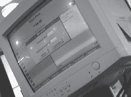

像位于整个商店的所有终端(包括许多客户可访问的终端)一样，这个终端提示输入员工编号和密码。kiosk 允许基于输入的凭证的访问权限。经理显然比员工或客户(通常没有凭证)具有更高的访问级别。对于某些交易，如退回高价值物品，需要经理登录。正如下一张照片所示，熟练的键盘观察者(或手机摄像头用户)可以捕捉到输入的击键。

然后，一个非技术黑客可以在客户终端重复使用这些凭证来做各种有趣的事情。

不要告诉别人这些数字

如果你在每个人的网站上输入密码，要求密码有什么意义？当输入敏感数据时，在按键和走神的眼睛之间制造某种障碍。这可能需要你重新定位你的身体，或者用你的另一只手做一个盾牌。如果你不愿意这么做，为什么还要有密码呢？

不过，键盘数据采集还是很老套。当世界数字化时，肩扛冲浪者将目光从键盘转向键盘，寻找的不是电话卡号码，而是密码。这不是一个简单的把戏。每次我想把它脱下来，我都会想起经典动作*运动鞋。*整个黑客“梦之队”都被一个数学家输入密码的视频片段难倒了。回放录像时，他们最终意识到密码是听不清的——受害者正好挡住了路。幸运的是，这一章不是关于捕捉那些转瞬即逝的密码。这是关于观察和意识到肩冲浪已经超越了看键盘。

## 在盒子外面

在我们开始真正的肩部冲浪技术之前，让我们先来谈谈通过观察机器本身来描绘一个目标是多么容易。考虑下一张照片中的旅行者。

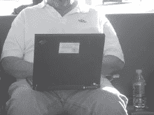

一个真正的技术人员可能已经仅仅根据机器的设计和背面的端口推测出了 IBM ThinkPad 的年龄和型号。黑客可能会在机器后面转来转去，瞥一眼屏幕，试图了解这个目标的更多信息。但是一个正派的非技术黑客(或者一个精明的观察者)会检查贴在笔记本电脑盖上的名片，上面显示了目标的姓名、公司、职位、地址、办公室电话和手机号码。胶带粘名片现象正变得相当流行。这些天我到处都能看到他们。这是我在野外捕捉的另一张照片。

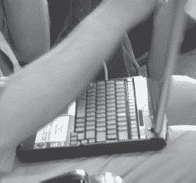

与胶带名片相对的是公司提供的库存标签。很多时候这些都是简单的微小条形码标签，但有些(像下一张照片中显示的)更大，透露了相当多的信息。

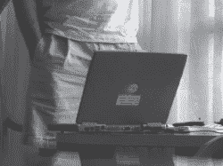

看看我在下一张照片中捕捉到的无可争议的公司粘贴之王。

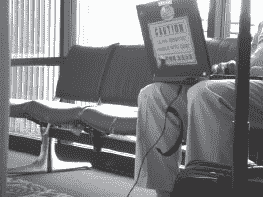

这款可怜的笔记本电脑不仅贴着公司库存标签，还装饰着一个公司标志和一个超亮的橙色标牌，上面用英文写着“超敏感”，我猜是中文。即使是一个不识字的笔记本电脑窃贼也可能会发现这台笔记本电脑值得一偷。这引出了重要的一点。虽然笔记本电脑贴纸可以用来描述受害者，但它们也可以用来标记笔记本电脑的价值，使所有者成为盗窃或身体暴力的目标。我想起了我在实地看到的美国政府的“机密”、“秘密”和“绝密”标签。虽然我理解这些贴纸在混合分类的政府环境中的实用价值，但我在野外已经看到太多了。即使是良性的“非机密”标签也表明该设备在政府空间内或周围使用，使该设备成为小偷、间谍和 UFO 阴谋论者的目标。

对贴纸说“不”

那些贴纸必须被去除。如果你不得不把它们放在你的装备上，考虑在旅行的时候在上面贴一张便条。这至少可以让贴纸(以及可以从中推断出的信息)不被过于好奇的人看到。

关于贴纸的非技术性讨论不可能不提到其中最著名的一种:便利贴。我说不清我在旅行中见过多少便利贴。它们经常出现在显示器和桌子上，并且几乎总是包含非技术黑客可以利用的有趣信息。我发现下面的机器无人看管地停在一家豪华酒店的装货区。

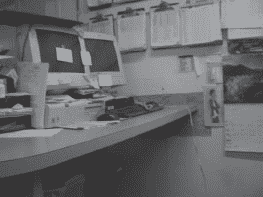

不要在意填满每个角落和几乎每一平方英寸墙壁空间的文书工作。试着把注意力从没上锁的文件柜转移到电脑系统和那些华丽的便利贴上。在我看来，大多数都是无用的，但其中一个包含了看起来像登录凭证的东西，它(从网络电缆来看)通过了酒店网络的认证，也就是为客人注册数据库提供服务的网络。一个没有技术含量的黑客可以在不接触任何一台机器或犯下任何罪行的情况下收集大量信息。如果有人在房间里抓到他呢？他只是一个困惑的客人在找洗手间。祝你好运证明事实并非如此。

# 肩部冲浪的绝佳地点

有很多很棒的冲浪地点，但是有些比其他的好。首先，我们来谈谈机场。

在机场，第一次肩膀冲浪的机会发生在办理登机手续的时候，尤其是在自助值机亭，我们会在第 9 章中详细讨论。在办理登机手续的过程中，登机亭清晰地显示旅客姓名、目的地、座位分配和常旅客号码等信息。安全检查站也提供了一个独特的(也是令人不安的)机会，让 TSA 的工作人员在他们工作的时候肩并肩地冲浪。

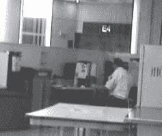

由于在安全检查站附近给 TSA 特工拍照不是一个明智的想法，一个没有技术含量的黑客将不可避免地走向行政休息室，在那里他要么合法进入，要么通过社交工程进入。这些休息室经常挤满了高调的人，做着高调的事情，他们中的大多数人都不知道肩冲浪。

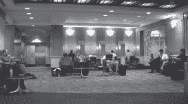

由于背靠背的座位安排以及川流不息的疲惫旅客带来的喧嚣和分心，在登机口也能享受到极大的乐趣。下面的照片就是在这种环境下拍摄的。

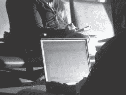

尽管角度尴尬，灯光恐怖，但屏幕仍然完全可读(我对屏幕进行了模糊处理，以保护用户水晶般清晰的 Outlook 电子邮件会话)。半私人信息亭提供了更好的照明，让相当远的冲浪者更加容易。在下一张照片中，负责收购的副总裁没有注意到我的存在，他正在啄出一封机密的跨部门邮件。

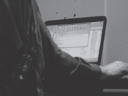

机场内外的休息室也提供了很好的冲浪机会，如下图所示。

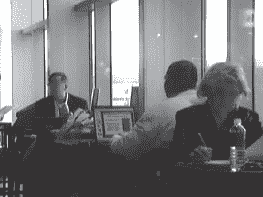

虽然机场系统很难成为大多数非技术黑客的目标，但人们不可能不注意到无人值守的机场工作人员工作站。下一张照片中显示的航空公司 Sabre 系统实际上是在乞求修补。

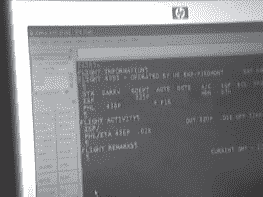

咖啡店是肩部冲浪者另一个喜欢去的地方，如下几张照片所示。

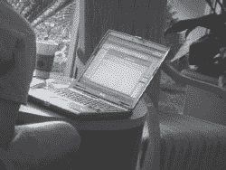

似乎环境越舒适，顾客就越不小心。我亲眼目睹了从建筑设计(见下一张照片)到机密电子邮件，再到在咖啡店里编辑的政府提案文件，其他非技术黑客还告诉了我一些更有趣的事情。

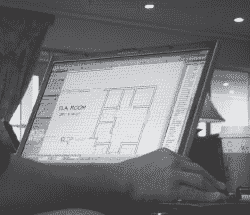

商务休息室为信息亭黑客(在第九章中讨论过)以及肩膀冲浪者提供了巨大的机会，如下图所示。

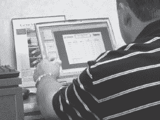

如果它足够重要，可以在酒店的商务休息室工作，那么它可能非常重要。肩部冲浪者知道这一点。保持警惕。

保守秘密，保证安全

抱歉，我引用了《指环王》中的话，但是甘道夫说的没错。不要让你的私人物品被公众消费。不要在公共场所处理你的私人物品，也不要让自己成为众矢之的。注意你正在展示的个人资料，如果有必要的话，可以低调一点。如果你不得不在公共场合处理私人事务，考虑一个笔记本电脑隐私过滤器(试试谷歌搜索“笔记本电脑隐私过滤器”)。当然要记住，一个有经验的肩膀冲浪者会看到一个隐私过滤器，并正确地假设你正在做一些敏感的事情。因此，仅仅是过滤器的存在就可能使您或您的机器成为攻击目标。我有没有提到把私人物品放在公共场所之外？那是你最好的选择。

# 电子推演

信息当然比硬件更有价值，职业小偷都明白这一点。虽然一个业余窃贼可能会根据电脑的使用时间和硬件规格，对笔记本电脑等物品的相对价值有相当的了解，但专业人士通常会使用非技术手段，通过分析机器用户来确定存储在机器上的数据的相对价值。我们已经看了一些有趣的外部线索，但是描述机器所有者的最好方法是看一下屏幕。

StankDawg([http://www.stankdawg.com](http://www.stankdawg.com))发布了一篇题为*电子演绎的艺术*([http://www.docdroppers.org/wiki/index.php?title = The _ Art _ of _ Electronic _ Deduction](http://www.docdroppers.org/wiki/index.php?title=The_Art_of_Electronic_Deduction))探索了攻击者可以用来从有趣的电子来源收集信息的方法。从他的论文中得到启示，看看下面这张我在咖啡店发现的暂时无人看管的笔记本电脑的照片。

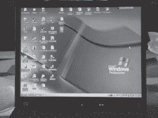

我修改了图片以保持所有者公司名称的机密性，但是通过使用屏幕上的信息，一个熟练的非技术黑客可以收集到大量的信息。首先，桌面背景表明笔记本电脑运行的是 Windows XP Professional。其他美学线索，如开始按钮配置支持这一点。机器的操作系统是技术攻击者用来确定攻击类型的必要信息。通常，攻击者需要分析一系列网络数据包响应来确定这些信息，但在这种情况下，这是不必要的-笔记本电脑的所有者不太可能安装了另一个操作系统的桌面背景。关注桌面上的图标，我们可以立即推断出用户工作的公司，因为一个图标(上图中模糊不清)清楚地显示出来。下面的图标帮助我们推断更多。

单词 *sales* 表明这是某种销售软件，但谷歌搜索显示 SalesLogix 是中端市场 CRM(客户关系管理)软件的领导者。搜索继续说 SalesLogix 是“网上最强大的销售工具。”我们可以很有信心地推断，店主是做销售的。下面的图标指的是 *SAP，*一家常见的商业软件解决方案提供商。

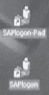

SAP 登录客户端的存在表明服务的登录凭证也可以安装在笔记本电脑上。如果一个小偷偷走了这台机器，他或她很有可能能够使用存储的凭证登录到公司的 SAP 系统。下面的图标标题为 *SecuRemote。*

谷歌搜索显示 *SecuRemote* 是一个虚拟专用网络(VPN)客户端。与 SAP 登录软件一样，所有或部分 VPN 凭据可能位于笔记本电脑上，从而允许对手访问公司网络。至少，对于技术攻击者来说，特定品牌 VPN 的存在本身就是有价值的信息。

下面的图标显示机器上已经安装了 Palm 个人数字助理(PDA)软件。所有者可能拥有一台 Palm 设备，该设备的内容很可能已经备份或同步到笔记本电脑上。

下面的图标显示了美国电话电报公司全球网络客户端的存在。

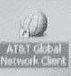

同样，该网络客户端可能有缓存的凭据，这可能允许拥有笔记本电脑的对手以机器所有者的身份登录。下面显示了一个不幸命名的图标。

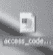

我只能希望这份文件不包含任何实际的访问代码。那会让坏人的工作变得太容易了。

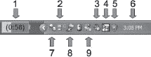

桌面图标提供了大量信息，但是技术娴熟的攻击者可以通过查看屏幕上的其他细节了解更多信息。比如看下面的任务栏能确定什么信息？

这个任务栏本身揭示了大量的信息。布局显示我们看到的是现代版的 Windows，很可能是 Windows XP。但是每一个图标都有它的含义。你能认出几个？以下是每个图标所代表的含义。

1.  这是电池指示器，它显示这台机器是一台笔记本电脑，还有 58 分钟的剩余电量。我们可以判断机器没有插入电源，因为电池旁边没有电插头图标。
2.  此图标表示机器已连接到无线接入点(并与之通信)。第三个图标。
3.  该图标表示系统扬声器静音。
4.  这是 IBM *硬盘主动保护*程序的图标。它显示该机器是一台 IBM 笔记本电脑，并且没有检测到系统冲击(该机器最近没有被摔过)。
5.  此图标代表 Microsoft 安全中心，该中心目前已被禁用，这意味着计算机的安全级别低于最佳水平，可能容易受到攻击。这也验证了机器运行的是现代版本的 XP。
6.  这是系统时钟，设置为下午 3:08 点。该信息可以与当前的本地时间相关联，以帮助确定所有者所在的时区。如果不是设定到他们在哪里，就是设定到他们从哪里来。
7.  此图标属于 Trillian 即时消息程序。Trillian 网站([www.ceruleanstudios.com](http://www.ceruleanstudios.com))将该程序描述为“一个全功能、独立、可换肤的聊天客户端，支持 AIM、ICQ、MSN、Yahoo Messenger 和 IRC。”它接着说“它提供了原始网络客户端不可能提供的功能，同时支持标准功能……”通俗地说，Trillian 是即时消息客户端的替代品。图标的样式表示 Trillian 已连接并登录。
8.  这是一直流行的 AIM (AOL 即时消息)图标，它的风格表明程序连接到服务器，用户已经登录。
9.  这个图标属于微软即时通讯软件(MSN)，它的风格表明程序正在运行，但用户没有登录。
10.  如果这个人同时运行 Trillian、AIM 和 MSN 看起来很奇怪，那么你就发现了一个有趣的地方。Trillian 软件使 AIM 和 MSN 客户端成为冗余。因此，除了这个人可能在所有错误的地方寻找爱情之外，他或她可能并不那么专业——似乎没有什么理由同时与 AIM 和 Trillian 联系在一起。这些客户端的活跃使用为观察者提供了更多研究的理由，因为 MSN 和 AIM 都要求用户在线注册账户，并创建个人资料，其中可能包含个人信息。就附加组件和创建的在线档案而言，雅虎的即时通讯客户端是目前最臃肿的。雅虎用户必须非常小心，不要透露太多的个人信息。

即时消息档案陷阱

我们可以写一整本书来讨论使用即时通讯程序对隐私的影响。注册账户时，新用户会创建黑客或身份窃贼可能发现的各种数据踪迹。虽然我们没有足够的篇幅在这里讨论所有潜在的陷阱，但是请理解，如果您担心您的隐私，配置不佳的 IM 客户端是个坏消息。

对这个 IM 用户的在线调查至少需要一个用户名。如果一个聊天窗口是打开的，就像下面 StankDawg 提供的那样，用户的名字就会出现在窗口顶部的普通位置。

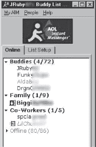

有了登录的用户名，观察者可以开始在线信息收集练习，以描述机器的所有者。这个练习还包括搜索目标的好友信息。有了一个填充良好的好友列表(如下图所示，也是由 StankDawg 提供的)，观察者可以深入研究目标的个人生活，从最不注重隐私的好友的个人资料开始。

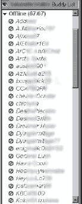

有时候，好友列表上的名字远没有好友列表本身重要。StankDawg 提供了雅虎即时通讯好友列表，如下所示。

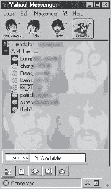

很明显这个用户是披头士的粉丝。社会工程师可以利用这些信息作为对话的开始。正如 StankDawg 所说，观察者可以创造“优势证据”,利用看似无用的巧合证据来建立目标的轮廓。当这些证据来自多个来源时——截屏、肢体语言、着装、习惯等——观察者可以建立一个潜在目标的惊人准确的轮廓。

但是任何以这种方式建立的档案都可能有缺陷。最优秀的非技术型黑客意识到了这一点，并且不会忽视任何证据。考虑下面显示的扩展任务栏。它是我们上面讨论过的即时通讯工具爱好者任务栏的扩展版本。

有很多以前看不到的有趣图标，但标有箭头的那个特别有启发性。洋葱图标代表 Vidalia，这是一个包含 Tor(洋葱路由器)和 Privoxy 的包，这两个工具用于匿名用户的互联网活动。使用 Privoxy Tor 上网的用户可以完全匿名地进行冲浪。远程网站无法判断用户来自哪里，任何嗅探本地网络流量的人都无法看到用户的去向。这个由不超过 40 个像素组成的小图标，告诉了这台机器的用户很多信息。用户不是不知道自己 MSN 目标的愚蠢的网络冲浪者。至少，他或她是一个隐私倡导者，在最坏的情况下，他或她是邪恶的。这种猜测可能会被误导，但最优秀的非技术黑客可以准确地将所有这些有趣的花絮提取为事实，然后根据这些事实做出决定——所有这一切都在令人眩晕的短时间内完成。

啊！都太过分了！救救我！

最好的防御是在旅行时保持警惕。不要把自己置身于邀请肩膀冲浪者的场合。使用机器时，背对墙壁，切勿让机器无人看管。不要佩戴公司标志。从您的移动计算设备上删除无关的标记和信息，尤其是当您的公司名称可能会吸引对手时。你公司的技术支持人员可能会给你提供一长串旅行时要避免的技术问题。听从他们的建议。

电子演绎绝对是一门艺术。我们可以一页接一页地写满这个主题，但要明白我们在这里得到了什么——实际上你屏幕上的每一平方英寸都包含了非技术黑客感兴趣的东西。如果你的机器上有可能吸引小偷或非技术黑客的东西，那就不要让它出现在公众面前。让自己成为目标是没有意义的。

# 黑仔现实生活冲浪会议

## 军事情报

解释一个没有技术含量的黑客脑子里在想什么的最好方法就是向你展示。在这一节中，我们将看看一些现实世界中的肩部冲浪。第一个例子以下一张照片中的人为中心。

很明显他是美国军方的一员。他制服上的徽章和补丁暴露了很多，特别是对那些有军事知识的人。虽然某些对手可能会因为他的军事背景而对他感兴趣，但任何非科技黑客都可以通过观察这个家伙周围的装备学到很多东西。

首先，很明显他是 Mac 用户。他用的是 Mac PowerBook，他的白色耳机是 iPod 的标志性产品。屏幕外的《Mac Addict》杂志敲定了这笔交易——他是名副其实的苹果粉丝。仔细观察发现他也是个游戏玩家。他的 dock 中的图标(如下所示)意味着他已经安装了魔兽世界(WoW)和 Ventrillo 语音通信软件。

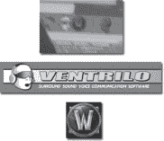

一名社会工程师可能会利用这一知识，选择让他参与一场惊叹或敲打窗户的对话。但是许多非技术黑客会避免社会工程，除非它是绝对必要的。通过靠近冲浪这个家伙，对手可以学到很多东西，我们会看到。

但我不得不说，我很惊讶地发现这个特定的目标，他背对着世界，戴着耳机，特别是考虑到我最近发现的“RoadWarrior”指南。

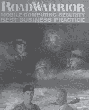

本指南包括一张方便的可撕下的钱包卡，提醒“出差族”注意“防止公开展示内容:肩部冲浪”该指南还继续提倡成为“一个警惕的旅行者”

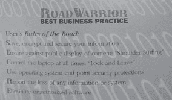

不过，从下一张照片中你可以看出，靠近这个家伙很简单，这要感谢他刺耳的耳机和他面向角落的位置。

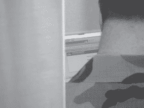

事实证明，他不是随便在网上冲浪，而是登录到 BEA WebLogic 服务器的管理控制台。鉴于 Weblogic 是重量级的工业级软件，可以肯定他正忙于工作——甚至可能是美国政府的公务。当他输入证件时，我快速调整了相机，又拍了一张照片。闪光灯开了，目标猛地转过身，终于注意到了我。我低头看着镜头，揉了揉眼睛，假装被自己的闪光灯弄瞎了。他耸耸肩，继续他的工作，确信，我想，我是某种数码相机的新手，刚刚弄清楚的绳索。这位公路战士不想让认为我在给他拍照。这当然会给他带来各种不愉快。因此，他做了大多数便携式电脑用户都会做的事情——假设最好的情况，然后继续工作。这使得非技术黑客的工作变得更加容易。

往下扔！

我并不是建议你用身体去对付每一个可能用肩膀撞你的怪人。我的建议是，如果你认为你是一个目标，而对其他事情感兴趣，比如啜饮你的咖啡，你就关闭你的机器。大多数非科技黑客会知道他们已经被抓了，然后继续前进。如果他们这样做了，在他们离开的时候随意的看着他们，并在他们离开之前试着好好看看他们和他们的车/自行车/滑板/赛格威。当他们清理完毕后，看看你正在做的事情，考虑一下所有的事情，并采取相应的行动。如果你的冲浪者在你合上盖子后没有离开，无论如何要注意他或她。如果他或她继续表现可疑，做点什么。通知经理、保安或大堂班长。做某事。如果那件事涉及到身体暴力，就不要告诉法官是我的主意。

## 客机间谍活动

我们的下一个例子发生在 30，000 英尺高的商业客机上。飞机是很难进行冲浪的地方，因为冲浪者通常局限于观察他周围的人或者在洗手间周围的过道里，那里是乘客经常出没的地方。在陌生人的肩膀上盘旋会让便衣空警紧张。

因为我在旅行中几乎没有睡过觉(谁能在做这些没有科技含量的黑客工作时睡觉呢？)我醒着，赶上了隔壁的深夜笔记本电脑派对。起初，我并不感兴趣，因为我坐在对面靠窗的座位上，而我旁边靠过道的座位被一个清醒的、咖啡因过量的陌生人占据了。尽管如此，当我的邻居站起来去洗手间时，我还是无法抗拒大开大合的拍照机会。我关掉闪光灯，拍了下一张照片。

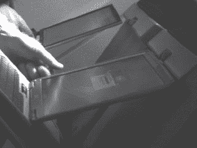

这张照片很无聊，角度也太尖锐了，但是当我仔细观察这个家伙时，我意识到他的整个行为举止都在向政府叫嚣。他的翼尖很好，但不太好。他的活页夹肯定是政府发行的，我偷看了一眼他的笔记本电脑包，发现了看起来像是某种政府徽章的东西。我又无动于衷地看了一会儿，直到我的盖帽邻居回来。当他坐到座位上时，他抓起一本飞行杂志，开始翻阅。以为我的冲浪游戏结束了；我合上相机，试图找些更好的事情做。我记得感觉如释重负。不管这个课程有多好，冲浪仍然是一项艰苦的工作。但正如命运安排的那样，这场游戏并没有完全结束——它才刚刚开始。美联储拿出一个笔记本，里面塞满了看起来很有趣的文件。从飞机的另一侧拍摄这些文件似乎有些棘手，但我举起我的夹克组成了一个即兴的幕布，按下变焦，快速拍摄了一张照片。似乎没有人注意到。

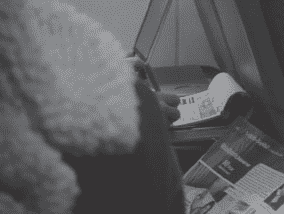

越来越多的文书工作浮出水面，我感到被它吸引住了。虽然我不是那种经常跟踪政府雇员的人，但我只知道这家伙正在做一件意义重大的事情，而且他似乎并不在乎谁在看他做这件事。我接受了他的邀请，并最终瞥见了一个有趣的首页。我无法快速拿出相机拍下下一张照片。

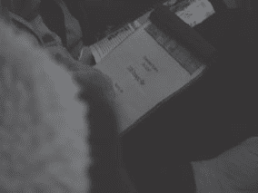

这一页(用 monster header 字体书写)写着*政府系统 EW/SIGINT 2006 战略计划。*任何一个业余的谷歌搜索者都会告诉你,“EW/SIGINT”在军事术语中是电子战信号情报的意思。当我意识到我在 30，000 英尺的高空浏览政府 2006 年的电子战信号情报战略计划时，我感到我的脉搏加快了。我立即停止给我那位粗心的美联储朋友拍照，从那以后就一直被黑色直升机跟踪。不过，我并没有被吓到，因为现在我知道如何用一块便宜的电子表和一片胶带来破坏他们的电子系统。虽然有时候晚上我妻子会抱怨噪音。

### 抢劫银行

凭借其电子和物理安全系统，银行位列高安全性目标的前五名。但是我在这个行业学到的一件事是，即使最好的安全系统也有一个共同的缺陷:懒惰的人类。在下一张照片中，当我漫步经过银行时，我真的无意抢劫银行。

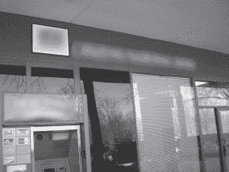

但是当我走过前门时，我瞥见银行经理坐在他角落的办公室里，正在操作他的电脑系统。我停下脚步，转过身透过窗户看着他。虽然他在我的视线范围内，但他似乎没有注意到我。我拿出我的(一直带在身边的)相机，后退一步，拍下了下一张照片。

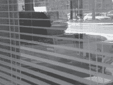

他没有注意到我的存在，转过身，开始伏案处理一些文件。还是站在同一个位置，我把相机拉近，抓拍了一张他屏幕的照片。我查看了图像，意识到摄像机聚焦在他的百叶窗上，使得屏幕上的文字完全不可读。经理继续在他的办公桌前工作，所以我调整了焦距(这花了我一点时间，因为这是我很少必须做的事情)，并拍了几张照片。最终，我得到了一些像下面这样的，非常清晰地捕捉到了屏幕上的文字。(盒子内部的区域没有改变——为了保护无辜，我模糊了其余部分。)

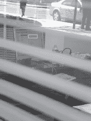

当我站在那里，在我相机的液晶显示屏上阅读银行经理的屏幕时，我意识到——从银行偷钱是如此的愚蠢。银行储存的信息远比它们金库里的实际流动资产更有价值。职业罪犯和业余身份窃贼都可以轻而易举地清算银行的信息存储，以获取数百万美元的冰冷、硬(无标记)现金，其风险远低于突袭游说团并劫持人质。我想知道一屏个人信息能卖多少钱。当我在思考如果我是坏人中的一员，我会有多富有时，银行家从他的办公桌前站了起来，离开了他的办公室。我又摆弄了一下变焦镜头，拍了几张他桌子里东西的照片。最终变焦设置配合，我捕捉到了他的文书工作的清晰图像。

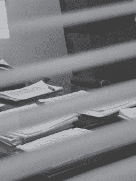

我从没想过一个没有技术含量的黑客从银行窃取信息会如此简单。我查看了他办公室的其他地方，拍了更多像下面这张一样的照片。

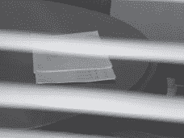

我检查了这些图像，发现它们都非常清晰。过了一会儿，经理踱回了他的办公室。当我站在那里，把相机举到与眼睛齐平的位置，对准他的客人桌时，我在想，我是否已经获得了足够的信息，可以在黑市上出售，以支付我的保释金。我并没有意识到他可能真的去提醒保安注意他新的偷窥的黑客朋友了。他拖着脚步绕过桌子，整了整腰带和裤子，扑通一声坐到他那张软垫椅上，连看都没看我一眼。

我等了几个紧张的时刻，完全期待被一个好战的银行出租警察泰瑟枪。从未发生过。我转过身，继续走过办公室，差点撞上一个正在抽烟休息的办公室职员。这位员工从未注意到我——他就在银行家办公室外面忙着用手机聊天。我突然意识到，这位银行家“无视”了所有在他办公室外徘徊的人。他已经如此习惯于路人，以至于现在他窗外的每个人(包括带着相机的非技术黑客类型)都是无害的无关紧要的人。保安人员经常在连续几个小时观看视频监视器后遭受同样的问题。他们对什么都没发生已经习以为常，以至于当某件事终于发生时，他们会错过它。

我能复印这些照片吗？

嗯，不。让我再说一遍。我不是坏人。如果是的话，我要么是有钱人，要么是在 13 号牢房里嫁给了布巴。因此，我有相当高的道德标准，我只负责提高人们对我在职业生活中利用的威胁的认识。我也不负责解决我目睹的每一个潜在威胁，比如这次的银行问题。大多数人都不喜欢我这样戳他们的东西。

在后来一次(合法的)去银行的访问中，当我站在柜台前时，我的眼睛看着柜台后面的技术设备。我拿出我的照相手机，拍下了下面这张照片。

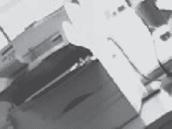

一台打印机的微小、模糊、严重改动(保护我的屁股)的照片看起来并不怎么样。不好意思。但是我把它包括进来有两个原因。首先，如今在任何地方拍照都是可能的——甚至是武装警卫出没的机场海关柜台，所有的标志都写着“禁止拍照”

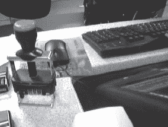

我附上打印机照片的第二个原因不是因为打印机本身，而是因为上面的贴纸(模糊等)清楚地列出了银行用于计算机支持的 it 公司的名称和电话号码。如果你认为装扮成电脑修理工只在电影里管用，那就再想想吧。我成功地做了几次。当我完成时，我并不知道真正的 it 支持公司是谁。

### 在非洲乌干达抢劫银行

在最近一次去非洲乌干达(见[http://johnny.ihackstuff.com/uganda](http://johnny.ihackstuff.com/uganda))的任务旅行中，我并不完全是一个没有技术含量的黑客。毕竟，这是一个和我在美国的家完全不同的地方。但是当我站在金贾最大的银行之一的 ATM 机前时，我不禁注意到银行在每个锁着的门上都有一种奇怪的开放式铁栅栏。被逗乐了，我拍了下面这张照片。

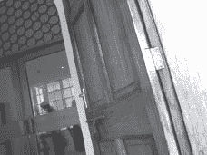

当我看着取景器中的照片时，我的脑海中浮现出这个围栏可能带来的所有安全问题。我的导师文斯会对这种类型的设置感到兴奋。衣架的把戏可能被用来打开门或阻止一个安全摄像头，或者…我的想法被一个轻推打断，我转过身。一位满脸不高兴的绅士拿着一把来复枪站在我身后。“没有照片。把相机拿开，”他几乎(但不完全)礼貌地说。

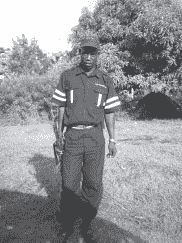

步枪令人印象深刻，制服更令人印象深刻。他的帽子和翻领上装饰着一个标志，上面写着“严密保安”讽刺意味很浓。在这里，我身处一个被许多人认为是第三世界的地方，我面对的可能是我所见过的最安全的地方。我从那个人的肩膀上瞥了一眼，突然注意到另外三个同样全副武装、穿着相似的警卫站在银行的外围。

“真可爱，”我笑着说。

卫兵的表情变得低沉，笑容消失了。“把相机拿开，”他说。我低头一看，意识到我还拿着相机。我清了清嗓子，把相机收了起来。太可爱了。