# 四、物理安全

锁是严肃的行业，锁技师是真正的工程师，大多数都有多年的实践经验。但是当你把锁匠这个古老而受人尊敬的职业，撒上黑客的别出心裁，会发生什么？这时魔法又出现了。你和我曾经依赖的锁成为了自来水笔、电动牙线和卫生纸卷筒等非科技工具的牺牲品；用成千上万个组合来保护我们的东西的组合锁，在不到三分钟的时间里，在没有任何工具的情况下就倒下了；政府强制要求我们在行李上使用的锁屈服于由汽水罐垫片和废弃塑料碎片制成的工具；最令人不安的是，我们发现保护我们的孩子免受伤害的枪锁在巧妙挥舞吸管后突然打开。一旦我们的锁受到这些微不足道的攻击，我们指望我们的相机，运动传感器和报警系统，却只能看到它们也被平凡地绕过。听起来很严重？确实如此。世界上该领域的一些顶尖专家将加入我们的行列，我们会在前进的道路上找到一些乐趣，但我相信，在您完成迄今为止最长、最深入的章节时，您会感觉到安全领域的天空变暗了。欢迎来到物理安全的世界，无技术黑客风格。

# 简介

我记得我的第一次身体评估。我想象自己撬锁并破坏电子监控系统。我把自己想象成电影《异形》中的海军陆战队员哈德森(比尔·帕克斯顿饰演)，疯狂地摆弄电子锁中的电线，试图让他的团队进入安全地带。虽然我最终闯入了现实生活中各种令人惊叹的地方——最终绕过了一些电子监控系统——但我从未需要撬开一把锁。简单的技术总是占上风。在这一部分，我将分享一些新手和最有经验的专业人士都依赖的非技术技巧。

# 撞锁

开锁是一项技术活。它需要了解锁的机制和内部结构，完善这项技术需要大量的实践。*另一方面，*撞锁则完全属于非科技黑客范畴。这种技术包括使用*凹凸钥匙，*这种钥匙是通过切割钥匙坯来打磨的，这样每次切割都达到最大深度，并且尖端和肩部被锉掉大约半毫米。对于训练有素的人来说，撞击键有非常独特的外观。切口过于均匀，如下图所示。

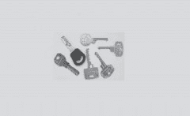

(Toool 授予的权限—开锁人的开放组织)

这项技术的工作原理是将一把撞击钥匙插入锁中，轻敲钥匙，同时在锁中轻轻转动钥匙。锁中底部的内部销被轻推，将动量传递给位于它们上方的销。当顶部引脚向上飞时，底部引脚保持向下。当插销分开时，锁芯可以转动，如果操作正确，锁就会打开。用撞击钥匙绕过一个锁比用传统的开锁工具或电子开锁工具开锁需要更少的技巧。这意味着，只要有一把合适的撞击钥匙，任何人都可以攻破一把脆弱的锁。有关预防和识别脆弱锁的更多信息，请参见侧栏中提到的参考资料，或者联系专业锁匠或安全提供商。

颠簸信息的宝库

撞锁已经存在很多年了，但因为最近的几部作品而变得流行起来。马克·托拜厄斯的书《锁、保险箱和安全》[1](#ft1)T5】对于专业人士来说是一本优秀的参考书，其中包括一篇关于碰撞(有时也称为“敲击”)的精彩文章。他的网站([http://security.org](http://security.org))和提醒页面([http://security.org/dial-90/alerts.htm](http://security.org/dial-90/alerts.htm))也是极好的资源。如果你在寻找更容易理解的材料，我强烈推荐 Toool 的巴里·韦尔斯和罗普·贡格里普写的令人敬畏的白皮书《撞锁》([http://www.toool.nl/bumping.pdf](http://www.toool.nl/bumping.pdf))，这是一个开锁者的开放组织，也是他们令人敬畏的视频工作室*什么是撞锁？*在[http://connectmedia.waag.org/toool/whatthebump.wmv](http://connectmedia.waag.org/toool/whatthebump.wmv)。我强烈推荐 Toool 网站( [www.toool.nl](http://www.toool.nl) )上的大量资源和视频。

## 填隙挂锁*(有偏差的锁)*

*填隙*是使用一种薄工具绕过或禁用锁内的闩锁机构。通过将一片或一片材料(通常是钢或铝)插入锁内的正确区域，负责保持钩环或插销的部件可以被推到一边，从而允许该机构释放。这通常只有当锁的关键元件完全依靠弹簧压力卡入到位时才有可能。本质上，填隙使锁像被用户*保护*一样工作。如果扣上一把挂锁需要一根小横杆滑出，那么 shimming 专注于让这根横杆离开。这类似于经典的“信用卡”攻击，在这种攻击中，信用卡被用来溜回上锁的门锁。

下图为传统大师牌密码锁加垫片后的样子。垫片沿着钩环滑入位于固定杆和钩环槽口之间的腔室。这个动作弹开了锁。

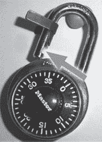

照片由越轨者提供

有几种方法可以确定锁是否可以填充。最简单的方法之一是打开锁，用一个小工具(如拨片或扳手工具)撬开固定杆(位于钩环腔内)。如果杆可以很容易地推开，它是弹簧加载的，最有可能是垫片。如果你感觉像是被药物带入了一个未知的开锁技术领域，然后等死，让我试着把这个说得简单一点:你可以用一根细棍戳一下锁的敏感部位，看看它是否能用同样的细棍打开。这并不是一个过度概括。

一些锁在钩环的两侧都有槽口，如下图所示。这种锁可以很容易地被探测和填隙，因为尽管有两个凹口，但这种锁具有一个单一的基本保持杆机构，这意味着当锁被固定时，无论锁体以何种方式固定，都可以容纳锁体。

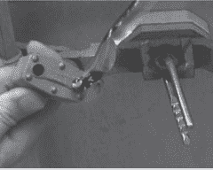

照片由越轨者提供

如果多槽口锁包含两个单独的固定杆，填隙可能会变得更加困难。由于挂锁的构造方式，对这两个杆中更隐蔽的一个进行“戳测试”是不可行的。但是测试一根棒就足够了；如果锁的锁紧装置的一边装有弹簧，另一边可能也装有弹簧。用垫片填充多槽口锁的问题是，你必须使用两个垫片，每个槽口一个。如果钩环上的间隙过紧，就会出现问题。商店购买的弹簧钢垫片对于这项任务来说往往太厚，这意味着攻击者必须使用更薄的东西，如汽水或啤酒罐中的铝条。认为这仍然是太多的技术术语吗？记住，我们现在谈论的是用两根细长的棍子打开锁。一般来说。

我能给你拿点什么吗？啤酒，苏打水？

黑客和啤酒罐有什么关系？是的，用铝罐做一个真正像样的垫片是可能的。这显然是低技术含量的，而且真的很棒，但是为了不让这本书成为罪犯的指南，我会给你一个关于越轨的伟大概述的 URL:[www.i-hacked.com/index.php?option=content&task = view&id = 189](http://www.i-hacked.com/index.php?option=content&task=view&id=189)。

一定要用这种方法来测试你的锁。对于一个业余爱好者来说，确定一把锁是否可以摆振是非常困难的。例如，下一张照片中的锁是一把万能锁，在大多数零售店都可以买到。这通常意味着你会得到你所支付的东西，但它的特点是双球机制，不可摆振。

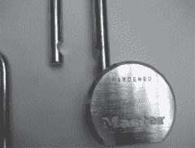

照片由越轨者提供

这里有一些挑选(没有双关语)防垫片锁的技巧:

1.  不需要任何钥匙或密码就能关闭的锁几乎总是内部装有弹簧，因此容易被填隙。
2.  操作钥匙在使用过程中被永久固定的锁(称为*钥匙保持挂锁)*通常不容易被填隙。
3.  在包装上宣传“双球”机制的锁很可能不会被填充。
4.  卸扣上带有*轴环*或*靴*的挂锁(其主要目的是阻止使用断线钳)通常很难或不可能填隙。除了难以填隙之外，这种锁通常由更高质量的结构组成，并且具有提供更好安全性的锁定机构。
5.  锁匠通常会推荐某些品牌的挂锁。相信他们的建议。越轨推荐 Sargent & Greenleaf 的 8088 和 8077 系列锁，用在国防部文件柜上。这是双重认可。

## 主锁组合锁强力破解

小时候，我记得看过很酷的万能锁广告，上面的锁即使被步枪子弹打穿也很安全。对我来说，大师成了安全的代名词。直到今天，许多人购买 Master Lock 仅仅是基于品牌名称。但是，不要仅仅根据品牌名称购买，因为几乎所有品牌都提供各种安全级别的锁。总是调查所有的产品，以确保你得到的产品符合你的需求。比如这种万能锁型号 1500D 密码锁，到处都有卖。

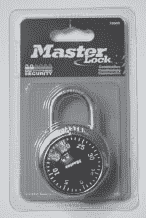

但该公司并没有宣传这是一种高安全性的锁。他们推荐这种锁用于最基本的安全应用。不过，我几乎每天都在高安全性应用中看到这种锁，尽管事实上存在危险的暴力攻击，使得这种锁的大多数版本几乎毫无用处。

强制描述了一种技术，在这种技术中，对一个问题的每一个可能的解决方案进行检查，看它是否是解决方案。例如，在有三个圆筒的圆筒锁上，所有可能的组合都在 000 和 999 之间。如果有人从 001，002，003 开始，逐步尝试每一种可能的组合，蛮力保证他们会在一千次尝试中打开锁。如果对手有足够的耐心来完成攻击，大多数机械密码锁都可以被暴力破解——这就是锁的安全级别。

幸运的是，大多数坏人都没有足够的耐心去暴力破解密码锁。在主锁的情况下，如果我们假设表盘上的每个数字都是活动的(事实并非如此)，我们就剩下 40 个 3 个或 64，000 种可能的组合。如果攻击者每五秒钟尝试一个组合——考虑到清除过程和左右转弯，这是一个合理的速度——可能需要长达 88 小时或近 4 天的时间来完成每个组合。在这种情况下，攻击者会失败，而不是锁。

我将要向你描述的一个捷径是将组合数量减少到 100 个。每次尝试五秒钟，攻击者只需八分钟就可以暴力破解一百个组合。由于这本书是关于保护你自己的资产，我不会深入研究使用这种技术开锁所需的所有细节，但我会告诉你如何计算出你的组合的最后一个数字。如果你能发现你的密码的第三个数字，你应该得到一个更坚固的锁。更好的是，让专业锁匠评估你的情况。

首先，在锁的钩环上施加张力。一个简单的方法是用一只手握住锁，用一个手指在轴上施加向上的压力，如下图所示。时尚的拇指戒指是可选的。

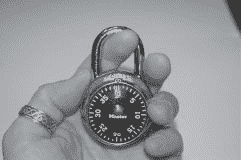

接下来，开始转动转盘。如果施加足够的张力，刻度盘应该保持在两个数字之间。我称之为*症结。*每个受影响的锁上有 12 个卡点。第一步是找到并记录每个卡点的位置。比如这个锁的第一个卡点的下边界是，如下图所示。

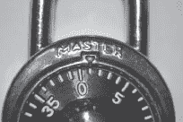

如下一张照片所示，这个相同症结的高边界是 2。

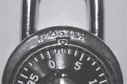

这些数字之间的中点是 1.5，这显然不是一个整数。要找到下一个卡点，释放钩环上的张力，转动刻度盘越过当前卡点的上限，并重新施加张力。刻度盘应该再次卡住，显示出下一个卡点的位置。一些症结将在于整数。例如，下一张照片显示，下一个卡点的低边界是 7.5。

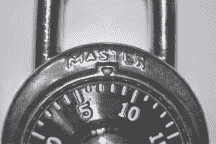

我知道，亲爱的读者，没有这些照片，你也能理解我在说什么，但让我们再看一张，这样我们就能涵盖偶数、奇数、高低点。这个相同的症结的高边界是 8.5，如下图所示。

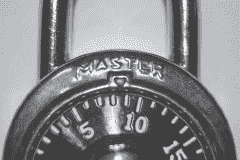

这意味着症结在于。通过记录每一个症结，你最终会得到类似于我在这张表中得到的东西。

我锁上的症结

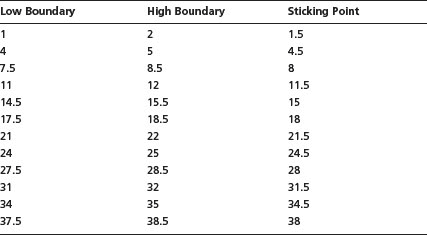

请注意，一半以上的症结并不在整数上。这些是诱饵，应该从潜在组合数字列表中删除。在这个例子中，剩下五个数字:8、15、18、28 和 38。请注意，这些数字中的大多数都以同一个数字结尾，即数字 8。这些匹配的数字也应该从列表中删除，只留下一个数字(15)，这是我的锁的组合的最后一位数字。

如果这种技术对你的锁有效，那么锁很有可能会受到暴力攻击。如果这种方法不起作用，你可以买一把新的 1500D 主锁。据推测(在[www.wikihow.com/Crack-a-Master-Combination-Lock](http://www.wikihow.com/Crack-a-Master-Combination-Lock))序列号以数字 800 开始的 1500D 主锁不容易受到这种攻击，尽管未经证实的消息来源也报告了对这些新锁的成功攻击。不管怎样，不要急着向洛克大师扔石头。做好你的研究，不要为高安全性任务购买基本的安全产品。考虑为您的应用购买更高安全性的主锁，或者获得专业锁匠或安全专家的建议。

愚蠢

几个网站详细讨论了这个漏洞。然而，在确定组合的第一个和第二个数字时，需要大量的数学和记忆。Tim“Thor”Mullen 在 Syngress 出版社出版的《窃取网络:如何拥有一个影子》中提出了一条捷径。这篇由蒂姆、“蓝野猪”瑞安·拉塞尔和我共同撰写的文章讲述了一个“扣人心弦”的故事，讲述了黑客在现实世界中的能力。所有人都认为，这个故事是虚构的，但技术，如主锁蛮力，不是。检查整个*盗窃*系列，看看当黑客脱下手套时你可能会面临什么！

## 卫生纸与管状锁

管状锁被用于各种应用，但它们通常出现在笔记本电脑安全设备中，如下图所示。

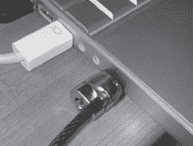

1992 年，英国广播公司报道说，某些管状锁很容易被不熟练的小偷绕过。12 年后，2004 年 8 月，《锁、保险柜和安全、T2【2】T5】的作者马克·托拜厄斯发现肯辛顿和塔格斯在他们的笔记本电脑锁产品中使用了类似的圆柱形轴向设计。他的报告表明，用一支笔或一根卫生纸管就可以轻易地绕过这些锁。2004 年 9 月，Chris Brennan 在他的论坛([www.bikeforums.net](http://www.bikeforums.net))上描述了一个昂贵的 Kryptonite 自行车锁(使用了相同的圆柱轴设计)是如何被 Bic 笔绕过的。克里斯将视频上传到 www.bikeforums.net/video，媒体随之疯狂报道。

Toool 的 Barry Wels 出场了。在一次黑客会议上，巴里制作了一段视频([http://www.toool.nl/kensington623.wmv](http://www.toool.nl/kensington623.wmv))，展示了如何将旁路技术应用于一个特定的肯辛顿笔记本电脑锁系统。黑客社区发现这个视频很有趣，但普通公众对他用卫生纸卷筒上的纸板在短短几分钟内完成旁路的事实感到敬畏。

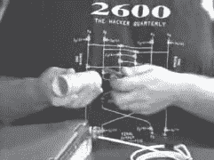

虽然总是有人猜测是谁先想到了什么，但已经有近百万人从巴里的网站上下载了这段视频，还有无数人从像你 Tube.com 这样的网站上下载了这段视频。我喜欢 Barry 的视频，因为它非常容易理解，并且清楚地展示了我在本书中试图展示的内容，即使是最复杂的安全系统也面临着简单攻击的风险。如果您的笔记本电脑上有敏感数据，并且您依靠一个单独的锁设备来保护这些数据，那么无论锁是否容易受到这种攻击，您都可能会被烧死。每当您依赖单一安全层时，您都有可能受到威胁。笔记本电脑锁不是一个坏主意，但如果你担心丢失机器上的敏感数据，也可以考虑某种加密解决方案。最重要的是，试着像黑客一样思考。在这种情况下，细长电缆是最佳解决方案吗？

## 电动牙线:低科技经典

开锁需要真正的技巧。为了做好这件事，你必须对锁的工作原理有所了解，并且需要练习。随着新设备的出现，如开锁枪和其他电动工具，开锁似乎比以往任何时候都更容易。尽管如此，这些工具并不是万无一失的。它们需要相当多的技能才能成功操作。此外，它们价格昂贵。大多数业余爱好者不会考虑投资一大笔钱在一个不是万无一失的特殊设备上。

尽管如此，对小工具黑客来说还是有一定的诱惑力的，开锁社区用新型电动牙线装置大展身手，就像这个。

我不确定是谁想出了黑掉这个看起来很无辜的东西的主意，但确实有人这么做了。结果是一把小巧廉价的电动开锁枪。据 Inventgeek.com 大学的杰瑞德·布克称，这个小装置，即使和一个临时的拉力扳手结合在一起，也能在几秒钟内打开大多数挂锁。

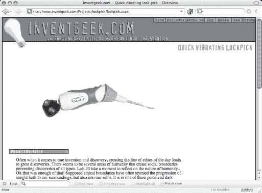

这种黑客行为包括修改牙线以接受更强的电源。然后，当牙线插入锁中时，它可以产生足够大的振动，将制栓从锁定位置上摇下来。一定要去 www.inventgeek.com 了解更多信息，一定要全身对付任何你看到的拿着电动牙线鬼鬼祟祟的人。他们肯定在策划什么。

## 笔记本电脑锁被啤酒打败*(马特·菲德勒和马克·韦伯·托拜厄斯)*

许多密码锁容易受到被称为“探测门”的攻击在这项技术中，一个小垫片被用来探测锁的密码轮(见下一张照片)，试图找到“门”或开口，这将揭示密码并最终打开锁。2004 年 8 月，Security.org 报告说，Targus Defcon CL“计算机电缆锁”(型号 PA410U)容易受到这种攻击方法的攻击。

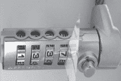

照片由马克·韦伯·托拜厄斯提供

因此，塔格斯重新设计了他们的锁来弥补这种暴露。锁的新化身(Defcon“装甲”CL，型号 ASP10US)展示了一条新的装甲电缆。分析证实，Targus 通过将闸门移到锁芯内部，解决了最初的问题。然而，发现了一种新的方法，通过锁体末端的组合转换螺钉将锁暴露出来。这种技术将允许攻击者探测门(一次一个圆筒)，但是为了完成这种攻击，装袋员将需要移除塑料盖，或者滑过盖子一个非常薄的垫片。

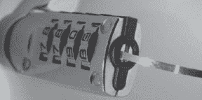

照片由马克·韦伯·托比亚斯提供

进入啤酒罐。这种攻击需要厚度为 0.015”或更小的垫片。物理安全专家马特·菲德勒和马克·韦伯·托拜厄斯发现，从啤酒罐上切下的一条只有 0.005 英寸厚的带子可以完美地工作。

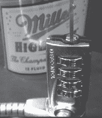

照片由马克·韦伯·托拜厄斯提供

但这种锁的滥用仍在继续，迈克和马克透露，电缆本身可能会受到攻击。为了做到这一点，坏人首先需要去除电缆上的薄塑料涂层。正如下一张照片所示，一个点烟器可以快速点燃薄薄的 PVC 涂层。

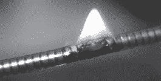

照片由马克·韦伯·托比亚斯提供

移除 PVC 盖后，只需使用一把标准的对角钢丝钳，就可以将锁夹紧并剪断，如下图所示。

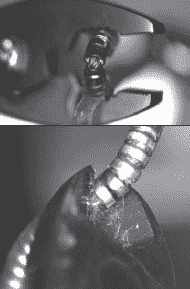

正如这些测试所揭示的，在选择任何安全设备时保持警惕是值得的，但笔记本电脑的锁尤其重要。笔记本电脑上的数据往往比硬件本身更有价值。明智投资，适当测试。在使用任何安全设备之前对其进行研究总是有好处的。

## 美国运输安全管理局锁*(马克·韦伯·托拜厄斯)*

由于 9/11 之后航空安全措施的增加，运输和安全管理局(TSA)禁止在行李上使用标准锁。然而，它们允许“TSA 锁”,这种锁可以由乘客上锁，由 TSA 代理打开和重新上锁，而不会干扰乘客设置的密码。如下图所示，这些锁已经成为世界各地航空公司行李候机楼的常见场所。

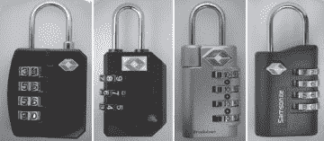

本部分所有照片由马克·韦伯·托拜厄斯提供

马克·韦伯·托拜厄斯(Marc Weber Tobias)对这些锁进行了审核，并将结果发表在一篇名为“TSA 批准的行李箱锁”([http://download.security.org/tsa_luggage_locks_report.pdf](http://download.security.org/tsa_luggage_locks_report.pdf))的论文中。他的总结是一个非技术黑客的梦想成真，概述了锁本身的弱点，但也指出，大多数上锁的行李很容易被闯入，无需摆弄锁:

无需任何特殊工具或专业知识，通常只需几秒钟，就可以轻松绕过本报告中研究的每一种机制。乘客不应依赖这些锁来提供任何安全保障。尽管行李处理专家指出，通过剪断外层材料或绕过拉链可以很容易地打开行李，但在作者看来，真正的问题是由第三方引入违禁品，或对内容物失窃的延迟检测。这份报告研究了每种类型的锁和它的脆弱性，以偷偷进入。

Marc 发现许多锁可以用简单的金属或塑料条打开，如下图所示。

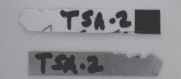

他的论文继续描述了如何在每个 TSA 锁上使用门探测技术(如用于打开 DEFCON CL 系列锁的技术)。用一点如下图所示的塑料，对手可以确定锁的组合，一次一个轮子和一个数值。

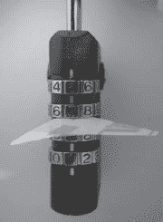

在某些情况下，对手可能需要执行一些简单的加法或减法来确定锁的真实组合，但我们在这里谈论的是二级算术，而不是代数。

【SploitCast 的 IT 专业人士 Ross Kinard 对 TSA 锁并不感冒:*因为【TSA 锁】大多是*【芝麻】*锁，大多数继承了【其他*【芝麻】*锁】的问题。那些不是*【芝麻】*锁的可以拆开，了解万能钥匙的钥匙深度是多少。从我的经验来看，002 可以用任何你能放进钥匙槽里的金属打开，同时……附带的钥匙可以被锉平来使用其他的 001 锁。004 只需要一个小而坚固的金属片来转动(内部凸轮)，007 附带的钥匙适用于所有其他 007。马克的最终判决的确是致命的:*

很明显，美国运输安全管理局批准的锁都不能提供任何防止秘密进入的安全措施。用户的问题必须是“需要什么安全措施来保护我的行李不被偷？”答案显然不仅仅是锁，或许行李永远也不可能真正安全[……]。

这份报告的结论很简单:不要依赖这些锁来获得任何级别的安全性。它们只是一种可以重置的昂贵密封形式。一个有知识的人可以通过解码密码打开这些锁中的任何一个，只需要非常有限的训练或专业知识。而且，人们可以在任何地方购买这些锁，所以在盗窃前练习不是问题。当然，使用钥匙可以使任务变得非常简单，而且几乎任何接触过行李的人都可以打开它。

我们的建议补充了专家的说法:对任何有足够积极性的人来说，无论是不是机场员工，都应该把你托运行李中的东西视为公共财产。带着你不能丢的东西，在你的包离开你的网站一段时间后，对它保持怀疑。

## 枪支扳机锁与吸管*(马克·托拜厄斯和马特·菲德勒)*

当我坐下来考虑我将在本书中包括的物理非技术黑客列表时，我从未考虑过涵盖针对枪支扳机锁的攻击。简单的事实是，我在工作中很少碰到他们。但是因为马克·托拜厄斯和马特·菲德勒的良好声誉，我翻了翻他们的“关于枪支锁的报告”，可从 http://download.security.org/gunlock_2007.pdf 获得。我惊讶地发现了一个非常致命的非技术黑客，我在这里模糊地概述了一下。虽然我不认为在这里完全描述旁路技术是负责任的，但我觉得有必要帮助 Marc 和 Matt 了解他们在报告中提到的劣质锁定系统的危险。如果您有本节中描述的任何锁，请立即更换为更安全的型号。

最荒谬的攻击集中在 DAC 触发锁(如下所示),它可以在包括沃尔玛和 K-Mart 在内的主要零售连锁店中找到。

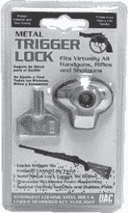

这把锁由一个典型的蛤壳设计组成，包裹着枪的扳机和护板。这两部分由一个螺栓固定，该螺栓与所提供的钥匙相匹配。在锁定位置，螺栓头凹进锁体内。Marc 和 Matt 发现麦当劳的吸管可以相对容易地打开锁，如下两张照片所示。

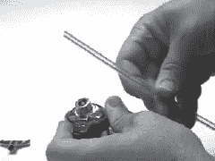

照片由马特·菲德勒提供

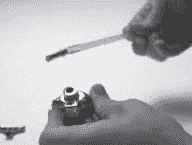

Ross Kinard 补充说，这把锁配的钥匙可以用这种方式打开所有其他 DAC 品牌的枪锁。该报告继续说，许多其他品牌的枪支锁也容易受到损害，包括某些 Master Lock、Remington 和 Winner International 锁，其中一些锁可以被儿童用冰锥或锋利的螺丝刀打开。事实上，Marc 报告说，下面显示的每一个触发锁都包含一个严重的漏洞。这些包括但不限于美国司法部的“儿童安全项目”枪电缆锁；主锁触发锁模型 90、94 和 106；DAC MTL 100 触发锁；弗兰岑密码锁；GSM 枪扳机锁和温彻斯特枪盒。

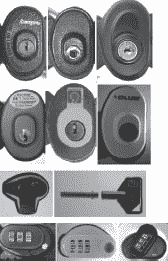

美国消费品安全委员会在其位于 http://www.cpsc.gov 的网站上公布了一份召回产品的清单。许多负责任的供应商如 Master Lock 已经对他们的产品进行了召回；例如，下面显示的 90 型的某些版本。你应该在 cpsc.gov 网站上搜索你的锁，以确保它们没有被召回。我特此避免对枪支锁做任何自作聪明的评论。这是*道*太严肃的一个话题。

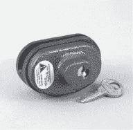

枪支安全

如果你有枪，应该用优质的扳机锁锁住，并存放在上锁的柜子里。练习负责任的钥匙控制，并对你的武器的安全保持警惕。最重要的是，让专业锁匠评估你的安全措施。

## 入门技巧:利用*(又名旧信用卡伎俩)*

似乎每个人都知道信用卡骗局。事实上，在适当的情况下，这是一个普通人无需训练就能完成的入门技巧。尽管如此，我似乎总是会遇到合适的情况，因为我太经常遇到这种情况。这种技术的专业术语是 *loiding。*它的工作方式很简单。为了越过锁着的窗户，攻击者可能会试图将信用卡(或一根细而结实的金属丝)塞入窗梃之间，以便将门闩推到解锁位置。为了通过一扇门，攻击者将卡滑入门卡扣和碰簧销之间，试图将碰簧销从门卡扣上分离，这将打开门(假设门上只有一把锁)。

为了使这种技术有效，门板和门框之间必须有间隙。下面的照片显示了一个夸张的差距。

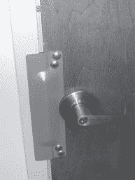

好了，这更像是一个门*裂缝，*如果不是那个聪明的安全装置(钢板)覆盖着它，手指伸进去并不费力。该板确实解决了信用卡问题，但正如你从下一张照片中看到的(从门闩机制处的门缝隙中向下看)，缝隙如此之大，以至于另一种类型的工具可以用来绕过门。

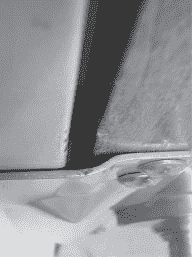

没有技术含量的黑客不会被这种错位的安全措施吓倒。看一眼周围的区域，就能看到下一张照片中的垃圾桶。

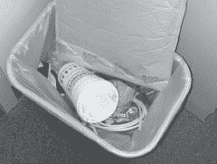

在确定垃圾桶里没有有趣的文件后，没有技术含量的黑客很可能会抓住一小段网线。如下图所示，它非常适合门的缝隙。

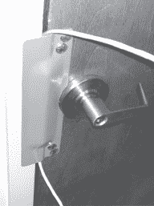

简单一拉，门就打开了，如下图所示。

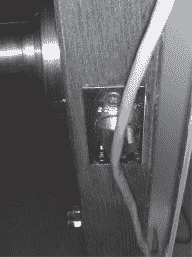

我经常惊讶于这种方法的效果。我使用它的次数已经数不清了，当客户听到他们的安全系统被一些垃圾打败时，他们很少会高兴。请留意您所关注的安全系统中的这一漏洞。我知道这一章比其他很多章节都长，但是物理安全不仅仅是锁的问题。在下一节中，我们将看看其他经常被非技术黑客滥用的物理安全设备。所以，去买些咖啡，在去咖啡机的路上，不要害怕经过的每一扇门或锁。我们有更多的地方要去。

## 进入技术:运动传感器激活

努力忽略本节标题中的单词*运动传感器*。忘记了吗？现在，有了一个清晰的视角，看看下面照片中锁着的入口。无技术攻击有哪些选择？

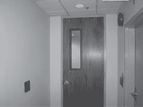

拉塞尔·汉多夫提供照片

首先，有一个安装在墙上的读卡器。一个技术攻击者可能会想到克隆一张卡或者拿出工具来拆卸它。我会给任何用鳄鱼夹和螺丝刀就能绕过这东西的冷血精英以支持。但这不是我们感兴趣的攻击。

接下来要检查的可能是门和门框之间的公差。公差很小，尽管门闩清晰可见，但锁不易被撬开。一个更温和的选择可能是以某种方式对员工进行社会改造。我也想到了尾随攻击，但这两种更温和的选择都可能会让员工觉得事情不太对劲，即使攻击一开始就成功了。最好的选择是等待和观望。不可避免的是，一个雇员将会退出，而一个没有技术含量的黑客将会瞥见正在使用的退出程序。

正如我在介绍中提到的，文斯告诉我，走出一座建筑往往比走进去更容易。每次我闯入客户的安全建筑时，我都会利用这个简单的事实。在这种情况下，等待片刻后，建议就有了回报。一名员工带着刺耳的“咔嗒”声从门里走了出来。由于员工没有刷卡或抓住门把手离开，问题就变成了:这个流程是如何运作的？透过门内的窗户看了一眼，什么也没发现。看不到推杆，也没有任何插销或按钮的迹象。门里面的把手和外面的一模一样。答案不在于什么是*看到的*，而在于什么是*听到的*，具体来说是*什么时候*听到的。

那声音是磁性锁分离时发出的特别大的噼啪声。有相当多的技术可以使磁锁失效，但它不是这次攻击的目标。目标是解除磁锁的运动传感器。这两张照片都是从锁定区域内拍摄的。

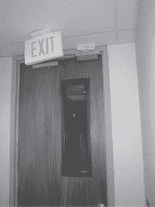

拉塞尔·汉多夫提供照片

对于非技术黑客来说，运动传感器的存在是显而易见的，原因有两个:在员工到达门口之前，门已经打开；从窗户可以看到，员工没有做出具体的动作来开门。运动传感器完成了所有的工作。允许员工在没有特殊钥匙或程序的情况下离开该区域不仅仅是为了方便。在火灾中，这个装置可以拯救生命。

一个熟练的非技术黑客可以简单地绕过这个系统，并以任何方式。为了向文斯致敬，我们选择使用下一张照片中的垃圾。

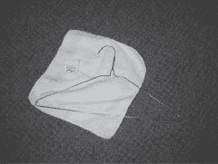

拉塞尔·汉多夫提供照片

用一点牙线把毛巾挂在拉直的衣架上，一个没有技术含量的攻击者就可以做一面旗子，可以塞进门缝里挥舞。它最终触发了运动传感器，打开了这扇门。测试你的退出程序。你的出路可能是对手的最佳出路。

用玩具打败运动传感器？

没问题。如果你能把一张简单的白纸放在门的上方，让它飘过传感器，就足以让这些传感器出错。纸飞机有趣多了。把它折叠起来，从裂缝中穿过，让它飞起来。甚至气球——用来制作气球动物的长长的扭曲的那种——也是伟大的非科技工具。简单地把它塞到门下，充气，然后开始挥舞它。你要确保让每个人都知道你在提前测试安全系统。被门砸到脑袋可不好玩。

## 绕过被动红外(PIR)运动传感器

被动红外(PIR)运动传感器用于许多复杂的报警系统，但基本系统很容易被绕过。你看不到被动红外场，因为它们不发射红外光(见侧栏)。更确切地说，它们探测的是红外线能量，比如从人类身上辐射出来的，或者至少是温度高于华氏 93 度的人类。

看到红外光

如果你需要探测红外光，尝试使用数码相机的取景器。这张照片显示了通过数码相机的取景器看到的电视遥控器发出的通常不可见的红外光。

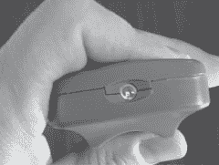

这些类型的传感器*在其监控的红外场中突然*变化，这意味着它们可以通过进入和穿过它们的监控场而被绕过。Ross Kinard 发给我这张入口的照片，由安装在左手门口上方的 PIR 传感器监控。

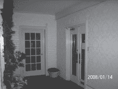

照片由罗斯·基纳德提供

Ross 在下图中描绘了他成功绕过传感器系统的过程。

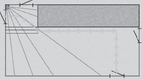

照片由罗斯·基纳德提供

因为传感器被设置为覆盖图左上角的两扇门，所以它看不到他从对面角落的门进入。他走向对面的墙，沿着墙走过去，大部分时间都在传感器的视野之外。到达场地边缘时，他很聪明地直接进入了红外光束。通过这样做，他能够保持每 4 到 12 秒一英尺的轻快步伐。根据罗斯的说法，“那部分相当简单。最难的是走到门口。然后我移动得很慢，每次大约两到四英寸，每次移动之间大约有六秒钟的间隔。这是我一直搞砸的地方。我没有意识到我需要走多慢，但我最终做到了。”

在我最喜欢的一部电影中，*运动鞋* (1992)，马丁·毕晓普(罗伯特·雷德福)穿着氯丁橡胶西装，以便戴上运动传感器。他的同伴(瑞凡·菲尼克斯)提前准备好房间，将房间的温度提高到与毕晓普的体温一致。毕晓普以令人痛苦的缓慢步伐达到了目标，没有触动警报。据《流言终结者》*的工作人员称，*这个场景的许多元素听起来都是真实的。在第二部*犯罪与流言终结者*([http://shopping.discovery.com/index.html](http://shopping.discovery.com/index.html))中，流言终结者——卡莉、格兰特和托里——带上了几个安全设备，包括 PIR 和超声波运动传感器。他们发现，“慢而低”的技术在对付超声波传感器时也很有效，超声波传感器使用高频声音而不是红外光。他们还发现，氯丁橡胶服装可以在短时间内隐藏入侵者的红外传感器的热信号。但最终，宇航服会吸收入侵者的体温，使他再次被传感器发现。他们还试图将房间温度提高到 98 华氏度，以欺骗 PIR 传感器，但这一测试失败了——传感器立即触发。他们能够通过在传感器前面放置一块玻璃来绕过 PIR 传感器，但这只有在玻璃的温度足够接近房间温度的情况下才能工作。在最令人惊讶的测试中，卡莉在穿过超声波场时在自己面前铺了一张床单，警报没有被触发。

红外传感器在大劫案中被黑

在一起重大盗窃案中，一名聪明的小偷在营业时间向红外传感器喷洒硅胶喷雾。这实际上蒙蔽了传感器，传感器无法检测硅涂层以外的热变化。

## 摄像机闪光

监控摄像头是我遇到的最常见的物理安全设备之一。但是许多相机的配置很差，一个业余爱好者可以毫不费力地绕过它们。*闪光*就是简单地使一台相机失明或过载，这样它就不能记录任何有意义的东西。业余盗贼知道这种技术已经很多年了，但是我惊讶地发现它仍然对许多现代系统有效。在费城地区工作的 CISSP 罗素·汉多夫提供了下一张典型相机装置的照片。

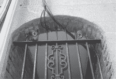

拉塞尔·汉多夫提供的照片

一个非技术黑客可能注意到的第一件事是摄像头的数据和电源电缆暴露在外。然而，在这种特殊的安装中，电缆是铠装的，很难切断。此外，相机背面的电缆连接器被锁定，很难移除。相机本身非常高端:Topica(索尼芯片组)型号 TP-936WIR-30C，配备 20-LED 红外夜视。

从该系统捕获的典型静止图像如下所示。

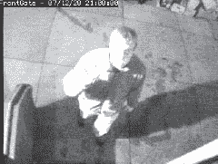

拉塞尔·汉多夫提供照片

那么什么是无技术黑客呢？我们称之为相机*发光，*它只不过是用一束极其明亮的光来蒙蔽相机。在下一张照片中，Russ 用 SureFire x300 LED 灯照明。正如你所看到的(或者看不到)，相机完全被这种极其明亮的光线直接击中。

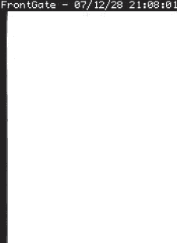

拉塞尔·汉多夫提供的照片

这种技术为攻击者提供了犯错的空间。一个万全之策的间接打击或一个弱光的直接打击将产生一个体面的效果，如下图所示。

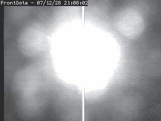

拉塞尔·汉多夫提供照片

其他光源也可以做到这一点，甚至从相当远的地方。看下一张图片。这是我“逮捕我”的表情。

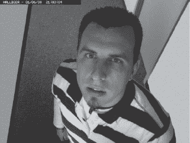

下一张照片显示，用廉价的激光笔轻轻一扫，很难看清我的脸。

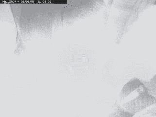

下一个截图显示了直接击中镜头的效果。如你所见，不可能辨认出图像中的任何东西——摄像机完全被蒙住了。

您的监控系统容易受到这些攻击，您可以考虑使用更好的设备，安装额外的摄像机来覆盖多个角度，或者考虑安装过滤器或反光罩来保护您的摄像机镜头。请记住，任何放在镜头前面的东西都会影响图像质量。使用红外滤光片时要特别小心。它们可以阻挡夜间照明所需的光线，有效地破坏相机的夜视能力。

## 真实世界:机场禁区单工锁旁路

单工锁(如下所示)有一个坏名声。

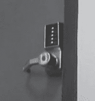

著名的安全研究员 Michal Zalewski 使用高科技来对付这种锁，他的研究结果非常惊人。在他的论文“用热成像技术破解保险箱”([http://lcamtuf.coredump.cx/tsafe](http://lcamtuf.coredump.cx/tsafe))中，迈克尔展示了用户指纹留下的热量可以在几分钟后用热成像设备检测出来，如下图所示。

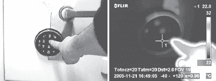

热门视频游戏如 *Splinter Cell* 也加入了这一行动。下面的游戏照片显示了在一名警卫打出连击后，通过山姆·费舍尔的热护目镜看到的连击锁。

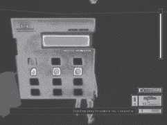

在我看来，迈克尔的真实比电子游戏小说更酷，但无论如何，热成像是一个非常甜蜜的高科技攻击。但是这本书是关于非技术的，所以让我们来看看非技术选项。由于最常使用的按钮会有一层薄薄的手指油残留物，你可以用婴儿爽身粉在面板上掸一掸，吹走多余的部分，找到组合按钮。或者你可以欺骗一个知道这个组合的用户去触摸一些紫外线反应的粘性物质，这样当他或她触摸按钮时，你可以用紫外线照射面板，看看哪些按钮被触摸了，有点像《国家宝藏》中的场景。如果你有很强的手眼协调能力，并且不容易出现腕管综合症，你甚至可以粗暴地对待这些小狗。

但到目前为止，我所讨论的技术并不是完全没有技术含量的。这些攻击需要实际的工具和一些装备，至少需要一些婴儿爽身粉。让我们一路走到没有科技的真实世界的攻击。跟我一起去机场吧，这里有世界上最偏执、最先进的安全系统，我只带着我的眼球和一个可选的数码相机，寻找一个最佳的肩窥机会。

通过安全检查点，我发现了几个简单的锁，但它们都有明显的看门人的壁橱的外观。不过，最终我发现一把简单的锁保护着一扇办公室的门。这扇门与登机口检查区相邻，当我走近时，一名飞行员走到门口，输入数字，然后推开门，露出一间可以俯瞰跑道的窗户办公室和一个电脑系统。兴奋地看到锁保护着一个实际的办公室，但失望的是我错过了组合，我寻找一个好地方坐下来，等待另一个飞行员戳出数字。最理想的座位应该是离门比较近的位置，而且要有一个角度，让我在按键进入时能看得很清楚。我找到了一个完美的座位，就在我要坐下的时候，我看到了这个标志:

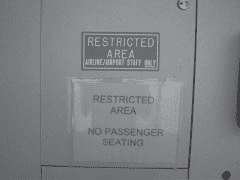

我顺从地无视这个标志，扑通一声跌入“禁区”，拿出我的笔记本电脑。我把相机放在键盘上，确保它不会被偶然路过的人看到，然后等待。我确实得等很久。不一会儿，一名飞行员过来按下了密码。下面的剧照不言自明。

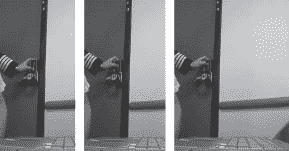

尽管我以随机的顺序展示了这些照片(甚至可能删除了一两张)，但信息仍然很清楚:肩窥规则，尤其是当你把热像仪放在另一条裤子里的时候。飞行员推开门，让门大开着。我举起相机，继续拍摄。下一个镜头显示肩冲浪，第二回合。

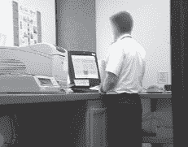

我故意模糊图像以保护无辜，但即使如此，你看到我所看到的了吗？我希望你能，因为这意味着这本书在教你一些东西。我知道你看不到照片上的任何东西，但你应该能够找出至少五个非技术黑客会关注的项目，以获取更多信息。你看到他们了吗？继续，在你继续阅读之前试一试。

你做得怎么样？显示器是我的。我们有整整一章是关于肩窥监视器的。显示器上的胶粘物*呢——一个小号，一个大号？一个可以是条形码，另一个可以是任何东西。我们再深入一点。显示器的品牌呢？结合条形码，它可能会给你一个关于谁在机场处理技术支持的线索。社会工程，有人吗？激光打印机怎么样？我们再次看到另一个便笺，它可能列出了打印机的指令、IP 地址、打印队列名称等等。打印机的品牌可能会提示我们另一个社会工程笑话。我们可以做打印机修理工。这里还有其他东西。你发现严重老化变色的点阵打印机了吗？它也有粘性物质——不止一种。看看电话上方的标志。它会有重要的扩展吗？你看到海报了吗？它会包含对社会工程攻击很重要的行业术语吗？终端的飞行员也可以在视觉上被分解，即使我们在办公室之外也可以很容易地这样做。他结婚了还是单身？退役军人还是平民？整洁还是凌乱？这个清单可以一直列下去。*

下一张照片总结了这一现实世界场景的成功，因为我不仅捕捉到了一次肩窥和一屋子的潜在信息，还捕捉到了一个飞行员的挂绳和一串胸卡。一张照片里有这么多选择。

这里的重点不是挑机场的安全，或飞行员缺乏意识，或运输安全管理局对整个事件的疏忽。相反，关键是即使在安全是重中之重的环境中，非技术黑客也可以大展身手。如果有可能在机场瞬间收集所有这些信息，那么在任何地方都是可能的。

[1](#fn1) M.W .托比亚斯。*《锁、保险箱和安全:国际警察参考》两卷本，*Charles C . Thomas 出版有限公司，2000 年。

[2](#fn2) 同上。