# 七、P2P 黑客攻击

随着我们继续暂停严格的非技术性黑客攻击，我们将讨论另一项低技术技能:点对点(P2P)黑客攻击。本着不使用技术的精神，让我们假设一个人没有预算，没有商业黑客软件，没有有组织犯罪的支持，也没有花哨的装备。事实上，让我们甚至拿走谷歌。有这么多限制，这家伙对你还是个威胁吗？看看这一章，自己判断。

# 了解 P2P 黑客攻击

对等(P2P)网络由许多想要共享文件或数据的客户端(称为对等体)组成。最常见的是，对等网络传送加入网络的用户共享的音频、视频或程序文件。P2P 网络的工作原理超出了本书的范围，但是就我们的目的而言，我们只能说 P2P 是现存的最常见的文件共享服务之一。为了加入一个 P2P 网络，你只需下载一个 P2P 客户端(如下所示，如 Mac 的 Acquisition ),运行它并开始搜索要下载的文件。

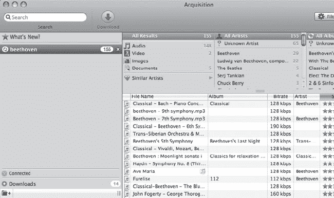

搜索*贝多芬，*就像上面那个“神奇地”返回了其他 P2P 用户分享的包含*贝多芬的文件列表。*结果通常按受欢迎程度排序。在上面的例子中，前三个结果包括巴赫的一首钢琴协奏曲(被误列为贝多芬的)，以及贝多芬的第 7 交响曲和第 9 交响曲。这带来了一个有趣的问题 P2P 网络上的共享文件并不总是像它们看起来那样。贝多芬演奏的巴赫协奏曲是一个很好的例子，但由于任何用户都可以共享任何类型的文件，协奏曲可以是任何东西:一部关于梅奥的电影，一张泡菜的图片，或者一个包含计算机病毒的文件。恶意用户可以很容易地共享任何种类的恶意文件。b .恶意文件不如意外共享的文件更让我感兴趣。

正如非技术黑客已经知道的那样，有成千上万的互联网用户下载并安装了 P2P 软件，无意中分享了敏感文件。

访问这些文件就像安装一个 P2P 客户端和提交创意搜索一样简单。在这一章中，我们将看看我在各种对等网络中发现的一些文件。

我们将从一些基础开始，然后逐步发展到一些真正有趣的东西。下一张照片显示了一个相对简单的 Word 文档，其中列出了一家公司的企业客户。

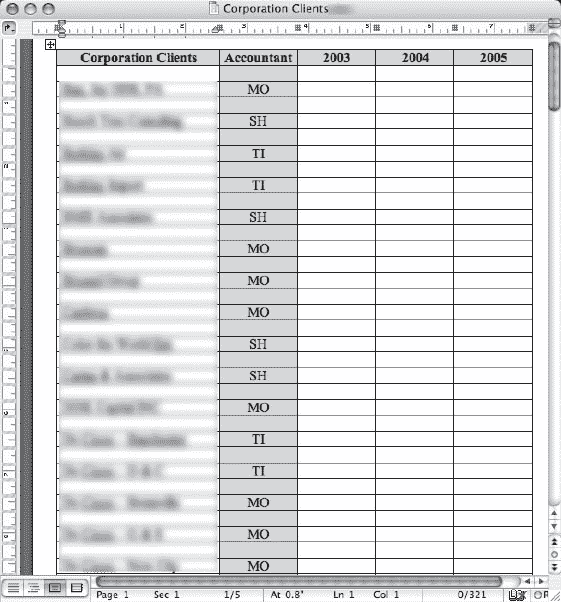

下一张照片的质量很糟糕，但我会呈现我发现它的样子。我想这是一个屏幕打印出来的图像。希望这不是它看起来的样子——一张刊登在报纸上的照片。

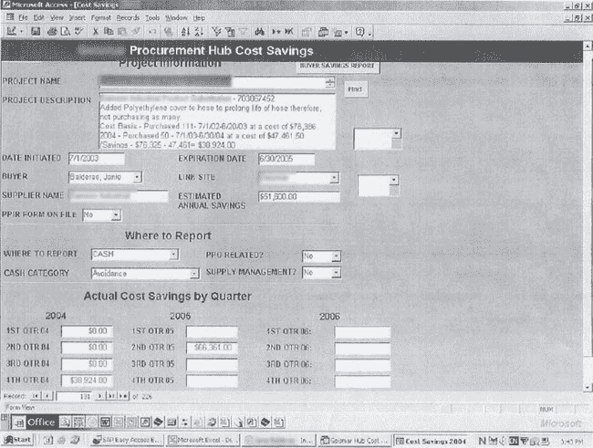

不管这张照片是如何产生的，它揭示了大量的信息。底部的任务栏是肩扛式冲浪者的梦想，但 Access 数据库屏幕是信息的金矿。该屏幕显示了一家大公司的成本节约报告，其中列出了有关项目的非常具体的细节，包括费用和每年的成本节约。该信息非常陈旧，但基于该公司的可识别名称；有人肯定会对更多类似的信息感兴趣。

找到一个，搜索更多

一旦您找到一个感兴趣的文档，就可以很容易地在同一台电脑上找到更多。大多数 P2P 客户端允许你浏览 P2P 用户电脑上的所有共享文件。如果攻击者发现一个边缘敏感文档，他几乎肯定会浏览共享该文件的机器以找到更多。虽然他的搜索只限于用户共享的文件，但如果用户共享了一个敏感文档，他几乎肯定会共享其他文档。

下一张照片显示的是客户发票。

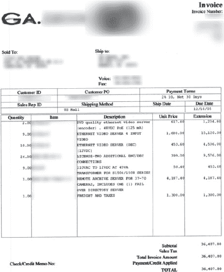

这张发票也注明了日期，但它透露了客户信息和定价数据。最让我感兴趣的是，发票上列出了物品描述，似乎布局了一个非常高端的安全系统。它列出了视频服务器(能够支持多达四十个摄像头)、视频编码器、电源等。具有讽刺意味的是，这种高科技安全系统的发票将会放在 P2P 网络上供全世界观看。

这是另一份有趣的文件:手机账单。

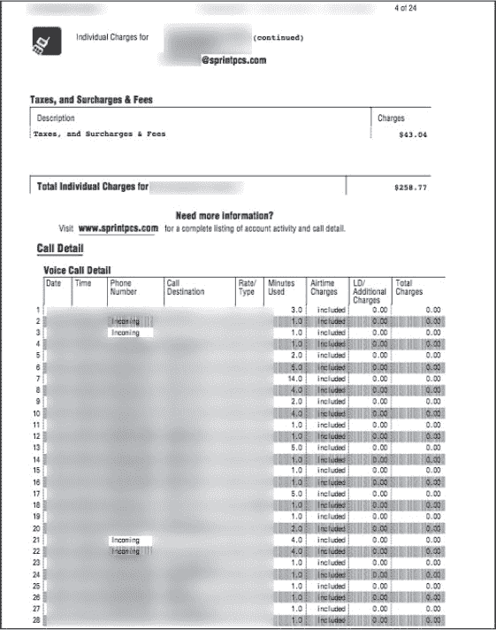

我个人并不认为我想与全世界分享这些信息。这份 24 页的文件列出了客户的姓名、地址和电话号码，还列出了整个月的手机通话记录。它列出了每个发出的呼叫和收到的呼叫。它接着列出了一个月的通话时间、时长和费用。如果一名高科技黑客试图以电子方式获取这些数据，那将是一项艰巨的任务。但是对于一个没有技术含量的黑客来说，只需要一个快速的 P2P 黑客会话或者一轮翻垃圾箱。

如果有黑客在追我怎么办？

想到黑客以你的个人信息为目标是很可怕的，但要明白 P2P 黑客攻击不是针对特定的个人。P2P 盗号就是根据特定的关键词找到感兴趣的信息。如果黑客在跟踪你，他或她可能不会登录 P2P 客户端来搜索你的信息，因为这假设你正在运行 P2P 客户端*和*，你已经在那里共享了个人数据。这两个都是相当大胆的假设。因此，如果你运行 P2P 软件，确保你确切知道你共享的是什么，然后集中精力确保你的个人防火墙和反病毒/间谍软件/广告软件是最新的，并且配置正确。

Word 文档在 P2P 网络上比比皆是，可能是个人信息的巨大来源。下面的文档列出了比大多数更多的信息。

姓名、出生日期和社会保险号是有趣的信息，但这份文件也透露了保险单信息。与金融信息相比，这些都相形见绌。看看下面的文件。

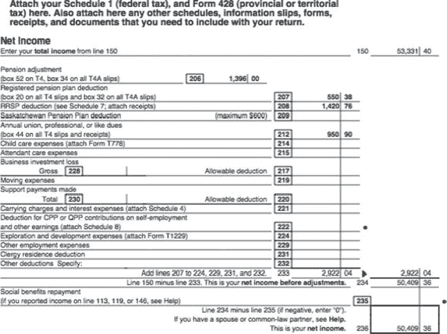

这份税务文件很可能是基于计算机的税务准备程序的一部分。它提供了个人财务信息的摘要。更多的财务信息可以在下面这样的文件中找到，因为标题中的*直接借记*这几个字真正吸引了我的眼球。

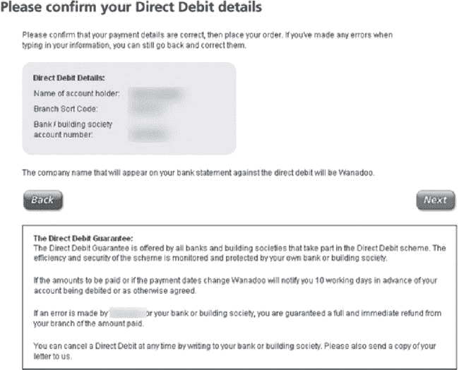

该文档的所有者首先在他或她的浏览器中查看了该文档，然后可能将其作为文件保存在本地硬盘上。不幸的是，它被保存到了一个点对点软件用作共享文件夹的目录中，保存的文档被共享给了全世界。不幸的是，对于这个用户来说，他的名字、银行账号和分行代码现在都是公开记录。

其他银行信息也很容易获得，如下图所示。

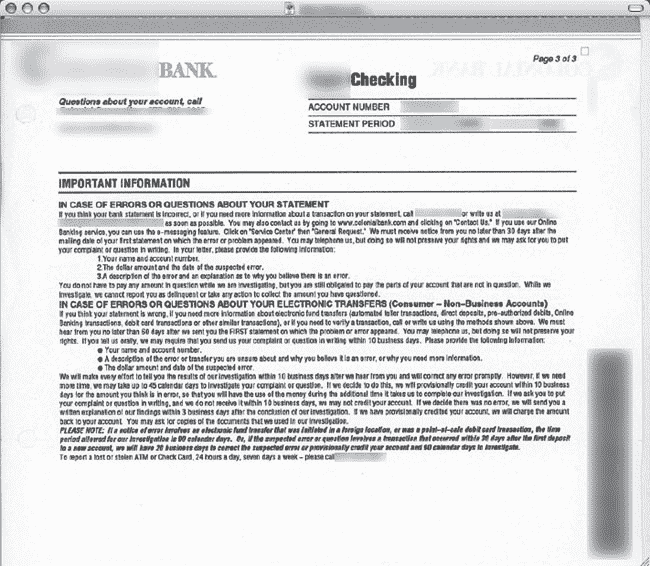

这份多页文件列出了账户信息，包括账号、余额、费用和提款。如下所示，报告中包含了文档的一页又一页。

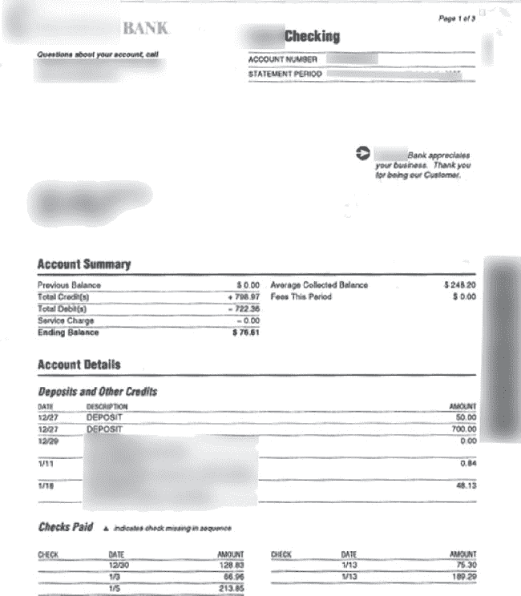

对于一个没有技术含量的黑客来说，这是很棒的东西，但它只描述了一个帐户。类似下面的文档列出了多个帐户的信息。现在我们进入了一些真正疯狂的事情。

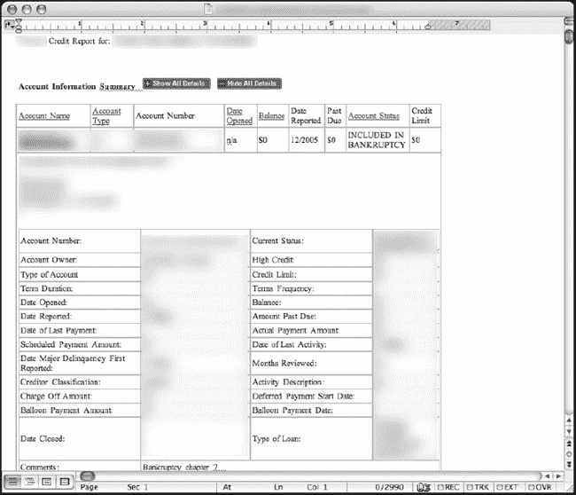

这是一份完整的信用报告。它列出了账户名称、银行信息、余额、贷款等——几乎是一个人可以积累的每一点财务信息。身份窃贼需要比这少得多的信息来完全接管一个人的身份。不幸的是，正如下一个截图所示，这类信息并不缺乏。

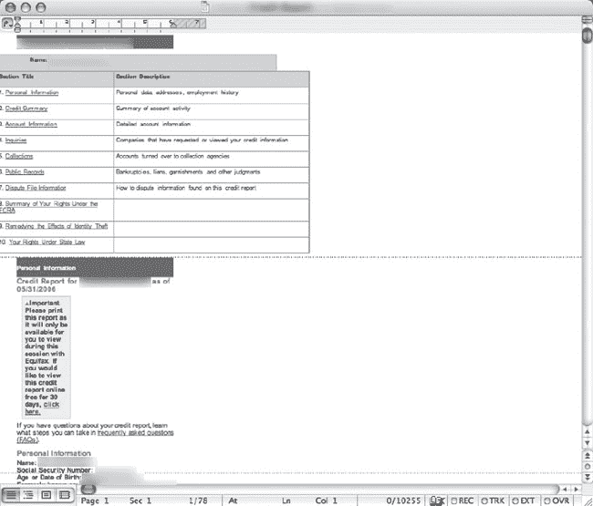

我可以列出上百个这样的例子，但让我们再来看一个。查看下一篇报道。

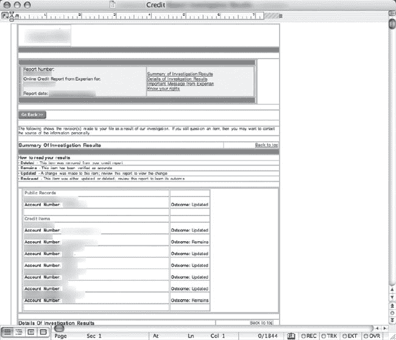

其他更简单的文档，比如下面的，只是列出了敏感的部分。就像信用-报告-浓缩(无果肉)。

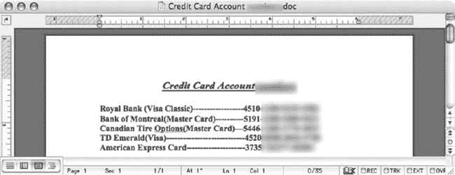

我可以继续说下去，但是真的没有必要。P2P 网络上不缺敏感信息，找到它根本不需要太多技巧。让我们来看一个真实世界的 P2P 黑客会话。

# 真实世界的 P2P 黑客:淘气按摩师的案例

当我发现下面的文件时，我清楚地记得当时的想法是“多可爱啊。”这不是一份真正有趣的文件——它只是欢迎新的脊椎指压治疗患者，并继续谈论肌肉和脊柱等东西到底有多重要。

但是想了一会儿，我开始怀疑我是否偶然发现了一台医生的家用电脑。我在我的 P2P 客户端中右击该文件，选择*浏览*来查看那台电脑上的其他文件。结果显示在下一张照片中。

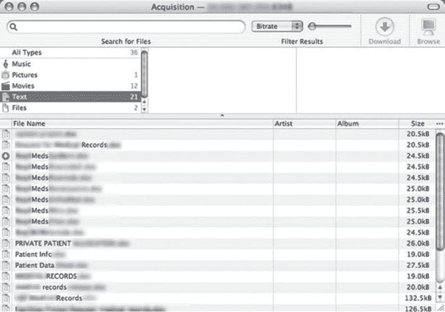

我点击了*文本*链接，查看基于文本的文件，比如微软 Word 文档，当结果在屏幕上滚动时，我几乎不敢相信自己的眼睛。我看到了一份又一份的记录文件、私人患者数据和药品(药物)申请。我在看私人病人数据。我正在浏览包含一些极其敏感的患者医疗数据的文档列表，很有可能 P2P 网络中的其他人已经下载了这些文档。没有人知道这些数据已经传到了世界的哪个角落。这个信息让我意识到这可能不是一台个人机器——它很可能是医生用于业务的机器。我决定多浏览一下这台机器。我点击了 P2P 屏幕顶部的*电影*链接，浏览了下一个屏幕显示的结果。

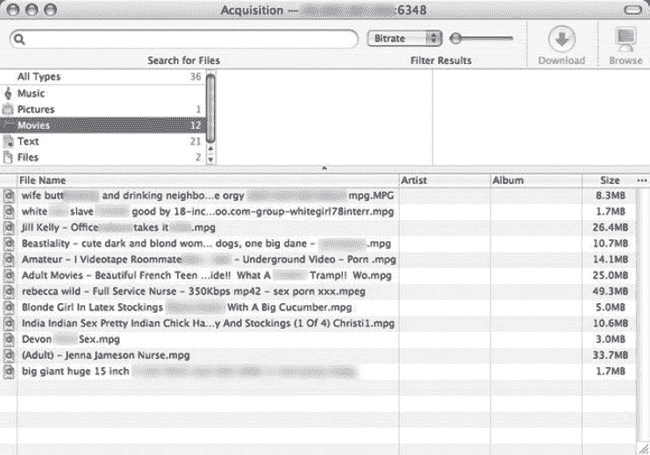

这些视频的名字太下流了，以至于我本能地回头看看是否有人看到了我所看到的。大多数色情视频都以性感的护士、少女和穿丝袜的女人为中心。有些视频标题太恶心了，我不得不模糊掉大部分标题来呈现照片。最令人不安的视频描述了与动物的性行为，并提到了“白奴”等术语这些视频是够恶心的，但后来我想起来这很可能是一个医生的机器。如果这是医生的机器，我想知道他的病人是否知道他不仅对他们的记录完全不负责任，而且是个彻头彻尾的混蛋。我知道我不想让一个收集这种东西的医生接触我关心的人。

我翻回到*文本*列表，并读出了一个看起来并不敏感的文件名。我下载了文件，显示在下一张照片。

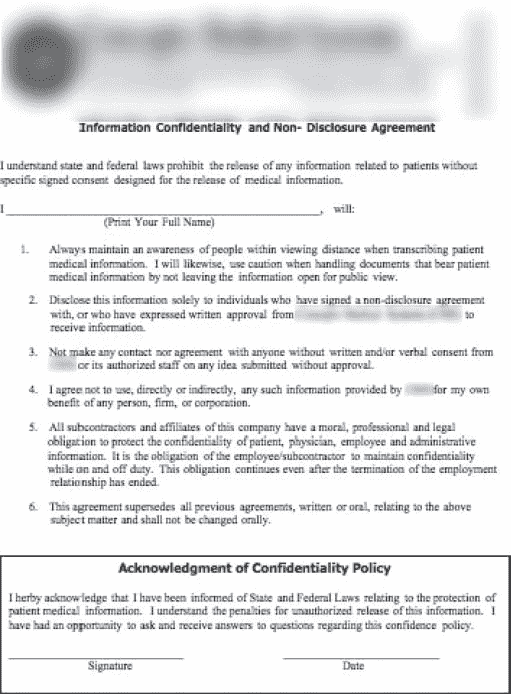

这份文件本来没打算搞笑，但它还是让我笑了。这是一份保密协议，医生的员工要签署并注明日期，同意在没有签署同意书的情况下，他们不会透露病人的信息。它接着指出，雇员有一定的道德和职业义务来保护病人的隐私，未经授权泄露病人信息会受到处罚。我简直不敢相信这份文件会和私人病人数据以及性感护士黄片放在同一个文件夹里。但是非技术黑客看到了各种有趣的事情。