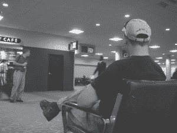
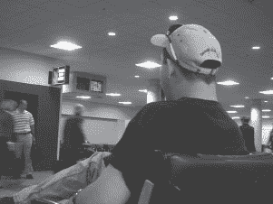
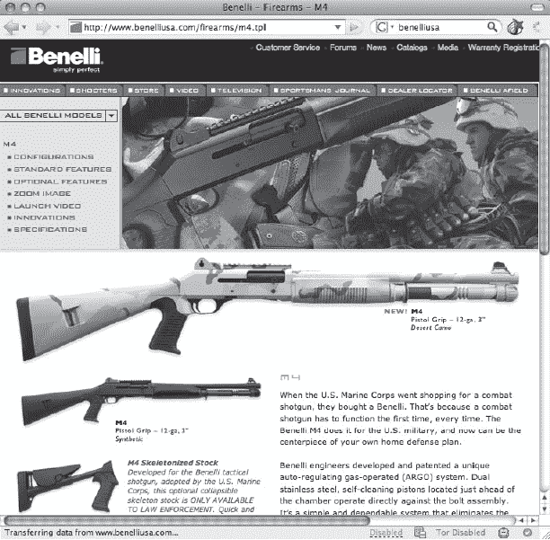
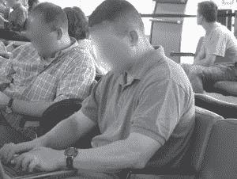
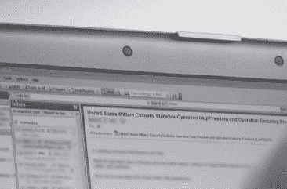
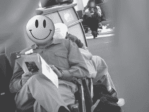
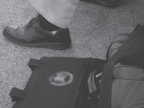
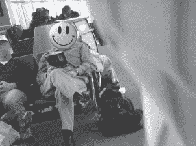
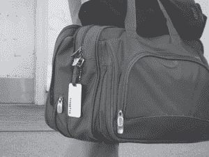

第八章人们在看

我的朋友、本书的技术编辑斯科特·平宗(Scott Pinzon)一直很喜欢(也很喜欢)那首歌，“来自伊帕内玛的女孩”但是在那首歌里看她的家伙显然是个业余的观众。如果他读过这一章，他可能已经知道她住在哪个酒店(酒店门卡)，她大概的收入(那些人字拖是沃尔玛还是杜嘉班纳的？)，甚至可能是她的房间号(在偷看了服务员账单上的房间号之后)。有经验的人只需快速浏览几眼，就能学到更多东西。在这一章中，我们将看一些吸引非技术黑客眼球的例子。

# 如何“看人”

看人是真本事。事情太多了，我不可能在短短的一章中涵盖所有的角度。但这是一个重要的话题，因为一个体面的非技术黑客只要注意就可以很好地了解一个人。在这一章中，我们将看一些有效的人观察的简单例子。

让我们从下一张照片中的绅士开始——前景中戴着棒球帽的家伙。关于他你能告诉我些什么？

让我们从靴子开始。虽然我还不够精通，无法分辨阿迪达斯 GSG9 和高科技 Magnum Stealth，但我可以毫无疑问地说，那是战术靴。这条牛仔裤很难描述，除了他的钱包露在外面的事实(不，我不会试图抓住它来更好地了解这个家伙)，他的黑色 t 恤告诉我，他是一个硬汉类型(或严重的想成为)。他的目光锁定在一名女乘务员身上，这强化了硬汉形象，让我们了解到他的性偏好。他的发型很短，尽管现在说他是否会用“高而紧”来形容还为时过早——这是一个军事术语，指剪得高而紧的头发。他的眼镜是 Oakleys，我听说人们称之为*射手，*，因为他们经常出现在射击场，由射击的人佩戴。你知道，枪。最重要的是棒球帽。背面有一个很难看清的标志，但这里有一个特写。

标志上写着*[BenelliUSA.com](http://BenelliUSA.com)。*这是 Benelli USA 网页的屏幕截图。

说贝内利制造枪支就像说美国国家航空航天局制造瓶子火箭一样。Benelli 生产伪装的穿甲猎枪，内置导弹发射器和火焰喷射器。好吧，所以他们不制造导弹发射器和火焰喷射器，但他们为猎人、海军陆战队和警察制造重要的武器。猜猜这个人是三个人中的哪一个。你觉得你搞定了吗？我敢说这家伙要么是执法人员，要么是军人——很可能是某种特种部队。现在，让我们假设，他在一个坐轮椅的小老太太面前提前登机了？这会改变你对这个人的看法吗？它会改变我的。

让我们看另一个例子。看看下一张照片。

这个很简单。我们来快速盘点一下。头发:高而紧实。手臂:肌肉发达，棕褐色(肘部以下)。配件:一个结婚戒指和一个钢铁侠手表。第一印象很简单——已婚，军人。

一次快速的肩部冲浪证实了这一点。他目前的电子邮件主题是“美国军事伤亡统计”，他的收件箱显示来自上尉上校(LTC)和少校(MAJ)的电子邮件。我不在乎这家伙想干什么，因为我不是坏人。然而，如果我是一个坏人，我会在很短的时间内获得这个人的大量信息。

让我们再做一个。看看下一张照片。

我用相机上的旋转镜头，背对着这个人站着，向后拍摄。在这个过程中，我在镜头中捕捉到了一点我的衬衫，这模糊了照片的边缘。但是看看我们的目标，我们看到了熨烫过的宽松裤，黑袜子和翼尖。他的衬衫绝对是商务休闲装，尽管是一种奇怪的粉橙色。他戴着一块漂亮的手表，戴着一枚很大的班级戒指。这份杂志是某种金融/新闻小报。

到目前为止，他似乎符合管理类型的模式，但故事还没完。我走近他，站在他旁边，给他的包拍了张照片，如下图所示。

那家伙似乎没有注意到我就站在他旁边给他的东西拍照。这个袋子上有一个非常特殊的美国政府机构的标志，这个标志最近在国际新闻中被强调。由于该机构非常具体的任务和最近的公众兴趣，我知道在世界上的某个地方有人会非常有兴趣知道这个家伙要去哪里，他从哪里来。我走回到我原来的位置，在他前面一段距离，并排队我的下一次向后击球。

我当时并不知道，但当我拍照时，他直视着我的镜头，给了我这个表情。我真的希望我能给你看他脸上的表情，但我不会危及他的隐私。请相信我，当我说他给我这个死一般严肃的*你为什么要拍我的照片，你这个跟踪恐怖主义卑鄙小人*的那种眼神。如果我知道我拍照的时候他正看着我的相机，我肯定不会逗留太久去拍下一张他的名字和飞行常客号码的照片。

这个例子最让我惊讶的是，我知道这个人看到我给他拍照。他很有可能看到我拍了很多照片，他甚至可能在我围着他转的时候观察我，拍下(我认为是)他和他的装备相对分散的照片。知道他为一个有趣的政府机构工作，我不知道他为什么不对我做些什么。我没有恶意，但他不可能知道这些。据他所知，我可能是某个在机场偷拍他照片的令人毛骨悚然的跟踪者，或者更糟。我可能是由一个外国政府资助的，他让我负责跟踪他的机构的活动。真的不知道我是谁，但这个人选择了做大多数人做的事情——什么都不做。这就是问题所在。在某个时刻，应该向*某人举报令人毛骨悚然的跟踪狂。我只能希望发生在这个家伙身上的最糟糕的事情是他的模糊的，无法辨认的照片被刊登在这本不起眼的书上。*

耍聪明

你可能会为你工作的公司感到骄傲，但有时悬挂团队旗帜是个坏主意。这些例子集中在政府和军队中的个人。我不想做任何陈述，只是我没有包括任何公司的例子，尽管我有来自整个公司范围的例子:银行、金融、制造、投资、医疗保健、零售等等。根据当前事件、政治气候或其他因素，任何人都可能成为公众监督或不必要关注的目标。政府机构多年来一直要求员工低调出行，但这些机构仍然生产带有机构标志的签名产品。我能给你的最好建议是聪明点。花点时间考虑一下你的个人资料，时不时地扮演一下偏执狂。一个没有技术含量的黑客可能是你最不担心的。