# 十、车辆监控

没有汽车追逐场景的间谍电影是不完整的。但这需要大量的拍摄、巧妙的剪辑和庞大的预算，所有这些都是为了创造一些令人兴奋但虚假的东西。大多数人没有意识到的是，一些最惊险的车辆间谍活动发生在汽车完全不动的时候。

# 车辆监控有多简单？

无论是在去我打算闯入的客户大楼的路上，还是在闲逛，我都会注意到车辆。我不像一个汽车迷，喜欢有趣的，旧的，或异国情调的汽车，但我得到了某种(奇怪的)刺激，通过看他们的车来建立一个司机的档案。非技术黑客真的很擅长这个，在这一章，我会告诉你他们在寻找什么。看看下一张照片。关于司机你能告诉我些什么？

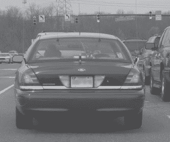

好吧，我承认——我们开始得很容易。除了从每个面板和窗户伸出的竖立的天线之外，还有一块金属板(如下所示),上面清楚地标明了这是哪种车，以及司机的职业。

如果你猜测这辆车是一辆“秘密”或“无标记”的警车，你是对的，你可能对车辆监控有一点了解。接下来的逻辑推断是，假设司机不是警察，就是偷了警察的车是安全的。

让我们看看另一个。关于下一张照片中的司机，你能告诉我些什么？

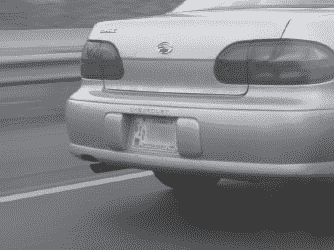

标签上写着“美国政府”和“仅供官方使用”如果你猜是*政府雇员，那么*恭喜你——你真的很幸运。坚持下去。让我们看另一个例子。看看下一张照片。这辆车的司机*以什么为生*就更明显了，但是一个没有技术含量的黑客会考虑用这些信息做什么呢？

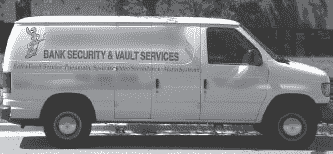

当我第一次看到这辆货车时，我想到了*社会工程。*穿着合适的衬衫，戴着合适的标志，我可以成为“极致”银行安全&保险库服务的家伙，准备好为这家公司的保险箱、金库、气动系统或警报系统工作(不是说黑客会对这些东西感兴趣)。让我们试试另一个练习。看下一张照片。

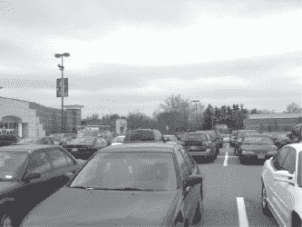

大多数正常人只会看到拥挤的停车场。一个足球妈妈会马上知道这是美国柯尔百货公司百货公司的停车场，他们会立即左转，被“本赛季最大的销售”吸引，恰好每隔一周举行一次。一本书腊肠(像我一样)会认出停车场对面的巴诺书店。一个没有技术含量的黑客会立刻想到“联邦”——联邦特工的俚语，一个用来识别联邦政府雇员的术语。他怎么会意识到这一点？你能从上面的照片看出来吗？如果你不太清楚，看看下一张照片，它突出了“美联储”的车辆。

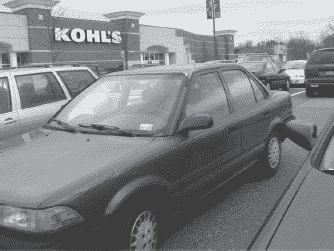

走近一点，一个没有技术含量的黑客会意识到这辆黑色的车确实是一名政府雇员的，而且他或她还会知道这名雇员大概在哪上班。所有这些信息以及更多的信息都可以从贴在车窗上的车辆通行证上收集到，如下图所示。

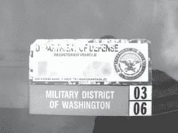

这些贴纸无处不在，尤其是在维持大量军事或政府存在的地区，如军事基地和政府所有的商业走廊。许多装置也使用彩色编码的许可证，就像下一张照片中显示的那样。

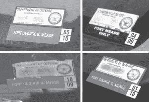

这些许可证的颜色(或灰色阴影，由于黑白打印的光谱挑战性)很重要，因为它们揭示了员工的地位和/或级别。在某些情况下，排名会更明显地显示出来，如下图所示。

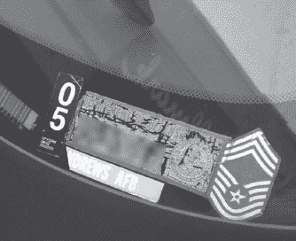

在这种特殊情况下，快速的谷歌搜索显示，这辆车的主人是美国空军的军士长。

有些贴纸让我忍俊不禁，就像下面这张。

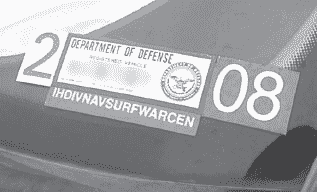

有趣的不是贴纸，而是缩写——IHDIVNAVSURFWAR CEN。这是我在现实生活中见过的最长的缩写词之一。我很想跟着这辆车，这样我就能确切地知道“冲浪战争”是什么样子。这无疑会给“拍摄卷发”赋予新的含义政府雇员不是唯一被非技术黑客盯上的人。快速浏览下一张照片中的沃尔沃，可以看到车主工作或居住的地方。你能告诉我是怎么回事吗？

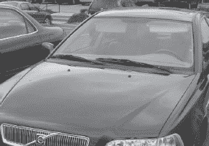

答案不在于车辆的牌照或车辆识别号，而在于车窗贴纸，如下图所示。

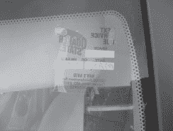

照片由加兰·格莱斯纳提供

像这样的换油贴纸看起来很无害，但是一个没有技术含量的黑客可以通过简单的推理意识到这个地址可能就在车主工作或居住的地方附近。如果车辆停在工作停车场，并且地址不是本地的，那么很可能就在他们家附近。大多数人不会在远离正常通勤路线的地方换油。

在某些情况下，通过查看司机的车辆，很容易获得司机的历史记录。从下一张照片来看，你能告诉我司机住在哪个城市，那个城市的哪个部分，以及他们在那里住了大概多久吗？

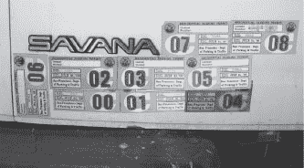

照片由加兰·格莱斯纳提供

这个城市很容易辨认——停车许可证上有详细说明。考虑到第一张停车许可证在 2000 年 7 月到期，猜测他或她在旧金山住了多久是相当简单的。弄清楚司机住在旧金山的什么地方需要一点创造力。然而，谷歌是一个没有技术含量的黑客的朋友。快速搜索*旧金山住宅停车许可地图*会把我们带到一个方便的 PDF 地图，下面显示了其中的一部分。

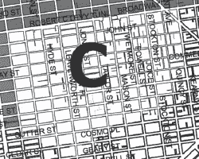

这张地图清楚地标明了许可证在哪里有效，为我们指出了司机居住的大概区域。下一张照片非常相似，可以用来推断相同的信息，但在这种情况下，一个没有技术的黑客也可以确定司机以前住在哪里，他们什么时候搬家。你能吗？

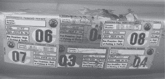

照片由加兰·格莱斯纳提供

从停车许可证上的日期来看，司机在 2004 年 2 月至 6 月间的某个时候从三藩市居住许可区*【A】*搬到了居住许可区*【C】*。使用上面谷歌的地图，我们可以很好地了解旧金山两个居住许可区的确切位置。

到目前为止，我们只看了汽车的外部。尽管我们可以用许多其他的东西来推断信息，但是一些最好的东西经常放在任何路过的人的车内，就像下一张照片中的收据。虽然我不得不摆弄我的破相机的变焦来捕捉文件而不是窗户上的雨滴，但我认为照片拍得很好。

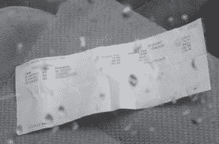

这张收据列出了医生的姓名、地址和电话号码，病人(大概是司机)的姓名和保险公司，在特定日期提供的服务清单，以及这些服务的费用。大多数人都非常严格地保护他们的医疗信息，但我经常惊讶于我经常在公开场合看到这样的信息。

对大多数人(和大多数身份窃贼)来说，比医疗数据更重要的是财务数据。我在一个员工停车场拍摄了这张照片。这份文件属于一位高级主管。

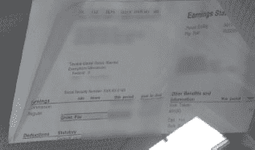

如您所见，它显示了员工的姓名、福利信息、净工资和总工资、税收信息等。在我看来，最有价值的信息是员工社会安全号码的最后四位数字，这被大多数自动身份验证系统用作安全问题。有了这些信息，我可以很容易地用这个人的名字建立信用，或者完全窃取他们的身份。

当然，当我在公开场合捕捉到这样的信息时，我往往会变得非常激动，但正如下一张照片提醒我的那样，有些人就是不在乎保护他们的隐私。这就是为什么身份盗窃将继续成为一个繁荣的犯罪行业。

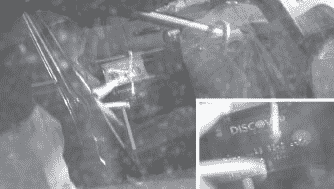

我无法抗拒，所以这是一个糟糕的双关语——“发现是值得的。”这张信用卡上的数字可以很容易地被用来从任何不遵守相当严格的信用卡审查程序的供应商那里购物，而且他们中的许多人都不遵守。如果你把你的医疗记录、银行对账单或信用卡放在你的前座上，很有可能一个非技术黑客会在你开始移动它之前看到它。正如我在其他章节中说过的，保护自己的关键是保持警惕，试着从一个非技术型黑客的角度看待生活。查看后记，获得更多好的建议。