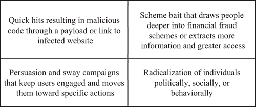
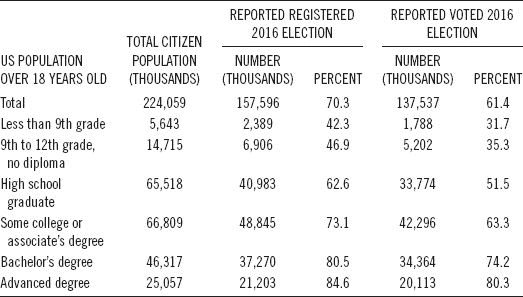
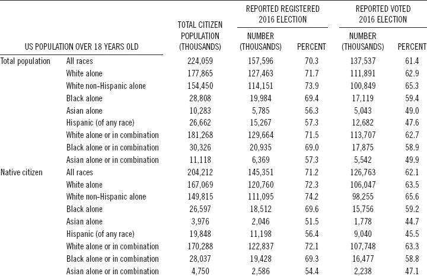
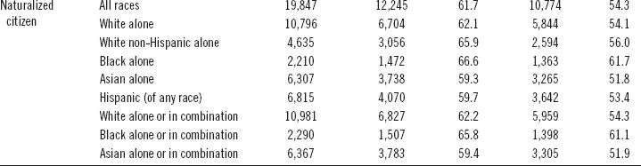

# [8](contents.xhtml#re_chapter8)

# [育人防社会工程攻击](contents.xhtml#re_chapter8)

当谈到防止社会工程攻击时，主要的防御措施是防止垃圾邮件，要求代码运行系统的权限，以及各种组织和政府机构提供的提示表的集合。希望这些努力有助于减少社会工程攻击的数量和有效性，但攻击仍在继续，人们继续受害，每年损失数十亿美元。因此，对公众进行预防教育的努力需要大大扩展，最重要的是，应该包括打击虚假信息、错误信息和假新闻的准确信息，并以公正和准确的信息做到这一点。这将需要使用所有通信工具，以便让人们了解通过所有媒体传播的不准确或恶意材料。这一章研究了当防御者试图阻止来自 DC 圣彼得堡或华盛顿州的社会工程攻击时所面临的许多挑战。

## [8.1 社交工程攻击有多种形式和规模](contents.xhtml#re_ch-8-sec-1)

对许多网站上提供的帮助保护消费者的提示表和建议的审查清楚地表明，需要做出更大的努力，使这些信息更有用，并得到更广泛的传播。除了有用性和分布缺点，大多数关于社会工程的提示和建议都相当平淡和浅薄。需要防范不止一种类型的社会工程攻击，一刀切的教育和意识培养方法是不够的。[图 8.1](#fig8.1) 显示了四种类型的社会工程攻击，人们可能成为这些攻击的受害者，最终导致他们生活中出现无数问题。

图 8.1 社会工程攻击的类型。

本书前面的章节研究了许多不同类型的社会工程攻击和动机。为了帮助规划意识和教育计划，图 8.1 所示的四类社会工程攻击可以作为教育工作者的规划和指导工具。通过电子邮件或恶意网站链接的快速点击攻击无疑是最容易解释和防御的攻击，剩下的问题是为什么这么多人仍然成为这种攻击的受害者。

吸引人们更深地陷入欺诈计划或获取更多信息和更大的系统访问权限的方案诱饵攻击是有效的，因为人们要么很少注意这种攻击中涉及的安全问题，要么他们成为虚假承诺、贪婪或某些原始欲望的牺牲品，以查看点击链接应该提供的奖励。尽管有数以千计的关于此类攻击的警告，人们年复一年地陷入陷阱。

说服和动摇运动攻击更加复杂，社会工程也更加复杂。承诺提供阴谋内幕，或者关于名人或政治家的恶意文字或照片，让用户参与进来，并促使他们采取更具体的行动。这包括继续关注帖子或电子邮件以了解或了解更多信息，尤其是当涉及到情绪话题时，如伊斯兰恐惧症、仇外心理、种族主义、性别歧视或对自由主义者的仇恨。这些攻击旨在让人们尽可能长时间地参与进来，并在可能的情况下将他们招募到一个由相似思想家组成的象征性氏族或部落中。这种类型的攻击更难解释，因为人们对他们的信念做出反应，并被他们想听到或看到的东西吸引，而不是更平衡的观点。

旨在使个人在政治上、社会上或行为上变得激进的社会工程攻击比说服攻击更复杂，而且对那些有仇恨、种族主义、无政府状态、暴力和反社会行为倾向的人更有效。在过去几年里，这些运动因伊拉克和叙利亚伊斯兰国、伊拉克和黎凡特伊斯兰国或达伊沙(ISIS)而闻名，因为该组织努力招募人们作为支持者或战士加入这一事业，但俄罗斯在 2016 年大选之前和期间对美国的社会工程攻击同样复杂，当然也同样卑鄙。

除了了解社会工程攻击的类型之外，了解互联网用户群体是如何被许多社会、经济和教育特征划分的也很重要。这些部分以不同的方式学习，以不同的方式保留信息，并对安全性有不同程度的关注。他们中的许多人在网上工作时完全忽略了安全性。

## [8.2 需要教育的选民群体的多样性](contents.xhtml#re_ch-8-sec-2)

使一刀切的认识或教育运动无效的动力之一是人口的多样性。在 2014 年至 2020 年的几个国家的选举中，劝说和分裂攻击被大量使用。这些攻击在某些人群中非常有效，而在其他人群中则不太有效。在美国，投票率和登记率往往随着教育水平的提高而提高。2016 年，美国至少拥有学士学位的公民投票率为 76.3%，而没有高中文凭的公民投票率为 34.3%。[表 8.1](#T8.1) 显示了 2016 年选举中美国选民的不同教育水平，而[表 8.2](#T8.2) 显示了 2016 年选举期间，按种族、西班牙裔和出生地分列的本地和入籍公民的投票和登记情况。 [1](#re_TNF-CH008_CIT00001) ，[2](#re_TNF-CH008_CIT00002)T9】

**表 8.1**2016 年美国选民教育水平的多样性

*来源*:2016 年投票和登记。美国人口普查局。

**表 8.2**2016 年按种族、西班牙裔和出生地分列的本地和入籍公民的投票和登记情况

 

*来源*:2016 年投票和登记。美国人口普查局。

这些数据说明了学习风格的多样性，这是单一的一刀切的意识或教育计划所不能满足的。为了有效地与这些不同的人群沟通，需要多种沟通方式，可能还需要使用多种语言、方言和媒介进行沟通。人口普查数据显示，许多人群可能需要制定专门的认知计划。

除了需要制定多种方法来教育选民如何识别竞选来源发出的可靠客观信息外，还需要教会选民如何识别社会策划的有偏见的新闻媒体和社交媒体活动。政客们会躲在第一修正案的背后，为使用虚假信息、误导性的陈述、公然的谎言以及关于他们的才能、动机和对手弱点的虚假声明辩护。保守派承认，他们正在打一场权力的文化战争，他们不在乎是否撒谎、欺骗、偷窃或亵渎美国民主来取得胜利。因此，需要独立的组织来领导教育工作，用反信息来对抗社会工程化的政治信息，并提供可供选择的主叙事。

美国选举援助委员会与地方选举官员合作，为选举管理开发了一系列有用的技巧。这一系列文章提供了帮助人们进行有效选举的技巧和建议。选民教育项目影响选民投票率。精心策划的项目可以激励和鼓励公民参与投票过程。最重要的是，作为教育工作的一部分，应该包括准确的信息，以便在可靠声音的支持下，打击虚假信息、错误信息和 假新闻。应使用所有通信工具，让人们了解通过所有媒体传播的不准确材料。以下七条建议应该有助于加强选民教育工作。 [3](#re_TNF-CH008_CIT00003)

*   技巧 1:用数据来指导你规划选民教育工作的方法。你越了解你的选民，你的方法就越有效。记住不同的选民有不同的学习风格。了解如何最好地接触投票公众以对抗欺骗性营销，包括新闻源、网站、社交媒体、平面媒体、广播、电视或面对面。通过收集和查看以往选举的数据，深入了解选民:
    *   票数不足
    *   作废的选票
    *   临时选票上的错误
    *   选区缺席投票
*   提示 2:保持你的网站是最新的；经常回顾和评估它。用一个突出的首页来保持它的新鲜和可访问性。为了让你的网站用户友好，确保你有一个干净，简单，视觉上吸引人的演示，避免过多的图片和照片拥挤的内容。用通俗易懂的语言写下来，链接到一个常见问题部分(FAQ ),突出选民最感兴趣的 FAQ。此外:
    *   在 FAQ 部分包括注册要求、投票地点、提前投票和缺席投票。
    *   突出任何影响选民的新法律或信息。
    *   张贴一份简单的运营日历，包括投票者特别感兴趣的截止日期和日期。
    *   链接到为不同类型的投票人提供复杂主题的详尽解释的网站。
    *   包括选举官员的名录。
    *   提供帮助台的联系信息。
    *   如果你的法规允许，链接到候选人和政党的网站。
    *   请无党派的公民和倡导团体、学校、学院或大学链接到你的网站。
    *   为媒体制作一个新闻资料袋。包括新闻稿、社交媒体帖子、库存照片和任何关于选举准备活动的视频。
    *   链接到投票趋势和登记的历史数据。
    *   宣传你的选民教育活动。邀请媒体参加。
    *   使用适应性交流工具，如为视障选民增强所有材料的字体和音频格式。
    *   记得经常更新你的网站。
    *   指派一名知识渊博的员工做你的在线经理。
    *   为有听力障碍的选民创建电传打字机(聋人、重听人或有严重语言障碍的人使用的一种通信设备)(TTY)格式的所有材料。
    *   将您网站上的所有信息提供给您辖区内的少数语言群体，并提供书面和音频翻译。
    *   考虑雇佣一家网站设计公司来评估网站的可用性。
*   秘诀 3:尝试将社交媒体作为一种教育工具，包括 Twitter、脸书、YouTube、移动应用和电子邮件，这可以帮助你接触年轻和首次投票的选民。有效的社交媒体展示需要员工投入大量时间，但相比传统媒体方式，它可以节省大量成本。让知识渊博、热情的工作人员倾听选民的直接问题和意见，并做出适当回应。这也有助于为脸书网页开发一个电子“我投票”贴纸，并鼓励追随者使用它，并在选举日与他们的追随者联系。最后，要求无党派的公民和倡导团体、学校、学院或大学在他们的网站上加入一个链接，在脸书和推特上关注你的办公室。
*   秘诀 4:依靠各种媒体，因为许多选民会更好地记住来自印刷、电视、广播或广告的信息。鼓励当地媒体突出报道你们的选民教育活动。经常发布新闻稿，要求当地报纸把你的选民指南印成插页，实践政治正确来帮助你的竞选获得更多正面报道。还要联系当地的电台、电视台和公共广播站，及时安排有关选民感兴趣的正面信息宣传活动的公益广告。它也有助于使用教育广告牌或与公共交通官员合作，在公共交通工具上放置标志。其他有益的行动包括:
    *   咨询当地公用事业公司和政府办公室，将选民教育插页放入他们的常规邮件中。
    *   用几种语言定期邮寄选民信息手册、棕榈卡或书签。
    *   向您所在州的残疾倡导办公室和代表不同能力公民的组织征求关于如何最好地接触残疾公民的建议。
    *   从部落长官、少数民族选民和少数民族语言倡导团体那里获得关于以文化相关形式提供选民教育的适当方法的意见。
*   提示 5:给予选民个人关注，让你自己和你的工作人员了解所有的选举法、日期和程序，以最好地帮助那些直接联系你的项目的选民。你可以通过个人互动来帮助选民，指派知识渊博的工作人员来帮助亲自到你办公室的选民；准备好选民教育手册、棕榈卡和书签，随时更新，放在办公室显眼的地方。
*   为公民团体、老年中心和养老院建立一个社区外展计划，并安排带着登记表、教育手册、选举日历和投票系统演示参观老年中心是有帮助的。通过在长期护理机构开发项目，帮助居民保持参与并保持他们的选民登记信息最新，并与当地商业和贸易组织、政府办公室和无党派宣传团体合作，帮助对选民进行教育。
*   尽可能多地进行互动，并主动帮助学校、学院和大学进行模拟选举，在选民登记活动中派出志愿演讲嘉宾，并向在您所在地区或他们所在地区赞助选民教育活动的其他团体提供您的投票设备、隐私亭和故障排除程序。这也有助于建立临时卫星站，在登记结束前几周提供选民信息和服务。如果可能的话，在每次选举前使用移动办公室访问高流量区域，如商场、老年中心、图书馆和学院。
*   提示 6:创建一个选民工具包，为你所在辖区的选民提供基本信息。在选民工具包中纳入关于如何登记和登记截止日期以及选民身份要求的信息。还包括投票日期、时间、选票样本、投票指南、缺席和邮件投票选项、帮助台和工作人员的联系信息、网站地址、脸书和推特账户名称。
*   技巧 7:跨平台协调教育，利用多种不同形式的选民教育工具。例如，在网上以小册子的形式提供您的选民工具包，通过印刷、电子邮件、社交媒体和移动应用程序定期发送时事通讯，其中包含及时的文章和与选民相关的截止日期。通过电子邮件、推特和脸书帖子以及邮件提醒选民即将到来的日期。此外，在你的网站上，通过手机应用程序和所有平台上的地图软件链接，提供选区地图和前往投票站的驾驶方向地图。
*   如果可能，提供演示或教育视频，介绍如何投票，如何使用技术，以及您的办公室如何确保选举结果的安全和准确。将这些演示上传到 YouTube 和其他电子渠道。 [3](#re_TNF-CH008_CIT00003)

## [8.3 通过教育互联网用户来中和点击诱饵](contents.xhtml#re_ch-8-sec-3)

网络钓鱼或使用骗局诱饵，诱使人们更深地陷入金融欺诈骗局或获取更多信息和更大的系统访问权限，仍然是用于实现互联网犯罪的主要社会工程方法之一。有许多网站提供欺诈防范技巧，都重申了一个基本主题。方框 8.1 显示了向消费者传达的打击网络欺诈的典型信息。 [4](#re_TNF-CH008_CIT00004)

方框 8.1 打击互联网犯罪的典型公共服务信息

网络钓鱼是指骗子使用假冒的电子邮件、短信或仿冒网站，试图窃取个人身份或个人信息，如信用卡号、银行账号、借记卡 pin 和帐户密码。骗子可能会声称用户的帐户已被破坏，或者用户的一个帐户被错误地收费。

基本信息之后通常是互联网用户应该如何谨慎的提示。虽然明确说明了标准消息，但传递显然不够有效。如果美国，事实上，全世界，真的要做出更成功的努力来反击社会工程攻击，就需要在教育方面投入更多的努力。这可能需要一场大规模的运动，说服人们在汽车上使用安全带，这种运动发生在 20 世纪 50 年代和 60 年代，一直持续到今天。其他大规模的教育活动包括反吸烟、环境保护，如“不要乱扔垃圾，不要污染环境”和“怀孕期间不要饮酒”

美国教育部教育技术办公室(OET)的国家教育技术计划可能是解决方案的一部分。OET 制定了国家教育技术政策，并为如何利用技术转变教学和学习以及如何通过 K-12、高等教育和成人教育使早期学习者随时随地学习成为可能确立了愿景。

OET 提出，技术可以成为转变学习方式的有力工具。它可以帮助确认和促进教育者和学生之间的关系，重塑我们的学习和协作方式，缩小长期存在的公平和可及性差距，并调整学习体验以满足所有学习者的需求。OET 认为，教育领导者应该为创造学习体验设定一个愿景，为所有学习者的成长提供正确的工具和支持。此外，教育利益相关者应该致力于跨越组织和地理界限的合作，利用技术改善美国教育。OET 通过以下方式履行其使命:

*   促进公平获得技术带来的变革性学习体验；
*   支持州、地区和学校领导和教育工作者的个性化专业学习；
*   确保所有学习者在教室里都能接入宽带互联网，并能在学校和家里获得高质量、负担得起的数字学习资源；
*   培养企业家和创新者的强大生态系统；还有，
*   引领前沿研究，提供新类型的证据，并定制和改进学习。

《国家教育技术计划》( NETP)提出了一个国家学习愿景和计划，通过领先教育研究人员的工作，由技术提供支持；地区、学校和高等教育领导人；任课教师；开发者；企业家；和非营利组织。该计划中提供的原则和示例与国会在 2015 年 12 月授权的支持有效利用技术的活动(标题 IV A)相一致。自 2010 年 NETP 以来，美国在利用技术以多种方式转变学习方式方面取得了重大进展:

*   对话已经从是否应该在学习中使用技术转移到如何改善学习，以确保所有学生都能获得高质量的教育体验。
*   技术越来越多地被用于个性化学习，让学生在学习内容、学习方式和学习速度方面有更多的选择，让他们做好准备，在今后的生活中组织和指导自己的学习。
*   学习科学的进步提高了我们对人们如何学习的理解，并阐明了哪些个人和环境因素对他们的成功影响最大。
*   研究和经验加深了我们对人们需要知道什么以及他们需要获得哪些技能和能力才能在 21 世纪的生活和工作中取得成功的理解。通过职前教师准备计划和专业学习，教育工作者正在获得使用技术实现学习成果的经验和信心。
*   复杂的软件已经开始允许我们根据个体学习者的需求和能力调整评估，并提供近乎实时的结果。
*   在全国范围内，在确保每所学校拥有高速教室连接作为其他学习创新的基础方面已经取得了进展。
*   随着高质量交互式教育工具和应用的出现，数字设备的成本大幅下降，而计算能力却在提高。
*   技术让我们重新思考物理学习空间的设计，以适应学习者、教师、同伴和导师之间新的和扩大的关系。 [5](#re_TNF-CH008_CIT00005)

## [8.4 重新思考如何包装社会工程预防信息](contents.xhtml#re_ch-8-sec-4)

教学中最大的挑战之一是理解人们学习的不同。人们学习的方式不止一种，这意味着必须有多种方式来教授相同的信息，以便有效地传达给更多的人。有几种学习模式，NETP 正在努力用技术来实现。

个性化学习指的是针对每个学习者的需求优化学习进度和教学方法的教学。学习目标、教学方法和教学内容(及其顺序)都可能因学习者的需求而异。此外，学习活动对学习者来说是有意义和相关的，由他们的兴趣驱动，并且通常是自发的。

在混合学习环境中，学习发生在网上和个人，增加和支持教师的实践。这种方法通常允许学生在一定程度上控制学习的时间、地点、路径或速度，包括使用可视内容。在许多混合学习模式中，学生在一个大的小组中花一些时间与老师面对面，在一个小的小组中花一些时间与老师或导师面对面，还有一些时间与同龄人一起学习。混合学习通常受益于物理学习空间的重新配置，以促进学习活动，提供各种技术支持的学习区域，这些区域针对协作、非正式学习和以个人为中心的学习进行了优化。

连通性的增加也增加了教育学习者如何成为负责任的数字公民的重要性。我们需要引导能力的发展，以有意义、高效、尊重和安全的方式使用技术。例如，帮助学生学会使用适当的在线礼仪，认识到他们的个人信息可能会如何被收集和在线使用，以及利用对全球社区的访问来改善他们周围的世界，可以帮助他们做好准备，在互联世界中成功地导航生活。掌握这些技能需要对技术工具有一个基本的了解，并能够对它们在学习和日常生活中的使用做出越来越正确的判断。

值得注意的是早期教育技术的研究，以及这项研究如何在未来更广泛地应用于学习。作为网络学习工作的一部分，美国国家科学基金会(NSF)正在研究将新兴技术与学习科学的进步相结合所带来的机遇。以下是国家科学基金会资助的项目的例子。

*   增加游戏和模拟的使用，让学生们不用离开教室就能体验到在一个项目上的合作:学生们积极参与到一个感觉紧急的情况中，必须决定测量什么以及如何分析数据，以解决一个具有挑战性的问题。在一个例子中，整个教室变成了地震的缩小模拟。随着扬声器播放地震的声音，学生们可以在房间的不同位置读取模拟地震仪上的读数，检查新出现的断层线，并拉伸绳索以确定震中。另一个例子是教育中的机器人辅助语言学习(RALL-E)，其中学习普通话的学生与机器人交谈，机器人展示一系列面部表情和手势，并配有语言对话软件。这种机器人将允许学生使用一种新语言进行社会角色扮演体验，而不会有说一种新语言的焦虑。RALL E 还鼓励文化意识，同时鼓励良好的语言技能的使用，并通过实践建立学生的信心。
*   将物理和虚拟交互与连接有形和抽象的学习技术联系起来的新方法:例如，有一个分子项目，让学生操纵分子的物理球杆模型，而相机感知模型并将其与相关的科学现象可视化，如分子周围的能量场。学生对物理模型的有形参与与更抽象的概念模型相关联，支持学生理解的增长。为了实现类似的目标，小学生使用笔在平板电脑表面上用具象化工具和手绘草图来绘制数学场景的图片，就像在纸上一样。与纸张不同，他们可以轻松地复制、移动、分组和转换他们的图片和表示，以帮助他们表达他们正在学习的数学知识。这些可以与老师分享，通过人工智能，计算机可以帮助老师看到草图中的模式，并支持老师将学生的表达作为一种强大的教学资源。
*   交互式三维成像软件正在创造潜在的变革性学习体验:借助三维眼镜和手写笔，学生们能够处理从地球各层到人类心脏的各种图像。这种多功能技术允许学生使用学校通常负担不起的物品，从而提供更丰富、更有吸引力的学习体验。
*   增强现实(AR)作为一种调查我们的背景和历史的新方法:变革教育探索项目的研究人员解决了 AR 技术如何以及出于什么目的可以用来支持关键探究策略和过程的学习。学生可以使用带有 AR 的移动设备来增强他们在当地历史遗址的实地体验。除了体验网站的存在，AR 技术还允许学生从多个社会角度查看和体验网站，并查看其在多个时间段的结构和用途。研究重点是 AR 技术在基于调查的学科实地工作中的潜力，在这些学科中，对时间变化的分析对于促进理解长期内非常小的变化如何可能累积成非常大的变化非常重要。 [6](#re_TNF-CH008_CIT00006)

如果我们希望增加技术在学习中的使用，从教育系统的附加物到不可或缺的基础组成部分，那么教师准备计划和学区之间的合作伙伴关系是我们需要在所有教育团体中建立的合作伙伴关系类型的象征。技术不应与内容领域学习相分离，而应作为教师学习不可或缺的一部分，用于转变和扩展职前和在职学习。我们的教育系统继续见证在线学习机会和混合学习模式的显著增长。高等教育机构、学区、课堂教育者和研究人员需要携手合作，确保实践者能够获得关于研究支持的实践的最新信息，并了解新兴在线技术的最佳用途，以支持在线和混合空间中的学习。 [5](#re_TNF-CH008_CIT00005)

## [8.5 防止个人激进化](contents.xhtml#re_ch-8-sec-5)

互联网上最复杂的社会工程模式是个别公民变得激进，反对他们的人民或政府，并被招募加入暴力极端主义。ISIS 的招募和激进化模式是社会工程被国际狂热分子用来将人们变成暴力极端分子，实现令人发指的暴力行为和反人类罪的历史极端例子。

反恐战争的成功和许多关键基地组织领导人的被捕削弱了该组织袭击美国本土的能力，但逊尼派极端主义运动从完全由基地组织控制演变为一个更广泛的运动。基地组织和其他组织仍然致力于袭击美国，并试图通过媒体和互联网传播社会策划的暴力、伊斯兰和极端主义宣传，扩大对讲英语的西方穆斯林的吸引力。美国人的伊斯兰激进化，无论是外国出生的还是本土的，已经成为一个越来越令人担忧的问题。伊斯兰团体的激进化以及美国的白人至上主义和其他国内仇恨和恐怖团体在全国范围内存在。成功阻止激进化蔓延的关键是在早期阶段识别模式和趋势。

联邦调查局将国内极端分子定义为表面上同化了美国人，但实际上拒绝了美国的文化价值观、信仰和环境。本土极端分子的威胁在规模上可能小于基地组织等海外恐怖组织，但在心理影响上可能更大。自 2005 年以来，联邦调查局、其他联邦机构和外国合作伙伴摧毁了一个独立于任何已知恐怖组织的极端分子全球网络。与该网络有关联的几个人因提供与策划对美国和其他国家的恐怖袭击有关的物质支持而被捕。涉及本土极端分子的案件的明显增加可能代表着执法部门对以前不被视为恐怖主义的活动更加敏感，但我们不能排除本土现象和国内反社会团体和国内狂热分子越来越受欢迎的可能性。

互联网是精通电脑的年轻西方人(男性和女性)激进化的场所，他们认同极端主义意识形态的仇恨信息，有时渴望卷入 T2 意识形态的冲突。暴力极端主义的老一代支持者和同情者，在后 9/11 时代加强执法审查的环境下，已经将他们的激进化、招募和物质支持活动转移到了网上。通过互联网的激进化是参与性的，个人积极参与在网上交流极端主义宣传和言论，这可能会促进暴力极端主义事业和意识形态驱动的暴力。这些网上活动进一步灌输他们的思想，在世界各地的极端分子之间建立联系，并可能成为未来恐怖活动的跳板。 [7](#re_TNF-CH008_CIT00007)

国内恐怖主义是由受主要以美国为基地的运动鼓动或与之有关联的个人和/或团体实现的，如支持政治、宗教、社会、种族或环境性质的极端主义意识形态的主权公民。比如，2014 年 6 月 8 日，拉斯维加斯发生枪击案，一家餐馆内的两名警察在一次伏击式袭击中丧生，凶手是一对持有反政府观点的已婚夫妇，他们打算利用此次枪击事件引发一场革命。总体而言，国内恐怖主义的威胁仍然持续存在，行为者越过第一修正案保护的权利，实现犯罪，以推进其政治议程。三个因素促成了恐怖主义威胁格局的演变:

*   互联网:国际和国内行为体通过信息平台和社会设计的在线图像、视频和出版物，在互联网上发展了广泛的存在，这有助于这些团体激进化和招募接受极端主义信息的个人。这种消息对于参与致力于各种事业的社交网络的人来说是持续可用的，尤其是对于在社交媒体环境中交流自如的年轻人来说。
*   社交媒体的使用:除了使用互联网之外，社交媒体还让国际和国内恐怖分子获得了前所未有的与居住在美国的人进行虚拟接触的机会，从而能够发动本土袭击，并支持招募和灌输活动。特别是，ISIS 鼓励同情者在他们所在的地方对目标进行简单的袭击，特别是对的软目标，或者前往 ISIS 在伊拉克和叙利亚控制的领土，作为外国战士加入其行列。这一信息在美国和海外的支持者中引起了共鸣，最近的几名袭击者声称代表 ISIS 行事。
*   本土暴力极端分子(HVEs):联邦调查局必须确定那些在美国境内激进化并成为 HVEs 的同情者，以及那些渴望从内部攻击国家的人。该局对 HVEs 的定义是，以美国为基地的全球圣战激发的个人，主要在美国被激进化，并且没有直接与外国恐怖组织合作。目前，联邦调查局正在调查每个州的疑似 HVEs。 [8](#re_TNF-CH008_CIT00008)

白宫发布的 2019 年 2 月政策声明承认，美国公众越来越依赖互联网进行社交、商业交易、收集信息、娱乐以及创建和共享内容。互联网的快速发展带来了机遇，但也带来了风险，联邦政府致力于增强公众保护自己免受各种在线威胁的能力，包括在线激进化到暴力。

暴力极端主义至上主义团体和暴力主权公民正在利用在线工具和资源传播社会策划的暴力和分裂信息。这些组织利用互联网进行宣传，发现和培养潜在的新兵，并补充他们在现实世界中的招募工作。这些团体的一些成员和支持者访问主流社交媒体网站，查看是否有人被招募或被鼓励实现暴力行为，寻找机会将目标吸引到私下交流中，并利用流行媒体，如音乐视频和在线视频游戏。虽然互联网为美国人提供了无数的联系机会，但它也为暴力极端分子提供了接触新受众和激进化工具的途径。

作为防止网络激进化为本土暴力的起点，联邦政府将重点提高对威胁的认识，并为社区提供实用的信息和工具，以确保网络安全。在这一过程中，美国政府计划与技术行业密切合作，考虑有助于打击网络暴力极端主义的政策、技术和工具。各公司已经制定了促进互联网安全的自愿措施，如欺诈警告、身份保护和互联网安全提示。

这种方法符合互联网安全原则，这些原则有助于保护社区免受一系列在线威胁，如网络恶霸、骗子、帮派和性侵犯。虽然每一种威胁都是独特的，但经验表明，拥有工具和资源来确保在线安全的消息灵通的公众对于保护社区至关重要。采取这种方法也符合《增强地方合作伙伴防止美国暴力极端主义的能力》和《增强地方合作伙伴防止美国暴力极端主义的能力策略实现计划》中概述的基于社区的框架。

为了更有效地组织工作，美国政府计划于 2013 年初成立一个跨机构工作组，以打击网上激进化暴力行为，该工作组由白宫国家安全人员担任主席，成员包括打击暴力极端主义的专家、互联网安全专家以及美国政府各部门的公民自由和隐私从业人员。该工作组将负责制定实现互联网安全方法的计划，以应对网上暴力极端主义，协调联邦政府的活动，评估这些计划的进展，并确定应对网上暴力激进化的其他活动。该工作组将与联邦部门和机构协调，主要通过三种方式提高认识并传播远离在线暴力极端主义的工具。

首先，关于网络暴力极端主义的信息将被纳入现有的联邦政府互联网安全倡议。教育部、联邦调查局(FBI)、美国联邦贸易委员会(FTC)、国土安全部(DHS)和其他机构的互联网安全计划提供了已经覆盖数百万美国人的平台，相关部门和机构将努力增加与在线激进化相关的材料。

提高互联网安全意识的主要政府平台是 OnGuard Online，由联邦贸易委员会管理，涉及 16 个部门和机构，包括 DHS、司法部(DOJ)和教育部。OnGuard Online，此外还有 Stop 等其他联邦政府互联网安全平台。Think.Connect 和安全网上冲浪(SOS)将开始包含有关在线暴力极端主义的信息。这一信息还将发布在国土安全部网站的打击暴力极端主义主页上，并进行更新，以反映新的最佳做法和研究。

第二，联邦政府将与全国各地的地方组织合作，传播有关威胁的信息。联邦政府互联网安全意识工作取得成功的一个原因是，他们与学区、家长教师协会、地方政府和执法部门等地方组织密切合作，与社区进行沟通。执法部门是提高对暴力激进化认识的一个特别重要的合作伙伴，并且已经在 DOJ 的支持下编写材料。执法部门和机构已经建立了互联网安全计划，并与社区成员和地方组织建立了关系，可以向多个受众提供有关在线暴力极端主义和招募威胁的重要信息。各部门和机构将向当地合作伙伴提供这一威胁的最新评估，并鼓励他们将这一信息纳入其计划和举措。

第三，各部门和机构将利用与社区的现有接触，提供有关互联网安全的信息，以及暴力极端分子如何利用互联网攻击和利用社区的详细信息。全国各地的美国律师历来就一系列公共安全问题与社区接触，他们在其他部门和机构的支持下，如国土安全部、卫生与公众服务部(HHS)和教育部，正在协调地方一级的联邦参与工作。美国律师和参与社区参与的其他人将寻求将有关互联网激进化到暴力的信息酌情纳入他们的工作中。与此同时，联邦政府将与州、地方和部落政府以及执法官员合作，学习他们应对网络威胁(包括暴力极端主义)的经验。

随着联邦政府实现这一努力，各机构将继续调查和起诉那些利用互联网招募他人计划或实现暴力行为的人，同时确保他们继续维护个人隐私和公民自由。防止网络激进化为暴力既需要积极主动的解决方案来减少暴力极端分子影响其目标受众的可能性，也需要确保法律得到严格执行。 [9](#re_TNF-CH008_CIT00009)

## [8.6 FBI 小孩](contents.xhtml#re_ch-8-sec-6)

联邦调查局在提供互联网安全教育方面的一个突出领域是儿童安全。考虑到潜伏在互联网上的许多危险，从儿童掠夺者到网络流氓，从恶意软件到各种骗局，年轻人必须从小就了解网络安全的来龙去脉。这正是该局于 2012 年 10 月推出 FBI 安全网上冲浪互联网挑战的原因，并推出了一个专门的新网站。FBI-SOS 是一个免费的、有趣的、信息丰富的项目，通过教育三到八年级的学生关于网络安全的基本知识来促进网络公民意识。对于教师来说，该网站提供了符合州和联邦互联网安全要求的现成课程，包括在线测试和鼓励学习和参与的全国竞赛。一个安全的在线系统使教师能够注册他们的学校，管理他们的班级，自动给学生的考试评分，并查询考试成绩。

FBI-SOS 网站([https://www.fbi.gov/fbi-kids](https://www.fbi.gov))有六个岛屿，每个年级一个，在各种门户网站中有适合年龄的游戏、视频和其他互动材料。该网站涵盖手机安全、个人信息保护、密码强度、即时消息、社交网络和在线游戏安全等主题。这些视频包括孩子们面对网络恶霸和网络掠夺者的真实故事。

FBI-SOS 包括全国学校间的月度竞赛。根据有多少学生参加，分为三类。每个月，每个类别的十个最高分都会显示在排行榜上。在可能的情况下，每个类别的获奖学校都将接受当地联邦调查局特工的访问。如[表 8.3](#T8.3) 所示，SOS 在线网络项目在过去几个学年里越来越受欢迎。

**表 8.3** 完成 SOS 计划的学生

| 学年 | 学生人数 |
| --- | --- |
| 2012–2013 | Twenty-four thousand four hundred and seventy-five |
| 2013–2014 | Seventy-five thousand three hundred and seventy-seven |
| 2014–2015 | Two hundred and seventy-five thousand six hundred and fifty-six |
| 2015–2016 | Four hundred and ninety-seven thousand two hundred and forty-eight |
| 总数 | Eight hundred and seventy-two thousand seven hundred and fifty-six |

教师的帐户通过验证后，他们会收到一封电子邮件，其中包含管理班级的唯一 URL，以及进一步的说明。链接永不过期，所以他们不需要每年注册 FBI-SOS。注册后，他们可以为每个学生创建班级和访问测试密钥。FBI 不存储学生的任何信息，因此创建测试密钥并跟踪他们分配给每个学生的测试密钥是教师的责任。然后，学生们将在适合他们年级的岛上浏览各种游戏和活动。当学生完成最后一项活动时，他们可以单击“参加考试”冲浪板参加考试。

此时，学生应该确定他们已经准备好完成考试，因为考试可能只进行一次。要参加考试，学生需要输入分配给他们的访问密钥。一旦班级中的所有学生都完成了测试，并且教师单击了“考试评分”按钮，考试就会自动评分。测试结束后，会有一个临时网页显示每个学生的分数以及所有回答错误的问题。教师可以要求学生打印并保存此网页，和/或他们可以通过班级管理系统查询每堂课的考试成绩。班级成绩按考试重点显示个人成绩。

作为全国月度竞赛的一部分，每所学校的总成绩将与全国其他班级规模相似的学校的成绩进行比较。类别由每个学校的学生人数决定:海星是 1-50 名参与者，黄貂鱼是 51-100 名参与者，鲨鱼是 100+ 名参与者。在排行榜上可以看到当月每个类别的十个最高分。除了排行榜上显示的内容，联邦调查局不保存或发布全国范围内的学校排名。排行榜在每个月底都会重新设置。

从 9 月到 5 月，每个月在全国范围内每个参与类别中得分最高的学校将被授予 FBI-SOS 证书。获奖学校的教师也可以获得证书，他们可以填写并分发给每个学生。没有获奖学校或学生的参与证书。在可能的情况下，每个月每个类别的获奖学校将接受当地联邦调查局特工的访问。学校每学年只能参加一次比赛。

SOS 可以在教室或家里随时访问，学生可以按照自己的节奏完成岛上的活动和考试。但是，请记住，完成考试越快，分数越高。这些活动不需要一次完成。虽然 FBI-SOS 网站全年都可以访问，但测试和比赛只在 9 月 1 日至 5 月 31 日期间进行。在夏季的几个月里没有测试。

FBI-SOS 的目标是促进网络公民意识，帮助学生在参与有趣的互动游戏的同时了解网络安全。该计划旨在解决当前的互联网安全威胁，同时牢记每个年级的在线使用和知识。

还有一个针对青少年的反暴力极端主义(CVE)联邦调查局宣传方案，题为“不要做傀儡:拉开暴力极端主义的帷幕”。联邦调查局的主要职责是，与其众多合作伙伴一起，保护国家免受暴力极端分子的袭击。做到这一点的一个重要方法是首先阻止年轻人接受暴力极端主义意识形态。

这个网站就是为了帮助你做到这一点而设计的。它由联邦调查局与社区领袖和其他合作伙伴协商建立，使用一系列互动材料教育青少年暴力极端主义的破坏性，并鼓励他们批判性地思考其信息和目标。该网站强调，通过盲目接受激进的意识形态，青少年本质上正在成为暴力极端分子的傀儡，这些极端分子只是想让他们执行他们的破坏性任务，其中经常包括瞄准或杀害无辜的人([https://www.fbi.gov/cve508/teen-website](https://www.fbi.gov))。

联邦调查局鼓励美国各地的社区团体、家庭和高中使用该网站作为他们教育工作的一部分。所有美国人都被要求加入联邦调查局，揭露暴力极端主义宣传的诱人本质，并提供积极的暴力替代方案。该网站有五个主要部分，每个青少年都必须完成才能成功完成该计划:

*   什么是暴力极端主义？
*   人为什么会变成暴力极端分子？
*   什么是已知的暴力极端组织？
*   暴力极端分子是如何联系的？
*   暴力极端分子影响谁？

完成前五个部分后，青少年被要求复习最后一个部分，在那里获得帮助，然后打印并签署(手写)一份完成证书。FBI 将使用证书链接作为一个指标收集工具来统计有多少人成功完成了该计划，但在此过程中不会跟踪或存储任何用户信息。这个节目包括一些关于美国宪法第一修正案所保障的自由和这些自由的限制的一般信息。联邦调查局建议教师在开始这个项目之前更深入地谈论这个话题。美国联邦调查局还建议，在青少年使用该网站时或在他们完成该项目后，教师可以讨论这些材料。其他组织也可以考虑将该网站纳入安全简报和反欺凌计划。

对于教师来说，重要的是要强调该计划中呈现的暴力极端主义的例子代表了边缘意识形态，不应与任何主流宗教、种族或政治团体的信仰相混淆。提供适当的背景是很重要的，以确保没有人使用本计划的材料作为欺负或排斥他人的借口。

一旦青少年的网络浏览器被关闭或计算机被关闭，该网站不会保留他们在该计划中的进度。因此，该计划必须在一次会议中全部完成。该网站的一个部分包含通过 YouTube 流式传输的视频。如果一个组织在其电脑上屏蔽了 YouTube，请确保在青少年开始在线计划之前取消这一限制。使用本网站不需要注册。美国联邦调查局不接受或储存任何名字或其他个人身份信息在这个网站上。 [10](#re_TNF-CH008_CIT00010)

2017 年 11 月 30 日，代理国土安全部部长伊莱恩·杜克(Elaine Duke)宣布将社区伙伴关系办公室(OCP)移交给预防恐怖主义伙伴关系办公室(OTPP)。OTPP 的使命是加强关于威胁的教育和社区意识，向预防恐怖主义的利益攸关方提供适当的资源，协调相关的 DHS 预防恐怖主义活动，积极打击恐怖主义激进化和招募，并促进早期预警，以便前线捍卫者能够进行干预，制止袭击，并帮助防止个人走上暴力道路。OTPP 是领导、创新和支持联邦、州、地方、部落和地区各级合作伙伴提高效率的主要源泉。它还利用国土安全部的资源和关系，并运用部长的个人领导力，增强公共和私营部门领导人的权能，以刺激社会变革，打击暴力极端主义。

OTPP 实现全面的伙伴关系，支持和加强执法部门、宗教领袖、地方政府官员和社区的努力，以防止激进化和恐怖组织的招募。OTPP 还向这些利益攸关方提供培训和技术援助，以制定 CVE 预防方案，支持有复原力的社区。OTPP 领导该部的 CVE 特派团，其目标如下:

*   社区参与。OTPP 与公民权利和公民自由办公室合作，促进社区参与，以提高认识并促进与社区伙伴的对话，其中包括与 DHS 高级领导层的接触。
*   现场支持扩展和培训。OTPP 支持 DHS 在全国各地的实地工作人员发展和加强地方伙伴关系，并提供培训机会。
*   给予支持。OTPP 与联邦紧急事务管理局(FEMA)合作，根据 2016 财年打击暴力极端主义拨款计划，向基于社区的项目提供 1000 万美元拨款。这些项目的执行期将持续到 2019 年 7 月。
*   慈善活动。OTPP 与慈善团体合作，最大限度地支持当地社区，并鼓励长期伙伴关系；
*   科技行业参与度。OTPP 与技术部门合作，在网上识别和放大可信的声音，并促进对激进化和暴力极端主义信息的反击。 [11](#re_TNF-CH008_CIT00011)

## [8.7 结论](contents.xhtml#re_ch-8-sec-7)

防止社会工程攻击成功需要计算机用户保持警惕并实践安全的互联网习惯。由各种组织和政府机构提供的提示表的集合对于那些已经阅读了它们并遵循它们的建议的人来说，无疑有助于减少社会工程攻击的数量和有效性。然而，世界各地仍有数百万人受害，这清楚地表明，教育工作需要大大扩展和现代化。

## [8.8 要点](contents.xhtml#re_ch-8-sec-8)

本章涵盖的要点包括:

*   有几种不同的社会工程攻击方法和目标，使意识运动和教育计划的发展具有挑战性。
*   除了有用性和分发缺点之外，大多数关于社会工程攻击预防的提示表和建议都是乏味的、肤浅的和低效的。
*   一刀切的教育和意识培养方法不足以教会人们防御社会工程攻击。
*   说服和动摇运动攻击更加复杂，社会工程也更加复杂。
*   旨在使个人在政治上、社会上或行为上变得激进的社会工程攻击通常对那些有仇恨、种族主义、无政府状态、暴力和反社会行为倾向的人更有效。
*   有必要教导选民如何识别社会策划的有偏见的新闻媒体和社交媒体活动，以便教育他们如何识别来自竞选来源的可靠客观信息。
*   如果美国，事实上，全世界，真的要努力反击社会工程的攻击，就需要在教育方面投入更多的努力。
*   人们学习的方式不止一种，这意味着必须有多种方式来教授相同的信息，以有效地传达给更多的人。
*   个性化学习是指根据每个学习者的需求优化学习进度和教学方法的教学。
*   在混合学习环境中，学习发生在网上和个人，增加和支持教师的实践。这种方法通常允许学生在一定程度上控制学习的时间、地点、路径或速度，包括视觉内容的使用。
*   互联网上最复杂的社会工程模式是个别公民变得激进，反对他们的人民或政府，并被招募加入暴力极端主义。

## [8.9 研讨会讨论主题](contents.xhtml#re_ch-8-sec-9)

研究生或专业级研讨会的讨论主题是:

*   当他们或他们认识的人成为社会工程攻击的受害者时，研讨会参与者有什么经历？他们如何从袭击中恢复过来？
*   讨论参与者对互联网上建议人们如何防止社会工程攻击的信息的观点。
*   讨论为什么参与者认为政府没有加大对人们的教育力度，让他们了解[图 8.1](#fig8.1) :社会工程攻击的类型中介绍的各种类型的社会工程攻击。

## [8.10 研讨小组项目](contents.xhtml#re_ch-8-sec-10)

将参与者分成多组，每组花 10 到 15 分钟时间制定一个方法列表，向人们介绍[图 8.1](#fig8.1) :社会工程攻击的类型中介绍的社会工程攻击。完成后，让各组交换他们的方法列表，并花 10 到 15 分钟来评论和综合列表。作为一个班级，讨论在审阅了其他组的列表后，该组的原始列表是如何被修改的。

### [关键术语](contents.xhtml#re_ch-8-sec-11)

*   另类主流叙事:旨在通过提供一种消除极端叙事吸引力的完整文化、政治或社会哲学来取代暴力极端叙事。
*   反信息传递:是在面对面的基础上匹配激进极端主义信息的过程，以减少招募和激进化为暴力极端主义。
*   激进化的反叙事:是一种中和或否定旨在使个人或团体激进化的叙事的叙事。
*   可信的声音:可信的社区领袖、宗教领袖和知识分子的声音，可以对社会或社区产生积极的影响。
*   欺骗性营销:误导人们了解产品、服务或企业活动真相的广告或宣传。
*   虚假信息:是为了欺骗而提供的虚假和不相关的信息。
*   国内反社会团体:反对他们生活和/或工作的大社会的人群或小社会。
*   国内狂热分子:激进组织是他们杀戮、破坏或传播仇恨和恐惧的国家的居民或公民。
*   仇恨信息:社交媒体上使用令人厌恶的语言来嘲笑或歧视少数民族或种族群体的帖子。
*   意识形态冲突:激进团体与主流社会和少数群体之间的冲突。
*   意识形态驱动的暴力:个人或团体对目标实现的暴力，因为他们认为这些个人或团体在某些方面是劣等的，应该受到伤害或被消灭。
*   国际狂热分子(International fanatics):是个人、群体或微型社会，他们与周围的世界有很大的不同，因为他们的信仰体系与他们生活的大环境完全脱节，并且倾向于以暴力方式或政治或经济破坏性方式表现这些差异。他们是激进团体的成员，这些团体跨越国界或影响其他国家的个人或团体，以杀人、破坏或传播仇恨和恐惧。
*   News feed :是一个不断更新的高度个性化的故事列表，包括状态更新、照片、视频、链接，以及个人在脸书上联系的人和事的活动。新闻提要的目标是向人们展示与他们最相关的故事。
*   政治正确:使用无偏见、无歧视的词语、短语或图像来传达想法或信息。
*   正面信息推广活动:推广正面社会行为和抵制负面信息的活动。
*   激进化:是向以前非暴力的个人或团体灌输反社会的暴力意识形态和行动的过程。
*   招兵买马:就是把人拉进一个事业，传授事业相关学说的过程。
*   社交媒体存在:指组织使用社交媒体账户和应用与个人或团体进行交流，以及在任何社交媒体应用上提及、评论、讨论和展示与组织相关或描述组织的任何材料。
*   主权公民(Sovereign citizens)是反政府极端分子，他们认为尽管他们实际上居住在这个国家，但他们与美国是分开的，或者说是独立的。因此，他们认为他们不必对任何政府机构负责，包括法院、税务机构、机动车辆部门或执法部门。
*   视觉内容:是添加到社交媒体帖子中的任何照片、视频或插图。

## [参考文献](contents.xhtml#re_b-1234567901232-bib8)

*   [1。](#TNF-CH008_CIT00001)投票与报名 2016。美国人口调查局。2019 年 2 月 26 日接入。[https://www2 . census . gov/programs-surveys/demo/tables/voting/United States . xlsx](https://www2.census.gov)
*   [2。【2016 年 11 月，按种族、西班牙裔和出生地分列的本地和入籍公民的投票和登记报告。2019 年 2 月 26 日接入。](#TNF-CH008_CIT00002)[https://www2 . census . gov/programs-surveys/CPS/tables/P20/580/table 11 . xlsx](https://www2.census.gov)
*   [3。](#TNF-CH008_CIT00003)加强选民教育计划的 7 条建议。美国选举援助委员会。2014 年 7 月。2019 年 2 月 26 日接入。[https://www . EAC . gov/assets/1/28/educating voders % 5b 3% 5D-508% 20 compliant . pdf](https://www.eac.gov)
*   [4。](#TNF-CH008_CIT00004)在线安全。USA.gov..2019 年 2 月 27 日接入。https://www.usa.gov/online-safety#item-37272
*   [5。](#TNF-CH008_CIT00005)国家教育科技计划。美国教育部教育技术办公室(OET)。2019 年 2 月 28 日接入。https://tech.ed.gov/netp/#
*   [6。](#TNF-CH008_CIT00006)第 1 部分:通过技术参与和推动学习。国家教育技术计划。美国教育部教育技术办公室。2019 年 2 月 28 日接入。https://tech.ed.gov/netp/learning/
*   7 .[。](#TNF-CH008_CIT00007)联邦调查局反恐处副助理处长 Donald Van Duyn 在众议院国土安全委员会情报、信息共享和恐怖主义风险评估小组委员会上的证词。DC 华府。2006 年 9 月 20 日。2019 年 3 月 1 日访问，[https://archives . FBI . gov/archives/news/证言/伊斯兰激进化](https://archives.fbi.gov)
*   [8。](#TNF-CH008_CIT00008)恐怖主义。联邦调查局。2019 年 3 月 1 日接入。【https://www.fbi.gov/investigate/terrorism T2】号
*   [9。](#TNF-CH008_CIT00009)青少年在线安全:努力对抗美国的在线激进暴力行为。Youth.gov。2019 年 3 月 1 日接入。[https://youth . gov/feature-article/online-safety-youth-working-counter-online-radicalization-violence-United States](https://youth.gov)
*   10。联邦调查局的孩子们。联邦调查局。2019 年 3 月 2 日接入。https://www.fbi.gov/fbi-kids[。](https://www.fbi.gov)
*   [11。](#TNF-CH008_CIT00011)预防恐怖主义伙伴关系。国土安全部。2019 年 3 月 2 日接入。https://www.dhs.gov/terrorism-prevention-partnerships[。](https://www.dhs.gov)

