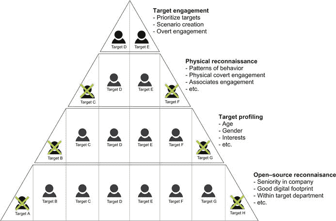
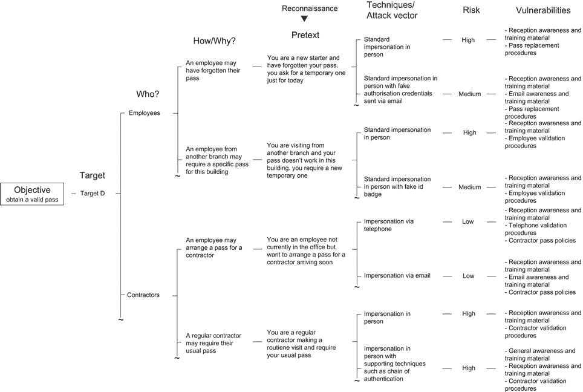

# 七、创建目标场景

Gavin Watson，random storm 有限公司高级安全工程师

一旦与客户就目标达成一致，下一步就是设计满足这些目标的场景。本章提供了一系列模型，测试人员可以使用这些模型来创建有效的场景，这些场景不仅可以满足目标，还可以识别多个漏洞，而不是集中在一个安全缺陷上。这些模型的最终目的是确保评估为客户提供价值，并提高其安全性。

### 关键词

社会工程场景；目标识别；目标剖析；物理侦察；托词设计映射；封面故事；退出策略

本章中的信息

场景的组成部分

目标识别

开源侦察

目标剖析

物理侦察

目标参与度

托辞设计映射

为未知做计划

特定场景的结果

封面故事

退出策略

设计失败

## 介绍

[第 6 章](06.html)讨论了与社会工程评估的威胁建模阶段相关的优势和挑战。这个关键阶段确定最重要的安全威胁，通过将评估集中在正确的领域来确保客户的价值。

为了测试每个确定的威胁，安全顾问将设计并执行社会工程方案。这些场景由多个组件组成，这些组件将在本章的第一节中介绍。每个组件都经过有目的的选择，因此每个场景都是定制的，以识别特定的漏洞并满足明确的目标。

任何场景的基本组件都是目标，有时也称为标记。就社会工程学而言，这几乎总是人类。本文将讨论作者用来记录他们决策过程的目标识别模型。此外，初学者也可以使用该模型来帮助设计场景。这提供了一个清晰且容易遵循的流程。

一旦确定了明确的目的和目标，下一步将是设计一个借口(或似是而非的情况)来实现这一目标，并确定具体的弱点。“托词设计映射”方法可以用来帮助和记录场景设计背后的思考过程。

场景并不总是设计为成功的，因为失败的场景通常可以识别独特的安全问题。将涵盖设计失败场景，以及为意外事件制定计划和准备退出策略。

## 场景的组成部分

到评估的这一步，安全公司应该对其客户面临的重大威胁有一个很好的了解。因此，现在是时候设计场景来评估企业对这些威胁的敏感度，识别多个漏洞并最终提高客户的整体安全性。

每个场景都有多个组件，每个组件都必须明确定义，以帮助测试公司和客户本身(如果只是在文档方面)。为了解释上下文中的每个组件，我们将使用[第 4 章](04.html)中介绍的一个常见的短游戏攻击场景。

**威胁**
客户担心他们的呼叫中心(主要由未受过训练的学生组成)容易受到基本的社会工程攻击。如果攻击者获得了高特权员工电子邮件帐户的访问权限，可能会对商业信誉造成严重的、可能不可恢复的损害。由于呼叫中心实际上有数百名员工，安全风险可能确实非常大。

**目标**
目标从一开始就应该明确，并且与客户的威胁之一直接相关。在这种情况下，目标非常简单:

获得高特权用户的电子邮件帐户的访问权限。

当然，还有一些较小的目标需要首先完成，例如侦察和目标识别，但这是该场景的主要总体目标。

**目标**
本章的下一节将讨论目标识别的正式方法。然而，为了这个例子的目的，我们将假设这已经被执行。 以下员工已被确定为该场景的合适目标。

**A .史密斯，b .史密斯，c .史密斯**
可能有多组目标，每组都与一个特定的场景相关联，因此在这一点上明确定义它们很重要。

**攻击媒介**
在本例中，我们的攻击将按照客户的要求通过电话进行。在这里定义这一点很重要，因为理论上同样的场景可以通过电子邮件来执行。

**【托词(似是而非的情况和人物)**
选择的托词应该是众多能达到相同目的的托词中的一个。本章接下来的几节将介绍产生借口的正式方法。然而，为了这个例子的目的，将使用短游戏攻击场景的借口，如前所述。因此，特征和似是而非的情况如下:

首席执行官(角色)正在与重要客户开会，并且希望重置密码，因为他当前的电子邮件帐户密码不再有效。

**主要技巧**
本例中使用的主要技巧是冒充，因为目标需要相信打电话的人是首席执行官。严格地说，借口也是这种场景中使用的主要技术，但由于借口将构成绝大多数社会工程场景的基础，因此通常没有必要定义它。

**二级/支持技术**
二级技术可用于识别额外的漏洞和/或增加成功的机会(如果增加的成功是有益的)。在这个例子中，测试者可以使用“压力和溶液”来尝试更有效地操纵目标。“压力”可能是首席执行官正在开会，他们对情况不满意，“解决办法”是迅速重设密码。如果使用这种支持技术，那么借口如下:

首席执行官正在与非常重要的客户开会，他对自己的密码无法使用感到恼火。他们希望立即重置，否则可能会有帮助台员工需要处理的后果。

**漏洞识别**
已识别的漏洞直接映射到场景中使用的主要和支持技术。例如:
主要技术——基本模仿=呼叫者识别程序中的漏洞
次要技术——压力和解决方案=认知和培训计划中的弱点

**业务暴露** 业务暴露是指威胁代理成功利用漏洞所造成的潜在损害，即社会工程师成功访问员工的电子邮件帐户并在线发布内容所造成的损害。重要的是要清楚地定义风险，并将其作为最坏的情况。一次成功的攻击和一次明确的暴露至少可以在获得安全改进预算时提供大量的杠杆作用。

**接洽规则**
在设计任何场景之前，通常会与客户讨论该组件。初始简报将定义明确的参与规则，例如不开锁、不损坏公司财产、不中断业务活动以及严格禁止进入特定区域。然而，这个阶段的规则意味着可以用不同的规则设计多个场景来识别不同的问题。例如，客户可能决定他们不喜欢任何撬锁活动，因为这会损坏锁，而更换锁是很昂贵的。然而，有一两个场景可能涉及开锁，只要它们被限制在建筑物的特定区域。然后，测试人员可以执行带锁和不带锁的场景，并将结果呈现给客户，这可能是非常令人惊讶和有价值的。因此，将交战规则定义为各个场景的一个组成部分非常重要。

**资源**
某些场景可以由一名工程师完成，其他场景则需要多名工程师。在某些情况下，多个工程师可以在辅助角色中补充场景，增加成功的机会。因此，用于执行特定场景的资源是一个重要的组成部分。例如，一个场景可能有两个变体，一个有一个工程师，另一个有两个工程师。这两种情况的结果可能会有很大差异。

**环境因素**
这些是组织无法控制的因素，可能会以某种方式影响场景。例如，如果下雨，社会工程师躲在外面看起来会很奇怪。如果有雾，那么安全摄像头会受到影响。如果天气炎热，门窗可以开着。因此，将这些细节作为场景的一部分非常重要，因为当环境因素不复杂时，可能需要重复这些细节。

## 目标识别

社会工程师通常会在头脑中进行目标识别，甚至可能在他们完成复杂场景时在目标之间切换。作为专业的安全顾问，这种自由式场景执行并不总是可行的选择。这并不是说顾问不应该利用在评估中出现的机会，保持清晰的结构很重要。向客户呈现复杂和零星的结果对提高安全性的尝试很少有益。重要的是要尽量保持场景的清晰和一致，这样他们就能识别出他们设计的问题。此外，流程文档对于帮助客户理解所发现的问题至关重要，也可作为日后进行额外测试的参考。最后，对于一个扩展到社会工程评估的公司来说，这种正式的方法可以帮助保持整个过程的清晰和可管理性。

正式的目标识别是一个结构化的排除过程，只产生几个被认为是最适合(目标)的目标。[图 7.1](#F0010) 显示了一个基本的通用目标识别三角形，可用于许多不同的情况。当攻击一家企业时，每一个员工都是潜在的目标，与该企业直接或间接相关的每个人也是潜在的目标。因此，这个过程的起点是用这些目标建立三角关系的基础。目标的数量将会减少，因为它们根据某些标准被“提升”到更高的层。[图 7.1](#F0010) 中的各层标准非常通用，因此可以应用于不同的目标。

<figure class="fig">

<figcaption class="figleg">Figure 7.1 Generic target identification triangle.</figcaption>

</figure>

为了充分解释这个过程，我们将选择一个简单的目标:

获得进入目标建筑的有效员工通行证。

### 开源侦察

提供的示例显示了我们的三角形的基础是如何填充的，xyz 公司的所有员工都是目标 A 到 h。一个真实的公司当然可能有更多的员工，但是八个员工就足以说明这个过程。

为了将目标提升到下一层，他们必须通过一系列基本标准。在第一层，标准是基于开源情报或初步侦察。因为攻击的第一步是研究目标，所以这很有意义。仅仅根据您远程收集的信息和攻击的总体目标，就有可能消灭大量的潜在目标。

**在公司的资历**
选择一个比其他人特权更高的目标往往会更有利。然而，如果目标要求瞄准易受攻击的新手，那么情况正好相反。

**良好的数字足迹**
如果某个目标的信息有限，那么就没有多少信息可以作为决策的依据。作为回应，可以决定设计获取这些信息的攻击，但这样做需要一个好的理由，因为这可能需要时间，而您可能不一定有这个时间。然而，如果目标是首席执行官，而研究只揭示了关于他们的很少信息，那么为获取这些信息而设计的攻击可能是正当的。

目标部门内的 **虽然理论上任何员工都可以提供有效通行证，但通常是前台提供，因此在正确的部门提升目标是有意义的。**

 **在本例中，目标 A 和 H 不符合任何标准，因此被删除。这导致目标 B 到 G 被提升到三角形的下一层。但是，在消除目标时，不一定非黑即白。被提升的目标可能比其余的目标符合更多的标准，或者被淘汰的目标可能不符合“一些”标准。最终由顾问决定如何提升和消除目标。

在本例中，使用了三个标准来做出决策。在实际评估中，根据目标的复杂性、业务和范围内的员工数量，会有更多的评估。** **### 目标剖析

三角形的下一层集中于目标剖析。以前的标准包括拥有良好的数字足迹；应该有足够的关于每个目标的信息来做决定。在这一点上，决策是基于目标的个体特征做出的。显然，这些特征并不能保证成功；这个想法仅仅是为了增加基于概括的成功机会。例如，针对老年人的网络钓鱼电子邮件攻击可能比针对年轻一代的攻击更成功。这里的关键词是“可能”

**年龄**
如上所述，某些攻击的成功率取决于目标的年龄。然而，尽管倾向于选择老年人，因为他们不太可能懂电脑，但要非常小心，不要浪费宝贵的时间。如果目标是操纵目标透露信息，那么选择一个更年轻的新手可能是一个更好的决定，而不是一个 60 多岁的坚定的退伍军人目标。重要的是要仔细考虑目标，以及标准应该如何影响提升或取消目标的决策。

**性别**
这里没有这些标准，因为作者认为一种性别比另一种性别更容易受到社会工程的影响。这是因为场景或目标可能是性别特定的。例如，当一个年轻女孩给他们打电话要求重设密码时，客户可能会怀疑他们的男性主导的呼叫中心人员没有遵循正确的程序。因此，为了符合客户要求，消除女性目标是个好主意。当然，这可能意味着使用男性声音并以女性员工为目标的另一种场景可能会揭示有趣的结果。

**兴趣**
如果调查显示某个目标有很多兴趣，那么这些信息可能会被用来对付他们。
在示例目标中，年龄和性别相对不相关，因此，基于目标 B 和 G 比其他目标具有更少的可用兴趣而将其删除。

### 物理侦察

三角形的第三层远离远程侦察，关注目标以及它们与目标的关系。

**行为模式**
根据不同的目标，这些标准可能意味着非常不同的东西。例如，如果目标是在目标个人在办公室时给他们打电话，那么了解他们的工作时间是个好主意。类似地，如果目标是用信息诱导吸引目标，那么了解他们去哪里吃午饭或者什么时候出去抽根烟是个好主意。此外，这些标准可能更为基本，例如在整个测试窗口中实际上没有可用的目标。

**身体隐蔽接触**
与行为模式类似，目标可以根据他们是否能实际接触来提升或淘汰。身体上的秘密接触可能意味着为了收集信息而拍摄照片或记录目标。因此，如果可以获得某些目标的良好照片和记录，就有更多的理由来宣传它们。对于大多数社会工程评估来说，这种程度的参与通常是不必要的，这里包含它只是为了彻底演示这个过程。真实世界的攻击很可能涉及这一层目标识别，尤其是如果它持续数月的话。

**关联敬业度**
通过转换敬业度，应该清楚谁与目标相关联。他们的密友和同事可能成为攻击主要目标的额外途径。例如，一个亲密的同事可以被用作社会证明支持技术的一部分。同样，如果两个同事明显密切合作，那么最好避免通过冒充另一个人(例如通过电话)来攻击其中一个，因为他们很可能会认出冒充者。

在本例中，目标 C 和 F 在测试窗口期间不可用。该信息可以被利用，因为如果他们不在，他们可以被冒充。但是，对于给定的场景，它们不是合适的目标。

### 目标交战

最后一层根据收集的所有信息，揭示攻击的最佳可能目标。三角关系中不再需要做出任何淘汰或晋升的决定。一直到三角形的顶端，已经将都是接待员的目标 D 和 E 确定为最有益的目标。请记住，真实世界的场景会有许多初始目标，因此三角形的顶部可能远不止两个。

**对目标进行优先排序**
最终目标在整体适宜性方面会有差异。例如，一个目标可能比另一个目标满足的标准稍微多一点，因此，对目标进行优先排序并首先集中于最有希望的目标是一个好主意。

**场景创建**
既然已经确定了一个或多个目标，就该设计一个合适的社会工程场景了。目的和目标可用作“借口设计映射”的基础，这是下一节解释的过程。

**公开参与**
这是与目标互动的最后阶段:社会工程场景的实际执行。

请记住，很有可能到达这一阶段，然后意识到最终目标实际上终究是不合适的。或者在完成这些场景后，你就可以攻击更多的目标了。在这些情况下，重点是三角形中的下一层，重新访问以前消除的目标。通过遵循这一流程，尽可能有效地利用分配的时间，以正确的顺序瞄准正确的人。

** **## 借口设计映射

上一节中描述的目标识别过程揭示了两个合适的目标:目标 D 和 e。该过程现在可以继续到使用目标 D 的借口设计映射阶段，并且目标是获得有效的出入通行证。

[图 7.2](#F0015) 显示了我们目标的借口设计图示例。地图从目标和选择的目标开始。在这个初始阶段，很有可能有不止一个目标，并为每个目标延续这个树，但是这个例子将尽可能保持简单。

<figure class="fig">

<figcaption class="figleg">Figure 7.2 Example of a pretext design map.</figcaption>

</figure>

该树在“谁”阶段分叉，回答谁与目标和目的相关联的问题。在我们的例子中，问题是“接待员会把有效的门禁卡给谁？”。这就产生了两个明显的分支，即“承包商”和“雇员”，因为接待员肯定会向这些群体发放通行证。对于这个例子来说，这只是两种可能性，因为这里会列出更多的组，比如 visitors。

下一个分支回答“为什么”或“如何”的问题，例如“为什么一个接待员会给一个承包商或雇员一张有效的通行证？”。例如，员工可能忘记带通行证，因此今天需要一个临时通行证。或者通行证可以发给执行日常维护的承包商。这可以看作是我们树中的第一个分支。发放通行证的原因有很多，能想到的应该在这里列出来。这形成了借口的基础，并帮助思维映射所有各种可能性。通过将这些分成不同的组，更容易产生可能性，而不是试图从无到有中随机挑选一些东西。

一旦可能性被添加到“如何/为什么”部分，那么开始创造借口的过程就开始了。这个想法是从“如何/为什么”部分继续，并结合侦察信息来充实细节。例如，树上的第一个借口是基于冒充忘记了他们的通行证的雇员。侦察可能揭示了某个雇员在测试窗口期间不在办公室，并且他们刚刚开始工作，这使得接待员不太可能很了解他们。同样，关于承包商执行日常维护的可能性，侦察可能已经揭示了每周来访的第三方的细节。

第二个借口是冒充另一个分支机构的员工，试图获得临时通行证。侦察可能揭示了另一个分支的细节和必要的图像，以创建一个假的 ID 徽章。因此，这个借口当然是可能的。显然，研究进行得越多，就越容易制造借口。

找到借口后，下一步就是要弄清楚将要使用的技术。这是通过彻底和有效确保客户价值的关键阶段。该树分支列出了在相同借口下可以使用的替代技术。例如，涉及忘记通行证的第一个借口可以有两种方式。该顾问可以简单地冒充一名员工，并要求一个徽章，或者他们可以先发送一个假的授权电子邮件到接待处之前到达。同样，这些只是这里列出的许多不同技术中的两种。这两种方法都有一定的风险，列在技术旁边。在该图中，仅冒充被归类为高风险，而使用电子邮件授权冒充被归类为中等风险。这样做的原因是，电子邮件提供了可信度(即使它不符合标准程序)，因此风险应该会稍微小一些。风险分配没有尺度，它纯粹是定性的，最终由顾问决定。

如果目标成功实现，借口中使用的技术和攻击媒介将导致不同漏洞的识别。在我们的例子中，仅仅模仿就可以识别接收特定意识训练的问题，并通过替换程序。但是，如果采用另一种方法，即使用电子邮件授权书，它也可以识别电子邮件特定意识培训的问题。乍一看，第二种方法似乎更有益，但它并不总是那么简单。如果采用第二种方法，确实会识别出更多的漏洞，但采用第一种方法将意味着漏洞更严重(因为顾问不需要任何额外的可信度来获得通过，他们只是要求这样做)。

根据该树，另一种可能性是，如果员工安排通行证，接待员会将通行证交给承包商。一种可能的技术是通过电话或电子邮件冒充。请记住，这只是许多可能性中的两种。这里，两种不同的攻击媒介导致不同的漏洞识别。电话攻击媒介将识别电话呼叫者验证程序的问题，而电子邮件攻击媒介将识别电子邮件特定认知和培训材料的问题。此外，由于这些都是远程攻击媒介，风险相对较低。

当风险级别和已识别的漏洞以这种方式呈现时，我们就可以开始做出一些关于在评估中使用什么借口的正确决策。例如，在评估开始时使用较低风险的借口，在评估结束时使用较高风险的借口是有益的。类似地，由于我们可以看到每个借口识别了哪些漏洞，因此我们可以选择能够识别不同漏洞的良好交叉的借口。如果时间不是问题，那么当然可以尝试尽可能多的借口。然而，在大多数社会工程评估中，它们可能是非常有限的时间。

## 为未知做计划

有一些真正“能说会道”的专业社会工程师，他们能在任何考试可能遇到的情况下侃侃而谈。然而，当试图为想要扩展到社会工程的公司提供建议时，指出这一事实并没有特别的帮助。如果他们有这方面的天赋，那么他们肯定会觉得更容易，但这并不意味着如果他们不是非常外向，他们就不能进行可靠的社会工程评估。事实是熟能生巧；如果有人坚持下去，他们最终会自然地、毫不费力地运用技巧。遵循书中的建议，保持评估的结构化和有效性，将比试图成为自信、直言不讳、能说会道的魔鬼更有益于客户。

对于对目标约定不太有信心的顾问来说，为未知做计划的想法可能非常有吸引力。然而，把所有的答案都准备好的想法当然是可笑的，因为他们不可能为一个场景的每一个可能的结果做好计划。如果一名保安突然靠近，声称要进行随机员工通行证检查，这是有计划的吗？可能不会，但至少客户会在报告中得到一个绿色勾号。如果为未知做计划如此困难，那么考虑各种可能的结果还有意义吗？答案当然是:看情况。如果正在计划鱼叉式网络钓鱼电子邮件攻击，那么可能的结果会通过电子邮件回复呈现出来，因此可能会有足够的时间来决定适当的响应。如果它正在执行一个旨在欺骗特定接待员的场景，那么任何事情都有可能发生，并且可能没有时间来考虑一个适当的响应。例如，就在顾问走进接待处时，接待员可能会出乎意料地改变，从而使特定目标简介激发的攻击变得无用。一个经验丰富的顾问可能会立即转向另一种方法。然而，一个新的社会工程师可能会恐慌，最终可能不知道该做什么，并有暴露的风险。不幸的是，他们不能真的站在那里考虑最好的前进方式是什么，至少这可能会引起怀疑。提前考虑一些可能发生的事件有助于避免这种情况。在下面的章节中有几种方法可以解释这一点。

### 特定情景的结果

一旦确定了目标并设计了场景，扩展借口设计映射树以包括可能的结果会很有帮助。然后可以考虑这些结果，并计划适当的应对措施。每个场景都应该有需要包含的明显的可能结果。例如，让我们考虑社交工程中最老套的场景之一:送货司机。他们的想法是假扮成送货员进入大楼。这种情况相当荒谬，当你考虑可能的结果时，这一点就变得很明显了。

**接待员要求将包裹放在接待处**
现实中有多少企业会让快递员直接将包裹交给收件人？有些可能是，但如果是这样的话，企业根本不需要社会工程评估，他们需要首先从安全基础开始。到目前为止，这种结果是最有可能的，因此攻击将被缩短，顾问被迫离开大楼，几乎没有完成任何工作。

**你不是我们平时的送货员？**
即使伪造了令人信服的制服和证件，员工也很可能会注意到这不是通常的送货人。当他们在表格上签字时，这种情况被完美地复制了吗？如果送货人通常使用电子设备记录签名，这是顾问拥有的东西吗？货车呢，看起来对吗？如果他们怀疑事情不对劲，他们可能会努力证明身份，这可能是一个挑战，特别是如果没有时间准备的话。由于这种结果是可能的，如果他们打算尝试，他们最好有一个非常令人信服的封面故事和退出策略。

**真正的送货员刚刚来过或者同时到达**
一个比较尴尬但很有可能的结果是，真正的送货员和咨询顾问一样意外地来过或者同时到达。尽管进行了彻底的侦察，这种情况仍有可能发生；他们可能因为无法计划的原因而早到或迟到。如果这种情况真的发生，人们很快就会产生怀疑，一个非常棘手的局面就会随之而来。

**接待员让顾问通过**
这确实是一种“可能性”，但考虑到其他各种结果，这种可能性确实最小。

一个非常常见的错误是将所有的计划建立在场景会成功的假设上:为进入大楼做好充分准备，前往目标部门，实现目标并平安离开。然而，如果忽略了对其他基本初始结果的考虑，那么整个攻击就会受到危害。

上述交付驱动程序的示例表明，考虑基本结果会导致决定不尝试攻击。然而，在大多数情况下，考虑结果更多的是增加成功的机会，减少导致重大问题的失败的机会。

如果这些场景设计得足够巧妙，那么即使有一个场景失败了，也有可能出现其他场景。例如，如果最初的分散注意力失败，旨在分散保安人员注意力的场景可能会导致旨在操纵保安人员的场景。因此，从可能的结果来看，借口设计树实际上是可以重复的。

### 封面故事

严格地说，一旦设计了一个借口，就应该建立一个封面故事。从很多方面来说，编造一个封面故事只不过是充实借口，以填补可能引起质疑的细节。应该有一个非常清楚的想法，到底为什么顾问在那里，为什么他们打电话或发送电子邮件。然而，一个封面故事不仅是必要的，以防他们被可疑的员工质疑，它也是为了确保普通和无害的问题不会引起怀疑。

**无伤大雅的问题**
假设这个场景涉及一个电子工程师的角色，来到现场对一名员工的笔记本电脑进行 PAT 测试。这看起来很简单，但是如果一个员工无辜地问顾问在哪里接受过做 PAT 测试的培训呢？顾问有多“相信”他们是那样的人物并不重要，他们不会凭空挑选答案，他们也不应该依赖于能够通过谈话来解决问题。如果他们对这样一个无害的问题没有一个快速的答案，他们可能会有麻烦。第 3 章讲述了角色扮演的基础知识，以及他们应该问的关于角色的问题。然而，考虑人们在随意交谈中可能会问的问题也很重要。为角色建立一个背景，并详述其存在的目的。

**挑战性问题**
如果顾问遇到了挑战，那么可以问一些可预见的问题。顾问必须至少能回答以下问题:

角色名

公司名称

公司地址

同事姓名

现场联系人

打电话、发邮件或去那里的目的。

还需要考虑其他一些不太明显但仍可能使事情变得困难的领域。

本地意识:如果你假扮员工，询问某个部门在哪里，你很快就会引起怀疑。

员工停车场:如上所述，如果冒充员工，就不要把车停在访客停车场。

汽车登记号码:你可能需要在签到簿上写下这个号码。如果你提供一个假的，然后确保你知道它逐字逐句。

手机号:用自己的手机还是临时的？如果评估是临时的，确保你知道号码。如果有人问你电话号码，而你又不知道，这会让人觉得可疑。

### 退出策略

退出策略是借口设计图的另一种可能的扩展。无论对攻击做了多么仔细和彻底的准备，总有一些结果是难以恢复的。正是这种结果需要一种退出策略，提供损害控制。退出策略不一定是挽救局势的方法，而是结束局势而不引起进一步怀疑或破坏整个攻击的方法。

对于非常自信和有准备的见习社会工程师来说，通过电话与目标接触，当他们没有预料到的事情发生时，崩溃和突然挂断是相当常见的。这种通过挂掉目标来“摆脱”局面的做法只会证实他们的怀疑。如果顾问能说服他们，那就太好了，如果不能，那么他们可以尝试以下方法:

**转移话题**
声称突然想起了其他要谈论的事情，并在思考如何回答之前的问题时将话题转移到了其他事情上:“*哦！在我忘记之前，我可以问你关于…* 的事情吗？

**打断**
声称刚刚被同事打断，要求给目标回电或让他们等一分钟。这会给你时间考虑如何最好地回应，但不要拖得太久。

**装傻**
根据被问到的问题，假装忘记某事或假装没被告知可能是一个合适的选择。当你查找信息时，请目标稍等片刻。

**提问提问**
用问题回答问题是一种一边想怎么回答一边拖延的方式。例如，如果被问及员工编号，通过询问为什么需要编号、编号通常写在哪里或询问授权过程的一般细节来争取时间。

**忽略问题**
这似乎是一种冒险的做法，但忽略问题并继续前进有时会导致目标放弃并继续前进，即使只是出于礼貌。

当面对目标时，除了转移注意力，上述方法都不理想。在棘手的情况下，咨询师可以尝试以下方法。

**突然记起某件事**
刚记起把一份重要文件或一件设备忘在车里，需要去取，以免再次忘记。

**打电话**
不是每个人的手机上都设置了可听见的铃声，有些人只是依靠震动。因此，这可以用来假装接到电话，并进行一次虚假的转换，以便有借口突然离开，或者利用谈话时间重新考虑方法。

## 设计失败

创建的每个场景最初都是为了成功和突出某些漏洞。但是,“失败”的场景可能会凸显其他安全问题。例如，顾问可能实际上尝试并看起来可疑地评估员工如何挑战新面孔，而不是使用支持技术来避免被挑战(这识别了意识和培训计划的问题)。作者进行的一项特别评估非常清楚地证明了这一点。尽管尽了最大努力劝阻，客户还是坚持认为进入服务器机房应该是主要目标。进行了侦察，设计了识别漏洞的适当场景，工程师到达现场执行这些场景。不知道的是，客户已经通知所有员工，评估将在哪天进行。该顾问进入大楼后，可疑的员工立即包围了他们。他们质问顾问，问他们是谁，为什么在那里。该顾问虽然被伏击吓了一跳，但保持冷静，解释说他们是从另一个分支机构来的，并展示了他们的“假”员工徽章(幸运的是，这符合他们正在执行的当前场景)。一看到员工徽章，审问者立即放弃了指控，解释道“*哦，感谢上帝！显然，今天某个时候会有一个“神秘顾客”类型的人，所以我们都要提高警惕！IT 部门在那边。*”。这位顾问充分利用了这种情况，与员工长时间地聊起了这位“神秘顾客”在本例中，顾问最初并不打算以这种方式接受质询，但被质询发现了意识和培训计划的一个非常严重的问题，或缺乏意识和培训计划。

另一个类似的例子是一名保安的挑战失败。两名顾问参与了标准评估。其中一个场景导致他们获得了一个有效的通行证，但只有一个。评估快结束时，顾问们决定尝试使用通行证让他们两人同时进入大楼。他们成功地获得了通行证，但一名保安通过监控摄像头观察到了通行证被“背着”。警卫迅速拦截了这两名顾问，并要求查看他们的员工徽章。一名顾问出示了有效的徽章，另一名顾问声称忘记了他的徽章，因此使用了他同事的徽章。保安护送这名没有佩戴胸卡的员工回到保安室接受进一步询问，然后让另一名佩戴有效胸卡的顾问继续下去。如果这是一次真正的攻击，虽然一个人被抓住了，但另一个人会自由地继续他们的任务。

包含注定失败的场景是重要的，但是不应该总是以这样一种非黑即白的方式对待它们。有时，最好的方法是设计一组场景，所有场景都有相同的目标，但复杂程度不同。为了更清楚地解释这一点，考虑一个电子邮件钓鱼攻击场景。通过设计完美的电子邮件钓鱼攻击的细节，让收件人不可能发现它是假的，你就很有可能成功。然而，这证明了什么呢？可能向客户呈现最坏的情况"*看看攻击者可能会做什么！*”。问题是，客户将很难抵御这样的攻击，那么评估真正实现了什么呢？相反，假设测试公司插入了一些小错误，如拼写错误、略有不同的域名或电子邮件签名中的不一致。现在，员工有可能发现这些问题并联系 IT 服务台进行报告。这又告诉了客户什么呢？相当多。它告诉他们，他们的员工正在寻找这些问题，并适当地报告它们。如果他们没有接到任何电话，那么他们知道他们的意识和培训计划需要改进的地方。如果攻击被简化为简单的网络钓鱼攻击，那么缺少来自员工的电话将表明一些严重的安全问题！这些不同程度的攻击可以同时发起，因为测试公司知道他们将它们发送给谁，客户也知道谁打电话报告了这个问题。此外，如果网络钓鱼电子邮件正在收集凭据，那么测试公司可以看到谁受到了攻击。

## 摘要

确保客户价值至关重要，尤其是在时间有限的情况下。已经讨论了目标识别和借口设计的形式化方法。这些方法确保场景针对最相关的领域，并识别尽可能多的漏洞。

场景并不总是按照计划进行，考虑结果，准备好封面故事，知道你的退出策略，可以大大提高成功的机会。

下一章将探讨如何在评估过程中收集和利用开源情报。

** 