Chapter 8

# 利用开源智能

理查德·艾克罗伊德，随机风暴有限公司高级安全工程师

老话“如果我有八个小时砍树，我会花六个小时磨我的斧子”不能更好地描述这个阶段。你所做的侦察工作将决定一项社会工程的成败。它将真正构成随后任何工作的基础。我们手边有大量的信息。本章将向你展示如何找到并运用它来帮助你的评估。收集电子邮件地址、文档元数据、公司网站和社交媒体都将包括在内。

### 关键词

被动蜘蛛；FOCA；Metagoofil 摄影元数据；Exiftool 图像拾取器；Wget 地理定位器；反向图像搜索引擎；PDFGrep 文档混淆；theharvester 萨姆·斯派德；拼图；侦察；社交媒体；LinkedIn 脸书；DNS 记录；CeWLWHOIS 记录

本章中的信息

公司网站

员工姓名

员工层级

电话号码

员工照片和数据

主动和被动爬行

文档元数据

海豹

• 甲硫磷

字符串

• PDF 手柄

照片元数据

exiftol

图像拾取器

□t0〔wget〕

• 地理定位器

反向图片搜索引擎

不是那么元数据

电子邮件地址&电子邮件列举

网络钓鱼攻击

密码攻击

电子邮件地址命名惯例

社交媒体

链接进来

脸书

推特

DNS 记录&枚举

·dnsrecon

子域强制和枚举

□t0〔ce wl〕

WhoIS

## 介绍

[第七章](07.html)介绍了一个创建目标场景的模型。本章将探讨如何使用公开信息来描述特定目标。

这是社会工程中真正令人愉快的部分。一个典型的企业向公共领域提供了多少信息，这确实令人着迷。可怕的是，大多数组织甚至没有意识到他们正在这样做。这些信息可以在文档元数据或其公共 IP 地址的注册细节中找到出路。这是社会工程学的一个真正迷人的方面，也将在渗透测试中被证明是有用的。

这一章将从介绍公司网站开始，以及如何询问有用的信息。这些信息可能是基本信息，如公司直拨电话和电子邮件地址。或者，它可能被用来提供借口的组成部分。一些看似无趣的信息，如合作伙伴、供应商和客户，突然变得非常有趣。

直接从公司网站恢复信息的方法将分为被动和主动两种。

接下来，本章将介绍收集公司电子邮件地址背后的过程和工具。电子邮件地址是绝大多数社会工程攻击的金粉。它们不仅为网络钓鱼攻击提供了基础，还为组织中的所有其他邮箱提供了命名约定。

获取这些电子邮件地址的工具通常不会告诉我们它们是在哪里找到的。我们将追溯到它们的来源，以显示这是多么有用。例如，在最近的一次社会工程活动中，这些电子邮件地址中的很大一部分实际上是在工作人员发布的文档中找到的。这些文件在公司网站上找不到，但包括直拨电话、手机号码和一系列其他有用的情报。

文档元数据将在下一节中介绍。本章介绍了一些流行的工具，用于收集和解析发布在公司网站上的文档。输出中可能会看到用户名、本地工作站的文件夹结构、电子邮件地址和操作系统。不言而喻，这对一个社会工程师是有用的。

接下来是对社交媒体网站、博客和论坛的调查。所有这些都是潜在目标的有用信息来源。搜索引擎收割将是下一个停靠点。“谷歌”搜索引擎是一个多么出色的侦察工具，这一直让我感到惊讶。简要介绍了 DNS 和 Whois 记录的主题、如何获取它们、使用哪些工具以及如何将获得的情报应用到您的项目中。最后，本章就如何使用所有这些提取的信息提供了指导，包括一些与数据操作相关的常见任务，如构建用户和密码列表，这些信息可能会在进一步的攻击中被利用。本章将涵盖许多真正伟大的技术、技巧和工具，所以让我们开始吧。

本章使用的绝大多数工具都安装在 Kali Linux 中。你可以在这里下载一个虚拟机或者 ISO:[http://www.kali.org](http://www.kali.org)。

## 公司网站

当想要收集任何商业情报时，他们的公司网站是显而易见的起点。然而，什么样的信息可以被检索到而不是立即可见的呢？隐藏的宝石在哪里？如何将它们应用到持续的评估中？人们经常发现，大多数企业都对提供给潜在攻击者的信息量感到惊讶。什么样的信息可以被发现，为什么它对社会工程师以及恶意的个人有用？

### 商业目的

理解一个企业做什么，它的理想是什么，以及它是如何运作的，这些都是关键的信息。如果要选择的方法是假扮一名员工，为了成功，需要进行彻底的研究。理解组织的基本知识以及行业内使用的一些行话会大有帮助。当对可能正在使用的系统类型进行有根据的猜测时，了解一个企业也会有所帮助。

稍微挖掘一下也可以暗示在电话或现场访问中会遇到多大的阻力。如果企业习惯于与政府和军事机构打交道，那么在信息安全方面，社会工程师更有可能面对训练有素的个人。更有可能的是，他们将作为一个组织更加严密，并将是过程驱动的。组织潜在安全状况的其他指标可以包括 ISO 或 PCI 等信息保证标准的徽标。同样，这些迹象表明，企业中至少有一些人受过培训，这可能会使他们更难利用。

社会工程师所做的很多事情都是盲目的，至少在开始时是这样，所以建议从这个练习中获得尽可能多的东西。没有准备就是准备失败。

### 合作伙伴、客户、供应商

许多组织在其网站上公布客户名单，以及合作伙伴和供应商。还有什么更好的借口来收集信息呢？打电话到帮助台并冒充客户可能会让你得到一些有用的信息。如果目标组织有一个客户端门户，您可以通过尝试重置客户端的密码来获得对它的访问权限。在很多情况下，获得某人的信任所需要的只是一点点被他们视为隐私的知识。这可能是客户端门户的 URL，并使用客户端的名称。在许多情况下，增加紧迫感可以施加一切必要的压力来推动事情的进展。

### 电子邮件地址

电子邮件地址在社会工程攻击中非常有用，这将在本章后面更详细地讨论，包括如何从公开可用的资源中获取它们。有几种方法可以利用它们，例如，选择进行有针对性的或大规模的网络钓鱼攻击，或者利用它们来攻击 VPN 和电子邮件门户。虽然后者可能看起来更像渗透测试领域，但许多社会工程项目都是由这种混合方法组成的。

电子邮件地址还可以表示内部用户名约定，这意味着如果可以识别更多的员工，就可以建立更大的电子邮件和用户列表。这些可以在整个战斗中用于进一步的攻击。

### 员工姓名

很可能公司网站上员工名字的数量将仅限于董事和股东。仍然有可能找到更低层次的人，特别是在组织有员工写的博客或新闻文章的地方。从模拟的角度来看，员工姓名很有用，或者在打电话时用于姓名删除。大多数人会认为 LinkedIn 是这类信息的更好资源。只要确定他们目前的就业状况是准确的。冒充不再为目标工作的员工不太可能带来任何好处。

### 员工层级

对社会工程师来说，理解员工层级总是有用的。一个声称是来自某个有权力的人的电话会以意想不到的方式贿赂对方。有多少呼叫中心的员工敢冒险得罪负责他们整个部门的人？另一个角度是熟悉或不熟悉。挑选一个不太可能经常与呼叫中心工作人员接触的员工意味着被解雇的可能性更小。最糟糕的事情莫过于，在构建模仿尝试的整个过程中，你的目标只是说“*嘿，你听起来不像鲍勃……*”此时，你可能已经在组织层面敲响了警钟。

### 电话号码

与电子邮件地址一样，电话号码也是持续互动的关键。发现一个组织只公布中央总机的号码是很常见的，因此通常认为这样更安全，因为总机的工作人员很可能受过特定角色的安全培训。然而，事实往往并非如此。接电话的人是被雇来帮忙的，是来帮助企业的，而不是成为阻碍。他们可能还会接大量的电话，这意味着没有时间审查每个电话，识别回头客的机会也更少。因此，交换机经常成为攻击目标，以便为企业内的其他员工提供直拨服务。除了姓名和通话目的之外，很少有人会被问到其他问题。即使是这样，该组织每年也可能会接到数千个呼入销售电话，因此不太可能会引起任何怀疑。

另一个有趣的载体与缺乏认证某人的责任有关，这个人已经被另一个员工通过了。当涉及到信息泄露时，这会给组织带来严重的问题。不应该从表面上看，与你交谈的人是客户，仅仅因为有人告诉你他们是客户并不意味着你不能在向他们提供任何敏感信息之前核实这一点。

### 员工和营业地点的照片

在这一章的后面，我们将研究包含各种隐藏信息的数码照片的情报潜力。这可以包括拍摄照片的设备类型、地理位置等。

然后是照片内更明显的智能。这可以从物理位置的照片，到办公室的内部布局，甚至 ID 徽章。Images.google.com 绝对是这种努力的金矿。例如，ID 徽章经常在促销照片中被发现，然后被用来复制。即使是一个粗略制作的 ID 徽章也足以让社会工程师在没有任何员工或安全人员干预的情况下在建筑物内走动。事实上，众所周知，社会工程师可以使用喷墨打印机快速制作徽章。尽管被印在照片纸上，它仍然可能通过保安人员的近距离检查。很有可能他们只是在看照片，或者仅仅是在经历这个过程。

从公司网站上收集到一些有用的信息后，用什么工具来检索这些信息呢？

### 蜘蛛王

蜘蛛，有时被称为爬虫，被设计来索引网站和它们的内容。他们从种子 URL 开始，然后识别这些站点上的所有超链接。然后蜘蛛访问这些链接，最终建立一个完整的网站地图。蜘蛛是搜索引擎提供商最常用的工具，比如 Google 和 Bing。这构成了搜索内容时如何传递内容的基础。

蜘蛛搜索对社会工程师和渗透测试人员都非常有用。这是因为它允许以自动和省时的方式完整地映射出公司的 web 存在。

蜘蛛可以以被动和主动的方式攻击网站。这里有一个可以用来被动绘制网站结构的工具。

#### 被动蜘蛛

如果开始发出警报，任何侦察努力都可能是徒劳的。如果我们可以被动地抓取一个网站，这不是很好吗？碰巧这可以通过使用“代理蜘蛛”来实现

大型搜索引擎提供商，如 Google 和 Bing，花费大量时间在互联网上搜索，这样搜索引擎用户就不必这么做了。为什么不利用这一点呢？

加强被动蜘蛛([https://github.com/RandomStorm/passive-spider](https://github.com/RandomStorm/passive-spider))由获奖的瑞安·杜赫斯特(@ ethical hack 3r)——[http://www.ethicalhack3r.co.uk](http://www.ethicalhack3r.co.uk)创造。

被动蜘蛛通过利用搜索结果给出站点布局来利用搜索提供商的跑腿工作。

在撰写本文时，Passive Spider 只使用 Bing 搜索引擎，但是要执行任何搜索都需要注册一个免费的 Bing 开发者 API 密钥。

安装需要 Ruby，但是非常简单。它已经在运行 Ruby 1.9.3 的 OSX 上测试过，也可以在 Kali Linux 上工作，同样是在 Ruby 1.9.3 上。

以下是安装说明:

```
git clone https://github.com/RandomStorm/passive-spider.git
```

```
cd passive-spider
```

```
gem install bundler && bundle install.
```

或者，你也可以直接从 github([www . https://github . com](http://www.https://github.com))下载 ZIP 存档，解压文件。

在 passive-spider 目录中有一个名为 api_keys.config 的文件，在这里您需要在语音标记之间输入前面提到的 Bing 搜索 api 密钥。

确保 pspider.rb 文件具有执行权限:

```
chmod +x pspider.rb
```

此时，被动蜘蛛已经准备好运行了。让我们看看它收集了什么信息。

```
./pspider.rb --domain syngress.com
```

```
[+]---------------------[+]
```

```
[+] Passive Spider v0.2 [+]
```

```
[+]---------------------[+]
```

```
Shhhhh… by Ryan'ethicalhack3r' Dewhurst
```

```
Part of The RandomStorm Open Source Initiative
```

```
[+] URLs: 59
```

```
http://booksite.syngress.com/
```

```
http://www.syngress.com/?cur=usd
```

```
http://booksite.syngress.com/companion/conrad/practice_exams.php
```

```
http://booksite.syngress.com/companion/conrad/
```

```
http://booksite.syngress.com/companion/issa.php
```

```
http://www.syngress.com/about-us
```

```
http://booksite.syngress.com/companion/special_interests.php
```

```
http://booksite.syngress.com/companion/conrad/podcasts.php
```

```
http://booksite.syngress.com/companion/conrad/Conrad_PracticeExamA/COU36289844/open.html
```

```
http://booksite.syngress.com/companion/certification.php
```

```
http://booksite.syngress.com/companion/hacking_penetration.php
```

```
http://booksite.syngress.com/9781597494250/content/
```

```
http://www.syngress.com/news/nacdl-cacjs-5th-annual-forensic-science-seminar-march-23-24-las-vegas/
```

```
http://www.syngress.com/special-interests/
```

```
http://www.syngress.com/events/5th-annual-cai-security-symposium---northern-ky-univ-oct-28th-highland-heights-ky/
```

```
http://booksite.syngress.com/companion/digital_forensics.php
```

```
http://booksite.syngress.com/Landy/index.php
```

```
http://www.syngress.com/news/securabits-100th-podcast---guest-harlan-carvey-and-craig-heffner-tonight-march-7th-7-30-est/
```

```
http://booksite.syngress.com/9781597494250/content/Video/HIPT/module06/index.html
```

```
http://www.syngress.com/events/7th-annual-scada-and-process-control-system-security-summit-orlando-florida/
```

```
http://www.syngress.com/information-security-and-system-administrators/Dictionary-of-Information-Security/
```

```
http://www.syngress.com/news/read-the-latest-review-for-digital-forensics-with-open-source-tools-by-altheide-and-carvey/
```

```
http://booksite.syngress.com/9781597494250/content/Video/HIPT/module02_E/index.html
```

如您所见，输出是不言自明的。我们现在已经有了目标公司网站的基本布局，而无需接触它。在开始任何更主动类型的测试之前，强烈推荐这种方法。这可能是一个更积极的蜘蛛是需要整个网站进一步下降。这将在本章的后面部分讨论。

被动蜘蛛不止于此。它还显示在查询过程中找到的任何文档，这对社会工程师来说也非常有用。为什么在查看元数据时使用文档是有用的，这一部分将在后面介绍。此外，文件被证明是非常有用的，因为它们通常包含员工的联系方式。

滚动到结果的底部会显示搜索过程中发现的任何子域和有趣的关键字。

#### 利用 OWASP Zed 攻击代理的主动蜘蛛搜索

Zed 攻击代理(ZAP)是一个易于使用的集成渗透测试工具，用于查找 web 应用程序中的漏洞。

它是为具有广泛安全经验的人设计的，因此非常适合初涉渗透测试的开发人员和功能测试人员。

ZAP 提供了自动扫描器和一套工具，允许您手动查找安全漏洞。

[https://www . OWASP . org/index . PHP/OWASP _ Zed _ Attack _ Proxy _ Project](https://www.owasp.org/index.php/OWASP_Zed_Attack_Proxy_Project)

ZAP 是我们可以利用的另一个奇妙的开源工具，但是它提供的全套功能超出了本书的范围。我们现在感兴趣的是它的爬行能力。

ZAP 之所以被称为 ZAP，是因为它将你的连接代理到你选择的目标。这使得 ZAP 能够拦截和篡改任何出站请求或入站响应。

启动 ZAP 后，通过在代理设置中配置 localhost 和端口 8080，将浏览器配置为指向它。我在 Firefox 上使用 foxy 插件，但在其他浏览器上也有替代产品。如果您愿意，您可以只使用标准代理设置。如果你要改变很多东西，FoxyProxy 和类似的应用程序要快得多，你可能会这样做。

因此，让我们安装 ZAP 并配置浏览器，以便我们可以拦截流量。出于本节的目的，我将假设您使用的是 Firefox。

第一步:进入 FoxyProxy 网站:[https://addons . Mozilla . org/en-US/Firefox/addon/foxy proxy-standard/](https://addons.mozilla.org/en-US/firefox/addon/foxyproxy-standard/)。

第二步:点击“继续下载”

第三步:点击“添加到火狐浏览器”

第四步:火狐应该会提示你安装 FoxyProxy。此时需要重启 Firefox。

仅此而已。接下来，我们必须配置 FoxyProxy，以便能够将所有流量发送到 ZAP。

第一步:找到地址栏末尾的 FoxyProxy 按钮，点击右键。选择选项。

第二步:点击“添加新代理”([图 8.1](#F0010) )。

步骤 3:填写“本地主机”和端口 8080 的代理设置([图 8.2](#F0015) )。

当我们启用它时，FoxyProxy 将自动发送 HTTPS 和 HTTP 流量到 ZAP。如果没有使用 FoxyProxy，您可能需要在浏览器或系统设置中单独配置 HTTPS 代理。

第四步:点击顶部的常规按钮，给这个条目起个名字，“Owasp ZAP”就可以了。

第五步:为条目选择一种颜色，然后点击 ok 完成。

<figure class="fig">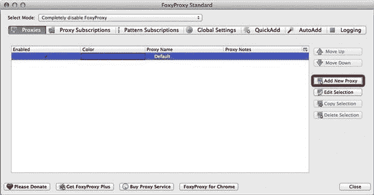

<figcaption class="figleg">Figure 8.1 Add New Proxy.</figcaption>

</figure>

<figure class="fig">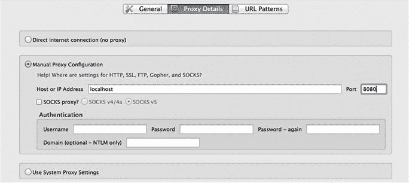

<figcaption class="figleg">Figure 8.2 FoxyProxy settings.</figcaption>

</figure>

现在，要启用代理，只需右键单击地址栏末端的小狐狸图标，然后选择“对所有 URL 使用 OWASP ZAP”这个选项将通过 ZAP 发送所有的 HTTP 和 HTTPS 流量。由于它还没有推出，没有一个网站将加载。

从本节开始提供的链接中获得 ZAP 后，有一个 Windows installer 和一个 Mac 版本。给出的例子是为了在 Mac 上运行它，但无论如何过程是相同的。通过安装和运行 ZAP，出现以下屏幕([图 8.3](#F0020) )。

<figure class="fig">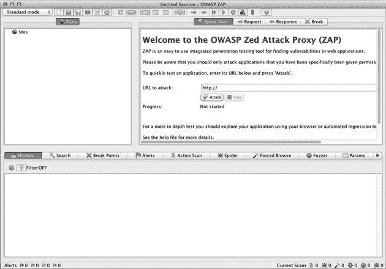

<figcaption class="figleg">Figure 8.3 ZAP initial screen.</figcaption>

</figure>

所以，让我们跳回到 Firefox 来浏览一个站点，看看会发生什么。这是通过使用该死的易受攻击的 Web 应用程序([http://www.dvwa.co.uk](http://www.dvwa.co.uk))来演示的，出于本书的目的，该应用程序也包含在 OWASP 破损 Web 应用程序操作系统中([图 8.4](#F0025) )。

<figure class="fig">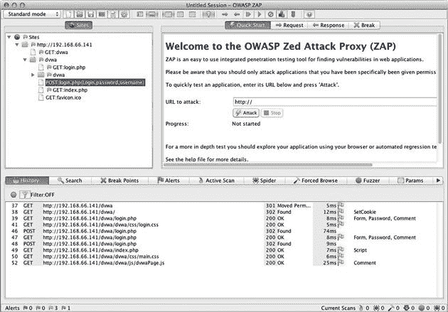

<figcaption class="figleg">Figure 8.4 ZAP requests.</figcaption>

</figure>

这表明访问过的站点出现在左侧的“站点”框中。各个 HTTP 请求在底部窗格中。在这一点上，唯一感兴趣的是蜘蛛，尽管我们鼓励读者探索 ZAP 的其他功能。

如果感兴趣的是拦截发往 HTTPS 站点的请求，则需要接受 ZAP 证书，以便可以解密和重新加密流量。

下面是蜘蛛程序的概述:

第一步:点击蜘蛛按钮。

步骤 2:下拉左侧的“站点”菜单，选择将要部署蜘蛛的站点。

第三步:点击播放按钮，等待播放结束([图 8.5](#F0030) )。

<figure class="fig">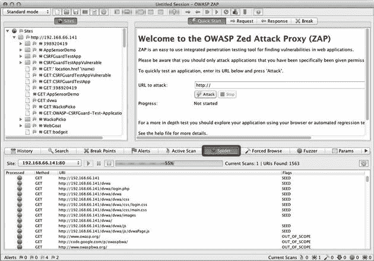

<figcaption class="figleg">Figure 8.5 ZAP spider.</figcaption>

</figure>

抓取网站可能会造成入侵，并可能导致某些系统出现问题。在进行任何主动测试之前，请注意风险并寻求许可。

#### 为什么这些信息对社会工程师有用？

被动和主动蜘蛛都被研究过，但是为什么这些信息对社会工程师有用呢？网站布局只是进一步探索的前兆；它有助于为侦察路径提供指导，并确保时间得到有效利用。它可以提供对任何社会工程师都有用的信息，如业务伙伴、门户、客户、供应商和联系页面。它还可以帮助识别大型网站中的文档和关键字。所有这些信息都可以作为进一步侦察的平台。最终，这一信息将导致一个或多个借口的构建，形成任何评估的基础。

蜘蛛搜索只是侦察生命周期早期使用的工具之一。在全面介绍了这个工具之后，有必要看看可供社会工程师使用的其他一些工具。

### 文档元数据

文档元数据基本上是存储在 office 文档中的属性信息。当一个 Microsoft Word 或 PDF 文档被创建时，它会被自动标记上一些元数据，而作者甚至都不知道。任何拥有该文档的人都可以检索到该信息。

通常，元数据是安装 office 产品时选择的用户和企业名称。通过在 office 应用程序中检查文档属性，至少可以查看一些文档元数据([图 8.6](#F0035) )。

<figure class="fig">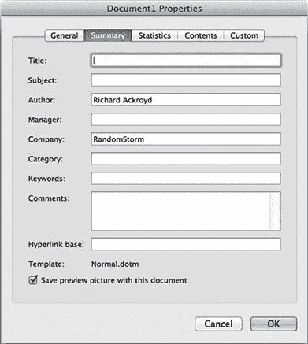

<figcaption class="figleg">Figure 8.6 Installation options being populated into the metadata of Microsoft Word documents.</figcaption>

</figure>

这清楚地表明，至少文档可以提供创建它的个人的姓名。然后可以将其添加到用户名列表中，或者在给组织打电话时作为潜在的姓名下拉列表。

还有许多其他的元数据标签可以由个人添加，也有相当多的是应用程序自己添加的。

在这些隐藏的元数据中找到操作系统版本、目录结构和用户是很常见的。此外，还可以找到用于创建该文件的软件的确切版本。以下是一些可以用来提取这种情报的工具:

#### 用线串

Strings 在文件及其元数据中搜索可打印的字符串，并在终端中显示它们。

例如，以下是对 PDF 文件运行字符串时的输出([图 8.7](#F0040) ):

<figure class="fig">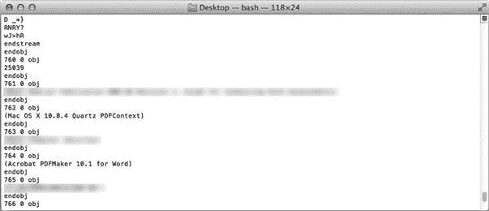

<figcaption class="figleg">Figure 8.7 Strings output from PDF file.</figcaption>

</figure>

```
mac1:rich$ strings mypdfdocument.pdf
```

在这种特殊情况下，可以检索到正在使用的操作系统 Mac OSX 10.0.4 以及正在使用的 Acrobat 版本。当然，在现实世界中收集这些信息需要很长时间，尤其是如果客户的网站上有很多可用的文档。幸运的是，有许多工具可以自动化这个过程。

#### foca-[http://www . informatica 64 . com/foca . aspx](http://www.informatica64.com/foca.aspx)

FOCA 是一个 Windows 应用程序，设计为渗透测试人员的信息收集工具。它通常被认为是这类工作的最佳工具之一。它涵盖了本书未涵盖的众多功能。对于经常使用该应用程序的人来说，Pro 版本应该被认为是一项值得的投资。

FOCA 最先打动用户的是它的易用性。它完全由 GUI 驱动，布局合理，对大多数人来说非常直观。

提取元数据的过程几乎是完全自动化的。FOCA 被给予一个域，它离开并挖掘出其中存在的任何文档。接下来，通知 FOCA 下载文档并提取元数据。它将对找到的每种类型进行分类，并在一个容易导航的树中显示它们。然后可以将元数据导出到文件中，以便 it 可以对其进行操作。没有比这更简单的了。

下面是使用 FOCA 免费软件的过程，可以从提供的链接下载。电子邮件地址是必需的，但对于一个出色的应用程序来说，这只是小小的代价。

第一次启动 FOCA 时，用户会看到一个类似于图 8.8 中的屏幕。

<figure class="fig">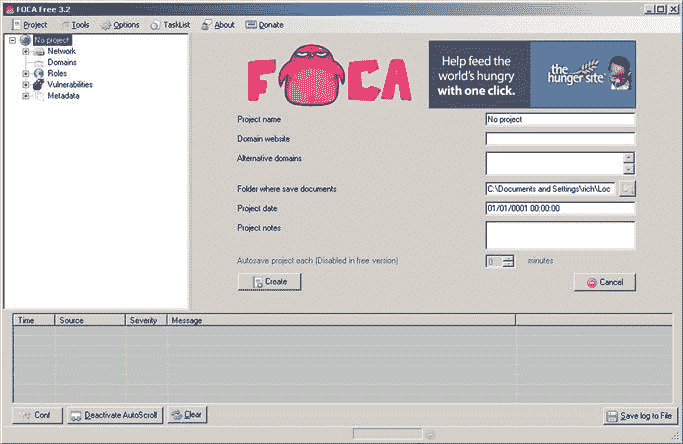

<figcaption class="figleg">Figure 8.8 FOCA.</figcaption>

</figure>

以下是“逐步”指南:

第一步:点击左上角的“项目”，然后点击“新建项目”

第二步:给项目起一个名字，然后在“域名网站”字段输入一个域名。这应该只是[mydomain.com](http://mydomain.com)，而不是网址。

第三步:告诉 FOCA 项目文档的存放位置，并添加以后可能有用的注释([图 8.9](#F0050) )。

第四步:点击“创建”,选择保存项目文件的位置。台式机现在已经足够了。
现在，将会看到类似于[图 8.10](#F0055) 中的屏幕。
选择 Google 和 Bing，让扩展保持原样。扩展名是 FOCA 在搜索过程中要寻找的文件类型。

第五步:点击“搜索全部”
文档应该开始填充屏幕。名称、大小和类型都将可见。

第六步:现在文档搜索已经完成，右击任意文档，选择“全部下载”这将把所有文件下载到您先前配置的位置([图 8.11](#F0060) )。

下载所有文档可能需要一些时间。去喝杯咖啡，五分钟后检查一下。

步骤 7:现在所有的文档都已下载，再次右键单击搜索结果中的任何文档，并选择“提取所有元数据”

<figure class="fig">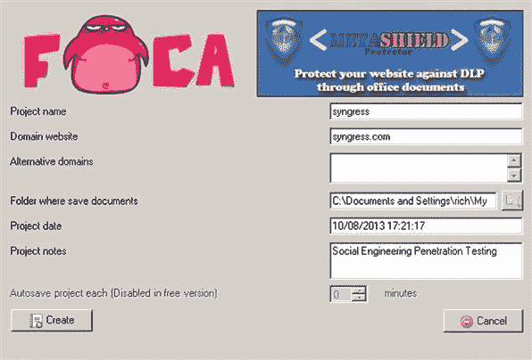

<figcaption class="figleg">Figure 8.9 FOCA—Setting up a project.</figcaption>

</figure>

<figure class="fig">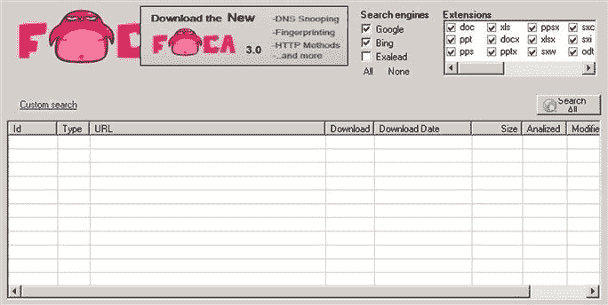

<figcaption class="figleg">Figure 8.10 FOCA file extensions.</figcaption>

</figure>

<figure class="fig">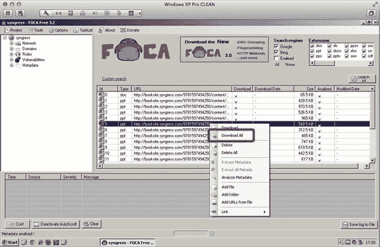

<figcaption class="figleg">Figure 8.11 FOCA download documents.</figcaption>

</figure>

这将产生一个组织良好的元数据视图([图 8.12](#F0065) )。

<figure class="fig">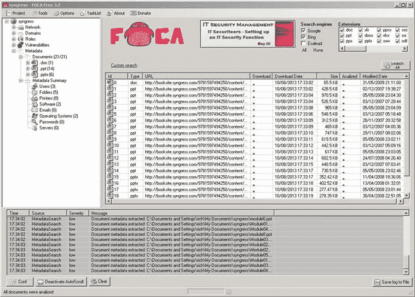

<figcaption class="figleg">Figure 8.12 FOCA metadata.</figcaption>

</figure>

FOCA 已经从所有可用的文档中提取了用户、文件夹结构、软件版本和操作系统，所需要的只是给它一个域。在真实世界评估期间，将会看到比此屏幕截图中显示的更多的细节，假设客户在发布文档之前没有清理所有文档。迄今为止,“密码”元数据类别很少出现，但它通常是人们首先要寻找的东西。

例如，右键单击左侧的任何元数据类别，并将结果导出到文件中，这对于构建用户列表特别有用。

此外，在文档窗格中右键单击并添加用于元数据提取的本地文件或目录也非常有用。

这证明了 FOCA 的一些用途；然而，除了 FOCA，还有其他开源的选择。现在就来看一个吧。

#### Metagoofil

Metagoofil 的工作方式与 FOCA 类似。它首先在谷歌搜索，然后从目标网站下载文档。然后，Metagoofil 可以开始从文档中剥离元数据，并将结果呈现在报告中。与 FOCA 一样，Metagoofil 能够检索用户名、软件版本、电子邮件地址和文档路径。

Metagoofil 可以从[http://code.google.com/p/metagoofil/](http://code.google.com/p/metagoofil/)获得，并且已经在 Linux 和 OSX 进行了测试。它也应该捆绑在 BackTrack 和 Kali Linux 中。

下面是命令行开关的一个示例:

```
******************************************************
```

```
* Metagoofil Ver 2.2            *
```

```
* Christian Martorella          *
```

```
* Edge-Security.com            *
```

```
* cmartorella_at_edge-security.com   *
```

```
******************************************************  
```

```
 Usage: metagoofil options
```

```
    -d: domain to search
```

```
    -t: filetype to download (pdf,doc,xls,ppt,odp,ods,docx,xlsx,pptx)
```

```
    -l: limit of results to search (default 200)
```

```
    -h: work with documents in directory (use "yes" for local analysis)
```

```
    -n: limit of files to download
```

```
    -o: working directory (location to save downloaded files)
```

```
    -f: output file
```

```
 Examples:
```

```
 metagoofil.py -d apple.com -t doc,pdf -l 200 -n 50 -o applefiles -f results.html
```

```
 metagoofil.py -h yes -o applefiles -f results.html (local dir analysis)
```

这真的很简单。给 Metagoofil 一个域名，告诉它要查看的文档类型，并限制搜索结果和文件下载数量。这些限制将由客户的规模和可用的时间来确定。如果只有很短的侦察窗口，最好尝试并避免下载数百个每种类型的文档。在任何情况下，一些客户可能只有少量文件。在这里，运行该工具以查看它带回了什么:

```
metagoofil -d offensivesite.com -t doc -l 200 -n 50 -o /root/Desktop/metadata/ -f results.html
```

-d 开关用于设置域，-t 用于定义。doc (Microsoft Word)，然后用-l 开关将搜索结果限制为 200 个。根据-n 选项的定义，每种类型下载的文件数是 50。接下来，选择将文件下载到桌面上的元数据文件夹。最后，使用-f 选项将结果发布到 HTML 文件中。下面是该工具的输出:

```
******************************************************
```

```
* Metagoofil Ver 2.2
```

```
* Christian Martorella
```

```
* Edge-Security.com
```

```
* cmartorella_at_edge-security.com
```

```
******************************************************
```

```
[-] Starting online search…
```

```
[-] Searching for doc files, with a limit of 200
```

```
  Searching 100 results…
```

```
 Searching 200 results…
```

```
Results: 8 files found
```

```
Starting to download 20 of them:
```

```
----------------------------------------
```

```
[1/20] /onoes=en
```

```
  [x] Error downloading /onoes=en
```

```
[2/20] http://www.offensivesite.com/docs/2323.doc
```

```
[3/20] http://www.offensivesite.com/docs/11.doc
```

```
[4/20] http://www.offensivesite.com/docs/22.doc
```

```
[5/20] http://www.offensivesite.com/docs/123.doc
```

```
[6/20] http://www.offensivesite.com/docs/122.doc
```

```
[7/20] http://www.offensivesite.com/docs/bob.doc
```

```
[8/20] http://www.offensivesite.com/docs/testing.doc
```

```
[9/20] http://www.offensivesite.com/docs/lotsometadata.doc
```

```
[10/20] http://www.offensivesite.com/docs/doc.doc
```

```
[11/20] http://www.offensivesite.com/docs/diary.doc
```

```
[12/20] http://www.offensivesite.com/docs/random.doc
```

```
[13/20] http://www.offensivesite.com/docs/things.doc
```

```
[14/20] http://www.offensivesite.com/docs/morethings.doc
```

```
[15/20] http://www.offensivesite.com/docs/manual.doc
```

```
[16/20] http://www.offensivesite.com/docs/passwords.doc
```

```
[17/20] http://www.offensivesite.com/docs/creditcardnumbers.doc
```

```
[18/20] http://www.offensivesite.com/docs/fortknoxdoorcodes.doc
```

```
[19/20] http://www.offensivesite.com/docs/safecombination.doc
```

```
[20/20] http://www.offensivesite.com/docs/deathstarplans.doc
```

```
[+] List of users found:
```

```
--------------------------
```

```
Edmond Dantès
```

```
Jim Seaman
```

```
Andrew Gilhooley
```

```
Charlotte Howarth
```

```
Bryn Bellis
```

```
Owen Bellis
```

```
Gavin Watson
```

```
Andrew Mason
```

```
James Pickard
```

```
John Martin
```

```
[+] List of software found:
```

```
-----------------------------
```

```
Microsoft Office Word
```

```
Microsoft Office Word
```

```
Microsoft Office Word OSX
```

```
Microsoft Word 10.0
```

```
Microsoft Word 9.0
```

```
[+] List of paths and servers found:
```

```
-------------------------------------
```

```
'C:\Documents and Settings\TheEmperor\My Documents\deathstarplans.doc'
```

```
'S:\My Documents\creditcardnumbers.doc'
```

```
'C:\Documents and Settings\chazzles\Application Data\Microsoft\Word\AutoRecovery save of passwords.doc'
```

```
'/Users/jseaman/Documents/safecombination.doc'
```

```
[+] List of e-mails found:
```

```
----------------------------
```

```
Edmond Dantès@offensivesite.com
```

```
Jim Seaman@offensivesite.com
```

```
Andrew Gilhooley@offensivesite.com
```

```
Charlotte Howarth@offensivesite.com
```

```
Bryn Bellis@offensivesite.com
```

```
Owen Bellis@offensivesite.com
```

```
Gavin Watson@offensivesite.com
```

```
Andrew Mason@offensivesite.com
```

```
James Pickard@offensivesite.com
```

```
John Martin@offensivesite.com
```

哇，我们真的中大奖了。一个简单的命令和几次下载之后，我们就知道了更多关于我们目标的数据。使用-o 命令开关([图 8.13](#F0070) )将结果放入一个格式良好的 HTML 文件中。

<figure class="fig">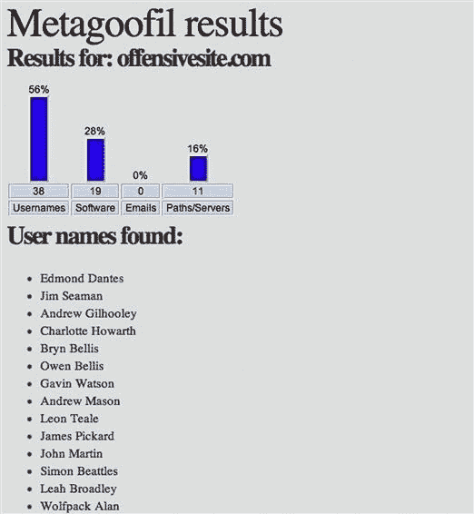

<figcaption class="figleg">Figure 8.13 Metagoofil results HTML.</figcaption>

</figure>

Metagoofil 也可以处理本地下载的文件。例如，如果有人将一个文件作为邮件附件发送，metagoofil 可以负责从中剥离元数据。只需使用-h 命令开关。

```
mac1:rich$ metagoofil -h yes -o /root/Desktop/metadata/ -f results2.html
```

这假设我们已经将本地文档放在了/root/Desktop/metadata 目录中。从这里开始的过程是相同的。Metagoofil 剥离文档元数据并将其打印到屏幕上，同时写入 results.html 文件。

#### 为什么文档元数据对社会工程师有用

我猜在这一点上，你可以看到为什么这是一个社会工程师有用的工具。几个命令和几个下载之后，我们已经收集了关于我们的目标组织的大量信息。我们知道目标使用的是什么软件，在很多情况下也知道是什么操作系统。

我们知道谁创建了他们的文档来发布。我们收集了大量的电子邮件地址，这些地址可能会被用于网络钓鱼攻击或以电子邮件为主要通信手段的借口。鉴于我们知道他们可能使用的软件和操作系统，我们也可以确保我们选择的攻击在给定的目标环境下更有可能奏效。

最重要的是，这些用户的内部用户名和命名约定已经被获取。这在执行混合评估或试图攻击登录门户或网络邮件时非常有用。这也意味着 LinkedIn 和其他社交媒体网站可以被利用，获得员工名单，然后用于建立更大的电子邮件地址列表，以应对任何网络钓鱼攻击。不要忘记，这些文件中的每一个都可能包含一个有效借口的基础，所以要虔诚地检查它们。

### 摄影元数据

一个不可回避的事实是，每个创建的数字文件都会包含自己的指纹。这可能是相对无害的信息，如创建它的系统类型，或者它可能更敏感，如照片拍摄的确切地理位置。

智能手机时代已经确保这些设备成为最受欢迎的拍照设备，请记住，这些设备也有内置的 GPS 功能。这意味着每张直接上传到脸书、LinkedIn 或 Twitter 的照片都包含位置数据。这些信息被称为 Exif(可交换图像文件格式)数据。

这里有一些 Exif 数据提取工具。

#### exiftool—[http://www.sno.phy.queensu.ca/~phil/exiftool/](http://www.sno.phy.queensu.ca/~phil/exiftool/)

Exiftool 是一款免费的 Exif 阅读器，适用于 Windows 和 OSX。这个例子使用的是 OSX 版本，但是 Windows 版本的工作方式基本相同。

Exiftool 可以用于编辑元数据以及检索元数据，这意味着它可以用于在发布任何公司照片之前对其进行净化。

运行应用程序很简单，只需告诉它从哪张照片提取数据。

```
mac1:rich$ exiftool myphoto.jpg
```

任何人在阅读这本书的时候都会看到满屏的输出。对于作为社会工程师的我们来说，很多都是多余的，但是有些东西很突出([图 8.14](#F0075) )。

<figure class="fig">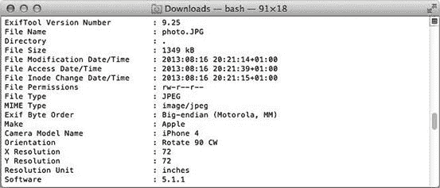

<figcaption class="figleg">Figure 8.14 Exiftool data.</figcaption>

</figure>

第一个屏幕截图向我们展示了一些关键信息(即图像创建的时间和使用的手机和软件的类型)。如果他们在项目期间寻找漏洞或潜在的资产回收，后者将被证明更加有用？本例中的旧版本 IOS 更容易受到数据检索的影响。图像拍摄的时间也是有用的，主要是为了了解图像是否仍然与我们相关。也许我们正试图为一家企业确定卫星办公室的位置，但我们知道它们只在特定日期后才开业。

接下来是真正有趣的东西；拍摄图像的纬度和经度([图 8.15](#F0080) )。在这种情况下，整个管柱为北纬 51° 30′39.60″，西经 0° 5′6.60″。

<figure class="fig">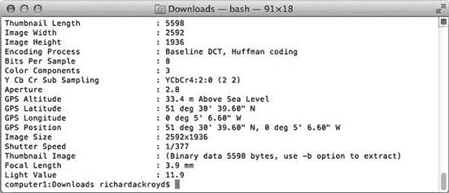

<figcaption class="figleg">Figure 8.15 Exiftool geo location data.</figcaption>

</figure>

不出所料，我选择的地图工具是谷歌地图。我们需要稍微处理一下这个字符串，这样 Google 就会接受它。你所需要做的就是从纬度和经度上去掉“deg”。那么，拍照的时候我在哪里？([图 8.16](#F0085) )。事实上，就在离伦敦小黄瓜不远的地方。

<figure class="fig">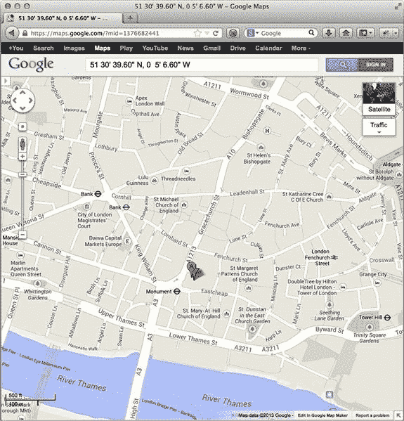

<figcaption class="figleg">Figure 8.16 Google Maps location.</figcaption>

</figure>

如何实现图像检索和元数据提取过程的自动化？当然，应该避免单独下载文件并一个接一个地删除它们。碰巧的是，已经有人在某个地方解决了这个问题。

以下是一些选择。

#### 图片拾取器——一个 Firefox 插件—[https://addons . Mozilla . org/en-us/Firefox/addon/image-Picker/](https://addons.mozilla.org/en-us/firefox/addon/image-picker/)

Image picker 是 Firefox 的一个插件，可以从你正在浏览的页面下载所有图片。Firefox 附加组件的安装非常简单。点击上面的链接，点击安装，然后重启 Firefox。

Firefox 重启时，会有一个看起来像图片的小按钮，上面有一个下载箭头。点击此按钮将提供下载选项卡内所有图像的选项。

这个插件仍然只对图片多的网站有用，因为它不会在网站上搜索图片。因此，如果目标是 Flickr 或 Picasa 帐户，这可能是一个非常有用的工具，更不用说非常直接的使用。

现在照片很多，可以用 Exiftool 处理整个目录。命令是一样的，只是给它目录名而不是图像名。

```
mac1:rich$ exiftool owlpictures
```

如有必要，您可以为您想要的值进行 grep。以下命令将打印每张照片的 GPS 位置。

```
mac1:rich$ exiftool owlpictures | grep'GPS Position'
```

有趣的是，Twitter 清理了上传到它的所有 Exif 数据，所以这不再是我们感兴趣的途径。一些引人注目的例子凸显了这些问题，但情况并非总是如此。Paterva([http://paterva.com/web6/](http://paterva.com/web6/))的创始人鲁洛夫·特明(Roelof Temmingh)曾经做过一次演讲和演示，强调了谁在美国国家安全局停车场的范围内发推特。使用 Maltego 收集地理位置数据，他们能够在很短的时间内突出国家安全局的潜在雇员，并链接相当惊人的个人数据。像这样的创新思维可以真正支持社会工程参与，更不用说强调当涉及到安全性时，我们可能在错误的地方寻找。

#### 使用 Wget 从网站下载图像

Wget 是一个命令行工具，可以通过 HTTP、HTTPS 和 FTP 连接到一个站点，主要用于自动检索文件。它是一个命令行工具，可用于 Linux、OSX 和 Windows。如果使用的是 OSX 或 Linux，很可能用户已经拥有它了。如果没有，看看这里下载并安装软件包—[http://www.gnu.org/software/wget/](http://www.gnu.org/software/wget/)。

可以指示 Wget 抓取页面上的链接，并下载它找到的特定深度的任何图像。它基本上会做图像拾取器所做的事情，但会有所增加。还记得《社交网络》中马克·扎克伯格需要从他们的脸书下载所有学生的个人资料照片的场景吗？他也用了 wget。

```
mac1:rich$ wget -r -l1 -A.jpg www.offensivesite.com
```

```
mac1:rich$ exiftool www.offensivesite.com | grep ‘GPS Position’
```

这个命令将递归地从站点下载文件，并跟随单个级别的链接，从每个链接下载图像。然后，它会将它们方便地放入一个名为[www.offensivesite.com](http://www.offensivesite.com)的目录中。Exiftool 再次指向目录，删除所有 GPS 数据。

#### 土工积雪机— [http://www.geosetter.de/en/](http://www.geosetter.de/en/)

GeoSetter 是一个 Windows 应用程序，它从图像中提取地理数据，然后根据这些数据构建地图。它使用起来非常简单，可以快速突出显示可能在您的评估中使用的潜在物理位置。它支持数据导出到谷歌地球和地理信息的编辑，如果你想净化一个图像。

GeoSetter 是一个 GUI 驱动的应用程序，带有一个简单的安装程序。只需告诉应用程序在哪里可以找到你想看的图片，它就会完成剩下的工作。这可以通过点击“图像”菜单项，然后打开正确的文件夹来实现。如果您有大量收藏，导入图像需要一段时间，所以请耐心等待，并检查图像下方左侧的进度指示器。

出于科学的兴趣，我上传了我 iPhone 的照片库的内容，并对它们进行了地理映射([图 8.17](#F0090) )。

<figure class="fig">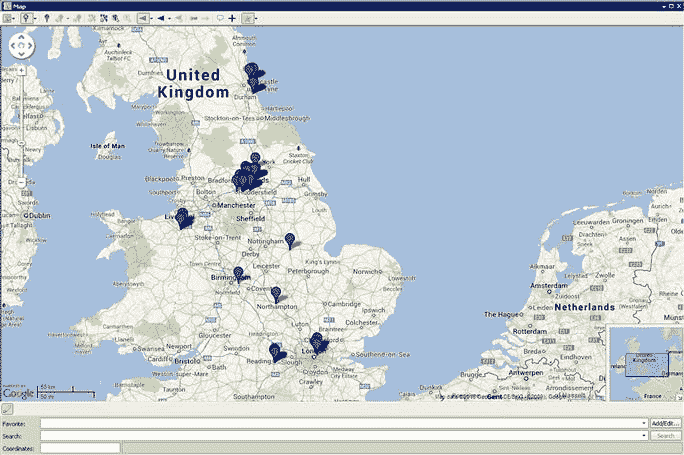

<figcaption class="figleg">Figure 8.17 GeoSetter in action.</figcaption>

</figure>

从我花费大部分时间的图像位置分组中，可以立即识别出它。iPhone 的主人就住在英国约克郡利兹郊外。利兹在一大堆地图大头针下模糊不清。

选择所有相关的图片并从图片菜单中选择“导出到 Google Earth”也是一种可视化数据的好方法。最终的结果很像上面的谷歌地图，但是每张图片都有叠加，而不是地图标记。这使得能够快速识别哪些图像是在哪里拍摄的([图 8.18](#F0095) )。

<figure class="fig">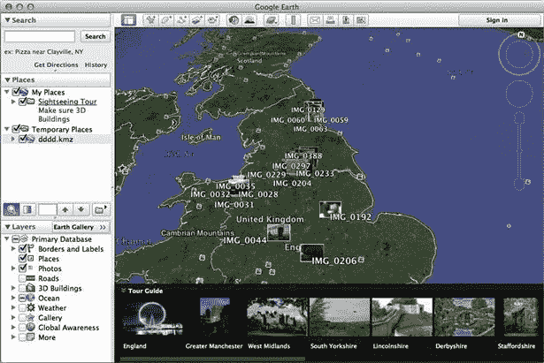

<figcaption class="figleg">Figure 8.18 Google Earth output.</figcaption>

</figure>

将所有数据拼凑在一起是一项相当简单的任务。一个公司网站或员工博客已经成为攻击目标，每张图片都是通过 wget 下载的。接下来，Exiftool 或 GeoSetter 被用来绘制图像拍摄的位置。下面是一些例子，这些例子可以为社会工程师提供有用的信息:

公司地点和办公室

数据中心位置

一个组织的员工去社交的潜在地点

与组织相关的客户和供应商

企业设备类型(iPhone、Android)

设备名称。(iPhone 设备名称通常也是用户的名称。)

一些组织严密保护他们的设施位置，因此能够向他们展示由于没有对员工进行 Exif 数据教育而造成的损害本身就是一项有价值的工作。

识别员工可能闲逛的潜在地点为社会工程师提供了各种各样的机会。这可能像刷 RFID 标签一样简单，也可能像在员工放松警惕时强迫他们提供信息一样复杂。

Twitter 曾是这类信息的金矿，但现在 Exif 数据在上传时被清除了，这种情况已经改变了。这是 Twitter 的一个伟大举措，希望更多的人会跟进。

### 反向图像搜索引擎

虽然对图像的主题，一个严肃的反向图像搜索引擎应该进行研究。这些服务提供上传图像文件的能力，并观察搜索引擎追踪到它的其他位置。其中一些还试图将图像中的属性与在线存储的其他照片进行匹配，例如颜色和形状。

有很多，尽管最受欢迎的可以说是谷歌的反向图片搜索—[http://www . Google . com/inside search/featurimg/search by image . html](http://www.google.com/insidesearch/featurimg/searchbyimage.html)和 Tineye—【http://www.tineye.com】。

这两种服务都提供了上传文件或提供文件 URL 的能力。请注意，如果上传了图像，确保图像权利没有被授予其他人是很重要的。

这种服务对社交工程师很有用，因为它有助于将单个图像映射回社交网络帐户、博客、twitter 帐户、公司网站和个人网站。举个例子，一个同事的 LinkedIn 照片被输入谷歌反向图片搜索。它立即在搜索结果中识别出他们的 Twitter 账户，因此，如果在一个公司网站上发现了一张员工的照片，但不知道是谁，这可以提供一个非常有用的功能。一个人在网上出现的次数越多，就越有可能制造一个可信的借口，获取更多的情报。

### 元数据不是这样的

文档中还有其他类型的数据不容忽视。它们不是元数据，也不一定在文档中直接可见，但它们可能是最具破坏性的。

首先，也是最明显的，是文档内容。找到与内部系统或员工相关的信息，甚至是上传到组织网站的文件中的整个联系人列表，这种情况并不罕见。这就是为什么在这些文档中搜寻有趣的信息是值得的。有几种方法可以做到这一点，有些是手动的，有些不太好。

使用 OSX 内置的“查找器”是可以选择的方法之一。只需浏览到包含文件的文件夹，单击右上角的放大镜，并选择关键字“密码”或“系统”等。另一个好主意是搜索电话号码的区号部分。Finder 将返回任何需要进一步调查的匹配项。

### pdf grep-[http://pdf grep . SourceForge . net](http://pdfgrep.sourceforge.net)

如果曾经有一个工具做到了它在数据包上所说的，那就是 pdfgrep。它可以指向一个单独的 PDF 或一个目录，它会搜索所有的选择模式。这适用于正则表达式和直接字符串匹配。

为了得到 Kali Linux 中编译的工具，需要安装 poppler，这是一个用于 PDF 渲染的工具集。

```
root@pentest:/pdfgrep-1.3.0# apt-get install libpoppler-cpp0.
```

然后，所有需要做的就是遵循 PDFGrep 目录下的安装文件中的说明。

简言之，shell 命令`。/configure；制造；“make install”应该配置、构建和安装此软件包。

```
Next, all that is needed is to issue each of those commands and watch out for any errors that crop up. So ./configure first. Wait for the process to finish without error. Then the same for “make” and “make install.”
```

这个过程完成后，应该会有一个名为“pdfgrep”的可执行文件。运行它再简单不过了，这里有一个在文档中搜索单词“password”的例子。

```
root@pentest:/pdfgrep-1.3.0# pdfgrep -R password /root/Desktop/docs/
```

```
/root/Desktop/docs//email.pdf:Your password at first logon will be “Password1”
```

鉴于模式可以是正则表达式，唯一的限制是您的想象力。可以搜索包含特定值、以特定值开头或结尾的字符串。

即使不知道正则表达式，也有许多很好的例子，只需谷歌搜索就可以找到。以下是一些在这些文档中需要注意的例子，有些比其他的更常见。

国民保险(英国)或社会保障(美国)号码。

电话号码

电子邮件地址

邮政编码(这样你就能找到地址)

姓名(搜索头衔、先生、夫人、博士等。).

Pdfgrep 是在任何侦察工作中快速找到关键数据的好方法。如果使用了 Metagoofil 或 FOCA，每个人都已经从公司网站下载了所有的 PDF 文档。现在，可以对文件夹重新运行 pdfgrep 来查找关键字。但是，这并不能代替手动审阅每个文档，但是它可以帮助缩短这部分评估的时间。

### 文档混淆

虽然这肯定是较为模糊的文档清理问题之一，但它已经出现过几次。

第一次看到它是在一次渗透测试中，但很快就意识到它可以很好地应用于社会工程。有关组织似乎没有任何真正的文件提交到网站之前的净化程序。当这位工程师在浏览 FOCA 下载的文件列表时，他们注意到其中一些文件被黑色的正方形和长方形弄得模糊不清。打开 Adobe Creative suite 中的文档，显示形状可以被移走，暴露了下面的敏感数据。这个问题绝对可以算作是罕见的问题之一，但是手动检查这些文档总是值得的。

### 原路返回机—[http://archive.org/web/web.php](http://archive.org/web/web.php)

原路机器是网站旧版本的存档。在某些情况下，它可以追溯到几年前，并有许多网站的定期快照。检查目标域中的敏感信息(如联系方式和物理位置)通常很有用。虽然信息安全在今天是一件大事，但你不必追溯太久就能意识到它并不总是这样。

显而易见，对于社会工程师来说，企业网站是一个很好的信息来源。一些可用的东西更明显，比如联系方式、员工层级和业务目的。这些以及与客户、供应商和合作伙伴相关的信息可以用来构成有效的借口。当加上使用本节中讨论的工具可以获得的所有奇妙的情报时，这种参与开始看起来非常健康。让我们直接进入电子邮件地址，如何找到它们，以及它们在这种类型的约定中的重要性。

## 电子邮件地址

在评估过程中获取目标的电子邮件地址的重要性怎么强调都不为过，然而它们却被不假思索地给了出去。它们被用来注册论坛、网上购物账户、社交网络，甚至个人博客。电子邮件地址是一条应该更认真对待的信息吗？是否应该像守护皇冠珠宝一样对待？

总的经验是，许多企业并不监管他们的用户使用公司电子邮件地址做什么。有时，只将邮箱分配给真正需要它的人可能更好。

那么，为什么社会工程师对看起来如此不重要的信息如此感兴趣呢？

### 网络钓鱼攻击

在现代威胁环境中，网络钓鱼攻击已经变得非常普遍。这样做的原因可能是双重的。首先，它们非常容易执行，至少对于一个基本标准来说是如此。其次，每天都有数以百万计的人上当。似乎对任何骗子来说都是一个成功的组合。

将网络钓鱼练习作为社会工程参与的一部分总是值得的，尤其是在尝试有针对性的情况下。也就是说，大范围的网络钓鱼攻击也有它们的位置，只是归结为时间尺度。网络钓鱼攻击以及如何实施这些攻击将在第 9 章中详细介绍。

### 密码攻击

如前所述，许多项目包括渗透测试和社会工程的元素。例如，收集电子邮件地址会允许使用 Outlook Web Access (OWA)的攻击。电子邮件地址也可以分解成不同的排列，以猜测用户的内部命名约定。这些信息可以用来攻击 VPN 门户。

### 内情

收集电子邮件地址，然后找出它在互联网上的使用位置，可以获得更多有用的信息。这可能会导致一个借口。伪装成无法登录邮箱的用户打电话给一个组织可能看起来很老套，但它有很长的成功历史。仅仅知道一个组织的 OWA 或 VPN 设备的 URL 以及用户名就可以为成功的攻击创造足够的可能性。如何找到一个组织的资产将会在本章后面的 DNS 枚举技术中有更详细的介绍。

### 电子邮件地址约定

虽然在研究密码攻击时简单地提到过，但一个公司的电子邮件地址可能是真正的敲门砖。

大多数组织试图发布通用邮箱，如[info@targetbusiness.com](mailto:info@targetbusiness.com)。这使得社会工程师很难运行任何类型的网络钓鱼骗局。如果可以访问单个用户的地址，所有这些都会改变。现在可以使用 LinkedIn(【www.linkedin.com】)获得目标企业所有员工的名单。此情报可用于创建一个更大的潜在目标电子邮件地址列表，并合理确定它们将存在。

既然已经讨论了希望获取公司电子邮件地址的几个好理由，下面就来概述一下如何实现这一点。

#### 《金融时报》——[https://code.google.com/p/theharvester/](https://code.google.com/p/theharvester/)

harvester 实际上执行的不仅仅是电子邮件地址检索，它还可以找到子域名、员工姓名、主机和开放端口等等。该工具的目的是为渗透测试期间的情报收集提供一个平台。它返回的信息对社会工程师仍然有用，严格地说，可能比渗透测试人员更有用。

该工具默认包含在回溯和 Kali Linux 中。

harvester 是一个命令行工具，但使用起来非常简单，如文档中的示例所示:

```
Examples:./theharvester.py -d microsoft.com -l 500 -b google
```

```
     ./theharvester.py -d microsoft.com -b pgp
```

```
      ./theharvester.py -d microsoft -l 200 -b linkedin
```

-d 命令开关指定您的目标域或组织。

-b 命令开关是您想要使用的搜索机制，可以是“Google”、“Bing”或“all”。

-l 命令开关限制您将检索的结果数量。

让我们对一个实际的域运行 harvester，看看它会返回什么。

```
root@pentest:~# theharvester -d syngress.com -b all
```

```
Full harvest.
```

```
[+] Emails found:
```

```
------------------
```

```
solutions@syngress.com
```

```
matt@syngress.com
```

```
sales@syngress.com
```

```
user@syngress.com
```

```
catherine@syngress.com
```

```
www.solutions@syngress.com
```

```
amy@syngress.com
```

```
andrew@syngress.com
```

```
solutions@syngress.com
```

```
customercare@syngress.com
```

```
amy@syngress.com
```

```
support@syngress.com
```

为了简洁起见，已经减少了输出，但是 harvester 非常快速有效地识别了 12 个电子邮件地址，它们可以通过 harvesting 搜索引擎在一个项目中使用。需要注意的是，不需要提供域名，只需将公司名称传递给服务器就足够了。这可能会导致一些结果不准确，所以在攻击中使用它们之前一定要小心。它还会导致其他顶级域名(TLD)的结果，例如。com、co.uk 和。org，否则可能会被遗漏。总的发现是，指定完整的域会返回最有用的结果，因此建议手动循环每个 TLD。

与前面提到的 Metagoofil 一样，为了便于查看，可以将结果输出到 HTML 文件中([图 8.19](#F0100) )。

<figure class="fig">

<figcaption class="figleg">Figure 8.19 theharvester results.</figcaption>

</figure>

```
root@pentest:~# theharvester -d syngress.com -b all -f results.html
```

已经为目标域名的电子邮件地址建立了命名约定，LinkedIn 可以收获更多。同样，harvester 提供了功能。

```
root@pentest:/# theharvester -d syngress -b linkedin
```

```
[-] Searching in Linkedin.
```

```
  Searching 100 results.
```

```
Users from Linkedin:
```

```
=================
```

```
Amy Pedersen
```

```
Larry Pesce
```

```
Shawn Tooley
```

```
Vitaly Osipov
```

```
Elsevier
```

```
Becky Pinkard
```

```
Vitaly Osipov
```

```
Eli Faskha
```

```
Gilbert Verdian
```

```
Alberto Revelli
```

```
Raj Samani
```

```
Cherie Amon
```

```
Amy Pedersen
```

```
David Harley CITP FBCS CISSP
```

```
Chris Gatford
```

```
Arno Theron
```

```
Lawrence Pingree
```

```
Christopher Lathem
```

```
Craig Edwards
```

```
Justin Clarke
```

```
Byungho Min
```

显然，需要稍微操作这个列表来获得正确的输出，但是攻击面的大小每分钟都在增加。

尽管我鼓励你自己去尝试，但《哈佛校长》发现了比我们在这一点上涵盖的更多的东西。所有的功能都非常简单易懂。

#### 福查

在专门研究文档元数据时，已经涉及到了 FOCA，所以本文将保持简短。在该主题中，可以看到可以从文档中检索电子邮件地址。这些也可以导出到一个文本文件中，这样所有工具的输出就可以组合在一起。使用几个工具来获取任何情报以确保完全覆盖是一个好策略。优秀的社会工程师总是在寻找获取开源智能的新方法，因此每个工具的输出都经过处理并构建到智能主列表中是非常重要的。

#### Metagoofil

和 FOCA 一样，使用 Metagoofil 的基础知识已经介绍过了。Metagoofil 将把电子邮件地址从文档元数据中剥离出来，并以可用的格式打印到屏幕上。一如既往，强烈建议从尽可能多的不同来源获取情报，并将它们存储在一个主信息列表中。作为快速复习，该命令应该如下所示:

```
metagoofil -d syngress.com -t doc,pdf -l 200 -n 50 -o /root/Desktop/metadata/ -f results.html
```

别忘了不仅仅是。多克和。可以选择 pdf。检查其他文档类型总是值得的，因为永远不知道会发现哪些有趣的信息。

#### 谁

Whois 记录通常附有管理、技术和注册人联系信息。这些记录中的每一条都可以包含电子邮件地址，这些地址可以添加到我们的列表中。Whois 命令可以从 linux 命令行轻松运行:

```
root@pentest:/# whois microsoft.com
```

```
Registrant:
```

```
    Domain Administrator
```

```
    Microsoft Corporation
```

```
    One Microsoft Way
```

```
    Redmond WA 98052
```

```
    US
```

```
    domains@microsoft.com +1.4258828080 Fax: +1.4259367329
```

为了简洁起见，输出被缩短了，但是它提供了最终产品的概念。删除或清理这些记录以避免信息泄露是很常见的，但在每次接洽期间仍应进行检查。

#### 山姆·斯佩德

Sam Spade 是一个免费的 Windows 工具，可用于多种侦察练习。虽然它可能不是最新和最棒的，但事实上从我记事起它就存在了，它仍然有一些不错的功能，可以添加到任何侦察工作中。

不幸的是，在撰写本文时，http://www.samspade.org 的官方网站[已经关闭，没有恢复的迹象。幸运的是，网络上仍有许多地方在托管安装程序，因此请同时尝试以下链接:](http://www.samspade.org)

[http://www.majorgeeks.com/files/details/sam_spade.html](http://www.majorgeeks.com/files/details/sam_spade.html)。

山姆·斯派德更像是一个工具箱，而不仅仅是一匹只会一招的小马。它涵盖了从 DNS 枚举到网站抓取的所有内容，对于本练习来说，感兴趣的是后者。

爬行网站时有几个选项可用，其中之一是搜索电子邮件地址并在输出中显示它们。将网站镜像到本地目录以进行进一步调查，甚至克隆网站以进行网络钓鱼攻击是一个可行的选择([图 8.20](#F0105) )。

<figure class="fig">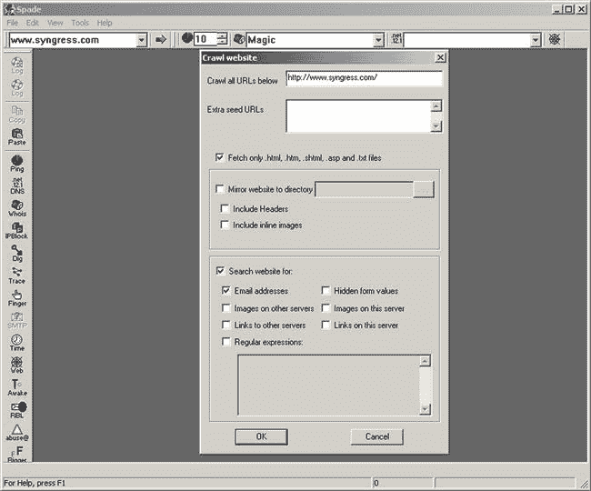

<figcaption class="figleg">Figure 8.20 Sam Spade.</figcaption>

</figure>

因为 Sam Spade 已经存在了很长时间，大多数人不再认为它有太多的相关性，但它是另一个有用的工具。当然，还有其他方法可以获得相同的功能，但是有选择总是有用的。

#### 竖锯

Jigsaw 最近被 salesforce 收购，是一个联系人管理网站，最初是众包的。虽然对该网站的完全访问不是免费的，但可获得的信息量是巨大的。

搜索 Syngress 可以找到 341 条联系记录，包括姓名和职位。通过深入每个记录，可以检索到个人的电子邮件地址和电话号码。深入每一个联系人需要花费点数，这是可以付费的，但实际上真正需要的只是一个电子邮件地址，然后根据其惯例建立一个列表。鉴于一些积分是免费提供的，所以可以通过玩游戏来获得所需的电子邮件地址。这是因为查看每个员工的姓名不仅是免费的，而且会以列表形式呈现，便于操作([图 8.21](#F0110) )。

<figure class="fig">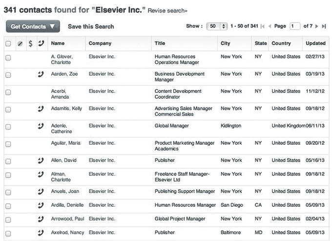

<figcaption class="figleg">Figure 8.21 Jigsaw results.</figcaption>

</figure>

上面的格式可以直接复制并粘贴到 Excel 或其他地方的操作工具中——cat、sed、awk 等。因此，如果我们选取列表中的第一个联系人并向下钻取，就可以获得一个电子邮件地址格式([图 8.22](#F0115) )。

<figure class="fig">

<figcaption class="figleg">Figure 8.22 Jigsaw results.</figcaption>

</figure>

现在我们知道约定是 firstname.lastname，我们可以为进一步的攻击建立一个电子邮件地址列表。我将上面的内容复制到 Excel 中，然后将姓名列输出到一个名为“emailsort.txt”的文本文件中，以便进一步编辑。接下来，“awk”被用来在命令行中做一些删节。

```
ssclownboat$ awk -F,'{print $2"."$1}' emailsort.txt | sed's/$/@elsevier.com/'
```

```
Zoe.Aarden@elsevier.com
```

```
 Amanda.Acerbi@elsevier.com
```

```
 Yasushi.Adachi@elsevier.com
```

```
 Kelly.Adamitis@elsevier.com
```

```
 Bob.Adams@elsevier.com
```

```
 Aurora.Adams@elsevier.com
```

```
 Catherine.Adenle@elsevier.com
```

```
 Maria.Aguilar@elsevier.com
```

```
 Arie.Akker@elsevier.com
```

```
 Mark.Albertsen@elsevier.com
```

```
 David.Allen@elsevier.com
```

```
 Charlotte.Alman@elsevier.com
```

```
 Ketan.Ambani@elsevier.com
```

```
 Mayur.Amin@elsevier.com
```

```
 Mindy.Anderson@elsevier.com
```

```
 Trygve.Anderson R. Ph@elsevier.com
```

```
 Raisa.Andryczyk@elsevier.com
```

```
 Joan.Anuels@elsevier.com
```

```
 Denielle.Ardilla@elsevier.com
```

```
…Output truncated for brevity…
```

我在这里做的是读取包含 lastname.firstname 格式用户的文件，并使用 awk 交换这些值，以便名字排在前面。然后我用“sed”在每一行的末尾加上“@elsevier.com”。如果您对列表中不包含重复项不满意，您可以进一步使用“sort -u”对唯一项进行排序。您可以通过使用 Excel 导入 lastname.firstname 文本文件(使用逗号作为分隔符),交换字段并使用 concatenate 添加到@elsevier.com 中，从而非常容易地获得相同的结果。

#### https://bitbucket.org/LaNMaSteR53/recon-ng 也包括一些拼图模块

“recon/contacts/gather/http/web/jigsaw”模块只需要给它一个公司名称就可以发挥它的魔力。它将提取每个联系人记录，并将其添加到数据库中供您使用。

```
recon-ng > use recon/contacts/gather/http/web/jigsaw
```

```
recon-ng [jigsaw] > #
```

```
recon-ng [jigsaw] > set company syngress
```

```
COMPANY => syngress
```

```
recon-ng [jigsaw] > run
```

```
[*] Gathering Company IDs…
```

```
[*] Query: http://www.jigsaw.com/FreeTextSearchCompany.xhtml?opCode=search&freeText=syngress
```

```
[*] Unique Company Match Found: 4604397
```

```
[*] Gathering Contact IDs for Company ‘4604397’…
```

```
[*] Query: http://www.jigsaw.com/SearchContact.xhtml?rpage=1&opCode=showCompDir&companyId=4604397
```

```
[*] Fetching BotMitigationCookie…
```

```
[*] Query: http://www.jigsaw.com/SearchContact.xhtml?rpage=1&opCode=showCompDir&companyId=4604397
```

```
[*] Gathering Contacts…
```

```
[*] [44073477] Cathy Boyer - Sales and Marketing (Saint Louis, MO - United States)
```

```
[*] [44089692] Steve Mackie - Sales and Marketing (Everett, WA - United States)
```

```
[*] [44164766] Ben Cox - Manager Global Infrastructure Development (Kidlington - United Kingdom)
```

```
[*] [44289059] Ian Hagues - Delta BI Analyst (Kidlington - United Kingdom)
```

```
[*] [45455694] Daniela D Georgescu - Executive Publisher (New York, NY - United States)
```

可以从数据库中复制联系人，并且可以根据前面的例子开始构建潜在的电子邮件地址列表。

正如在本节中所看到的，有多种技术可以用来利用对电子邮件地址的收集或猜测。接下来是社交媒体的使用，以及如何在社交工程项目中加以利用。

## 社会化媒体

社交网站一直是社会工程师的信息金矿。人们把他们的整个生活上传到像脸书这样的网站上，丝毫不考虑他们的隐私。

根据脸书创始人马克·扎克伯格的说法，隐私时代已经结束。但他当然会这么说。对他来说，关于你的信息越多越好。为什么呢？因为这能让脸书更有效地将你商品化。他们可以以更有针对性的方式投放广告，并确保尽可能高的点击率。这当然是假设定向广告是脸书意图的极限。

社交网络越是成为日常生活的一部分，就越是受到新闻媒体的审视。隐私一直是一个持续关注的问题，社交网络的运作方式发生了重大变化。看到这些主流新闻文章的影响是很有趣的。使用脸书等网站的绝大多数人现在比以往任何时候都更加意识到隐私问题。这证明，如果认知练习以正确的方式进行，并与接受者相关，它们确实会非常有效。

鉴于社交网站已经收紧了他们的游戏，社会工程师还能利用他们吗？为了回答这个问题，我们将看看一些更受欢迎的社交媒体网站，并找出任何有用的情报。

### 商务化人际关系网

LinkedIn 基本上是企业界的脸书。这是一个在线网络应用程序，允许人们与各行各业的其他人联系。大多数阅读这篇文章的人在网站上已经有了一个账户和一些个人资料。

所需的大量有用信息与个人资料有关。LinkedIn 个人资料本质上是一份在线简历。人们会添加他们的工作经历、技能和专长、照片和推荐信。也有可能认可人们的特定技能。

基本上，LinkedIn 是任何试图追踪某人或某人技能的人的信息金矿。正因如此，LinkedIn 在销售和招聘环境中格外受欢迎。正是这种程度的员工信息使得 LinkedIn 对社会工程师来说是无价的。

经常发现的是，一个组织会在 LinkedIn 上管理自己的群。这项功能的伟大之处在于，它为我们提供了一份现成的员工名单，以及他们的全部历史。如果一名社会工程师试图扮演一名员工，这种程度的智能将被证明是有用的。如前所述，假设已经为地址发现了约定，那么它还可以用于构建电子邮件地址列表。换句话说，它扩大了范围或攻击面。

在这一点上值得注意的是，LinkedIn 不是免费的。也不是匿名的。当查看人们的个人资料时，他们可能知道已经这样做了。由于这个原因，注册专业版是有益的，避免使用个人资料和更改设置控制面板中的“当您查看他们的资料时，其他人看到什么”选项，单击单选按钮“*您将完全匿名。*

LinkedIn 免费版有一个限制，在任何情况下都可以绕过。例如，搜索一个组织名称，它会显示一个员工列表。它不会显示每个人的全名。通常，结果的第一页会有一个全名，其余的是名和姓的首字母。

搜索了 Syngress，作为一个企业，然后我们选择了他们的母公司 Elsevier。在搜索结果的第一页，名字“史蒂夫。e”被发现。通过点击个人资料，它声明“*升级为全名。*“首选是免费获得。只需选择图片右边的所有内容、职位名称和下面的内容，复制粘贴到 Google 中([图 8.23](#F0120) )。

<figure class="fig">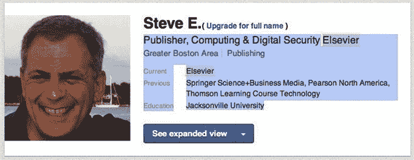

<figcaption class="figleg">Figure 8.23 LinkedIn reconnaissance.</figcaption>

</figure>

也许人们普遍认为这不会奏效，但第二次打击正是我们所需要的。点击它会显示员工的全名，允许将他们添加到目标列表中，或在通话中用作姓名下拉列表([图 8.24](#F0125) )。

<figure class="fig">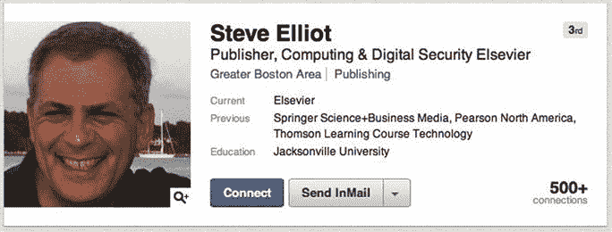

<figcaption class="figleg">Figure 8.24 LinkedIn details revealed.</figcaption>

</figure>

实际上，是我们的一个销售人员向我展示了这个技巧，我不仅被它的简单性震惊了，还被我们销售团队的狡诈震惊了。

我们已经介绍了一个可以从 LinkedIn 收集信息的工具，这个工具非常有用。

```
theharvester -d elsevier -l 500 -b linkedin
```

提供的输出需要人工批准，然后才能在合约中使用。求职者会挑选一个组织过去的员工和现在的员工。

### recon-ng-https://bit bucket . org/lanmaster 53/recon-ng

Recon-ng 是一个面向社会工程师和渗透测试人员的侦察框架。它随 Kali Linux 一起提供，所以您只需在命令行输入“recon-ng”就可以启动它。我推荐使用“git clone—[https://bitbucket.org/LaNMaSteR53/recon-ng.git](https://bitbucket.org/LaNMaSteR53/recon-ng.git)”获得最新版本然后就可以跑了。/recon-ng.py 启动并运行。如果你熟悉 Metasploit，那么这个会感觉很熟悉。导航非常相似，每个模块的设置也是如此。

linkedin_auth 模块依赖 linkedin 上的用户帐户和 API 键来获取联系信息。配置完成后，您只需设置目标公司名称并运行模块([图 8.25](#F0130) )。

<figure class="fig">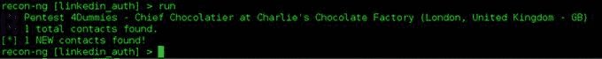

<figcaption class="figleg">Figure 8.25 Recon-ng output.</figcaption>

</figure>

设置这个非常简单。注册一个开发者 API 密钥，然后使用“keys add”命令将该密钥分配给 recon。侦察将在剩下的设置中提供指导。

谈到 LinkedIn 的使用，有更多的长期策略。例如，建立假档案，与目标员工建立关系网。虽然这个角度可以产生结果，但它超出了本节的范围。

### 脸谱网

毫无疑问，脸书是现存最受欢迎的社交网站，然而这主要是从个人使用的角度来看。虽然脸书也有企业存在，但它们的范围肯定比 LinkedIn 更有限。

有几个潜在的信息收集领域可以利用。首先，之前记录的从公司简介中获取任何图像的技术。在这种情况下，它不是一个寻找 GPS 位置数据的案例，因为脸书在上传时将其剥离，而是寻找位置、办公室内部或员工的照片。

另一种方法是查看任何帖子上的评论，看看这些评论是否与目标员工的帐户相关联。

社会工程师可用的更强大的工具之一是图搜索。这种脸书功能允许用户创建与脸书用户接触过的任何东西相关的搜索词。可能性几乎是无限的，但显然需要目标具有允许某种级别访问的配置文件。让我们快速浏览一些有用的术语，看看会有什么后果。

“*喜欢微软的人*”——这是一个有趣的搜索词，可以用来识别潜在的合作伙伴、员工或投资者。至少这可以被归类为有用的信息，但是通过一些人工调查可能会更多。与你的雇主一起尝试，看看结果是否是雇员，可以说他们中的很大一部分是。现在开始挖掘个人资料，寻找有用的信息。建议从“地点”功能开始。当用户在帖子上签到或添加位置时，这是它显示的地方。它实际上是一张员工行踪的地图，可能包含公司的位置。

在微软工作的人——现在事情真的开始变得有趣了。可以看到声称为微软工作的人的完整列表，包括职位。这些档案中的每一个都可能包含敏感信息，这些信息可能会在任何社会工程项目中使用。

这也可以修改为查看 2012 年在微软工作过的“*人的潜在前雇员。*

微软在华盛顿州雷德蒙拍摄的照片——如果有一个粗略的物理位置，这个搜索可以找到很棒的结果。你可以从对目标一无所知到对场地有一个粗略的布局以及对物理安全有一个概念。

"*微软员工在华盛顿州雷德蒙拍摄的照片*"—在寻找可能包含 ID 徽章的员工照片时，这将是一个有用的搜索词。同样，结果也可能包含有关物理安全的有用信息。

“*华盛顿哥伦比亚特区微软员工去过的地方*”—在寻找员工常去的地方时，这是一个有趣的搜索词。搜索结果可以进一步缩小到去过该地点的确切员工。在结果中，点击“*微软员工曾在这里*”按钮获得人员列表。这将自动填充搜索词，例如，“*访问 9:30 俱乐部的微软员工。*

当然，可以通过使用帐户中的隐私设置来限制访问。很多人可能不知道这甚至是可能的，更不用说花时间锁定它了。这类似于为人们和他们的生活提供一个谷歌搜索引擎。

Recon-ng 有一个通过 API 从图形搜索中获取敏感数据的模块，但该功能似乎已被删除。我预测大量的侦察工具即将出现。

让我们简单看一下 Twitter 来总结一下社交网站。

### 推特

Twitter 是现存的另一个更受欢迎的社交媒体网站。与脸书或 LinkedIn 不同，Twitter 中个人资料的概念非常有限。你可以补充一些关于你自己的细节，但远不及 LinkedIn 或脸书的水平。这在一定程度上缩小了我们的攻击面，但 Twitter 有时仍然是一个有用的情报来源。

Twitter 是另一个经常出现在公众视线中的社交媒体提供商，因此他们逐渐加强了安全措施。举个例子，Exif 数据现在在上传时会被删除，所以我们不能再从用户的照片中获取位置数据。

即使事情在一定程度上已经被锁定，但仍然有一些有趣的角度可以追寻。

### 侦察-ng

Recon-ng 用一个有用的侦察模块再次升级。Twitter 联系人收集模块搜索提到过您提供的句柄的用户。这有助于找出潜在的同事，供以后使用。

需要在[https://dev.twitter.com](https://dev.twitter.com)注册一个 Twitter API，然而拥有一个 Twitter 账户允许我们使用它登录，但是仍然需要填写一张表格，说明申请的意图和一两个其他细节。

启动 recon-ng 非常简单，只需将它键入命令 shell，然后等待控制台弹出。然后用“使用”命令选择模块。

```
recon-ng > use recon/contacts/gather/http/api/twitter
```

```
recon-ng [twitter] > show options
```

```
 Name Current Value Req Description
```

```
 ---- ------------- --- -----------
```

```
 DTG  no date-time group in the form YYYY-MM-DD
```

```
 HANDLE  yes target twitter handle
```

此时，您可以使用“keys add”命令开始配置您的 api 键。您将配置 twitter_api 和 twitter_secret 密钥。这些实际上在 Twitter 控制面板中被称为“消费者密钥”和“消费者秘密”。

```
recon-ng [twitter] > keys add twitter_api myconsumerkeygoeshere
```

```
[*] Key'twitter_api’ added.
```

```
recon-ng [twitter] > keys add twitter_secret myconsumersecretgoeshere
```

```
[*] Key'twitter_secret’ added.
```

接下来，只需设置选择的句柄并运行该模块

```
recon-ng [twitter] > set HANDLE @David_Cameron
```

```
HANDLE => @David_Cameron
```

```
recon-ng [twitter] > run
```

```
[*] Searching for users mentioned by the given handle.
```

```
[*] Searching for users who mentioned the given handle.
```

```
 +---------------------------------------+
```

```
 |  Handle  |  Name  |  Time  |
```

```
 +---------------------------------------+
```

```
 | StopLeseMajeste | Emilio Esteban | Mon Aug 26 16:23:20 +0000 2013 |
```

```
 | AuthorSaraKhan | Sara Khan   | Mon Aug 26 16:23:00 +0000 2013 |
```

```
 | HIGHtenedStoner | UK4legalWeeD  | Mon Aug 26 16:08:12 +0000 2013 |
```

该工具应该能够缩小潜在同事的范围，而不必手动挖掘目标的 Twitter 历史。一旦与 LinkedIn 和脸书的数据相关联，情报的准确性应该会呈指数级增长。

## DNS 记录

当涉及到社会工程和渗透测试时，枚举 DNS 记录可以导致一些有趣的发现。例如，知道一个组织的网络邮件服务的位置以及用户名和电子邮件地址，如果您打电话给帮助台，可以立即获得信任。大多数一级帮助台操作员不知道子域暴力，并会假设如果你知道网址，你是一名雇员。我遇到过这样的情况，我通过电话成功地重置了员工的域名密码，只有这些信息。

从渗透测试的角度来看，此信息可用于识别密码攻击期间可能利用的关键资产。正如我已经提到的，许多约定包括社会工程和渗透测试的元素。

那么，既然我们已经介绍了如何获取员工的电子邮件地址，那么我们如何在项目中使用 DNS 呢？

### dnsrecon-[https://github . com/darkoperator/dnsrecon](https://github.com/darkoperator/dnsrecon)—Twitter-@ Carlos _ Perez

谈到 DNS 侦察，Dnsrecon 是我的首选工具。它易于使用，快速，灵活。它带有 Kali 和回溯功能，所以启动系统并在运动过程中测试它。

下面是标准输出的样子:

```
root@pentest:~# dnsrecon -d syngress.com
```

```
[*] Performing General Enumeration of Domain: syngress.com
```

```
[!] Wildcard resolution is enabled on this domain
```

```
[!] It is resolving to 92.242.132.15
```

```
[!] All queries will resolve to this address!!
```

```
[-] DNSSEC is not configured for syngress.com
```

```
[*]      SOA ns.elsevier.co.uk 193.131.222.35
```

```
[*]      NS ns0-s.dns.pipex.net 158.43.129.83
```

```
[*]      NS ns0-s.dns.pipex.net 2001:600:1c0:e000::35:2a
```

```
[*]      NS ns.elsevier.co.uk 193.131.222.35
```

```
[*]      NS ns1-s.dns.pipex.net 158.43.193.83
```

```
[*]      NS ns1-s.dns.pipex.net 2001:600:1c0:e001::35:2a
```

```
[*]      MX syngress.com.inbound10.mxlogic.net 208.65.144.3
```

```
[*]      MX syngress.com.inbound10.mxlogic.net 208.65.145.2
```

```
[*]      MX syngress.com.inbound10.mxlogic.net 208.65.145.3
```

```
[*]      MX syngress.com.inbound10.mxlogic.net 208.65.144.2
```

```
[*]      MX syngress.com.inbound10.mxlogicmx.net 208.65.145.2
```

```
[*]      MX syngress.com.inbound10.mxlogicmx.net 208.65.144.2
```

```
[*]      A syngress.com 50.87.186.171
```

```
[*] Enumerating SRV Records
```

```
[-] No SRV Records Found for syngress.com
```

```
[*] 0 Records Found
```

基本上，已经枚举了授权记录的开始，并且恢复了名称服务器(NS)和邮件交换(MX)记录。这些信息在某些场景中可能是有用的，但是这里没有什么特别令人兴奋的。

### 子域暴力强制

强力在这里是用词不当，因为我们将使用一个列表，或者一个字典，但是原则仍然成立。Dnsrecon 被指示使用可能的子域列表，并尝试对每个子域进行名称查找。任何成功返回的都将被打印到屏幕上，让我们了解目标的公共足迹。由于这些名字可以被解析的速度，在很短的时间内通过相当大的列表是可能的。虽然不太可能对 DNS 服务器造成任何中断，但始终值得记住可能对系统造成的影响。

幸运的是，dnsrecon 附带了一个标准的名称列表，可以用来入门。下面是该命令开始时的样子:

```
root@pentest:~# dnsrecon -d apple.com -t brt -D /usr/share/dnsrecon/namelist.txt
```

```
[*] Performing host and subdomain brute force against apple.com
```

```
[*]      CNAME access.apple.com www.access.apple.com
```

```
[*]      A www.access.apple.com 17.254.3.40
```

```
[*]      CNAME apple.apple.com apple.com
```

```
[*]      A apple.com 17.172.224.47
```

```
[*]      A apple.com 17.149.160.49
```

```
[*]      A apple.com 17.178.96.59
```

```
[*]      A asia.apple.com 17.172.224.30
```

```
[*]      A asia.apple.com 17.149.160.30
```

```
[*]      A asia.apple.com 17.83.137.5
```

```
[*]      A au.apple.com 17.254.20.46
```

```
[*]      A b2b.apple.com 17.254.2.97
```

```
[*]      A bz.apple.com 17.151.62.52
```

```
[*]      A bz.apple.com 17.151.62.54
```

```
[*]      A bz.apple.com 17.151.62.53
```

输出中返回了大量确认的子域。命令结构很简单。-d 用于定义需要查看的域，然后-t 用于指定类型，在本例中是 brt 或“暴力”然后，我们向它提供了一个潜在子域列表，以便与-D 开关一起使用，然后使用 Kali 中 dnsrecon 附带的标准名称列表。结果比列出的要多得多。尝试用独立的域做实验，看看能发现什么。

有一些单词表和替代方法绝对值得探索。首先，瑞安·杜赫斯特对这个话题做了一些研究。通过利用 Alexa top 100 万，并尝试对每个域名进行 zone 迁移，他能够获得 6%的成功率。就纯文本列表而言，这显然产生了大量数据。Ryan 好心地将这些数据分成更有用的文件供我们使用。你可以在这里查看全文:[http://www . ethical hack 3 r . co . uk/zone-transfers-on-the-Alexa-top-100 万-part-2/#more-17123](http://www.ethicalhack3r.co.uk/zone-transfers-on-the-alexa-top-1-million-part-2/#more-17123) 。

如果使用 Ryan 的“子域名 5000 强”列表，会有更好的结果吗？随着时间的推移，这是很有可能的，因为这些是真实世界的子域，范围很广。

作为一个直接的比较，dnsrecon 与标准的“namelist.txt”和 Ryan 的“subdomains-top1mil-5000.txt”一起与[apple.com](http://apple.com)运行。namelist.txt 文件返回了 194 条记录。“subdomains-top1mil-5000.txt”文件返回了 408 条记录。无论如何都是值得思考的。

如果我们想让我们的尝试更有针对性呢？如果我们想生成一个特定于目标企业的列表，我们该怎么做？

### CeWL—[http://www.digininja.org/projects/cewl.php](http://www.digininja.org/projects/cewl.php)

Robin Wood 的 CeWL 项目是一个 Ruby 应用程序，它将抓取一个目标网站，并根据该网站的内容建立一个单词列表。虽然该工具的绝大多数用例是构建密码列表，但当用作子域列表生成器时，观察到了良好的结果。从本质上讲，它将提供一份我们所希望的目标明确的清单。列表中的每个单词都直接来自目标网站。

该命令如下所示:

```
root@pentest:/home/cewl# ruby cewl.rb --help
```

帮助文件总是最好的起点。我将让您随意选择，我们现在需要的是:

```
root@pentest:/home/cewl# ruby cewl.rb --depth 1 www.apple.com
```

注意深度选项。正如我们在谈论蜘蛛时提到的，我们不想去抓取一个巨大网站上的每个链接。这将永远持续下去，如果你正处于订婚中期，你甚至可能会敲响警钟。

默认情况下，CeWL 会将输出打印到屏幕上，但是如果需要的话，您可以通过管道将它输出到一个文件中。

CeWL 生成的单词列表总共返回了 171 条记录。虽然它返回的结果不像“5000.txt 文件”那么多，但它通常会挑选出一些本来会被遗漏的结果，因为它们非常具体。这就是为什么使用这两种方法来确保良好的覆盖率总是一个好主意。我们的排序和修剪子域列表的总大小总共是 282 个条目。针对您自己的领域尝试这些方法，看看有多少方法被遗漏了。

### 谁的唱片

在讨论电子邮件地址收集时，我们简要提到了 Whois 记录。除了电子邮件地址，它们还为我们提供了其他有用的情报。

首先，Whois 可以识别分配给组织的地址空间。首先对目标网站执行 nslookup，然后对返回的 IP 地址执行 Whois。

```
root@pentest:~# nslookup www.apple.com
```

```
Server: 172.16.55.2
```

```
Address: 172.16.55.2#53
```

```
Non-authoritative answer:
```

```
www.apple.com canonical name=www.isg-apple.com.akadns.net.
```

```
www.isg-apple.com.akadns.net canonical name=www.apple.com.edgekey.net.
```

```
www.apple.com.edgekey.net canonical name=e3191.dscc.akamaiedge.net.
```

```
Name:    e3191.dscc.akamaiedge.net
```

```
Address: 95.100.205.15
```

```
root@pentest:~# whois 95.100.205.15
```

```
inetnum:   95.100.192.0 - 95.100.207.255
```

```
netname:   AKAMAI-PA
```

```
descr:    Akamai Technologies
```

```
country:   EU
```

```
admin-c:   NARA1-RIPE
```

```
tech-c:   NARA1-RIPE
```

```
status:   ASSIGNED PA
```

```
mnt-by:   AKAM1-RIPE-MNT
```

```
mnt-routes: AKAM1-RIPE-MNT
```

```
source:   RIPE # Filtered
```

在这个网站中，地址空间属于 Akamai，但在你的评估中并不总是这样。查看目标是否有自己的注册地址空间，然后对其进行侦察总是值得的。在这和你早先的 DNS 侦察之间，你应该有一个他们面向公众的资源的好布局。

Whois 记录还包含物理地址、电子邮件地址和电话号码。我们的一个销售人员最近试图接通一个组织的总部，但是呼叫中心的工作人员不肯提供号码。一个快速的 Whois 之后，我们有了总部直拨池中的第一个号码，有人接了电话，我们与我们需要的人通话。这不仅对我们有用，也证明了非技术人员所认为的不是公共知识。带着被认为是保密的信息打电话来会增加你的权利主张。

你会经常看到的另一条信息也可以被社会工程师利用。当你运行 Whois 并获得托管公司时，你已经有了一个潜在的借口。你可以说"*你好，我是来自 XYZ* *主机的罗布，我们注意到早些时候你驾驶室中的一个服务器上有红灯，你注意到任何问题了吗？*“在这一点上，你可以感觉到一个人有多警惕，等着看反应如何——他们可能至少会确认他们的系统确实被托管在那里，即使只是说他们没有注意到问题。也许沿着向 KVM 提供系统的路线走下去，弄清楚发生了什么。你可能最终会得到在其他地方有用的证书。无论你选择什么样的推销方式，你至少可以用一个有用的借口来打电话。

另一种方法是注册一个类似于托管公司的电子邮件域，并在一天中的关键业务时段发送一封计划停机电子邮件。对这封邮件的反应很可能是恐慌，你可能会发现有人会毫无防备地点击你的恶意链接。我们将在关于电子邮件攻击的章节中介绍您的电子邮件内容。作为一个初学者，我会说为托管公司克隆一个客户门户是一个安全的赌注。

从一个简单的 Whois 中可以收集到的信息令人惊讶。在许多情况下，组织会对记录进行清理以避免滥用。

### 利用情报

在本章中，我们已经讨论了数据的操作。本质上，我们将直接或间接地利用这些数据。当我说间接的时候，我的意思是打电话给一个帮助台，说出一个 VPN 门户的 URL，或者一个用户的电子邮件地址。当我说“直接”时，我想到的更多是针对目标资产的直接密码攻击。为了执行这种性质的攻击，我们需要从我们收集的数据中构建用户列表。

让我们以侦察中较早的拼图模块为例。我们使用“recon/contacts/gather/http/web/jigsaw”模块来收集企业的联系人。模块完成后，我们可以通过输入“显示联系人”来查看结果我们还可以选择将结果放入逗号分隔值(CSV)文件中，方法是输入“使用报告/csv_file ”,然后键入“run”。输出看起来有点像下面这样:

```
“Walt”,“Christensen”,“”,“Vice President Shared Services”,“Maryland Heights, MO”,“United States”
```

```
“Wendy”,“Bibby”,“”,“General Manager”,“New York, NY”,“United States”
```

```
“Wendy”,“McMullen”,“”,“Senior Marketing Manager”,“Philadelphia, PA”,“United States”
```

```
“Wendy”,“Shiou”,“”,“Manager Planning and Analysis and Finance”,“New York, NY”,“United States”
```

```
“Wesley”,“Stark”,“”,“Director, Software Engineering”,“New York, NY”,“United States”
```

```
“Willem”,“Wijnen”,“”,“Test Engineer”,“New York, NY”,“United States”
```

```
“William”,“Schmitt”,“”,“Executive Publisher”,“New York, NY”,“United States”
```

与上一个 Jigsaw 示例一样，我现在的路线是尝试建立一个实际的电子邮件地址约定，通常是通过查看公司网站或 Whois 记录。为了便于讨论，我们假设目标用户是 firstname.lastname@offensivesite.com。我们可以操作上面的 CSV 文件来为我们构建这个列表。

```
root@pentest:~/Desktop# sed 's/"//g' contacts.txt | awk -F, '{print $1"."$2"@offensivesite.com"}'
```

```
Walt.Christensen@offensivesite.com
```

```
Wendy.Bibby@offensivesite.com
```

```
Wendy.McMullen@offensivesite.com
```

```
Wendy.Shiou@offensivesite.com
```

```
Wesley.Stark@offensivesite.com
```

```
Willem.Wijnen@offensivesite.com
```

```
William.Schmitt@offensivesite.com
```

显然，这在列表很大的情况下是有益的，在这个例子中就是这样，为了清楚起见，这里保持简短。首先去掉引号，然后根据逗号分隔符打印第一个和第二个字段(名和姓)。接下来，将@companyname.com 追加到每一行的末尾。有更好的方法可以做到这一点，但是这很快而且有效，因此这将是一个试验最适合的方法的例子。微软用户可能使用这种方式操作数据。即使对于一个 Windows 男孩或女孩来说，拥有一个 Linux VM 来执行数据操作也绝对是值得的。

尝试将上述列表与整个侦察练习中收集的电子邮件地址结合起来。这可以被分成组，用于有针对性的和大范围的网络钓鱼攻击，以及使用它们对面向公众的门户进行密码攻击。所有这些都可以归结为给定的范围。如前所述，混合评估包括渗透测试和社会工程的元素，因此针对 OWA 的密码攻击并非不可能。

Metasploit 框架附带一个用于密码攻击 OWA 的模块。“auxiliary/scanner/http/OWA _ log in”只需配置以下详细信息即可工作:

RHOST—OWA 系统的目标 IP 地址。

r port——OWA 监听的端口，通常为 443。

用户文件——我们在上面创建的输出。通常“名字.姓氏”和完整的电子邮件地址一样有效。

密码——从基础开始。密码 1，密码，密码 1。如果已经检索了许多联系人，找到其中一个的机会很高。别忘了也试试组织的名字。

当运行该模块时，它将尝试对每个用户指定的密码已经收获，显示任何成功或失败。不幸的是，有必要意识到有锁定账户的可能性。最肯定的是，除非有人能被说服通过电话发布停摆政策，否则这将是盲目的。为谨慎起见，每 30 分钟左右尝试几次。这应低于最常见的锁定阈值，即在锁定前尝试三次，并对尝试设置 30 分钟的重置计时器。

如果运行一次密码攻击，获得了一些账户的访问权限，接下来会发生什么？如果范围允许，检查电子邮件中的敏感信息。对于客户端要求泄露的其他系统或信息，可能会发现更多的访问详细信息。

完成这一步后，就可以下载整个公司地址列表，从而对 OWA 进行另一次密码攻击。这可以提供比已经拥有的帐户更有特权的帐户。

该帐户也可能被用作进一步网络钓鱼攻击的基础，只是这一次它们将来自企业内部，并且更有可能被信任。当受害者看到蜂拥而至的回复时，他们可能会变得明智。

另一个有趣的想法是将恶意附件附加到会议请求或日历条目上。人们不太可能怀疑，因为我们已经习惯于被告知电子邮件附件是万恶之源。另一个角度是尝试利用这些帐户对抗其他系统。常见的情况是，VPN 系统被绑定到 Active Directory 中进行身份验证。或许可以通过 Citrix 远程访问内部服务器。在这一点上，它可能已经远远超出了本文的范围，进入了渗透测试的领域。

## 摘要

在这一章中，我们已经涵盖了社会工程侦察和渗透测试的许多方面。我们研究了如何使用公司网站作为情报来源，并强调了可以检索的信息类型。我们已经研究了搜索引擎收获以及生活在这样一个互联时代的影响。然后，我们研究了电子邮件地址收集，并讨论了为什么这种看似无害的信息一旦落入坏人之手，就会被用来对付我们。

如果不看看更受欢迎的社交网站，任何关于侦察的讨论都是不完整的。虽然远不止我们讨论的三大问题，但这些无疑是当今最相关的问题。我们研究了如何绕过 LinkedIn 的一些限制来获取联系方式，以及使用脸书的图表搜索来获得令人惊讶的效果。

我们还研究了如何使用 DNS 和 Whois 记录来增强您的评估，以及它们如何经常包含超出合理范围的信息。

最后，我们简要地看了一下如何操作这些数据，以便在攻击中使用它们。

幸运的是，或者仔细的计划，我们将在下一章讨论电子邮件攻击媒介。这意味着我们可以使用我们刚刚在一系列攻击中收集的大量数据。

