Chapter 9

# 电子邮件攻击媒介

理查德·艾克罗伊德，随机风暴有限公司高级安全工程师

网络钓鱼攻击非常流行是有原因的，它们确实有效。RSA 是世界领先的信息安全组织之一，它在 2011 年被这种攻击成功攻破。本章将详细介绍创建一个成功的网络钓鱼攻击的过程和工具，作为社会工程评估的一部分，旨在提高您客户的防御能力。

### 关键词

网络钓鱼攻击；鱼叉式网络钓鱼；客户端攻击

## 介绍

在第 8 章中，我们讨论了利用开源智能来增强我们的评估的主题。这包括收集公司的电子邮件地址用于我们的攻击。在本章中，我们将介绍如何利用这种智能以及如何执行一些常见的电子邮件攻击。

首先，将讨论网络钓鱼攻击的使用，分析它们如此有效的原因。看看“鱼叉式网络钓鱼”和“拖网”以及它们如何在任何正在进行的项目中占有一席之地，并看看一些真实世界的例子来巩固这一点。

下一个主题是使用电子邮件主动收集信息的行为。这一活动将增强先前获得的情报，从而能够进行更有针对性的攻击。收集的信息将主要来自对精心制作的电子邮件的回复，以及不在办公室的回复。不在办公室的回复对于社会工程师来说绝对是一座信息的金矿，因此，这将被密切关注，展示如何利用这些信息。

之后，读者将学习如何创造一些可信的理由或“借口”来帮助社会工程师主动联系某人。这些方法不需要像通常认为的那样复杂！保持简单。

电子邮件攻击将是下一个议程，调查一些常见的攻击类型，如凭据收集和使用恶意负载。在这一节中，我们将讨论电子邮件欺骗和建立一个假的域名，这两者都是攻击的来源。

事情将会结束，检查如何使用 Metasploit 和社会工程工具包(set)建立一个网络钓鱼活动。这些奇妙的开源工具使它比想象的要容易得多。

## 网络钓鱼攻击简介

什么是网络钓鱼攻击，为什么它很重要？从技术角度来看，网络钓鱼最初是向大量目标电子邮件地址发送电子邮件的行为，目的是获取敏感数据。这些数据可能是用户名和密码，或者银行详细信息。攻击者的目标甚至可能是某人的信用卡信息。为了讨论这些类型攻击的真正根源，有必要追溯到数百年前，看看书面信件攻击，如“西班牙囚犯”骗局，这在本质上相当于今天的预付款欺诈。

网络钓鱼攻击不再仅限于电子邮件，因为其他传送机制已被证明对攻击者同样可靠。例如，社交网站是网络钓鱼的一种流行传播方式。另一种方法是在网站中弹出和嵌入恶意内容。通常，这种机制出现在不太健康的网站上，例如那些包含成人或盗版相关内容的网站。俗话说:“如果你和狗躺在一起，爬起来就会有跳蚤。

在本章中，重点将放在电子邮件作为攻击的传递机制上。

几乎 100%确定的是，任何拥有电子邮件帐户的人都至少会看到一封网络钓鱼电子邮件，有些人甚至被他们诈骗了。

最常见的网络钓鱼诈骗在一英里之外就能看到。它们写得很差，格式也很差，通常会被任何垃圾邮件过滤器刷掉。令人担忧的是更专业的努力。这些类型的攻击会呈现格式非常好的电子邮件，看起来像来自合法组织，如银行、易贝或 PayPal。它看起来与真实组织的官方电子邮件一样，但有一个非常显著的区别。它旨在获取银行凭证或用恶意软件感染系统。

在更有针对性的攻击或“鱼叉式网络钓鱼”攻击的情况下，创建攻击所花费的精力可能是巨大的。这封电子邮件不仅无法与合法邮件区分开来，而且还会包含一个特定于其目标的挂钩。在许多情况下，目标会觉得必须立即对电子邮件采取行动。这些类型的攻击很可能源于针对性较差的网络钓鱼活动。攻击者利用最初大范围攻击中收集的信息来构建鱼叉式网络钓鱼的基础并不罕见。

## 为什么网络钓鱼攻击有效

从概念和实践的角度来看，网络钓鱼攻击为什么会起作用？

首先，谁是潜在的目标？你知道有多少人没有电子邮件地址？我猜想答案会是“*同样数量的* *我认识的没有手机的人。*“谷歌最近公布了其 GMAIL 服务的一些数据。他们声称每月有 4.25 亿活跃用户！这只是一个邮件提供商，尽管是最受欢迎的。

完整的谷歌帖子可以在以下网址找到:

[http://Google blog . blogspot . co . uk/2012/06/chrome-apps-Google-io-your-web . html](http://googleblog.blogspot.co.uk/2012/06/chrome-apps-google-io-your-web.html)

对于这种规模的目标范围，这几乎就像是在桶里钓鱼。总结这一点，饱和度就是这一切。当数以亿计的人都有可能成为攻击的目标时，为什么要把攻击的目标放在少数人使用的不知名的服务上呢？如果只有百分之几的人上当，对攻击者来说还是有很多好处的。

为了更好地理解这一威胁，RSA 反欺诈指挥中心最近的一项研究显示，2012 年，英国的消费者和企业因网络犯罪损失了约 270 亿英镑。在损失的 60 亿消费者中，4.058 亿归因于网络钓鱼攻击。根据这项研究，这使得英国成为世界上“网络钓鱼”最多的国家，其网络钓鱼损失是美国的 10 倍(*来源*:【http://www.antifraudnews.com/scam-information/】T2)。

因此，看起来绝大多数用户在使用电子邮件做任何事情之前都不会彻底检查它们。事实上，如果不是反病毒和反垃圾邮件，这肯定会是一个更大的问题，互联网用户群，目前远远超过 20 亿人，根据引用的谷歌文章。

### 客户端攻击

阐述网络钓鱼攻击的工作原理意味着稍微了解一下技术，包括传统的防御策略。客户端攻击的想法是，即使在家里，计算机的入站流量通常也会被路由器或防火墙阻止。然而，任何出站连接很少受到相同的限制。在家里，很可能会有从客户端到互联网上的任何资源的完全出站访问，无论是合法的还是恶意的。即使在企业环境中，客户端也很有可能会有一些出站访问，尽管在某种程度上也会被防火墙和内容过滤器等安全设备过滤和控制。

这就是电子邮件钓鱼攻击如此有效的原因。例如，如果攻击者想要危害系统，他们可能会选择在电子邮件中包含恶意文件，例如嵌入了有效负载的 PDF。如果有效负载绕过了入站防病毒签名(可能通过编码或加密机制)，出站访问就有可能允许从目标到攻击者的返回连接。在某些方面，这就像等待行星排成一行。创建可以绕过外围和客户端防病毒软件的有效负载是一回事，目标系统仍然容易受到攻击。这就是针对数百万封电子邮件的大规模网络钓鱼尝试成功的原因。他们只需要找到 1–2%处于易受攻击状态的系统，就能发挥作用并因此获利。

另一种方法，也是更成功的方法，是不附加任何东西。这些攻击带来的风险最大，也是两者中最难检测的。它通常是一封看起来像是来自金融机构的电子邮件，如在线银行提供商。在电子邮件中可能会有某种类型的请求，可能是一个帐户进行了一笔大额出站交易的通知，以及一个登录网上银行以确认交易合法的链接。当然，当有人点击链接登录时，他们的凭据已经被攻击者使用克隆的站点获取了。克隆的网站可能会将受害者重定向回合法的银行网站，让他们以为自己输错了密码。当他们登录到他们的实际帐户时，它将是空的。不幸的是，并不是所有的网上银行提供商都采用双因素认证设备，这只会使问题更加复杂。也就是说，如果身份验证被拦截，即使双因素系统也不是灵丹妙药。仍然可以在合法的银行站点上重放捕获的凭证并登录；唯一的区别是攻击者必须进行身份验证的时间限制。这是因为大多数双因素系统会生成一个有时间限制的一次性密码。攻击者可以自动完成这一过程，因此时间限制很少成为问题。

总而言之，网络钓鱼攻击之所以奏效，是因为目标数量巨大，客户端防御不够理想，以及人们愿意或多或少地点击他们收到的任何内容。

## 鱼叉式网络钓鱼与拖网捕鱼

### 拖网

当谈到基于电子邮件的攻击时，拖网无疑是最常见的。这些是每天都会收到的非常轻微的可疑电子邮件，已经发送给数百万人。它们根本不是针对个人的，因此，在收件人读完之前就很容易被识别出来。这是假设他们能在第一时间到达收件箱。

就评估期间针对某个组织而言，委托人仍然有效。一封普通的电子邮件将被发送到在侦察阶段收集到的所有公司地址。这通常是因为严格的时间框架，或者因为客户想要测试内部系统和政策是否按预期运行。事实仍然是，虽然这些练习可以为客户提供价值，但它们不仅仅是笨拙的，而且经常会在企业内部引发大规模的警报。电子邮件的内容仍然会在一定程度上针对组织进行定制，但肯定不会像更有针对性的方法那样详细。

## 鱼叉网络钓鱼

鱼叉式网络钓鱼将采用更加个性化的攻击方式。企业内的特定部门或个人将成为目标，以确保实现适当的响应。

例如，在每天例行处理大量电子邮件的商业环境中工作的人，例如招聘顾问，将是包含恶意简历附件的虚假电子邮件的非常好的目标。他们可能会定期收到这种性质的电子邮件，因此，假设电子邮件的正文写得很好，他们可能会打开附件。本练习中的侦察工作完全可以使用 LinkedIn 来完成，如关于开源情报的章节所述。邮件不必太复杂，只需简单说明他们正在寻找所选职位的工作，并要求将你的简历记录在案，以备职位空缺时使用。

然而，攻击媒介可能远比这更个人化。在过去合作的侦察阶段，发现目标组织的一名员工使用他们的公司电子邮件地址参加了当地的壁球联盟。有问题的电子邮件地址是使用“theharvester”发现的，该团队已经追踪到其来源。该网站有过去和即将进行的比赛的完整分类，包括该员工将参加的一些比赛。

攻击媒介现在足够简单了。甚至没有必要为电子邮件注册一个假域名。只要伪装成联盟中即将到来的对手之一，并使用通用的 GMAIL 帐户，就可以创建一封电子邮件来瞄准受害者。该电子邮件将包含有关即将到来的比赛的信息，这些比赛必须在短时间内重新安排，并提供一些有用的链接，其中包含新日期的详细信息。当然，这些链接会在点击时显示日期，因为这需要尽可能真实，但它也会加载一个恶意的 Java 小程序，危及他们的系统。选择这次袭击的正确时机至关重要。显然，这封邮件需要在办公时间内发送，以增加公司机器受损的几率。这也降低了损害非公司机器的风险，这绝对不是这里的目的。

构建一封优秀的鱼叉式网络钓鱼电子邮件非常依赖于在侦察阶段收集的情报。可能找不到任何有用的信息，因此必须搜索整个组织。正如在“开源情报”一节中所指出的，追溯每个公司的电子邮件地址到它在互联网上被发现的地方，通常会打开一些攻击的渠道，就像上面的 squash 示例一样。不要忘记在这里查看 Facebook Graph 搜索结果——“在 xyzcorp 工作的人*”特别有用。或许，能够深入到人们的兴趣点，找到现阶段可以利用的东西！*

## 现实世界中的网络钓鱼示例

在讨论了什么是网络钓鱼及其各种形式之后，提供一些真实世界的例子会非常有用，但是，还有大量的在线资源([http://www.hoax-slayer.com](http://www.hoax-slayer.com)、【http://www.antifraudnews.com】T2、[http://www.securelist.com/en/](http://www.securelist.com/en/)等)。)读者可以使用它来发展他们对威胁的理解和评价。

## 美国运通—下载驱动

他们说一图胜千言，所以看看[图 9.1](#F0010) 。这是最近收到的一封电子邮件的例子。

<figure class="fig">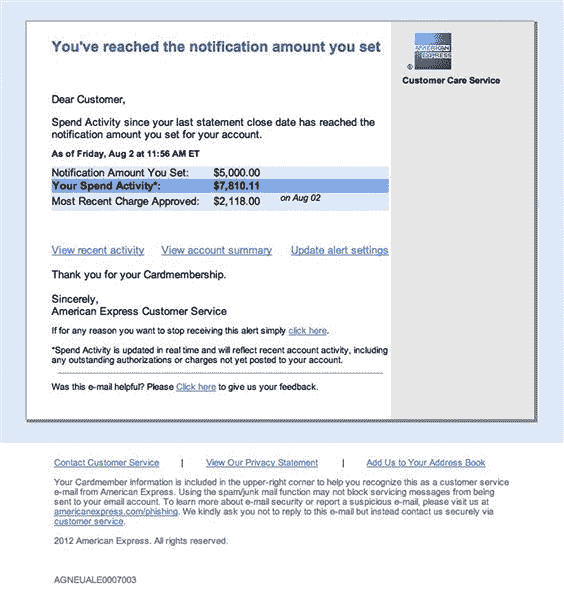

<figcaption class="figleg">Figure 9.1 Drive by phishing e-mail.</figcaption>

</figure>

从表面上看，这并不可怕。事实上，对于一个不经意的观察者来说，这看起来完全合理。品牌看起来不错，布局也不错。事实上，这是一个下载驱动的网络钓鱼骗局，于 2012 年首次被发现，并且传播非常广泛。下载驱动基本上是在目标不知道的情况下将恶意软件下载到目标机器上。通常这些都是通过恶意链接传递的。

这封电子邮件的实际收件人没有也从未有过美国运通卡。显然，它被精心设计成发送给许多潜在的目标，希望有百分之几的人会点击电子邮件中的超链接。深入链接后发现，它们都指向同一个恶意网址。在这种情况下，该站点可能托管恶意 Java 小程序或 ActiveX 控件，这将允许对任何易受攻击的系统造成全面危害。

在浏览器和邮件客户端中启用翻转功能总是值得的。当指针悬停在链接上时，它们显示真实的 URL。

## Atanasoff Gavin 博士-预付款欺诈

这是一个典型的预付费用欺诈的例子，实际上写得相当不错。当然，这并没有让商店变得更加可信。预付费用诈骗(也称为 419 骗局或尼日利亚骗局)基本上是引诱受害者花一点钱，并承诺以后会有大笔支出的过程。它们和时间本身一样古老，可以追溯到十九世纪和“西班牙囚犯”骗局。关于这类骗局的更多信息可以在[http://www.hoax-slayer.com/nigerian-scams.html](http://www.hoax-slayer.com/nigerian-scams.html)([图 9.2](#F0015) )找到。

<figure class="fig">

<figcaption class="figleg">Figure 9.2 Advance fee fraud e-mail.</figcaption>

</figure>

这个骗局有很多角度，但大多数都涉及某种错位的遗产，或者至少是一个处于危险中的富人。当然，在目前使用互联网的 23 亿人中，目标可能是唯一能拯救他们的人。

我们不要自欺欺人了，这些电子邮件完全不可信，但一定有人在某个地方爱上了它们。否则他们为什么会存在？正如已经指出的，这个骗局至少写得很好。这在网络钓鱼邮件中并不常见。这可能是因为这类活动的热点地区通常不以英语为第一语言。

## 苹果 ID 骗局——凭证收集

这实际上是一个真正精心制作的网络钓鱼。前提是收到一封电子邮件，要求通过登录提供的链接来验证 Apple ID。点击链接，你会看到一个非常专业的苹果 ID 登录页面的复制品。除了“忘记密码”和“创建帐户”链接之外，页面上的所有其他超链接都会返回到合法的 Apple 页面。相反，这些链接会返回到攻击者的站点，该站点实际上会显示一个 404 错误页面。骗子们显然还没有完全搞清楚其中的奥妙。

<figure class="fig">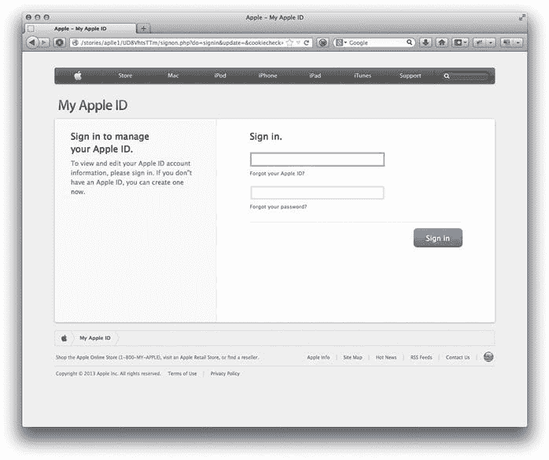

<figcaption class="figleg">Figure 9.3 Apple ID scam.</figcaption>

</figure>

首先，苹果绝不会发送电子邮件，要求验证登录信息。第二个指标是网址，和苹果完全没有关系。看一看[图 9.4](#F0025) 来看看这些骗局是如何精心策划的。

<figure class="fig">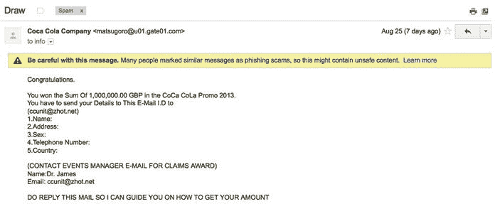

<figcaption class="figleg">Figure 9.4 Low rent e-mail scam.</figcaption>

</figure>

很明显，很难将它与真品区分开来。最近，苹果 ID 钓鱼诈骗呈上升趋势。这可能是因为他们中的大多数人都与信用卡相关联，可以在 iPhone 和 iPad 上快速购物。与此类似的克隆体的创建将在本章后面介绍。任何以前没有创建过的人都会震惊于整个过程是如何点击的，以及它是如何在几秒钟内启动并运行的！

## 没人会上当。没人。永远不会。

这已经是最低的租金了。甚至垃圾邮件过滤器也发现了这个。因此，这个例子只是被包括在内，以展示苹果公司的例子和这个拙劣的骗局借口之间的对比。

是的，[ccunit@zhot.net](mailto:ccunit@zhot.net)。似乎是合法的。真的有人上当吗？它们在流通是有原因的。也许只是为了娱乐？事实上，以科学的名义亲自回应是非常诱人的。特别是阅读了以下内容:

一定要回复这封邮件，这样我就可以指导你如何得到你的金额。

显然，已经花了足够的时间来讨论这个例子；事实上，讨论它所花的时间可能比骗子实际创建它所花的时间还要多。

## 主动电子邮件侦察

虽然我们的社会工程参与的侦察阶段已经被广泛地覆盖，但是仍然总是有空间探索进一步的信息。用最简单的话来说，电子邮件将被发送到目标组织，而这些回复可能成为进一步攻击的基础。

这无疑是一种更具侵入性的信息收集方法，也意味着风险更大。这也意味着风险可能带来更大的回报。可以发现一些对任何正在进行的电子邮件攻击和一般接触都非常有用的信息。即使看似无关紧要的信息也能为攻击者提供大量资源。举个例子，在商业世界中，几乎每个人都使用自动电子邮件外出回复，但是事实应该是这样吗？这是否为潜在的违规打开了大门？请继续阅读，寻找答案。

## 未送达报告

这里简要介绍了未送达报告(NDR)的主题，因为它们通常至少包含一点关于组织财产的信息，尤其是如果它们拥有自己的邮件服务器。

这个过程相当简单，当然值得花 5 秒来完成。只需向目标组织的某个地址发送一封电子邮件，该地址已知不存在。仅此而已。

几秒钟后，NDR 回来了。这里感兴趣的是 SMTP 头中的 X-Received 和 X-Originating-IP 值。这些字段有时可以包括内部 IP 地址空间，这对于处于正确位置的攻击者总是有用的！

```
  MIME-Version: 1.0
```

```
  X-Received: by 10.68.254.42 with SMTP id af10mr2443747pbd.154.1378061024083;
```

```
  Sun, 01 Sep 2013 11:43:44 -0700 (PDT)
```

```
  Received: by 10.70.28.225 with HTTP; Sun, 1 Sep 2013 11:43:44 −0700 (PDT)
```

```
  Date: Sun, 1 Sep 2013 19:43:44 +0100
```

一旦组织的总部遭到物理破坏，如果评估的一部分需要插件和黑客，这肯定是值得的。至少某些内部 IP 地址空间是已知的。

## 外出回复

许多企业鼓励他们的员工使用它们，但是通过它们的使用披露了什么信息呢？人们是否因为包含太多信息而将自己暴露在攻击面前？在大多数情况下，答案是响亮的是。人们通过泄露看似无害的信息来开放自己。

在接洽过程中，不在办公室的回复绝对是一座情报金矿，即使没有执行直接的电子邮件攻击。

能发现什么，如何利用？

首先，它提供了帐户存在和有人正在使用它的确认。这可能是项目期间可以验证的第一点。它还确认了电子邮件地址的公司命名约定。这当然意味着任何电子邮件列表都可以根据最佳猜测进行调整。

在不在办公室的回复中包含“*我不在时联系谁*”信息也很常见，这至少为剩余的约定提供了更多确认的联系人。这可以在打电话时使用，同时附上缺席员工的姓名。举个例子，“*嘿，我上周和汤姆谈过，他说他这周会休假，但他提到我可以顺便去他办公室工作。当我到达接待处的时候我能问你吗？*“或者如果觉得这可能有点冒险，”*他说他已经为我安排了一个会议室/热台，你能告诉我我到达后需要和谁通话吗？*“同样，这不仅能让你知道员工的名字，还能让你知道他们在被叫去的时候会离开，从而增强可信度。一个普遍的看法是，目标会立即将这一情报与办公室外的反应联系起来，但事实上，大多数人对此不会三思而行。

下一个，也可能是响应中最有用的信息，将是签名。签名中充满了有趣的内容，比如直拨电话号码、手机号码，我们不要忘记签名本身。然后复制整个签名，并在与目标组织的其他员工交流时使用。这将是注册一个与目标相似的域名的结果。令人惊讶的是，这是多么有效！这将在本章后面更详细地讨论。

我们还能在回应中看到什么？一个显而易见和常见的事情是要包括离开办公室的日期和预期的回报。这在测试的物理部分非常有用，尤其是在没有其他事情可做的时候。在处理这种情况时，有几个合理的选择。

## 不存在的会议

第一种选择是与不在的人会面。然而，当接待员发现目标不在时，这与工程师轻松装聋作哑和表现惊讶的能力密切相关。在这种情况下，人们通常会认为游戏结束了，然后走开，但如果玩得对，就可以进一步利用接待员的负罪感，例如"*我们大老远来见他，并向他保证他会有空，你确定他今天不会回来吗？*“在这一点上，可以鼓励接待人员再次检查，始终表现出礼貌和专业的态度，尽管不耐烦的反应往往会迫使个人做出积极的回应。一旦目标被确认不在，接待员会被询问是否有一个安静的地方可以打一些私人电话，以确认正在发生什么，也许是一个会议室？运气好的话，这可能会有一个进入大楼的方法，但在最坏的情况下，工程师可以干净地离开而不会引起任何怀疑。会议室的另一个选择是询问目标是否有食堂，以便在再次上路前吃点东西喝点饮料。当然，如果之前已经确定食堂区域不在物理安全控制范围内，这将更加有用。在过去的约定中，众所周知，社会工程师会被发给通行证，并被向通往食堂区域的门招手。在去食堂的路上有一排会议室，每个都有活动的接插端口。不难猜到接下来发生了什么！

## 冒充缺席的工作人员

这个可能更难实现，但在很多情况下对我们有用。前提很简单，你打电话进一个联系人，最好是前台，假装是不在的工作人员。你告诉接待员一个与承包商的会议，他们参加了一些重要的维护工作，这被忽略了，你正在休假，但是你忘记了你有一些承包商来代表你执行一些工作，他们不能满足。在这一点上，你问，在这种情况下，安排通行证以便承包商能够开展工作的协议是什么，对此进行了澄清。此外，这可以通过尝试在此时预订会议室来支持，以便承包商有地方工作。这是一个令人惊讶的有效，但简单的方法来获得未经授权的访问的前提。人们经常发现，如果顾问表现得慌张并暗示你真的在这个问题上犯了大错，就更有可能获得目标的同情。你甚至可以考虑通过透露一些关于安排这项工作有多贵的信息来获得同情票，并努力避免你的老板发现你犯了这样一个基本的错误。这对你的订婚有两个影响。首先，你通过指名道姓地贬低一个人的权威来增加一点压力。其次，接待员不太可能在内部告诉任何人正在发生的事情。当这个计划成功时，这是一个非常好的、干净的进出方式。关键的部分是能够以合理的风格完成面对面的事情。然而，已经通过电话安排了通行证，面对面的事情再容易不过了。这就像对你的借口有真正的信心一样，这也让你更容易找到借口。必须有一个强烈的信念，那就是在那里有一个合法的理由。

## 创建可信的电子邮件场景

既然我们已经看到了通过这些技术可以获得多少有用的信息，那么我们如何避免在发送电子邮件时被发现呢？我们需要足够普通的场景，以避免被怀疑，但又足够具体，以获得人们的回应。

在这一节中，我将介绍一些我们过去成功使用过的例子。

记住，你不一定需要用这个借口；你只是在寻找员工的回应或不在办公室的信息。不要想太多，只要想出你被主动联系的情景，然后把它塑造成你自己的。

这并不是说你不能把最初的侦察变成攻击。这取决于你得到的回应的类型。如果你觉得你可以和某人建立融洽的关系，或者你可能找到了一个容易的目标，那就去做吧。

如果你发送电子邮件给很多人，确保你把所有的目标都盲复制到邮件中。一封发给上百个内部联系人的邮件总是会给你的目标组织带来危险

## 工作经验实习

这是最直接的策略之一，通常可以发送到企业内部任意数量的电子邮件地址。请确保每个目标都在“密件抄送”字段中，而不是在“收件人”字段中。尝试将电子邮件目标列表分成多个组，以避免一次尝试烧毁所有桥梁。

这个想法很简单，在你选择的提供商那里建立一个假的邮件账户，比如 GMAIL。考虑用一个女性名字建立账户，以利用这样一个事实:it 行业被认为是一个男性主导的环境，因此，如果是男性，人们会比他们更不警惕。如果对它们有更多的了解，这可以被定制以匹配特定的目标。

因此，考虑发送一封类似这样的电子邮件:

早上好，

我目前正在寻找一份工作经验，作为我大学学位的一部分。我正在寻找当地企业，并注意到贵公司在我选择的营销领域非常突出。你能让我知道你是否正在接受工作实习，或者你是否打算在未来这样做吗？你能提供的与此相关的任何帮助都将不胜感激。

最诚挚的问候，乔安妮

避免方法过于复杂或过度思考。没有必要用一堵文字墙来杀死它，这更有可能在目标看到它的第二秒就击中回收站。现在，这只是一个踢回来，等待回应的情况。

通常，它会收到一些不在办公室的回复，它们的用处已经被讨论过了。几乎不可避免的是，会有提供更多信息或提供信息的人回复，这封电子邮件将被转发到相关部门。有时，该电子邮件可能会将相关部门复制到电子邮件中，从而提供另一个有效的目标。

## 将场景武器化

将这种方法武器化相当简单，但是依赖于您可以与之建立融洽关系的组织内部人员的反应。如果你能通过几封电子邮件保持对话，目标就会完全放松警惕。不要低估你认识某个电子交流的人的想法。这就是我们生活的时代！

在这一点上，现实的做法是附上你的简历，或者一个链接到你的网站，有你的工作的例子。当然，CV 中会嵌入一个有效载荷，并且这个包会交付一个恶意的 Java applet。我会说，鉴于目前的状态，链接到一个网站有更多的机会逃避安全系统。

## 大学项目

这是另一个很好的简单方法，它的工作方式和“工作经验安置”差不多这个想法是利用一所学校或学院，与目标企业相关的项目，并询问企业内是否有人能够提供帮助。这通常有助于选择该地区的教育机构，他们可能以前接触过。

下午好，

我目前在 XYZ 学院学习，正在从事一个与广告在航空航天领域的应用有关的项目。我的一个朋友注意到你在该地区工作，在业内很有声望。我想知道你是否能给我一些提示或者提供能帮忙的人的详细信息？我在这个项目上有点落后，所以任何帮助都将非常感谢。

热烈问候，罗伯·史密斯

再说一遍，这只是一封简单的电子邮件，企业可能会定期收到这种邮件。冒充学生提供了保证，并且如果需要的话，电子邮件中没有任何不合适的地方提供了一个干净的出口。

## 将场景武器化

考虑到一个项目正在寻求帮助和批评，这种场景非常适合包含一个到作品的链接，这当然可能是恶意的。更好的是，如果有一个足够年轻的社会工程团队成员来完成它，为什么不看看是否可以安排一个面对面的会议，与企业内部的人。出现并有一个护卫，通行证和一个在那里的理由是最好的。为了增加可信度，一个真正基础的网站可以在很短的时间内充实起来。此外，考虑准备一些可能揭示内部系统信息的问题。

例如，其中一个问题可能是:

你如何监控竞争对手在广告方面的行为，你如何保持领先？

如果他们回答说，他们使用互联网来研究他们所选择的领域，那么在没有意识到的情况下，他们已经提供了非常需要的关于他们拥有出境互联网接入的信息。这可能对以后的有效载荷部署有用。显然，鉴于已经安排了面对面的访问，原始链接不会有恶意，以避免被破坏的风险。它本可以是一个记录所有访问的干净网站，这样就可以了解网络访问的级别，以及他们使用的浏览器类型。

对于非恶意网站来说，另一个有趣的想法是在不同的端口上包含一些到其他页面的链接。例如，SSH 的 TCP/22。如果该链路对目标有效，它将能够将流量传输到网络之外。

因此，在介绍了几个示例以及如何在实际项目中使用它们之后，让我们用更多的示例来结束这一部分，以供您借鉴。我不会设计一个电子邮件的例子，而是让你想出一个场景。

## 招聘顾问

同样，这里的关键是，招聘顾问主动发来的电子邮件司空见惯；因此，这不会引起恐慌。

前提是，有几个候选人，在不同的角色，需要被安置，其中一些将是理想的角色在企业内提供。给邮件添加一些关于候选人及其技能的细节，让它看起来可信。

同样，可能会有不在办公室的回复、NDR 和真实的回复。希望在真实的回复中会有人愿意处理这封邮件，或者至少提供愿意处理的人的详细信息。然后可以引入包含嵌入式有效载荷的 CV。

## 售货员

这是获取内部系统信息的一个很好的场景。例如，如果任务是确定目标组织是否使用思科交换机；打着硬件供应商的幌子发电子邮件，谈一些思科交换机的好交易。他们可能会无意中提供他们已经有了首选思科设备供应商的信息——结果！从这里开始，可以通过几封电子邮件建立融洽的关系，并逐渐收集更多信息，甚至可能导致致电目标。这个场景可以应用于任何技术来获取关于基础设施的信息。对于终端用户来说显而易见的技术，甚至可以从他们那里得到回应。一个典型的例子是反病毒软件。请记住，收到的任何直接回复都是额外奖励。这纯粹是为了寻找 NDR、签名和外出回复，以便在进一步的攻击中使用。

只要花一点时间和精力，这些类型的电子邮件可以为评估带来很好的结果。在了解如何创建单独的攻击之前，这里有一些防御网络钓鱼攻击的基本想法！

## 防御网络钓鱼攻击

防御网络钓鱼攻击可以分为两个高级类别:技术方法和人工方法。这两者的结合最有可能防止这类攻击。在这一章中，我们不会讨论教育员工的来龙去脉；这些仅仅是改善你体态的高层次想法。

教育和意识理念在第 15 章中有更详细的介绍。

## 技术方法

网络钓鱼攻击的技术手段是那些最终用户并不真正参与的手段。换句话说，在风险传染给人类之前，尽可能早地消除风险。以下几节将讨论一些可能有所帮助的技术

### 网关、邮件服务器和终端或客户端机器上的垃圾邮件和防病毒产品

这些解决方案将挑选出低挂水果和明显的骗局。

### 基于主机的入侵防御或“HIPS”产品，以及基于网络的入侵防御系统

假设流量没有加密，这些系统可以检测恶意活动和网络流量。

### 客户端应用程序修补

确保客户端应用程序保持最新。这包括 Java、Adobe Reader 和浏览器！绝大多数客户端攻击都以 Java 和 Adobe 产品为目标。

### 出站内容过滤—防火墙和代理

将出站端口访问限制在绝对最低限度应该是首先采取的步骤之一；然而，遗憾的是，许多组织都缺乏这种能力。大多数企业倾向于将重点放在入站访问上，从而保护边界。这就导致了外硬内软的局面。

用白名单过滤内容可能是更好的方法之一。维护一个允许站点的最小列表，恶意链接通过网络的可能性很小。透明代理在这里可能是最好的，因为它们对用户来说是最难绕过的，他们会试图绕过它们。

## 人类的方法

人工方法是用户在工作时可以直接实现的方法。它们是典型的简单建议，应该在家里和工作场所都实现。

首先，确保当鼠标悬停在超链接上时，真实的 URL 会显示出来。用户需要意识到它的功能，并向其解释显示为链接的内容并不总是合法的。

在工作场所对用户进行一般信息安全实践方面的教育也会有所帮助。例如，确保用户知道合法的服务和企业不会发送询问敏感细节的电子邮件。

运行一个赏金程序。如果用户识别出恶意电子邮件并向技术团队举报，他们将获得奖励。然后，恶意电子邮件被用来教育普通用户群。很明显，不要仅仅把它转发到整个邮件列表上——比如选择截图。

向用户展示尽可能多的网络钓鱼电子邮件示例，指出它们之间的共同识别特征。

向用户灌输一种偏执狂的感觉可能看起来很极端，但是当涉及到不请自来的通信时，这是唯一的出路。应该仔细检查每个入站通信中的恶意内容。

请记住启用邮件客户端中的功能，以便在发件人字段中显示完整的电子邮件地址。很多邮件客户端会用发件人在配置帐户时设置的名称来替换它！

## 设置你自己的攻击

在本节中，我们将研究针对社会工程约定的电子邮件攻击的设置。一般来说，大多数约定将使用 SET—[https://www . trusted sec . com/downloads/social-engineer-toolkit/](https://www.trustedsec.com/downloads/social-engineer-toolkit/)和 Metasploit—【http://www.metasploit.com】。

这两个工具都是免费的，并且都附带了 BackTrack 和 Kali Linux。

这套工具是由 David Kennedy(又名 ReL1K)创建的，是一个工具框架，用于自动化大部分评估。就本节而言，我们将重点关注与电子邮件相关的攻击。

## 假冒电子邮件与假冒域名

在我们开始实际执行攻击之前，我想谈谈电子邮件攻击的一个重要问题。

首先，人们仍然谈论欺骗电子邮件，就像它们在今天的环境中有相关性一样；实际上，它们很少起作用。有几种不同的技术使欺骗变得非常困难，并且存在于许多邮件网关中。首先，大多数产品会意识到外部邮件不应该来自内部或公司域。换句话说，如果你伪造邮件，让它看起来像是来自[bob@offensivesite.com](mailto:bob@offensivesite.com)的，邮件网关就会知道你不属于它，并删除该邮件。

第二个特性是反向 DNS 查找。当您建立 SMTP 连接时，邮件网关将检查您的 IP 地址是否解析为您声称发送邮件的域。当它意识到没有匹配，它会删除或隔离您的邮件。这意味着您需要有一个正确设置的 SMTP 服务器，并且您需要拥有一个可以使用的域。所以请相信我，你永远也不会给微软的某个发件人地址是[bill.gates@microsoft.com](mailto:bill.gates@microsoft.com)的人发邮件。这是不可能的。除非你是比尔·盖茨，在这种情况下，谢谢你买了比尔这本书。这并不意味着您不能在向另一个组织发送邮件时冒充 Bill 这只是取决于他们的邮件网关和相关安全产品设置得如何。

欺骗邮件的最大问题之一是，即使你认为它们可能有用，你也冒着浪费大量时间等待回复的风险。电子邮件攻击是盲目的，除非您收到一封不在办公室的邮件或实际的回复，否则您不会知道它到达了目标。

因此，如果你想让自己的邮件看起来像是来自内部联系人，最好的办法是注册一个类似的域名，或者是一个与另一个顶级域名(TLD)完全相同的域名。举个例子，你的目标可能是使用[offensivesite.com](http://www.offensivesite.com)，但是我们可以去注册[offensivesite.net](http://www.offensivesite.net)。你认为一个组织中有多少非技术员工会看到这种差异？如果有，他们会质疑吗？也许这是该组织教育政策的另一个方面。

说到看出区别，还有一个关于恶搞的有趣想法。在大多数邮件客户端中，当收到电子邮件时，您不会在发件人栏中看到电子邮件地址。你看到一个名字。该名称是由发送者在建立他们的帐户时定义的，其本身可用作一种欺骗形式。很值得在未来的交往中牢记，是的，它以前对我们有用。事实上不止一次。

我倾向于注册一个相似的域名。有时你可能会被留下来交换看起来相似的单个字符，因为所有的域名都被占用了，但这只是乐趣的一部分。在这个过程中，我们通常会使用 Google apps，因为它设置和运行起来简单快捷。你注册了你的域名，几乎可以立即开始为任何最适合你的借口设置多个邮箱。您可以为每个帐户设置与目标组织匹配的 HTML 签名，这只会增加合法性。事实上，我敢说，大多数人可能只看这一点来判断电子邮件来自内部联系人。就像电子时代的制服！

封锁任何包含您公司名称的域名不是一个好主意吗？即使你不拥有域名本身？精神食粮。

## 布景

正如我们之前简单提到的，SET 是一个非常棒的社会工程框架，它将真正帮助你摆脱跑腿的工作。这对您的客户意味着您可以在更短的时间内交付更多的价值。大家都赢了！

那么我们在哪里可以找到 SET 呢？假设您使用的是 Kali Linux，您可以在命令行中键入 se-toolkit，也可以在 Kali 菜单中的应用程序> Kali Linux >开发工具>社会工程工具包中找到它。

假设此时没有发生爆炸，您应该会看到类似于[图 9.5](#F0030) 的内容。

<figure class="fig">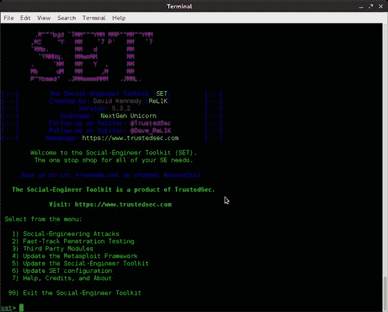

<figcaption class="figleg">Figure 9.5 The SET menu.</figcaption>

</figure>

SET 是菜单驱动的，这使得它非常容易掌握。我会先点击“5 ”,然后等待任何更新完成后再继续。

## 鱼叉式网络钓鱼攻击媒介

鱼叉式网络钓鱼是一种非常巧妙的自动方式，可以创建恶意文件并将其发送到选定的目标。SET 包含完成所有跑腿工作的功能，包括发送电子邮件。下一步是创建有效负载，并使用 SET 登录 Google Apps GMAIL 帐户并发送电子邮件。

如果要定期这样做，那么设置模板并使用 SET 来发送任何恶意电子邮件可能是值得的

因此，如果您现在正在查看 SET 主页，请为鱼叉式网络钓鱼攻击矢量选择选项 1，然后选择选项 2 来创建 FileFormat 有效负载。

此时，您会看到一个相当大的选项列表。如果您对目标的内部系统有足够的了解，那么您最好选择一个适合该环境的选项。在这个例子中，我们将坚持基本原则，在 PDF 中嵌入一个恶意的可执行文件—选项 15 ( [图 9.6](#F0035) )。T3】

<figure class="fig">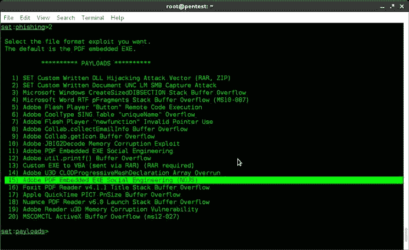

<figcaption class="figleg">Figure 9.6 PDF embedded EXE.</figcaption>

</figure>

接下来，您将选择使用您自己的 PDF 作为恶意文件或空白模板的基础。这里的选择将取决于你想离开时有多干净。如果有效载荷路线不起作用，您可能需要一个后备计划。在这种情况下，请确保您的 PDF 包含一些与您现有借口相关的有效内容。为了便于演示，我们将选择内置的空白 PDF。

此时，如果您熟悉 Metasploit，您会认识到该页面上的许多内容。这是您选择想要部署的有效负载类型的时候。此时你需要仔细考虑你的目标。为了确保应用程序防火墙和入侵防御系统不会破坏您的一天，查看加密的有效负载可能是值得的。

出于示例的原因，我们将坚持使用反向 Meterpreter 有效负载—选项 2。假设目标在我们定义的端口上有出站连接，这个有效负载将连接回我们。同样值得考虑的是典型客户端的出站访问类型，例如，TCP/80 上的 HTTP 或 TCP/443 上的 HTTPS，我们接下来将对此进行定义。

出现提示时，输入您的 IP 地址和您想要监听的端口。我们将选择 TCP/443，因为它比 TCP/22(SSH)更有可能被允许出站。

此时，如果您愿意，可以选择重命名该文件。同样，如果你有借口的话，让它适合你的借口！

现在您应该会看到 SET mass e-mail 屏幕，我们在这里设置谁将接收我们的有效负载。

选择选项 1—电子邮件攻击单个电子邮件地址

选择选项 2—一次性使用电子邮件模板—您现在可以键入自己的电子邮件内容

选择选项 1——使用 GMAIL 帐户进行电子邮件攻击

标准的 GMAIL 账户会扫描 pdf 文件，所以你可能会被阻止。谷歌企业应用套件的商业账户限制较少。

现在，系统会提示您输入您的 GMAIL 帐户和密码，或者如果您选择了另一个 SMTP 服务器，请输入详细信息。

电子邮件将被发送，现在会提示您设置一个 Metasploit 侦听器。同样，SET 将根据您为恶意 PDF 提供的详细信息为您处理此问题！[图 9.7](#F0040) 显示了正在建立的监听器。

<figure class="fig">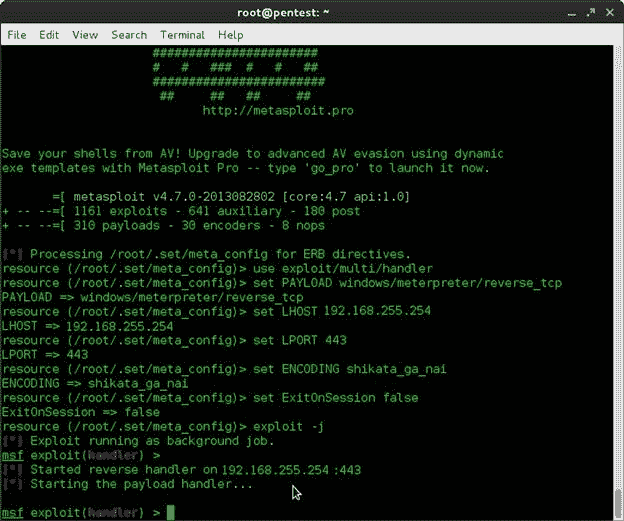

<figcaption class="figleg">Figure 9.7 Payload handler.</figcaption>

</figure>

在这一点上，这是一个等待的游戏。在 Metasploit 内建立会话之前，不知道有效负载是否通过了所有防御技术层。它看起来像什么？

```
[*] Sending stage (751104 bytes) to 10.10.200.56
```

```
[*] Meterpreter session 2 opened (10.10.200.26:443 -> 10.10.200.56:1062) at 2013-09-04 16:32:08 +0100
```

此时，您可以运行所有常用的 post 模块，或者根据需要尝试权限提升。我可能会从“hashdump”开始获取离线破解的本地帐户哈希。然后我会使用匿名来检查域模拟令牌。有关后期开发工作的信息，请查阅优秀的“Metasploit:渗透测试人员指南”，ISBN-10: 159327288X。

这里还有其他方法可以达到同样的效果。使用 Metasploit 创建一个有效负载，并使用选择的邮件客户端交付它。重要的是有效载荷到达它的目标。

## 这种方法真的有效吗？

所写的一切都经过了一些现实世界意见的锤炼，因为在一天结束时，这是一个实用指南。我们说的任何事都需要成功。总而言之，这种攻击绝对越来越难以得逞。现在有许多不同的技术可以用来降低电子邮件带来的危险，人们的意识也在不断提高。尽管如此，我们仍然看到了一定程度的成功。这当然仍然是一项值得做的工作。我给你的建议是查看各种编码器、打包器和加密器，尝试在这些防御周围获得有效载荷。一个好的起点是看一看 Veil 框架。该工具集允许创建有效负载，这些有效负载通常会绕过大多数防病毒解决方案，但仍然保持与 Metasploit 的兼容性。查看 Christopher Truncer 的网站了解更多信息—[https://www . Christopher Truncer . com/veil-a-payload-generator-to-bypass-anti virus/](https://www.christophertruncer.com/veil-a-payload-generator-to-bypass-antivirus/)。

让我们继续，看看直接发送恶意负载的替代方法！

## 恶意 Java 小程序

从我记事起，Java 似乎每周都出现在与安全相关的新闻媒体中，不幸的是，原因并不正确。它安装在全球数十亿台设备上，包括客户端工作站、服务器和基础设施设备。

最近已经注意到几起针对 Java 软件的高调黑客攻击。微软、苹果和脸书都是受害者。

你可以通过以下链接了解更多关于这些黑客的信息:

[http://blogs . TechNet . com/b/msrc/archive/2013/02/22/recent-cyber attacks . aspx](http://blogs.technet.com/b/msrc/archive/2013/02/22/recent-cyberattacks.aspx)

[https://www . Facebook . com/notes/Facebook-security/protecting-people-on-Facebook/10151249208250766](https://www.facebook.com/notes/facebook-security/protecting-people-on-facebook/10151249208250766)

[http://www.bbc.co.uk/news/technology-21519856](http://www.bbc.co.uk/news/technology-21519856)

这种类型的攻击以客户端软件为目标，试图避开外围安全系统，并且成功了！

鉴于这种类型的攻击正在现实世界中进行，它们也为我们的客户提供了非常实用的评估。所以你可能会想，这将是非常复杂的设置，这将是太费时，在短期测试实际。现实却大相径庭。该套件以易于使用的方式为我们提供了这一功能。这是它的工作原理。

您在面向公众的服务器上托管一个克隆的或定制的网站。这可能是目标公司网站或远程访问门户的直接克隆。网站会有一个恶意的 Java 小程序被 SET 嵌入其中。当用户接受 Java applet 时，此有效负载将在任何易受攻击的系统上提供一个 Meterpreter 外壳。

让我们浏览一下，以证明这种攻击有多简单。

假设你已经设置打开并遵循这些步骤:

选择选项 2——网站攻击媒介

选择选项 1—Java Applet 攻击方法

选择选项 2—站点克隆者

此时，系统会询问您是使用 NAT 还是端口转发。换句话说，你是在路由器还是防火墙后面？它这样问的原因是，它需要确保反向侦听器被设置到有效负载中的正确 IP 地址。如果您没有正确设置，您的受害者将最终连接回您的私有 IP 地址，您的有效负载将永远不会离开目标网络。为了我们的练习，我们将选择 no.

设置反向连接的 IP 地址。这可能是您的 Kali Linux 或回溯 IP 地址。

输入要克隆的站点——在这个练习中，我将使用 GMAIL。

此时，我们被提示再次选择有效载荷。

选择选项 2—Windows Reverse _ TCP meter preter。

选择选项 4 后门可执行文件。

为监听器选择一个端口——暂时使用默认端口 TCP/443。

此时，SET 将启动 Metasploit 并自动调出各种侦听器和处理程序。你现在需要做的就是让别人点击你的链接，那么我们该怎么做呢？我通常会使用一个假域名，并确保我的借口是可信的。您可能会冒充支持团队的成员，并要求某人验证他们的凭据是否仍然适用于 VPN 或 Outlook Web Access。

无论您选择哪个 con，请记住您可以更改显示的文本，而不是实际的 URL。看一下[图 9.8](#F0045) 。

<figure class="fig">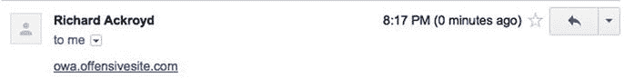

<figcaption class="figleg">Figure 9.8 Malicious hyperlink.</figcaption>

</figure>

链接[owa.offensivesite.com](http://www.owa.offensivesite.com)实际上是到 [http://192.168.1.153](http://192.168.1.153) 的链接，这是我的实验机器。这就是悬停的重要性不可低估的地方！

在 Google Apps 中，你可以通过点击链接图标来实现，这是一个链条的图片。您可以在“要显示的文本”框中输入您喜欢的任何值，这就是当您的受害者收到电子邮件时会显示的内容。那么当你的目标浏览网站时会发生什么呢？查看[图 9.9](#F0050) 。

<figure class="fig">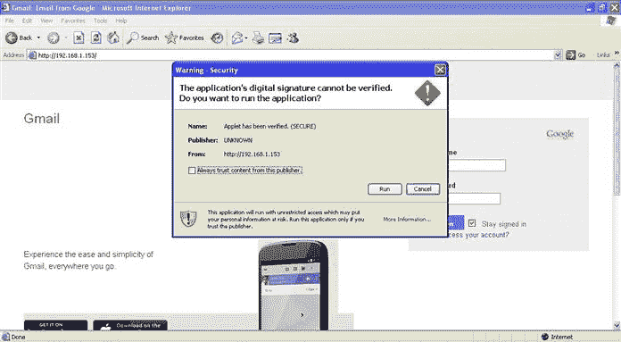

<figcaption class="figleg">Figure 9.9 Malicious applet.</figcaption>

</figure>

正如您所看到的，用户仍然需要点击来运行 Java applet，所以仍然有一个障碍需要我们去克服。只要你的一个目标不小心，你就大功告成了。

```
[*] Sending encoded stage (751134 bytes) to 192.168.1.89
```

```
[*] Meterpreter session 1 opened (192.168.1.153:443 -> 192.168.1.89:1302) at 2013-09-05 20:32:08 +0100
```

这种攻击的一个有用的方面是，即使有效负载没有脱落，每次点击仍然会被记录在 Metasploit 控制台中。从技术的角度来看，房地产目前可能看起来是安全的，但用户仍然在点击恶意链接。只需一个零日漏洞就能危及这些系统。

现在我们已经介绍了在网络钓鱼攻击中获取外壳的几种不同方法；让我们看看使用克隆站点的凭据收集。

## 使用克隆的网站获取凭据

当涉及到社会工程约定时，这无疑是最受欢迎的攻击类型。绝对没有什么比等待第一个目标开始输入他的用户名和密码更令人兴奋的了。众所周知，社会工程团队兴奋地挤在显示器周围，等待结果闪现。创建克隆网站来获取凭证是最近才进入公众视野的事情。叙利亚电子军似乎已经将它作为他们选择的攻击载体，迄今为止已经攻破了几个备受瞩目的目标。他们通常会克隆属于其目标组织的 Outlook Web Access 页面，然后使用各种方法诱使目标登录该页面。老实说，他们的一些攻击方法至少是基本的，但仍然允许他们访问一些真正高调目标的 Twitter 账户。从字面上来看，这是一封电子邮件中的一个链接，没有解释，没有积累，也没有多少合理性。让这些电子邮件看起来可信的是，它们中的许多来自同一个域中已经被入侵的账户。这恰恰说明，即使是你认识的人发来的电子邮件也不可信！

这类攻击在现实世界中如此普遍，这一事实使它们成为对社会工程项目的一个很好的实际评估。

那么，我们如何克隆一个带有登录表单的网站呢？好吧，再一次上升。当我向你展示这些家伙是如何轻而易举地做到这一点的时候，你就会明白为什么这是如此受欢迎的攻击。它也不依赖任何类型的恶意文件，这意味着你不太可能被安全设备或软件所束缚。

再次启动 SET 并选择选项 2—网站攻击媒介。

接下来选择凭证收集器攻击方法—选项 3 ( [图 9.10](#F0055) )。

<figure class="fig">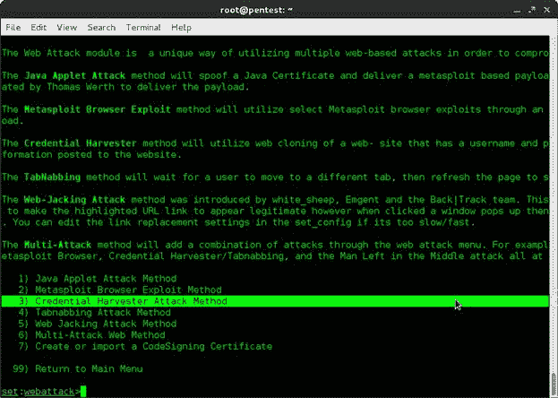

<figcaption class="figleg">Figure 9.10 Credential Harvester Attack Method—Option 3.</figcaption>

</figure>

此时，系统会要求您输入 IP 地址和要克隆的站点。我们将再次选择 www.gmail.com。

同样，链接必须以一种更容易被点击的方式发送，比如“恶意 Java 小程序”一节中给出的好例子。

SET 控制台将显示输入的所有凭据。然后，它会将受害者重定向到实际的 GMAIL 网站，并让他知道他输入了错误的凭据。希望他们不会注意到，攻击会在雷达下进行。

在[图 9.11](#F0060) 中可以看到，Bob 的 GMAIL 密码被成功捕获。如果这种攻击的目标是客户端的 VPN 登录门户或 Outlook Web Access，那么这种攻击会更有针对性。如何处理这些凭证在很大程度上取决于合约的范围。顾问可能会出现在现场，并使用它们登录到桌面，也可能使用它们直接登录到 VPN 门户。无论是哪种情况，这都是一种非常有效的测试方法，可以突出政策和程序中的弱点。这两个问题都有希望被客户解决。

<figure class="fig">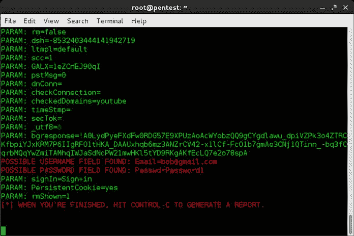

<figcaption class="figleg">Figure 9.11 Captured credentials.</figcaption>

</figure>

## 所有这些真的是社会工程吗？

当我们在评估中引入新工具时，这是我经常问自己的问题。在许多情况下，您将执行一个混合评估，涵盖社会工程和渗透测试。在这种情况下，我们讨论的一切都符合要求。我在这件事上的感觉是，攻击者不会把一只手绑在背后，然后直接攻击。他们将使用任何他们可以使用的工具，无论是传统的社会工程和操纵策略，还是更多的黑客方面的东西。

对我来说，这取决于你如何发送电子邮件，以及你在邮件中包含了什么，这是否真的可以被归类为社会工程。你使用了人类影响的元素吗？这里面有什么借口吗？这些问题的答案很有可能是肯定的，你甚至可能没有意识到这一点。社会工程的一些元素对我们来说是非常自然的。经历了"*的思维过程，是什么让我点击了这个链接？*“经常做足够多的事就能得到结果，而不必想太多。

下面是一个结束这一章的例子([图 9.12](#F0065) )！

<figure class="fig">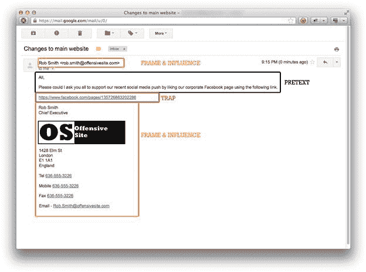

<figcaption class="figleg">Figure 9.12 Example e-mail.</figcaption>

</figure>

此处的电子邮件显然不是真实的，而是基于在评估的汇报部分向客户展示的内容。有趣的是，在一次电子邮件攻击中涉及了多少传统的社会工程概念和技巧，只是在不同的环境中，通过不同的媒介传递。这又是一个非常简单的网络钓鱼攻击的例子。这并不奇怪，链接没有去脸书！

## 摘要

在这一章中，我们解释了网络钓鱼攻击的所有方面，从一些真实世界的例子开始，有些例子很好，有些不太好。

然后，我们通过使用电子邮件作为侦察工具，转向了情报收集的艺术。我们研究了在这个简单的练习中可以恢复的信息类型，以及我们如何使用它们来形成进一步的攻击。由于外出回复通常包含大量信息，因此强调了外出回复的有用性。这包括进一步的内部联系信息、电子邮件签名和目标缺席的时间范围。

然后，我们看了看这种情报收集的一些可能的场景。基本上，这些电子邮件可以被发送而不用担心触发任何警报。

如果没有一些防御思想，与攻击相关的主题是不完整的，所以我们简要地介绍了一些在这个不断变化的环境中可能有所帮助的概念。

我们转到了执行我们自己的攻击的主题，从围绕电子邮件欺骗和假冒域名的讨论开始。然后，我们研究了主要的攻击类型，包括通过各种方式获取凭据和交付有效负载。

作为本章的总结，我们来看看一封典型的网络钓鱼电子邮件，并确定传统的社会工程技能如何适应它们。

接下来，我们将在下一章研究电话攻击媒介。

