Chapter 12

# 用技术支持攻击

<address>

理查德·艾克罗伊德，随机风暴有限公司高级安全工程师

</address>

每个人都喜欢小工具，但除了作为有趣的玩具，它们还可以被用来为社会工程攻击提供另一个维度。老掉牙的说法是将无线接入点放入公司网络，然后离开，但这可行吗？还有更好的工具吗？本章将介绍 3G dropboxes、无线工具和 3G KVM 交换机。我们将为您的目标网络构建一个支持 3G 的 dropbox，并提供全面的虚拟专用网络(VPN)支持。

### 关键词

RaspberryPi3G；dropbox 拉斯扁；OpenVPN 反向 SSH

本章中的信息

连接到网络

电缆和带电端口测试仪

上网本

我在哪个子网？

港口安全

远程连接网络

收纳箱

Dropbox 挑战

pwn express

树莓

Intel NUC

亦作 ran

打造自己的“收存箱”

安装操作系统

给家里打电话

设置基于证书的认证

创建 SSH 反向隧道

使它坚持下去

增加 3G/4G 支持

选择加密狗

屏幕、无线和其他硬件

苹果皮褥子

无线加密狗

为你的收纳箱选择一个箱子

将 OpenVPN 加入我们的后门

路由问题以及如何克服这些问题

替代收纳箱

3G 和 IP KVMs

路由器

无线接入点

危及内部系统

其他有用的小工具

键盘记录程序

录音设备

teensy usb

恶意 u 盘

WiFi 菠萝

## 介绍

在第 11 章的[中，我们讨论了物理攻击媒介，它通常构成了社会工程评估的大部分。](11.html)

这一章都是关于小工具的。我们将涵盖我们可用的不同类型的技术，这些技术可以增强我们的评估。

我们将着眼于连接到目标组织网络的过程，以及可能阻止其发生的常见障碍。我们还将了解一些设备，这些设备可以让我们从远程位置执行剩余的工作，有时被称为“dropboxes”

当您尝试评估的物理访问部分时，随身携带一些设备总是有用的，因此我们也将涵盖这些内容。

我们将通过查看 WiFi 菠萝来总结这一章，以便在互动过程中帮助应对无线攻击。

### 连接到网络

如果定期进行社会工程评估，就需要对数据进行过滤。这毕竟是一次真实攻击的模拟。这可以是对文件柜的突袭，公司财产的转移，或者通过连接到网络并侵入你的目标。在本节中，将介绍一些将会遇到的障碍和潜在的解决方法，以及一些在此任务中可能有用的技术。

#### 电缆和带电端口测试仪

典型的电缆测试人员需要访问物理网络电缆的两端，这使得他们在这种情况下用处不大。如果顾问走进一个满是补丁端口的房间，他们如何快速确定哪些端口是活动的，以便节省一些测试时间？有一种设备可以做到这一点，尽管大多数选项都非常昂贵。

第一个选项是 Smartronix link check—[http://www.smartronixstore.com/index.cfm?fuse action = Product . display&Product _ ID = 18](http://www.smartronixstore.com/index.cfm?fuseaction=product.display&Product_ID=18)。

它是一个小型设备，将决定链路可用性以及连接速度。它们的零售价约为 60 美元，可能是执行网络连接基本检查的最具成本效益的方式。

Smartronix 还制造了一种更昂贵的设备，Linkup，它可以将数据放到电线上进行更彻底的测试。

下一个选择是看看福禄克网络公司制造的设备，但这些设备通常会花费数千英镑。它们是非常酷的套件，如果与大型企业网络一起工作，会非常有用，但在测试或社会工程业务中很难证明其合理性。这些设备将完成从物理连接测试到动态主机配置协议(DHCP)测试的所有工作。它们还能够捕获数据包。这些设备配有全彩色触摸屏，用于分析和报告目的。

用一个带液晶屏的树莓 Pi 来显示网络状态和 IP 地址详情怎么样？RaspberryPi 的使用在本章的 dropbox 部分有所介绍，也涉及到 Adafruit LCD 面板，它会显示 IP 地址。

最现实的选择是使用上网本，它可以兼作渗透测试的电脑。

#### 上网本

上网本是一种低成本的笔记本电脑，既小巧又功能强大。用双核 CPU 和足够的 RAM 运行 Kali 或类似的 Linux 发行版，不到 250 美元就可以买到这些。例如，粗略搜索一家受欢迎的网上购物零售店，有许多新的和二手的上网本，包括低端供应的全新 WolVol BLACK 10”笔记本电脑，带 WiFi 和摄像头(Android 4.2，双核处理器，8 GB 高清)，仅售 149.94 美元。扩展电池将提供 6-8 小时的寿命，使它们成为任何社会工程师的理想伴侣。

然而，作者有几个更高规格的华硕 EEE 电脑的各种形状和大小，用于这种参与。

由于它们的尺寸，它们很容易藏在人的身上，放在大口袋或公文包里。它们也很容易隐藏在企业环境中，用作收存箱。

考虑到成本和收益，它们应该被视为工具箱中的基本项目。

#### 我在哪个子网？

许多网络环境都非常依赖 DHCP，尤其是客户端访问，但是如果 DHCP 不可用怎么办？如何收集本地子网和其中主机的信息？

简单地说，通过运行数据包嗅探软件来找出谁在那里说话。Wireshark、TShark 或 TCPDUMP 是首选工具。显然，因为没有 IP 地址，所以不会看到任何单播 IP 流量，但会看到广播，例如地址解析协议(ARP)流量。这可能会立即泄露本地 IP 地址范围，并且通常还会指示默认网关。默认网关几乎总是给定子网中的第一个或最后一个地址，例如. 1 或. 254

还可以利用思科发现协议(CDP)来提供有用的信息。CDP 数据包将包含 IP 地址和虚拟局域网(VLAN)标签，这两者在连接到网络或欺骗数据包时都可以使用。

连接时不要忘记寻找动态中继协议(DTP)数据包。可以建立到交换机的中继线，并放置在选择的 VLAN 中。像 Yersinia 这样的工具在这些场景中会很有用。

总是存在分配属于另一台主机的 IP 的风险，因此在测试时请记住这一点。

#### 港口安全

端口安全和 802.1x 是交换网络中防止流氓设备的机制。他们通过各种方式控制哪些物理设备可以连接，他们可以访问什么，以及他们必须如何配置才能访问。简单的解决方案依赖于 MAC 地址过滤，而更复杂的解决方案在允许系统进入网络之前安装软件代理并测量系统的安全状态。还可以使用证书和用户身份验证的组合来处理身份验证。

但是那些不能安装代理或证书的设备怎么办呢？在这样的环境中，如何对它们进行身份认证？可悲的是，答案通常是他们的 MAC 地址。这对我们来说意味着我们只需要一个可信设备的 MAC 地址。四处寻找 VoIP 电话、打印机或瘦客户机，因为所有这些通常都被添加到 MAC 地址旁路(MAB)列表中。这些设备类型中的每一种通常都将 MAC 地址印在设备某处的标签上。

假冒 MAC 地址很简单。在 Kali 中，我们将发出以下命令:

```
root@pentest:/home/# ifconfig eth0 down
```

```
root@pentest:/home/# macchanger -m BE:EF:BE:EF:BE:EF eth0
```

```
Permanent MAC: 00:0c:29:ed:1d:af (VMware, Inc.)
```

```
Current MAC: 00:0c:29:ed:1d:af (VMware, Inc.)
```

```
New  MAC: be:ef:be:ef:be:ef (unknown)
```

这个命令应该适用于大多数 Linux 发行版。

在 OSX，这样做:

```
sudo ifconfig en1 ether BE:EF:BE:EF:BE:EF
```

就这么简单！

在 Windows 操作系统中可以下载应用，比如 ether change—[http://ntsecurity.nu/toolbox/etherchange/](http://ntsecurity.nu/toolbox/etherchange/)。也可以在注册表中更改 MAC 地址。

### 远程连接到网络

社会工程的本质通常意味着没有时间坐在那里继续工作，甚至根本没有时间花在网站上。很可能会有多个目标，这项工作需要在现场团队成员和那些回到办公室或大楼外的成员之间进行分配。

这就是远程连接在测试中发挥重要作用的地方，但是如何实现呢？简单的答案是部署一个“dropbox”。dropbox 是一种插入网络的设备，为团队成员提供对目标范围的访问。对于这项任务，有一系列的选项可供选择。最简单的方法是在大楼内的某个地方放置一个无线接入点，并将其连接到公司局域网。由于各种原因，这并不总是可行的，因此可能需要更高级的解决方案，如全功能的 PC 或路由器。让我们来看看每个选项。

### 收存箱

dropbox 通常是一台功能齐全的电脑，可以接入网络，然后离开。这是有用的，因为该系统可以有一整套侦察和黑客工具，随时可以使用。除此之外，根据需求和预算，可以选择实施多种不同的硬件平台和操作系统。在讨论这些选项之前，让我们来看看部署 dropbox 时的一些挑战。希望这能帮助我们找到更好的解决方案。

#### Dropbox 挑战

想象一下，在未经授权的情况下，在建筑物内部，需要即插即用，什么可能会妨碍您的工作？在本章前面讨论实时端口和无 DHCP 地址时，已经暗示了其中一些挑战。

首先，dropbox 需要相当小，使其能够隐藏在地板下的某个地方或电缆整齐的篮子中。它需要能够运行某种描述的 Linux 发行版，并且在那方面是可用的。同样重要的是，一旦插上电源，它所连接的端口显然是活动的。设备上的指示灯是一个好的开始，但显示设备已获得 IP 地址的屏幕也很有用。设备上的连接也是一个要求。可能需要添加用于数据包注入的 USB 无线适配器，或者用于远程控制的 3G 加密狗。它显然需要一个有线网络端口。

该设备也不需要非常快，因为有大量轻量级 Linux 发行版可用。显然，我们的功率越大越好，只是需要适应小尺寸的要求。

有问题的系统还需要能够相当快地启动。毕竟，应该避免花费大量时间等待设备上线。很可能只有有限的时间来执行任务，以免被当场抓获。

所以总结一下，要求是:

相当小

屏幕显示 IP 地址

网络连接和活动指示灯

大约一分钟后启动

连接性——USB、有线网络

有许多选项可以满足上述部分或全部要求。有些人在某些方面更强，但在其他方面却很痛苦。例如，一台非常强大的机器可能无法满足尺寸要求，尽管正如我们稍后将讨论的那样，有一些小而强大的选项可供选择。这里的关键词永远是“妥协”如果欲望是为了小而便宜的东西，它当然也不会强大。

听说在这个领域已经有了一个商业选择，你可能不会感到惊讶。

#### pwnie 走吧

http://pwnieexpress.com 的人已经做渗透测试 dropboxes 有一段时间了。这一切都始于 PwnPlug，它基本上是一个内置微型计算机的电源插头。这些设备很容易隐藏在繁忙的办公环境中。考虑到电源插座通常靠近网络插座，这对于隐蔽设备来说无疑是一个很好的形式因素。Pwnie Express 制造了这些设备的几种变体，包括“PowerPwn ”,这是一种全功能的八路电源。这些产品包括内置渗透测试工具的 Linux 发行版，以及 3G/4G 适配器等很酷的功能，以便您可以呼叫总部。

这些产品的唯一缺点是成本，尤其是对业余爱好者来说。“PwnPlug Elite”的价格是 995 美元，“PowerPwn”的价格是 1495 美元。这些设备更多的是针对每周执行这种工作的组织，因此会提供很好的性价比。

那么，如果这是首选，那么有哪些自建选项呢？

#### 树莓派

任何没有遇到过树莓的人，很可能已经在洞穴里生活了几年。RaspberryPi 自发布以来获得了令人难以置信的关注，并成为媒体密集报道的对象。所有这些都是有充分理由的，当然，RaspberryPi 是一个非常酷的设备。

基本上，Pi 是一个信用卡大小的计算机，有 256 或 512 MB 的内存，一个 800 MHz 的 ARM CPU，有线网络和 USB。所有这些都是为了 25 美元左右的巨款。它是作为一种极低成本的计算机开发的，以帮助孩子们重新开始编程，但也在修改和黑客社区中得到了广泛应用。有各种各样的项目，从自动喂鸟器到家庭自动化系统。Pi 的超低功耗意味着它也可以使用电池组运行更长时间。

Pi 如何符合要求？嗯，它的尺寸的确与众不同，只有 85.60 毫米×56 毫米×21 毫米，重量只有 45 克，这一点很难否认。然而，它将用于操作系统的 SD 卡将稍微超出这些尺寸。

它没有配备屏幕，但有几个 LCD 选项可以内置到 Pi 中。有些是 USB 控制和供电的，有些直接插入 Pi 本身的插头。在这两种情况下，显示 IP 地址肯定是可以实现的。另一种选择是使用一种用于汽车倒车系统的微型彩色 TFT 屏幕。所有这些都可以在 http://www.adafruit.com 和易贝身上找到。Adafruit 液晶显示器的使用将在本章后面介绍。

Pi 还有电源、磁盘活动、网络链接、双工和速度指示灯，提供它已连接到活动端口的信息。大多数操作系统的启动时间当然也在分钟左右。一个好的 Raspbian 构建在 30 秒左右开始响应 pings，并在 35 秒左右接受安全外壳(SSH)连接。

Pi 的流行意味着它也得到许多主流 Linux 发行版的支持，其中许多发行版都提供了特定于 Pi 的映像。更好的是，Kali Linux——[www.kali.org](http://www.kali.org)——也提供了一个 Pi 镜像，工作起来也非常好。这个映像比大多数 Pi 发行版都要大，并且需要一个 8 GB 的 SD 卡，但是这些并不贵。

唯一值得注意的是 Pi 只有 512 MB 的 RAM，所以这里有严格的工作限制。这么说吧，它不会创造任何速度记录，但是对于大多数任务来说，它都是非常有用的。

<figure class="fig">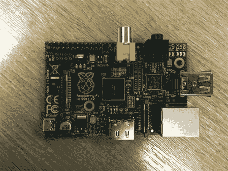

<figcaption class="figleg">Figure 12.1 The RaspberryPi.</figcaption>

</figure>

#### 英特尔 NUC

如果电力是第一位的，那么英特尔 NUC 是目前最突出的技术。NUC 不仅体积小，而且最新版本搭载了英特尔酷睿 i5 CPU。NUC 是作为准系统设备购买的，可以安装内存、固态存储(SSD)和无线网卡。它还配有物理网络端口。多达 16 GB 的内存可以安装在这些微型计算机中，这意味着它们绝对适合这种应用。这也不是开玩笑，当他们被描述为小的时候；它们的尺寸为 4 英寸×4 英寸×2 英寸，当然很容易藏在不太可能被发现的地方。作为 dropbox，它们还有另一个有用的属性，它们带有 VESA 兼容支架。这意味着它们可以安装在热桌的显示器后面，很可能长时间不被注意到，特别是如果 LED 电源灯被绝缘胶带遮住的话。

因为它们运行 mSATA 固态硬盘而不是机械磁盘，这些小计算机在几秒钟内就能启动。

然而，为了这种力量，必须做出一些牺牲。例如，它比 Pi 大，如果需要的话，可能不会靠电池长时间运行。它也没有配备屏幕或任何简单的方法来将屏幕安装到外壳中。然而，这可以通过使用外部监视器或远程同事提供关于何时建立所需连接的信息来管理。这也不是一种廉价的方式来完成这项任务，尽管英特尔赛扬版本的价格更低。虽然它确实符合所有其他的条件，但是从速度和灵活性的角度来看，Pi 就是不能碰它。

NUC 主板可以作为独立产品购买，也可以装入带屏幕的定制外壳中。标准的 NUC 准系统包实际上没有任何多余的空间来放置小工具([图 12.2](#F0015) )。

<figure class="fig">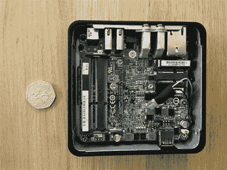

<figcaption class="figleg">Figure 12.2 The Intel Nuc.</figcaption>

</figure>

#### 也是冉

如果器件必须比 Pi 更小，还有其他选择。首先，基于 Android 的迷你 PC，MK802 型设备是一个合理的选择。它们比 USB 记忆棒稍大，装有四核 ARM 处理器和 2 GB 内存！他们当然是小发电站。应该可以让 Kali 的一个 ARM 分支在系统上运行。它们也很便宜，目前大约 60 英镑。当然，它们的微小尺寸意味着会有一些限制。例如，不可能在外壳中安装屏幕，而且他们也没有有线以太网。USB 转以太网转换器可以解决这个问题，但这将增加每个新玩具的设备大小。尽管如此，它最终还是会成为一个强大而小巧的“dropbox”。由于该设备直接插入显示器，因此可能会有替代 dropbox 模式的空间。伪造一个应用程序来获取凭证怎么样？当用户打开显示器时，他们看到的看起来像是他们的域登录屏幕，但实际上是“dropbox”然而，顾问需要在附近，以便能够快速发现问题，因为第一个来看问题的 it 人员可能会闻到老鼠的气味，并把它带走。

另一个即将出现的设备是 http://cubox-i.com 的 CuBox。

这些微小的设备非常符合 Pi 的模式，但将运行四核 CPU 并拥有 2 GB 的 RAM。同样，这些设备是基于 ARM CPU 的，所以将运行大多数 Linux 发行版，只需要一点黑客攻击。它们的尺寸为 2 英寸×2 英寸×2 英寸，配有千兆以太网。同样，任何外围设备或屏幕都无法装入机箱，因此它们必须是外置的。或者，可以 3D 打印定制外壳。CuBox 的性价比也很高，这意味着可以在不花费太多的情况下买到几个。

### 打造自己的“收存箱”

在本节中，将解释使用 512 MB RaspberryPi 创建“收存箱”的过程。出于本例的目的，将使用 Raspbian Linux，但是可以选择任何 ARM 发行版来构建。最初的意图是使用 Kali Linux，但在撰写本文时，还没有任何开箱即用的 I2C 支持。I2C 驱动程序和工具用于控制 LCD，LCD 可用于显示有用的系统信息。例如，它可以用来显示通过 DHCP 接收到的 IP 地址。

需要什么:

RaspberryPi——最好是 512 MB 版本

一张 SD 卡——至少 8 GB，最好是一张又快又好的 sd 卡(例如，Sandisk Extreme 45 MB/S 卡)

电源——Pi 由 USB“移动”电缆供电

将操作系统写入 SD 卡的电脑——如果没有内置读卡器，则需要读卡器

拉斯扁形象——[http://www.raspberrypi.org/downloads](http://www.raspberrypi.org/downloads)

sd 卡的成像工具。(即牛逼的 MAC 版 RPi-SD 卡构建器—[http://all the ware . WordPress . com/2012/12/11/easy-way-SD-card-setup/](http://alltheware.wordpress.com/2012/12/11/easiest-way-sd-card-setup/))

### 安装操作系统

对于以前可能从未使用过 RaspberryPi 的人来说，安装操作系统肯定与标准 PC 有所不同。无论如何，这不仅仅是插上 u 盘启动安装程序的问题。RaspberryPi 使用前面提到的 SD 卡作为操作系统，因此需要一些工具将映像提取到 SD 卡上，并确保它是可引导的。有大量的工具可以使用，这使得整个过程完全没有痛苦，所以不要害怕去买一个 Pi 来修改它。

#### 第 1 部分—下载操作系统

确保获得 Pi 的正确图像非常重要。随着新版本的发布，Pi 的组件发生了变化，导致一些旧发行版无法启动。对此的指示是红色的“电源”灯将亮起,“活动”灯将闪烁一次。Pi 将什么也不做。在撰写本文时，最新的 Raspbian 映像工作得非常好，即使是在最近的 RaspberryPi 硬件上安装的较新的 Hynix 内存也是如此。

去[http://www.raspberrypi.org/downloads](http://www.raspberrypi.org/downloads)下载当前 Pi 版本的 Raspbian。Raspbian 是专为 Pi 构建的轻量级 Debian 版本。

#### 第 2 部分—将操作系统写入卡中

如前所述，SD 卡将需要使用一个专用的应用程序，或者如果命令行倾斜，“dd”来镜像。这个过程在很大程度上是非常安全的，但是如果没有足够的小心和关注，最终可能会擦除错误的磁盘。在这种情况下，测量两次并切割一次是要遵循的方法。

在 OSX 上，使用 RPi-SD 卡构建器，过程如下:

步骤 1:启动 RPi-SD 卡构建器。它将询问 Raspbian.img 文件在哪里。选择它并点击确定([图 12.3](#F0020) )

第二步:如果 SD 卡已插入，选择“继续”。如果没有，请在按“继续”之前连接它。确保 OSX 先安装了设备！

第三步:确保在此窗口中只选择了一个磁盘，并确保它是 SD 卡。在安装 Raspbian 之前，所选磁盘将被擦除。

要了解 SD 卡的安装方式，请按下苹果菜单按钮>“关于本机”>“更多信息”>“系统报告”>“读卡器”。该名称将位于“BSD 名称”值的旁边。

第四步:输入系统密码。然后，它将声明在收到成功消息之前不弹出 SD 卡。

第 5 步:按 Ok，成像过程开始。在菜单栏中可以看到一个旋转的齿轮来指示进度。请随意点击了解更多详情。

第六步:去喝杯咖啡，因为这可能需要一点时间。

步骤 7:出现一条消息，说明该过程已完成，并将 SD 卡插入 Pi。成功！一个可引导的 Raspbian Linux 系统已经创建！

<figure class="fig">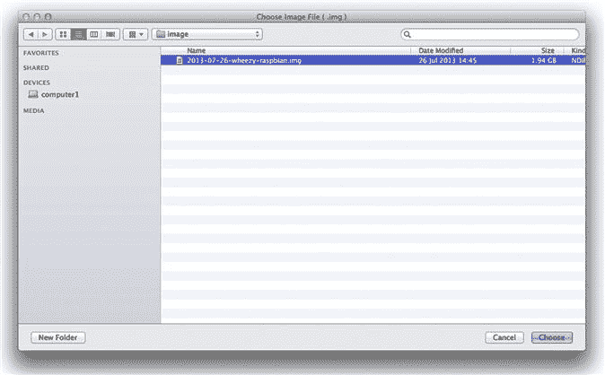

<figcaption class="figleg">Figure 12.3 Selecting the Raspbian image.</figcaption>

</figure>

还有其他方法可以对 SD 卡进行映像，例如，使用命令行工具“dd”来获得相同的结果。然而，使用应用程序意味着减少意外破坏数据的机会。

如果使用 Windows，win32diskimager 是个不错的选择——[http://sourceforge.net/projects/win32diskimager/](http://sourceforge.net/projects/win32diskimager/)。这很简单；将它指向图像，告诉它 SD 卡在哪里，然后等待作业完成。

#### 第 3 部分—安装后任务

有一两件事是完成事情所必需的。首先是操作系统的全面更新。然后根据需要安装任何自定义工具。也强烈建议更改默认密码！

要登录 pi，输入用户名“Pi”和密码“raspberry”

更改密码:

```
root@raspberrypi:~# sudo passwd pi
```

```
Enter new UNIX password:
```

```
Retype new UNIX password:
```

```
passwd: password updated successfully
```

```
root@raspberrypi:~#
```

更新操作系统:

```
root@raspberrypi:~# sudo apt-get update && sudo apt-get upgrade && sudo apt-get dist-upgrade
```

这可能需要一段时间，特别是如果连接不是特别快，可能值得离开并喝杯咖啡，因为这可能是一个漫长的等待！

对于那些想要在无头(没有监视器)配置中运行的人来说，可以 SSH 到 Pi 上。如果使用大于 8 GB 的 SD 卡，还可能需要扩展文件系统。Raspbian 将引导进入一个菜单，允许自动改变分区大小，假设使用了键盘和显示器。如果已经使用 SSH 远程连接到 Pi，那么可以使用 sudo 手动执行脚本。/raspbpi-config ( [图 12.4](#F0025) )。

<figure class="fig">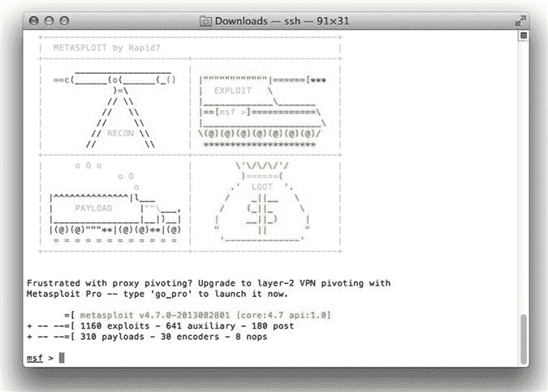

<figcaption class="figleg">Figure 12.4 Up and running.</figcaption>

</figure>

### 给家里打电话

当“收存箱”被留下时，确保可以从远程位置访问它是很重要的。有很多方法可以做到这一点，有些方法比其他方法更好。屡试不爽的方法是创建一个反向 SSH 隧道。换句话说，Pi 将创建一个返回数据中心的 SSH 连接，允许任何流量通过该会话进行路由。

Pi 被设置为拨出的原因是，简单的拨入是行不通的。任何防火墙或路由器不仅会阻止入站访问，而且不会为“dropbox”进行任何网络地址转换。

另一种选择是考虑使用 OpenVPN 来提供远程访问。这将比 SSH 隧道有明显的优势。OpenVPN 将允许所有流量通过虚拟专用网络(VPN)进行路由。在这些情况下，这等同于直接插入网络。OpenVPN 通过安全套接字层(SSL)发送所有流量，这意味着它看起来就像标准的 web 流量。这降低了被监控系统当场抓获的可能性。

我们先来看看反向 SSH。本章稍后将介绍如何设置 OpenVPN。

### 配置 SSH 隧道

在现实世界中，我们需要一个开放 SSH 的面向公众的服务器。Pi 将连接到服务器，允许流量沿着已建立的隧道发送。出于演示的目的，将使用一个 Ubuntu 服务器虚拟机作为 SSH 服务器，但是只要您觉得合适，您选择的任何发行版都可以使用。

首先，客户端和服务器需要配置为接受没有静态密码的连接。为此，使用基于证书的身份验证。但是不要被推迟，这真的很简单。

#### 设置基于证书的身份验证

步骤 1:首先，登录 Pi 并生成一个 Rivest Shamir 和 Adleman (RSA)密钥。确保它以 root 用户身份运行。这可以用命令“id”来检查

```
root@raspberrypi:~# ssh-keygen -t rsa
```

接受默认文件名，不要在出现提示时配置密码。在部署实时设备时，可以对其进行更改以符合任何组织策略。

步骤 2:接下来，将公钥从 Pi 传输到将接受 SSH 连接的服务器。

```
root@raspberrypi:~# ssh-copy-id -i /root/.ssh/id_rsa.pub root@myserver
```

```
root@myserver’s password:
```

假设已经为服务器输入了密码，应该会收到一条成功消息，表明已经添加了密钥。现在应该可以在 Pi 和服务器之间启用 SSH，而不需要输入密码。

```
root@raspberrypi:~# ssh root@192.168.1.156
```

```
The authenticity of host'192.168.1.156 (192.168.1.156)' can't be established.
```

```
ECDSA key fingerprint is f6:ff:45:04:2b:f4:33:42:34:a2:f2:06:78:da:f6:52.
```

```
Are you sure you want to continue connecting (yes/no)? yes
```

```
Warning: Permanently added'192.168.1.156' (ECDSA) to the list of known hosts.
```

```
Welcome to Ubuntu 12.10 (GNU/Linux 3.5.0-17-generic x86_64)
```

```
* Documentation: https://help.ubuntu.com/
```

```
 System information as of Mon Sep 16 22:09:51 BST 2013
```

```
 System load: 0.35   Processes:   79
```

```
 Usage of /: 5.7% of 18.45 GB Users logged in: 1
```

```
 Memory usage: 4%   IP address for eth0: 192.168.1.156
```

```
 Swap usage: 0%
```

```
 Graph this data and manage this system at https://landscape.canonical.com/
```

```
Last login: Mon Sep 16 22:09:06 2013
```

```
root@ubuntusrv:~#
```

通常，这就是启动并运行证书身份验证所需的全部内容。如果连接失败，请检查/ etc /ssh 中的 sshd_config，并查看以下值。

PermitRootLogin:如果您想使用根用户，应该设置为“是”

RSAAuthentication:应设置为“是”

PubkeyAuthentication:应设置为“是”

在为 root 用户设置密码后，默认的 Ubuntu 服务器版本运行良好。您的里程可能会有所不同！检查/var/log 中的日志以发现任何明显的问题总是值得的。此外，可以使用 ssh -vvv root@myserver 从 pi 运行详细的 SSH 连接。这应该有助于任何故障诊断问题。

#### 创建 SSH 反向隧道

这是最酷的部分。我们将告诉 Pi 连接回我们的服务器，在大多数情况下，服务器将位于我们的数据中心。它将建立一个 SSH 连接，并告诉服务器打开一个新端口，比如 TCP/5555。然后可以登录服务器，在端口 5555 上建立到“localhost”的 SSH 连接。然后，这将沿着已经建立的隧道转发回 Pi。此方法绕过任何入站访问控制，因为 Pi 已经建立了出站连接。这仅仅是一个利用它的例子。诚然，这个概念一开始可能会令人困惑，所以让我们配置一下，看看它有多简单。

让我们从在 Pi 上发出的基本命令开始。

```
root@raspberrypi:~# ssh -N -R 5555:localhost:22 root@192.168.1.156
```

让我们把它分解一下。我们已经使用 root 用户创建了一个从 Pi 到服务器 192.168.1.156 的 SSH 会话。它不需要密码，因为我们已经设置了基于证书的认证。-N 命令开关是“不执行远程命令”，因为我们只想转发流量。R 选项告诉服务器打开或绑定一个新端口，在本例中是本地主机上的 5555。

那么这有什么影响呢？简单地说，如果我们登录到我们的服务器，并在端口 5555 上 SSH 到 localhost，我们应该可以找到答案。

```
root@ubuntusrv:~#ssh -l pi -p 5555 localhost
```

```
pi@localhost's password:
```

```
Last login: Tue Sep 17 19:26:23 2013 from localhost
```

```
pi@raspberrypi ~ $
```

成功！所有的入站访问控制都被破坏了，我们现在登录到了一个内部设备上！当然，在现实世界中，事情并不总是那么容易，尤其是在高安全性的环境中。一些显而易见的尝试是将服务器配置为侦听 TCP/443 上的 SSH 连接，从而绕过网络外部的基本防火墙功能。

#### 坚持到底

好了，以上介绍了启动和运行 SSH 会话的基础知识，但是还需要做得更可靠。当会话崩溃时，无法返回并重新启动会话。当它发生时，顾问甚至可能在数百英里之外！

有几个选项可以确保这不会毁了这一天。比如:“autossh。”Autossh 将设置和监控任何 ssh 隧道，并根据需要重新启动它们。这样，无论在哪里插入一个小小的特洛伊木马，它都会放心地呼叫总部，从而能够从远程位置完成测试。

首先在我们的 Pi 上安装 autossh。

```
pi@raspberrypi ~ $ sudo apt-get install autossh
```

接下来，我们需要测试 autossh 是否正常工作，并让它建立一个隧道。让我们从刷新我们对早期反向 SSH 示例的记忆开始，希望您也能使用它！

```
root@raspberrypi:~# ssh -N -R 5555:localhost:22 root@192.168.1.156
```

请记住，这不需要密码，因为我们之前设置了基于证书的身份验证。现在，让我们来看看如何设置一个相同的会话，但使用 autossh。

```
pi@raspberrypi ~ autossh -M 13000 -f -N -R 5555:localhost:22 root@192.168.1.156
```

仅此而已！这里发生了什么事？autossh 被指示使用端口 13000 监控其 ssh 连接。可以为此任务选择任何端口，这与功能无关。暂时选个高港就好了。-f 命令开关在后台运行 autossh。该命令的其余部分是原始反向 SSH 命令的对等副本。出乎意料的容易不是吗？让我们为可靠性增加一些额外的东西。

```
pi@raspberrypi ~ autossh -M 13000 -o "ServerAliveInterval 60" -o "ServerAliveCountMax 3" -f -N -R 5555:localhost:22 root@192.168.1.156
```

好了，现在还有一项任务，那就是确保在引导时建立隧道。毕竟订婚的时候最好避免配置这个东西不是吗？最完美的方法是插上电源，然后走开，对吗？

几乎可以肯定的是，每个不同的人都会有不同的方式来做这件事，所以选择最适合的方式。例如:通过在“exit 0”行之前添加命令来编辑/etc/rc.local 文件。文件的结尾应该是这样的。

```
# autossh tunnel at boot
```

```
autossh -M 13000 -o "ServerAliveInterval 60" -o "ServerAliveCountMax 3" -f -N -R 5555:localhost:22 root@192.168.1.156
```

```
exit 0
```

现在已经创建了一个可以插入目标网络的设备。它会在启动时自动建立一个反向 SSH 隧道，并监控它的问题。它还会重建任何失败的 SSH 隧道！但是，如果设备没有出站 SSH 访问，或者所有出站访问都被代理过滤了，该怎么办呢？给这个小盒子增加 3G/4G 支持怎么样？

### 添加 3G/4G 支持

部署这种类型的设备的风险是，它将无法进行未经过滤的出站访问，并且没有足够的时间来解决原因。在这些情况下，唯一真正的选择是部署一个带有“dropbox”的蜂窝数据加密狗，并让它呼叫总部，以便可以远程进行其余的测试。当然，可靠地处理这些连接是至关重要的，这也将包括在内。

#### 选择加密狗

相信我，这是一个雷区！我成功地使用了华为 E160 USB 棒型加密狗和三张英国 SIM 卡。这种组合似乎工作可靠。通过验证的 3G 加密狗列表可以在:[http://elinux.org/RPi_VerifiedPeripherals#USB_3G_Dongles](http://elinux.org/RPi_VerifiedPeripherals#USB_3G_Dongles)找到。

需要特别注意的一点是用电。使用 USB 电源运行 Pi 和 3G 加密狗并不总能解决问题，所以为什么不考虑使用带电源的 USB 集线器来确保可靠性呢？

我肯定会推荐你试试你身边的任何一个，你可能会很幸运。如果没有，你可以在易贝和亚马逊上花相对较少的钱买到 E160s。E160 的一个优点是它有一个外部天线插座。这可以提高低信号区域的连接可靠性。

确保加密狗已解锁，可用于所选的 SIM 卡。

#### 设置手机网络连接

将使用两个应用程序来实现这一点。第一个叫做“Sakis3g”，这是一个用于连接 3g 网络的 Linux 工具集。Sakis3g 可以在:[http://www.sakis3g.org](http://www.sakis3g.org)找到。这个网站最近一直是不完整的，所以可能需要寻找该软件的替代下载位置。试试在 SourceForge[http://downloads . SourceForge . net/project/vim-n4n 0/sakis 3g . tar . gz](http://downloads.sourceforge.net/project/vim-n4n0/sakis3g.tar.gz)的那个或者用途回机[http://web.archive.org/web/*/http://www.sakis3g.org/](http://web.archive.org/web/*/http://www.sakis3g.org/)的。

我们还将使用“umtskeeper”—[http://mintakaconciencia.net/squares/umtskeeper/](http://mintakaconciencia.net/squares/umtskeeper/)。这个应用程序基本上使用 Sakis3g 脚本来建立实际的连接，然后确保它们是可靠的。与 autossh 脚本非常相似，umtskeeper 将根据需要重新启动数据连接。

首先要做的是检查 3G 连接是否可以实现。Sakis3g 可用于此任务。Sakis 是一个非常简单易用的应用程序，它都是菜单驱动的，所以应该很容易上手。提取之后你需要做的就是运行 sudo。/sakis 3g—互动。

您将看到如图[图 12.5](#F0030) 所示的菜单。

<figure class="fig">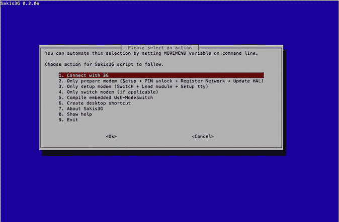

<figcaption class="figleg">Figure 12.5 Sakis3G menu.</figcaption>

</figure>

假设硬件兼容，SIM 卡可以在加密狗中工作，那么真正需要做的就是选择“连接 3G”偶尔可能需要选择选项 2 " *仅准备调制解调器*...。”一旦这个过程完成，它又回到选项 1。Sakis 将确认连接是否成功。你可以通过运行 ifconfig 来确认这一点，它现在应该显示一个 ppp 接口。尝试 ping 8.8.8.8(谷歌 DNS)来确认出站访问。

#### 坚持到底

现在已经确认了加密狗、SIM 和 Sakis 工作正常，让我们配置“umtskeeper”来处理这些事情。这将比单独使用 Sakis 稍微复杂一些，但至少它将减少不断返回以便再次建立连接的需要。

首先，在 Pi 上提取“umtskeeper”后，将 sakis3g 可执行文件复制到同一个文件夹中。这是为了让“umtskeeper”知道在哪里可以很容易地找到它。从这里开始就是命令行的事情了。让我们来看看在三个英国的网络上使用的命令。

```
pi@raspberrypi ~ $ sudo ./umtskeeper --sakisoperators "USBINTERFACE='0' OTHER='USBMODEM' USBMODEM='12d1:1003' APN='three.co.uk' APN_USER='' APN_PASS="""
```

三个英国网络不需要 APN 用户名或密码，因此这些值都是空白的。必须与蜂窝数据提供商进行核对，以确认每个设置应该是什么。可以从蜂窝提供商(在这种情况下是 three.co.uk)获得 APN。插入加密狗后，在 Pi 上运行 lsusb 可以找到 USBMODEM 值。下面是一个输出示例:

```
pi@raspberrypi ~ $ lsusb
```

```
Bus 001 Device 002: ID 0424:9512 Standard Microsystems Corp.
```

```
Bus 001 Device 001: ID 1d6b:0002 Linux Foundation 2.0 root hub
```

```
Bus 001 Device 003: ID 0424:ec00 Standard Microsystems Corp.
```

```
Bus 001 Device 004: ID 12d1:1003 Huawei Technologies Co., Ltd. E220 HSDPA Modem / E230/E270/E870 HSDPA/HSUPA Modem
```

如您所见，输出中的 ID 值是我们在 umtskeeper 字符串的 USBMODEM 值中使用的值。让我们运行这个命令，看看会发生什么。

```
pi@raspberrypi ~ $ sudo /home/pi/umtskeeper/umtskeeper --sakisoperators "USBINTERFACE='0' OTHER='USBMODEM' USBMODEM='12d1:1003' APN='three.co.uk' APN_USER='' APN_PASS=""" &
```

```
[1] 3692
```

```
pi@raspberrypi ~ $ ---
```

```
2013-09-19 21:04:05 Start: PID = 3693
```

```
2013-09-19 21:04:05 Sending SIGTERM signal to running program instance with PID=400.
```

```
2013-09-19 21:04:05 stats period = 8 s, connection check period = 32 s
```

```
 Internet status:
```

```
 Network link status on ppp0: unknown
```

```
 Cell network: Connected.
```

```
2013-09-19 21:04:15 Internet connection is DOWN. Calling Sakis3G connect...
```

```
 Sakis3G cmdLine: nice /home/pi/umtskeeper/sakis3g connect USBINTERFACE='0' OTHER='USBMODEM' USBMODEM='12d1:1003' APN='three.co.uk' APN_USER='' APN_PASS=
```

```
 Sakis3G says...
```

```
 E160 connected to 3 (23420).
```

```
2013-09-19 21:04:25 Testing connection...
```

```
2013-09-19 21:04:34 Success... we are online!
```

```
pi@raspberrypi ~ $ ifconfig ppp0
```

```
ppp0  Link encap:Point-to-Point Protocol
```

```
   inet addr:10.128.9.181 P-t-P:10.64.64.64 Mask:255.255.255.255
```

```
   UP POINTOPOINT RUNNING NOARP MULTICAST MTU:1500 Metric:1
```

```
   RX packets:97 errors:0 dropped:0 overruns:0 frame:0
```

```
   TX packets:130 errors:0 dropped:0 overruns:0 carrier:0
```

```
   collisions:0 txqueuelen:3
```

```
   RX bytes:12363 (12.0 KiB) TX bytes:16949 (16.5 KiB)
```

成功了。我们现在有一个实时的 3G 连接供我们的 Pi 玩。至少我希望你也是。如果不起作用，请尝试验证您的手机网络提供商设置是否正确。那里有很多帮助论坛，应该可以给你指出正确的方向。

就这样吗？不完全是。现在，重要的是要确保这个连接在启动时启动并保持运行。同样，将该命令添加到/etc/rc.local 文件中，以便 3G 连接在引导时启动。以下是我补充的。

```
/home/pi/umtskeeper --sakisoperators "USBINTERFACE='0' OTHER='USBMODEM' USBMODEM='12d1:1003' APN='three.co.uk' SIM_PIN='1234' APN_USER='0' APN_PASS='0'" --sakisswitches "--sudo --console" --devicename'Huawei' --log --silent --monthstart 8 --nat'no' &
```

启动后可能需要一点时间来启动界面，但它确实工作，而且非常可靠。这是显而易见的，通过将 LCD 屏幕连接到 Pi 来显示 eth0 接口以及 ppp0/3G 接口的 IP 地址。这将在本章后面讨论其他有用的硬件时详细讨论。

这是我们目前所掌握的情况的总结。

运行当前 Linux 发行版的“dropbox”

在使用基于证书的认证启动时，自动建立并维护反向 SSH 隧道

开机时自动建立并保持 3G 数据连接

现在，小 dropbox 可以提供一个进入客户网络的起点，让我们看看如何安装一些有用的工具来使它变得更好。

### 安装有用的工具

为“dropbox”选择一个工具集肯定要取决于个人偏好；然而，有一些大多数人都想安装的常用工具。每个工具都可以根据需要手动安装，或者可以考虑看看优秀的“Raspberry Pwn”项目，该项目由 Pwnie Express 的人员维护。

该脚本将下载并安装许多常见的渗透测试工具，这些工具提供了一个很好的构建平台。

树莓 Pwn 文件可以从:[https://github.com/pwnieexpress/Raspberry-Pwn](https://github.com/pwnieexpress/Raspberry-Pwn)下载。注意，并不是所有的工具都适用于 Raspbian，所以可能需要根据特定的需求进行一些调整。

#### 安装 Raspberry Pwn

首先在 Pi 上安装 git，然后克隆 Pwnie Express 文件。

```
pi@raspberrypi ~ $ sudo apt-get install git
```

```
pi@raspberrypi ~ $ git clonehttps://github.com/pwnieexpress/Raspberry-Pwn.git
```

```
At this point, try changing into the Raspberry-Pwn directory with cd Raspberry-Pwn and run the installation script.
```

```
pi@raspberrypi ~/Raspberry-Pwn $ sudo./INSTALL_raspberry_pwn.sh
```

```
   === Raspberry Pwn Release 0.2 ===
```

```
 A Raspberry Pi Pentesting suite by PwnieExpress.com
```

```
----------------------------------------------------------------
```

```
 This installer will load a comprehensive security pentesting software suite onto your Raspberry Pi. Note that the Debian Raspberry Pi distribution must be installed onto the SD card before proceeding. See README.txt for more information.
```

```
Press ENTER to continue, CTRL+C to abort.
```

最终，应该会看到类似这样的消息:

```
[+] Exploit-DB installed in /pentest.
```

```
[+] Setting default RAM allocation (disabled!)
```

```
[!] If your RPi board only has 256 MB ram please set split to
```

```
 224/32 using raspi-config.
```

```
---------------------------------------------------------------
```

```
Raspberry Pwn Release 0.2 installed successfully!
```

```
---------------------------------------------------------------
```

```
[+] In order for the new RAM allocation to take effect, we must
```

```
[+] now reboot the pi. Press [Ctrl-C] to exit without rebooting.
```

重启 Pi 后，应该会有一个闪亮的新的“pentest”目录，里面充满了工具来帮助任何进一步的工作([图 12.6](#F0035) )！

<figure class="fig">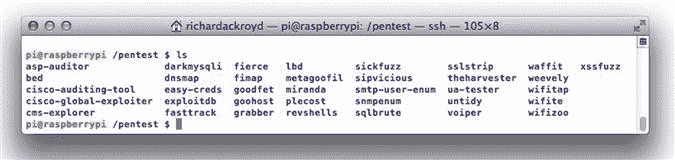

<figcaption class="figleg">Figure 12.6 Raspberry Pwn pentest directory.</figcaption>

</figure>

### 屏幕、无线和其他硬件

RaspberryPi 有很多附件，可以让你的生活变得更轻松，或者扩展你的 dropbox 的功能。我们之前讨论的事情之一是一眼就能看到我们的 dropbox 连接到网络的能力。显然，Pi 上的指示灯会告诉我们它有一个物理连接，甚至它协商了什么速度，但我们需要知道它有一个 IP 地址，对吗？为此，你可以选择小型彩色 TFT 屏幕，也可以选择 16×2 字符的 LCD。如果使用彩色屏幕，IP 地址将在引导时显示，因为该功能包含在/etc/rc.local 启动脚本中。为了满足我的特殊需求，我选择了 16×2 的液晶显示器。

为什么不考虑添加一个无线适配器来实现握手捕获或充当流氓接入点。此外，Pi 将需要一个案例，或者几个案例，以适应任何给定的场景。

#### 阿达果派盘—[http://www.adafruit.com/products/1110](http://www.adafruit.com/products/1110)

虽然深入研究将这个工具包焊接在一起的细节已经超出了本书的范围，但是还是有必要简要了解一下它是如何工作的。

该套件基本上是一套组件，你将不得不自己焊接。不要让这让你分心，尽管这个过程非常简单，甚至适合初学者。然而，你需要一只相当稳定的手！Adafruit 在这里有一个组装 Pi 板的分步指南:[http://learn.adafruit.com/](http://learn.adafruit.com/)ada fruit-16×2-character-LCD-plus-keypad-for-raspberry-Pi/assembly。

有什么更好的方式来介绍自己焊接？你可以在网上买到相当便宜的套件，其中包括所有必要的零件。我得到了一个体面的烙铁，焊料，立场，备用尖端，焊料吸盘，和一套帮助的手。没有什么比构建这样的东西，然后看到它输出您选择筛选的信息更好的了。只是给你一个最后的推动，我从来没有焊接之前，建立这个板，并管理得很好。慢慢来，看几本焊接指南，慢慢走。

[图 12.7](#F0040) 显示了未组装状态下的套件。

<figure class="fig">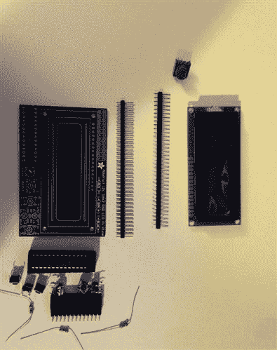

<figcaption class="figleg">Figure 12.7 AdaFruit Pi Plate kit.</figcaption>

</figure>

组装后，Pi 板插入主板上的通用输入/输出(GPIO)接头。因为它不是直接焊接到 Pi 上，所以对于不需要屏幕的项目，它可以被移除，例如，如果您需要将它放入一个较小的外壳中([图 12.8](#F0045) )。

<figure class="fig">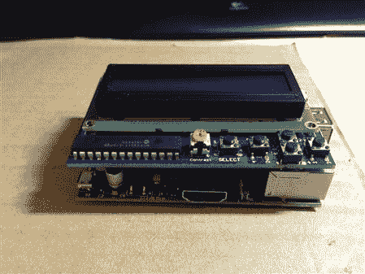

<figcaption class="figleg">Figure 12.8 Assembled Pi and Pi Plate.</figcaption>

</figure>

硬件使用 Python 来控制显示的内容。Adafruit 提供了许多示例脚本，可以适应多种用途。例如，他们提供了一个 IP 时钟脚本，毫不奇怪地在一行显示 IP 地址，在另一行显示时间。此脚本被修改为在一行显示以太网接口的 IP 地址，在另一行显示 3G PPP 接口的 IP 地址。这样，很明显，当它插入时，它与两个网络都有连接，使顾问能够离开。

代码包含在下面:

```
#!/usr/bin/python
```

```
from Adafruit_CharLCDPlate import Adafruit_CharLCDPlate
```

```
from subprocess import *
```

```
from time import sleep, strftime
```

```
lcd = Adafruit_CharLCDPlate()
```

```
cmd = "ip addr show eth0 | grep inet | awk'{print $2}' | cut -d/ -f1"
```

```
cmd2 = "ip addr show ppp0 | grep inet | awk'{print $2}' | cut -d/ -f1"
```

```
lcd.begin(16,1)
```

```
def run_cmd(cmd):
```

```
  p = Popen(cmd, shell=True, stdout=PIPE)
```

```
  output = p.communicate()[0]
```

```
  return output
```

```
while 1:
```

```
  lcd.clear()
```

```
  ipaddr = run_cmd(cmd)
```

```
  ipaddr2 = run_cmd(cmd2)
```

```
  lcd.message(ipaddr2)
```

```
  lcd.message(ipaddr)
```

```
  sleep(1)
```

它在我们的硬件上运行时应该是什么样子在[图 12.9](#F0050) 中。

<figure class="fig">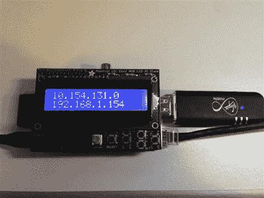

<figcaption class="figleg">Figure 12.9 Fully functional display showing IP addresses.</figcaption>

</figure>

显示屏每秒刷新一次，如 sleep(1)行所示。您可以根据自己的需要进行更改。如果您拔下以太网接口或 3G 加密狗，显示器将停止显示相关的 IP 地址。然而，它可能需要 10 秒左右才能赶上。

从脚本中可以看出，您可以传递任何命令行字符串并显示结果。在这方面，你只受到你的想象力的限制。

有几个项目与这些显示器的使用有关，比我简单的黑客工作要高级得多。我建议查看“RoguePi”项目，网址为[http://crushbeercrushcode . org/2013/03/developing-the-rogue-pi/](http://crushbeercrushcode.org/2013/03/developing-the-rogue-pi/)

负责该项目的 Kalen Wessel 在他的项目中使用了 RGB Pi 板。它会根据环境改变颜色。例如，它会在启动时运行连接检查，导致出现绿色屏幕和成功消息。如果其中一项测试失败，屏幕就会变红。非常光滑的东西！他友好地包含了用于完成所有这些的 Python 代码，这在我看来是必读之作！一定要买 RGB 版本的 Adafruit Pi 板来使用他的脚本！

#### 无线软件狗

添加无线接口可以灵活地执行更多攻击。首先，它可能被用来捕获握手数据包，连接到公司无线网络，或托管一个流氓接入点。此外，为什么不尝试在失去其他连接模式的情况下，将它作为连接回“dropbox”的一种方式。

在硬件方面，Alfa 加密狗通常是一个安全的赌注，但是，值得注意的是，旧版本(如值得信赖的 Alfa AWUS036H)不支持 Wireless-N。这里只是提醒一下，Pi 可能不会太喜欢自己给自己和无线加密狗供电。对所有外围设备使用电源集线器。

更有可能的是，人们强烈希望在码头上安装空调套件。由于与 iw 的冲突，它将无法从存储库中获得，因此需要从源代码中构建。幸运的是，这并不复杂。

首先检查是否安装了最新版本的“build-essential”和“libssl-dev ”,然后开始下载 Aircrack-ng 包。

```
pi@raspberrypi ~ $ sudo apt-get install build-essential
```

```
pi@raspberrypi ~ $ sudo apt-get install libssl-dev
```

```
pi@raspberrypi ~ $ mkdir aircrack
```

```
pi@raspberrypi ~ $ cd aircrack
```

```
pi@raspberrypi ~ $ wget http://download.aircrack-ng.org/aircrack-ng-1.2-beta1.tar.gz
```

```
pi@raspberrypi ~/aircrack $ tar -zxvf aircrack-ng-1.2-beta1.tar.gz
```

现在是构建工具的时候了。其中一些步骤需要花费一些时间！

```
pi@raspberrypi ~/aircrack $ cd aircrack-ng-1.2-beta1/
```

```
pi@raspberrypi ~/aircrack/aircrack-ng-1.2-beta1 $ make
```

```
pi@raspberrypi ~/aircrack/aircrack-ng-1.2-beta1 $ sudo make install
```

```
pi@raspberrypi ~/aircrack/aircrack-ng-1.2-beta1 $ sudo apt-get install iw
```

```
pi@raspberrypi ~ $ sudo airodump-ng-oui-update
```

现在让我们插上加密狗，启动 Airodump，看看是否一切正常！

```
pi@raspberrypi ~ $ sudo airmon-ng start wlan0
```

```
Interface Chipset   Driver
```

```
wlan0   Atheros AR9271  ath9k - [phy0]
```

```
   (monitor mode enabled on mon0)
```

```
pi@raspberrypi ~ $ sudo airodump-ng -w /home/pi/wirelesscap mon0
```

```
CH 1 ][ Elapsed: 32 s ][ 2013-09-21 12:02
```

```
 BSSID   PWR Beacons #Data, #/s CH MB ENC CIPHER AUTH ESSID
```

```
 12:FE:F4:07:A1:E8 -61  60  0 0 6 54e. OPN   BTWiFi-with-FON
```

```
 02:FE:F4:07:A1:E8 -61  68  0 0 6 54e. OPN   BTWiFi
```

```
 6 A:C6:1 F:E8:84:2D −70  125  0 0 1 54e OPN   BTWiFi-with-FON
```

```
 10:C6:1 F:E8:84:2B −69  164  8 0 1 54e WPA2 CCMP PSK BTHub3-P3HP
```

```
 6 A:C6:1 F:E8:84:2C −67  168  0 0 1 54e OPN   BTWiFi
```

```
  BSSID   STATION   PWR Rate Lost Frames Probe
```

```
  00:FE:F4:07:A1:E8 B8:8D:12:3A:75:00 -60 0 - 1  0  19
```

这里的选择可以是坚持这种攻击，试图捕获和破解握手，或者尝试建立一个流氓 AP。对于这种攻击媒介，首选是在“dropbox”旁边部署一个无线菠萝。如果需要，这可以将互联网流量路由到 Pi 并从其 3G 接口流出。

#### 为你的收纳箱选择一个箱子

对于“dropbox ”,有大量的潜在案例可供选择，但哪一个最适合我们的特定任务呢？这取决于 Pi 部署了多少附加组件。如果它是通过屏幕、无线和 3G 加密狗发送出去的，它就不符合任何标准。在这种情况下，为什么不试试小鹈鹕硬情况下，像 1050？这种情况下是足够大，以适应 Pi 和一些额外的东西没有任何问题。然而，它需要一些修改，以便使电源和网络电缆接入。这不是最小的箱子，但它仍然可以很容易地隐藏在桌子或地板下，不会有任何问题([图 12.10](#F0055) )。

<figure class="fig">

<figcaption class="figleg">Figure 12.10 Pelican and standard Pi cases.</figcaption>

</figure>

还有更多不连续的箱子类型，那些被设计成隐藏在显眼处的箱子，如 http://www.okw.co.uk/products/okw/plug.htm 的 OKW 的插头箱系列，经过一些修改就可以使用。然而，这些修改可能相当广泛。首先，S-Video 连接器需要从 Pi 上移除，USB 端口也需要重新定位。这种并不是前所未有的，虽然，事实上有些人已经用 USB 头取代了当前的 USB 端口，然后将内部供电的 USB 集线器连接到它。奥利弗·詹金斯(Oliver Jenkins)就是这样一个人，进一步的信息可以从这里收集:[http://www . Oliver Jenkins . com/blog/2012/6/changing-USB-socket-on-raspberry-pi](http://www.oliverjenkins.com/blog/2012/6/changing-usb-socket-on-raspberry-pi)。

无论如何，这不是为心脏虚弱的人准备的，你可以和任何保修说再见了，至少！我认为这是我疯狂的一天要做的事情清单中的一个想法([图 12.11](#F0060) 和 [12.12](#F0065) )。

<figure class="fig">

<figcaption class="figleg">Figure 12.11 OKW case.</figcaption>

</figure>

<figure class="fig">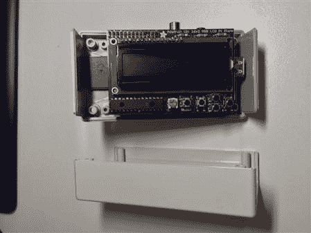

<figcaption class="figleg">Figure 12.12 OKW case with Pi.</figcaption>

</figure>

不过，还有其他选择。人们已经将这些“dropboxes”制成了笔记本电脑电源砖、八路电源、开关、接入点和一系列其他回收箱。一个很好的想法是将其构建到桌面交换机中，并将以太网端口直接连接到 Pi，但这是另一本书的主题。

### 将 OpenVPN 添加到我们的后门

这在前面的章节中简单地提到了 OpenVPN。这个想法相当简单。与其仅仅依靠反向 SSH 连接，为什么不建立一个完整的 VPN，允许我们不受限制地访问目标网络？实际上，这就像坐在办公室里，用有线连接到局域网。这肯定会比 SSH 隧道灵活得多！更重要的是，这也可以在我们的 3G 连接上工作！3G 和 4G 加密狗是高带宽设备，所以不应该被忽视。

在我们的场景中，RaspberryPi 将成为 OpenVPN 客户端。它将与我们数据中心的服务器建立 VPN 连接。如果我们使用目标的互联网连接，这可以帮助我们绕过任何访问限制，如入站防火墙规则。我们将能够配置 VPN，允许我们通过隧道将流量路由到目标网络。为了简单起见，我将使用一个运行 Ubuntu Server 的虚拟机来模拟连接的数据中心端。我建议你按照这个过程，自己构建它。

#### 安装 OpenVPN 并生成证书和密钥

让我们首先在我们的服务器上设置 OpenVPN。这是一个非常简单的操作；我们只需要小心地按照步骤来避免任何错误。

```
root@ubuntusrv:~# sudo apt-get install openvpn
```

是的，这就是建造它所需要的一切。接下来是服务器的配置，从复制几个文件开始。

```
root@ubuntusrv:~# cp -R /usr/share/doc/openvpn/examples/easy-rsa /etc/openvpn
```

```
root@ubuntusrv:~# cd /etc/openvpn/easy-rsa/2.0
```

我们现在需要编辑“vars”文件来满足我们的需要。您正在寻找将被添加到我们将生成的证书中的值。例如:“export KEY_COUNTRY="US”。"

老实说，出于我们的目的，这些值可以设置为任何值。使用您选择的文本编辑器来编辑这些值。

然后，我们需要运行几个脚本来让事情运转起来。是的，下面的第一行是“点空格点斜线”

```
root@ubuntusrv:/etc/openvpn/easy-rsa/2.0#. ./vars
```

```
root@ubuntusrv:/etc/openvpn/easy-rsa/2.0#./clean-all
```

```
root@ubuntusrv:/etc/openvpn/easy-rsa/2.0#./build-ca
```

```
Generating a 1024 bit RSA private key
```

```
................................................................................++++++
```

```
...........++++++
```

```
writing new private key to'ca.key'
```

```
-----
```

```
You are about to be asked to enter information that will be incorporated
```

```
into your certificate request.
```

```
What you are about to enter is what is called a Distinguished Name or a DN.
```

```
There are quite a few fields but you can leave some blank
```

```
For some fields there will be a default value,
```

```
If you enter'.', the field will be left blank.
```

```
-----
```

```
Country Name (2 letter code) [UK]:
```

```
State or Province Name (full name) [UK]:
```

```
Locality Name (eg, city) [Leeds]:
```

```
Organization Name (eg, company) [hackjobinc]:
```

```
Organizational Unit Name (eg, section) []:
```

```
Common Name (eg, your name or your server's hostname) [hackjobinc CA]:
```

```
Name []:server
```

```
Email Address [me@myhost.mydomain]:
```

```
root@ubuntusrv:/etc/openvpn/easy-rsa/2.0#
```

您将被要求根据输出配置几个选项，但我们已经将它们添加到“vars”文件中，因此只需点击“enter”即可保留每个值。正如我已经提到的，如果你愿意，你可以保留默认的发货方式。

需要执行的下一个脚本:

```
root@ubuntusrv:/etc/openvpn/easy-rsa/2.0#./build-key-server server #Answer ‘Y’ when asked to sign the certificate and then again when asked to commit.
```

```
root@ubuntusrv:/etc/openvpn/easy-rsa/2.0#./build-key client   #This generates a client certificate
```

```
root@ubuntusrv:/etc/openvpn/easy-rsa/2.0#./build-dh   #Diffie Helman Setup
```

我们现在需要将生成的密钥和证书移动到正确的目录中。

```
cd /etc/openvpn/easy-rsa/2.0/keys
```

```
cp ca.crt ca.key dh1024.pem server.crt server.key /etc/openvpn
```

#### 配置 OpenVPN

幸运的是，这一步非常简单。OpenVPN 附带示例配置，可以根据我们的设置进行编辑。令人欣慰的是，要让事情运转起来，没有太多的改变。让我们从将示例配置复制到正确的位置开始。

```
cp /usr/share/doc/openvpn/examples/sample-config-files/server.conf.gz /etc/openvpn
```

```
gunzip /etc/openvpn/server.conf.gz
```

我们现在需要编辑 server.conf 文件，并确保证书和密钥文件的位置被正确地设置为/etc/openvpn/keys。使用 nano 打开/etc/openvpn/server . conf—sudo nano/etc/openvpn/server . conf

查找引用 ca.crt、server.crt 和 server.key 的部分。确保将其设置为/etc/openvpn/ca . CRT/etc/openvpn/server . CRT 和/etc/openvpn/server.key。

在这一点上，这是所有需要做的，在服务器端。真的没什么创伤。特别是，考虑到隧道将在启动时自动启动。

现在，移动到客户端，在本例中是 RaspberryPi dropbox。

#### 配置客户端

构建客户端的过程极其相似。首先安装 OpenVPN，并将客户端证书从服务器复制到 Pi。然后，我们将修改客户端示例配置，以满足我们的需求。此时，重启 OpenVPN demon 应该会打开隧道。我们开始吧！

如果 Pi 上的 root 帐户尚未启用，则需要立即启用。只需输入 passwd root 并输入新的 root 密码即可。

安装 OpenVPN— sudo apt-get 安装 openvpn

接下来，重新登录到服务器，将证书文件安全复制(SCP)到 Pi

```
root@ubuntusrv:/# cd /etc/openvpn/easy-rsa/2.0/keys
```

```
root@ubuntusrv:/# scp piclient.key piclient.crt ca.crt ca.key root@192.168.1.154:/etc/openvpn
```

您应该看到传输成功！如果没有，试着找出原因，因为没有他们这是行不通的。

现在回到 Pi，复制 OpenVPN 附带的示例配置。

```
pi@raspberrypi ~ $ sudo cp /usr/share/doc/openvpn/examples/sample-config-files/client.conf /etc/openvpn
```

接下来，编辑文件以匹配我们的环境—sudo nano/etc/openvpn/client . conf，找到字符串“remote my-server-1 1194”将“我的服务器”更改为服务器的 IP 地址。默认情况下，端口是用户数据报协议(UDP)/1194，但是可以选择任何端口。如果 VPN 需要通过客户的基础设施，TCP/443 可能是一个不错的选择。在这种情况下，将在 3G 上建立隧道，这应该没有任何限制。

与之前编辑的 server.conf 非常相似，确保在 client.conf 中正确引用客户端密钥和证书非常重要。同样，每个文件都被复制到/etc/openvpn，因此请确保配置文件反映了这一点。

现在需要做的就是在连接的每一端重启 OpenVPN demon，从服务器sudo/etc/init . d/OpenVPN restart 开始。

此时，隧道应该已经建立。通过运行“ifconfig”和“route -n”来验证这一点。应该有一个“tun0”接口和几个使用它作为跳的路由。

连接的每一端通常都有一个 10.8.0.x 地址。试着运行 NMAP 来弄清楚远端(Pi)给了自己什么地址— Nmap -sn 10.8.0.0/24。

例如，在此设置中，Pi 获得了 10.8.0.6。使用 SSH 或任何常用工具，也可以通过这个地址直接与 Pi 通信。所有这些流量都是通过 VPN 发送的！

这还没有完全完成，仍然需要对路由进行一点黑客攻击，以确保可以访问整个目标网络。

#### 路由问题以及如何克服这些问题

目前，不可能从 OpenVPN 服务器 ping 到 Pi 的本地网络。这有两个原因。首先，需要对 OpenVPN 进行配置，以便沿 VPN 隧道路由 LAN 流量。其次，目标网络中的设备没有返回到 10.8.0.0/24 网络的返回路由，当然在任何情况下都不会通过该 Pi。显然，我们无法修改目标网络的路由表，也不想这样做。然而，除此之外还有一种选择。我们可以将所有流量隐藏在 Pi dropbox 的局域网 IP 地址后面。因为 Pi 插入到目标网络中，所以该网络中的所有主机都能够与之通信。这与某人通过将所有家用电脑隐藏在路由器拥有的单一公共 IP 地址后面来配置家用宽带路由器没有什么不同。在我们的例子中，我们将把客户的 10.8.0.0/24 网络转换为 192.168.1.x 网络。

在 Pi“收存箱”上配置以下内容

```
sudo -i
```

```
iptables -F; iptables -t nat -F; iptables -t mangle -F
```

```
iptables -t nat -A POSTROUTING -o eth0 -j SNAT --to 192.168.1.154   #192.168.1.154 is the address of the eth0 interface of our Pi which is on the client network
```

```
echo 1 > /proc/sys/net/ipv4/ip_forward   #Allows the Pi to route traffic in and out, basically turning it into a router.
```

这应该在连接的 Pi 端处理路由。现在将 OpenVPN 配置为通过 VPN 隧道将流量发送到 192.168.1.0/24。

我们将只在 OpenVPN 服务器上进行配置。

首先我们需要再次编辑 server.conf，nano/etc/openvpn/server . conf .

找到显示“client-config-dir ccd”的行，并删除注释该行的分号。

在线的正下方，添加一条路由到我们的 192.168.1.0 255.255.255.0 网络。

```
route 192.168.1.0 255.255.255.0
```

保存文件。

现在创建“ccd”目录，并在其中放置一个配置文件。

```
mkdir /etc/openvpn/ccd
```

我们将创建的配置文件需要与客户机同名。在我们的例子中，我们称之为“client”——这是我们在生成证书时选择的！

```
cd /etc/openvpn/ccd
```

```
nano client
```

然后在客户端文件中添加一个路由。

```
iroute 192.168.1.0 255.255.255.0
```

route 命令与前面使用的命令略有不同；不要混淆这两者，否则这是行不通的！不要忘记保存文件。我们所需要做的就是重启我们的 OpenVPN 服务器，然后我们就可以开始工作了！

```
/etc/init.d/openvpn restart
```

```
root@ubuntusrv:~# route -n
```

```
Kernel IP routing table
```

```
Destination  Gateway   Genmask   Flags Metric Ref Use Iface
```

```
0.0.0.0   192.168.1.254 0.0.0.0   UG 0   0   0 eth0
```

```
10.8.0.0  10.8.0.2  255.255.255.0 UG 0  0  0 tun0
```

```
10.8.0.2  0.0.0.0  255.255.255.255 UH 0  0  0 tun0
```

```
172.16.0.0  0.0.0.0  255.255.0.0 U 0  0  0 eth1
```

```
192.168.1.0 10.8.0.2  255.255.255.0 UGH 0  0  0 tun0
```

如您所见，我们现在有了一条到 192.168.1.0/24 网络的路由，使用的是我们的 VPN 接口 tun0！这个网络的网关是 10.8.0.2，属于我们的 RaspberryPi。现在，您应该能够从您的 OpenVPN 服务器访问该网络中的任何内容。对于您希望访问的任何其他目标网络，您需要重复添加路由。除了带宽之外，你的接入和你自己插上电源没有什么不同。这在我们的 3G 连接上也足够了，尽管一旦我控制了 Pi，我会尝试在客户端的连接上建立第二个隧道。

不要忘记，你可以允许你的 OpenVPN 服务器使用echo 1>/proc/sys/net/IP v4/IP _ forward语句来路由流量。然后，您可以将服务器用作目标网络的网关，这样多个工程师就可以访问这个范围。或者，您可以在每个顾问的机器上安装 OpenVPN 客户端，并以这种方式到达目标。世界是你的！

### 备选收纳箱

当考虑在敌后留下什么时，还有其他的选择。它不一定必须是某种类型的计算机；它可以只是一个能够连接到目标网络的设备。让我们看看一些选项来充实这个概念。

#### 3G 和 IP KVMs

最近发生的两起引人注目的违规事件凸显了使用支持 3G 的 KVM(键盘、视频和鼠标)进行远程入侵的问题。KVM 系统旨在提供对系统的控制台级访问。本质上，这就像坐在显示器和键盘前。可以重新启动系统并进入 BIOS，执行物理访问允许的任何任务。KVM 已经存在了很长时间，并随着行业的发展而发展，提供网络连接，在某些情况下还提供蜂窝网络连接。这在前面提到的两起违规事件中得到了强调。

攻击的目标是桑坦德银行和巴克莱银行分行的电脑系统。支持 3G 的 KVM 安装在分支机构的计算机上，使攻击者能够远程控制系统并转移大笔资金。在桑坦德银行的案例中，这个装置在钱被偷之前就被发现了，但是巴克莱就没那么幸运了。攻击者设法窃取了 1.3 m。在看到正在使用的设备的照片后，IP KVM 似乎连接到了一个支持 3G 的路由器，该路由器允许远程连接。这些设备是独立的，对于大多数人来说，在办公室或分支机构环境中不会显得格格不入。

KVM 安装在一个典型的社会工程类型的攻击中。他们假扮成 IT 人员，在现场对银行电脑进行维护。虽然在写这篇文章的时候还没有关于这个借口的细节，但是我们已经涵盖了一些例子，这些例子肯定可以在本书中使用。现在的问题是，还有多少其他银行和组织的网络上有这些流氓设备？

这些案例是现代攻击构成的混合威胁的完美例子。他们整合社会工程元素进入分支机构，然后利用技术相关的诡计获得远程访问。最吸引我的是他们用现成的硬件做到了这一点。毫无疑问，人们对他们所付出的努力有一定程度的钦佩，即使他们确实应该在监狱里呆很长时间。我当然在寻找一个价格合理的 IP/3G KVM 在任何情况下！

我们在 dropbox 构建部分使用了 3G 连接。如果你还没有，自己造一个吧！

#### 路由器

支持 3G 的路由器绝对是一个有用的“收存箱”将设备接入网络，让它创建一个通过蜂窝网络连接到数据中心的 VPN，这与接入本地网络一样好。有几家制造商制造合适的设备。思科公司和 DrayTek 公司制造了几种能够胜任这项工作的设备。也许你已经有了这样的设备，在这种情况下，充分利用它。

在敌人后方拥有一台功能齐全的计算机无疑会提供更多的灵活性，但在许多情况下，路由器可能是一个不错的选择。我们已经介绍了在 Linux 平台上使用 OpenVPN 来提供相同的连接选项，并且具有更大的启动灵活性！

#### 无线接入点

对于社会工程演出来说，使用高质量的无线接入点有很多好处。首先，这简直简单得不能再简单了，只要插上电源就行了。假设设备制作精良，并且您尝试在 AP 和您的远程位置之间避免过多的障碍物，那么您应该可以开始工作了。当然，无线接入点存在明显的限制和问题，可能会给我们的评估带来问题。首先，范围往往是一个问题，尤其是在涉及旧建筑或厚混凝土墙的情况下。只要笔记本电脑有个像样的天线，应该不会有太多问题。看看如何在接入点上安装高增益天线。另一个问题是可见度。如果目标拥有任何种类的无线入侵检测系统(IDS)解决方案，他们很可能会在任务完成之前追踪到接入点。在某些情况下，以相邻企业命名接入点的服务集标识符(SSID)足以确保它不被发现。

为不同的场景提供一些不同类型的接入点非常方便，但 Belkin Go N300 已经取得了一些显著的成功。它非常小，没有外部天线，但似乎仍然有很好的范围。它的大小和一副牌差不多，看起来甚至不像一个接入点。非常适合藏在地板下，甚至在众目睽睽之下。

#### 危及内部系统

公平地说，这一个在物理上不是“dropbox”，但在逻辑上它肯定符合要求。不要只带硬件，带上一个带有 Metasploit 有效负载的 u 盘。然后，这可能被用来危害内部系统，并创建一个返回总部的反向隧道。当然，这种攻击依赖于找到一个解锁的系统或者说服其他人运行有效载荷。在任何情况下，它都可以提供与“dropbox”相同的访问级别，而没有被发现的风险。从负面来看，当接待员收到一个 u 盘时，没有什么比防病毒通知更能说明“呼叫安全”的了。

### 其他有用的小工具

我喜欢小玩意，从这一整章到目前为止你可能已经知道了！我喜欢建造它们，调整它们，破坏它们，并让它们做它们不想做的事情。如果所有东西都像包装上说的那样，那会有什么乐趣呢？这可能是我为什么以此为生的原因。除了我们已经讨论过的，还有一些其他有用的小工具，我们应该总是在社会工程项目中使用。让我们看看他们。

#### 按键记录程式

键盘记录器已经以各种形式存在了很长时间。它们通常是一种小型设备，位于键盘和计算机之间，用于捕捉数据，如每次击键。它们有 USB 和 PS2 两种格式，尽管在任何现代环境下都很难找到 PS2 鼠标和键盘，但大多数信用卡设备都使用 PS2 连接。

尽管它们确实很古老，但在订婚仪式上仍然非常有用。主要原因是它们很小，通常工作人员可能多年都找不到。并不是说任何人都想把一个留在原地这么长时间。它们安装起来也非常简单快捷，对于时间几乎肯定会很紧的项目来说，这总是一个额外的好处。

键盘记录器的主要挑战是需要返回到目标，以恢复它们，即使这样，谁知道它们会捕获到什么。我们的目标是捕获系统的凭证，这些凭证可以在整个项目中使用，因此只要选择的机器看起来正在使用，它就是一个结果！

购买 USB 键盘记录器时要小心，确保它看起来像图 12.13 所示的那种。

<figure class="fig">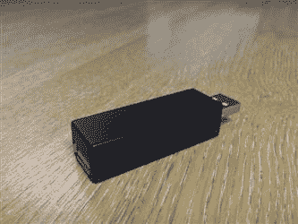

<figcaption class="figleg">Figure 12.13 A typical USB keylogger.</figcaption>

</figure>

请注意，它有两个 USB 连接，一个用于插入目标计算机，一个用于插入键盘。很多人都在卖一个“键盘记录器”,基本上就是一个 u 盘，上面有一些键盘记录软件。基本上，使用 Metasploit 或社会工程工具包可以很容易地实现其中之一。

这种键盘记录程序的问题是，它们需要安装一个服务，这需要目标主机上的管理员权限。换句话说，它们部署缓慢而且笨重。从监控的角度来看，它们比从社会工程的角度来看应用更广泛。

#### 音频记录设备

有很多商店出售音频间谍设备。这些可以根据动作或声音来触发记录。同样，留下一个设备的问题是它必须被恢复才能访问记录的数据，就像键盘记录器一样。另一个想法是在 RaspberryPi dropbox 中添加一个 USB 麦克风。这可以用来记录到本地文件，这些文件可以通过 OpenVPN 下载。甚至增加一个摄像头，让目标组织也能看到。“投件箱”在敏感区域或会议室会特别有用。

#### Teensy USB

Teensy USB 基本上是一个小 USB 棒，它被系统识别为一个人机界面设备，换句话说，就是一个键盘。该设备是可编程的，可以发出你需要的任何命令或一组击键。因为它是作为键盘使用的，所以它可以在所有类型的系统上工作。

作为安全专业人员，此功能集经常被用来危害工作站和服务器。

更好的是，社会工程工具包支持创建与 Teensy 兼容的 Metasploit 有效负载。所需要做的就是在某个地方创建一个监听器，并将这个小东西插入到目标主机中。

#### 恶意 u 盘

总是值得准备一个恶意的 u 盘，以备发现未锁定的工作站时使用。快速运行有效载荷，并立即与总部团队进行反向会话。

社会工程工具包支持利用自动运行作为执行方法的恶意 u 盘的生成。不过，这种行为通常会带来风险。这可能会触发防病毒或入侵防御系统(IPS)警报，并在相当短的时间内让人们开始搜寻。确保有效负载经过良好的编码和加密通常可以确保它绕过大多数防病毒解决方案，但出站连接仍可能被 IPS 标记。

拥有选择权总是值得的，拥有而不需要比需要而不拥有要好。

#### WiFi 菠萝

我已经提到了这个疯狂的小把戏，所以很明显我真的很喜欢它们。这当然是一个有用的设备，尽管它可能不属于经典社会工程的范畴。

如果您曾经连接到开放的无线网络，所使用的设备将在一天过去后很长时间内继续寻找该网络。菠萝通过响应声称是接入点的探测器来利用这个“特性”。此时，客户端连接，通常在受害者不知情的情况下。您现在处于此连接的“中间”,可以捕获数据包或转移流量，甚至欺骗域名服务(DNS)响应。显然，这是极其强大的，尤其是在错误的手里！

对于社会工程师来说，非常重要的是要小心这些数据是如何使用的，以及要寻找什么。尽量避免处于个人数据最终被捕获的境地，从而在此过程中违反各种法律。

同样，虽然这不是严格意义上的社会工程领域，但在混合评估中，它是一个非常有用的工具！

WiFi 菠萝可以在 hak 5—[http://hakshop.myshopify.com/products/wifi-pineapple](http://hakshop.myshopify.com/products/wifi-pineapple)买到。售价 89.99 美元，绝对便宜。

## 摘要

本章讲述了使用各种技术类型来增强评估。这包括了解在执行项目的物理部分时面临的一些挑战。物理部分是顾问为了获得未经授权的访问而出现在目标站点的地方。

此外，还探讨了与连接到物理网络相关的挑战，包括使用端口测试器和上网本，以及介绍一些克服端口安全挑战和现场缺乏 DHCP 的想法。

接下来出现了远程连接网络的概念。这通常包括在将一个名为“dropbox”的设备连接到目标网络后，将其留在现场。

我们深入研究了如何使用 RaspberryPi 构建我们自己的 dropbox。这包括增强功能，如显示连接状态的 LCD 屏幕。然后，我们考虑为设备添加 OpenVPN 支持，这实质上为我们提供了对目标网络的无限制访问。

接下来，我们浏览了一些替代 dropbox 的想法，其中一些在最近的新闻媒体中受到了高度关注。

为了总结这一章，我们介绍了一些也可以在约定中使用的小工具和工具，包括键盘记录器、Teensy 和音频记录。

我真诚地希望你能花时间打造一个属于自己的 dropbox。这将真正使你的评估在竞争中脱颖而出。

下一章将重点介绍评估的主要交付成果，即客户报告。

