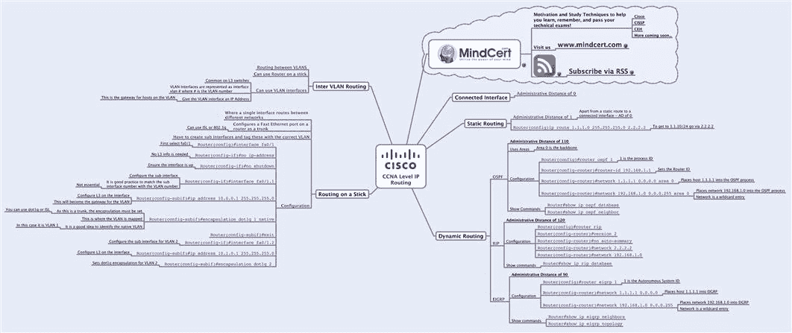
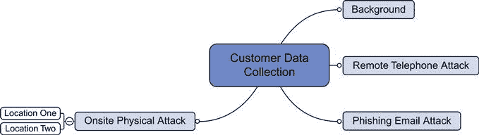
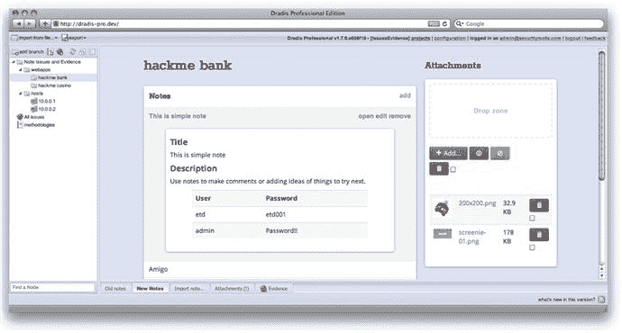
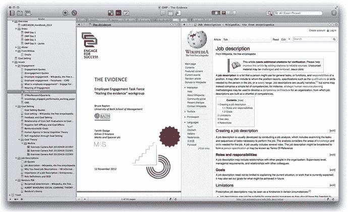
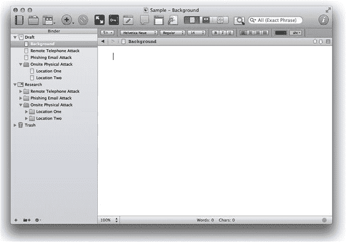
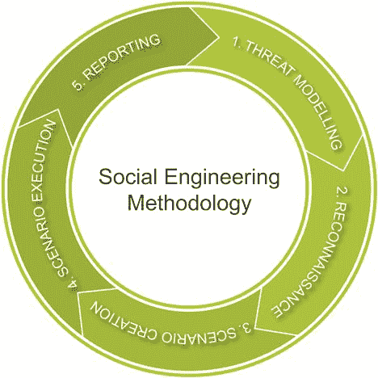

<section epub:type="chapter">

<header>Chapter 13

# 写报告

<address>

安德鲁·梅森，random storm 有限公司技术总监

</address>

</header>

<section class="abstract" epub:type="preamble" id="AB0010">

本章将着眼于向客户交付的主要成果，其形式为书面报告。报告清晰性和业务驱动因素的重要性将被涵盖，社会工程评估报告的样本模板将与为利益相关方总结调查结果的演示模板一起展示。

</section>

<section epub:type="keyword">

### 关键词

数据收集；思维导图；报告写作

</section>

本章中的信息

数据收集

操作系统文件夹结构和文本编辑器

思维导图

文件管理工具

撰写报告

封面

标题页

免责声明页面

目录

社会工程概述

社会工程方法

威胁建模

侦察

场景创建

场景执行

报告

简介

执行摘要

个人攻击媒介

报告的交付

<section id="S0010">

## 介绍

[第 12 章](12.html)介绍了社交工程攻击中使用的技术。本章将探讨社会工程报告，以及如何撰写这份报告以给客户带来最大价值。本章将介绍在评估过程中收集的数据，这些数据是编写报告所必需的，之后将讨论报告本身，并就报告的结构和应包含的内容提出建议。最后一节介绍了向客户交付和展示报告的方式。

在专业服务组织中工作的任何人都很可能已经精通创建报告的任务。客户聘请专业服务机构进行评估，例如社会工程评估。可能需要数周时间的工作成果通常以书面报告的形式提交给客户。本章的其余部分将介绍收集和组织所需信息的过程，以便创建一份报告提交给客户。

为期 5 天的短期专业服务项目很常见。在这 5 天中，通常有 3 天用于测试，另外 2 天用于写报告。因此，报告结构的重要性对于顾问来说是至关重要的，以确保建立一个高效的系统来交付一份为客户提供最大价值的报告。和大多数事情一样，顾问越有经验，他们的过程就会变得越好。

值得注意的一点是相互竞争的专业服务公司的报告结构之间的差异。本书的作者曾在几家公司工作过，在向客户提供项目的可交付成果，即报告时，他们观察到了不同的标准。建议您花时间制作一份高质量的报告模板，该模板可以针对每个客户进行复制。

在执行评估和撰写报告之间通常有一段时间。尽量缩短这一时间很重要，尽管在实践中这通常包括旅行、在回到办公室之前进行两到三次评估，并准备写下所有三次评估。最重要的是在周一、周二和周三进行评估，然后在周四和周五写报告。

</section>

<section id="S0015">

## 数据收集

在开始报告之前，需要收集大量有意义的数据，并对一些有意义的数据进行分析，以放入报告中。找到适合每个人的数据收集流程非常重要。

有许多收集数据的方法，对于读者来说，找到最适合自己的方法是很重要的。太多时候，人们花太多时间试图把一个新工具硬塞进他们的工作流程，而不是专注于实际的过程。重要的不是工具，而是如何有效使用工具的过程，以便将数据收集成一种安全可靠的格式，在以后编写报告时可以很容易地解释这种格式。

最糟糕的事情莫过于在完成一项冗长的任务后，在任务结束几天后才发现收集的笔记毫无意义。如果进行了多次评估，情况尤其如此，因为评估期间发生的事情确实有能力融合成一次，这使得严格记笔记的做法比以往任何时候都更重要。

收集的数据具有敏感性，必须小心确保这些信息安全地存储在顾问的笔记本电脑上。涵盖设备安全超出了本书的范围，但是任何提供社会工程服务的公司都应该已经实施了确保传输中的数据安全的过程。

将研究使用各种基于计算机的工具收集数据的三个例子。第一种是在选择的操作系统中使用简单的文本编辑器和文件夹结构。第二个是思维导图，这是本书作者大量使用的方法，第三个是通过使用特定的文档管理器，如 Scrivener。

这三个例子的共同过程是已经收集了数据，以便能够对其进行检查、分析和报告。这些数据将采用案例文件的形式。此案例文件可以采用以下三个示例之一的形式，也可以采用您选择的其他工具的格式。最重要的是确保数据以一种可以理解的格式收集，以便在返回办公室时进行整理和报告。

通常，记录的信息要比需要的多。不需要的信息可能总是被排除，但是没有什么比没有足够的信息来编写报告更糟糕的了。因此，建议完整记录所做的工作，并根据需要拍摄尽可能多的截图和照片，以建立此案例档案。

<section id="S0020">

### 操作系统文件夹结构和文本编辑器

收集数据的最简单方法之一是使用简单的文本编辑器和文件系统中的文件夹结构。所有操作系统都预装了至少一个文本编辑器。这可能是 Windows 上的**记事本**，OS X 上的**文本编辑**，或者 Linux 上的 **vi** 。

这里的想法是建立一个文件夹结构，模拟报告的所有部分。例如，如果有一项评估任务，其中包括远程电话攻击、网络钓鱼电子邮件攻击和两个地点的现场物理攻击，那么该结构将类似于在[图 13.1](#F0010) 中看到的结构。

<figure class="fig">

<figcaption class="figleg">Figure 13.1 Data collection folder structure.</figcaption>

</figure>

[图 13.1](#F0010) 显示了顶级客户报告工作文件夹，在此之前，评估过程中执行的每项服务都会进入特定文件夹。对于每项服务，将在每个文件夹中创建一个文本文件，并在评估过程中进行线性记录。随着评估的进行，任何文件证据(如截图、文件附件或照片)都可以添加到与评估的特定部分相关的文件夹中。

在评估结束时，需要有一个文件夹结构，每个文件夹中有一个文本文件，作为对评估如何执行、采取了什么措施、结果和失败以及报告所需的任何其他内容的解释。除了这些文本文件之外，每个文件夹中还会有一组文件，构成评估各部分结果的书面证据。

</section>

<section id="S0025">

### 思维导图

思维导图是由英国的托尼·布赞发明的一种技术。思维导图是一种协调使用大脑两侧的方法，通过利用大脑的技术左侧和更具创造性的右侧。

传统的学习是非常左脑的，因为这涉及逻辑，细节和事实。大脑的右脑通常比较模糊，由符号、图像和空间感知主导。

思维导图促进了可以被认为是全脑思维的东西，使用大脑的两侧，以更好地思考。思维导图通过利用左侧的技术细节和右侧的创意展示机制来实现这一点。

所有这些听起来可能非常科学，但实际上它的意思是信息是以一种叫做思维导图的蜘蛛图的形式呈现的。

思维导图示例见[图 13.2](#F0015) 。

<figure class="fig">

<figcaption class="figleg">Figure 13.2 Example Mind Map.</figcaption>

</figure>

要开始使用思维导图作为社会工程评估的数据收集工具，首先需要有一个初始结构。强烈建议为每个客户评估创建一个思维导图，为评估的每个主要部分使用一个核心分支。

使用与之前相同的评估示例，如果评估包括远程电话攻击、网络钓鱼电子邮件攻击和两个地点的现场物理攻击，则最初的思维导图将类似于在[图 13.3](#F0020) 中看到的内容。

<figure class="fig">

<figcaption class="figleg">Figure 13.3 Data collection Mind Map.</figcaption>

</figure>

从[图 13.3](#F0020) 可以看出，有一个概览核心分支可用于与评估相关的信息和注释，然后每个后续核心分支反映评估的一部分。例如，每个核心品牌都有子分支信息，以提供模板更完整结构的感觉。

要使用思维导图作为一种数据收集工具，重要的是开始做文字笔记，因为在评估过程中会取得进展。然而，不要以线性格式存储它们，试着把它们放在 思维导图的适当分支中。大多数思维导图编辑器能够创建文本注释，并从分支链接到这些注释，以便可以在应用程序中查看或打印出来供参考。除了在思维导图中使用文本注释之外，还可以直接在思维导图上链接文件附件和放置图片和照片。

思维导图已被证明有助于数据和信息的回忆，并且在评估和实际撰写报告之间有几天的时间时，有助于将数据放入背景中。

思维导图是本章作者选择的工具。他使用思维导图作为工具进行了数百次评估，记录了评估中发现的数据，取得了很好的结果。

关于思维导图的更多信息可以从 http://www.thinkbuzan.com/思维导图技术的创造者托尼·布赞的网站上获得。

章节作者在创建思维导图时选择的工具是 Mind jet:[http://www.mindjet.com](http://www.mindjet.com)。

以下是开源思维导图应用列表:

• XMind： [http://www.xmind.net](http://www.xmind.net)

自由思维:[http://freemind.sourceforge.net](http://freemind.sourceforge.net)

简编:[http://Compendium . open . AC . uk](http://compendium.open.ac.uk)

mind 42:[http://mind42.com](http://mind42.com)

wise mapping:[http://www.wisemapping.com](http://www.wisemapping.com)

巴布.美国:[https://巴布. us](https://bubbl.us)

</section>

<section id="S0030">

### 文档管理工具

数据收集的第三种方法是使用文档管理工具。这种工具是专门为收集数据和写作而编写的。作者已经使用这些工具中的一些来写书和写剧本，还有一些是特定于特定类型的项目的。

有一个工具是专门为写安全报告而写的，这个工具叫做 Dradis Pro:[http://securityroots.com/dradispro/](http://securityroots.com/dradispro/)。

Dradis Pro 旨在运行基础设施渗透测试，其优势在于能够从渗透测试人员使用的各种安全工具中直接导入数据，并通过消除重复的工作和信息来提高报告部分的效率。Dradis Pro 可用于创建交付给客户的最终报告，并且可以定制为使用符合特定公司标准的模板。

Dradis Pro 的截图可以在[图 13.4](#F0025) 中看到。

<figure class="fig">

<figcaption class="figleg">Figure 13.4 Data collection: Dradis Pro.</figcaption>

</figure>

另一个文档管理工具，也是本书作者用于写作项目的工具，是来自文学的 Scrivener 和 Latte，它对来自 http://www.literatureandlatte.com/scrivener.php 的 OS X 和 Windows 都可用。该网站的简介将该工具描述为“*, Scrivener 是一个强大的内容生成工具，允许作者专注于撰写和构建冗长而困难的文档。虽然它让你完全控制格式，但它的重点是帮助你完成那份笨拙的初稿。*

在[图 13.5](#F0030) 中可以看到一个代书项目的例子。

<figure class="fig">

<figcaption class="figleg">Figure 13.5 Data collection: Scrivener example.</figcaption>

</figure>

Scrivener 提供了一个完整的书写界面，可以用来创建一个文件夹结构，用于研究和写作。使用这样的工具可以快速收集信息，并能够将信息整理成反映正在执行的评估的结构化顺序。

使用与之前相同的评估示例，如果正在执行的评估包括远程电话攻击、网络钓鱼电子邮件攻击和两个地点的现场物理攻击，则最初的代书人设置将类似于在[图 13.6](#F0035) 中看到的内容。T3】

<figure class="fig">

<figcaption class="figleg">Figure 13.6 Data collection with Scrivener.</figcaption>

</figure>

文档管理工具提供了结构化书写文本注释以及导入替代文件类型(如图像、文档和网页)的能力。他们把所有的信息都放在一个地方，并且有一些独特的基于数据研究的特点，并且在写报告时易于表达。

其他一些值得考虑的文档管理应用程序包括:

Omni Outliner:[http://www.omnigroup.com/products/omnioutliner/](http://www.omnigroup.com/products/omnioutliner/)

Evernote:[http://www.evernote.com](http://www.evernote.com)

微软 OneNote:[http://office.microsoft.com/en-us/onenote/](http://office.microsoft.com/en-us/onenote/)

</section>

</section>

<section id="S0035">

## 写报告

既然已经执行了评估、收集了数据，并且将数据放入了所选的结构化格式中，那么是时候继续编写报告了，该报告将是项目与客户的最终交付成果。

该报告可以用多种选择的工具编写。如果使用文档管理工具，那么很可能可以直接从该工具创建报告。然而，可以选择避免使用商业文字处理器，如微软 word 或苹果网页；或者，有许多开放源代码文字处理程序可用于大多数操作系统平台。

与数据收集阶段一样，假设这是一项需要多次完成的工作，那么首先花时间创建可用作所有客户报告基础的报告结构和模板可以节省时间。

已经有大量的学术和专业信息，说明如何为咨询公司主导的报告创建一个结构。在谷歌上快速搜索会为你的咨询报告返回许多这样的结构建议。我们推荐的一般结构概述如下:

封面

标题页

免责声明页面

目录

社会工程概述

社会工程方法

简介

执行摘要

个人攻击媒介

<section id="S0040">

### 封面

封面载有报告的标题，并概述了客户名称和报告的创建日期。该页面可以打上来自咨询公司的标志，也可以是显示客户品牌的联合品牌。设想使用保护性标记根据行业标准安全定义对数据进行分类。这应符合针对敏感客户数据的既定公司保护性标记标准。

</section>

<section id="S0045">

### 扉页

标题页扩展了封面页，以提供有关客户报告作者的详细信息，以及概述当前版本和对以前版本所做的任何更改的版本详细信息。还可以显示报告的页数。报告的分发列表可以与个人角色的指示一起显示，个人角色可以是**作者**、用于**信息**或用于**审查**。

</section>

<section id="S0050">

### 免责声明页面

免责声明是咨询公司希望限制其产品或服务责任的声明，在咨询项目中非常典型。它概述了受商定条款和条件约束的工作，并涵盖了披露领域，因为报告中包含的内容很可能是敏感信息。

免责声明示例如下:

就我们目前所知，本文件中的所有信息、陈述、声明、意见和建议都是正确和准确的，但不具有(也不应被视为)合同约束力，除非它们成为双方之间单独、具体协议的主题。

此处包含的信息是在双方进一步协商后达成的协议将基于供应商名称标准条款和条件的基础上编制的。

除非双方签署的书面保密协议另有明确规定，本报告包含供应商名称和客户名称的保密信息。未经客户名称的事先书面同意，不得进行披露。

</section>

<section id="S0055">

### 目录

目录有三个用途。

1.这有助于那些不想阅读整个报告，但想轻松找到其中特定部分的读者。

2.这有助于读者在开始阅读报告全文之前对报告的范围和内容有一个总体了解。

3.这是报告作者的一个工具，它概述了需要解决的具体方面。

大多数文字处理工具会自动创建目录，只要在文字处理程序中正确使用样式，并相应地标记标题。

</section>

<section id="S0060">

### 社会工程概述

对于许多客户来说，这可能是他们进行的第一次社会工程项目。此外，报告的当前读者可能不是发起者，在客户内部，包含几页概述什么是社会工程、测试需求是什么以及该测试如何使被测公司受益的文本是有益的。

这种介绍为读者设置了场景，以便他们理解他们将要阅读的内容。有人可能会说这是多余的信息和报告填充，所以它只是真正推荐给那些没有很强的社会工程参与历史的客户。如果客户完全了解社会工程领域或在过去进行过评估，那么这一部分将被删除。

本节简要概述了社会工程和常见的攻击类型，以及如何防御社会工程攻击的基本信息。

</section>

<section id="S0065">

### 社会工程方法论

社会工程方法提供了一种机制，用于在评估之前和评估期间向客户展示用于处理咨询项目的方法。

社会工程方法的一个例子可以是:

<section id="S0070">

#### 威胁建模

任何社会工程评估的初始阶段都是评估企业可能面临的威胁。这些威胁可能是仓库盗窃、内部员工对网络资源的攻击，甚至是激进分子的破坏行为。

</section>

<section id="S0075">

#### 侦察

评估的这一阶段关注的是收集尽可能多的业务信息。这些信息主要收集自公共资源，如 DNS 记录、搜索引擎、论坛和新闻组。

</section>

<section id="S0080">

#### 场景创建

社会工程师将使用收集的信息和可能的业务威胁，并创建可能的场景。这些场景将构建为解决公司面临的特定威胁，以评估是否有适当的程序来防范这些威胁。

</section>

<section id="S0085">

#### 场景执行

一旦这些场景被压缩，社会工程师将使用各种技术把它们表现出来。使用的社会工程技术可能包括欺骗、伪装、分散注意力和模仿。

</section>

<section id="S0090">

#### 报告

完全完成所有方案后，收集的信息用于构建详细说明评估结果的报告。该报告将显示一个场景时间表，包括漏洞、暴露和补救建议。

该方法可以用图形表示，如图[图 13.7](#F0040) 所示。

<figure class="fig">

<figcaption class="figleg">Figure 13.7 Social Engineering methodology.</figcaption>

</figure>

与“社会工程概述”部分一样，对于熟悉社会工程参与模式的现有客户，该部分可以是可选课程。然而，对于可能不熟悉参与社会工程评估概念的新客户来说，价值也是如此。

</section>

</section>

<section id="S0095">

### 介绍

本节之前的所有页面都是序言，或者是背景介绍，或者被视为对报告结构至关重要的前置材料。报告的引言陈述了报告的内容、原因、时间、地点和方式:

**作为社会工程评估的一部分，开展了哪些**？这包括哪些攻击媒介已被用于构成社会工程评估的一部分。客户通常会在最初的咨询需求中概述攻击媒介。

**为什么**这样做了？如果客户对评估有特定的要求，将在本节中说明。

**该评估何时进行？这包括所有攻击媒介的参与日期，以及撰写报告和交付给客户的日期。**

 ****评估在哪里进行？这通常是针对客户基础架构的现场工作，也可以是通过互联网或针对远程工作人员执行的远程评估。如果现场工作在多个地点进行，则会列出每个地点的位置以及访问每个地点的日期。**

 ****评估是如何进行的**？用于进行评估的方法的详细信息。**** </section>

 ****<section id="S0100">

### 行动纲要

执行摘要主要是为那些至少在最初不打算阅读整份报告的人设计的。

对于任何需要拿起报告并了解作为评估的一部分执行了什么以及评估结果的人来说，执行摘要是报告中最重要的部分。执行摘要是报告的结论，尽管报告的主体部分尚未出台。

《执行摘要》包含了被选作评估一部分的每个攻击媒介的所有要点，并强调了结果、结论和建议。

除了文字性之外，还应该包括一些要点，突出报告中行动的积极和消极方面。

《执行摘要》通常有两到三页长，应注意确保不超过这一长度，不要扩展到几页，也不要太详细。

在写完报告的主要部分之后，再写执行摘要会容易得多，这样就可以不按顺序写报告了。这将确保所有相关部分以简洁和精确的方式包括在内。

</section>

<section id="S0105">

### 个体攻击媒介

执行摘要提供了结论和易于阅读的调查结果概述，但下一节是报告的主体部分。正是在这里，对每个攻击媒介进行了深入的解释，并提供了评估期间收集的结果、结论和建议。

在这一级，在继续讨论每个攻击媒介之前，先做一个简短的介绍。每个部分的简要结构可以是:

攻击媒介简介

顾问意见

评估证据

在介绍评估范围和执行的内容之前，攻击媒介简介概述了选择攻击媒介的依据以及攻击媒介需要什么。

顾问的意见提供了顾问为测试攻击媒介所做工作的书面叙述。这讲述了评估的故事，还详细概述了每个部分的调查结果。与执行摘要一样，在这一级包含好的和坏的结果的清单以及建议的补救措施是有用的，以便补救评估中列出的任何缺点。

评估证据是支持每个攻击媒介的顾问意见和调查结果的支持材料。虽然这并不一定要在一个结构中，但按时间顺序排列是很有用的，并且一定要包括一个时间线，以显示对该攻击媒介的评估结果。

在本章的数据收集部分，我们查看了一个社会工程项目示例，其中评估包括远程电话攻击、网络钓鱼电子邮件攻击和两个地点的现场物理攻击。使用此示例，报告的这一部分的结构如下:

个人攻击媒介

简介

远程电话攻击

–简介

–顾问意见

–评估证据

网络钓鱼电子邮件攻击

–简介

–顾问意见

–评估证据

现场物理攻击

–简介

–地点一

简介

顾问意见

评估证据

–站点二

简介

顾问意见

评估证据

</section>**** </section>

 ****<section id="S0110">

## 报告的提交

在这一点上，已经执行了社会工程评估，并且使用选择的数据收集方法收集了数据。这些数据用于制定和撰写结构化报告，为最终用户提供价值，并形成公司参与的咨询工作的最终交付成果。关注的下一个阶段是将报告交付给客户。

关于敏感客户数据的保密问题已经在本章的数据收集部分中讨论过了。保护性标记的完整介绍超出了本书的范围，但为了遵循其保护性标记标准，遵守组织制定的指南是至关重要的。

除了数据存储问题，报告还必须安全地传输到客户端。据推测，任何为公司工作、从事这种专业服务的人都会有一个安全文档传递的公司标准。这可能是使用安全的客户门户，客户根据加密的安全门户进行身份验证，然后安全地下载报告，或者通过使用电子邮件加密方案，将电子邮件加密并安全地发送给客户。

太多的专业服务公司似乎采用了“解雇并忘记”的策略来提交报告。这是向客户提供报告的地方，然后让客户阅读报告，而不与提供评估的顾问或项目团队进行进一步的交流。

向客户提供报告后，建议几天后安排一次客户汇报，以便为客户提供时间阅读和消化所提供的信息。这将使他们有时间制定一些问题来询问执行评估的顾问。该汇报可以通过电话进行，如果后勤条件允许，最好是面对面进行。

</section>

<section id="S0115">

## 摘要

本章研究了社会工程评估的报告。从数据收集的需求开始，提出三种顾问可以利用的方法，以收集制定和撰写文档所需的数据。下一步是研究如何撰写报告，并提出了一个简单的专业服务咨询报告模板，涵盖了社会工程报告的必要元素。本章的最后一节介绍了交付报告，以及在客户消化完报告中包含的信息后，如何注意确保报告的数据机密性和完整性，以及建议的客户汇报。

下一章将提供针对社会工程攻击的加固策略和程序的建议。

</section>**** </section>