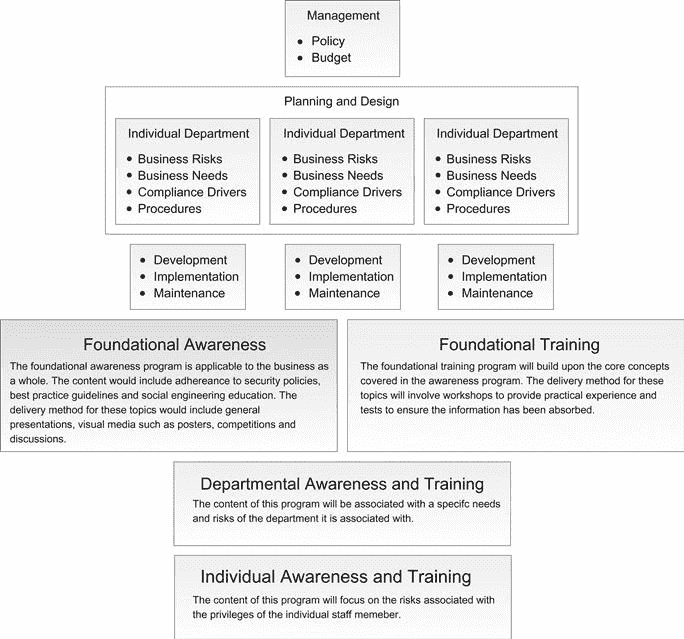

Chapter 15

# 员工意识和培训计划

Gavin Watson，random storm 有限公司高级安全工程师

员工意识培训可能是降低社会工程攻击风险的最有效方法之一。然而，这种类型的员工培训往往设计不佳，很少执行。读者将被介绍到企业常犯的错误以及如何避免这些错误。

### 关键词

意识培训；规划设计；部门风险。部门要求；合规驱动因素；基础意识；基础训练；部门培训；个人培训

本章中的信息

当前认知培训

我们甚至应该进行意识培训吗？

未经培训的认知

选择错误的管理模式

利用薄弱的培训项目

有效培训的模式

管理层的角色

规划和设计

个别部门

部门风险

部门要求

合规驱动因素

程序

发展

确保影响力

基本认知

基础培训

部门培训

个人培训

实现

外部援助

维护

## 介绍

在[第 14 章](14.html)中，创建一个强大的社会工程政策的主题已经被详细讨论过了。本章现在将重点介绍员工意识和培训计划。有效的安全意识计划经常被忽视，即使有，也常常不符合目的。可能会有读者回忆起讨论弱密码或重复使用的密码的危险的演示文稿，写下密码，让工作站不上锁，打开电子邮件附件，在电话中透露个人或敏感的商业信息，报告可疑行为，不允许人们尾随其后，并在场所内挑战可疑的人。不幸的是，尽管这种安全培训不可避免地会定期发生，但它在防止社会工程攻击方面几乎总是无效的。更糟糕的是，在一些罕见的情况下，它还可能执行得如此之差，以至于对组织的整体安全产生负面影响。

本章将讨论意识和培训项目是否有足够的益处来保证重大投资，检查阻止项目实现其目标的各种缺陷。各种问题，如缺乏实际的“培训”，不合适的管理模式和程序弱到足以被攻击者利用，将被涵盖。接下来要讨论的是如何改进设计程序的一般模型，更多地关注社会工程，而不是一般的安全良好实践。然后将处理规划、设计、开发和实现等要素，确保在每个阶段都考虑到社会工程问题。将详细讨论不同类型的认知和培训计划，如基础认知、基础培训、部门培训和个人培训，包括研讨会和角色扮演练习的示例。在此之后，一个重要的话题是如何确保任何培训产生适当的影响，以及外部援助如何提高项目的有效性。

最后，本章将关注如何确保一个培训项目不会退居幕后。在设计了一个有效的程序后，有必要定期维护、测试、改进和重复。这种员工意识培训的循环方法是非常重要的，因为一个社会工程师可能会耐心地等待一个员工变得冷漠并放松警惕。

## 当前意识培训

毫无疑问，安全意识培训对任何企业都有潜在的好处。通过演示文稿、媒体、时事通讯、海报等的组合来提高人们对信息安全问题的认识。理论上是合理的。这种意识和培训将为改善整个组织的整体安全文化奠定基础。然而，众所周知，意识和培训计划变得单调乏味，无法实现其总体目标，尤其是减少遭受成功的社会工程攻击的机会。事实上，大多数意识计划很少详细提及社会工程，而是专注于基本原则，如基本的公司计算机使用政策和通用最佳实践。这并不是说意识训练不应该包括这些一般性的话题，事实上，它们中的大多数都是必不可少的。问题是大多数程序没有扩展这些概念，没有将它们放入上下文中，也没有提供任何实际的“训练”来处理安全问题。

意识和训练指导者可能做出的一个假设是“普通用户”没有能力吸收比绝对基础更复杂的东西。系统管理员经常咒骂普通用户明显没有能力选择强密码，并且在发现写在便利贴上的密码时几乎要爆血管。当谈到安全和企业面临的各种信息安全威胁时，用户被告知策略和程序，问题是这些信息很少被吸收。问题不在于用户，而在于培训计划。当涉及到社会工程意识项目时，这一点更加重要。一些程序会让用户意识到社会工程问题，但很少告诉他们这种攻击是如何发生的。尽可能保持培训的非技术性可能会有一些好处，但这不应该真正适用于社会工程。正如在前面的章节中所看到的，社会工程是关于利用人性的，这是一个任何人都应该可以理解的概念。

### 我们甚至应该有意识训练吗？

越来越多的人认为意识训练是如此的无效，以至于根本就不应该进行。著名的安全专家和行业权威 Bruce Schneier 评论说*“…对用户进行安全培训通常是浪费时间，钱可以用在更好的地方。”*。他认为安全培训的无效性源于*“你知道你现在应该做什么和理论上的未来收益是什么*”之间的抽象差异。*。例如，鼓励使用强密码来帮助防止将来某个时候“可能”发生的攻击。对于不得不记住多个复杂密码的烦恼来说，防止可能的攻击的想法没有多大用处。因此，这些用户不太可能遵守这些通用的最佳实践。当涉及到社会工程攻击时，这一点更加明显。用户被告知永远不要泄露密码等敏感信息，但却没有被告知为什么或如何有人试图欺骗他们泄露这些信息。不仅良好的实践建议和成功攻击的理论上的负面结果之间有很大的差距，甚至一开始就没有对攻击的具体理解。因此，即使用户热衷于安全最佳实践，他们仍然容易受到攻击。例如，用户可能知道永远不要在电话中透露敏感的公司信息。然而，如果他们收到一份关于工作场所社交媒体政策的电话调查，他们可能会自由地披露公司信息。一个机敏的社会工程师可能会问他们*“你可以用你的工作电脑浏览社交媒体网站吗？”*。在回答这个看似无害的问题时，用户无意中透露了他们是否有出站互联网接入。就他们而言，他们没有泄露任何敏感信息，而事实上对外互联网访问对一名社会工程师来说是一条关键信息。这个例子在第 10 章中有更详细的介绍。如果用户知道所使用的秘密诱导技术和信息推断的概念，他们可能会认识到这一点，并避免披露。有人可能会说，一个阻止用户参与 if 调查的强有力的政策会挫败这种攻击，但正如前几章所显示的，有无数种方法可以达到同样的目的。例如，社会工程师可能会冒充同事询问*“…他们是否无法访问互联网？”*。同样，这将揭示用户首先是否具有出站互联网接入。如果用户不知道攻击是如何进行的，那么他们不太可能发现变种。*

 *当考虑到近乎完美的社会工程攻击的可能性时，我们真的能指望一般用户检测到它们吗？攻击者可能会策划一系列小规模攻击，时间跨度长达数月甚至数年。[第 4 章](04.html)展示了游戏攻击策略可以用多长时间来获取敏感信息，而被发现的机会非常小。几个月来一系列完全无害的电话不太可能被注意到，但很可能为一次精心策划的严重攻击铺平道路。简单的答案是，不能指望普通用户仔细检查他们进行的每一次面对面的口头交流，询问电话中的每一个来电者，或者彻底检查每一封电子邮件以发现潜在的欺诈行为。这一切都归结于风险及其缓解。企业永远无法完全消除风险，但他们需要认识到他们可以降低风险。对于大多数中小型企业而言，组织严密、资金雄厚的犯罪集团在数月内策划并实现攻击的可能性相对较低。但是，对于各种规模的企业来说，收到一般网络钓鱼电子邮件或可疑电话的几率相对较高。因此，通过意识和培训计划，企业不会对社会工程免疫；它只是降低了普通攻击成功的可能性。如果企业因为无法阻止坚定的攻击者而决定不实现意识和培训计划，那么他们将大大增加业余攻击者成功突破其安全性的可能性。* *### 没有训练的意识

反应式安全意识和培训通常在结束时开始，也就是说，它会呈现糟糕安全实践的最坏情况和后果，然后会推荐具体的良好实践解决方案。另一方面，安全的主动方法必须从社会工程的“什么”、“谁”、“为什么”和“如何”开始。例如，通常的做法是强调在现场询问一个不认识的人的重要性。也许有人戴着访客卡，坐在热桌旁，把他们的笔记本电脑接入网络。任何“有安全意识”的员工都应该挑战那个人。假设他们决定这样做，并收到回复*“哦，你好，我正和 Stuart 一起工作，因为电话又响了。他说可以在 HR 这里找一张比较安静的办公桌，可以吗？”*。工作人员可能会觉得他们已经完成了任务，这个人确实受到了挑战，他们用一个已知的联系人和可信的故事作出了回应。对大多数人来说，挑战不是一件自然的事情，只要情况看起来正确，挑战者宁愿接受挑战，也不愿应付与冒名顶替者打交道的令人不安的局面。他们遵循意识和培训，并以安全意识的方式行事。然而，意识培训并没有解决这个安全事件的“什么”、“谁”、“为什么”和“如何”的问题。这可能是一名社会工程师试图通过冒充承包商来访问网络。上面的冒名顶替由一个假的访客徽章组成，通过放弃一名 IT 工作人员的名字并以维修电话系统为借口来获得可信度。因此，更有效的回应应该是“完成挑战”无论是访客还是承包商，都应该能够提供现场联系方式。然后应打电话给该联系人确认访客的身份，因为他们目前没有陪同。如果他们由于各种原因无法提供联系方式，应开始敲响警钟，然后应呼叫相关部门。

只有从头到尾了解了安全事件，才能理解如何处理它的概念。通过引入研讨会和基于角色的培训来支持认知演示，而不是仅仅依赖于演示，可以实现显著的改进。假设意识演示告诉员工，社会工程师经常假装在电话中争论，以阻止挑战者。工作人员现在将能更好地处理这种特殊情况。然而，这位社会工程师却拄着拐杖走了过来，并示意让门开着。这个新的场景没有被覆盖，员工变得容易受到攻击。只有通过小组领导的培训会议，如研讨会，才能探索许多不同的场景。“意识”和“训练”有着本质的区别。前者只是简单地提出一个安全问题，以使人们意识到这一点，这通常只是简单地涉及教学视频、海报和传单。后者是一种实际教授技能的更加实用的方法。事实是，大多数安全意识和培训项目实际上不涉及任何“培训”。

### 选择错误的管理模式

当涉及到设计和实现意识和培训计划时，所选择的模型可能会对其整体有效性产生重大影响。正如在 NIST 的“建立信息技术安全意识和培训计划”中所述，*“大多数意识和培训计划遵循集中的计划管理模式，因此没有利用单个部门可能拥有的洞察力。”*。一个集中的模式基本上包括管理监督整个项目的设计、开发和实现，然后将结果传递给各个部门。这些部门将负责监控项目的有效性，并将结果反馈给管理层。这种集中式模型最有可能是为了节省时间和方便管理。然而，如果没有整合各部门的见解，那么创建一个无法产生任何实际影响的非常通用的意识计划的风险就会增加。一个更好的选择是使用“分散”模式。这将设计、开发和实现的责任转移到每个部门，让管理层来驱动政策和预算。分散模式通常在大型组织中采用，在这种情况下，让每个部门管理大部分任务更有实际意义。然而，从社会工程学的角度来看，这种模式的优势在于，它确保讨论部门特定的攻击，并开发适当的培训。

### 利用薄弱的培训项目

从攻击者的角度来看，标准的安全意识培训计划是一把双刃剑。一方面，它为工作人员提供了一般安全概念的基础知识。如果认知计划取得了部分成功，那么用户就不太可能在办公室里公开喊出他们的个人电子邮件密码，或者打印出企业的客户数据库并交给街上的普通公众。另一方面，由于培训是如此普遍，并且通常遵循相同的一般陈词滥调的安全主题，社会工程师可以使用它来获得可信度，并调整他们的攻击场景，以适应培训，而不是反对培训。例如，员工可能习惯于不向任何人透露他们的密码，即使他们是 IT 部门的成员。社会工程师可以打电话给目标，冒充 IT 部门的工作人员，声称他们收到了电子邮件帐户被锁定的报告。他们担心可能发生了违规事件，并希望确保该问题不会波及整个公司。他们希望了解该员工当前是否被锁定，并可以为他们远程检查。他们会告诉目标，他们显然永远不会要求通过电话透露密码。相反，他们可能会要求目标检查他们是否收到了解释安全问题的电子邮件，如果收到了，请按照链接进行操作，以确保他们仍然可以顺利登录。这种链接当然是恶意的，要么直接利用目标网络浏览器的漏洞，要么可能将他们引向公司电子邮件门户的克隆，从而获取用户的凭证。请参考第 9 章了解此类攻击的完整分类。

如果用户没有意识到攻击是如何执行的，也没有接受过处理攻击的培训，那么利用这种意识和培训就相对简单了。培训计划可能不仅在实现其总体安全目标方面无效，而且可能无效到可能帮助攻击者而不是防御他们。如果出现这种情况，那么认知和培训计划将是对公司时间的非常昂贵的浪费。

* *## 有效培训的模式

[图 15.1](#F0010) 显示了基于 NIST 2003 年“建立信息技术安全意识和培训计划”的意识和培训计划的可能标准模型。它使用一个分散的模型，将的责任放在每个部门来创建大部分的程序。以下部分将讨论模型的每个部分如何与社会工程相关联。

<figure class="fig">

<figcaption class="figleg">Figure 15.1 A social engineering awareness and training program model. Contribution of the National Institute of Standards and Technology</figcaption>

</figure>

### 管理的角色

为了使任何意识和培训计划有效，必须得到上层管理人员的完全认可。这就是为什么管理部分位于模型的最顶端。管理团队应在与各部门讨论的基础上获得并提供合适的预算。分散模式将评估各自风险和要求的责任放在每个部门身上，并将其反馈给管理层。管理层还负责制定和执行公司政策，这些政策为该计划所涵盖的主题奠定了坚实的基础(参见[第 14 章](14.html)了解制定强化政策和程序的详细内容)。然而，从社会工程的角度来看，管理层的认同具有更大的重要性。管理角色对于社会工程师来说是高价值的目标，目的是为了模仿和获得高特权。例如，可能有在提供信息或执行任务之前验证呼叫者的程序。如果管理层决定“利用职权”,向员工施压，迫使其放弃该程序，因为他们记不住自己的员工编号，那么社会工程师也可以做同样的事情。同样，如果已经对电子邮件帐户实现了诸如双因素身份验证之类的额外安全控制措施，这些措施也必须向管理层申请并得到他们的全力支持，因为他们的帐户很可能首先成为目标。很多时候，管理人员可能认为它们对于基本程序来说太重要了，比如屏幕保护锁或复杂的密码，或者他们认为它们太不方便了。管理者必须理解他们的角色如何使他们成为社会工程师的独特目标。因此，管理层有更大的责任来确保他们完全参与到计划中，而不仅仅是制定政策和分配预算。

### 规划和设计

初始规划和设计阶段对于确保认知和培训计划符合业务要求、不超出范围并最终支持其使命至关重要。这对于确保培训不会成为普通培训而得不到工作人员的关注就更有必要了。该计划应该将企业的关键资产与他们作为一个整体所面临的最重大风险直接关联起来。一个特定的企业可能必须处理 web 服务器拒绝服务(DoS)攻击的严重风险，这将导致他们损失数百万美元。另一个企业可能认为他们的客户数据库是他们的主要资产，在这种情况下，社会工程师的入侵将导致客户不可挽回的信任损失。这些事件通常与利用漏洞代码和分布式拒绝服务(DDoS)攻击的传统恶意黑客有关。然而，社会工程也可以被用来远程访问网络，使网络服务器瘫痪，访问客户数据库。无论企业面临什么样的资产、威胁、弱点或风险，都应该清楚地反映在所设计的意识和培训计划中。这不应与每个部门面临的风险相混淆。这些应该是公司整体的总体风险。

规划和设计阶段为计划的“基础认知”和“基础培训”部分建立内容。这个初始规划和设计阶段将创建最佳实践建议和正确的使用指南，以反映特定业务面临的主要风险。一旦规划和设计了这些初始的基础内容，各个部门就可以通过应用他们自己的特定风险和要求来构建这些内容。

### 个别部门

既然管理层已经同意，政策也已经制定，各个部门可以带头创建定制的意识和培训计划内容。如前所述，分散模式将主要任务置于各个部门的控制之下。尽管每个部门总是需要培训，但评估当前的安全状况并确定应该优先关注的领域仍然是一个好主意。用户可能已经非常清楚社会工程的威胁，但这并不意味着他们有能力应对它。

社会工程师将以非常不同的方式针对不同部门的不同员工。接待员可能通过电话被锁定，以安排会议或获得通行证。财务管理员可能会成为目标，被诱骗提供对公司数据库的访问权限。前面的章节已经清楚地展示了不同的目标需要不同的场景。就潜在的复杂性和创造性而言，社会工程攻击的范围很广。因此，不同部门的工作人员将需要非常不同的培训。例如，接待员可以说是业务中最有针对性的个人。他们被训练得乐于助人，这是理所当然的。他们通常持有钥匙或社会工程师进入大楼禁区所需的信息。针对接待员角色的培训类型将侧重于针对其角色的启发技巧(即通过电话和物理安全元素，如假徽章和尾随)。培训将主要涵盖进入大楼的各种技术。这种培训与针对首席执行官角色的培训截然不同。他们的培训更有可能集中在鱼叉式网络钓鱼攻击和凭据收集技术上，毕竟，进入首席执行官的电子邮件帐户可能会带来灾难性的后果。因此，首席执行官的培训可能更侧重于技术(即远程攻击、电子邮件攻击媒介)。当涉及第三方时，风险会成倍增加，因为冒充他们从未见过的工作人员更容易。第三方的培训将侧重于攻击者如何试图绕过当前的密码重置程序。然而，这并不是说企业不应该让接待员经历鱼叉式网络钓鱼攻击，也不是说首席执行官和服务台技术人员不应该经历尾随的危险。很简单，培训项目越有针对性，就越有可能成功实现目标。

#### 部门风险

执行风险评估是提高安全性过程的关键部分。有许多方法可以做到这一点，如定量和定性的方法，客观和主观地表达风险。风险评估方法超出了本书的范围，但是，理解它们在创建有效的意识和培训材料中的重要作用是很重要的。各个部门面临的风险因部门而异。财务部门可能会认为数据库完整性的丧失是最大的风险。而人力资源部门可能会认为员工记录的保密性丧失是他们面临的最大风险。这些一般风险很重要，它们将不可避免地包含在基础意识和培训中。然而，这些是一般的部门风险，而从社会工程的角度来看，可能还有其他的问题。例如，在社会工程攻击方面，IT 部门面临着被冒名顶替其特权的风险。销售部门可能面临远程电话攻击的风险，这些攻击旨在利用他们的销售欲望。销售人员可能会收到一封电子邮件，其中包含一个很有希望的销售线索，只需点击一下鼠标。这些类型的社会工程风险对每个部门来说可能不是立即显而易见的，特别是如果他们以前没有社会工程的经验。确定谁将负责风险评估过程也很重要。管理层会对流程负责还是会雇佣第三方？应识别一般和社会工程风险，并将其用作计划中部门特定培训部分的基础。

#### 部门要求

每个部门都有一套不同的具有安全含义的个人“需求”。财务部门可能需要打印和存储大量敏感的财务文档。这些文件可能存放在办公室内外的柜子里。在规划和设计阶段，他们可能没有考虑到社会工程师只是走进去撬锁偷走文件。对他们的风险的评估可能只集中在他们的数字数据库的损害上。

社会工程攻击的目的不仅需要集中在信息检索上，它很可能试图实现 DoS 情况。因此，部门需求的另一个方面是他们认为对其运作至关重要的内容。每个部门都应该考虑他们的基本需求，并探索社会工程师如何利用这些需求。

#### 合规驱动因素

对于大多数经理来说，法律责任是一个持续的痛苦，尤其是在信息安全领域。然而，如果仅仅通过将当前状态提高到接近令人满意的程度，它们显然可以提高安全性。如果没有法规遵从性驱动因素，大多数公司将继续沉浸在对安全的无知和自满中，从而为各种攻击敞开大门。在规划和设计意识和培训计划时，出于显而易见的原因，必须考虑合规驱动因素。在大多数情况下，管理层制定的政策会考虑合规驱动因素、地方政策和国家政策，但仍有必要在部门层面对其进行审查。可能实际上要求公司进行社会工程评估和员工意识及培训。

#### 程序

正如前几章已经清楚表明的，社会工程师会尽可能地利用弱程序。测试当前程序和设计加固程序的方法在第 14 章中详细说明。该过程的结果应纳入意识和培训计划。应该清楚地显示看似可靠的程序是如何容易受到攻击的，企业自己的程序是如何经过测试和强化的，以及每个部门中的哪些特定程序可能是目标。通过让员工经历上述每个阶段，他们将能够更好地检测攻击的变化，并发现程序中可能被遗漏的新弱点。工作人员误解程序的安全含义或为了方便而走捷径的可能性也小得多。

### 发展

在这一点上，各个部门已经计划和设计了他们的项目部分；现在是发展运载方法的时候了。材料应分为基础意识、基础培训、部门意识和培训以及个人意识和培训。正是在这一点上，意识和培训之间的区别需要完全确定。认识材料将使工作人员认识到一个具体问题，培训将使他们了解并掌握处理该问题的技能。下面是一个如何分解特定安全问题的示例。此列表并不详尽，只是为了说明将要介绍的不同材料。

**第三方帮助台**
员工可以联系帮助台重置他们的 Microsoft Outlook Web Access 电子邮件密码。

**基础认知**
用户了解以下主题:

服务是什么，如何运作以及程序文件。

公司电子邮件的敏感性和创建强密码的准则。

使用弱密码、重复使用密码和记下密码的危险。

使用公共接入终端和不安全的无线网络访问电子邮件账户的危险。

**基础培训**
用户参与涵盖以下主题的研讨会和实践演示:

社会工程师如何试图进入他们的电子邮件账户

社交工程师如何试图欺骗用户泄露密码，包括电话技术和恶意网站

**部门意识和培训**
服务台工作人员参与涵盖以下主题的研讨会和实践演示:

探索当前密码重置程序是如何开发的，重点关注它们是如何被强化以抵御社会工程攻击的。

合法呼叫者如何试图规避当前的密码重置程序。

社交工程师如何试图规避当前的密码重置程序。

内部社会工程实践的结果，旨在评估员工是否正确验证了呼叫者并检测到社会工程的企图。

**个人意识和培训**

管理层或主管等高权限部门员工参与讨论和研讨会，重点讨论他们的特定权限以及如何利用这些权限(例如，如果密码重置程序在任何阶段都需要他们的参与)。

#### 确保影响

在此阶段开发的意识和培训材料不仅与业务相关，也与员工相关。部门和个人级别的培训将非常有效地将培训融入到用户的环境中。看到攻击是如何针对他们的特定部门或特定程序进行计划和执行的，员工更有可能理解其重要性。

将安全问题与工作人员的个人生活联系起来，可以进一步加强影响。例如，钓鱼电子邮件是每个人都会收到的，而不仅仅是企业。

当制定具体的部门培训并将社会工程攻击分解为多个阶段时，强调每个安全问题的最坏情况非常重要。如果不展示不遵循建议的最终后果，受训者很难完全理解这个问题，即使他们从头到尾彻底理解了攻击。例如，用户经常被告知不要重复使用密码，因为这是一种非常常见的不良安全做法。很少有人解释这个建议背后的原因。对安全问题的解释如下。

如果密码在多个网站上重复使用，那么它们都变得和最弱的网站一样安全。攻击者可以访问不包含敏感信息的安全性差的网站，然后使用“重复使用”的密码来访问包含敏感信息的网站。如果密码在个人帐户和商业帐户之间重复使用，这将成为一个严重的公司问题。

提出的每一个安全问题都应该伴随着对企业来说最坏的情况，将问题放在员工的上下文中。

由于不同的人对不同的培训方法反应更好(例如，一个人可能更喜欢通过阅读书籍和文章来吸收信息，而其他人则通过听演讲和看视频来学习效果最好)，因此确保采用各种培训交付方法以确保有效的意识吸收非常重要。

注意不要在太长的时间里用太多的信息轰炸听众。定期进行 1 小时的短期培训通常比一整天的研讨会有效得多。

#### 基础意识

基础认知计划材料应适用于所有员工，但不应过于笼统。重要的是要根据企业的价值观、目标和使命定制材料。本节涵盖的典型领域可能包括以下主题:

病毒、蠕虫和恶意软件的威胁

正确使用互联网

正确使用电子邮件

密码管理

工作站安全、屏幕保护和锁定屏幕

笔记本电脑安全、防盗和加密

移动设备安全

数据处理和分类

网络安全

隐私问题

通常社会工程只是上述列表中的一个主题。工作人员通过什么是社会工程和一些最老套的故事来解释罪犯可能如何使用它。以这种方式只涵盖基础知识不太可能为培训提供一个良好的认知水平。因此，重要的是扩展这些通用主题，至少包括基本的公共社会工程技术。以下是可考虑纳入的主题示例:

社会工程方法

追赶和挑战

肩部冲浪和隐私

鱼叉式网络钓鱼技术和垃圾邮件

电话信息获取技巧

利用公共信息

现实社会工程的例子

在这一阶段，意识和培训计划的基础已经建立。向员工提供他们可能需要的所有一般安全信息和最佳实践建议。下一步是在培训最有益的关键领域提供实际培训。

#### 基础训练

当谈到社会工程培训时，实践研讨会在开发防御技能方面是非常宝贵的，人员可能需要探索、测试和深入了解各种安全问题。当他们了解攻击是如何执行的，他们将能够在不同的环境中检测到这种攻击的企图。例如，发现一般的网络钓鱼电子邮件相对容易，这通常是因为它们不太会使用英语，并且遵循一些常见的主题，如锁定银行账户或一次性的赚钱计划。然而，识别鱼叉式网络钓鱼邮件并不容易，尤其是如果它们具有高度针对性且制作精良的话。培训员工了解这些攻击是如何进行的，比向他们提供识别常见例子的一般提示更有效。

以下是可考虑使用的典型研讨会活动示例:

某公司正在考虑以下四种密码重置程序。以下程序中有哪些弱点，社会工程师如何利用它们？思维导图的想法，并探索作为一个小组的可能性。

1.为了重置您的密码，您需要致电服务台并提供您的用户名。

2.帮助台要求您部门的一名经理发送一封电子邮件，然后他们才会重设您的密码。

3.问讯台已同意重设您的密码，但只会将新密码的详细信息发送到另一个当前的工作电子邮件地址。

4.与这些程序相比，您自己的密码重置程序如何？

任务是设计一封钓鱼邮件，诱使用户点击一个恶意链接。这个恶意链接将利用他们过时的网络浏览器软件中的漏洞。分组讨论:

您会将网络钓鱼邮件发送给谁？

你的信息会说些什么？

你如何让你的电子邮件令人信服？

众所周知，下载电子邮件附件是很危险的。恶意附件以各种不同的形式出现，从 Microsoft Office 文档到 PDF 文件。分组讨论:

社交工程师如何说服用户下载并运行附件，而众所周知，用户是不会下载并运行附件的。

如果一封网络钓鱼邮件和附件被巧妙地伪装成来自同事，你如何识别它。

对于企业中的目标用户来说，什么样的附件是一个好的选择？

接待员已被成功骗去发放有效通行证，允许进入目标建筑。但是，在到达服务器机房之前，顾问被一名工作人员拦住了。他们质疑这种身份证明以及在那里的目的是什么。分组讨论:

根据你对自己公司的了解，你能说些什么来让这位挑战者相信你是一名合法员工？

如果你是挑战者，你会认为什么是可疑行为？

对于不喜欢挑战陌生人的人，你会给他们什么建议？

团队中有人挑战过别人吗？如果是，结果如何？

将小组分成两个小组后，一个小组应设计尽可能多的不同方法在没有有效通行证的情况下进入大楼，而另一个小组应设计尽可能多的不同方法来阻止没有有效通行证的人进入大楼。

第二组中的任何缓解策略是否与企业的当前策略相匹配？

第一组是否设计了任何没有可行缓解策略的情景？

将小组分成两人一组，一人扮演挑战者，另一人扮演社会工程师。

挑战者在走廊里停下来询问这个人，因为他们没有徽章。

挑战者停下来询问这个人，因为他们在干扰办公室的门锁。

挑战者停下来询问这个人，因为他们刚刚从文件柜中拿走了一些敏感文件。

这些活动鼓励参与者探索各种安全情况，让他们更深入地了解社会工程师是如何思考的。通常情况下，工作人员已经知道他们自己程序中的弱点，但他们可能从未探索过如何利用这些弱点。这种类型的培训通常会发现新的安全问题，因为员工开始对他们工作的企业的所有安全方面进行检查。这些培训课程的结果通常可以改进政策和程序。

这些研讨会显然只是提供意识“培训”的一种方式，但应该证明是最有效的。同样的材料可以通过基于计算机的培训、基于网络的培训甚至是笔试来提供。然而，思维导图，交换故事和讨论各种可能性的小组情况是非常有效的。

#### 部门培训

部门级培训遵循与基础培训相同的主题，但关注点更窄。这一级别的培训将只关注与特定部门相关的当前程序和风险。因此，每个部门都会参与部门培训，但每个部门的培训内容可能会有很大不同。

以下是专门针对招待会的研讨会活动示例。正如前几章所讨论的，接待员是高价值的目标。他们面临着许多风险，这些风险很少包含在任何一般的职业培训中。

目标企业的主要接待人员已经打电话确定了 IT 部门经理的姓名。分组讨论:

假设直接询问不起作用，你如何从接待员那里获得这些信息？

如果你是接待员，意识到打电话的人试图打探信息，你会如何处理这种情况？

如果你成功获得了 IT 部门经理的名字，你可以通过冒充他们来获得什么？

通过电话验证呼叫者不是一件容易的事情，尤其是如果社会工程师准备充分的话。作为一个群体…

尽可能多地用思维导图来验证打电话者的身份。

这些方法中有多少有可能实现到您当前的流程中？

在可以实现的方法中，一个准备充分的社会工程师如何规避这些方法？

安全通行证通常保存在接待处，分发给访客和承包商。社会工程师通常会试图安排有效的通行证来进入建筑物。分组讨论:

当前的任何程序是否能确保冒名顶替者无法获得有效通行证？

分组讨论如何规避这些程序。社会工程师需要什么信息？

你会如何改进当前的程序？

将小组分成两人一组，一人扮演接待员，另一人扮演社会工程师。

这位社会工程师正试图找出首席执行官的办公室在哪里。

这位社会工程师正试图找出员工在午餐时间去了哪里。

这位社会工程师正在冒充第三方技术支持公司，并试图为该建筑安排通行证。

上面的例子涵盖了接待员会面临的一些特定的社会工程风险。与会者试图提供尽可能多的不同场景，探讨每个安全问题。一旦接待人员参与到这种类型的培训中，他们将变得对攻击更有弹性，因为他们将攻击视为他们在培训中已经讨论过的内容的另一种变体。

#### 个人培训

培训专业化应进一步发展，以实际提供个人水平的培训。企业中的某些个人可能拥有非常特殊的特权；也许他们是少数知道特定门密码的人之一，也许他们是唯一能进入闭路电视系统的人。不管他们有什么特权，他们都可能因此成为目标。这种类型的培训将通过定制的基于计算机的学习、基于网络的评估，或者通过专业安全顾问的一对一培训来提供。这部分计划的重要部分是首先识别那些个人。明显的例子是首席执行官和高层管理人员。然而，如果一个清洁工有打开大楼里任何一扇门的钥匙，那么他们很可能是首要目标。另一个例子可能是将物理介质备份到异地位置。因此，负责将媒体从一个位置移动到另一个位置的个人(或第三方)可能会成为高价值目标。

### 履行

现在，每个部门都已经制定了意识和培训材料，是时候实现培训了。分散模式将实现责任分配给每个部门。但是，他们应该定期向管理层提供进度和表现更新。

在推广之前，让员工了解认知和培训计划以及制定该计划的原因是非常重要的。例如，创建该计划是因为企业一直致力于信息安全，还是因为最近的违规行为？推理应该是完全透明的，如果可能的话，支持程序。

#### 外部援助

如果企业在对社会工程的敏感性和意识以及培训项目方面忽视了社会工程，他们很可能会设计出低于标准的材料。同样，这些企业也不太可能有足够的知识来自信地向员工介绍这个主题。当一个企业的情况确实如此时，可能需要外界的帮助。

可以提供的第一个也是最明显的帮助是进行社会工程评估。这将提供企业对社会工程攻击的敏感性的当前快照，并帮助企业评估他们是否需要投资于特定的意识和培训计划。如果当前的培训计划已经存在，那么评估可能会突出该计划的弱点。前面的章节已经非常详细地讨论了执行评估的各种好处，然而，当涉及到意识和培训计划时，评估的好处取决于如何使用结果。评估结果可用作产生实际影响的相关材料的基础。各个部门可以围绕实际发生的事情(根据顾问能够实现的目标)来计划和设计他们的意识和培训计划，而不仅仅是潜在可能发生的事情。基于实际事件的材料将有效地引起工作人员的共鸣，并最终取得更大的影响和寿命。

可能的情况是，企业非常清楚他们的弱点，并认为评估不会揭示他们不知道的任何事情。当真正成功的社会工程攻击已经被检测到而没有被阻止时，情况往往就是这样。在这一点上，最常见的反应是聘请顾问提供锅炉板培训课程，以尝试和减轻任何未来的风险。然而，这些培训课程通常相当笼统，不一定适用于特定业务可能面临的各种风险。相反，企业可以雇佣安全顾问来提供以下服务:

提供对社会工程的见解，以协助设计公司特定的意识和培训材料。

充当提供公司特定培训的工具，而不是提供锅炉板培训课程。

第一种服务允许公司保持对认知和培训材料设计的控制，同时利用顾问的知识。第二项服务由专业的社会工程师提供材料，产生了额外的影响。这并不是说锅炉板服务是没有好处的，只是简单地说，企业应该理想地为他们的员工提供相关的业务具体材料。当然，这两个服务都可以被请求来真正加速程序的进度和性能。

对于安全意识非常强的企业，他们对意识和培训计划的主要关注可能与维护有关，因为他们已经完全建立了一个计划。他们可能已经雇佣了专业的社会工程师来识别他们程序中的漏洞和员工培训中的不足。此时，企业可能会决定探索与长期博弈攻击策略相关的风险。一家企业的资产可能如此重要，以至于不太可能的风险需要降低。可以雇佣专业的社会工程师来探索历时数月的社会工程技术。顾问可能被雇佣来针对特定的个人或设计涉及多种混合攻击媒介的复杂场景。这种评估的结果将构成非常具体的培训的基础，也许与单个个人有关。这种类型的服务不可避免地会有很高的价格，但会暴露出任何短期游戏评估都无法发现的弱点。

### 保持

业务信息安全可以被认为是一个不断变化的活的、会呼吸的有机体。政策和程序在更新，新员工开始工作，现有成员改变角色或离职，技术进步和攻击每天都在发展。为了保持竞争力和效率，除了接受这种不断变化的环境并尽可能地拥抱它，别无选择。然而，认识和培训材料是根据一个时间快照而不是一个不断变化的系统来规划、设计和开发的。如果材料被设计成适用于业务而不管其当前状态，那么它将不可避免地是通用的并失去其影响。因此，必须定期测试任何意识和培训计划，以确保其仍然有效，并在必要时进行更新。

企业应记录所有认知演示和培训会议的情况，以确定该计划实际上是否得到正确实现。如果员工不在或不参加培训课程，就会产生安全方面的薄弱环节。然而，跟踪其进展与跟踪其有效性截然不同。通常一个项目的有效性是由调查、访谈、问卷和正式报告的结果决定的。这些很好地提供了关于意识和培训材料是否增加了整体安全性的一些见解。然而，真正知道这个程序有多有效的唯一方法是实际测试它。

注意不要通过多项选择测试或类似的书面活动来评估社会工程意识和培训计划的有效性。这种类型的测试可能适用于一般的基础认知材料，但不太可能确定个人对社会工程攻击的洞察力水平。这只能通过内部评估、基于评估的研讨会活动，甚至一对一的讨论来实现。

正如在第 16 章中所讨论的，内部社会工程评估是实际测试项目有效性的最佳方式。这种内部评估可能受到高度控制，并且非常具体地针对安全的各个方面，例如单一程序，甚至可能是某个特定的工作人员，尽管道德考虑显然适用于这种情况。社会工程认知计划的每个方面都应该定期测试，无论是内部测试还是通过专业的第三方公司。正是从这些试验的结果中，可以改进现有的材料并创造新的材料。意识和培训计划应该随着业务的发展而不断增长和发展。

## 摘要

一般意识和培训项目有其缺陷，特别是在社会工程方面。缺乏实际操作培训使员工无力察觉攻击，更不用说预防攻击了。当安全专家争论是否应该进行意识培训时，社会工程培训被越来越往后推。这里令人担忧的问题是，意识和培训计划是公司防御社会工程类型攻击的真正关键部分。技术、严格的政策和严格的程序所能达到的程度是有限的。如果企业要有效地保护自己免受社会工程的攻击，它们需要适当地培训被作为目标的个人。然而，重要的是要确保程序得到正确的设计、测试和定期的改进，这样才不会有可能被攻击者利用的弱点。

创建意识和培训计划的一般模型已经提出，每个部分都讨论了与社会工程有关的方面。在规划和设计的初始阶段，管理层“买进”的重要性以及保持项目与企业使命的一致性是至关重要的第一步。然后，各个部门可以率先创建量身定制的培训材料，确保找到合适的资产并解决最重大的风险。

部门和个人级别的培训为员工提供了帮助防范攻击所需的知识和技能。研讨会和角色扮演活动等培训鼓励用户探索各种安全问题，真正了解攻击以及如何最好地防御它们。

意识和培训计划一经设计，就应系统地实现，并监控其进展和表现。应该进行定期测试，以确保程序实现其目标。任何失败都应该很快被发现，并用于进一步改进计划，必要时使用专业社会工程师的外部援助。

下一章将讨论企业进行内部社会工程测试的好处和挑战。

* 