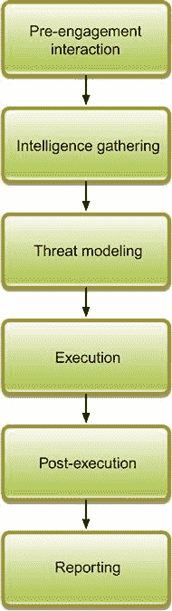
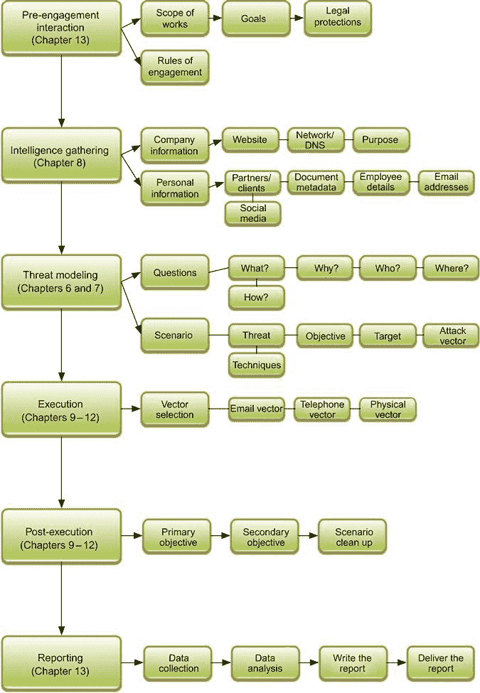

Chapter 17

# 社会工程评估备忘单

<address>

安德鲁·梅森，random storm 有限公司技术总监

</address>

本章将把整本书整合成一个简单易用的备忘单和流程图，帮助安全工程师规划和执行社会工程评估。该流程图将引用本书的章节，在这些章节中，读者可以进一步深入了解所需的工具和技术，其目的是提供一个基于贯穿本书的方法论的易于使用的系统。

### 关键词

社会工程；框架；小抄；过程；方法学

本章中的信息

社会工程框架

社交工程备忘单

## 介绍

[第 16 章](16.html)介绍了如何在公司内部使用社会工程评估作为一种方法来提高安全意识，并制定更强有力的政策，从而有望防止暴露于真正的社会工程威胁。

本章的目的是将本书的所有元素整合到一个简单易用的备忘单和流程图中，帮助安全工程师规划和执行社会工程评估。该流程图将引用本书的章节，在这些章节中，读者可以进一步深入了解所需的工具和技术，其目的是提供一个基于贯穿本书的方法论的易于使用的系统。

## 社会工程框架

第 5 章展示了一个社会工程的框架，它松散地基于 http://www.pentest-standard.org/index.php/Main_Page PTES[的渗透测试执行标准。该框架的想法是为社会工程评估的规划和执行提供结构，以使执行此类咨询的组织能够遵守可重复的标准。](http://www.pentest-standard.org/index.php/Main_Page)

在图 17.1 的[中可以看到基于流程图的拟议框架的轮廓，并解释如下。](#F0010)

**签约前互动**
这一初始部分涵盖签约前发生的所有事情，并着眼于诸如范围界定、目标、建立沟通渠道、签约规则以及作为签约一部分所需的法律保护等主题。其中一些概念在第 13 章中有所涉及。

**情报收集**
本部分是项目开始后的第一部分，涵盖了发现信息的初步基础工作，这些信息可作为社会工程评估的一部分。要收集的信息示例包括从搜索引擎和社交网络收集公司电子邮件地址，从公开的公司文档中解析文档元数据，以及建立联系信息，如总机和接待处的电话号码。该部分在第 8 章的[中有详细介绍。](08.html)

**威胁建模**
本节创建社会工程评估要遵循的模型。该模型着眼于初始信息收集的结果，并结合客户的要求，允许您根据选定的攻击媒介创建有针对性的攻击场景。尽管威胁模型使用相似的攻击媒介，但它们的设计和实施方式因客户而异。威胁建模在第 6 章的[和第 7 章](06.html)的[中介绍。](07.html)

**执行**
本节涵盖被视为项目主要目标的社会工程评估的实际执行。在这种情况下，收集的所有信息都用于应对已经建模的威胁，以便执行基于威胁的评估。顾问的目标是获得对系统的访问权，或者破坏在评估的早期阶段确定的程序。关于通过三个主要攻击媒介执行此类评估的信息可以在[第 9 章](09.html)–[第 11 章](11.html)中找到。关于如何通过技术支持这些攻击媒介的更多信息可以在第 12 章中找到。

**执行后**
本节涵盖了只有在成功执行评估后才可能实现的业务约定的次要目标。例如，主要目标可能是通过尾随进入建筑物，这是在执行过程中执行的。执行后的任务和次要目标可能是收集敏感信息，并在不被发现或注意的情况下溜走。后执行的社会工程方面在[第 9 章](09.html)–[第 12 章](12.html)中有所涉及。许多执行后的任务是基于网络的，不在本书的讨论范围之内，因为它们被认为更符合基础设施渗透测试。

**报告**
评估完成后，将根据评估结果创建报告。这是可交付给客户的，也是一项非常重要的工作，必须满足最初推动社会工程评估的业务目标。报告采用书面形式，包括收集的所有证据和使用的方法。报告通常由执行实际评估的顾问进行整理和撰写。还建议让顾问可以口头介绍调查结果，或者至少可以参加电话会议，回答客户可能提出的有关已执行评估的任何问题。有关收集信息和撰写实际报告的更多信息，请参见第 13 章[。](13.html)

<figure class="fig">

<figcaption class="figleg">Figure 17.1 Social engineering framework.</figcaption>

</figure>

## 社会工程备忘单

在[图 17.2](#F0015) 所示的框架流程图的基础上展开，可以向图表中添加额外的组件，以创建一个更深入的备忘单，该备忘单总结并链接到本书中提供的关键概念。这本书在流程图中提供了大量的章节和页面参考，这样就可以将流程图与书中与主题相关的章节进行交叉参考。

<figure class="fig">

<figcaption class="figleg">Figure 17.2 Social engineering cheat sheet.</figcaption>

</figure>

## 摘要

最后一章提供了第 5 章中介绍的社会工程框架的简要总结和相关流程图。接下来，扩展了流程图，在每一节下包含了更多的细节，试图把它变成本书中主要概念的图形化表示。希望这个备忘单可以作为一个总结指南，将模型中的步骤与书中的章节联系起来，以便日后快速参考。

