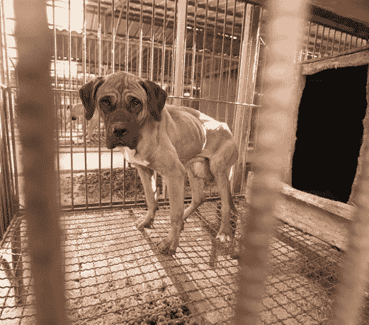
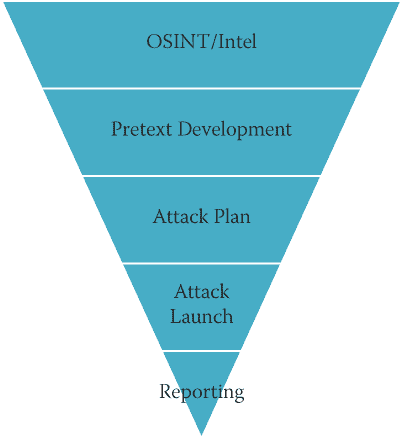

<section epub:type="chapter" role="doc-chapter">

<header>

# 1
T5】一探职业社会工程*新*世界

</header>

<section> > 我认为你的安全就是你的成功，而你成功的关键是你的好品味。
> 
> —戈登·拉姆齐

我仍然清楚地记得，当我坐在电脑屏幕前开始写《社会工程:人类黑客艺术》的第一段时。那是 2010 年的*路*。我有点想告诉你，那时候我们必须用打字机双向上坡写书，但我不想太夸张。

那段时间，当你在网上搜索“社会工程”时，你会看到几页关于社会工程传奇人物凯文·米特尼克的内容，以及一些如何泡妞或从麦当劳获得免费汉堡的视频。一晃八年过去了，现在社会工程这个术语几乎已经家喻户晓。在过去的三、四年里，我在安全、政府、教育、心理学、军事以及你能想象到的每一个其他领域看到了社会工程。

这种转变回避了为什么的问题。一个同事告诉我，“这是你的错，克里斯。”我认为他的意思是一种侮辱，尽管我对这句话感到一丝自豪。然而，我并不认为我要对这个几乎无处不在的术语*社会工程* (SE)负责。我相信，我们看到它现在被每个人和他们的兄弟使用，因为它不仅是最容易的攻击载体(就像七年前一样)，而且因为它现在也值得攻击者使用最大的有效载荷。

发起 SE 攻击的成本很低。风险更低。而且潜在的支出是*巨大的*。我的团队一直在新闻中收集关于 SE 攻击的故事，并在网上搜索统计数据。我可以肯定地说，在 2017 年，超过 80%的所有违规都有社会工程因素。

IBM“2017 年数据泄露成本研究”指出，泄露的平均成本为 362 万美元。当潜在的支付金额如此之大时，不难理解为什么攻击者会想要使用社会工程。

<aside>

* * *

<section class="feature3">

# 亲提示

**截至 2017 年，IBM《数据泄露成本研究》已经制作了 12 年。你可以在**T0 找到它。**或者，您可以在任何搜索引擎中输入“数据泄露成本研究”,找到并下载一份完整的最新报告。**

* * *

</section>

</aside>

我还记得在我的*社会工程:人类黑客的艺术*一书于 2010 年出版后，我的第一次采访中，有人问我:“你不担心你在武装坏人吗？”但对我来说，战略电子商务就像任何一种新型的战争。

为了帮助我更清楚地解释这一点，我想起了李小龙在 20 世纪 60 年代到达美国的故事。种族偏见很严重，他正在做一件别人没有做过的事情:向任何种族、肤色或民族的人教授截拳道(一种古老的中国武术)。他在大学里和同学打架，他们觉得自己对打架很了解。但他击败了一个又一个对手。最终，一些反对者甚至成为了布鲁斯的朋友或学生。

教训是什么？人们必须适应一种新的战斗方式，否则他们就会不断地被打败。李小龙的学生有没有可能利用他新学到的技能伤害他人并作恶？是的，但是布鲁斯认为教育人们是必要的，这样他们就能继续受到保护。

所以，我对这个问题的回答是，“你不担心你在武装坏人吗？”和八年前一样:我无法控制你如何使用这些信息。你可以读这本书，然后出去攻击别人，偷他们的钱。或者你可以读读这本书，学着做一个正义的捍卫者。选择权在你，但好人需要有人帮忙教导他们。

学习防御这种新的攻击方式需要的不仅仅是学习如何挨打。像截拳道一样，它需要学习如何进攻，学习如何防守，并知道何时做每一项的平衡。当你学习如何成为一名社会工程师时，你需要能够像坏人一样思考，同时记住你是好人。借用另一个比喻，你需要拥有强大的原力，但不要走向黑暗面。

现在你可能会问，“如果你的回答没有太大变化，那么我们为什么需要你的书的第二版？”好吧，让我告诉你。 </section>

<section> ## 有什么变化？

这是社会工程的一个基本问题。表面上看，答案是，“不多。”你可以追溯到很久以前，找到关于社会工程的轶事。例如，我能找到的第一个有记载的故事是在《圣经》中，在《创世纪》中，据说它发生在公元前 1800 年左右。雅各希望他的哥哥以扫能得到祝福。雅各知道他的父亲以撒视力衰退，只能靠其他感官来辨认他在和谁说话，所以他穿上以扫的衣服，准备了以扫会准备的食物。这是最精彩的部分:众所周知，以扫浑身是毛，但雅各不是，所以他把两只小山羊的皮绑在他的胳膊和脖子后面。当以撒伸手去摸雅各时，以撒依靠他的嗅觉、触觉和味觉告诉他，他和以扫在一起，而不是雅各。根据《创世纪》中的记载，雅各布的社会工程攻击奏效了！

从有记载的历史开始，我们就看到了一个又一个关于人类相互欺骗、杜平、欺骗或诈骗的故事。从表面上看，社会工程可能没有太多新的东西，但这并不意味着什么都不会改变。

一个例子是视觉。老实说，我记得第一次使用视觉这个词。人们看着我，好像我在说克林贡语。说真的，我还不如说*laH yIlo‘ghgoh HablI’HIv*(你们这些徒步旅行者会喜欢的)。然而，从 2015 年开始， *vishing* 被加入*牛津英语词典*。

<aside>

* * *

<section class="feature3">

# 亲提示

克林贡语是一种虚构的语言，但是有一个真实的机构 `([www.kli.org](http://www.kli.org))` **致力于教授、翻译和说克林贡语。你也可以在网上找到很多翻译。迄今为止，我还没有听说过任何人用克林贡语“社会工程”任何其他人的故事。**

* * *

</section>

</aside>

为什么现在字典里有这个单词很重要？这显示了社会工程载体对世界的影响有多大。曾经是“虚构”语言的一部分的单词现在是我们日常词汇的一部分。

变得司空见惯的不仅仅是词汇。现在有专门帮助坏人变得更好的服务。例如，当我为一个客户工作时，我偶然发现了一项专门校对和拼写恶意钓鱼邮件的服务。该公司提供全天候英语支持。将这些东西与我们的 BYOD(自带设备)文化以及大多数移动设备都是迷你超级计算机的事实相结合，然后再加入一些新的社交媒体成瘾。留给你的是一个全新的攻击方式——社会工程师风格。

除了风景变了，我也变了。当我写这本书的第一版时，标题是*社会工程:人类黑客的艺术。我选择这个名字是因为我觉得我在那本书里描述的很像艺术。艺术是主观的；对不同的人有不同的意义。它可以有不同的应用，可以因为完全不同的原因被使用、被观看、被喜欢、被讨厌。*

第二版叫做*社会工程:人类黑客科学。《韦氏词典词典》给科学下了一个定义:“知道的状态:区别于无知或误解的知识。”八年前，我所做的很多事情对安全领域来说都是新的，我边做边学。现在，由于我简历上额外的几年经验，我处于一种“知道的状态”。*

我希望，这种经历将使这本书对您更有意义，无论您是希望了解社会工程的安全专家，希望拓宽您视野的热心人士，还是希望了解包含在您课程中的问题的教育工作者。不管你为什么读这本书，我希望通过在更科学的层面上思考这些话题，我能以更有用和更完整的方式传达这些信息。 </section>

<section> ## 为什么要看这本书？

我觉得这第一章需要遵循我在第一本书中采取的相同模式，所以我想花一点时间来讨论为什么我觉得任何人都应该读这本书。是的，我意识到我可能有偏见，但是迁就我一下吧。

你是人类吗？我猜，如果你坐在这本书前面，读着这一段，你要么是某种高级形式的人工智能，要么你是人类。我甚至可以说，这本书 99.9999999%的读者都是人类。社会工程采用人类做决定的方式，并利用这些过程中的弱点。

社会工程师的目标是让你不假思索地做出决定。你想得越多，你就越有可能意识到自己被操纵了，这当然对攻击者不利。在社会工程师播客的第 7 集和第 70 集，我有幸采访了艾伦·兰格博士。她跟我说了她所谓的阿尔法和贝塔模式。

<aside>

* * *

<section class="feature1"> <section> ## SEPODCAST 参考

**以下是你可以找到社会工程师播客中*几集的网址，在这几集里我采访了兰格博士:***

*   **第七集包括我对兰格博士的第一次采访，在采访中我们讨论了她的研究和她的书:**T0】
*   **第 70 集发生在我第一次采访兰格博士的五年后。她回到节目中告诉我们这些年来她学到了什么，发生了什么变化，以及我们是如何进步的:** `[www.social-engineer.org/podcast/ep-070-thinking-with-out-a-box/](http://www.social-engineer.org/podcast/ep-070-thinking-with-out-a-box/)` </section>

* * * </section>

</aside>

阿尔法模式是指一个人的大脑以每秒 8 到 13 周的速度运转。它通常以“白日做梦”为特征，或者兰格博士所说的“放松的、集中的注意力”

Beta 模式是指一个人的大脑运行速度在 14 到 100 cps 之间。这是我们的大脑保持警觉、观察力敏锐并意识到周围发生的事情的时候。

哪个州对社会工程师更有利？显然，答案是阿尔法模式，因为思考和意识减少了。这不仅仅是恶意意图的情况。操纵和某些类型的影响是为了让你不假思索地行动。

例如，你很可能见过这样的广告:一位著名的女音乐艺术家出现在屏幕上，背景播放着一首非常悲伤的歌曲。图像切换到小猫和小狗被殴打、受伤和营养不良的场景。这些动物又脏又脏，看起来像是濒临死亡。现在艺术家回到屏幕上；她被健康的动物包围着，她用爱沐浴着它们。有什么消息？只需几美元，那些营养不良、濒临死亡的动物就可以变成可爱的宠物——健康、快乐，完全属于你。广告中的图像就像你在[图 1-1](#c01-fig-0001) 中看到的一样。

<figure>

<figcaption>

[**图 1-1**](#R_c01-fig-0001) 这让你感觉如何？

图片来源于亚马逊社区动物救援组织，[www.flickr.com/photos/amazoncares/2345707195](http://www.flickr.com/photos/amazoncares/2345707195)

</figcaption>

</figure>

广告的制作人是不是为了自私的目的操纵你？不完全是。他们学到的是，如果它们触发了你的情绪，你就更有可能捐赠或采取想要的行动。成功率比他们仅仅诉诸知识或逻辑要大得多。越是引发情绪，越是不理智思考。你越不理智地思考，你就会越快地仅仅根据触发的情绪做出决定。

所以，回到我之前的观点:如果你是人类，那么这本书可以帮助你了解存在哪些类型的攻击。你可以学习坏人如何利用你的人性来对付你，你可以学习如何防御这些攻击，以保护你所爱的人不成为受害者。

让我先给你一个社会工程的概述。 </section>

 <section> ## 社会工程概述

每当我讨论社会工程的时候，我通常会从一个我已经使用了 10 年的定义开始。随着时间的推移，我只是稍微修改了一下。

但是在我给你社会工程的定义之前，我需要声明非常重要的一点:社会工程(SE)在政治上是不正确的。这个事实对许多人来说可能很难接受，但它是真实的:SE 利用了性别偏见、种族偏见、年龄偏见和地位偏见(以及这些偏见的组合)存在的事实。

例如，想象你必须潜入客户的大楼。要做到这一点，你需要找到一个能让你轻松进入的借口。你的团队由几种不同类型的人组成。如果你认为这份工作最好的借口是清洁工，那么以下哪个团队成员最合适？

*   40 岁的白人金发男性
*   43 岁亚裔女性
*   27 岁拉丁裔女性

如果你确定你的最佳借口是公司间厨房工作，以下哪个团队成员会是最合适的？

*   40 岁的白人金发男性
*   43 岁亚裔女性
*   27 岁拉丁裔女性

事实是，一个熟练的社会工程师在任何一个领域都能取得成功。但是哪一个会引发最少的思考呢？记住，思考是社会工程师的敌人。

记住这一点，让我们回到我是如何定义社会工程的:

*   *社会工程是*任何影响一个人采取行动的*行为，这种行动可能符合也可能不符合他或她的最佳利益。*

为什么我的定义如此宽泛笼统？因为我相信社会工程并不总是负面的。

曾经有一段时间，你可以说，“我是一个黑客，”而不会导致正常人跑去找掩护，拔掉他们路上的每一个电子设备。作为一名黑客，过去意味着某人需要知道某样东西是如何工作的。一个黑客不满足于基础知识；那个人想要深入挖掘任何事物的内部运作。然后，一旦它被理解，黑客就会发现是否有任何方法可以绕过、增强、利用或改变它的原始目的。

当我开始写我的第一本书时，我想确保我能以一种不总是暗示它涉及一个可怕的诈骗艺术家或骗子的方式来定义社会工程。我所看到的坏人使用的同样的原则也可以用于好的目的，我希望人们知道这一点。

我经常用这个例子:如果你走过来对我说，“嘿，克里斯。我想和你开一个公主茶会——你坐在这里，我给你涂指甲，而你围着一条粉红色的围巾，我们谈论迪士尼公主，”我不仅会嘲笑你，而且会慢慢后退，寻找最近的出口。然而，我必须承认，可能会有一些关于这类事件的图片。

怎么会这样？我女儿让我和她一起开公主茶会。现在，在你说“嘿，这是一个不公平的比较——你爱她！”我承认，这与我决定加入她有很大关系，但是想想我做这个决定时所遵循的心理学原则。如果别人问我，我会毫不犹豫地拒绝同意一个决定，为了说“是”，我必须绕过正常的决策过程。

<aside>

* * *

<section class="feature1"> ## 无用的事实

<section> 考虑到一纳秒是十亿分之一秒，而普通人每分钟说 145 个单词，我实际上不可能在一纳秒内“说”出*不*这个词。另一方面，光以每秒 186，000 英里的速度传播，可以在纳秒内传播 1 英尺。 </section>

* * * </section>

</aside>

当你理解了决策是如何做出的，你就可以开始理解恶意攻击者是如何利用情绪触发、心理学原理以及社会工程艺术和科学的应用来让你“采取不符合你最佳利益的行动”的。

保罗·扎克博士出现在社会工程师播客第 44 集。他写了《道德分子*一书(达顿，2012)。在那本书和我们的播客中，扎克博士谈到了他对一种叫做催产素的激素的研究。他的研究帮助我们看到了它与信任的紧密联系，因为他做了一个非常重要的评论，关于当我们感到有人信任我们时催产素是如何被释放到我们的血液中的。请理解这非常重要的一点:你的大脑不仅在你信任某人的时候释放催产素，而且在*你感觉到*别人已经给了你信任的时候也会释放催产素。根据 Zak 博士的研究，这种现象已经在个人、电话、互联网上得到证明，甚至在你看不到正在“信任”的人的时候。*

 <aside>

* * *

<section class="feature1"> <section> ## SEPODCAST 参考

***的第 44 集社会工程师播客*包括与扎克博士关于他一生工作的有趣对话。你可以在** `[www.social-engineer.org/podcast/ep-044-do-you-trust-me/](http://www.social-engineer.org/podcast/ep-044-do-you-trust-me/)`找到它 </section>

* * * </section>

</aside>

我们大脑产生的另一种化学物质是多巴胺。多巴胺是大脑产生的一种神经递质，在快乐、幸福和刺激的时候释放。将催产素和多巴胺混合，你就有了一个社会工程大脑鸡尾酒，可以打开任何你想要的门。

在亲密时刻，我们的大脑会释放多巴胺和催产素，但在正常对话中也会释放。这些对话是社会工程的核心。

我相信我们每天都在不知不觉中使用这些原则——很多次——和我们的配偶、老板、同事、牧师、治疗师、服务人员以及我们遇到的所有人。因此，理解社会工程以及如何与你的人类同胞交流对今天的所有人来说都是必要的。

在一个技术让使用表情符号或少于 280 个字符的交流变得容易的世界里，学习如何使用对话技巧变得更加困难，更不用说看到这些技巧何时被用来对付我们了。更进一步来说，社交媒体创造了一个社会，在这个社会中，告诉每个人关于我们自己的一切都是可以接受的，甚至是可以促进的。

当我从恶意的角度谈论社会工程时，我将其分为以下四个方面:

*   **SMiShing:** Yes, this is a real thing, and it stands for SMS phishing, or phishing through text messages. When Wells Fargo was breached in 2016, I received the SMiShing attack shown in [Figure 1-2](#c01-fig-0002).

    <figure>

    <figcaption>

    [**图 1-2**](#R_c01-fig-0002) 这种 SMiShing 攻击困住了很多人。

    </figcaption>

    </figure>

    疯狂的是，我连富国银行都不用，却还是收到了这种攻击。(不，我不会告诉你我用的是哪家银行——不错的尝试。)

    只需简单的点击，这些攻击要么是为了窃取凭证，要么是为了在移动设备上加载恶意软件，有时两者兼而有之。

*   **视觉:**正如我已经提到的，这是语音钓鱼。自 2016 年以来，这一数字大幅增加。对于攻击者来说，这很容易、很便宜并且非常有利可图。也几乎不可能找到并抓住从国外打来的假冒号码的攻击者。
*   **网络钓鱼**:在社会工程领域，人们谈论最多的话题就是网络钓鱼。事实上，这本书的技术编辑 Michele 和我在一本名为*钓鱼黑暗水域:恶意电子邮件的攻防两端* (Wiley，2016) *的书中写道。*(是的，我的确无耻地推销了我的另一本书。)网络钓鱼已被用于关闭制造工厂、入侵 DNC、入侵白宫以及数十家大公司，并在不同的骗局中窃取数百万美元。到目前为止，网络钓鱼是四个主要媒介中最危险的。
*   我知道，我们也应该在这个上面加上某种形式的“钓鱼”，但我最多只能把它列在最后，因为它与众不同。然而，它在这个列表中的位置并不意味着我们不必像其他人那样担心它。在过去的 12 个月里，我们已经收集了数百个人们冒充警察、联邦特工和同事犯下一些真正可怕罪行的故事。2017 年 4 月，有一个男子冒充警察被抓的故事。他从事儿童色情交易，并利用他的冒名顶替获利。

<aside>

* * *

<section class="feature1"> ## 更多信息

<section> 在我写作的时候，这个令人作呕的故事可以在这个网站上找到: `[www.sun-sentinel.com/local/broward/pembroke-pines/fl-sb-pines-man-child-porn-20170418-story.html](http://www.sun-sentinel.com/local/broward/pembroke-pines/fl-sb-pines-man-child-porn-20170418-story.html)` **。** </section>

* * * </section>

</aside>

你所读到的每一种社会工程攻击都可以分为以下四类。最近，我们看到了我们所说的组合攻击，其中恶意的社会工程师在一次攻击中使用这些攻击的组合来达到他们的目的。

当我分析这些攻击时，我开始发现一些模式，这些模式不仅可以识别使用了何种工具和流程，还可以帮助安全专家更清楚地定义如何执行这些攻击，然后使用结果进行教育和保护。我称之为 *SE 金字塔*。 </section>

<section> ## 东南金字塔

在我解释为什么我会有这个想法以及每个部分的含义之前，让我直接进入金字塔。金字塔如[图 1-3](#c01-fig-0003) 所示。

<figure>

<figcaption>

[**图 1-3**](#R_c01-fig-0003) 这个 SE 金字塔

</figcaption>

</figure>

正如您所看到的，金字塔被分成几个部分，并从 SE 专业人员的角度来看待社会工程，也就是说，不是为了邪恶的目的而使用 SE，而是为了帮助客户和顾客。

我将定义金字塔的每个部分，我将在本书的后面更详细地讨论这些层。

<section> ### 你分了

OSINT，或开源智能，是每个社会工程项目的生命血液。也是最应该花时间在上面的一块。因此，它占据了金字塔的第一块也是最大的一块。金字塔的这一部分很少被提及:文档。你将如何记录、保存和分类你找到的所有信息？我将在下一章详细讨论这个关键因素。 </section>

 <section> ### 借口开发

基于 OSINT 时期的所有发现，下一个合乎逻辑的步骤是开始发展你的借口。这是一个至关重要的部分，最好牢记 OSINT。在此阶段，您会看到需要进行哪些更改或添加来确保成功。这也是清楚需要什么样的道具和/或工具的时候。 </section>

<section> ### 攻击计划

手里有借口并不意味着你准备好了。下一步是计划好三个 W:什么，什么时候，和谁。

*   计划是什么？我们追求和努力实现的是什么？客户想要什么？这些问题将有助于开发下一个作品。
*   发动攻击的最佳时机是什么时候？
*   谁需要在接到通知后立即获得支持或帮助？ </section>

<section> ### 攻击发射

现在有趣的部分来了:发动攻击。攻击计划的准备工作完成后，你就可以全速前进了。做好准备很重要，但不要照本宣科，否则你就无法充满活力。我完全赞成有一个书面的计划，我认为它可以让你以后省去一大堆头疼的事情。我的警告是，如果你把你觉得需要采取的每一个词或行动都写下来，当意外发生时，你可能会遇到问题。你的大脑意识到脚本上没有任何帮助，你开始结巴，紧张，并表现出恐惧的迹象。这真的会毁掉你成功的能力。我建议不要写脚本，而是使用一个大纲，它给你一个可遵循的路径，但允许艺术自由。 </section>

<section> ### 报告

等等——不要跳过这一部分。回来读吧。是的，报道并不有趣，但你可以这样想:你的客户只是付给你 *x* 美元来提供一些服务，而且很有可能，你在这些攻击中相当成功。但是顾客不付钱给你只是因为他们想看起来很酷。他们付钱给你，让你了解他们能做些什么来解决问题。因此，报告阶段处于金字塔的最顶端，是金字塔其余部分的顶点。

如果遵循这个金字塔的五个阶段，你不仅会成为一名成功的社会工程师，还会成为一名为客户提供社会工程服务的专业人士。事实是，除了报告，这些步骤都是世界上恶意的社会工程师遵循的。

2015 年，《黑暗阅读》报道了一起涉及这座金字塔的攻击。(你可以在`[www.darkreading.com/vulnerabilities---threats/careerbuilder-attack-sends-malware-rigged-resumes-to-businesses/d/d-id/1320236?](http://www.darkreading.com/vulnerabilities---threats/careerbuilder-attack-sends-malware-rigged-resumes-to-businesses/d/d-id/1320236?).`阅读文章“CareerBuilder 攻击向企业发送恶意软件操纵的简历”)

1.  攻击者调查了攻击的几个目标，在他们的 OSINT 阶段工作时，他们发现他们的目标使用了一个名为 CareerBuilder 的流行网站。
2.  完成 OSINT 阶段后，攻击者开始借口开发。这导致他们以求职者的身份策划了一个借口，求职者希望在他们的目标提供的任何职位上被雇用。他们意识到他们需要的工具是一些恶意编码的文件和一些看起来很真实的简历。
3.  他们通过回答一些问题开始计划袭击。
4.  然后，他们通过上传恶意文件*而不是*给目标，而是上传到 CareerBuilder 网站来发起攻击。发布招聘信息的公司会收到电子邮件通知，称有新的申请人，该电子邮件将包含攻击者上传的附件。
5.  他们没有遵循任何可操作的报告阶段，但由于 Proofpoint 的一些研究人员，关于这次攻击有一些可操作的报告。

这种攻击之所以成功，是因为目标会收到一封来自可信且信誉良好的来源(CareerBuilder)的带有附件的电子邮件。因此，目标会不假思索地打开附件。这正是恶意社会工程师的目标:让目标采取不符合他们最大利益的行动，而不考虑潜在的危险。 </section> </section>

 <section> ## 这本书里有什么？

当我开始计划这本书时，我想确保我遵循了第一版*社会工程*的大纲，这样那些从它的页面中受益的人也会从这本书中受益。与此同时，我想改变这本书并更新它，以涵盖一些新的攻击和我在以前的书中从未讨论过的事情。

我想确保我采纳了书迷、研究者、读者和评论家的所有建议，希望我能使这本书比第一本书好得多。让我概述一下这本书是如何编排的，这样你就知道该期待什么了。

沿着金字塔的道路，[第二章](02.html)，“你看到我看到的了吗？”，讨论了 OSINT 并涵盖了一些使用的永恒的技术。我避免过多地钻研实际工具，尽管我提到了几个在过去十年中一直放在我的工具箱中的工具。

在第三章“通过交流剖析人们”中，我研究了一个在第一版中几乎没有触及的话题。我深入研究了高级通信建模和分析工具。

第四章“成为你想成为的任何人”，是我开始寻找借口的地方。这是一个在社会工程之外没有多少人谈论的话题。我涵盖了技巧、诀窍和我多年来的许多经验(包括成功和失败)。

在第五章“我知道如何让你喜欢我”中，我从许多播客、时事通讯和与世界上一些伟人的谈话中收集信息——比如罗宾·德雷克——并将建立融洽关系的原则应用到社会工程中。罗宾·德雷克是联邦调查局行为分析小组的负责人，也是我的好朋友。他是建立融洽关系和信任的大师，并定义了实现这两者的步骤。

[第 6 章](06.html)“在影响下”，将影响研究的领导者之一 Robert Cialdini 的工作应用于社会工程领域。这一章采用了他在多年研究中发展出来的原则，并展示了它们是如何被社会工程师所使用的。

第 7 章“我甚至没有问你这个，”定义了框架和启发，并概述了任何人如何掌握这两者。

在第八章“我能看到你没说的”，我们回到了我最喜欢的话题之一:非语言。我在我的书*揭露社会工程师:安全的人类元素* (Wiley，2014)中深入挖掘了这个主题，但这一章是让你开始进入非语言世界的初学者指南。

在[第九章](09.html)“黑掉人类”中，我将前面的八章应用于五种不同类型的社会工程攻击。这一章向你展示了，作为一名专业的社会工程师，应用本书的原则是多么重要。

当我们接近尾声时，[第 10 章](10.html)，“你有 M.A.P.P 吗？，”涵盖了预防和缓解。在一本关于专业社会工程的书中，这一章涵盖了学习对抗所有社会工程攻击的四个步骤是很合适的。

然后，像所有好东西一样，这本书必须有个结论。所以，[第十一章](11.html)，“现在怎么办？，“给这本书画上了一个句号。

以下是我对你的一些承诺:

*   我保证不会引用维基百科作为有价值的来源，尤其是在提到研究的时候。(我从错误中吸取了教训。)
*   我答应给你们讲许多我在过去七年或更长时间里经历的故事。有时，我会从多个角度讲述一个故事，以帮助你真正确定几个要点。但是我试着把这些故事混在一起，这样你就不会觉得无聊了。
*   当我使用他们领域中一些最伟大的思想的研究或工作时，我会确保你参考他们的工作，这样你就可以更深入地研究你想要的任何主题。
*   正如我写第一本书一样，我公开欢迎所有的联系、评论、建议和批评。

我所要求的回报是你按照它的本意来读这本书。如果你是一个新手，这本书可以帮助你学习成为一个专业的社会工程师需要什么。如果你有经验，那么我希望我分享的一些故事、技巧和诀窍能给你的武器库带来一些新的工具。如果你是一个爱好者，那么我希望你读这篇文章的时候和我写这篇文章的时候一样兴奋。如果你是一个怀疑论者，那么请带着这样的想法阅读这篇文章，我并不是声称自己是唯一的救世主。我只是一个有着多年经验的热情的社会工程师，我想与大家分享我的经验，让这个世界变得更安全一点。 </section>

 ## 摘要

我写的任何一本书如果没有烹饪类比都是不完整的，所以我来了。就像任何一顿大餐一样，需要大量的计划，需要新鲜食材的伟大食谱，然后是艺术和科学的执行。社会工程虽然本质上很简单，但对新手来说却不是一个好方法。它包括理解人类如何做决定，他们的动机是什么，以及如何控制自己的情绪，同时利用他人的相同过程。

这本书的主题在今天仍然和八年前一样相关，甚至现在更相关。在过去的八年里，我看着很多人崛起为专业的社会工程师。我也见过许多恶意的社会工程师起起落落。

随着攻击的本质如此严重地倾向于人为因素，所有安全专业人员都必须了解社会工程。但是这个话题还有更多的内容。我记得当我开始做厨师时(在很久以前的上辈子)，我的导师会拿着配料，告诉我品尝每一种配料的一点点。但是为什么呢？

他告诉我，如果我不真正了解每样东西的味道，我就不可能知道“品尝”是什么意思。如果我知道食谱需要一些辣根，我想让它更辣一点，那么我知道我可以多加一点。了解到某种成分也有咸味，可能会让我调整食谱中的盐，这样食物就不会过度调味。你明白了。

即使您不在安全行业，了解这些成分的“味道”也很重要，这样您才能得到保护。和某人建立融洽的关系意味着什么，怎样才能让你放弃你的钱？(这在[第 5 章](05.html)中有所涉及。)在诱导性对话中，影响力是如何让某人在电话中说出密码的？(这在[第 6 章](06.html)和[第 7 章](07.html)中有所涉及。)

这些成分中的每一种都可以帮助你了解“味道”当你了解它们的时候，你就能意识到什么时候有人在你身上试用它们，你就更有安全感了。你可以感觉到事情不对劲，你可以采取防御措施。

你看过戈登·拉姆齐的烹饪比赛吗？当他品尝一道他不喜欢的菜时，他会指出具体的问题:“这道菜有太多的胡椒，他们用了太多的油。”另一方面，新手可能会说:“太辣太油腻了。”这两种描述是一回事吗？我不这么认为。我的目标是帮助你成为 SE 世界的戈登·拉姆齐——但也许要少说脏话。

说了这么多，让我们进入第一章，讨论 OSINT。 </section>