# 2
你看到我看到的了吗？

> 记住失败是一个事件，而不是一个人。
> 
> -吉普赛人

OSINT 代表开源智能，它是社会工程的生命线。信息是每个项目的起点和支撑点。因为 OSINT 对我们这些社会工程师来说非常重要，所以了解你可以通过哪些不同的方式来获取关于你的目标的信息是至关重要的。

不管你如何获得信息，你都需要清楚地知道你在寻找什么。这看起来很容易做到，但并不像听起来那么容易。你不能简单地说，“我要目标的所有信息。”每种类型的信息都有不同的价值，并且有价值的信息会随着您要发起的攻击类型而变化。 ## 收集 OSINT 的真实例子

让我试着给你一些观点。根据网站`[www.worldwidewebsize.com](http://www.worldwidewebsize.com)`统计，有超过 44.8 亿*个*索引网站。这还不包括任何没有被索引的内容，暗网或深层网上的站点等等。每年全球互联网流量达到 1.3 兆字节(即 13 亿字节)。一个消息来源甚至告诉我们，互联网可以包含多达 10 兆字节的总数据。(写 10 个 yottabytes 是这样的:10，000，000，000，000，000，000，000 字节。)

 <aside>

* * *

## 有趣的事实

奇怪的是，yottabyte 出现在 zettabyte 之后，是以《星球大战》中的角色尤达命名的。有几类数字比这一类更大，名字也更奇怪——例如，shilentnobyte 和 domegemegrottebyte。 * * * </aside>

为什么互联网上的流量对理解有一点点重要？举个例子，如果你想发送一个钓鱼邮件，你的目标可能是寻找个人爱好、喜好、厌恶和目标认为有价值的东西。但是如果你要去见你的目标，那么你可能想要找到关于目标的工作的细节，这个人在工作组织中扮演什么角色，以及这个人期望从什么样的内部和外部资源打电话。如果您的目标是到达现场，那么您需要知道目标是否会与人会面，以及这些人是谁。

你有 44.8 亿个潜在的网站可以浏览，寻找有用的数据。所以，在你开始挖掘之前，计划好你的社交活动是很重要的。

为了帮助你建立一些你正在寻找的参数，使用[表 2-1](#c02-tbl-0001) 中的问题列表。

<figure>

<figcaption>

[**表 2-1**](#R_c02-tbl-0001) 例题

</figcaption>

| **组织类型** | **要问的问题** |
| --- | --- |
| 公司 | 公司如何使用互联网？公司如何使用社交媒体？
对于员工可以在互联网上发布的内容，公司是否制定了相应的政策？
这家公司有多少供应商？
公司使用哪些供应商？
公司如何接受付款？
公司如何付款？这家公司有呼叫中心吗？总部、呼叫中心或其他分支机构位于哪里？公司允许自带设备吗？公司是在一个地方还是在许多地方？是否有可用的组织结构图？ |
| 个人 | 此人使用哪些社交媒体账户？这个人有什么爱好？这个人去哪里度假？
这个人最喜欢的餐馆有哪些？
这个人的家族史(疾病、生意等等)是什么？
这个人的教育水平如何？这个人学了什么？
这个人的工作角色是什么，包括是否在家工作，为自己工作，向谁汇报？有没有其他提到这个人的网站(也许他们发表演讲，在论坛上发帖，或者是某个俱乐部的成员)？这个人有房子吗？如果是，什么是财产税，留置权，等等？
这个人的家庭成员的名字是什么(以及任何之前提到的关于这些人的信息)？ |

</figure>

当然，表中的问题只是触及了表面。您可以添加有关使用的计算机类型、员工日程安排、使用的语言、使用的防病毒保护类型等其他项目。

这里有一个摘自 2017 年头条的故事。(你可以在`[https://gizmodo.com/this-is-almost-certainly-james-comey-s-twitter-account-1793843641](https://gizmodo.com/this-is-almost-certainly-james-comey-s-twitter-account-1793843641)`读到它的一个记述。)它是以联邦调查局前局长詹姆斯·科米为中心的。一位网络博客作者兼研究员想看看她是否能找到詹姆斯·科米的社交媒体账户。因为科米是联邦调查局局长，他是否有社交媒体账户并不为人所知，更不用说如何找到它们了。这就是这个故事开始的地方。

图 2-1 显示了博主用来追根究底的全部步骤。看一看，然后我会一步一步地告诉你。

<figure>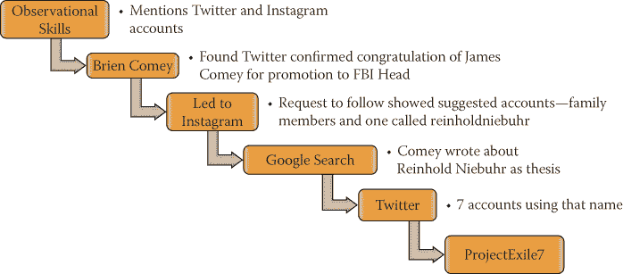

<figcaption>

[**图 2-1**](#R_c02-fig-0001)

</figcaption>

</figure>

首先，研究人员必须确定她想要发现什么:导演科米有社交媒体账户吗？如果是的话，他们在哪里？

仅仅通过互联网来研究这个问题被证明是非常困难的。2016 年，一家网站列出了“60 大社交媒体平台”。有那么多可用的平台——都有不同的规则和方法——很难找到一个人。

幸运的是，OSINT 最古老的形式之一被证明对研究者有利:倾听。在一次公开露面中，导演科米提到他有 Twitter 和 Instagram 账户。

这一声明帮助研究人员将搜索范围从 60 多个社交媒体平台缩小到两个。在搜索中，2 是一个更容易管理的数字。

在没有找到任何与导演科米直接相关的账户后，研究人员找到了导演的儿子布莱恩科米的推特账户。当布莱恩祝贺科米局长升任联邦调查局局长时，这位研究员能够证实布莱恩·科米与科米局长的关系。

用户可以做的事情之一是将多个社交媒体账户链接在一起。在这种情况下，Brien 将他的 Instagram 帐户链接到了他的 Twitter 帐户。研究人员检查了 Instagram 账户，但是 Brien 已经对公众锁定了他的账户，所以只有那些被授予账户权限的人才能看到他发布的内容。

研究员决定请求跟踪布莱恩。Instagram 的一个功能是，当你等待用户接受你的关注请求时，你会被指向同一个圈子中的人，以防你也想关注这些人。Instagram 为 reinholdniebuhr 推荐了一堆用户，他们是 Brien 的家人(不包括导演 Comey)和一个账户。

如果你在网上搜索“雷茵霍尔德·尼布尔”，你很快就会发现他是美国神学家和政治评论家。但是，他在 1971 年就去世了，所以他有 Instagram 账号是值得怀疑的。但是经过进一步的调查，研究人员了解到科米在他的大学论文中写到了雷茵霍尔德·尼布尔。

有了这些信息，研究人员搜索 Twitter，发现了七个使用这个名字的账户。在这七个名字中，有一个以@ProjectExile7 为名公开使用了这个名字。

经过进一步调查，研究人员发现“流放计划”是科米在里士满担任联邦检察官时启动的一个项目的名字。

这位研究人员在没有访问任何非法内容的情况下做出了她的发现，没有入侵任何东西，并且在她思考线索时只查看了开源情报来源。

这是一个融合非技术和技术的极好例子，对所有社会工程师来说都是一个很好的教训。这是本章其余部分的基础:不同类型的 OSINT 以及如何利用它们作为社会工程师。我把它分成两个主要部分:非技术性的和技术性的。

<aside>

* * *

## 记录还是不记录——这是个问题

在我们深入讨论 OSINT 的类型之前，我想补充一下我对文档的想法。

问题并不在于是否要记录。真正的问题是你用什么来记录，你记录了多少？

想一想我在这一章开始时说过的话:当你搜索 10 兆字节的数据时，你会发现关于你的目标的大量信息。不管你多聪明，除非你有过目不忘的记忆力，否则你不可能记住每一个细节。而即使是有着摄影般记忆力的人，也无法仅仅依靠自己的记忆来完成专业的报道。

现在，我不能确切地告诉你应该如何记录，因为有太多的因素。例如，当我开始走这条职业道路时，只有我一个人做所有的工作，我使用高级记事本应用程序，允许我为每个客户创建一个新文件夹或便笺。然后我会把这个笔记分成不同的部分，比如个人、商业、家庭、社交媒体等等。当我发现一条信息时，我会将其记录在适当的部分，这样在我写报告时更容易找到这些数据。我使用了一些小技巧，比如在攻击中使用某些颜色。我用一种颜色表示中等发现，另一种颜色表示重要发现。

然后我的团队开始壮大，我让很多人一起做一个项目，这让我意识到来回传递记事本根本不是最好的解决方案。我必须想出一个允许团队成员共享笔记的解决方案。

起初，我考虑过 Google Drive 之类的东西。我考虑过基于云的笔记应用和其他基于云的工具。

这些解决方案带来了一些问题:

*   我的任务是获取社会安全号码、银行数据以及人们生活中的其他隐私和个人信息。如果我使用的解决方案被黑了怎么办？(那是 2013 年 Evernote 被攻破时发生的事，超过 5000 万个密码不得不被修改。)
*   我无法控制这些解决方案的访问方式或数据的管理方式。
*   **“云”这个词经常让某些客户不寒而栗，说“*不！***

这让我开始构建自己的服务器。我们在一个服务器托管设施中获得了空间，这个设施是经过审查和安全的。我们构建了自己的安全 VPN 服务器，并在我们拥有的位于防火墙、路由器和 VPN 之后的服务器上安装了我们选择的软件。

这意味着我可以控制数据的存储、管理、备份、传输和保护。这个解决方案让我晚上高枕无忧，因为我对我们管理客户数据的方式充满信心。

也许你有不同的解决方案。重要的是，您要认真对待如何存储、管理、备份、传输和保护您在客户端收集的任何数据。 * * * </aside> ## 非技术新闻

我认为非技术性的东西是指任何不涉及社会工程师和计算机之间直接互动的东西。你可能会像一个使用电脑的目标一样肩并肩地冲浪，但是*你(SE)* 不是使用电脑的那个人。它是你用非技术手段收集的信息。这里我可以介绍很多具体的方法，但我可以大致把它们都定义为*观察技巧*，在接下来的部分，我会给你一些例子。

### 观察技能

观察技能看起来似乎显而易见且易于使用，但成功地使用它们并不是一种常见的技能——尤其是在数字媒体泛滥的时代。如果说有什么不同的话，那就是今天的营销策略让我们不再关注细节。埃隆大学的艾米丽·德拉戈(Emily Drago)在 2015 年进行的一项研究(题为“技术对面对面交流的影响”)指出，面对面交流的质量因技术而下降。这项研究观察到 62%的人在与他人交谈时使用移动设备，尽管知道这会降低交流的质量。

<aside>

* * *

# 注意

**阅读《技术对面对面交流的影响》全文，请访问** `[www.elon.edu/docs/e-web/academics/communications/research/vol6no1/02DragoEJSpring15.pdf](http://www.elon.edu/docs/e-web/academics/communications/research/vol6no1/02DragoEJSpring15.pdf)`。

* * *

</aside>

我们处于一个主要通过 280 个字符和表情符号传达信息的社会，通过模因或社交媒体帖子进行交流。使这些事情成为可能的进步是惊人的，但它们创造了一种情况，即人们不太善于观察与他们交流的人。这也是为什么在非技术领域，观察技能是我最看重的。

您可能会问一些问题，例如:

*   术语*观察技能*包含什么？
*   你能做些什么来自学这些技能呢？
*   你应该期待收获什么？

让我们逐一讨论这些问题，看看你能观察到什么，学到什么(看我在那里做了什么？).

 #### 观察技能*包含哪些内容？*

下面的场景给了你一些观察技巧在现实世界中应用的例子。

##### 情景 1

你的任务是进入大型医疗机构的收发室。你必须在光天化日之下做。你不能撬锁、爬墙或跳窗。你在测试前台和安保人员，看他们是否允许你进入安全区域，所以你必须通过那些工作人员工作的医疗机构部分。

这里有一些你应该拥有的观察技能:

*   服装:这个简单但有时被忽视的知识很重要。在[第一章](01.html)“专业社会工程新世界一览”中，我说社会工程师的目标是让你不假思索地做出决定。如果你闯入一个每个人都穿得很随意的地方，你穿着三件套西装，你会让人们注意到你。反过来也是如此，所以你想知道员工是如何穿着的，这样你也可以这样穿。
*   **入口和出口:**在你进入大楼之前，了解你的出口点在哪里。有没有一扇门是抽烟的人常去的？一个入口比另一个入口戒备更森严吗？是否有换班导致某个岗位无人值守或人员较少？
*   **进入要求:**进入该设施或区域需要什么？你看到有徽章的员工吗？什么样的徽章？他们在哪里穿？他们也必须知道密码吗？游客有陪同吗？参观者有徽章吗？当你走进去的时候，有没有陷阱、十字转门、安检台或其他安全设施？
*   **周边安全:**查看大楼外发生的事情。有监控摄像头吗？有警卫在附近巡逻吗？垃圾箱锁好了吗？有任何警报或运动触发防御系统吗？
*   **安保人员:**他们是在忙着看自己的移动设备还是电脑屏幕，还是在保持警惕、集中注意力？他们看起来是无聊到难以置信还是很感兴趣？
*   **大厅设置:**键盘或安全设备是否设置在可以肩扛上网输入密码的地方？(换句话说，你能不能靠得足够近，从某人的肩膀上偷看，并在他输入密码时捕捉到他？)

当然，你可能还想观察更多的东西，但这些都是基本的。

为了帮助您理解这些标准为何如此重要，这里有一个真实的故事，涉及服装、进出、进入要求和周边安全。Michele(这本书的技术编辑)和我的任务就是我在这一小节开始时概述的场景。我们必须做相当多的技术工作，这一点我将在本章的后面介绍，但是也有相当多的非技术工作导致了我们的成功。

我们决定使用一家害虫控制公司的借口，该公司被雇来报紧急蜘蛛喷洒的价格。我们称我们的公司为蓝色大害虫控制公司，并配备了全套蓝色大装备和定制蓝色“毒药”的喷雾瓶，以杀死我们在报价过程中看到的任何蜘蛛。这种毒药实际上是装在喷雾瓶里的蓝色佳得乐。

<aside>

* * *

# 有趣的事实

伪装成毒药的蓝色佳得乐是携带提神饮料的好方法，当你担心闯入建筑物并大量出汗时，它可以用来解渴。然而，当有人进来时，如果你正在电梯里从你的“毒药喷雾器”中大口大口地喝着，你可能会得到奇怪的表情。

* * *

</aside>

我们开始开车绕着周界，注意入口、出口、摄像头位置、吸烟者的聚集地，以及看起来最拥挤和最不拥挤的入口。我们还注意到进出的员工是否有徽章，以及他们的穿着。然后，我们选择了最初的入口点，开始向门口慢慢走去。缓慢行走的原因是为了尽我们所能观察人们是如何进来的。

我们看到两个保安监督着人们，他们把徽章压在一个金属支架上，然后被允许进入。右边还有一个安检台，有人负责登记。

我们决定试着绕过警卫，跟着人群进去。这根本不起作用。一名保安拦住了我们，问我们在做什么，为什么在那里。我低头看着他的姓名牌，看到了他的名字，然后我开始说，“安德鲁，我们被要求来给一些紧急蜘蛛喷洒的建议……”警卫打断了我的话，说:“好吧，去服务台签到。”

我以为我们进去了，但是当我们走近服务台时，那里的人问了我们的名字。当我们用假名时，他搜索了一份名单。当他在名单上找不到我们时，他说:“对不起，你不在我们今天的访客名单上。你不能擅自进来。”

我们试图解释，影响，甚至使用压力和请求帮助。没有。关闭。我们走出前门，边走边讨论我们要做什么，看到几个吸烟者在外面休息。我告诉米歇尔跟着我，我们向吸烟者走去，表现得好像我们属于这里，正在检查大楼的外部。我假装在我的剪贴板上做笔记。

我们又慢慢地走着，直到我们看到一些人朝门口走去，所以我们紧跟在他们后面。现在在大楼里，我们跟着这一大群人，我很快注意到我们正径直走向前面，那里有刚刚拒绝我们的保安。我看到我右边有一部电梯，但是没有按钮。“该死，”我心想，“一部被保安叫来的电梯。”就在我结束思考时，电梯门开了，我立即走了进去，希望米歇尔能注意到我，并跟着我走。

对我来说幸运的是，米歇尔在这类事情上相当惊人，没有迷路或压力过大。电梯里有一群人，米歇尔迅速宣布，让所有人都能听到，“老板，我们能尽快完成这项工作吗？我饿了，你说我们吃完才能吃东西。"

电梯里的一个女人用不赞成的眼神看着我，她说:“喂饱这个可怜的女人。”我回答说:“我想去，但是我们正好还有一层楼要考察。我们完成得越快，她就能吃得越快。”

女人叹了口气，说道:“好吧，那么，让我们带你去你要去的地方吧……”，我在句子中间接上了“去收发室。”那个女人掏出她的徽章，在电梯里刷了一下听筒，按了几个按钮，然后说:“让我在路上让你下车。”

咻！谢天谢地，由于米歇尔出色的观察技能和我快速的动作，我们没有被抓到，我们甚至有一位好心的女士带我们到了那个安全的楼层。(米歇尔只是部分假装，因为她真的总是很饿。)

在有收发室的楼层，我们下了电梯，发现收发室的门是锁着的。有一个铃铛，标签上写着，“按铃寻求帮助。”我们按了门铃，然后等着。

一个女人来到门口说:“有什么可以帮你的吗？”我们滔滔不绝地说出我们要引用什么的借口。这位女士回答道，“嗯，我得打电话给保安部让他们批准。”

如果她叫了保安，我们的故事就会被揭穿，所以我说，“好吧，如果你想的话，你可以，但是安德鲁是派我们下来做这件事的人。”

她说，“哦，安德鲁派你来的？那就进来吧。”她让我们进了收发室，说:“别碰邮件。”我们通过移动天花板瓷砖、网络电缆和无尽的邮件来翻找天花板。

正如你在整个故事中所看到的，之所以会发生这么多事情，是因为我们进行了快速的观察，并对这些信息进行了分类，以备后用。(而这仅仅是开始。)

我不知道我会需要安德鲁的名字，米歇尔不知道我们会在电梯里遇到一个有同情心的女人，我们两个都不知道我们会遇到一群无私的吸烟者，他们不在乎我们是否紧跟他们。但是通过观察，我们可以利用其中的每一个来获得成功。 ##### 场景 2

你的任务是钓一个美国大公司的知名律师。你可以使用任何你能找到的关于她的信息。

当我们到达技术部分时，这个故事将展开更多，但是为了指出一个非常有价值的教训，让我告诉你我在这一点上是如何悲惨地失败的。

我们的情报使我们了解到这位律师在马萨诸塞州处理了一些事情。我们发现马萨诸塞州最近的税法更新可能会引起她的兴趣，并在让她点击链接或打开恶意附件方面非常有效。

我开始起草一封关于马萨诸塞州变化的电子邮件，并计划好了这支矛的方方面面。这封邮件写得很专业，没有威胁，包含了我们想要的有效载荷，给出了一个现实的阅读和回复期限，并给出了足够的细节，以确保她必须点击才能获得更多信息。

在发送电子邮件的几分钟内，我们被抓住并被举报，整个活动彻底失败了。你从上一段中挑出毛病了吗？在我告诉你之前，我会给你几秒钟时间回去看看。

时间到了！

马萨诸塞州不是一个州，而是一个联邦。这位注重细节的律师是她的强项，她收到了一封关于马萨诸塞州税法*州*变化的电子邮件，她对自己说:“嘿，他们应该知道马萨诸塞州不是一个州，而是一个联邦！”这导致她查看“发件人”地址和网址，并产生足够的怀疑，以至于她报告了此事。我们的身份暴露了。

我们没有观察到这个故事中的小细节，这种观察的缺乏让我们付出了代价。

这个场景的教训是，你需要尽可能地观察一切。像你是社会工程的人一样思考。试着理解他们期望看到什么，并传递给他们。否则，小细节可能会反过来咬你。 #### 你能做些什么来自学这些技能呢？

这个话题很难在一本书的一小段中涵盖。每个人都有天生的能力和后天学习的能力，这使得学习这些技能变得非常容易或非常困难。因为我个人并不了解你，所以我在这里所能做的就是告诉你我做了什么来尝试和提高我的技能。

我会玩一个类似于夺旗的游戏。如果我走进一栋建筑——比如说一个医生的办公室——我会对自己说，“这些旗子是为了记住我看到的前两个人，他们穿什么颜色的衬衫，他们在看什么杂志或者他们在做什么。”

我会像这样设定一些界限:

*   他们不可能是柜台后面的服务相关人员。
*   我必须继续我的签到任务，不能暂停或偏离。
*   我什么也写不下来。

然后我会进入大楼，观察我所看到的，并尽我最大的努力去记住它，直到我离开大楼。大概是这样的:

*   坐在左边穿蓝色衬衫的老年妇女正在阅读妇女节杂志
*   年轻的孩子，男性，条纹 t 恤，在地板上玩积木

我会在脑海中记下每一件事情，并尽最大努力记住它们。我用了一些小的记忆技巧，比如对自己说一些话，试着把它记在脑子里。

当我觉得我可以像这样不用太努力地思考就能记笔记时，我会增加一些复杂的层次。最终，我的标志列表看起来像这样:

*   X 人数的性别
*   他们穿着什么
*   当我第一次看到他们时，他们正在从事什么活动
*   感知沟通概况(更多信息请参见[第 3 章](03.html)“通过沟通了解他人”)
*   肢体语言告诉我们

由此，我会试着在脑海中构建一个故事，解释为什么他们会在我所在的位置，并利用故事中的细节来记住他们。

老实说，这非常有效——尽管我记性不好——以至于我记得三四年前走进一间办公室，看到两个穿着黑色裙子和白色纽扣上衣的女人在 iPad 上读着什么。左边的女人似乎不喜欢右边的女人，但还是容忍了她，或者说她有别的地方要去。我能分辨出这些东西，因为这个女人的臀部和右边的女人完全分开了。

柜台后面有一个男人，穿着保安服——黑色西装，白色衬衫，黑色领带。他右手腕上戴着一块金表，这表明他是左撇子。他的头发很整洁，胡子修剪得很整齐。他用钢笔在记事本上写着什么。他观察我和游说团。

有一个年轻人坐在柜台前的椅子上等着。他在看报纸，但在我看来，他是在假装阅读。他凝视着天空，纸的边缘在颤抖。我编造了一个故事，说他在那里面试，很紧张，但试图看起来平静，用一份报纸分散注意力。

仿佛我现在就能在脑海中看到那个大厅。这些小观察对帮助你实现作为一名社会工程师的目标大有帮助。我的建议是寻找自己的弱点，然后从小处着手，逐步积累。重要的是真正得到你必须练习的要点。太多时候，我看到人们想要马上 100%的完成某事，但是这需要时间。

如果我们听之任之，失败可以教给我们比成功更多的东西——这就是为什么我需要谈谈期望。 #### 你期望收获什么？

在我和保罗·艾克曼博士合著的《揭露社会工程师》一书中，我只关注了非语言暗示:身体语言和面部表情。当我开始学习如何首先注意到，然后破译这些表情时，我觉得自己就像是某种读心术的超级英雄。我可以看着一张脸，看出这个人试图隐藏的情绪，然后我将这种情绪与肢体语言和其他行为结合起来，几乎预先确定他们对问题或情况的反应。最疯狂的是，我发现我的预测有 50%以上是正确的。问题由此开始。假设我 75%的时候都是对的。这意味着我错了 25%。除此之外，它影响了我的感知能力，我觉得我可以看到更多，理解更多，因此比我真正能做的更多。

我最谦卑的一课来自与埃克曼博士的合作，他一次又一次地纠正我。他说，“克里斯，你能看到*和*并不意味着你知道*为什么。*

在我讨论期望之前，我觉得让你反复听到这一点很重要:仅仅因为你能看到什么并不意味着你自动知道为什么。你如何将“是什么”和“为什么”联系起来？有几种方式:提问，多了解，长观察。

举个例子:我当时在上课，我在讲一个我亲身经历的社会工程故事。一个学生突然脸上露出愤怒的表情。他的肢体语言从开放变成了封闭。双臂交叉，他靠在椅子上，双腿伸出。我察觉到他不相信我说的话，于是我开始给予他更多的个人关注。这样做似乎没有解决他缺乏信仰的问题，他退缩了。几分钟后，他道了歉，离开了教室。

我傻眼了。我做的一切都是对的。为什么他还在生我的气？

之后不久，我们休息了一下。我朝洗手间走去，想着这件事以及我该如何“修复”它。那个学生走近我说:“嘿，我真的很抱歉我离开了。我的老板在课上发短信给我，说我们工作中有紧急情况。我试着告诉他我不能做任何事，因为我在上课，但他命令我离开，去参加这个可笑的电话会议。我能补上我错过的课吗？”

我真的开始笑了，我必须很快解释，但我告诉他我是如何误解了我所看到的一切。我能听到埃克曼医生在我脑海里说:“克里斯，我以前跟你说过什么？”对我来说，这是因果关系的重要一课。

关于 OSINT 和 observation 也是如此。不要以为我将要展示给你的东西都是“人类愚蠢”的结果。我更倾向于认为人们只是对潜在的危险无知，而不是明显的愚蠢。

快速浏览[图 2-2](#c02-fig-0002) 中的图片，并记下你观察到的情况。

<figure>

<figcaption>

[**图 2-2**](#R_c02-fig-0002) 你看到了什么？

</figcaption>

</figure>

像社会工程师一样思考，你在这张照片中看到了什么，可以帮助你描述这辆车的司机？图 2-3 是放大版，可能会有帮助。

<figure>

<figcaption>

[**图 2-3**](#R_c02-fig-0003) 这样更容易看到吗？

</figcaption>

</figure>

右侧有乳腺癌支持贴。左侧包含一个儿童愿望网络支持贴纸。然后有一个贴纸写着“10-20-生活。”我不知道这是什么，所以我在网上快速搜索了一下，发现这是一个支持对使用枪支犯罪的人进行更严厉处罚的贴纸。

这些贴纸告诉你这个人的什么信息？他们支持慈善机构，哪些对他们很重要。这可能是因为他们或家庭成员患有癌症或儿童疾病吗？此外，他们对枪支法和枪支犯罪有强烈的感受。这可能是因为他们是枪支犯罪的受害者或认识受害者吗？

有了这些信息，你认为可以开始一次启发性的谈话吗？

小心点！很多时候，我的学生会脱口而出，“我们将讨论枪支法律，以及为什么它们是错的，”或者类似的话。但是想想在一次谈话中把你从一种信仰转变成另一种信仰有多难。这个人也不会有什么不同。将这一点与你的目标结合起来——让成为目标*而不是*思考——记住你想谈论的是他们的兴趣，而不是你的。我在第 7 章中对此做了更多解释，当我讨论启发时，“我甚至没有问你要这个”。

现在来看看[图 2-4](#c02-fig-0004) 。

<figure>

<figcaption>

[**图 2-4**](#R_c02-fig-0004) 从这幅图中你能看出什么？

</figcaption>

</figure>

你在这里注意到了什么？作为一名社会工程师，你能观察到什么？想想这张简单图片中的细微细节:

*   可以看出工作环境的类型。
*   你可以看到这个人使用的操作系统。
*   你可以注意到这个人用的是什么类型的平板电脑。
*   你可以看到这个人是某个情景喜剧的粉丝。
*   你能注意到他们使用的浏览器和邮件客户端吗？
*   你有没有注意到一个迹象，可能表明这个人的其他一些细节？
*   还能挑出哪些细节？

这只是一个粗略的列表；你可能会挑选出更多。基于这一点，你能开发出足够的个人资料来编写一两封能引发情感反应的钓鱼邮件吗？

然而，有时一张照片甚至一次面对面的交流是不够的。这就是技术信息可以弥补差距的地方。 ### 技术开源情报

在你开始写一篇糟糕的评论，告诉世界我有多糟糕，因为这一章没有包含人类已知的所有工具之前，让我澄清一些事情:

*   ***本章不包含从技术手段收集信息的每一个工具、每一个过程、每一种方法的完整列表。**T3】*

以下是我能告诉你的:这一章涉及到我每天在工作中使用的工具和技术。在这个陌生的世界里，有一些令人惊奇的头脑，你可以和他们一起深入研究。以下是我有幸接触到的一对夫妇:

*   **尼克·弗诺:**我飞到英国参加尼克的四天课程，结果被吹走了。这真的令人大开眼界，可以用 API 做什么，以及对社交媒体应用程序如何工作的理解。尼克的网站在`[www.csitech.co.uk](http://www.csitech.co.uk)`。
*   **迈克尔·巴兹尔:**迈克尔是从网络上消失的人，但他也为 OSINT 从业者开发了一套惊人的工具，可以帮助他们挖掘社交媒体网站和其他搜索引擎。你可以在`[inteltechniques.com](http://inteltechniques.com)`找到他的网站。

这些优秀的小伙子都是我的朋友，我亲自接受他们的训练、建议和帮助。我可以全心全意地说，他们是这场游戏的大师。(无耻之徒:他们都是社会工程师播客的嘉宾。搜索 *OSINT* 找到剧集。)

在 OSINT 的世界中，我关注的是我所做工作的日常实际用途，这些工作可以分为四个简单的主题:社交媒体、搜索引擎、谷歌和其他工具。我将触及这些话题中的每一个，让你知道我是如何使用它们的，然后你可以用这些知识作为进一步自我教育的基础。

#### *社交媒体*

关于 OSINT 的任何一章，如果没有粗略地提到社交媒体这个话题，都是不完整的。奇怪的是，我记得有一次看你姐姐的日记会导致多次殴打。现在，个人日记不仅在网上，如果你不看，不评论，不喜欢，那就是一种侮辱。

社交媒体基本上是我们日常生活的一部分，并且会一直存在下去。

根据《我们是社会的》(We Are Social)(`[https://wearesocial.com/special-reports/digital-in-2017-global-overview](https://wearesocial.com/special-reports/digital-in-2017-global-overview)`)，这里有一些统计数据可以帮我们理清头绪。截至 2017 年 1 月:

*   世界人口为 74.76 亿。
*   互联网用户总数达到 37.73 亿。
*   活跃的社交媒体用户有 27.89 亿。
*   共有 49.17 亿独立移动用户。
*   活跃的移动社交媒体用户有 25.49 亿。

作为一名社会工程师，理解这一点很重要。让我们考虑一些顶级的社交媒体平台:

*   LinkedIn 拥有超过 1.06 亿的用户，LinkedIn 告诉一个人以下事情:
    *   你的工作经历
    *   你在哪里受的教育
    *   你上高中的地方
    *   你参与的社团和学术成就
    *   认可你技能的人
*   **脸书**拥有超过 18 亿用户的脸书告诉一个人以下事情:
    *   你最喜欢的音乐
    *   你最喜欢的电影
    *   你参加的俱乐部
    *   你的朋友
    *   你的家人
    *   你度过的假期
    *   你最喜欢的食物
    *   你住过的地方
    *   非常非常多
*   **推特**拥有 3.17 亿用户的推特告诉人们以下事情:

    *   你现在在做什么
    *   你的饮食习惯
    *   你的地理位置
    *   你的情绪状态(280 个字符以内) 

我可以继续说下去，但你应该明白。仅仅这三个社交媒体应用程序就为你提供了大量的信息来发现你的目标。我敢说你可以从这个建立一个关于你的目标的相当全面的侧写。

<aside>

* * *

## 有趣的事实

**在社会工程师播客*的第 87 集，我们采访了 James Pennebaker 博士。他写了一个工具*** `([www.analyzewords.com](http://www.analyzewords.com))` **，可以根据使用的语言分析一个人的 Twitter 账户。我们通过这个工具运行了 Michele 的 Twitter 账户(@SultryAsian)，她被评价为一个活泼的山谷女孩，拥有乐观、及时的风格。老实说，当我读到这一点时，我几乎要吐出水来，因为这与现实生活中的米歇尔相反，但这正是她希望在社交媒体上被人看到的样子。** * * * </aside>

基于社交媒体来评估一个人不应该与建立一个真实的心理档案相混淆。正如有趣的事实所提到的，有些人在网上以一种方式交流，而在现实中则以另一种方式交流。即使这是真的，社交媒体对社会工程师来说仍然是有价值的，因为许多攻击都是基于“在线”人格发生的，学习如何与目标的这一方面沟通可能会导致违规。

有数百个社交媒体平台和数十亿人使用它们，社交媒体是社会工程师的数据宝库。从社交媒体平台获取信息的最佳方式之一是使用搜索引擎，这是下一节的主题。 #### *搜索引擎*

互联网在不断变化，包括在数十亿字节的缓存数据中寻找信息的新的和改进的方法。这些不断的变化对大多数人来说可能是一种优势，但它们也可能成为社会工程师的弱点，因为今天有效的搜索引擎明天可能就无效了。

我记得 Spokeo 刚出来的时候。我几乎每天都用它。这是一个了不起的信息来源。随着它越来越受欢迎，广告的数量也在增加。然后是付费获取信息的要求，然后不太可靠的信息似乎经常出现。

现在，我并不是说 Spokeo 没有什么有用的东西，但作为一名专业的社会工程师，我的时间就是金钱。如果我必须使用另一个来源来验证我得到的每一个事实，这可能会让我丢掉工作。

在我的第一本书以及随后的许多书中，我发现包含工具列表对读者来说是没有用的。一些事情经常发生:

*   书发布的那一天，工具已经过时，我给读者的想法也是陈旧的。
*   新的更好的工具出现了。
*   前两者的结合。

我不想给你一个网站和工具的列表，我想带你在一个目标上完成 OSINT。是的，我会提到我使用的网站和工具，但重点将更多地放在如何思考作为一名社会工程师的这一方面。

我们的目标是我的好朋友 Nick Furneaux(希望这本书出版后他还是我的好朋友)。应该注意的是:对尼克没有恶意。我只是利用他来表明，即使对于一个非常清醒、非常警觉、非常有安全意识的人来说，互联网也为那些知道如何提问的人保存着秘密。 #### *打开壁炉*

那么，对一个人做爱意味着什么？单词 *d0x* 是一个黑客术语，意思是在目标上编制一份包含目标个人生活细节的文件。这些细节经常被用来进一步攻击目标，羞辱他们，或犯下其他罪行。

这些都不是这里的目标。我只是向您展示 OSINT 的强大功能以及如何使用它。我经常从 pipl.com 的门开始。

Pipl(发音为 *people* )是一个我描述为如果白页和社交媒体抓取网站并产生一个婴儿会发生什么的网站。这个网站的伟大之处在于，你可以搜索你的目标的名字、用户名、昵称或其他细节。

只需快速浏览网页就能知道尼克的推特账号是 nickfx。让我们看看使用带有昵称的[pipl.com](http://pipl.com)能发现什么。看一下[图 2-5](#c02-fig-0005) 。

 <figure>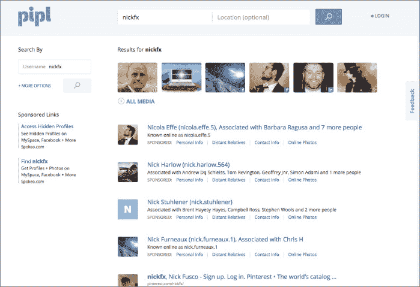

<figcaption>

[**图 2-5**](#R_c02-fig-0005) 你看到他了吗？

</figcaption>

</figure>

只需快速浏览一下，我们可以看到第一张图片显示的是正确的“Nick”，仅四行之后，我们看到 Nick Furneaux 与 Chris H(我想知道那是谁)和一个全新的用户名相关联。

在我们开始之前，让我们看看当我点击我们知道是 Nick 的图片时会发生什么。结果如图[图 2-6](#c02-fig-0006) 所示。

 <figure>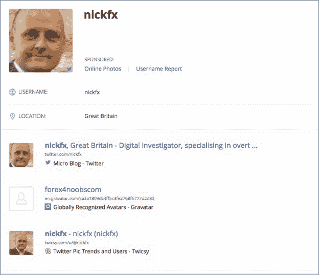

<figcaption>

[**图 2-6**](#R_c02-fig-0006) 确认

</figcaption>

</figure>

只需点击一下，我们就可以确认我们找到了正确的人以及他的位置。OSINT！我们知道他住在哪里。

现在，在结果中后退一页，点击下面的第四个链接。这揭示了什么？看一下[图 2-7](#c02-fig-0007) 。

 <figure>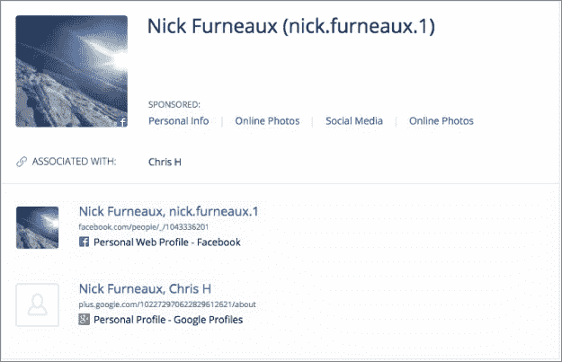

<figcaption>

[**图 2-7**](#R_c02-fig-0007) 更多 OSINT！

</figcaption>

</figure>

我们这里有些很棒的东西，不是吗？一个脸书·佩奇和一个我们之前不知道尼克有过的爱好。他是滑雪板运动员。他一定很喜欢克里斯·H 这个角色；他似乎无处不在。

当我点击脸书链接时，迎接我的是更多的信息！

*   他住在英国布里斯托尔。
*   我可以看到朋友的名单。
*   我找到了一个新用户名:nick.furneaux.1。

当我回到 pipl.com，输入他的名字和他在英国布里斯托尔的已知位置时，我得到了更多关于他的信息:

*   以前的工作
*   LinkedIn 个人资料
*   又一个用户名
*   他上学的地方

只需点击几下，我就有了大量关于尼克的信息，这些信息肯定会有助于建立他的个人资料。我能得到更多信息吗？

接下来，我跳到一个名为[webmii.com](http://webmii.com)的网站。WebMii 的整个目标是帮助你看到人们的在线可见性。在那里搜索“Nick Furneaux”会返回你在[图 2-8](#c02-fig-0008) 中看到的结果。

<figure>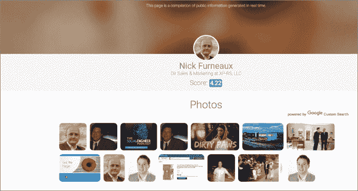

<figcaption>

[**图 2-8**](#R_c02-fig-0008) 更多尼克的信息

</figcaption>

</figure>

马上，我注意到一些事情:Nick 的可见性得分是 4.22(这并不是很高，因为它是满分 10)。但是点击它会显示出*在*的时候他是最明显的(见[图 2-9](#c02-fig-0009) )。作为一名业余爱好者，尼克最受欢迎的时候会激起我的兴趣——我想知道在那段时间他的生活发生了什么。

<figure>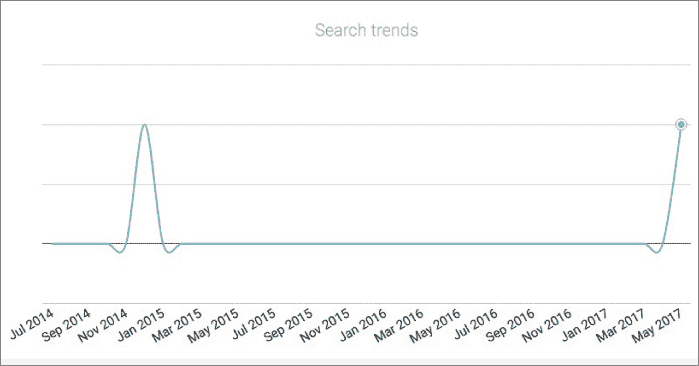

<figcaption>

[**图 2-9**](#R_c02-fig-0009) 尼克什么时候流行起来的？

</figcaption>

</figure>

回到[图 2-8](#c02-fig-0008) 中所示的图像，还有一些其他的数据需要收集:

*   第一张图片链接到 Twitter。
*   第三张图片链接到一个采访尼克的播客。这是*社会工程师播客*，我听说它真的很棒(又一个无耻的插件)。
*   许多其他图片链接到加拿大 LinkedIn 页面，与我们感兴趣的 Nick Furneaux 无关。
*   第五张照片很奇怪:一个穿着某种动物连体衣的年轻人。那是什么？

点击第五个链接，我会看到一个由 AFB 制作公司制作的音乐视频。当我点击更多按钮时，我会看到图 2-10 中显示的内容。

<figure>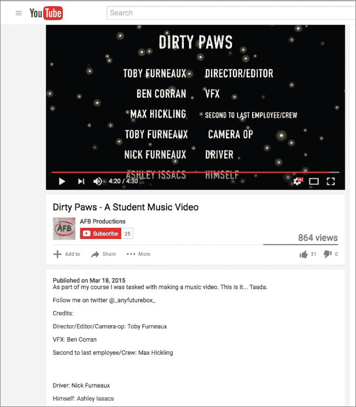

<figcaption>

[**图 2-10**](#R_c02-fig-0010) 更胜一筹！

</figcaption>

</figure>

这个视频似乎是由一个叫托比·弗诺的家伙制作的(同一个姓！)，而视频中的司机不是别人，正是尼克·弗诺(Nick Furneaux)。当然，这一发现打开了另一个探究托比是谁和 AFB 是什么的兔子洞。人们很快就意识到托比是尼克的儿子，他经营着一家名为“未来盒子”(简称 AFB)的小型制作公司。

一个好的攻击者会在他们的信息中包含所有这些细节，因为家庭成员(尤其是目标的孩子)通常是攻击媒介的重要资源。

再次参考图 2-8。尼克的照片出现在我偶然发现的几个地方。这张图片可能会带来更多的资源，所以我抓取了这张图片的实际 URL，并将其加载到反向图片搜索中，您可以通过以下步骤完成:

1.  右键单击图像。
2.  单击查看图像。
3.  再次右键单击，然后单击复制图像位置。
4.  转到`[www.google.com](http://www.google.com)`并点击图像。
5.  单击“通过 URL 粘贴图像”,然后粘贴您在步骤 3 中复制的图像的 URL。

您应该会看到一个类似[图 2-11](#c02-fig-0011) 的页面。

<figure>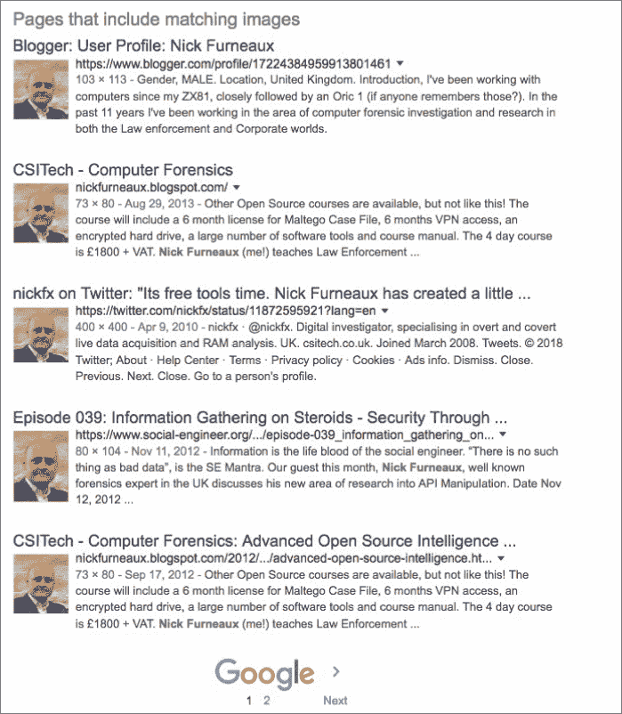

<figcaption>

[**图 2-11**](#R_c02-fig-0011) 那可是整整一个洛塔尼克。

</figcaption>

</figure>

除了看到他经常使用相同的头像，我还发现尼克有一个博客页面，并在法医页面上写了东西。当我点击辩论页面的链接时，我找到了几年前对尼克的采访，采访以他的电子邮件和网址结束。

当我在 WHOIS 上快速查找 Nick 的网站域名时，它显示了您在[图 2-12](#c02-fig-0012) 中看到的内容。

<figure>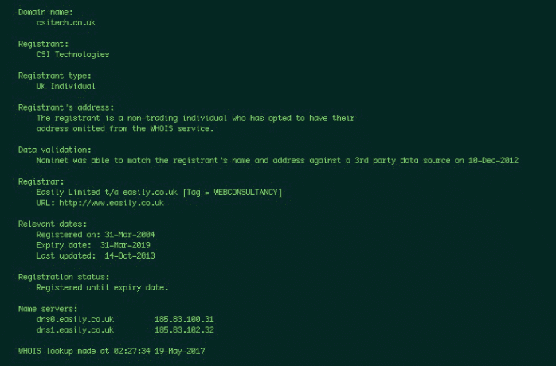

<figcaption>

[**图 2-12**](#R_c02-fig-0012) 你是谁？

</figcaption>

</figure>

Nick 拥有这个网站已经很长时间了，而且不会很快到期。有趣的是(也是聪明的是)，尼克将他的领域私有化了。这意味着记录上没有任何信息；只是他的公司名称，我们已经知道，他是一个在英国的个人。

<aside>

* * *

## 事实

**有多种方法可以执行 WHOIS 查找。如果你使用 Linux 或 Mac，你可以直接在终端输入 whois *域名*(用实际域名替换*域名*)。或者你可以使用免费网站。有好几个可以选择，但是我最常用的是** `[http://www.whois.net](http://www.whois.net)` **。** * * * </aside>

我刚刚向你们展示的这种信息收集方式在社会工程师的世界里非常普遍。想想为什么会这样。只需点击几下，我就能发现目标的大量有用信息。

诚然，我没有找到 Nick 所有密码或私人照片的链接(感谢上帝)，但我确实找到了足够的信息，如果我想用网络钓鱼或视觉攻击来攻击 Nick，这些信息真的很有帮助。

就这样吗？绝对不会。进入擂台的是世界重量级冠军说到 OSINT。 #### *进入谷歌*

谷歌。光是这个词就足以让一个社会工程师开心地咯咯笑了。好吧，好吧——那幅脑海中的画面相当令人不安。所以，也许把咯咯笑的想法放在一边，把它想成是充满知识的快乐的无声傻笑。

为什么呢？谷歌就像一个无所不知的先知。她知道你做过的所有事情，存储它们，甚至在你试图删除它们时缓存它们(你知道，为了安全起见)。

<aside>

* * *

## 谷歌事实

**谷歌强大。它拥有大约 88%的搜索广告市场份额。据谷歌称，该搜索引擎已经索引了超过 100，000，000 千兆字节的网站** `([www.google.com/search/howsearchworks/crawling-indexing](http://www.google.com/search/howsearchworks/crawling-indexing))` **。** * * * </aside>

拥有如此强大的力量和数万亿的索引网页，一个小小的社会工程师如何找到他或她需要的微小数据呢？在我回答这个问题之前，我需要给你简单解释一下谷歌(或者任何搜索引擎)是如何工作的。

##### 搜索引擎之谜揭晓！

这一部分真的没有什么神秘可言。标题有误导性。你可能已经明白了搜索引擎是如何工作的，但是万一你不明白，这里有一个快速简单的解释。

搜索引擎使用叫做蜘蛛的小代码。蜘蛛“爬行”(我没有编造这种东西)通过开放网络上的每个网页，并缓存他们被允许访问的内容。有一些特定的文件，比如``robots.txt`` ，可以阻止蜘蛛索引某些区域，但是大多数其他区域都被索引和缓存。

这个缓存被放入一个数据库，当你在搜索框中输入一个搜索词时，它会提供你在[图 2-13](#c02-fig-0013) 中看到的结果。

<figure>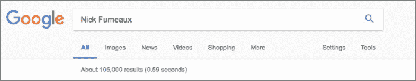

<figcaption>

[**图 2-13**](#R_c02-fig-0013) 他是 baaacccckkk。

</figcaption>

</figure>

我来指出[图 2-13](#c02-fig-0013) 中的几个关键点。首先，搜索在 0.59 秒内返回了 105，000 个结果。它怎么能在 0.59 秒内搜索 30 万亿个网页？请记住，这些页面已经缓存在数据库中，这使得搜索速度非常快。

抓取 105，000 个网页不仅不太可能，而且很可能是不可能的。所以，让我告诉你关于运营商。 ##### 输入运算符

谷歌创造了一套叫做*操作符*的搜索术语，用来限制谷歌搜索的内容。把它想象成使用放大镜和显微镜的区别。两者都能让你更接近你想要观察的物体，但如果你真的想专注于细节，显微镜是个不错的选择。这些运算符是搜索的显微镜。

以下两个网站列出了所有对 Google 有用的操作符(甚至对 Yahoo！还有 Bing):

*   `[https://support.google.com/websearch/answer/2466433?hl=en&ref_topic=3081620](https://support.google.com/websearch/answer/2466433?hl=en&ref_topic=3081620)`
*   `[www.googleguide.com/advanced_operators_reference.html](http://www.googleguide.com/advanced_operators_reference.html)`

为了方便起见，这里列出了我认为最有用的运算符:

*   ``intext`` :该操作符在被搜索的网页或文档的“文本”中搜索其后的任何内容。例如，如果您键入``**intext:csitech**`` ，Google 会搜索该短语的所有匹配项。
*   ``site:`` 这个操作符把你的搜索词限制在你列出的网站上。例如，如果你输入``**site:[csitech.co.uk](http://csitech.co.uk)**`` ，谷歌只搜索该域名，不搜索其以外的任何内容。
*   ``inurl:`` 这个操作符听起来可能类似于``site`` 操作符，但是它将您的搜索限制在任何包含您键入的搜索词的 *URL* 中。如果你输入``**inurl:[csitech.co.uk](http://csitech.co.uk)**`` ，搜索还会包括任何网址中含有``[ccistech.co.uk](http://ccistech.co.uk)`` 的网站。例如，如果有一个名为``[forensicsmag.com/csitech.co.uk/interviews](http://forensicsmag.com/csitech.co.uk/interviews)`` 的网站，它将在这次搜索中返回，但不会在使用``site`` 操作符的搜索中返回。
*   ``filetype:`` 这个操作符就像它听起来那样——它将你的搜索限制在你选择的文件类型。
*   ``cache:`` 这个操作符搜索您列出的域、文件或其他工件的缓存版本。
*   ``info:`` 这个操作符给你你在这里列出的域名的信息。

像大多数涉及软件的事情一样，是有规则的。谷歌搜索也不例外。

*   搜索词后跟运算符、冒号和空格。例如，如果您搜索``**site:[whitehouse.gov](http://whitehouse.gov)**`` ，您将搜索范围限制为``[whitehouse.gov](http://whitehouse.gov)`` 。但是如果你搜索``**site: [whitehouse.gov](http://whitehouse.gov)**`` ，你把搜索限制在冒号后面的空格(``:`` )，这是无效的。
*   您可以在运算符前使用连字符(``-)`` )来从您的搜索中删除这些结果。例如，如果您知道想要查找所有 csitech 参考资料，但不希望在``.com`` 空间中有任何参考资料，您可以尝试使用以下搜索来限制您的结果:``**inurl:[csitech.co.uk](http://csitech.co.uk) –[site.com](http://site.com)**`` 。
*   如果您的搜索词不止一个单词，并且您希望所有单词都包含在搜索中，则必须使用引号。例如，如果我想搜索 Nick Furneaux，我可以尝试使用``**intext:"Nick Furneaux"**`` 在我的``intext`` 搜索中包含名字和姓氏。
*   按照 Google ( `[https://support.google.com/gsa/answer/4411411#requests](https://support.google.com/gsa/answer/4411411#requests)`)的说法，允许的搜索词条数量是有限制的。默认为 50，上限为 150。(但老实说，如果你正在搜索 100 个以上的搜索词，你可能需要帮助。)

相信我，还有比我在这里列出的更多的搜索词和其他好东西。谷歌是一个强大的工具，我可以花很多时间去钻研它的每一个小角落。但是我们需要回到我们的主题。让我们看一些例子，看看我们能找到什么。 ##### 限制胜利

当我在本章早些时候停止搜索尼克·弗诺的信息时，我正在创建一个关于他的不错的简介。谷歌能再次确认我的发现或者提供更多信息吗？

我在至少一个社交媒体上发现了一些信息，比如他的名字和昵称。如果我把这两个放在一起搜索，看看能找到什么呢？在谷歌搜索框中输入``**intext:"Nick Furneaux" intext:nickfx**`` ，会出现如图[图 2-14](#c02-fig-0014) 所示的结果。

 <figure>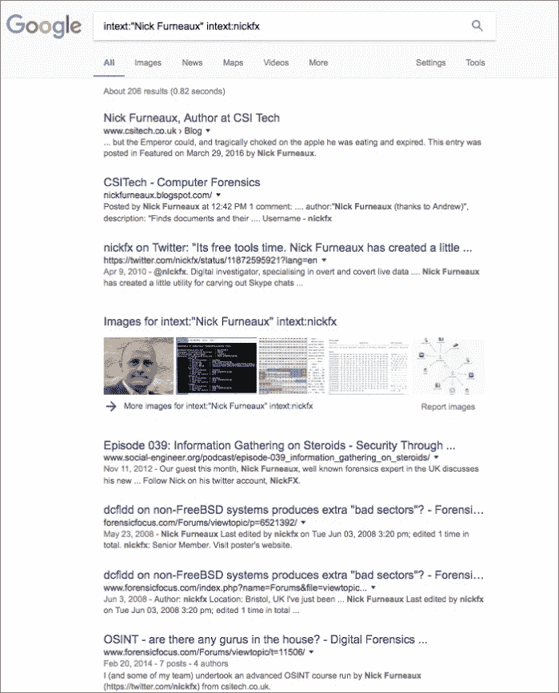

<figcaption>

[**图 2-14**](#R_c02-fig-0014) 0 到 206 在. 82 秒内持平

</figcaption>

</figure>

不到一秒钟，我就有了 206 个结果。谷歌搜索的一个特点是能够看到与你的搜索相关的图片。点击更多图片链接可以显示一些有趣的结果。在这种情况下，图像可以带我到关于尼克的页面。

但是我已经知道了很多关于尼克的信息，所以让我们看看我还能找到什么。我把搜索词改成``**intext:"Nick Furneaux" intext:UK**`` 。结果如图[图 2-15](#c02-fig-0015) 所示。

 <figure>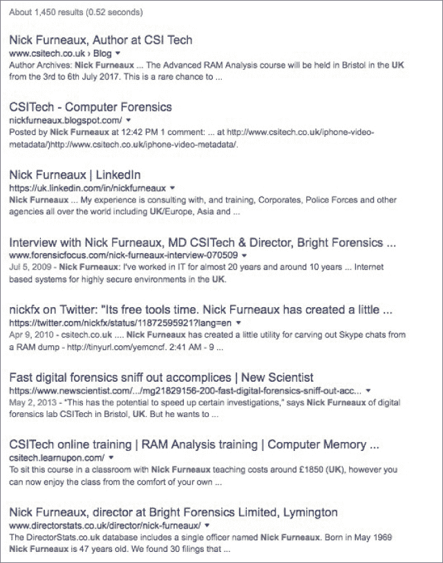

<figcaption>

[**图 2-15**](#R_c02-fig-0015) 我们变暖了吗，尼克？

</figcaption>

</figure>

第一个结果告诉我，他正在一个叫布里斯托尔的小镇训练。最后一个结果提供了一家公司的名称，Nick 可能仍然是其中的一部分，以及他的完整出生日期，甚至是一个地址——你猜对了——布里斯托尔。

该页面还包括他可能在该公司工作的家人或朋友的列表。这是一个信息宝库。

将先前搜索中的“``**UK**`` ”更改为“``**Bristol**`` ”将引导我们找到他的邮政编码等信息，甚至可能与他同住的其他家庭成员的一些姓名。

在我继续之前，还有最后一个例子。如果您执行以下 Google 搜索，您认为第一个结果会是什么？

```
`intext:"Nick Furneaux" site:linkedin.com intext:Bristol`
```

我做这个搜索时得到的第一个结果是尼克的 LinkedIn 页面。使用谷歌操作符，你可以添加你从先前的搜索中获得的少量信息，以便不断找到你需要的信息。

我想向你展示更多关于谷歌的力量，但由于尼克仍然是我的朋友(或者至少我上次检查时他是)，我将把注意力从他身上转移到一般搜索上。 ##### 但是标题上写着“私人”

你听说过 RSA 私钥吗？RSA 密钥是基于专有算法的密钥。它由两部分组成:帮助识别它的公钥和打开王国大门的私钥。

根据这个定义，RSA 私钥用于建立安全连接。

所以，你会认为如果你搜索 RSA 私钥，你会发现没有，对不对？但是使用下面的搜索

```
`BEGIN (CERTIFICATE|DSA|RSA) filetype:key`
```

给你 3000 多个结果，如图[图 2-16](#c02-fig-0016) 所示。

 <figure>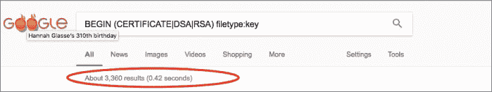

<figcaption>

[**图 2-16**](#R_c02-fig-0016) 为什么称之为私有？

</figcaption>

</figure> ##### 但是上面标着机密

通常，政府实体用特定的分类来标记文档，以指示公众是否应该看到它们。像“机密”和“绝密”这样的标记通常表明这些文件不是供大众使用的。你会认为你在网上找不到这些。(你知道他们怎么说那些假设的人……)

但既然我喜欢监狱围墙外的生活，就说我们只是想看看有没有带密码的文件，应该是保密的吧？

如果我搜索 site:gov . IR intext:password filetype:xls 会怎样？这应该会将我的搜索限制在任何 gov.ir 域，并且只查找包含单词*密码*的 XLS 文件。结果如图[图 2-17](#c02-fig-0017) 所示。

<figure>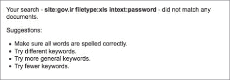

<figcaption>

[**图 2-17**](#R_c02-fig-0017) 哪里出了问题？

</figcaption>

</figure>

嗯，这好像不对。为什么伊拉克政府服务器中的一份文件会有英文单词*密码*？啊，但是如果我用`[translate.google.com](http://translate.google.com)`网站把单词*密码*翻译成波斯语呢？有帮助吗？[图 2-18](#c02-fig-0018) 显示了结果。

 <figure>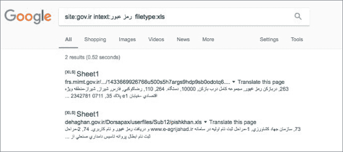

<figcaption>

[**图 2-18**](#R_c02-fig-0018) 多语言谷歌搜索

</figcaption>

</figure>

谷歌的力量在这里得到了真正的展示。我不需要懂波斯语，甚至不需要用波斯语搜索。我只需要告诉它去寻找那个单词，我就能找到文档。 #### 网络摄像头:是时候停止穿着内衣跳舞了

人们希望在家里安装网络摄像头的愿望越来越强烈。人们用它们来监控他们的孩子、保姆和宠物；为了安全；以及更多。

这些相机中的许多都是默认设置出售的，这使得它们容易受到攻击，并且是敞开的。有时与相机一起出售的软件也有很多不尽人意的地方。对用户来说容易吗？是的。但对攻击者来说也很容易。

一个这样的软件是 webcamXP。顾名思义，它可以在 Windows XP、Vista、7、8、9、10、Server 2003、2008 和 2012 上运行。根据其网站，该软件的最后一次更新是在 2016 年。考虑到这一点，它今天应该不会太受欢迎，所以你会认为现在搜索这些不会给你太多，对不对？

*对吗？！*

于是，我搜索``intitle:"Webcam 7" inurl:8080 -intext:8080`` ，[图 2-19](#c02-fig-0019) 显示了结果。

<figure>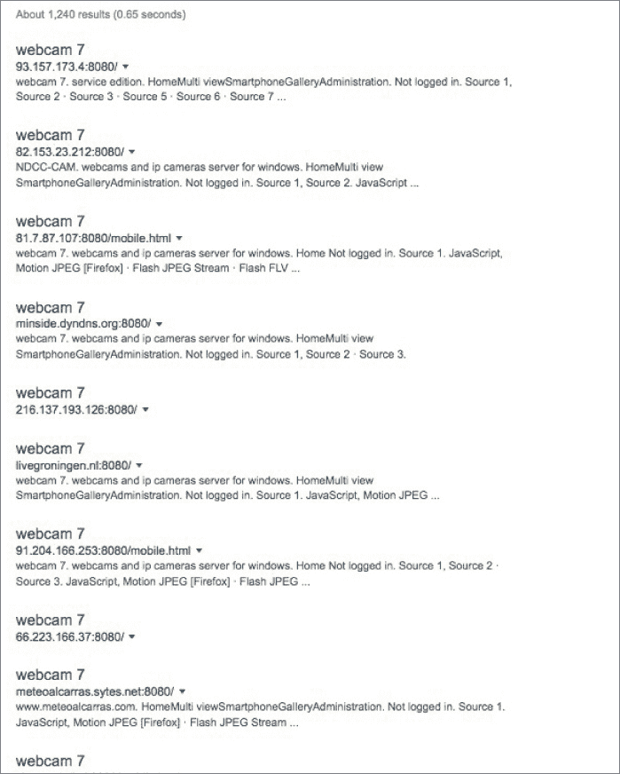

<figcaption>

[**图 2-19**](#R_c02-fig-0019) 网络摄像头琳琅满目！

</figcaption>

</figure>

诚然，这些网络摄像头中的许多是为了在线，是为了让公众看到。他们正在流式传输交通场景或滨水区和其他区域。但是有些人设置网络摄像头供个人使用，并让它们在他们的院子或家里开着。关键是，如果这些网络摄像头没有得到妥善保护，任何有一点技巧的人都可能在监视你，而你甚至不会知道。 #### *英特尔的其他来源*

通常当我说到这一点的时候，人们的反应是恐惧和好奇交织在一起，想知道在谷歌上还能找到什么。我不想列出我做过的每一次谷歌搜索，但我可以告诉你一些我只用谷歌搜索很容易发现的事情:

*   某个家伙看着他的大麻植物生长的网络摄像头
*   人们手机里的私人照片
*   人们共享的音乐和电影目录
*   包含完整密码、出生日期和社会保险号的文档
*   文件中有成千上万的信用卡号码
*   完全打开加载了信息的 SQL 数据库
*   开放交通摄像头
*   开放电网和控制系统
*   一些儿童色情网站

这个清单可以一直列下去。 ### 另外两件事

单单这一节就可以自成一本书。但是在我继续讨论并结束这一章之前，如果我不提到另外两件事，那将是我的失职。

#### *机器人很酷*

当我还是个孩子的时候，我非常想要一个机器人。我想如果我能找到一个的话，R2D2 会是我最好的朋友。在这种情况下，我说的不是*那种*类型的机器人。我指的是``robots.txt`` 文件。

什么是``robots.txt`` 文件？这是一个网站所有者用来告诉爬行和抓取网站的蜘蛛或机器人什么是允许的，什么是不允许的文件。例如，在``robots.txt`` 文件中看到``Disallow`` 语句并不罕见，这表明机器人不允许缓存该文件夹。例如，[图 2-20](#c02-fig-0021) 就是`[whitehouse.gov](http://whitehouse.gov)`的``robots.txt`` 文件。

<figure>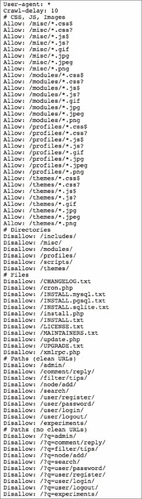

<figcaption>

[**图 2-20**](#R_c02-fig-0021)

</figcaption>

</figure>

现在像社会工程师一样思考一下。图 2-20 中的文件告诉你什么？

你可以看到哪些目录存在，但你也可以看到哪些目录他们不希望你访问，或者他们不希望谷歌缓存。

此外，像``mysql`` 或``pgpsql`` 这样的文件给出了网站在创建时使用的技术类型的指标。

现在，如果这是一个实际的目标(它是*而不是*——我重复一遍，它是*而不是*)，我们将进入其中的每个目录，以确保它得到了适当的配置，并且不允许我们在未经授权的情况下进入。我们会检查这些日志和文件，如果它们是可访问的，看看服务器中是否有任何错误配置。

我曾经做过一个中型公司的工作。这是罕见的“尽你所能，看看你能找到什么，然后不戴手套攻击我们”类型的测试。我从一点 OSINT 和一些谷歌搜索开始，我在他们的``robots.txt`` 文件中发现，他们在一个名为``admin`` 的目录中有一个``Disallow`` 语句。

只是为了检查一下，我输入了`[www.company.com/admin](http://www.company.com/admin)`，令我震惊的是，我被允许在没有凭证的情况下进入！该目录包含首席执行官的私人文件存储库，似乎他用它来共享旅行时需要的文件。其中包括合同、银行数据、他的护照照片以及许多其他敏感细节。

我找到了一份在过去几天内签署的合同。我购买了一个与真实公司名称相差一两个字符的域名，为签署合同的人设置了一个电子邮件，并用一个恶意文件和一封电子邮件欺骗了首席执行官，邮件中说:“我不确定我是否回复了完全签署的合同，但第 14.1a 节有一个问题。您能在里面看到并告诉我吗？”

 不到 15 分钟，首席执行官收到了这封邮件，打开它，然后就暴露了。然后他发邮件给那个假地址，说合同打不开，一直死机。渗透测试(又名笔测试)本应需要一周时间，但在大约三个小时内就结束了。

我打电话给首席执行官，我们的谈话是这样的:

| **首席执行官:** | 你好 |
| **我:** | 嘿保罗。我是社会工程的克里斯。我想和你谈谈钢笔测试… |
| **首席执行官:** | 哈！这么快就放弃了，克里斯？我知道我们是一块难啃的骨头。 |
| **我:** | 嗯，保罗，我们已经有了你的护照，出生日期，信用卡，进入你的银行，和一个远程外壳与网络上的管理员凭证。我想我应该打电话问问你是否真的想让我继续工作一周？ |
| **CEO:** | 来啊！你在瞎编！！几小时前才开始的。告诉我，点击给壳的失败者是谁？我想和他谈谈。 |
| **我** | 嗯，保罗…我使劲咽了一口唾沫，不确定自己是否能开出脑海中的玩笑。我不会对他太苛刻；他是个很酷的人。 |
| **CEO:** | 是吗谁啊。 |
| **我:** | 保罗，是你。 |

然后我向他解释了每一个细节，他很快意识到发生了什么。这个特殊的 pen 测试之所以胜出，很大程度上是因为一个``robots.txt`` 文件和一个错误配置的目录。 #### *这都是关于元，宝贝*

根据牛津词典， *meta* 被定义为“指其自身或其流派的惯例；自我指涉。”所以，元数据实际上是关于数据的数据。很有《T2》盗梦空间的风格，不是吗？

让我更简单地解释一下。元数据是关于您在搜索中找到的工件的信息。很多时候，这些数据提供了一些非常有趣的事实——许多可能不是故意放在那里的。

比方说，我做了一个非常良性的谷歌搜索来寻找包含密码信息的``.doc`` 文件。我偶然发现了这个叫做``FinalPasswordPolicy`` 的小文档。元数据会揭示什么？看看[图 2-21](#c02-fig-0022) 。

 <figure>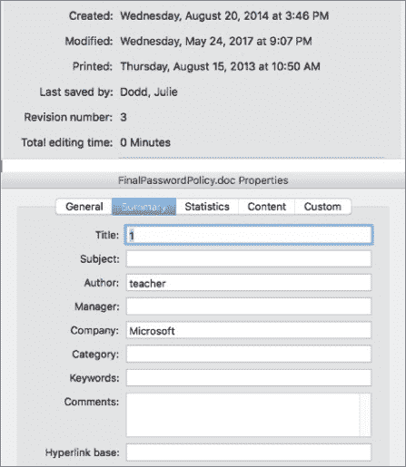

<figcaption>

[**图 2-21**](#R_c02-fig-0022) “你是什么-元？!"(看到我在那里做了什么吗？)

</figcaption>

</figure>

这些元数据告诉我们它的制作日期和时间、最后一个保存它的人、作者的名字/标题、文件修改了多少次，以及一些我在这里没有提到的其他信息。你可能会想，“那又怎样？”

嗯，对于一个社会工程师来说，仅仅是名字和文档类型就可能是巨大的情报。想想看:如果一位社会工程师发现了你刚刚发布的一项新的人力资源政策，会怎么样？元数据揭示了策略最后一次修改的时间(在本例中，甚至不到一个月)，谁编写的，以及何时发布的。当然，策略信息也在文档中。您认为一封看似来自保单作者并包含保单更新的网络钓鱼邮件会被点击几次吗？

看看[图 2-22](#c02-fig-0023) 。

<figure>

<figcaption>

[**图 2-22**](#R_c02-fig-0023) “不，真的。什么是超级你？!"

</figcaption>

</figure>

起初，你可能会想，“好吧。所以，我们要用一张辣酱优惠券来钓这个家伙吗？”没有。但是看一下元数据，在[图 2-23](#c02-fig-0024) 中显示。

<figure>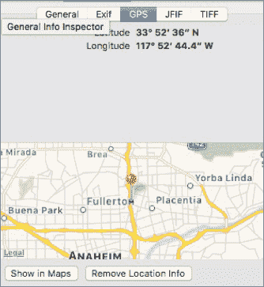

<figcaption>

[**图 2-23**](#R_c02-fig-0024)T5】答案是…

</figcaption>

</figure>

当你在网上找到一张看似无害的照片时，元数据会告诉你相机的类型、日期、时间以及照片拍摄地的 GPS 坐标。当你把这些坐标输入谷歌地图时…好吧，看看[图 2-24](#c02-fig-0025) 。

<figure>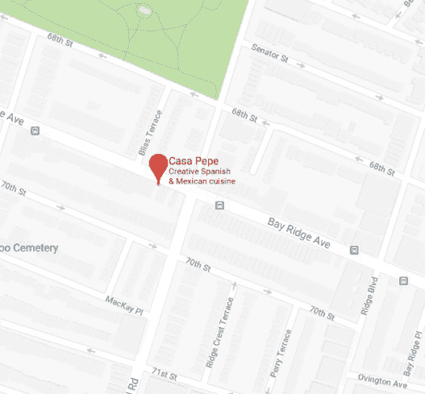

<figcaption>

[**图 2-24**](#R_c02-fig-0025) 如果你问我的话，我会说那是相当大胆的。

</figcaption>

</figure>

地图显示了佩佩餐厅的停车场，该餐厅恰好是该品牌辣酱的一个相当大的用户。

一个人用他的智能手机拍了张照片。他的智能手机打开了 GPS，并没有阻止相机应用程序将所有元数据嵌入照片文件的后端。当他将图片上传到他的社交媒体时，该文件包含了所有这些信息，因此也向全世界发布了这些信息。

你能看出其中的含义吗？想象一下，和你一起吃饭的不是你的好朋友，而是下面的一个人:

*   一家大型公用事业公司的首席执行官成为国家攻击的目标
*   一个亿万富翁的秘书，他有关于他的银行和转账权限的信息
*   你 15 岁的女儿给自己拍下流的照片

现在你能明白其中的含义了吗？无论你想到哪种情况，这些容易获取的信息很快就会变得危险。

我和我的团队一起工作过，我们的任务是执行 OSINT，然后攻击国防领域的高级目标。我们的目标不是让这个人妥协，而是测试他愿意采取一个他不应该采取的行动的程度。出于教育目的，我们会记录下所有的电话和点击。

Light OSINT 引导我们找到了他的社交媒体页面。当我们发现他是一个多产的推特发烧友，而且他喜欢用开着 GPS 的全新 iPhone 时，我们找到了宝藏。为什么这如此重要？当他从他去的每一个地方发微博时，Twitter 允许我们绘制出他一整天的位置。在几个小时内，我们知道了以下事情:

*   他每天早上最喜欢停下来喝咖啡的地方
*   他回家前去的健身房
*   他最喜欢的两家餐馆
*   他的家庭住址
*   他有多讨厌城市交通

还有更多信息，但前面列表中的信息对我们的攻击至关重要。首先，我们找到了一个与他的健身房域名相差一个字母的域名。我们设置了一封快速邮件，告诉他我们正在更新所有账户，他的信用卡信息不再有效。我们要求他“现在登录输入他的信用卡信息”，这促使他很快点击进入。

知道这个页面要被 404 out，我们就一直等到看到点击，然后打电话给他。对话大概是这样的:

| **来电者:** | 你好。是史密斯先生吗？" |
| **目标:** | 是的，它是。这是谁？ |
| **来电者:** | 我是在 Cold 健身房的 Sarah。我们今天早些时候发了一封关于系统升级的邮件。嗯，这封电子邮件有一个错误的网址，所以我们打电话给我们的客户道歉。我可以给你发一个新的链接，或者拿你的信用卡给你更新。对你来说什么更容易？ |
| **目标:** | 没问题，莎拉，这是我的卡号。 |
| **来电者:** | 谢谢你，史密斯先生！今晚见！ |

这种攻击奏效了，因为它触及了他熟悉的话题，而且是可信的。只要一点点信息，一个网络钓鱼，一个电话，我们就有了一次点击，一个信用卡号，以及另外五个向量，以备不时之需。

元数据功能强大，对社会工程师非常有用，所以我建议您确保在 OSINT 期间检查您获得的每个文件。

这可能令人望而生畏，尤其是当您处理大量文件时。我个人喜欢使用像 FOCA ( `[www.elevenpaths.com/labstools/foca/index.html](http://www.elevenpaths.com/labstools/foca/index.html)`)和马尔蒂戈(`[www.paterva.com/web7](http://www.paterva.com/web7)`)这样的工具来使这项工作变得更容易。

虽然我承诺不会在本书中深入讨论任何工具，但我觉得至少有必要简要介绍一下这些工具和另外两个有用的工具，我将在下一节中介绍。 ## 贸易工具

正如我在第一章中所说的，我决定不在本书中过多关注工具，因为工具经常变化。

然而，有四种工具在过去的 5 到 10 年里一直放在我的工具箱里，我觉得我甚至不提及它们都是错误的。尽管这些工具已经存在了很长时间，但它们的界面和功能已经发生了变化。如果我花大量的时间浏览每一个特性，那么当你看到这本书的时候，这些信息已经过时了。相反，我将把您指向工具的网站，在那里您可以获得教程并了解最新和最大的发展。我保证，这次旅行会很快，但它是你不想错过的拼图的重要部分。

### 设置

我记得和我的好朋友大卫·肯尼迪聊天。我告诉他，我希望有一个工具，让我可以钓鱼，并自动给他们一个有效载荷，获取凭证，或克隆任何网页。戴夫的回答是，“我想我能做到。”

不到 24 小时后，他就有了原型。从那一刻起，戴夫就带着所谓的 SET，或社会工程师工具包，好像这是他一生的使命。

他一直在更新——好像每天都在更新——而且他的内置功能让我最初的小想法看起来很蹩脚。这是一个惊人的工具，下载量超过 200 万次。

你可以从`[www.trustedsec.com/social-engineer-toolkit](http://www.trustedsec.com/social-engineer-toolkit)`那里得到工具和指令。 ### 英特尔技术

好吧，这不是一个真正的“工具”本身，因为它是我的好朋友迈克尔·巴泽尔收集的惊人的搜索引擎。

迈克尔在一些事情上是专家，但有两件事是他真正吃、呼吸和睡觉的:在网上找人和躲避在网上找你的人。老实说，有一次迈克尔告诉我，要从亚马逊买东西，我应该在墨西哥成立一家虚拟公司，这样我就可以获得不与我绑定的信用卡。

迈克尔建立了一个惊人的工具集，可以搜索从社交媒体，电话号码，IP 地址，甚至反向图像的一切。你可以在`[https://inteltechniques.com/menu.html](https://inteltechniques.com/menu.html)`找到这些工具，我建议你在那个网站上花一些时间。 ### 福查

FOCA 代表收集档案的指纹组织。早在 2010 年的 DEF CON 18 上，一小群巴西黑客发布了该工具，并在互联网上掀起了风暴。

迄今为止，世界上没有任何东西像 FOCA 一样。这是一个 Windows 专用工具，多年来经历了一些严重的起伏。有一次，我停止使用它，因为已经有一段时间没有更新了，也没有办法联系任何运行它的人(而且这个工具不是开源的)。

然后 ElevenPaths 的人接手了这个项目。他们做了更新，并于`[https://www.elevenpaths.com/labstools/foca/index.html](https://www.elevenpaths.com/labstools/foca/index.html)`在他们的网站上发布。遗憾的是，FOCA 仍然只支持 Windows，但如果你不使用 Windows，建立一个虚拟机是值得的。

FOCA 抓取文件和提取有用元数据的速度令人惊叹。快看。 ### 马尔特戈:他们的祖师爷

冒着听起来像 Maltego 的商业信息片的风险，我喜欢这个工具。真的。Paterva 的人做了一些你很少看到的事情:他们制作了一个令人惊奇的工具，发布了一个较小的免费版本(这也同样令人惊奇)，并保持商业版本的更新，所以它总是在向前发展并且非常有用。

你会问，什么是马尔蒂戈？它是一个帮助你从网上来源收集数据的工具，然后给你一个交互式的图表来显示它。它可以帮助你编目，跟踪，调查，并与公共情报来源建立联系。

Maltego 让我的工作变得更加容易，这个工具使用起来既简单又有趣。此外，Paterva(生产 Maltego 的公司)的人提供令人惊叹的培训视频和课程。最后，Maltego 适用于所有平台。

您可以在`[www.paterva.com/web7/downloads.php#tab-2](http://www.paterva.com/web7/downloads.php#tab-2)`从 Paterva 网站查看并下载。我建议你从 Maltego Classic 开始。 ## 摘要

知识当然就是力量，可能没有比 OSINT 更好的关于你的目标的知识来源了。如果你遵循本章的原则，练习并磨练这些技能，你就能成为一名高手，甚至能发现隐藏在互联网上的微小细节。

你已经做完了所有的工作。你已经清晰地编目、收集和记录了每一件作品。你认为你已经找到了将成为你的矢量的那块，你需要开始准备你的借口。分析你发现的数据并寻找目标沟通风格的关键指标会有什么帮助？那是下一章的主题。 