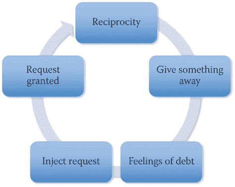
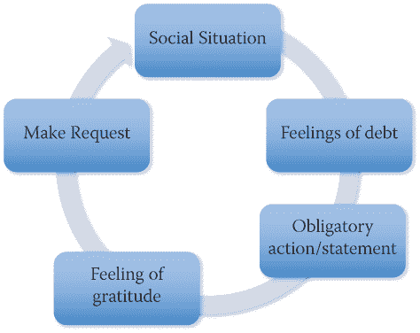
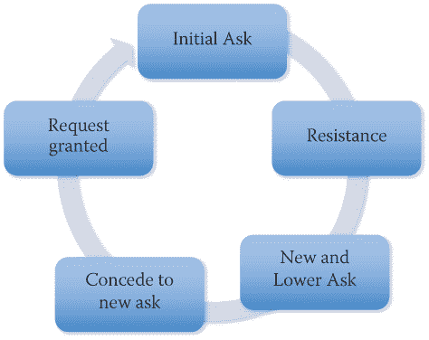
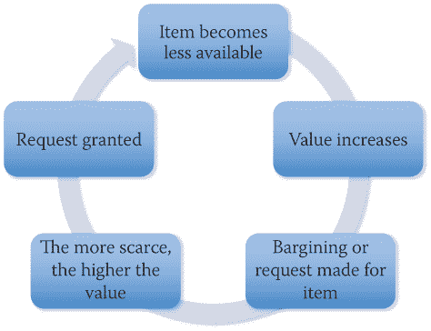
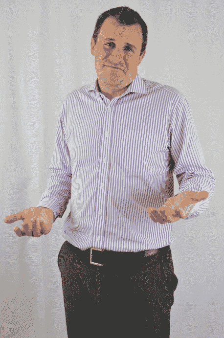
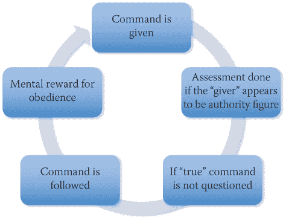
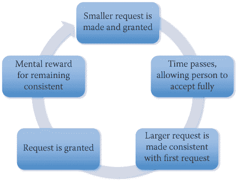
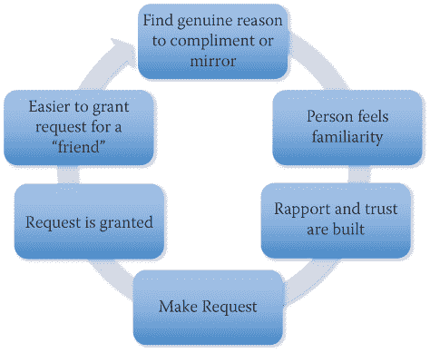
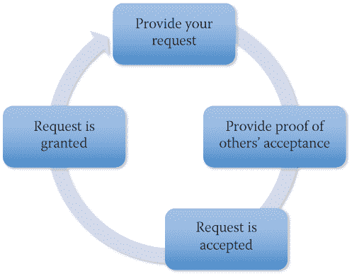

<section epub:type="chapter" role="doc-chapter">

<header>

# 6
T5】影响下

</header>

<section> > 我影响力的秘密一直是保持秘密。
> 
> ——*大理救世主*

这一章包括了影响和操纵，但是现在，我想把重点放在影响上。你如何定义影响力？

我把它定义为“让某人*想要*做你想要他们做的事情。”这意味着这个人有想法去做你想让他们做的事情，或者至少这是他们记忆中的方式。因为这个人认为这个想法是他或她自己的，这是一个很棒的想法，而且这个人致力于这个想法。

罗伯特·恰尔迪尼博士是历史上在这个问题上最有头脑的人之一。几十年来，他一直在研究、写作和完善影响艺术。在社会工程师播客的第 86 集里，我很荣幸地邀请到了鲍勃，正如他要求的那样。这是我经历过的最有趣的对话之一，也是我受益匪浅的一次。

鲍勃写了一本书，我今天还在用，书名是*影响:说服心理学*(威廉·莫罗公司，1984)。在书中，他讨论了六个可定义、可教授和可追踪的影响原则。作为我实践的一部分，我把鲍勃的六个原则分解成八个原则。

在这一章中，我首先定义了这八个原则，因为它们已经被像恰尔迪尼博士这样的伟大思想家研究过了。我遵循每个原则的定义，将每个原则与社会工程联系起来。

在我讨论了每个原则之后，我会谈到框架，它与影响力密切相关。简而言之，框架是你的信念、观点和想法的基础。在这一章的后面，我将讨论如何在你的目标中改变那些帧。我也讨论操纵，更黑暗更邪恶的表亲影响，然后我总结一切，给你一些提示，并送你去掌握这种惊人的天赋。

<aside>

* * *

<section class="feature1"> ## 技能课

<section> 在我的职业生涯中，我有机会用我的技能帮助追踪、诱捕和阻止那些剥削和伤害儿童的人。一个案例清楚地帮助定义了“影响”,如“引言”一章所述。

对于这个我们称之为 OpRentalCar 的项目，我们需要得到一个我们知道正在贩卖儿童的人的家庭住址。当局已经通过其他方式证明了他的参与，但他经常搬家，以至于他的家庭住址都不清楚。我们知道他租了一辆车，准备乘飞机去某个城市。我们的目标是找到他租车的地方，并试图影响代理商给我们他的家庭住址。

我的借口是我是镇上一家比萨饼店的老板。我的故事是，我在餐馆里发现了一个属于我们目标的 iPad，我想把它还给他，但它被锁上了。我们知道获取地址会很困难，所以我计划向租赁代理人提供免费食物，以换取如何找到那个人的好主意。

费了些功夫，但我终于找到了一家租车公司，证实这辆车是从他们那里租的。我和租赁代理的部分对话是这样的: </section>

* * * </section>

</aside>

<aside>

* * *

<section class="feature3">

# 注意

为了安全起见，我用虚构的名字代替了真实的租赁代理和餐馆名称。

| **我:** | 听着，我现在有麻烦了，所以我有一个免费的披萨来交换你可能有的任何好主意… |
| **代理人:** | 我喜欢大托尼的披萨！我能怎么做呢？ |
| **我:** | 我会把这台 iPad 直接寄回给他，但是我没有他的家庭住址。所以如果我把它拿给你，你把它运回去怎么样？ |
| **代理人:** | 托尼，我不能。我真的很抱歉，但是我们有一个政策，我们不能对我们在车里没有找到的东西负责。 |
| **我:** | 是啊，有道理。该死。我不确定现在该做什么。你觉得我该怎么做才能把这个送到他家？ |
| **代理人** | *【思考了几秒钟，然后低声说道】:*听着，我不应该这么做，但是如果我给你他的地址，你直接给他发货呢？ |
| **我:** | 史蒂夫，你是个天才！我怎么没想到呢？你猜怎么着当我们完成后，这里有一张 25 美元的礼品卡等着你。 |

注意，在对话中，我两次打断了代理人给我地址的想法，但后来我装聋作哑，而不是直接问他们要。这是一个很好的例子，融合了影响原则，同时插入了获得地址的想法，这使得这看起来好像是目标的想法，这反过来使他更容易坚持下去。

当我谈论这一章的主题时，你会注意到许多与融洽原则的相似之处。

* * *

</section>

</aside>

<aside>

* * *

<section class="feature3">

# 注意

我发起了一个名为无辜生命基金会的非营利组织 ( `[www.innocentlivesfoundation.org](http://www.innocentlivesfoundation.org)` ) **，致力于从掠夺者手中拯救儿童。基金会成员是信息安全专业人士，他们与执法部门密切合作，揭露那些试图隐藏在互联网上剥削儿童的人。本书中讨论的技巧被广泛用于揭露那些掠食者和帮助拯救儿童。**

* * *

</section>

</aside> </section>

<section> ## 原则一:互惠

这个原则非常类似于建立和谐关系中的互惠利他主义。它基于人类想要回报那些做好事或给我们喜欢的东西的人的方式。根据恰尔迪尼的说法，即使我们不想要别人送给我们的东西，我们的大脑也会不安，直到我们觉得已经回报了送礼者。营销人员知道这一点，并一直使用这一原则。

<section> ### 行动中的互惠

想想上次你在杂货店拿到免费样品的情形。设立样品摊位的商店或营销公司知道，大多数人在收到免费样品后更倾向于购买该产品。

人们也更倾向于服从命令或在受到称赞后询问。

我和我的妻子和女儿在伦敦工作。我们购买了高级经济舱机票，以便相对舒适地乘车回家。像听话的小旅行者一样，我们提前三个小时到达机场。

我推着我们的行李车，满满的行李在毁灭的边缘摇摇欲坠。当我接近售票柜台时，我撞上了地板上的一个小凸起，我们所有的包都砰的一声掉在了地板上。我只是开了一个响亮的玩笑，说:“M5 号上的事故！”

因为我的美国口音，所有的英国人都嘲笑一个美国人用当地的路名开玩笑的讽刺。售票柜台的一个女人从她的电脑前抬起头，微笑着，叫我们过去。我拿出我们的护照要交给他们，我的妻子开始告诉她她有多爱她的围巾。

我妻子不是社会工程师。她是一个天生的令人惊讶的、美丽的、了不起的人，她真正地爱着人们。所以，她真诚地赞美这位女士，说:“哇，你的妆化得太完美了，”以及“我喜欢你的围巾和你的眼睛很相配。”

我看着这种互动，看到这位女士的非语言表现，她充满了自豪、快乐和大脑释放的所有有益化学物质。我立刻想到，“这是你的时间，克里斯——提出请求。”

当我递上我们的护照时，我靠向我的妻子，对她说，“我美丽的妻子和我都很好奇——在回家的航班上，把我们升级到头等舱要花多少钱？”

这可不是闹着玩的:售票员开始疯狂地打字。她给了我们三张免费的头等舱机票，在三个小时的等待时间里，我们可以自由进出休息室。

想一想:一些在幽默之前和请求之后的赞美。为了胜利的回报！

我对互惠的说明在图 6-1 中。

 <figure>

<figcaption>

[**图 6-1**](#R_c06-fig-0001) 礼尚往来

</figcaption>

</figure>

只有遵循这条道路，互惠才会起作用。你不能过早地插入命令或请求。你只能在产生了债务感之后才能提出请求，因为这些债务感增加了请求被接受的机会。 </section>

<section> ### 利用互惠作为社会工程师

你可能有 500 万个关于如何运用互惠原则的想法在你脑海中游过。让我给你一个小提示:你能提出的要求水平取决于礼物对接受者的感知价值。

花点时间理解这一点。记住，恰尔蒂尼说，不管对方是否想要礼物，他都会有回报的感觉。如果接受者重视礼物，他或她会觉得更有必要回赠更大或同等价值的礼物。

我是一小群也是威士忌爱好者的黑客中的一员。当我们聚会时，我们有时会交换几瓶威士忌。我们每个人都给其他人带了一些东西，所以我们每个人都带着不同于其他人的东西回家。通常，我们会设定一个主题，这样我们中的一个人不会带价值一百美元的东西，而另一个人会带价值更高的东西。这使得互惠原则处于控制之下，没有人会觉得亏欠更多或更少。

作为一名社会工程师，当务之急是你首先要搞清楚目标人或公司看重的是什么。你需要考虑到这一点来准备你的借口。当你给目标一个拥有有价值的东西的机会时，你更有可能成功。

例如，在我之前提到的 OpRentalCar 任务中，我很快发现目标非常喜欢托尼的披萨。有了这些，我提出用免费食物来交换他的好主意。我没有说:“如果你给我*【顾客的】*地址，我就给你披萨。”我为什么不这么做？

原因很简单:在这一点上，我们没有建立融洽的关系。在我与目标建立融洽关系之前询问客户的地址之类的东西会导致目标提升所有力场，打开防护罩，启动红色警报。

通过提供免费食物，然后插入我真正想要的东西，我允许目标“提出”我需要的确切想法。

 <aside>

* * *

<section class="feature1"> ## 有趣的事实

<section> 我不想让代理商去托尼披萨店却收不到礼券。挂了他的电话后，我打电话到托尼的店里，以他的名义买了一张 25 美元的礼券，并告诉他们把礼券放在那里，等代理人来认领。 </section>

* * * </section>

</aside>

这是我运用这一原则的另一种情况:我不得不刺死一位首席执行官。在 OSINT 阶段，我发现他是一个狂热的跑步者，喜欢跑马拉松。我发现这一点是因为他在跑马拉松时拍了大量的自拍照。

我的鱼叉式网络钓鱼来自一家营销公司，该公司首席执行官最近参加了一场马拉松比赛。这条消息是这样说的，“在您最近参加的儿童马拉松比赛中，我们拍摄了一些照片，希望用于营销和推广。我们需要你的同意才能使用这些照片。请点击此处查看照片并批准。”如果我没记错的话，CEO 收到后不到 60 分钟就点击了链接。

当你发现这个人真正看重的是什么时，目标会毫不犹豫地答应你的要求。 </section> </section>

<section> ## 原则二:义务

义务听起来非常接近回报，但有一个小的区别。鉴于回报是一种因礼物或创造行为的有价值的东西而产生的负债感，义务是同样的感觉，但它基于社会规范或预期行为。

<section> ### 诉讼中的义务

我曾问过世界各地的学生以下问题:如果你在交通中，你让一个开车的同伴并到你前面，他或她有义务做什么？他或她必须做什么？

学生们回答说，驾车者必须挥手、竖起手指或点头，但所有这些手势都意味着一件事:驾车者必须(或有义务)对你刚才表现出的善意表示某种程度的尊重和欣赏。如果他们不这样做，会发生什么？

我在 DC 的华盛顿州，在一条美丽的四车道高速公路上开车去参加一个会议，交通被迫并入一条车道。交通来了个急刹车。我决心不让它打败我，所以我一点一点地走着，把音乐开大了。其他汽车试图从入口匝道并入高速公路，我的司机同伴们感觉不太无私。他们不让人们融合。所以，我放慢速度，打着灯，让下一个等着并线的人进来。

当他把车开到我前面时，我透过他的后窗向里看，看他在后视镜里有无点头、挥手或欣赏的表情。当我没有得到它的时候，我感到我的血液开始沸腾。我的脸变红了，我的驾驶变得更加咄咄逼人。我开始想，“难怪每个人都对你很混蛋，不让你进来！”——好像其他司机有某种第六感觉，能让他们看出这个司机不领情。

我在我面前建立了一个关于这种傲慢浪费肉体的完整故事线。几英里后，当其他车道开放时，我决心加速，超过那个粗鲁的司机，让他知道谁拥有这条路。

我把踏板放在地板上，我的超级充电跑车的所有六个气缸都开始工作。当我走到另一个司机的车窗旁边时，我厌恶地看了一眼，发现…他只有一只胳膊。谈谈在一秒钟内从愤怒到谦卑。我连忙微笑着，一边点头一边挥手。

我给你讲这个极其丢脸的故事有什么意义呢？当我觉得那个人没有尽到感谢我的义务时，我怒不可遏。只有当我看到他有一个有效的理由不挥手时，我才意识到我的判断错误。

下次你和别人交谈时试试这个。当他们问你一个好问题时，不要回答或承认他们。就盯着他们看。如果他们问你是否还好，你就说，“还好。”

我可以想象你们中的大多数人正在发出一种紧张怪异的笑声或微笑，就像你们想象的那样。为什么呢？想想不履行回答问题的义务就很尴尬。

义务是强大的，尤其是当它们涉及到社会规范的时候。[图 6-2](#c06-fig-0002) 说明了义务的循环。

<figure>

<figcaption>

[**图 6-2**](#R_c06-fig-0002) 义务在行动

</figcaption>

</figure>

作为一名社会工程师，你想参与这些预期的反应。任何时候你不这样做，你就减少了建立融洽关系的机会，因为目标会怀疑你为什么没有表现得“正常” </section>

 <section> ### 利用义务作为社会工程师

社会工程师利用社会情境为目标创造一种义务感，让目标始终以某种方式行动。例如，不给妇女或提着箱子或其他货物的人开门被认为是不礼貌的，社会工程师利用了这种习惯。

在我的一项工作中，我装载了一个装满沉重的电话和电脑零件的箱子。我等待着午餐时间的高峰，走向一个我应该进入的地方的大门。当我走近时，某个善良的灵魂说:“哦，让我来给你开门。”

当我走进大楼时，一个非常严厉的同事说，“在你让他进来之前，你应该看看他的徽章！”

我说，“他百分之百正确。嘿，这个箱子很重——如果你想把它拿出来，我的徽章就在我前面的口袋里。”我把臀部靠向那个严厉的人。

他很快厉声说道，“我不会把手伸进你的前口袋，伙计！”

“嘘！我的脑子呢？”我不好意思地说。“那个*是*别扭。这个箱子重约 45 磅——你想拿着它同时抓住我的徽章吗？”

“走吧，伙计——我没时间干这个！”那家伙惊叫着走了出去。

出于义务，门被锁上了。我利用那个严厉的人陈述的政策…假装出于义务提供我的“口袋”。那家伙觉得在我的口袋里伸手很尴尬，不得不让我去验证。

这个场景不止一次对我有用。也就是直到有一天，我遇到一个员工说:“在这个口袋里？”她把手伸向我的右前方口袋。

我说:“哦，可能是另一个。两个都可以试试。”我希望这种尴尬的局面会让她振作起来，但事实并非如此。她把手伸进我的口袋，四处摸了摸，顺便说一句，这对我来说很尴尬！

在第一个口袋里除了我的钥匙什么也没找到后，女人说:“把另一边给我。”在那个口袋里，她发现了我的钱包和一把刀。她看着我说:“会不会在你钱包里？”

我说，“我不确定——也许，”尽管我很清楚它不在我的钱包里。她啪的一声把它打开，正前方是我年幼女儿的照片。这位女士看到照片后惊呼道:“天哪，她太可爱了！她叫什么名字？”

然后我们就我的家庭进行了 15 分钟的谈话，她拿着我的钱包、刀和钥匙，我拿着这个笨笨的重盒子。大约过了 15 分钟，她才把所有东西放回一个口袋里，说:“好吧，你最好在惹上麻烦之前向保安报告你丢失的徽章。我们办公室见。”说完，她放开了我。我们建立了融洽的关系和友谊，她现在有义务信任我。

义务是一个强有力的原则，可以使成为一名社会工程师变得容易得多。 </section> </section>

<section> ## 原则三:让步

牛津英语词典对*让步*一词的定义是:“在最初否认或抵制之后，承认或同意某事是真的。”

请记住，影响力的定义是，如果一个人觉得自己拥有一个想法，那么这个人很可能认为这是一个伟大的想法！让步将帮助目标使采取你想要的行动成为“他们的想法”。

<section> ### 诉讼中的让步

在我居住的地区，美国防止虐待动物协会(ASPCA)非常擅长利用特许权让人们捐款。征集电话大概是这样的:

| **来电者:** | 早上好，哈德纳吉先生。我是凯莉，代表蒙特罗斯的动物爱好者。你的狗怎么样了？ |
| **我:** | *【回复并意识到我在谈论身边的事，微笑着——哦，不，我该怎么停下来？]:* 她很棒。不过，这么多年过去了。 |
| **来电者:** | 我很高兴她做得很好。和一个热爱动物的伙伴聊天感觉很棒。作为一个动物爱好者，我今天需要你的帮助。如你所知，我们需要帮助来照顾我们地区所有的流浪狗。我们希望每个动物都像你的狗一样有一个充满爱的家。你今天能帮助我们吗？ |
| **我:** | *【认为我几乎无法阻止即将发生的事故】:*嗯，我确实喜欢动物。你需要什么帮助？ |
| **来电者:** | *【清晰而毫不犹豫地说】:*我们今天寻求金钱上的帮助，许多人捐了大约 250 美元来帮助我们。 |
| **我:** | *【洋洋得意，因为我要让她关门了】:* $250？！哇，对不起。我只是没有那么多。我很想帮忙，但我现在做不到。 |
| **来电者:** | 哦，我明白了。现在是艰难时期，这是一大笔钱。如果你今天只帮我们 25 美元，怎么样？ |

在我意识到之前，我已经掏出了我的信用卡。让我们看看发生了什么。我同意或承认了几件事:

*   我是一个动物爱好者。
*   我想帮忙。
*   我会帮忙的，但是第一次的价格太高了。

当有人给我另一个选择时，我无法拒绝。如果打电话的人从 25 美元开始，会发生什么？捐款可能以低得多的金额结束，但通过以高得多的价值开始，她几乎保证了更多的捐款。

执法审讯人员一直使用这种策略。如果他们能让一个罪犯承认哪怕是一个很小的细节，承认一个事实，这个人几乎不可能收回他或她说过的话。

看看这两种选择。侦探可以问:“抢劫时，晚上 11 点你在李的酒吧吗？”罪犯可以很容易地回答，“不，我从来没有去过那里。”或者侦探可以问，“那么，在晚上 11 点，在李酒吧的抢劫中你看到了什么？”罪犯可能会回答，“嗯，我什么也没看见。天很黑。”有了这样的回答，审讯者就知道被审讯的人晚上 11 点在李氏酒吧。罪犯已经做出了让步！通过回答这个问题，这个人承认了，或者承认了，关于他是否去过酒吧的问题。

[图 6-3](#c06-fig-0003) 显示了让步循环的示意图。

<figure>

<figcaption>

[**图 6-3**](#R_c06-fig-0003) 让步行动

</figcaption>

</figure> </section>

<section> ### 利用特许权作为社会工程师

在一次视觉接触中，我们的任务是获取员工的全名、员工 ID 和社会保险号(政府 ID ),作为标志的一部分。我们开发了两个我认为可靠的借口，然后我们开始给我们的目标打电话。

这些电话大概是这样的:

| **我:** | 嗨，我是 IT 部的保罗。是莎莉·戴维斯吗？ |
| **目标:** | 是的，它是。我能帮你什么吗，保罗？ |
| **我:** | 嗯，昨晚我们在刷新 RFID 标记系统固件中的 bios，我们丢失了一些记录。你今天早上使用你的徽章有问题吗？ |
| **目标:** | 不，它让我进来了。 |
| **我:** | 这是个好消息。你很幸运。许多被标记的帐户在进入和使用打印机时遇到了问题。我需要核实你账户上的一些细节，这样你就不会遇到任何问题。大概需要 30 秒，好吗？ |
| **目标:** | 当然，你需要什么？ |
| **我:** | 只要你的全名，员工 ID，和社会安全号码。 |
| **目标:** | 呃，嗯……这是很多非常敏感的信息。你叫什么名字来着？我需要找你。 |

许多电话都遵循这种模式，而我们都失败了。因此，我坐下来，思考影响的原则，并对借口做了一个修改。在目标告诉我她那天早上顺利进入系统后，接下来的对话就开始了。

| **目标:** | 不，它让我进来了。 |
| **我:** | 这是个好消息。你很幸运。许多被标记的帐户在进入和使用打印机时遇到了问题。我需要核实你账户上的一些细节，这样你就不会遇到任何问题。大概需要 30 秒，好吗？ |
| **目标:** | 当然，你需要什么？ |
| **我:** | 首先，我想确保你的名字拼写正确。我知道你的名字是 S-A-L-L-Y … |
| **目标:** | 不，这是个问题。没有 *E* ，只有两个 l。 |
| **我:** | 天啊，我很高兴打电话给你。你为什么不拼一下你的姓，这样我就不会弄错了？ |

在那里，我会询问部门，确认电子邮件地址，当我们找到员工 ID 和社会安全号码时，我们打电话的人已经承认放弃了所有这些信息并继续。这让我们的项目平均成功率达到了 84%——仅仅是通过做出这一项改变。

作为一名社会工程师，请记住，你不需要立即去寻找你所需要的旗帜。找一些次要的来帮助建立那些能让对方让步和顺从的感觉。 </section> </section>

<section> ## 原则四:稀缺

“停业销售！”

“史上最低价！”

“地球上只剩 10 只了！”

为什么这些陈述对我们有用？如果某种东西变得稀缺，或者变得不那么容易获得，它的价值就会增加。有 20 个蛋糕的时候，这个蛋糕有多值钱？现在，最后一个纸杯蛋糕值多少钱？

 <section> ### 行动中的匮乏

在一次 DEF CON 比赛中，我有一个很棒的想法，买了一把带有泡沫飞镖的步枪，并雇佣了一名“狙击手”，他将在我们每年举行的 SECTF4Kids(社会工程捕捉旗帜 4 孩子)比赛中射杀孩子们。参赛者必须解开一个谜语，然后将一根管子插入房间后面的一个盒子里，盒子里会有一个向孩子们开枪的狙击手。如果一名选手被击中，那个人必须回到房间外面重新开始。

<aside>

* * *

<section class="feature1"> ## 有趣的事实

<section> 比赛进行得非常顺利，如果你想知道获胜的孩子是如何打败我们的，你必须亲自问我。 </section>

* * * </section>

</aside>

我买的步枪是 Nerf CS6 长射。从我买下它到 DEF CON 之后的几个月，Nerf 宣布他们不再生产这种特殊的型号。他们用一种被许多人认为是劣质的模型来代替它。

我不需要两支步枪，所以我花 99 美元买了一支放在易贝身上。第一天，出价达到 199 美元，然后 250 美元，然后 299 美元，然后 340 美元。最终售价为 410 美元。一把能射出 50 英尺泡沫飞镖的塑料步枪要 410 美元！(当然，它有一个瞄准镜和四个夹子，我们做了一些修改，但还是……)

我可以花 410 美元买一把真正的步枪，那么为什么一把塑料步枪要花这么多钱呢？稀缺。因为这种型号的步枪已经停产，现在是独一无二的，它变得非常有价值。

公司经常把产品、食物、药品、时间、珠宝和任何有价值的东西变得稀缺，以帮助增加消费者眼中的价值。图 6-4 显示了稀缺的连续性。

<figure>

<figcaption>

[**图 6-4**](#R_c06-fig-0004) 稀缺在行动

</figcaption>

</figure> </section>

<section> ### 利用稀缺作为社会工程师

在一份工作中，我们的博客引导我们找到了这位首席执行官的社交媒体账户，他在那里发布了他三年来第一次真正的假期。他要带全家去巴哈马。他有打包的照片，去机场的照片，他的家人在飞机上的照片，还有一张照片说，“现在开始两周的天堂。”

有了这些知识以及他公司的 IT 支持公司的名字(我们是从翻垃圾箱中得到的)，我走进前门，找到了看门人简。我们的谈话大概是这样的:

| **简:** | 我怎么帮你？ |
| **我:** | 你好。我是 XYZ 公司的保罗。杰夫让我过来照顾… *【低头看着我的剪贴板，翻着文件，好像在找什么东西】* …他桌面上的缓慢。他认为这是病毒。 |
| **简:** | 保罗，我在这里没有看到杰夫关于这次约会的任何记录。对不起，但是你必须回来。 |
| **我:** | 听着简。我不知道该怎么跟你说。杰夫打电话来说他要去巴哈马群岛两周，回来之前要把这个修好，否则他会生气的。我不得不把另外四个约会挪到今天。下个月我没时间了。我停顿了一秒钟。] 我猜这样也行。我会发电子邮件给杰夫，告诉他忘记告诉你了，现在他必须再等四周才能修好。 |
| **我:** | *【没有停顿地把我的剪贴板转向简】*:请在这里签字，确认我告诉过你我们在接下来的四周内没有空缺。 |
| **简:** | 她看着我时停顿了一下他一直在抱怨他的电脑太慢了。我不想告诉他你四周内不能回来。我们走吧。我会让你进来的。 |

就这样，我在没有人监督的情况下呆在 CEO 的办公室里，破坏了大楼里的一切。

通过减少我的时间，我增加了抓住当下时间的价值和重要性。稀缺使简认为拒绝我可能会带来更大的问题。这导致了公司的全面妥协。

作为一名社会工程师，你可以将稀缺应用于时间、信息，甚至是你借口放弃的东西。稀缺性会让你拥有的东西更有价值，并影响目标基于这种感知价值做出决定。

<aside>

* * *

<section class="feature3">

# 亲提示

经常有人问我:“你会解雇多少人？”

作为一名专业的社会工程师，我觉得确保我的成果用于教育而不是解雇是很重要的，当然，除非我们发现一名员工对一家公司做了非法或恶意的事情。所以，我可以自豪地说，很少有人仅仅因为我的一个借口而被解雇。

* * *

</section>

</aside> </section> </section>

<section> ## 原则五:权威

当拥有适当权威的人做出某些声明时，其他人会非常认真地对待它们。以下是一些例子:

*   如果一个穿着白大褂或医生手术服的人说，“脱下你的裤子”，你要听。
*   如果家长、老师或管理员说，“不要碰那个！”你听着。
*   如果你的教官或指挥官说，“放下武器，给我 20 个！”你一定要听。

所有这些人都有一个共同点:他们对你有权威。但是什么代表权威呢？当你走进一个房间，你怎么知道哪个人有权力？

看[图 6-5](#c06-fig-0005) 和[图 6-6](#c06-fig-0006) 中的本。你认为本在哪张照片中展示了权威，你为什么这么认为？

<figure>

<figcaption>

[**图 6-5**](#R_c06-fig-0005) 他的表情和肢体语言告诉你什么？

</figcaption>

</figure>

<figure>

<figcaption>

[**图 6-6**](#R_c06-fig-0006) 自信的标志有哪些？

</figcaption>

</figure>

你可能认为[图 6-6](#c06-fig-0006) 中的本显示了权威和自信。在两张照片中，本穿着相同的衣服，年龄相同，发型相同。两张照片里的他是同一个人。但是在[图 6-6](#c06-fig-0006) 中，他挺胸站立，双手撑地，下巴抬高，脸上一点恐惧的表情都没有。所有这些都指向一个自信的人，而自信让我们把这个人视为权威人士。事实上，当我问我的学生什么对他们来说意味着权威时，他们列出了一些东西，如自信、大声、挺胸、抬头、整洁的衣服、直率的个性以及其他类似的特征。

权威对我们有什么影响？它让我们对这个人所说的话有了一定程度的信任，而这个人不必证明我们为什么要服从他们。

 <section> ### 行动中的权威

斯坦利·米尔格拉姆博士对这一课题进行了最有影响力的研究。1963 年，米尔格拉姆博士研究了他在纽伦堡审判中听到的战争暴行的正当理由。在那些审判中，使用的辩护是，“我是在服从命令。”在名为“服从的行为研究”的研究中，米尔格拉姆博士概述了他的发现。

米尔格拉姆博士想研究正常、守法的公民是否会被权力胁迫采取可能导致他人伤害或死亡的行动。当然，进行这种类型的研究有很大的局限性。你如何证明 X 个人会或不会服从一个告诉他们去伤害另一个人的权威人物？

随机的市民自愿成为米尔格拉姆博士研究的一部分。为了进行实验，他们被告知会有一个学生和一个老师，任务是随机的，但事实上，所有的志愿者都被指定为老师。

志愿者们看着学习者被绑在椅子上，电极连接在他们身上。志愿者被告知，对问题的错误回答会导致学习者受到电击。学习者从未真正被电击过——他们只是假装电击很痛。

给老师(志愿者)看一个大盒子，盒子上有拨动开关，以 15 伏为增量从 15 伏到 450 伏。志愿者甚至接受了仅仅 45 伏的电击，所以他们有证据证明这是真的。

然后一个穿着白大褂的人(权威)坐在那里监督老师提问。当学习者回答错误时，对他们的惩罚力度越来越大。

如果老师因为听到学习者受苦而反对，穿白大褂的人被指示只说两件事中的一件:

*   “实验必须继续，请继续。”
*   “没有永久性组织损伤。请继续。”

这听起来不太有说服力，是吗？但是这项研究表明，65%的老师把学生带到 450 伏特的电压下！

让它深入人心。老师都是普通的工人阶级。他们不是从一群虐待狂反社会者中选出来的。然而，根据米尔格拉姆博士的研究，40 名志愿者中有 26 人(65%)继续将电压提高到 450 伏，因为权威人士告诉他们继续。

[图 6-7](#c06-fig-0007) 说明了权威的循环。

<figure>

<figcaption>

[**图 6-7**](#R_c06-fig-0007) 权威在行动

</figcaption>

</figure> </section>

<section> ### 利用权威作为社会工程师

在我的社会工程借口中直接使用权威，我总是有问题。最主要的原因是因为我经常没有正确的知识，这意味着我被卡住了，被抓住了。

然而，有时隐含的授权或授权转移就足够了。在一份工作中，我发现了一份网上邀请，邀请我参加我们目标公司的财务董事会会议。它恰好属于我们的工作范围，所以我决定使用它。我们对所有被邀请参加会议的成员进行了调查，发现有一个女人似乎是权威人士。除了看起来和听起来像社交媒体上的权威，在流行的员工评级网站上，她还在一些评论中被认为很难为之工作。

于是，我拿了伴侣的手机号，把手机里的名字改成了这个女人的名字。(就叫她莎莉·史密斯吧。)我告诉我的搭档，“当你看到我和保安争吵时，给我发这条短信:‘你到底在哪里？我们已经等了 15 分钟了！“马上给我回来！”"

我抓起一堆文件夹和文件，试图走过安检。我知道我会被拦下，因为我们已经确定安全措施非常严密。事情是这样的:

*   保安轻快地说，“对不起先生！你要去哪里？！停下来！”
*   我停下脚步，带着震惊的表情转过身，说:“什么？你没看见我从你身边走过，走向我的车吗？我在 14 号参加财务委员会会议。我现在要走了。”
*   “对不起先生，我没有看到你走过去。请出示你的警徽，”警卫请求道，声音里带着困惑。
*   我叹了口气，“好吧，但我会给莎莉你的名字，当我到了那里，并解释为什么我被推迟了。”我开始拍我的口袋，然后说:“我不知道，我一定是离开了……”然后我的短信通知就响了。
*   我掏出手机，递给他。在短信屏幕的顶部是“莎莉·史密斯”的名字，下面的信息说，“你到底在哪里？我们已经等了 15 分钟了！马上给我回来！”
*   我说，“你是想打电话给她，告诉她为什么我会被拘留，而整个董事会会议室都在等这些文件，还是我应该告诉她阻止我的警卫的名字？”
*   他看了短信，然后看着我说，“我真的很抱歉，先生。我只是没看见你走过。如果我们能忘记这一点，请直接去开会。”
*   "如果你现在就给我接通电话，我们可以忘记这件事."就这样，我进入了城堡，自由自在地漫游。

权威，即使不是直接来自我，也让那个保安采取了不符合他最大利益的行动。权威是一种强大的动力！ </section> </section>

<section> ## 原则六:一致性和承诺

我们都希望看起来一致，这意味着我们希望我们所说的和我们认为我们所描述的一致。当我们致力于某事时尤其如此。你有没有见过一个小孩明知答案是错的却还坚持要回答？(“不，我没有打碎那盏灯！”)即使你已经提供了他们谎言的有力证据，孩子仍然坚持与他们最初反应一致的答案。

为什么一致性对我们很重要？我们希望——也许我们甚至需要——看起来我们是一致的，因为一致性是自信和力量的标志。

<section> ### 行动的一致性和承诺

我住在一个美丽的农村地区，但是最近在地下发现了大量的石油和天然气。现在他们在全县范围内进行水力压裂、抽水和挖掘。结果，我的路上有很多卡车。

我见过一辆卡车拖着数吨设备以每小时 50 或 60 英里的速度在我的路上飞驰。司机们既粗心又危险。我的一些邻居已经开始在他们的院子里放置手绘的标志，告诉司机减速、注意安全，像他们的孩子一样开车。如果我的邻居来找我，要求在我的院子里放一个这样的大标志，这会挡住我妻子漂亮的花或我漂亮的车，我会拒绝，即使我希望司机们慢下来。

1966 年，研究人员 Jonathan L. Freedman 和 Scott C. Fraser 研究了一致性和承诺，并在《没有压力的顺从:入门技巧》中写道。他们挨家挨户，要求附近的人们在自家院子里张贴大的、字体很差的安全警告标志。这些标志会挡住一些房子的视线。研究人员发现，83%的房主拒绝在他们的院子里放这个标志。

然后弗里德曼和弗雷泽在下一个社区对他们的要求做了一个改变，他们得到了 76%的依从！你听到了，76%的人说是！那是什么变化？更好的刻字？漂亮的标志？招牌费？租用场地？

不，不，不，不。改变的是标志的大小。在第二个社区，他们首先要求房主在窗户上贴一张 3 英寸的贴纸，上面写着同样的信息。几周后，他们回来要求房主在院子里展示这个又大又丑的标志，76%的人同意了。

弗里德曼和弗雷泽称这种方法为“入门”一旦他们有了一只脚(窗户上的小贴纸)，房主就更愿意遵从未来的要求(大标志)。

自从弗里德曼和弗雷泽的研究以来，已经进行了无数的研究，都得出了同样惊人的结果。当一个人先同意一些较小的事情时，依从性会大大增加。

当你将一致性原则与遵从性融合在一起时，它是一股不可阻挡的力量。基本上，我们希望始终如一，看起来始终如一。我们的大脑不喜欢我们内部争吵。因此，即使我们知道自己错了，如果我们已经承诺并想要保持一致，我们也会坚持到底。这表现在[图中。6-8.](#c06-fig-0008)

<figure>

<figcaption>

[**图 6-8**](#R_c06-fig-0008) 承诺与行动的一致性

</figcaption>

</figure>

<aside>

* * *

<section class="feature3">

# 注意

一致性和承诺的时间元素不需要很长——可以是几秒钟。只要这个人答应了第一个请求，他们就会希望与那个请求保持一致。

 * * * </section>

</aside> </section>

<section> ### 用承诺和一致性作为社会工程师

我的个人原则之一是不要打破借口，除非你真的必须这样做。在你打破借口之前，必须有一个相当严重的情况。这条规则是因为我将要告诉你的故事而产生的。

我的任务是完成一项多阶段的工作，在这项工作中，我必须进入一个上锁区域的一组垃圾箱。垃圾箱是公司扔掉他们技术的地方。

要去垃圾箱，我必须绕过安检，进入校园内的安全区域，不被阻止地进入，并且在我花时间寻找有价值的东西时不受干扰。

我开始 OSINT 阶段的目标是找到垃圾箱公司。目标公司有严格的政策，不能透露任何其他供应商的信息，但我决定打电话给会计部，看看能不能找到这些信息。电话是这样的:

| **公司代表:** | 嗨，我是贝丝。我怎么帮你？ |
| **我:** | 贝丝，这是专业垃圾箱的保罗。我们对这个地区比较陌生，正在努力争取更多的本地业务。我想知道我是否可以给你一个快速报价？ |
| **公司代表:** | 你好保罗。我们接受新供应商的报价。只要给我们一个单位成本，如果价格匹配，我们将要求更多的信息。 |
| **我:** | 好吧，太好了。我能有你的电子邮件地址吗？ |
| **公司代表:** | 你不会发给我的。你会把它寄给 vendors@company.com。 |
| **我:** | 哦，我明白了。有什么方法可以让我抄送给你，这样我就知道它成功了。有人说我的引用从未出现过，这让我很不爽。我是这个行业的新手，不太懂技术。 |
| **公司代表:** | 好吧。是[beth.p@company.com](mailto:beth.p@company.com)。 |
| **我:** | 贝丝，你是我的救命恩人。听着，我能跟你说点私事吗？ |
| **公司代表:** | 嗯，当然，我想。 |
| **我:** | 我几乎卖过世界上所有的东西，但是垃圾箱对我来说是一个新的东西，我不认为我在这里做得太好。我甚至不确定我们的价格是否有竞争力。 |
| **公司代表:** | 很抱歉，保罗。那一定很难。你知道…把那份提议送过来，我会亲自确保它得到考虑。 |
| **我:** | 贝丝，你是我的救命恩人。我知道这么问不太好，但是你能告诉我我要和谁对抗吗？看，现在她已经承诺要帮助我，给我她的电子邮件地址并和我交谈。但是对于这个问题来说，这种融洽的关系足够了吗？] |
| **公司代表:** | 保罗，嗯… *(叹气，停顿了一下)*我很乐意，但我们对此有规定。我不想惹麻烦，但我真的希望我能。 |
| **我:** | 不，我明白，贝丝。只是我在这里真的很纠结。这样如何——我就说几个名字，你听到对的名字就能咳嗽:高级垃圾，优秀垃圾箱，垃圾管理*【贝丝咳嗽】*。贝丝，我希望你感觉好些——听起来你好像感冒了！ |
| **公司代表:** | 谢谢，我真的觉得我有点不舒服。我祝你好运。 |

有了这些信息，我就能得到合适的服装，进入安全的地方，并找到一些未被破坏的硬盘和 USB 设备，如果它们落入坏人之手，可能会导致全面的危害。

无论是身体上还是精神上，利用目标保持承诺一致性的愿望，会让社会工程师更容易满足他们提出的所有要求。 </section> </section>

<section> ## 原则七:喜欢

人们喜欢和他们一样的人。人们喜欢喜欢他们的人。尽管这两种说法令人费解，但理解它们的深层含义是很重要的。

在第五章“我知道如何让你喜欢我”中，我谈到了部落心态。现在想想这句话的上下文，“人们喜欢与他们相似的*人。”如果我们是相似的，在同一个部落——舒适而熟悉——我们会被喜欢，被接受，被信任。*

现在，为了解决第二个问题，“人们喜欢喜欢他们的人，”让我提醒你扎克博士对催产素的研究，我在第一章第一节提到过，“专业社会工程的 T2 新世界研究”它完全适用于这里。如果你喜欢一个人，或者让一个人觉得自己被喜欢或者被信任，那个人就忍不住喜欢你。

在你说“这很简单”之前，让我给你一些基本规则:

*   喜欢必须是真诚的。你不能假装喜欢一个人，然后希望这行得通。即使在最初的几分钟里奏效，最终还是会暴露出或者变得明显，那种喜欢是不真实的，并且会破坏信任和融洽，无法修复。
*   不要认为赞美会自动等同于喜欢。要想让赞美奏效，它必须是真诚的，并且与你已经建立的融洽程度相当。
*   非语言在这方面发挥了巨大的作用。当你的非语言是真实的时候(记得我在第五章中讨论的调节非语言)，那么别人就更容易信任你，对你感到舒服，并因此喜欢你。

所有这些事情的主题是，你喜欢的表达必须是真诚的。我的好朋友罗宾·德雷克通过把每个人看做他或她自己的电视真人秀来实现这一点。他不一定要喜欢你的生活，或者你做的事情，但是他有足够的兴趣想去发现剧情，以及剧情是如何展开的。这种寻找答案的愿望是真诚的，这种真诚会让信任和融洽得以建立，影响也更容易施加。

为了鼓励这种感觉，你可以想办法给予赞美，模仿肢体语言和/或言语暗示(不要鹦鹉学舌),让对方对你感到温暖和亲切。图 6-9 展示了喜欢的原理是如何工作的。

<figure>

<figcaption>

[**图 6-9**](#R_c06-fig-0009) 喜欢在行动

</figcaption>

</figure>

<section> ### 利用喜欢作为社会工程师

有一次约会，我想尾随进去。当我走向前门时，我知道我没有太多的时间来想出一个可靠的计划。

一名男子正走出他崭新的起亚，轻快地走向门口。我加快了脚步，并确保我在他的听力范围内，当我问另一个走向门口的人，“嘿，你知道那是谁的起亚吗？”和我说过话的女人转过身来看着我，好像我是个疯子，但这没关系。对于车主来说，这足以让他减速并掉头。

他看着我说:“是我的。有问题吗？”

我伸出手说:“人力资源部的保罗。”我停顿了足够长的时间，祈祷他不是也来自人力资源部，然后我继续说:“对不起，我是新来的。我妻子和我正在看那辆车。我很好奇你对它的看法。”

这就是所需要的一切。他想向我展示每一个功能并谈论它。简单预览了一下车，我说:“嘿，开会要迟到了。你介意我们边走边聊吗？”

“一点也不，保罗。”当我们开始走路时，他告诉我关于保修，舒适，汽油里程，等等。他喜欢他的车。

当我们走近前台时，我说，“显然你做出了最好的选择。你怎么会对汽车如此了解？”有了这句话，我不仅称赞了他的选择，也证实了他的知识。他开门进来，想都没想就帮我开了门。

为了让保安看着，我掏出钱包，轻轻敲了一下门柱上的 RFID 插座，继续自然地走着。这个家伙在带我去人力资源部的路上和我聊了 20 分钟他的起亚，当我们到达那里时，他说，“好了，我们到了——你的办公室。我的分机是 4328。如果你需要更多信息，请告诉我。”

我说:“嗯，我觉得我应该让你给我买辆车——你知道得真多。我可以在会议结束后下午 3 点左右给你打电话吗？”

“当然可以！没问题！那就谈吧。”他在拐角处消失了。

我喜欢他喜欢的东西，我喜欢他的见识。光是这两件事就让我通过了安检，进入了大楼，并且免除了所有的安检。

喜欢是一个强有力的原则，从字面上和比喻上来说，它可以为你作为一名专业的社会工程师打开许多大门。如果你像我一样，最难的部分是学会足够感兴趣，以至于你的“喜欢”看起来是真实的。

<aside>

* * *

<section class="feature3">

# 亲提示

你不想变得热情友好，但一旦你得到你想要的，你就会变得冷漠无情。这些不一致的行为会让你的目标产生负面的感觉。

* * *

</section>

</aside> </section> </section>

<section> ## 原则八:社会证明

1969 年，罗伯特·奥康纳博士进行了一项名为“通过符号建模修正社交退缩”的研究(*应用行为分析杂志*，1969 年，`[www.ncbi.nlm.nih.gov/pmc/articles/PMC1311030](http://www.ncbi.nlm.nih.gov/pmc/articles/PMC1311030)`)这项研究的对象是有社交焦虑并在学校中退缩的幼儿。

孩子们被分成两组。第一组被展示了一段没有社交互动的视频。第二组观看了一段时长约 23 分钟的视频，视频中的孩子非常善于社交，并取得了积极的效果。

第一组的孩子没有改变他们的行为，而第二组的孩子在他们的社会交往方面有明显的改善。不仅如此，甚至当医生六周后回来观察这些孩子时，第二组的孩子现在在社会交往中领先。

通过使用一种叫做*社会证明*的东西，这位医生能够改变一条潜在的一生都会被社会孤立的道路。这个视频向第二组的孩子们证明了，多社交是好的，安全的，甚至是有益的。

<section> ### 行动中的社会证明

有一个很棒的电视节目叫做*偷拍*，他们在节目中做了一个有趣的恶作剧，展示了社会证明对不同类型的人的强大影响。他们会让三四个参与恶作剧的人假装彼此不认识，进入一部电梯，然后转向电梯后部。那个没有参与恶作剧的人最终会随大流。在一个案例中，他们甚至让一个年轻人绕了一整圈并摘掉了他的帽子，所有这些都使用了社会证明。

我们每个人都想和其他人一样。你们中的一些人可能会说你是独一无二的，不适合任何群体，但这本身就是一个群体。

当我们迷失、困惑或不确定时，我们通常会向他人寻求我们应该做什么的暗示(社会证据)。

<aside>

* * *

<section class="feature1"> ## 有趣的故事

<section> 我给我在维加斯教的一个班级展示了那台*偷拍相机*的片段。我的五个学生决定看看这在今天是否仍然有效。他们假装不认识对方，试了三次测试。在这三种情况下，没有参与插科打诨的人会顺应群体压力，转向群体面对的方向。 </section>

* * * </section>

</aside>

[图 6-10](#c06-fig-0010) 说明了社会证明的循环。

<figure>

<figcaption>

[**图 6-10**](#R_c06-fig-0010) 社会证明在行动

</figcaption>

</figure> </section>

<section> ### 使用社会证明作为社会工程师

很多时候，人们不想成为第一个采取行动的人。然而，我发现使用社会证明可以让人们在做出决定采取他们不舒服的行动时放松心情。

有一次，我需要进入一栋大楼的安全区域，所以我穿上了我能在短时间内建造的最好的电话技术装备。我没有直接进入目标的办公室，而是先去了隔壁的大楼。我进去介绍自己叫保罗，是 XYZ 电话公司的本地电话技师。我说我会在这个地区服务，然后留下了一张假名片。

我在目标公司的两边都这样做了。然后我进了目标办公室。我走近前台说:“我叫保罗。我们的电话线路出现了波动，导致该地区的电话和网络中断。我需要检查街区的每家公司，确保系统设置没有问题。”办公桌旁的女人开始打断我，但我挤了过去，低头看着我的剪贴板，说道:“我正在和隔壁的贝丝聊天，但他们的线路测试正常。我也对你的另一个邻居做了测试，但弗雷德很高兴不是他们。所以，我想既然我在这里，我应该对您的系统进行测试，确保问题不在这里。”

现在，我没有看着她，而是决定在我的剪贴板上为另外两家公司的订单写一些想象的笔记。女人稍稍犹豫了一下，说道:“哦，我打赌你让弗雷德过了一天。他总是抱怨服务质量。”

说着，我走过前台，被护送到服务器室。

我在调查、网络钓鱼邮件、可视电话等等中使用过社交证明。在一次求职活动中，我每次谈话都以简短的介绍开始，然后说:“我今天只剩下三个电话了，然后就结束了。谢天谢地，大多数人今天都非常愉快。”然后我会直接进入我的问题。通常情况下，施加轻微的社会压力会奏效——部分是因为人们对不第一个给我他们所有信息的感觉很好。社会证明是我使用过的最有力的影响因素之一。 </section> </section>

<section> ## 影响与操纵

当我讨论影响的原则时，通常出现的一个问题是，“你做的一些事情听起来很有操纵性，那么影响和操纵不是一回事吗？”事实是，影响和操纵是相似的，有时会被混淆。

让我说清楚:我在这里分享的是我对这个话题的观点。我绝不是说这是唯一的观点。事实上，当我们的播客上有恰尔蒂尼博士时，我了解到他对这个话题的观点与我的截然不同。

我把影响力定义为“让某人想做你想让他们做的事情。”我把操纵定义为“让某人做你想让他们做的事情。”不同的是，操纵一般不包括关心目标的感受。尽管影响力的主题往往是积极的，但操纵并不局限于此。

<section> ### 行动中的操纵

说明影响和操纵的概念的最好方式是告诉你一个让我很尴尬的故事，但它也是关键，因为它改变了我的生意。

当我开始专注于成为一名专业的社会工程师时，我陷入了我必须永远赢的想法。我非常珍视这样一种观念，即任何不到 100%的胜利都是失败。这种想法促使我只要我“赢了”，就不会真的在意客户或他们员工的感受。

在一份工作中，我不是赢家。我输了。目标没有点击任何钓鱼邮件。他们经常不让我接可视电话。我的 u 盘被上交了，无论我贴上什么标签，它都没有被插入。两次试图尾随和使用重箱子的诡计都失败了。

我很沮丧，我没有意识到这是告诉客户他们有多棒的好时机。相反，我不得不把它带到黑暗面。该公司在室外有一个露天午餐区。我试图通过那些门进去，但无法通过那里的安检，但我可以自由进入午餐区。

借口是这样的:我叫弗兰克·t，是一个新的人力资源项目的负责人，为一个医疗保健项目收集信息。我的秘书玛莎是一位疲惫不堪的单身母亲。当玛莎低着头走过来，递给我一叠空白纸时，我正站在一张坐满员工的桌子的听力范围内。我看着他们，用一种非常愤怒的语气，我说，“这是什么废话，你一文不值……”我叹了口气，说，“看，如果一个简单的任务对你来说太多了，也许你该找一份新工作来养活自己和你的孩子了！我和你玩完了！”

然后，我砰的一声把文件扔在桌子上，离开了玛莎，把文件留在了那里。玛莎坐下来，开始哭了起来。

我看到一个人径直向我走来，但当他看到玛莎在哭时，他转向她说:“你还好吗？这是怎么回事？”

她抬头看着他，既害怕又紧张，回答道:“哦，我很抱歉。我不是故意在午餐时间打扰你。你知道弗兰克是怎样的人。他压力很大。”

“弗兰克是谁？没人有权利这样和你说话。这太荒谬了。”他挨着她坐下。

“不，你不明白。他在家里遇到了问题，他有一个在今天结束前填写这些表格的截止日期，我不小心忘记了。我以为我会在午餐时间做，但他只是对我发脾气。我要被解雇了。”

“他不应该这样跟你说话……这是……”

她打断了我的话，现在是在为她的施虐者辩护，“不，没关系。我活该。我应该在上周完成这件事。都是我的错。他真的是一个好人，他在我身上冒了一次险。”

“不管公平不公平，把那些文件给我！”这个男人，她的救星，站起来走到每一张桌子前说，“我们必须在今天结束前完成这件事，但我希望在你开始吃午饭前完成。完工后，交给这位漂亮的女士。”

他指着玛莎，玛莎正微笑着感谢他救了她的工作，并且如此的友好。

当经理命令餐厅里的所有人都遵守时，我们已经有了几十个表格，上面有全名、出生日期、网络 id、社会保险号、家庭地址、电子邮件地址、电话号码和其他个人身份信息。

当然，我赢了——但代价是什么？当人们发现这是一个诡计时，你认为会有一个教训的时刻吗？教训会是什么？表现得不像一个正派的人？没有同理心？这不是一堂好课。

因为我使用了操纵手段，我在那家公司永远被称为“虐待秘书的家伙”。我可以告诉你，不仅没有吸取教训，而且直到今天，我也没有从那家公司接到任何工作。 </section>

<section> ### 操作原则

虽然它们是负面的，但操纵确实有以下原则:

*   易感性增加
*   环境控制
*   强制重估
*   断电
*   惩罚
*   恐吓

名字本身就能告诉你为什么它们如此消极，但是有一项研究概括了为什么我不喜欢使用这些原则。

1967 年，宾夕法尼亚大学的 Martin Seligman 博士和 Steven F. Maier 博士进行了一项研究，以确定其中一些原理是如何工作的。他们用狗作为测试对象，看看它们如何接受无法控制的情况。塞利格曼博士和迈尔博士在一篇名为“习得性无助”的文章中写下了这些结果(《实验心理学杂志》，1967 年 5 月，`[http://homepages.gac.edu/~jwotton2/PSY225/seligman.pdf](http://homepages.gac.edu/~jwotton2/PSY225/seligman.pdf)`)。

本质上，他们在不同的阶段驾驭狗——要么单独在轭中，要么成群结队——然后用电击这些狗。在某些情况下，狗必须弄清楚有一个面板，当按下时，可以停止疼痛。但在其他情况下，杠杆没有阻止电击的痛苦，那些狗知道他们无法阻止惩罚——所以他们接受它作为生活的一部分，躺在那里痛苦地呜咽，没有试图逃跑。

尽管这项研究令人不安，但它对理解操纵原理具有重要意义。很多时候，受试者会接受他们害怕的、伤害的或他们知道不好的东西，仅仅是因为他们看不到任何其他选择。恐惧和愤怒压倒了大脑理性思考的能力，只剩下情绪来做决定。作为一名专业的社会工程师，在大多数情况下，去除了用逻辑思考的选项，也就去除了有教学机会的能力。当目标发现他们的恐惧被用作测试后，这会导致很多负面情绪，让这个人不想从你身上学习。

<section> #### *选择影响或操纵作为社会工程师*

如果你想成为一名专业的社会工程师，你会希望确保你的客户在大多数情况下有机会从你的努力中学习。这意味着运用影响力而不是操纵。

然而，在你决定操纵永远没有可用的时候之前，让我告诉你一些我使用它并且没有问题的情况。

在无辜生命基金会，我们有时会发现需要利用操纵来实现我们的目标。当我们追捕儿童掠食者或那些犯下可怕罪行的人时，我们使用的是任何有效的方法。

在研究民族国家的攻击时，我也会使用操控。很多时候，当我的 SE 团队在保护国家资产或基础设施时，我们会利用影响和操纵来确保所有方面都得到测试。

我使用操纵的另一种情况是当客户请求时。通常，这是在风险非常高的情况下，例如当客户是大型金融机构、国家或基础设施支持组织，需要尽可能进行最深入的测试时。有时客户说他们需要我的团队使用操纵而不是影响来真正测试协议。通常，这个请求是在大量测试完成后提出的，我们需要将它带到下一个层次。当我们做这些额外的测试时，我们仍然确保有一个学习的教训。

例如，我们的一个客户需要我们测试他们非常灵活和先进的电话支持代表。该公司保护价值数百万美元的数据，该客户希望确保电话支持代表能够抵御来自真实世界攻击者的攻击。

在利用影响力对他们进行了几次测试后，我们决定以我的 SE 团队中的两名女性特工为借口，将测试升级。

代理 1 打电话给部门，并使用一个非常可信的借口要求一些信息来完成工资单，它是这样的:

| se agent 1: | 你好，我是 XYZ 公司的莎拉。我的工资表员刚被解雇，我今天必须做工资表。下周我就要生下我的第一个孩子了，我需要在周末离开之前把这件事做完。 |
| **电话代表:** | 恭喜你！多刺激啊！别担心，我能帮助你。我只需要验证你，然后我可以重置帐户让你进来。 |
| **SE agent 1:** | 很好，谢谢你。哎哟！ |
| **电话代表:** | 你还好吗，莎拉？ |
| se agent 1: | 我不知道。我只是有这种奇怪的疼痛。可能只是压力太大了。好吧，我们开始吧，这样我就能出去了。你需要什么？ |
| **电话代表:** | 好的，我需要你的账号和密码。 |
| se agent 1: | 先生，就像我说的，我刚解雇了我的员工，所以我没有那个密码。她重设了密码，我需要回到这个账户。 |
| **电话代表:** | 哦，莎拉，我很抱歉，但是我……” |
| se agent 1: | *【临产摔电话】:*天啊，天啊，我羊水破了！ |
| **电话代表:** | 你还好吗？女士。你还好吗？ |
| se agent 1: | *【像对同事一样大喊】:*你！过来拿这个电话，*(好像对另一个同事说)*你打 911！ |
| se agent 2: | 喂，你是谁？ |
| **电话代表:** | 哦，我的上帝。嗨，我是史蒂夫和 QRS。我只是在帮莎拉处理工资账户，但我想她需要帮助。你应该去。 |
| se agent 1: | *【在后台大喊】:*如果你挂了那个电话，我就炒了你。获取工资信息，否则下周没有人会拿到工资！ |
| se agent 2: | *【以非常强调的语气】:*哦，史蒂夫，我需要进入账户，所以莎拉会让我带她去医院。 |

令人惊讶的是，史蒂夫只是提供了账号和我们需要的所有信息。

有创意？是的。操纵？肯定的！但该公司要求我们确定其销售代表是否能够经受住可能来自恶意黑客的真实攻击，我们有机会证明哪些对这些代理有效，哪些无效。

我还没有提供一个详尽的清单，说明你什么时候会被要求使用操控，但是我已经讨论了一些你需要考虑的事情，如果你将要或者现在是一个专业的社会工程师的话。你会使用操控吗？如果有，什么时候用？你会用多少？

所有相同的影响和操纵原则都适用于大多数非精神变态的人类，我们中没有人能在黑暗面上花费太多时间而不使自己变得黑暗。踩在泥里而不被弄脏是不可能的。我发现在我们把操纵作为一种策略后，与我在无辜生命基金会的团队交谈是有用的，以确保他们感觉良好，不会受到太大的伤害。基金会的工作人员中有一名心理学家，以确保我们的人有一个安全和健康的环境，在这个环境中，他们可以从任何消极情绪中卸下精神负担。 </section> </section> </section>

 ## 摘要

如果你从这一章中只拿走一件重要的东西，那就让它成为:你是人(就像我是人一样)。影响是有效的——简单明了。它对你的目标有效，对你也有效。不管你怎么努力，都不可能阻止它。

如果运用得当，影响力是有益的，可以改变他人的行为和与你互动的方式。当你掌握了将影响力与建立融洽关系的技巧相结合的能力，你就真的变得不可阻挡了。

人们会希望告诉你他们的一切。他们会*希望*信任你。他们会*希望*成为你的朋友并帮助你。这是强大的，如果你不小心，它会冲昏你的头脑，你可以滥用这种力量。

通过不断提醒自己为什么选择这条职业道路来控制自己。我不断告诉自己以下事情:

*   我这样做是为了确保我的客户维护他们的安全。
*   我做这个是因为我擅长这个。
*   我这样做是为了帮助人们了解这种危险的媒介。
*   我这样做是为了养活我的家人和我雇佣的人。

这些责任在成为一名专业社会工程师的过程中扮演着重要的角色。以这种方式思考*会影响*我的决定，让我的客户、员工和我自己受益。

我在本章中讨论的影响和操纵原则每天都被营销人员、广告商、销售人员、寻求捐赠或招聘的组织以及介于两者之间的所有人所使用。为什么我们不能用同样的原则来帮助我们的客户理解他们在一个熟练的骗子或社会工程师手中会有多危险呢？

花点时间把这一章读几遍，一次选一个原则去做。试着在办公室或与家人友好地使用这个原则。当你掌握了它的用法，它将成为你交流武器库的一部分——箭筒中的另一支箭，让你成为更好的社会工程师。

我还有两支箭要送给你做箭袋。下一章将把我在前两章中谈到的技巧放在首位:框架和启发。 </section>