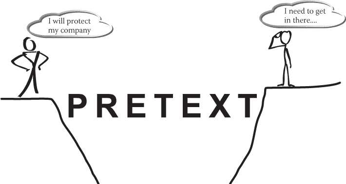

# 七、打造你的艺术品

> 艺术和科学在方法上有它们的交汇点。
> 
> 厄尔·爱德华·乔治·布勒-里昂顿

我决定暂时回到我的第一本书《社会工程:人类黑客的艺术》的艺术主题，来清楚地解释为什么这一章如此重要。在你为你的沟通计划建模、建立你的借口、掌握融洽关系和影响技巧并准备好之后，你需要能够将它们付诸行动。这就是艺术与框架和启发科学相遇的地方。

正如 18 世纪英国政治家和小说家厄尔·爱德华·乔治·布尔沃-利顿(Earl Edward George Bulwer-Lytton)所说,*方法*是艺术和科学相遇甚至交叉的地方。这一章讨论了作为一名专业的社会工程师，你如何艺术地学习如何使用科学精确的启发和框架。

当我刚开始在厨房工作的时候，厨师长(我的老板)递给我一袋芹菜，说:“把这袋放进去。”由于对那项工作不熟悉，我不知道他是什么意思。仅仅过了几秒钟，对我来说似乎过了很长时间，他说，“你根本不知道我在说什么，是吗？”

我点了一下头，不到 60 秒，厨师就打开了袋子，拿出一堆芹菜，看起来就像图 7-1 。

<figure>

<figcaption>

[**图 7-1**](#R_c07-fig-0001) 完美地切丝芹菜

</figcaption>

</figure>

“啊，切成薄片，”我说，好像我是活着的最聪明的人。在厨师的观察下，我开始做我的第一道菜——又好又慢。他说:“干得好；现在我需要两个那样的包。”

我很自信，试着模仿他的速度。为了肠胃比较弱的人，我就不把芹菜和手指混在一起的图贴在桌子上了。

你可能想知道这个故事和本章的主题有什么联系。烹饪是一门艺术，但在你使用工具的方式背后有一门科学——你挥刀的方式可以成就或摧毁你作为一名厨师的能力。理解如何使食物变得美味的艺术对厨师来说非常重要，同样重要的是理解如何准备食物(通常减去手指部分)来改善菜肴。将食物准备的艺术和科学结合在一起，创造出一道完美平衡的菜肴。

<aside>

* * *

# 注意

这些年来，我无数次割破自己的手指，让它们看起来像是弗兰肯斯坦博士的作品，但在我的厨师生涯或爱好中，我从未将手指的任何部分放在盘子里端给任何人。只是觉得你会想知道。

* * *

</aside>

这一章旨在向你展示如何融合框架和启发的艺术和科学，使前六章的技巧达到大师水平。如果你恰当地应用你在这一章学到的东西，你应该能够达到至少一颗社会工程米其林星。 ## 框架的动态规则

想想你的房子或公寓，以及它是如何形成的。当你从外面看它时，一个房间比其他房间突出得更远吗？有没有奇形怪状的阳光房，还是只有正方形的？它的外观——墙壁的位置、窗户的位置、门的位置等等——是由房子的结构决定的。换句话说，你所看到的和感知到的你的房子是基于框架是如何完成的。

从交流的角度来看，框架并没有太大的不同。我认为框架，或者说一个人如何看待和应对某种情况，很大程度上是基于这个人一生中的经历或理解。这些框架，或者说观点，可以被生活经历所改变。

当我 16 岁的时候，冲浪和滑板是我生活的中心。在我看来，没有其他值得活下去的东西了。框架是如此动态的一个例子来自于我生命中的这段时间。

有一天，我们一群人把冲浪板装到两辆车的行李架上，挤进去，半夜从佛罗里达西海岸开车到东海岸。我们听说有一场暴风雨要来了，想抓住一些巨浪。

我们大约早上 5 点到达。太阳将在一个半小时后升起。我们卸下所有的木板，上蜡。在太阳升到足以让我们清楚地看到之前，我们还有大约 30 分钟的时间，但我们很焦虑，而且我们都是 16 岁的孩子，所以我们决定在黑暗中划桨，以便在太阳升起时赶上第一波海浪。我们可以听到海浪冲击海岸的声音，也可以辨认出远处一些巨浪的轮廓。

我们六个人一个接一个地跑进海浪里，划向列队。我们坐在水中，上下摆动，等待太阳升起。每隔几分钟，我们就能听到一声类似猎枪的巨响。

我们没把它放在心上，因为声音似乎很遥远，听起来也不太不祥。我开始闻到一股刺鼻的味道，就看着我的一个朋友说:“咦，是赤潮吗？”

赤潮是一年中非常严重的海藻爆发的时候，这种海藻会杀死鱼类和其他一切生物，而且气味非常难闻。但是我的朋友说，“不，那还没有，不确定那是什么…”

仅仅过了几分钟，太阳已经明显地升到了地平线上，我们看到了准备好去骑行的美丽的海浪。我们还看到一群渔民在离我们很近的码头上——在水里钓鲨鱼！我们听到的猎枪响声是渔民在收网时放出鲨鱼时发出的。所以，我和我的朋友们坐在一起。我们带着一种近乎白痴的幽默感嘲笑这件事有多危险。

我往下看，看到我的冲浪板下有一个巨大的影子。我从来不擅长测量尺寸，所以我不能告诉你它到底有多长，但我可以说它比我的冲浪板还大。

我和我的朋友们笑得更厉害了，我们划桨离开了大船，赶上了几个巨浪。在我 16 岁的时候，我的参照系就是冲浪，鲨鱼的危险对我来说并不重要。

将近 30 年后的今天，当我想到这种情况时，我的参照系肯定已经发生了变化。即使我不在水边，不在朋友身边，也不在冲浪的地方，我还是充满了恐惧。当我还是那个 16 岁的冲浪者时，我对世界没有任何顾虑，危险的生活是我生活的一部分。现在，作为两个孩子的父亲、一个企业主和一个想活下去的人，一想到身处满是鱼、鲨鱼出没的水域，我就有一种恐惧感。我说的恐惧是指我想造一台时光机回到过去踢我自己的屁股。

我的生活经历，我的年龄，我的内在构成了这个框架。这一点太重要了，不能错过。框架是动态的，不是静态的。

框架是我们大脑工作的一个特征。我们的大脑对事物的背景做出反应，而不仅仅是对事物本身做出反应。以下是一些例子:

*   月亮在地平线上时似乎比它在头顶上时更大。原因是因为我们的大脑对物体的背景(位置)做出反应，即使月球在两个地方的大小相同。
*   我们不说我们杀了我们的狗；我们说我们让他们睡着了。这是我们用来帮助我们处理痛苦情况的框架。
*   In 1974, Elizabeth Loftus demonstrated framing in a study she performed, by changing one word in a sentence. After showing people a video of a car accident, she asked one of two questions:
    *   他们接触的时候车开得有多快？
    *   撞车时汽车的速度有多快？ 第一个问题总是比她在第二句中使用单词*坠毁*时引起的反应慢。(你可以在`[www.simplypsychology.org/loftus-palmer.html](http://www.simplypsychology.org/loftus-palmer.html).`阅读这项研究)

    在 1986 年由 David A. Snow、E. Burke Rochford Jr .、Steven K. Worden 和 Robert D. Benford 完成的题为“框架对齐过程、微移动和运动参与”(`[www.jstor.org/stable/2095581?seq=1#page_scan_tab_contents](http://www.jstor.org/stable/2095581?seq=1#page_scan_tab_contents)`)的研究中，研究人员定义了框架的以下四个不同方面。 
*   框架桥接
*   帧放大
*   框架扩展
*   框架变换

我想让你作为一名社会工程师来思考框架桥接。当你走近一家公司时，你看到一名保安。他的框架是把任何不属于他的人拒之门外。社会工程师的框架是进入建筑物。

对于社会工程师来说，走到保安面前说，“嘿，我要进去偷点东西，然后制造大混乱”是不太好的。即使你是一个专业人士和 pentester，说“看，我是一个专业人士，并试图帮助测试你的公司来修复漏洞”是没有用的。让我进去，这样我就能黑进你们的服务器。”

那么，是什么在你和警卫之间架起了一座桥梁呢？你能想出我在本书前面讨论过的弥合这种差距的东西吗？一条线索在[图 7-2](#c07-fig-0002) 中。

<figure>

<figcaption>

[**图 7-2**](#R_c07-fig-0002) 托辞弥合了取景缺口。

</figcaption>

</figure>

借口弥补了这个差距，帮助你改变目标的框架，让目标更容易接受你的言行。你在借口中加入的所有细节——你随身携带的东西，你的长相，等等——都让构思变得更容易，但还有更多。

2004 年，作家乔治·莱考夫写了一本书【不要想大象！(切尔西格林出版社)。在那本书里，他定义了四个框架规则。这四条规则对于理解你是否想掌握这门艺术是必不可少的，我将莱考夫的四条规则改编应用于社会工程。

 ### 规则 1:你说的每一句话都唤起了框架

为了清楚地掌握这个规则，你需要理解我们的大脑是如何将事物形象化为图片的。伟大的老师和讲故事的人用他们的话来帮助你描绘故事中的要点。这里有一个关于同一事件的两个不同故事的例子:

*   当我坐在冲浪板上时，我看到一个大浪向我袭来。我躺下来划水，但是海浪冲击着我，我发现自己在水下，想知道那条鲨鱼到底有多大。
*   **Story 2** I looked out at the horizon; the sun was just barely peeking over. Its rays not only illuminated the water but warmed my face. I saw a wave that looked like a freight train bearing down on me. Its power was easily noticeable from the speed and thickness of the wave. Its foamy head hurled toward me like an angry lion.

    我躺在我的冲浪板上，迅速把它转向岸边。我用肩部肌肉的每一根纤维潜入水中。虽然是流体，但我每划一下都能感觉到水的存在，就好像我在挖湿的水泥一样。

    海浪抓住了我的冲浪板，就好像有一种超自然的力量抓住了它。我在几秒钟内就从静止不动变成了坐过山车。当我的冲浪板摇晃着拍打着水面时，我挣扎着试图站起来。当我转身的时候，我什么也没看见，除了波浪的唇，它就像一个愤怒的监工一样，要拍打我的脸。

    当海浪拍打着我的时候，我被压在了水下，我所能做的就是开始想象那条活生生的鲨鱼向我飞来。我在恐慌和恐惧中挣扎着，想浮上水面。当我这样做的时候，我害怕地抓起我的冲浪板，向岸边划去。

这两个故事都是关于同一个事件的，但是哪一个能帮助你真正在脑海中描绘出它？这让你觉得你和我在一起。

答案很明显:故事 2。这就是这条规则如此重要的原因。有时，我们在日常词汇中选择的词会在脑海中形成冒犯目标的画面。作为一名专业的社会工程师，我发现如果我使用非冒犯性的语言，我不仅会更成功，而且会有更多的回头客。

为了让这本书保持 PG-13，我不会详细列出可能令人不快的单词，但这里有一些关于你应该避免的事情的一般准则:

*   **种族诽谤**即使在幽默中说，种族诽谤也不好笑。它们不仅不好笑，而且通常被视为无知的表现。
*   基于性别或性取向的诋毁这些诋毁和种族诋毁有着同样的效果——它们是无知的表现，对和谐关系的建立是有害的。
*   我发现即使我的目标使用粗俗的语言，为了那些偷听谈话的人，我自己也可以避免这样做。很多时候，通过不使用与目标相同的语言，我也可以有效地改变他们对该语言的使用。
*   这些词会引发强烈的厌恶感，因此应该避免使用。

想想你在日常词汇中使用的词汇，然后决定它们是否会让目标感受到七种基本情绪之一:愤怒、惊讶、恐惧、厌恶、蔑视、悲伤或快乐。然后决定这种情绪是积极的还是消极的。如果它有潜在的负面影响，在使用这个词之前，宁可小心谨慎。

<aside>

* * *

# 小费

我所在的行业称之为“渗透测试”光是这个名字就为大量非幽默的性暗示敞开了大门。然而，我不愿意提及的是，我曾多次听到完成 pentest 的人说，“我强奸了那个服务器。”考虑到仅在美国，每 98 秒就有一人成为性侵犯的受害者，我并不觉得这种说法好笑。事实上，对于一个被性侵犯的人来说，听到被描述为强奸的安全测试的负面影响可能会再次带来创伤。不要用这个词来描述你的工作！T3】

* * *

</aside> ### 规则 2:用框架定义的词唤起框架

有一天晚上，我走上门廊，在灯光下的角落里，我看到一个结在网里的生物。它正把一只昆虫包在一个茧里，作为以后的食物。

我向你描述了什么？大概就是你在[图 7-3](#c07-fig-0003) 中看到的。

<figure>

<figcaption>

[**图 7-3**](#R_c07-fig-0003) 以防你还在猜测，没错，是蜘蛛。

照片由 ARTYANGEL 提供，`[https://pixabay.com/en/spider-fly-web-insect-2683918/](https://pixabay.com/en/spider-fly-web-insect-2683918/)`

</figcaption>

</figure>

关键是我不需要用*蜘蛛*这个词来让你认为*蜘蛛*。我只能描述一只蜘蛛，你的大脑会自动描绘它。

作为一名专业的社会工程师，我的借口自然会让你想到我想要告诉你的工作。但是我也可以通过描述一种情况，而不是使用威胁来引出正确的情感框架。

有一次，我向一位客户发送了一条网络钓鱼信息，内容如下:

> 1 月 4 日，你的车被拍到闯红灯 XCV431。已开出一张票，但尚未付款。不缴纳罚款会造成负面影响。
> 
> *您可以在我们的安全门户网站* `[www.pleaseclickthisnowsoicanhackyou.com](http://www.pleaseclickthisnowsoicanhackyou.com)`上提出索赔或核实您的付款。

(是的，为了安全起见，网址已被更改。)注意，我不需要威胁逮捕。我不需要威胁巨额罚款。我只是画了足够多的文字图片来引发好奇和恐惧的情绪，但随后给了收件人希望有一条出路。(是的，他点击了。) ### 规则 3:否定框架

想象一下这个场景:我的学生被要求从一个人那里获取一些个人信息——仅仅是全名、出生日期和一些简短的历史。尽管这位学生对被我观察感到紧张，但谈话开始得很好，一分钟后，听起来像这样:

| **学生:** | 哇，谢谢你的帮助。我在想给她买什么礼物，这是个好主意。这名学生将一个非常好的验证陈述应用到为他妻子的生日礼物的想法中。] |
| **目标:** | 好的，没问题。所以，我得…【to】【她正要说走，却被学生打断了。] |
| **学生:** | 我是汤姆，汤姆·史密斯。*【他用优美的自然节奏帮助引出目标的名字。]* |
| **目标:** | 呃，是的，很高兴见到你，汤姆。我是莎拉。 |
| **学生:** | 莎拉，很高兴见到你。你姓什么？ |
| **目标:** | 你为什么想知道这个？ |
| **学生:** | 哦，不为什么。只是好奇。总之，你生日会做什么？你出生在七月吗？ |
| **目标:** | 嘿，汤姆，很高兴见到你，但我不确定我是否想把这些信息透露出去。不好意思。 |
| **学生:** | 没问题，莎拉，我又不是要黑你或什么的！ |

在最后一句话中，目标真的从我的学生身边靠过去，看了看手表，说她迟到了，然后离开了。

他做了什么？我们称之为*否定框架*，它被定义为提及你不希望你的目标考虑的事情，本质上是让他们考虑那件事情。

作为一名专业的社会工程师，当你与你的目标打交道时，你不希望他们考虑的一件事是什么？*被黑*怎么样？！

如果你不想让他们去想，那就不要说这样的话

*   “我不会用它来黑你！”
*   “我又不是要闯进去！”
*   “我绝不会给你发钓鱼邮件。”
*   “我不是骗子！”

这些都是否定框架的例子。每当我们提到对手的框架，我们就否定了我们的框架。并且记住[图 7-2](#c07-fig-0002)—他们的框架是为了保护。

利用你的借口、衣服或其他工具，寻找增加或增强你身材的方法；因此给予目标绕过任何内在问题和怀疑的能力。 ### 规则 4:让目标思考框架来强化框架

每当我们让某人想到一个框架，我们就强化了这个框架。不管这个框架是什么，我们都会加强它。例如，父母可以选择强化孩子的积极框架或消极框架，如下例所示:

*   “你真蠢！”
*   “你不擅长运动。”
*   “你什么都做不好吗？”
*   “你真漂亮，真聪明！”
*   "只要你下定决心，你就能完成任何事情。"
*   “我知道这很难，但我知道你能做到！”

作为一名专业的社会工程师，你可以通过你选择的语言、服装和借口来强化框架。

在我的公司正在做的一项可视化工作中，我们的借口是我们是从 IT 部门打来的，前一天晚上我们有一个徽章系统损坏了。我们的目标是从被指派给我们打电话的员工那里获得全名、出生日期、员工 ID 和其他详细信息。事情是这样的:

| **目标:** | 我是鲍勃。我怎么帮你？ |
| se: | 鲍勃，我是保罗。昨晚，我们有一个标记系统损坏的错误，大约 100 个帐户被标记。你是个幸运的赢家。你今天进大楼有困难吗？ |
| **目标:** | 不，成功了。这是谁？ |
| se: | 保罗，保罗·威廉姆斯在里面。我和托尼·r 一起工作。听着这只要一分钟。如你所知，我们的工卡系统是与工资单捆绑在一起的，所以我们不想延迟修复任何错误。 |
| **目标:** | 哈，确实如此。你需要什么？ |
| se: | 我需要核实你的全名。你能为我拼写你的姓吗？ |
| **目标:** | 嗯，真的吗？是 *S-M-I-T-H* 。不要太用力。 |
| se: | 哇，感谢上帝我打电话了。罗伯特·琼斯在这次延期中保持了记录。那肯定会搞乱工资单。我猜当损坏算法运行时，它试图重新链接表并使数据库计数器错位。我知道这毫无意义，但我赌了一把，会计部的鲍勃不是一个真正的极客。] |
| **目标:** | 是啊，我不想别人拿我的薪水。让我们检查其余的。 |

从那以后，就是一系列使用故意的虚假陈述和正面强化来获得他的全名、出生日期、员工 ID，甚至是他的社会保险号的最后四位数字。我的话和借口都加强了我的框架；因此，目标更容易接受它。

在你的开场白中，让目标思考你的框架，这会让你更容易进入下一部分。我们称之为*诱导*。 ## 引出

你如何定义*启发*？

我把它定义为“得到你从未问过的信息”本质上，启发看起来和听起来都像对话。在那次谈话中，一个熟练的诱导者会将谈话引向某个方向，在你没有要求的情况下获取信息。

启发有一些自然的规则和原则，这些规则和原则是成功的内在因素。每一个都是自己的动力，但是当你把它们结合起来，你会掌握谈话的艺术，作为一个专业的社会工程师，这能让你成为一股不可忽视的力量。

当我讲述启发的四个规则时。记住这重要的一点:如果做得好，诱导应该看起来和感觉起来像是和你的目标的正常的、非强迫的对话。

### 自我诉求

在第五章“我知道如何让你喜欢我”中，我谈到了自我暂停，这个原则正是与此相反的“T2”。在这种情况下，你关注的是目标的自我，而不是你自己的。

什么是自我？《牛津英语词典》将其定义为“一个人的自尊感或自我重要性”理解这一点很重要，因为当我们听到这一点时，我们可能会自动假设我们必须膨胀目标的自我，但这不是我要说的。我是说你必须让*迎合*他们的自负。

吸引目标的自我需要牢记以下三点:

*   你得用诚意。
*   你必须有适当的融洽度。
*   你必须现实一点。

“假设我以前从未见过你，只是见见你，我走过去对你说，哇，你是我见过的最有魅力的人之一。”如果我试着和你开始对话，你会怎么想？可能是以下一种或多种情况:

*   “猥琐！”
*   “你想要什么？”
*   “嗯，有什么骗局？”
*   “当然，我是。现在走开！”

无论你当时怎么想，对你自我的吸引都不是真诚的，现实的，也没有达到我们已经建立的融洽的程度，所以它不会产生一个好的启发。

这是我妻子真实生活中的一个故事，她是我见过的最好的启发者之一。我们在纽约市。我带她和家人去了我以前常去的地方。有一次，我们在去住宅区的地铁上。如果你曾经坐过地铁，你就会知道人们只是呆在自己身边。人们并不粗鲁，但他们也不友好。每个人都有地方可去，都有压力或疲惫。你坚持自己，做自己的事。

我的妻子坐在一位年长的非裔美国妇女的对面，她看起来像是要在停车前睡一会儿。我的妻子探身到她的空间，抓住她的围巾感觉材料，并说:“哇，这是真正的美丽和如此柔软。我能问问你在哪里买的吗？”

现在我们在纽约的地铁上，我的妻子跨越了个人、种族和空间的界限——然而，这两个人在几秒钟内成为了最好的朋友。为什么呢？自我诉求是什么？

我的妻子不仅认可了这位女士对服装的选择，还要求这位女士告诉她在哪里可以买到。这不是骗局——我妻子真的很感兴趣，这种真诚显而易见。

多亏了这些，接下来的 20 分钟的谈话是关于在纽约哪里可以买到好衣服。尽管我很恼火，因为我意识到我现在要花更多的钱了，但我还是忍不住对我的妻子感到惊讶，看着她教我如何成为一名优秀的启发者。

现在，你怎样才能成为像阿蕾莎一样的大师？秘制酱是什么？这里有一些提示:

*   她真的很爱人们，并且对他们感兴趣。
*   她的意图是利他的。
*   她很可爱，笑容很迷人。

但是如果你不是像我妻子一样可爱、友好、可爱、微笑的亚洲小女人，你会怎么做呢？

首先，练习观察一些关于人的事情——比如说你的家庭。当你明天下班回家时，注意以下事情:你的女儿洗碗了吗？你儿子倒垃圾了吗？他们的作业做完了吗？你妻子也经历了漫长紧张的一天吗？

试着简单地说这样的话，“哇，我回家时发现盘子已经洗好了。谢谢你。”或者“嘿，亲爱的，你看起来超级累。你今天过得还好吗？”

然后看看会发生什么。一个人的肢体语言会软化。他们会敞开心扉，变得友好和健谈。为什么呢？你认可了他们并迎合了他们的自我。

在你的家人身上练习过之后，把它带到户外，和陌生人一起尝试。这将会困难得多。你必须在不令人毛骨悚然的情况下观察，并利用第五章的所有课程来制定你的方法。然后你开始迎合他们的自我。

想象一下这个场景:你在星巴克排队时落后于你的目标。他是一名 34 岁的高个子男性。他穿着整洁，有一种预科生但书呆子的风格。你看到他拿出一部全新的 iPhone，在上面输入文字。有了这些信息，你的自我诉求是什么，可以引发一场对话？在你读下去之前，想一想。

我会试着这样说:“对不起。我看到你有一部 iPhones。我在考虑换班。你喜欢到现在吗？”

如果他刚刚花了 1000 美元买了一部手机，那么他会有自己的看法。不管他给你什么意见，你都可以用“哇，你真的帮了我大忙了”来证实和呼吁。我从来不擅长做这些决定，但是你让它变得简单多了。我叫克里斯，克里斯·哈德纳吉……”我伸出手去和他握手。

现在对话开始了。 ### 共同利益

当今世界有很多真正热门的话题。它们中的许多似乎不仅仅是分开人们，而是造成了一个小国家大小的裂痕。这些两极分化的话题中的一些可以产生如此大的激情，以至于如果有分歧，一些人甚至会变得暴力。

对于一个专业的社会工程师来说，重要的是不仅要理解这一点，还要有能力在这些热门话题上抛开自己的想法，找到共同的兴趣。

我举一个我亲身经历的例子。我不会告诉你我站在哪一边。想象一下当时的情形，就好像你在那里一样。

我走进一座办公楼的大厅，我被分配了进入大厅的任务，我发现一群人围着一台电视站着。发生了一起可怕的事件——一场校园枪击事件。儿童死亡和受伤。枪手自杀了。这真是一个可怕的情况。

一名男子说，“如果我在那里，我会有我的枪，他会死之前，他甚至没有得到他的第一轮。”

另一个人回答:“这就是问题！就是因为枪太好买了，这些事情才一直发生！”

你可以看出这个房间正在分裂，显然有两个阵营。当人们就他们在这个问题上的立场发表意见时，房间里的气氛很紧张。一个人抬头看到我在那里，甚至没有问我是谁。她只是说，“你听到新闻了吗？看，这太可怕了。”

我回答说，“不，我走进来才听到。这听起来真的很可怕。你在那个地区有家人或朋友吗？"

“感谢上帝，没有，”她回答说。然后她喘不过气来，说:“不过，没关系。比尔有解决办法——他只要给这个国家的每个人发一把手枪，我们就能回到狂野的西部。”

我看得出比尔身体越来越不舒服，他说，“或者我们可以接受你的想法，坐在一起唱歌和祈祷，而每个人都杀了我们的孩子。”

*哎哟。*这是在快速走下坡路。我意识到现在真的不是成为一名专业社会工程师的时候，但我可以试着化解这种局面。因为他们的评论都是针对我的，所以当比尔说完后，他们都怒视着对方，然后看着我，就好像在说，“那么，你站在哪一边？”

我知道如果我站在任何一边，我都会疏远半个房间的人，我说，“哦，我的天。那些贫穷的家庭。我自己有两个孩子。我无法想象他们中的一个被杀的消息。这真是悲伤的一天。”

裂缝突然闭合了。不再有间隙了。他们都面面相觑，想起这不是支持或反对枪支的问题。是关于我们的孩子。不管你是支持枪支还是讨厌枪支，孩子们在学校被枪击是一个我们都同意很可怕的话题。

当你的任务是对某人或某个团体进行社会改造，而这个话题可能具有挑战性，或者这个人可能不是你最喜欢的，寻找共同点。通常有一件事你可以找到，让你们所有人都有共同点，并开始对话。

前面的例子是一个严肃的例子，但这也适用于小情况。以下是一些通常可以帮助你建立共同点的话题:

*   天气特别是如果有一些奇怪的天气——一场暴风雪，太多的雨，不合季节的热或冷——天气可以提供快速打开话题来打破僵局。
*   **技术**就目标拥有的技术(手机、笔记本电脑、智能手表等)征求建议。)是让他们交谈的好方法。
*   **孩子**只要你以适当的融洽程度提问——你问的是关于孩子的一般性问题，而不是具体关于他们孩子的问题——这真的能让人们交谈起来。
*   人们喜欢谈论(并分享)他们的宠物。
*   虽然不是每个人都对体育感兴趣，但如果你注意到有人穿着某个球队的球衣或帽子，这可能是一个很好的话题。只要你不说“啊，牛仔的粉丝，啊？对不起。”这不是一个很好的开场白。

我建议你避免谈论政治、医疗保健、宗教、其他非常个人化的话题，或者任何暴力新闻。这些话题会在你和你的目标之间制造巨大的裂痕。

通过对目标及其周围环境的观察(无论是通过 OSINT 还是物理观察)，找到可以共同感兴趣的话题，然后用那个话题展开对话。 ### 故意虚假陈述

故意虚假陈述的原理太厉害了，你不得不试试。当你在一家杂货店里，听到队伍中有人说你知道是假的，你会怎么样？

我听到和看到了一切，包括有人小声发出声音(像“hrmph”或“耶，对”)到有人纠正一个完全陌生的人。

为什么人们会有这种反应？我们需要正确并纠正错误的事情。当我们听到一些我们“知道”是错的东西时，我们通常会纠正它，即使它只是首先在我们自己的脑海中。根据我们是谁，我们在哪里，以及我们对这个话题的热情，我们可能会让这个想法从我们的头脑中出来，公开化。

这里有一个例子，它的效果之好甚至让我震惊。我和罗宾·德雷克坐在一家餐馆里，我们计划好了这次谈话，想看看蓄意的虚假陈述是如何起作用的。这是一家小餐馆，桌子挨得很近。如果食客们想听别人的谈话，并不难。

罗宾用很大的声音说，“嘿，你看到《纽约时报》上的那篇文章了吗？那篇文章说超过 80%的人用他们的出生日期作为他们的 ATM 密码。”

这项研究实际上并不存在，罗宾提到的那篇文章也不是真的，看在上帝的份上，我希望这个统计数据是真的，真的是假的。

我插嘴道，“不，不是这样。我用了我妻子和我的出生日期的组合，所以是 0411。”

罗宾说:“嗯，我想这是真的，因为我确实是。”

然后我们俩都沉默了几秒钟，就像在暗示一样，我们旁边的夫妇看了过来，丈夫说，“我一直告诉她不要用她的出生日期来做胸针，但她告诉我这很容易记住。”令人惊讶的是，他的妻子说:“嗯，你怎么会不记得 0660，对不对？”

哇，这个女人刚刚给了我们——餐馆里完全陌生的人——她的密码？我希望我能说就此打住。但是它没有！我们另一边的男人转向和他在一起的女人说，“那么，你用什么样的别针？”

她毫不犹豫地回答:“我的银行允许我使用六位数字，所以我实际上使用了我女儿的整个出生日期:031192。”

监督这一切的女服务员说，“我的银行让我选择一个真正的单词，我用键盘打出来。我儿子给他的第一只宠物取名为参孙，所以我就用这个名字。”

我坐在一家公共餐厅里，收集每个人的出生日期、宠物的名字，更可怕的是，因为一个故意的虚假陈述，收集银行卡密码。

我对这个原则如此着迷，以至于我开始到处使用它并教授它。后来我有一个学生成了我的老师。我在课堂上讲了这个故事，他说，“哇，我有一个想法，我想尝试一些事情。”

后来在课堂上，我观察到他在公共场合与一些目标互动。他走向一个坐在桌旁吃着一碗草莓的女人。没有介绍，没有融洽，他有这样的对话:

| **学生:** | 嘿，你喜欢草莓。你必须在二月出生！ |
| **目标:** | 嗯，不，事实上我出生在七月。 |
| **学生:** | 哦，就像 4 号，放假的时候？ |
| **目标:** | 不，是 11 号。为什么呢？她困惑地看了他一眼。] |
| **学生:** | 好吧，酷。拜拜。 |

然后他就走开了。我说，“这不可能再管用了。”但他走向一个又一个完全陌生的人，故意抛出最奇怪的虚假陈述。每次，人们都给他信息。

这种方法的缺点是没有融洽的关系。所以，当他完成后，他的目标被弄糊涂了，不知道刚刚发生了什么。他们肯定没有“因为见过他而感觉更好”

小心故意虚假陈述，并使用以下准则:

*   连续多次故意使用虚假陈述会让你显得不可理喻，这会让你的目标对你失去信心。
*   不要把故意虚假陈述和否定框架混为一谈。如果你不想让目标想到黑客，就不要在你故意的虚假陈述中提到“黑客”。
*   在你与目标建立了某种程度的融洽关系后，故意的虚假陈述会更有效。
*   这种蓄意的虚假陈述肯定有其真实性。如果我的学生走近第一个女人并说，“哦，你喜欢草莓——你必须飞龙，”他将无处可去；结果会是混乱，而不需要纠正。

我真的要挑战你去尝试故意的虚假陈述。你会惊讶于它的工作效率，以及你将获得的信息量。

走向一个完全陌生的人，询问他或她的 PIN、出生日期或其他个人信息(大多数情况下)会引起各种各样的警觉。但是通过使用一个故意的虚假陈述，你可以把所有这些个人细节都带入谈话中。

<aside>

* * *

## 虚假陈述加交换条件

我在一次启发活动中尝试了我的学生的方法，它非常有效。然后我接着说:“啊，8 月 12 号。真有意思，我妹妹也是八月出生的。”

给予一些交换条件有助于目标对他们在诱导中刚刚放弃的东西感到安心。我补充道:“我奶奶过去常说，八月出生的婴儿更有艺术感和创造力。你有音乐天赋吗？”

女人咯咯地笑着说:“不，我更喜欢数学。这就是我当会计的原因。我想祖母并不总是对的，对吗？”

我说:“哈，我想不会。但是不要告诉她。我意大利奶奶会揪着你耳朵吼你！”

女人回答道:“哦，我知道那是怎么回事。我的家人来自爱尔兰。他们捏的还没有揍的多！”

**“哎哟！听起来…嗯…很有趣。那么，你有一个真正听起来像爱尔兰人的姓吗？”我想这可能是获得更多个人信息的好机会。**

“没有比我的名字更爱尔兰化的了:玛丽·安东内尔，”她说，带上了一点爱尔兰口音。

我回答道:“哦，你的小口音很酷。可悲的是，除了骂人的话，我的意大利语都丢了。”

“嗯，那可能会派上用场。”

请注意，通过一个故意的虚假陈述和一些交换条件，我获得了这位女士的全名、出生日期、工作职能以及关于她生活和家庭的其他细节。 * * * </aside> ### 拥有知识

不要把拥有知识和无所不知混为一谈。这两件事完全不同。在启发过程中，了解你要和目标谈论的话题会有很大帮助。又是一个失败故事的时候了，这个故事导致了工作上的失败。

我的公司受命进入一所大学的服务器机房。在确定服务器机房所在的大楼范围时，我们注意到一位教授会在早上 7:00 左右进入大楼。当时大楼内没有其他工作人员，所以我们认为这是进入大楼的最佳时机。所有的门都使用 RFID 锁，因为这是一个 se 的工作，我们认为我们应该首先尝试人类的角度。

我们看了教授的文章，看到他写了一篇关于量子物理的论文，还有一些我不懂的大词。凭着我无限的智慧和技巧(这里讽刺的剂量很大)，我记住了论文的名字，第二天早上，我打算去接近教授。

当他轻快地走向大楼时，我的计划是开始一场关于论文的谈话，我们一起走进大楼，当我们分道扬镳时，我会闯入服务器机房区。

我开始说，“早上好，先生。我的名字是保罗·威廉姆斯。你是史密斯教授，对吗？”

“是的，我是。有什么可以帮你的吗？”教授问道，并没有停止向大楼走去。

“我想问你一些关于你写的量子物理学论文的问题，”我说着，毫不费力地说出了论文的标题。

稍微停顿了一下，他说:“好吧。你有什么问题？”

哦，不！我的大脑飞速运转。我怎么没想到这一点？我们仍然向门口走去，但现在它似乎离我们有几英里远了。我真的试图想出一个明智的说法，我最好的回答是，“嗯，那么，是什么让你写那篇论文？”我的声音在最后变得越来越小，充满了不确定性。

自从我走近他以来，教授第一次停下来，完全转向我，说:“我不知道你在玩什么游戏，孩子，但等你真正读完了再回来。”然后，他转身更加轻快地向门口走去。

当然，我可以读这篇论文，但是即使我读了几十遍，我怀疑我是否能就这个话题提出哪怕一两个聪明的问题。或者我可以找一个了解这个话题的人来帮我构思一些有智慧的问题。然而，这两种解决方案都不会让事情变得简单。对我来说，最简单的方法就是使用一个符合我现有知识的借口。也许我本来是一个想上这位教授的课的学生，我想知道我应该读什么论文或书籍来使他的课更有趣。

当我接近他的时候，我应该已经了解了这所大学，我将会接触到哪些课程和老师，以及有哪些项目。拥有这种知识并不意味着我必须使用它并从一开始就脱口而出来证明我的观点，但是拥有这种知识会使我说话的方式和我说的事情更可信。这样，如果一个问题像“你现在在学什么课程？”如果我出现了，我就会有现成的知识，这样我就可以保持可信。

你越可信，目标就越容易认为你就是你所说的那个人。 ### 问题的使用

提问是谈话中很自然的一部分。从我们开始说话的那一刻起，我们就用问题来发送和接收数据。这就是为什么理解四种不同类型的问题——以及如何使用它们——对于成为一个好的启发者至关重要。这就是下一节将要讨论的内容。

问题是交流的重要部分。一旦我们听到一个问题，我们的大脑就开始制定一个回答。即使这个答案从未被说出，形成一个回应也是不可避免的。

巧妙地使用问题可以让目标投入到对话中。熟练的社会工程师可以使用每种类型的问题从目标中引出信息和情感。

为了帮助你理解如何在社会工程中使用不同类型的问题，这里有一个我亲身经历的故事，我称之为 OpOfficeSpace。

我的任务是进入一栋办公大楼的 16 层，但是占据那一层的公司并不拥有整栋大楼。我想出了一个借口，公司派我来进行一次突击检查，看看工作场所的安全政策，如保持出口畅通，是否得到了遵守。

我的借口是基于我们发现的一些新政策和这家公司因员工工作条件差而受到的负面报道。在公开场合，该公司发誓要解决这些问题，并声称他们向所有卫星办公室发出了强烈的信息，指示如何做。

我做了一个徽章，上面有公司的标志，顶部用粗体字写着“安全检查员”。带着我的写字板、相机和其他一些工具，我走进前门，径直走过安检台。

前台后面的女人突然站起来问道:“对不起，先生，你要去哪里？”

我几乎没有放慢速度，一边回答，“我要去 16。”

“嗯，请停下来。我需要你的身份证，因为你没有使用电梯的通行证。”

“哦，对不起。我来解释一下。你叫什么名字，夫人？”

“我是艾丽西娅·史密斯，”她指着自己的徽章说道。

“很高兴见到你，艾丽西娅。我在 16 号为 ABC 公司工作，由于最近在我们的一些工厂发生的事故，我被分配了做突击检查的工作。还没有通知工厂。你听说我们最近在员工工作条件方面遇到的问题了吗？”

她耸了耸肩，回答道:“是的，我在新闻上看到了。”

“好吧，那你知道我们惹了多大的麻烦了。我相信你的雇主会好好照顾你，这些检查都是为了确保我们的员工得到照顾，但它们必须保持惊喜才能有效。”

“好的，我明白。我认为很高兴看到一家公司如此重视这一点。我会在电梯里给你戴上 16 号徽章。”说完，我和我的新盟友走向安全电梯。

我停下来问，“艾丽西娅，有些电梯双向都需要通行证。电梯里有什么样的安全系统？”

“哦，我真傻。我差点忘了，是的。我们刚刚安装了这种新型的电梯安全系统，你需要一个徽章来做这两件事。我给你拿个访客专用的。在这里等着。”她跑回桌子给我拿了一个未签名的徽章，然后送我上路。

我从 16 楼的电梯出来，我的左右两边都是玻璃门。我可以看到一个秘书坐在我的右边，她正带着越来越好奇的眼神看着我。当我走向桌子时，我知道她会问我一些问题，我想先发制人，所以我说，“你好。我是公司的保罗。”我掏出自己的胸卡，简单给她看了一下，但不确定有多准，就把笔拿出来指了指写字板。“这是 43211 号办公室，对吗？”我指着一张工作单问了这个问题。

“嗯，是的。保罗，你为什么在这里？你不在日程表上，”她说，看起来很困惑。

“我不在日程上——这是一次突击检查。经过上个月 OSHA 的问题，我们需要确保我们的工作空间得到了极大的改善。你拿到内部备忘录了，对吧？”

她点头称是，说:“是的。我被要求打印出来，并确保每个人都有一份实体副本。”

“好。好吧，这标志着我的第一个复选框了。”我翻到第二页，打了个勾，然后说:“谢谢！你让我的工作开始得很好！我想把你的名字写在旁边，作为听从指示的员工之一。你叫什么名字？”

"什么。贝丝·西蒙斯。

“太棒了，贝丝。作为一个观察力敏锐的人，我相信你看到了一些需要特别考虑的地方。我应该从哪里开始？”

她朝一个区域看了看，说道:“我想我们在这里都是合规的，但我不确定。我不想给任何人带来麻烦。”

“我明白，贝丝。谢谢你这么诚实。我要开始演练了。等我完成了，我会亲自告诉你的。”就这样，我在无人监管的办公室里。

#### *开放式问题*

顾名思义，开放式问题不会将接收者引向任何特定的方向，而是允许他们仅根据自己的观点进行回答。开放式问题通常不能用简单的是或否来回答。开放式问题允许目标决定他们将提供多少信息。这是对相关人员的授权和认可，有助于建立融洽的关系。一个开放式的问题类似于“你在镇上最喜欢的餐馆是哪家？”；与“这家酒店附近有好餐馆吗？”这两个问题都是合理的，但其中一个引出的信息将使你能够更彻底地剖析目标。你在问题中使用的词语会引发情绪，而这些情绪会影响你得到的答案。开放式问题鼓励目标参与他们的知识、态度、信念、观点和感受。

这些问题的成功很大程度上取决于你，作为一名专业的社会工程师，如何积极倾听和引导问题以获取有用的信息。理解这一点很重要，所以当你制定你的借口时，你可以开始计划你会自然地使用什么类型的问题。请记住，我们的目标是让目标开诚布公地谈论相关细节，这有助于实现社会工程项目的最终目标。

<aside>

* * *

# 亲提示

“让他们说下去”这句格言与社会工程并不相关。我们不希望我们的目标只是谈论，我们希望他们谈论与我们的需求相关的信息。

* * *

</aside>

在 OpOfficeSpace，我可以多次使用开放式问题，但你可能还记得，当我问保安艾丽西娅关于电梯的问题时。她不仅回答了问题，还继续告诉我安装在电梯里的新安全系统。在这种情况下，使用开放式问题不仅能让我收集到徽章，还能收集到他们安全系统的关键信息。 #### *封闭式问题*

封闭式问题会引出简短而狭隘的答案。通常可以用一两个字来回答。熟练的审讯者经常使用封闭式问题来验证他们已经获得的事实。此外，封闭式问题非常适合用来解读非语言信息。当问一个封闭式的问题时，我们的身体会在我们的嘴回答之前做出回答。大多数时候，即使我们说了谎，我们的肢体语言也会给出诚实的答案。我们可能会耸肩或摇头表示不，但会说“是”

我对我的孩子用过很多次封闭式问题。例如，我可能会对他们中的一个说:“我告诉过你晚上 11 点是睡觉时间。你真的 11 点就关电脑睡觉了吗？”头摇了摇*没有*但是孩子说:“我想是的。我没看到具体时间。”

封闭式问题的一个好处是，它们确保社会工程师能够引出细节并保护特定的信息。当你使用封闭式问题时，最好先从基本问题开始，然后再深入。谁、什么、在哪里、为什么以及如何做的基础知识是开始的好地方。

在 OpOfficeSpace，当我问接待员贝丝是否收到备忘录时，我使用了封闭式问题。她不仅点头表示同意，还口头回答了“同意”然而，当我用同样的问题问艾丽西娅是否看到任何关于 ABC 公司问题的新闻时，她耸耸肩回答说:“是的。”这种不一致告诉我她不确定自己是否知道这件事。由于我对她困惑的理解，我可以补充一些可能不完全真实的事实。 #### *引导性问题*

我收到了一个包含视频的网页链接。这一页是这样开始的:“在这项研究中，只有真正善于观察和聪明的人才能数出白衬衫传球的次数。”

我坐在那里想，“我是一名社会工程师——这个星球上最善于观察的人之一。我得到了这个！”我点击了播放。

我从不眨眼，我数着每一次传球。我一直盯着屏幕。当视频完成时，我看到了一些通过计数的选项。当正确的数字出现时，我对着屏幕喊道，“*就是它！*”我的声音中带着严肃的自豪。

然后视频继续说，“但是你们有多少人看到那个穿着大猩猩服装和芭蕾舞裙的男人穿过球场，从另一边离开？”

我完全不相信，大声说道:“根本没有大猩猩！”毕竟，我是一名社会工程师，也是这个星球上最善于观察的人类之一，对吗？我不可能错过这么明显的事情。

我从头重放了一遍视频，令我惊讶的是，一个穿着大猩猩服装和芭蕾舞裙的六英尺高的男人出现在球场上，转了一圈，然后从另一边离开了。

我怎么没看出来？

答案很简单:领先。我被引导专注于一件事——穿白衬衫的人的通过计数——而我的大脑屏蔽了其他一切。

那么，一个社会工程师如何使用问题形式的引导呢？在 OpOfficeSpace 场景中，我能够引导目标思考如果不按照我的要求进入 CEO 办公室可能会有什么后果。我把陈述和引导性问题结合起来:“贝丝，我知道我不在日程上，那么你建议我们如何向史密斯先生解释，在他度假回来后我不能给他修电脑？

除了引导问题，当我进入一个建筑时，我经常使用误导。我有一个前面嵌有摄像头的剪贴板。有一个大(四分之一大小)的孔，有一个镜头突出，另一个小孔有一个麦克风。我一直担心目标会看到它。我把一张工作单或其他纸放在剪贴板的前面，用一只漂亮的金属笔，我在纸上敲着，同时说着类似这样的话，“是的，你看到这里了吗？我应该检查发动机的序列号，看看是否有召回。”到目前为止，没有人见过相机，因为我引导他们把目光从它身上移开。

作为一名专业的社会工程师，你必须提前计划好如何使用引导性问题。把它们变成你的借口。计划好你要做的事情，以便把目标从你不想让他们注意到的事情上引开。

在 OpOfficeSpace，我不想让 Beth 盯着我的徽章看太久。如果这不是一个真正的徽章的匹配，她会注意到，所以我很快用我的笔和一个工作订单带她到我想让她集中注意力的地方。这是强大的，让我不仅能重新定位，还能给我的主张增加合法性。 #### *假设性问题*

社会工程师在启发过程中收集信息的另一种方式是使用假设性的陈述和问题。当你有一些知识，并且可以假设用一个问题或陈述来确认这些知识时，你可以使用这些类型的问题。

这是我和我的孩子用来找出不清楚的细节的另一个技巧。例如:

| **我:** | 你去派对的时候，塔米出现了吗？ |
| **我的孩子:** | 直到那天晚上晚些时候——你不必担心，爸爸。 |

那次简短的交流让我知道我的儿子在聚会上，所以我可以继续在那个方向探索以获得更多的信息。

作为一名专业的社会工程师，假设性的问题可以用在最初的方法上，以绕过某些谈话障碍。对话中止语顾名思义就是:一个或多个旨在阻止某人越过某个特定的人或地区的陈述。

在 OpOfficeSpace，我在最初接触艾丽西娅和贝丝时都使用了假设。我认为我属于我在的地方，他们应该知道我为什么在那里，他们应该允许。我没有使用傲慢或愤怒——只是一种归属感，好像我知道我要去哪里，也知道我为什么在那里。 ## 摘要

对话就像洋葱——两者都有很多层。当你剥开一层时，你可以越来越深入到中心。

每种启发技巧都是谈话的重要部分。学习如何使用每一个可以帮助你成为一个谈话大师和一个优秀的社会工程师。诱导的目的是从听起来正常的对话中提取信息。如果你练习这些技能，那正是你能够做到的。有趣的是，这不仅限于口头对话——无论你是通过电子邮件、聊天、短信、电话还是其他方式进行对话，这些技巧都是有效的。

就像厨师决定用什么工具和配料来做菜一样，你可以在谈话中加入一些问题，加入一些故意的错误陈述，并加入适量的共同感兴趣的内容，以引出你需要的信息。

当你开始掌握这项技能时，你将提供完美的启发和对话。箭在弦上，你最不需要的就是我在下一章描述的:阅读非语言和肢体语言。 