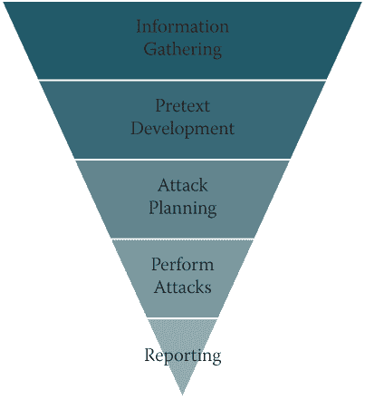
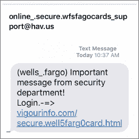
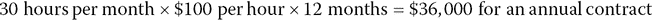

# 9
T5】黑客攻击人类

> 如果金钱是你独立的希望，你永远不会拥有它。一个人在这个世界上唯一真正的安全是知识、经验和能力的储备。
> 
> —亨利·福特

作为一个快速的回顾，我已经讲述了在过去的七年左右的时间里，SE 发生了哪些变化:OSINT 和如何使用它，沟通建模，伪装，融洽关系的建立，影响，操纵，启发和非语言。从沟通的角度来看，这是一个很好的知识基础，但因为我是一名专业的社会工程师，我需要告诉你如何应用这些信息，并在 se 环境中使用它们。

从恶意社会工程的角度来看，我看到攻击中使用了四种主要手段:网络钓鱼、伪装、欺骗和假冒。也有这些攻击的组合来困住我们。

在这一章中，我将讨论如何使用我在这些向量中讨论的技巧。然后，我回顾了(简单地说，我保证)报道这个总是很有趣的话题。最后，我会讨论如何打入这个行业并关闭一些客户。

然而，在我开始之前，我必须先讨论一下圣灵降临节的原则。这将为你如何对待社会工程测试奠定基础。

<aside>

* * *

# 注意

我在这一章中没有讨论的一件事是如何在恶意的一方使用这些技能。这本书的重点是如何成为一名专业的社会工程师，目标是“让他们因为遇见你而感觉更好。”恶意使用我已经谈到的技能*不会*让任何人因为遇见你而感觉更好。

 * * * </aside> ## 机会均等的受害者

我想从一开始就提到的另一件事是，社会工程载体不仅仅是对愚蠢的人类起作用的东西。它们对所有人都有效。有了正确的情绪触发，在正确的情况下，正确的借口可以让我们任何一个人成为猎物。

经常有人问我有没有被恶意社交工程过。很不幸，答案是，是的。在正确的时间正确的触发让我陷入了一封钓鱼邮件。幸运的是，除了一些尴尬，对我来说没有什么大的损失，因为我知道如何快速反应，以及如何解决问题。我有一个 M.A.P.P .(这是第 10 章的主题，“你有 M.A.P.P 吗？”).

我不喜欢“人类的愚蠢无处可逃”这样的口号。是的，我承认从安全的角度来看，有许多问题是懒惰甚至愚蠢的结果，但这并不意味着只有愚蠢的人才会上当。

曾经有一个案例，一个大学教授收到了一个 419 网络钓鱼诈骗(也被称为尼日利亚王子骗局)。教授百分之百地相信了。他被它深深地吸引了，在耗尽他一生的积蓄后，他从大学的金库里偷了钱。即使在他被抓住，联邦调查局介入后，他仍指责特工试图获取他的线索，以便他们可以从他的账户中获得数百万美元的利益。

<aside>

* * *

# 注意

419 骗局，又称尼日利亚骗局，其名称来自尼日利亚法律中关于欺诈的条款(第 419 条)。尼日利亚的骗局通常以“我是一个拥有数百万美元的王子……”开始，但最近已经转变为关于一个需要帮助的寡妇。无论哪种方式，这些骗局似乎继续对那些希望小投资可能导致巨额回报的人起作用。

* * *

</aside>

听起来很蠢，对吧？嗯，这是一个简单的答案。相反，我看着形势，考虑是什么让这个人如此投入到攻击中。以下是一些需要考虑的想法:

*   他有严重的金钱问题，这个骗局给了他财务自由的希望。
*   他的贪婪感是由他认为将会转入他银行账户的巨额数字引发的。
*   一旦他*承诺*，他就想保持*与他的决定一致*。
*   他觉得自己是在帮助第三世界国家的一个人过上更好的生活，同时也是在帮助自己。

通过从这个角度审视这种情况，我可以更容易地理解这位教授是如何如此投入这场骗局，以至于他毁了自己的生活，犯下了盗窃和欺诈行为，并欺骗了他的妻子——所有这些都是为了希望、贪婪和保持一致并致力于帮助自己和另一个人的愿望。

我不知道有多少次，一位首席执行官或其他高层人士告诉我，他们绝不会被我的骗局所骗，只是在 pentest 期间发现他们是远程访问的来源时，他们会非常愤怒。任何人都可能成为攻击的受害者，无论他们在组织中的职位如何。 ## 五旬节派的原则

Pentesting 是渗透测试的缩写，是一家公司雇佣一名专业人员来尝试渗透公司的网络。最终目标是，pentest 应该有助于在恶意攻击者能够利用它们之前暴露和修补任何问题。

多年来，pentestss 已经成为一种标准的安全工具，许多合规委员会要求公司至少每年进行一次 pentest。截至目前，没有多少政府合规法律要求公司在这些测试中包括社会工程。

就这一点而言，一个公司仅仅想要检查一个已经完成测试以满足合规性需求的盒子，通常是一个非常糟糕的客户。他们这样做是因为他们被迫这样做，而不是因为他们想这样做。你可以这样想:当你的孩子因为想给你惊喜而打扫厨房时，他们会比被迫做家务时做得更好。

有一些关于 pentest 的书面标准，以及可以帮助 pentesters 学习一些执行测试的最佳实践的规定。2009 年开始写社会工程的框架，现在是`[www.social-engineer.org](http://www.social-engineer.org)`的骨干。它被称为“se 框架”，全球许多组织在为其年度 SE 项目规划服务时都将其作为标准。然而，目前仍没有一套明确的标准用于 SE 测试。我认为这主要是因为社会工程是如此动态，几乎不可能计划每个阶段。

有一些步骤或阶段构成了 se 攻击向量的正常路径，如图 9-1 中的[所示。](#c09-fig-0001)

<figure>

<figcaption>

[**图 9-1**](#R_c09-fig-0001)T5【sè阶段

</figcaption>

</figure>

信息是社会工程攻击的生命线。所以，信息收集永远是第一位的是有道理的。在研究完成之前，你无法真正策划攻击。

在你收集了你的信息后，你可以很容易的判断出哪些借口是可行的，哪些是不可行的。了解一家公司如何使用社交媒体、沟通、地理位置以及其他有关其内部运作的细节，可以让你产生一些好的借口想法。

这些想法形成后，您就可以开始规划攻击媒介了。你会发钓鱼邮件吗？或者你会向他们了解更多信息或证书吗？你会使用移动设备攻击吗？你会亲自去现场吗？你会合并这些向量吗？当你开始计划攻击时，你可以回答所有这些问题。

从那里，您启动这些攻击，收集所有步骤的结果，并向客户端报告发生的一切。然而，pentest 并不总是按照严格的线性步骤进行。你可能在做 OSINT，想出一个很棒的攻击向量，然后想做更多的 OSINT，看看能不能找到一些支撑数据。

无论你如何看待它，SE pentest 的原则应该包括以下几点:

*   你想记录电话吗？在许多州，未经同意是非法的——不要以为客户雇佣你就等于他们“同意”你做你想做的事。你想录下你闯入的视频吗？确保已签字批准。
*   不要只是假设客户应该确切地知道社会工程测试的每一步。清楚地说出你想提供的服务。这也给他们提供了一个选项，在你继续下一步并潜在地制造一个问题之前询问测试的每一步。
*   Make sure you obtain written permission to record calls you will make.

    许多州是双方同意的，在这种情况下，你需要获得公司的同意，这样你就不会遇到法律问题。

*   Detail the exact Google search string or tool that was used so the client can duplicate the steps if needed.

    我听到一些圣灵降临节者说，他们担心他们是在武装客户自己去做圣灵降临节测试。然而，在我从事这项工作的这些年里，从来没有一个客户因为我教育过度而不再使用我的服务。

*   The story is as important as the results.

    例如，你可能会告诉客户，有 90%的点击率，47%的人在电话中给了你他们的域名，这肯定是可怕的统计数字。但你也必须解释这个过程的每一步，你开发攻击媒介的方式，以及谁关闭了你，为什么——因为所有这些细节对客户来说都是故事的重要部分。

*   Don't live-tweet or post on social media about your successful exploits of your clients*. (Seriously, when I see people do this I cringe.)*

    想象一下去你的医生那里做侵入性测试。他在你不想被探测的地方探测你。很不舒服，也许甚至有点痛苦，当然也很尴尬。他做完测试，离开办公室一会儿。你拿出手机查看一些应用程序，看到他发来一条推文，说:“你应该看看我刚刚检查的这个胖家伙身上的肿瘤大小。LOL“他没有提到你的名字，也没有你的照片，但是这让*你怎么感觉*？你喜欢医生吗？你觉得他好像是站在你这边的吗？如果我是病人，这将是我最后一次使用这个医生。

    把这一点应用到关于闯入客户的住处有多容易或者他们的安全有多糟糕的实时推特上。既尴尬又不专业。

这五条原则是适用于你职业活动的通用指南。在我进入可以帮助你使用每一个矢量的规则之前，我还有两条指导方针:记录每一件事，并且明智地选择借口。

### 记录一切

客户付钱让你深入挖掘，即使你不使用你在攻击中发现的信息，客户仍然需要知道你发现了什么。不可避免地，在你的工作中会有一些时候你会发现真正敏感的材料。问题是，你怎么处理？

在一次测试中，我的公司受雇对一家金融机构的高级管理人员进行测试。在我们的搜索中，我们发现了她在 20 多岁时自愿摆姿势的照片，这些照片现在被摄影师的网站用作宣传材料。可悲的是，其中一些照片被色情业者窃取，并被用来推广他们的网站。作为一名专业的社会工程师，你是如何处理这件事的？

我们认为这些信息太具破坏性和尴尬性，不适合作为鱼叉式网络钓鱼的主题。所以我们搁置了它，进行了我们的 pentest，然后要求与有问题的主管进行一次特别会议。我们主动提出帮她把这些照片从网站上撤下来，并且不向她的公司报告。她真的很感激，直到今天，她仍然是我的朋友。 ### 用借口来判断

我已经数不清有多少次在客户身上发现了真正令人尴尬的事情。我个人选择从不使用这些作为借口主题。你们中的一些人可能认为我在浪费好机会。然而，记住我的目标是“让他们因为遇见我而感觉更好。”此外，我希望能够提供教育，如果我只是羞辱了某人，这是很难完成的。因此，我会明智而敏感地选择在借口中使用什么。也就是说，记得我之前建议你总是报告你的发现——所以即使你没有使用令人尴尬的信息，你也应该告诉客户你的发现。

我有一个客户要求我的公司做一些鱼叉式网络钓鱼。他们的一名员工用自己公司的电子邮件登录了一个“勾搭”网站，向一些非常有魅力的裸体女性发布了一些评论，告诉她们他要来镇上出差，想要见面。抛开你对他提出欺骗妻子的顾虑或在这样的网站上公开使用他的公司电子邮件的安全问题的任何感觉。这些女士中的一个钓鱼网站有用吗？我几乎可以 100%保证，但是我们没有用。同样，一个专业的社会工程师的目标是教育和协助，而不是羞辱取胜。 ## 网络钓鱼

网络钓鱼被定义为发送假装来自信誉良好的来源的恶意电子邮件的行为。网络钓鱼的目标可以细分如下:

*   传递恶意负载，从而为远程攻击者提供访问权限
*   收集凭证
*   为进一步的攻击收集其他情报

网络钓鱼电子邮件的目标决定了其内容、借口和发送方式。作为一名专业的社会工程师，您可能会被要求发送一些不同类型的网络钓鱼方法。

### 教育网络钓鱼

有时候，客户并不想测试公司的网络资源——他们只想测试人性的一面。一种有效的方法是发送一封教育性的网络钓鱼电子邮件，这意味着当一个人与邮件进行交互时，不会发送恶意代码或获得远程访问。它只是 pings 回一个网站，报告钓鱼邮件被点击。这些统计数据用于帮助客户了解人们在多大程度上容易受到网络钓鱼攻击媒介的影响，以及哪里可能需要教育。

这种类型的网络钓鱼的目的是利用好奇心、贪婪、快乐或健康的恐惧让人们点击。要做到这一点，你要把借口建立在针对某个特定目标或整个公司的基础上。我和我的团队曾经向一个人和成千上万的人发送过这种类型的钓鱼邮件。

这里有一个例子来说明为什么遵循上一节的原则很重要:我为一个客户写了一个看起来像合法的 LinkedIn 邀请的网络钓鱼。我把它发给了一个客户的 7000 个用户。它的点击率非常高——大约 73%。我飘得很高，包括我在内的每个人都对这次网络钓鱼的成功印象深刻。

另一个 pentest 项目即将到来，我能够重复使用我成功的 LinkedIn Invite phish。接下来的一周，我把它发给了 10，000 名用户，点击量很少。活动结束时，点击率只有 4%左右。我简直不敢相信。毕竟，这是一个*天才*的钓鱼方法，对不对？我让客户试着从他们的用户那里找出为什么这次网络钓鱼尝试失败得如此严重。

原来失败是我的错。公司 1 是一家制造商，员工年龄在 35 至 55 岁之间。公司 2 是一家零售商，员工的平均年龄为 19 至 29 岁。当公司 2 问其员工是否看到了这封邮件，以及他们为什么不点击时，他们的回复是这样的:“是的，我看到了，但只有老年人使用 LinkedIn。我用脸书。”

*< facepalm >* 因为我在 1 号公司的成功让我兴奋不已，所以我没有停下来思考这不是一个适合所有人的情况。每个公司都需要有一个定制的网络钓鱼邮件。这一经历也坚定了我对仅依赖模板的钓鱼软件即服务(SaaS)解决方案的反对。

即使你的网络钓鱼企图是教育性的，它仍然需要金字塔中的步骤[图 9.1](#c09-fig-0001) 。从 OSINT 开始，准备一个吸引目标受众并达到预期目标的网络钓鱼。 ### Pentest 网络钓鱼

Pentest 网络钓鱼基本上与教育网络钓鱼相同，除了一个很大的区别:最终目标。pentest 网络钓鱼不是面向教育，而是旨在获取远程访问、凭据或其他类型的危害。

Pentest 网络钓鱼通常使用恐惧、贪婪、惊讶甚至悲伤等借口。我使用这些情感是因为在一个网页仿冒网站上，我需要的不仅仅是点击。通常，我需要目标打开一个文档，点击越过警告和/或输入凭证。因为这些步骤会占用目标更多的时间，所以我需要让目标在 alpha 模式下保持更长时间，所以情绪触发需要更强。

其中一个例子是我测试的一家公司，它非常热爱苹果的一切。这家公司几乎所有的员工都使用 MacBooks，谈论他们的全新 iPhones。pentest 发生在新版 iPhone 发布的时候。我发给该公司员工的钓鱼邮件上有一张新 iPhone 的漂亮图片，还有一条似乎来自人力资源部的消息:

> [公司名称] *将奖励 10 名幸运员工一部全新的 iPhone 和一年 100%的服务计划。抽奖将于下周五下午 3 点举行。*
> 
> *要进入，你只需要到这个内网页面，输入你的公司登录名和密码，就会自动进入:* `[https://iphone.updates-company.com](https://iphone.updates-company.com)`
> 
> 祝你好运！

我们购买了域名``[updates-company.com](http://updates-company.com)`` 并创建了一个模拟的内部网页面，它有两个文本框和一个按钮，以及公司的徽标。我向 1，000 人发送了钓鱼邮件，并收到了 750 个公司登录凭据。

在正确的时间对正确的人触发正确的情感会带来巨大的成功。 ### 鱼叉网络钓鱼

鱼叉式网络钓鱼及其各种变体是一种非常个性化的网络钓鱼形式。在深入调查目标和我能找到的任何家庭之后，我通常会从列表中挑选一些非常私人的东西作为我的借口。很多时候，我发现和使用的信息来自一个家庭成员在社交媒体上的帖子。

有一次，我发现一个目标和他的一群朋友去拉斯维加斯过周末。他的朋友上传了大量他们那个周末恶作剧的照片，这让我选择了这个作为借口。

我的钓鱼邮件来自他住过的酒店，下面是邮件内容:

> *【T2 先生】【目标姓名】，*
> 
> 7 月 3 日至 8 日，您住在我们酒店。结账时，我们的清洁人员发现了一件可能是您的物品。你能检查一下附件中的图片并告诉我们这是你的吗？
> 
> *如果物品是你的，请点击<u>此链接</u>并填写表格，以便我们将它寄回给你。*
> 
> *真诚地，*
> 
> *酒店员工*

现在，为什么我选择把链接，即使我知道恶意软件加载的附件不会显示图片？因为不管怎样，收到电子邮件的人都有可能认领该物品。该表格要求提供以下信息:

*   全名
*   邮寄地址
*   电话号码
*   电子邮件地址
*   出生证明(证明已满 18 岁)
*   目标用来订房的信用卡的最后四位数字

这个借口非常成功，不仅导致了全面的妥协，而且为我进一步的攻击提供了更多的借口。

即使当我使用个人信息作为鱼叉式网络钓鱼的借口时，我也不会使用对个人有害的信息。例如，在同样的网络钓鱼测试中，我会*而不是*使用这样的借口:“我们找到了一些你在拉斯维加斯时和妓女在一起的照片。点击这里支付赎金。”或者任何与此相近的东西，即使这是事实。如果我在 OSINT 中发现了这种类型的数据，我会直接向目标报告，并询问他或她希望我们如何处理此事。 ### 网络钓鱼摘要

我不知道你，但我平均每天从我所有的账户收到超过 200 或 250 封电子邮件。上次我检查的时候，我的工作是*而不是*单独检查电子邮件。

 <aside>

* * *

## 疯狂的快

**根据激进组织**(`[www.radicati.com/wp/wp-content/uploads/2017/01/Email-Statistics-Report-2017-2021-Executive-Summary.pdf](http://www.radicati.com/wp/wp-content/uploads/2017/01/Email-Statistics-Report-2017-2021-Executive-Summary.pdf)`)**的一份报告，2017 年平均每天有 2690 亿封电子邮件发出。这相当于每天每秒钟发送 310 万封电子邮件。另一个有趣的事实是:我认为其中一半会进入我的收件箱(好吧，这可能有点夸张)。** * * * </aside>

因为电子邮件是我们做生意、全球通信、保持联系、发送信件甚至购物的方式，所以它也是最广泛用于社会工程攻击的载体。作为一名专业的社会工程师，你有必要学习如何制作基于可靠信息的专业外观的电子邮件，以真正测试你的客户对这种载体的易感性。 ## 视觉

2015 年， *vishing* 一词作为一个词被收入*牛津英语词典*。我试图宣称对这个词的流行负责，但是没有人相信我。(我部分是开玩笑的。)

Vishing 是*语音钓鱼*的混搭，也就是电话钓鱼。这种载体现在比几年前更常见，我的理论是它的流行是因为它是一种非常有效的攻击。

以下是我选择使用 vishing 进行 pentest 的几个原因:

*   凭据收集
*   你分了
*   完全妥协

我将逐一讨论这些问题，以便您对它们的区别有一个清晰的了解。

### 凭据收集

在一次测试中，我和我的团队有很多次妥协的技术计划，但是我们尝试视觉或网络钓鱼，看看我们是否可以获得凭证，这将使我们更容易地进入网络。

有一次，在网上做了 OSINT 后，我有 10 到 15 个号码想用来收集凭证。我根据其他一些观点发展了我的借口。我发现目标公司正在使用第三方外包 IT 公司来管理他们从一个操作系统到另一个操作系统的迁移。这是一次大规模的升级，不仅涉及到操作系统，还涉及到他们所依赖的所有其他软件，这些软件都需要随之升级。

我的借口是我是来自 Secure IT(这本书的一个完全虚构的名字)的 Paul，我想检查该公司的员工升级状态，因为我们看到他们的机器出现了一些流量问题。事情是这样的:

| **目标:** | 早上好。这是史蒂夫。我怎么帮你？ |
| **我:** | 嘿史蒂夫。我是安全公司的保罗。我想… |
| **目标:** | *【打断】*:哦，你们这些家伙！你知道我有多少工作要做吗？你的新升级毁了我的生活！ |
| **我:** | 我明白，史蒂夫。这就是我打电话的原因。我们注意到有一堆格式错误的数据包来自你的 IP 地址，我认为这可能是由于堆栈溢出造成的 DNS 中毒问题。最后，我的声音越来越小，因为我祈祷他不是技术性的。] |
| **目标:** | 我的电脑中毒了？你到底在说什么，保罗？ |
| **我:** | 对不起我就是这样做的——只是滔滔不绝地讲所有的技术术语。我真的很抱歉。这意味着在安装过程中，可能有一个问题导致您的速度缓慢。我可以带你走几步，看看我们能不能修好它。你想这么做吗？ |
| **目标:** | 听着，保罗。我宁愿你派一个代表来修理它——我真的不明白你说的那些东西。 |
| **我:** | 我明白了史蒂夫。至少在四五天内我没有可以派的代表。但是我还有一个远程帮助你的选择。如果你愿意，我可以登录远程修复。 |
| **目标:** | 当然，如果你能使这台机器再次工作，我完全赞成。你需要什么？ |
| **我:** | 我已经做好了登录并进行调整的准备——我只需要获得您的用户名和密码，以便登录您的机器。 |
| **目标:** | *【毫不犹豫】* : SMaker，还有别忘了大写的 *S* 和 *M* 。我的密码很好，所以不要偷:Krikie99。 |

就这样，我拿到了王国的钥匙。

当谈到凭证收集时，我发现如果我能找到一些信息，帮助我使用与目标相关和真实的细节建立一个可信的借口，这项工作会更容易。此外，除了查看域凭证之外，我还查看了 VPN、电子邮件、安全存储、特定数据库甚至门代码的凭证。 ### 钓 osint

有时，在 pentest 期间，我没有足够的细节来完成攻击，或者我想在攻击之前验证一些细节。在一个案例中，我有一个针对目标的鱼叉式网络钓鱼和钓鱼攻击计划，但是我们已经找到了几个可能是他的电话号码和电子邮件地址。

我们想出了一个快速的借口来确定哪些数字是真实的。我们发现目标经常往返于加拿大和伦敦之间。我们找到了伦敦一家希尔顿酒店的电话号码，伪装成这家酒店，然后一个接一个地拨打目标的电话号码。

| **目标:** | 喂？ |
| **我:** | 你好，是阿尔弗雷德·盖恩斯先生吗？ |
| **目标:** | 嗯，是的。这是谁？ |
| **我:** | 对不起我是伦敦希尔顿酒店的保罗。我想花点时间感谢您最近入住我们酒店。如果您只有 30 秒钟的时间，我们有一个关于您入住的简短调查… |
| **目标:** | 留下来？你在说什么？我已经几个月没在伦敦的希尔顿酒店住过了。你怎么得到这个号码的？ |
| **我:** | 先生，很抱歉造成混乱。这是阿尔弗雷德·盖恩斯的电话号码 846-555-1212，对吗？ |
| **目标:** | 是的，那是正确的，但是你可能有我最近停留的错误记录。 |
| **我:** | 好的，如果我把发票电邮给你，你告诉我是不是你，可以吗？ |
| **目标:** | 你当然可以。 |
| **我:** | 太好了。我能把它寄到 a.gaines@hmail.com 吗？ |
| **目标:** | 嗯，好吧，我宁愿用我的其他电子邮件地址。那个是我不常检查的。把它送给[gainesat@gmail.com](mailto:gainesat@gmail.com)。 |
| **我:** | 好的，别担心，先生。我们会马上送出去。 |

这给了我们电话号码、电子邮件地址的确认，以及一个目标会因为这个可视电话而上当的清晰向量。

我和我的团队已经多次使用这种技术来验证我们发现的数据，并发现新的英特尔片段。我发现这种形式的观察非常有效，因为目标没有太多时间来决定是否帮助。此外，大多数公司没有对员工进行这方面的适当教育。这种组合给企业带来了巨大的风险。 ### 寻求全面妥协

仅使用可视化就可以执行完全的折衷。原则是一样的，只要有合适的借口和支持证据，一个专业的 SE 可以很容易地获得甚至是最敏感的细节。

有一次，我和我的团队负责测试一家大型金融机构，使用 vishing 作为我们的载体。我们的目标是以 C 级员工的身份打电话，看看我们是否能获得他们的用户名和密码，或者他们系统或数据的任何其他部分。

我们的借口是一位去夏威夷度蜜月的女主管，当她在机场时，她的老板打电话来说他找不到周一会议的重要报告。她知道它在她的桌面上，但是忘记了远程访问的登录。

我们加载了一个名为“机场背景噪音”的 YouTube 剪辑，然后开始通话。我静静地听着，作为一个沉默的伙伴提供快速的想法或主意。事情是这样的:

| **目标:** | 支持。我怎么帮你？ |
| **SE agent:** | *:*你能听到我说话吗？这个机场的噪音太大了。 |
| **目标:** | 嗨，是的，声音很大，但是你的声音很清晰。今天我在和谁说话？ |
| **SE agent:** | 天啊，我很抱歉。*【又一声叹息】*这是詹妮弗·提莉，金融界的 SVP。我要去夏威夷度蜜月，我的主管打电话给我说最新的预算报告从目录中丢失了。他在周一的会议上需要它，我需要登录并给他，但我忘记了登录。 |
| **目标:** | 好吧。让我们看看我是否能帮助你。首先，我需要核实你的身份。但在此之前，让我祝贺你结婚，我希望你在夏威夷玩得开心。 |
| **SE agent:** | 非常感谢。我太激动了。这是我第一次去夏威夷，我要和我最好的朋友和新丈夫一起去。 |
| **目标:** | 祝福你。听到人们那样说话，我心里暖暖的。蒂莉女士，能告诉我你的身份证号码吗？ |
| **SE agent:** | 你知道什么是疯狂吗？由于我被承诺两周不工作，我没有带任何笔记本电脑或身份证。我有一半的时间记不住自己的生日，所以我想我根本不会记得我的 ID。 |
| **目标:** | *【尽力帮忙】:*好吧，也许如果你努力的话。它从 17 开始，你只需要记住另外五个数字。*【这条情报非常重要。]* |
| **SE agent:** | 我真的是一片空白。不知道是不是漏了 98231 之类的？ |
| **目标:** | 嗯，号码里有一个 9 和一个 8，但是，让我们试试别的。你能告诉我你们经理的名字吗？ |
| **SE agent:** | 当然，我是迈克·费里。 |
| **目标:** | 好极了。你能确认你的电子邮件吗？ |
| **SE agent:** | [j.tilly@companyname.com](mailto:j.tilly@companyname.com) |
| **目标:** | 太好了。好吧，这是我能做的，我可以重置你的密码，并把它发送到你的移动设备上；然后你就可以登录并得到那份报告了。让我……*【背景中打字和点击的声音】*蒂莉女士，很抱歉，我没有看到你已经安装了远程访问。所以即使我重置了，你也进不去。 |
| **SE agent:** | 哦，不。这太可怕了。我要离开两周，30 分钟后就要登机了。我们如何解决这个问题？请帮帮我！*【声音中带着高度的焦虑，听起来近乎眼泪】* |

我刚刚给 SE 代理发送了一条信息，向她建议我们需要看看能否让目标在她的机器上为我们安装远程访问，并在对话继续时给我们一次性代码:

| **目标:** | 嗯，我们可以申请安装远程访问，但这很可能需要几个小时，甚至到明天。 |
| **SE agent:** | 你太好了，现在，我丈夫不太高兴。我们应该一起坐在休息室里，分享一些香槟，我正在努力处理这个工作问题。有什么办法能让我们快点吗？ |
| **目标:** | 你知道吗，詹妮弗小姐？你将会有一个美妙的蜜月；让我看看我能做什么。如果我让你等几分钟，你没问题吧？ |
| **SE agent:** | 当然，只是不要太久。我们应该很快登机。 |

这样，我们可以听到背景中的目标对他的同事说:“这个可怜的女人要去度蜜月了；我们需要帮助她进入她的机器。我相信我们能很快完成，对吗？”

我们听不到其他人的评论，但我们感觉到每个人都在团结起来帮助詹妮弗。几分钟后，目标客户将电话置于等待状态，准备拨打另一个电话，然后才回到与 SE 代理的通话中:

| **目标:** | 蒂莉女士，嗯，我有一份结婚礼物给你——一个代理正在为你安装远程访问。再过 10 分钟，我们就能让你上机了。 |
| **SE agent:** | 你是我见过的最棒的人！我老公会很开心的，这是最好的礼物！谢谢大家！ |
| **目标:** | 当我收到代理的通知时，我会给你发一个一次性密码，然后你就可以进入了。 |
| **SE agent:** | 哦，我不能那么做。我没有带我的工作电话，所以我不能查看那条短信。 |
| **目标:** | 哦，不，蒂莉女士。我们过不了这一关。我不知道该怎么办。 |
| **SE agent:** | 这太可怕了！。这会给我上一课，因为我太笨了。我应该带手机来的。现在我不得不取消这趟航班，推迟我的行程。很遗憾，但你真的很棒，很有帮助。非常感谢。 |
| **目标:** | *不！*我们不会让你错过蜜月；这是不可接受的……*【低声耳语】*听着，我会把代码发给你的手机；当它发行的时候，我会通过电话给你密码，好吗？ |
| **SE agent:** | 你会为我这么做吗？我可能会哭。 |
| **目标:** | 现在，这些都没有了。我们得让你在飞机上完全不去想工作。 |

有了它，我们就有了远程访问、密码，并且如果我们愿意的话，还能入侵整个机构。

<aside>

* * *

## 亲提示

你可能会注意到，我倾向于用情感借口来给目标提供“拯救”或“帮助”我的能力。这背后是有科学依据的。给别人信任你的能力，同时你也信任他们，这在两个人之间建立了非常牢固的纽带。它会释放催产素，然后这种纽带会让目标保持一致地想要帮助你，不管这个决定有多不安全。 * * * </aside>

使用完全妥协的视觉可以使五旬节派的工作容易得多。很多时候，重要的是要明白寻求妥协可能需要在开始寻找更多更详细的借口之前先找到新的借口。 ### 钓鱼摘要

视觉是一种强有力的媒介，如果落入坏人之手，会造成毁灭性的后果。因为它可以用于社会工程攻击的几乎每个方面，所以它是一种强有力的武器。

对于一个专业的社会工程师来说，要想成功，不惧怕电话是当务之急。学会拥抱它，即使它不是你最喜欢的交流方式。掌握打电话的技巧，学会建立融洽的关系，获得信任，然后在看不到目标的情况下获取信息，这会让你更成功。 ## 错过

这是一个很短的部分，因为 SMiShing 没有被攻击者或专业的社会工程师广泛使用。2017 年，富国银行被攻破，在那次攻破之后，我们看到了更多的 SMiShing 攻击。他们中的许多人看起来非常像你在图 9-2 中看到的。大多数垃圾信息很简单，但它们很有效，通常用于在移动设备上加载恶意软件或窃取凭据。

<figure>

<figcaption>

[**图 9-2**](#R_c09-fig-0002)

</figcaption>

</figure>

在过去的两年里，移动操作系统一直是恶意软件和其他攻击的目标，希望获得受害者设备的访问权限。随着公司也允许自带设备(自带设备)的举措，我们也看到了移动设备违规的增加。移动入侵，例如阅读电子邮件、远程打开摄像头或麦克风，以及将移动设备用作某种远程接入点，已经成为许多组织的恐惧。

因此，对于社会工程师来说，了解如何在实践中使用微笑是很重要的。这里有几条规则可以让垃圾邮件与网络钓鱼大相径庭:

*   简洁是关键。微笑应该简短而甜蜜——不要堆砌，不要开头和结尾，只要事实和链接。
*   **链接。**在我看来，拥有一个看起来与你发起的攻击相似的域名总是更好，但如果这不可能，那么短的 URL 在短信中比在电子邮件中更容易被接受。在移动设备上悬停来检查链接几乎是不可能的，因此用户需要接受高级培训才能看到不良链接。
*   **不要吝啬。**如果你试图获取凭证，不要认为你不需要品牌或网页来看起来合法，因为目标正在使用移动设备。为了确保您完全测试目标，请确保花时间让一切看起来真实。
*   不要走太多步。目标是在移动设备上，所以如果有三个或更多的步骤，你会失去你的观众，他们将没有动力继续下去。

随着我们看到 BYOD 和在家工作的员工的增加，对于专业社会工程师来说，了解这一载体以及如何用它来测试人群将变得更加重要。

手机将会一直存在，而且它们正变得越来越强大，越来越成为我们移动工作生活的一部分。这将使我们的客户更难发现攻击。 ## 扮演

假冒是最危险的手段之一，但也是 SE 代理采用的风险最高的手段之一。因此，它是四个向量中使用最少的一个。模拟是对目标公司的雇员或可信任的权威人士(执法人员、公用事业工作者等)的物理模拟。

对我自己和我的团队来说，模仿是帮助客户的最有趣的方式，但是对我们来说风险很低。在实际的攻击中，冒充有相当大的风险，这意味着它需要最周密的计划。在我们的 pentests，我们有一个“出狱自由信”，这意味着我们不能真的因为我们的行为而惹上麻烦，而真正的坏人，如果被抓住，会在监狱里呆很长时间。

 <aside>

* * *

## 模拟 SE 向量与红色团队

红队通常在晚上进入(尽管它可以在任何时候进入),并专注于尝试破坏物理安全——电梯、锁、安全摄像头等等。模拟 SE 向量侧重于物理安全的人员部分。因此，我们不是撬锁，而是说服有钥匙的人让我们进去。我们不是用垫片填补那扇门，而是找一个有徽章的人让我们通过。红队专注于安全硬件，而来自 SE 的模拟专注于人员。 * * * </aside>

### 计划一次模拟测试

社会工程测试者需要记住，当涉及到模仿载体时，目标的所有感官都参与进来。尽管网络钓鱼只涉及视觉，而视觉只涉及听觉，但模仿需要处理几乎所有的感官(尽管它可能不太涉及味觉)。

出于这个原因，彻底计划五旬节的原则是很重要的，如下面的小节所述。

#### *信息收集*

信息收集是现场模拟评估的重要组成部分。我经常要求学生给我一个保证入学的借口。想一想这个。你有主意吗？

学生们经常建议像 UPS 递送这样的事情。我的后续问题有助于他们思考最初的陈述:“好吧，很好——但是接下来呢？有多少人见过 UPS 快递员在大楼里闲逛？他们通常不会经过前台或收发室。”

OSINT 对于开发一个似是而非的冒充借口是必不可少的。在我的一次工作中，我发现当地的建筑工程导致通常在春天出来的蜘蛛提前出来了。太麻烦了，上了当地新闻。我的借口是喷洒杀虫剂来对付蜘蛛，效果非常好。 #### *托词发展*

当我谈到收集信息时，我提到了借口的发展，但是不要犯在你开始行动之前试图计划你的借口的错误。此外，在你选好借口后，你需要考虑一些其他的事情:衣服、工具、你的外表等等。此外，还要考虑道具看起来是新的还是用过的。你必须考虑让借口可信的所有因素。掩护你们的基地。

最近，我和我的一名员工闯入了几家银行，通过做 OSINT，我了解到这家银行刚刚完成了 PCI 合规性测试。我们找到了做测试的公司的名字，所以我们穿戴整齐，佩戴徽章，出示了 PCI 合规公司的证件。这让我们顺利地进入了 ATM 测试中心。从那里，我们进入了两台不同的计算机，甚至获得了立方体中其他雇员的凭证。

当一位经理走过来问我们的内部联系人是谁时，我们不知道他的名字。那是我的疏忽，是一个失败导致我们被抓。是的，你可以争辩说，此时我们已经入侵了网络，在 ATM 测试中心有近 30 分钟的时间可以访问多台计算机，但这一条数据本来可以节省我们的时间，给我们更多的时间。 #### *攻击策划与执行*

一旦你有了借口，当你进入大楼时，你需要明白目标是什么。换句话说，你需要知道你不能做什么。你可以得到一个远程外壳吗？你可以破坏服务器吗？你可以从大楼里带走设备吗？不要做出可怕的假设，仅仅因为你被雇来扮演一个坏人，你就可以随心所欲地做他们会做的任何事情。这将是一个非常糟糕的假设。

从头到尾计划好攻击应该是什么样子，然后确保您手头有工具并且经过测试可以完成这些目标。

一旦计划完成，确保你的 GOOJFL(“免费出狱”信)涵盖了你想做的所有事情，如果它没有涵盖所有事情，就把它包括进去。

完美的实践造就完美。 #### *报告*

记住，约定中最重要的部分是告诉客户你做了什么，如何做以及下一步需要做什么。在开始之前，请确保您拥有录制音频和视频的权限。或者，如果你没有这种权限，想出你将如何确保你为报告捕捉完整的故事。

对我来说，用这种攻击来讲故事很重要。我希望客户能感觉到他们能看到、听到、感受到完整的攻击，并能感觉到什么有效，什么无效。我发现对他们的成功赞不绝口，对我的成功实事求是，是非常有益的。

我在报告中的目标是“阅读后感觉更好”。要做到这一点，我不能令人尴尬或过于张扬或完全贬损。

到目前为止，此处陈述的原则将有助于您的实际现场服务。我发现这部分工作需要更多的计划。尽管如此，对于报告中包含的信息可能还有一些问题。以下是我对一些敏感数据处理的想法。 #### *录音的合法性*

请记住，我不是律师，我说的任何话都不应被理解为法律建议。你绝对应该找个律师来处理这些事情。

对于我公司的合约，我们做以下工作:

*   工作前，研究州和/或国家的音频和视频记录法律。
*   获得客户的书面许可，以记录两者。
*   Never, ever, ever, ever, ever (did I say *never ever*?) use these recordings in a speech or training without permission.

    即使你得到了许可，你也应该对录像进行消毒，这样就不会有任何可识别的东西。所谓“净化”，我的意思是去掉所有的名字、工作场所和任何其他的识别词。

*   确保所有的录音都交给客户，用于他们的教育。
*   确保储存、运输和使用始终安全。

重要的是要了解你所做的事情的风险，也要知道你打算如何使用你收集的东西。在一次工作中，我让一位女士在附近的电脑上输入她的用户名和密码。当她遵从我的要求时，我不仅记录了她的脸，还用相机拍下了她的证件。为了不让她尴尬，我从视频中模糊掉了她的脸。当然，客户可以告诉我他们想要清晰的视频——这是他们的选择和权利。但我先出示了模糊的视频，当事人没有反驳。如果视频用于教育目的，我不会觉得这个女人必须永远重温她的尴尬。 ### 卫生处理的注意事项

在工作的时候，我用藏在剪贴板里的针孔摄像机记录下一切。当我试图躲避安全检查时，我溜进了一个服务器室，我无意中发现两个人在做…嗯…你不会想到他们会在工作时做的事情。(是的，性，如果你还没猜到的话。)这让我一时忘了自己应该是一名 SE。壁橱里的那对夫妇很生气，对我大喊大叫，我就跑了出去。后来，我意识到我拍了将近 60 秒的性爱录像，因为他们缺乏专业精神。这显然不是我能发给客户的东西，我必须考虑我想如何处理这件事。

最终，我认为公司给了我一大笔钱来帮助保护他们、他们的网络和他们的员工。我目睹的是违反公司政策的行为，据我所知，这可能是一个陷阱。如果我没有报告此事，然后听说公司遭到破坏，而我本可以阻止此事，我该承担多大责任？

<aside>

* * *

## 亲提示

在间谍的世界里，蜜罐是一个秘密引诱另一个人说出敏感信息的人。它还被用来描述一个系统(计算机),该系统被设置为从不知情的用户那里收集详细信息。 * * * </aside>

我决定我有义务报道这一事件。是的，这确实导致了这位先生被解雇。为什么那个女人没有被解雇？好吧，她不为公司工作——那家伙把某人从外面带进了一个服务器机房，让他参与一些本应保留给家庭、酒店或除了工作环境以外的任何地方的隐私的活动。

您必须决定您将对记录的哪一部分进行消毒。当有人采取了不违法的行动时，我会进行消毒——如果他们只是受到了社会工程的攻击，但他们对公司规则并无恶意。我的重点一直是努力确保教育是第一步，而不是解雇。

然而，如果我发现有人下载色情内容，参与性活动，偷窃，访问他们不应该访问的数据，或者上帝保佑，参与任何形式的儿童剥削，他们不应该指望一个试图保护他或她的客户的专业社会工程师的任何善意。 ### 设备采购

你可以在很多地方找到“间谍耳朵”从亚马逊到专卖店(我最喜欢的商店之一是 https://spyassociates.com 的网上商店)，有很多地方可以买到这种类型的装备。请记住，你会得到你所付出的。25 美元的笔式摄像机质量差且不稳定，而 600 美元的带 DVR 录制功能的按钮式摄像机可能会好得多。

在你买东西之前，做一点调查。在下订单之前，我总是会做以下事情:

*   我检查了退货政策，并确保如果物品损坏，我不必将物品运送到国外。
*   我阅读产品和公司的评论，以确保我得到了最好的回报。

<aside>

* * *

# 注意

你可能需要一段时间才能适应拍摄角度，同时成为一名优秀的社会工程师。出于这个原因，我试着让几个相机同时工作，这样我至少可以得到一个好的角度。

* * *

</aside> ### 模拟摘要

有了正确的计划，这个复杂向量的执行会变得容易得多。请记住，模拟不同于红色团队，您需要做好扎实的规划，以确保您彻底测试了物理安全协议。

作为 SE pentester，了解你正在做的事情的范围是很重要的，这样你就可以达到客户想要的所有目标。尤其是因为最终目标是在报告中包含一个概述如何修复所发现问题的部分。作为系统工程师，如果您不仅理解“是什么”(您做了什么)，而且理解“为什么”(它奏效了)，那么这一部分将会更有用。

我们看到越来越多涉及物理安全方面的违规行为——USB 掉落、设备物理盗窃，甚至更糟的是工作场所的暴力。由于这些原因，作为实践的一部分，专业 se 测试人员掌握模拟 SE 矢量是至关重要的。 ## 报告

在我职业生涯的早期，我受雇闯入七个仓库。我有 100%的成功率。我甚至可以用不同的借口在同一天两次进入一个仓库。

这是一种很棒的感觉，我把整个过程都录了下来，并为客户做好了准备。项目负责人告诉我开始写报告，并发给我一份模板文件。除了一些标题外，模板文档是空白的。

我想我盯着它看了几个小时——开始，然后停止，然后擦掉，然后再开始。几十个小时后，我完成了我认为是报道历史的杰作。

我想象着报道团队会收到它，阅读它，并在我进入大楼时为我在街上扔棕榈叶。我把它发了进去，等待着热情洋溢的赞美。

一天后，电话响了，电话是这样的(我试图让它更有家庭气氛):

*   “嘿，克里斯，你发给我收件箱的那堆冒着热气的垃圾是什么？这是开玩笑吗？你这是在笑吗？你认为这能成为一篇报道吗？它带着维修标记回来了。现在就完成*！”*

 *当我拿回报告时，它不再是黑白的——而是红绿白。似乎没有一个段落没有重大的修改。

我花了两个星期来修改文件，这是我报道生涯中最糟糕的经历。然而，同时，这也是我有过的最好的经历。它教会了我一份好的报告看起来和感觉起来是什么样的。我最初的报告包含了一个让我看起来很棒很酷的故事情节——就像服用了类固醇的詹姆斯·邦德。然而，它缺少一些可能对客户有帮助的关键元素。

本章的这一部分不是报告写作的研讨会，但我有一些原则与你分享。

### 职业化

专业是成为专业人士的艺术。考虑去看你的医生，你希望和祈祷他是专业的。如果你站在磅秤上，他说，“哇，耐莉，你会有什么感觉？谁有这条鲸鱼的鱼？”然后拍拍你的背，说他“只是在开玩笑。”

我无法想象我们中的许多人会喜欢这样。同样，我们的客户不想听到这样的话，“我们把你搞得太糟糕了！”或者“哇，这家伙真的把这个放到网上了吗？”或者“你所有的仓库都属于我们。”(最后一个我可能凭经验知道一些。)

请记住，这份报告会有很多人阅读，改变的最佳环境是人们感到快乐而不是尴尬或羞辱的环境。你的语言、描述词以及你传达事实的方式都应该表现出专业性。 ### 语法和拼写

语法和拼写是我个人最讨厌的。是*攻击向量*，不是*攻击向量*。是*的融洽*，不是*的汇报*。你明白了。你应该总是考虑花时间对你的报告进行拼写检查，然后让一个信任的人来校对。

即使进行了这些检查，您仍然可能会留下一些错误。错误时有发生。不要期望完美，但是不要提交一份有很多错误的报告，你会让客户认为你不关心这部分工作。 ### 所有的细节

我过去曾听 pentesters 说过，他们忽略了某些细节——比如他们是如何找到 OSINT 的，他们使用的确切的谷歌搜索字符串，或者其他一些人工制品——因为他们觉得如果他们给客户太多信息，客户就不再需要社交工程服务了。

对我来说，这简直是愚蠢至极。当我写我的书《网络钓鱼黑暗水域》时，我听到了同样的观点，在书中我概述了制作网络钓鱼程序的确切方法和过程。然而，相反的情况发生了:许多公司正在使用这本书来建立一个惊人的网络钓鱼意识程序，以及许多谁读了它，并希望我帮助他们建立程序。

不要太担心给客户太多。大多数人会欣赏你的知识，并对你的发现印象深刻。他们会希望与有足够信心向他们提供所有这些细节的人在一起。

也就是说，如果您发现超级敏感的项目，请务必与您的联系人沟通，以澄清哪些内容应该包含在报告中，哪些不应该包含在报告中。 ### 减轻

缓解可能是报告中最重要的部分，但也是最容易被忽视的部分。你希望你的医生告诉你你得了一种可怕的疾病，然后祝你“好运”并离开房间吗；或者说，“下次体检见…希望如此。”？当然不是。你也不应该这样对待你的客户。相反，给他们一些可行的缓解措施。

如果缓解步骤是我所说的陈词滥调和废话，这对你的客户意味着什么？例如，假设你为一个客户做了一个视觉测试，这个月达到了 80%的妥协率。您认为以下哪种缓解方案对客户更有帮助？

*   **Option 1:**

    社会工程师建议你继续测试你的种群，并使用正向强化来引出对视觉攻击的正确反应。

*   **Option 2:**

    *社会工程师分析了本月视觉活动的数据，注意到以下两点可用于继续教育:*

    *   女性打电话者倾向于使用与男性打电话者相同的借口做得更好。这可能意味着在如何识别诱导方面需要更多的教育。
    *   当看到一个伪造的员工姓名时，只有 12%的人试图验证姓名，甚至有少数人在没有找到姓名后继续提供信息。这表明需要更多关于如何正确验证呼叫者的教育。

    随着我们继续测试，Social-Engineer 希望安排一次电话会议，讨论如何将这些应用到教育项目中。

显然，第二种选择是最好的，但是很多时候(我承认我的团队也犯过这种错误)，报告中包含了不可操作的陈述，这些陈述实际上并不能帮助客户，反而起到了填充的作用。

即使在这样做了几年之后，确保不自满仍是一场持续的战斗，在这一点上，我为我的客户付出了 100%的努力。 ### 后续步骤

除了缓解(修复问题)之外，客户通常想知道，“现在怎么办？”包括后续步骤是报告的重要结尾。它让客户知道他们应该做什么，并期待前进。

我不是说你应该简单地说，“下个礼拜见。”您需要遵循与我之前讨论的相同的缓解规则。给你的客户足够的细节，让他们感觉有一条清晰的前进道路。

我的许多客户都是月服务客户，所以前进的道路是已知的，但这并不意味着我可以完全依赖它。客户仍然想知道我们是否应该改变事情或者适应以增强程序。

当你把所有这些步骤放在一起，你会得到令人惊讶的报告，这些报告将真正帮助你的客户，让他们和你感觉更好。 * *## SE Pentester 的主要问题

在我结束这一章的时候，我想回答一些作为一个专业的面试者最常被问到的问题。我肯定还有很多其他的问题，但这些是最常见的。我希望这些能对你有所帮助，不管你现在是以 se 为职业，还是正在努力把它变成职业。

### 我怎样才能找到一份社会工程师的工作？

这可能是我整个职业生涯中被问得最多的问题。当你决定要去做的时候，你会做什么？嗯，你必须从某个地方开始，这就是为什么这个答案这么难。也许在过去的 10 年里，你一直在从事目前的职业。你有这方面的专业知识和技能，你也有相应的薪水。作为一名社会工程师开始新的职业生涯不仅意味着专业知识和技能的重新开始，而且可能还意味着薪酬的重新开始。我最好的建议是你愿意做以下事情:

*   走出你的舒适区。
*   重新开始。
*   学习全新的技能。
*   如果有必要，可以减薪。

如果你能做到这些，你可以期待在社会工程领域有一份不错的职业。*但是*(总有一个*但是*，不是吗？你不能指望这些公司会打电话给你，给你提供一份工作。我们这些社会工程师屈指可数，你仍然需要证明自己不同于所有其他候选人。这些事情需要你做一些工作。

<aside>

* * *

# 注意

请记住，成为一名专业的社会工程师并不仅仅是闯入银行并通过网络钓鱼获得外壳。有大量的办公室工作和报告需要进行。成为一名专业的社会工程师不仅仅是能够与他人交谈或者能够在压力下快速清晰地思考——这是一整套事情。

**在这个列表中，你的弱点在哪里:**

*   **启发**
*   **油嘴滑舌的人**
*   **思维敏捷的**
*   **优秀报告作家**
*   **专业演讲**

你需要识别它们，这样你就可以改进它们。

**有机会就去** `[https://youtu.be/RGnzf66-a4A](https://youtu.be/RGnzf66-a4A)` **看我在 DerbyCon7 做的一个关于这个话题的演讲。(警告:这要从我的朋友戴夫·肯尼迪对我的恶作剧说起，但是坚持住——我很快就回到了主题上。)**

* * *

</aside> ### 我如何让我的客户做 SE 的事情？

假设你已经是一名 pentester，正在做一些社会工程的工作，这一节给你一些如何让你现有的客户雇佣你做更多的 SE 工作的想法。

#### *不要免费向他们提供一些服务*

有些人建议，如果你给客户一些免费服务，那些客户会看到你所做的好处，并为你更多的工作支付报酬。我有一个趣闻，解释了为什么这种策略不像你期望的那样奏效。

当我开始进入科技行业，制造计算机时，我尝试发起一个免费的研讨会，讨论如何作为一个小企业保持安全。在这个研讨会上，我提供了 60 多分钟关于防病毒、网络、文件共享等方面的实用技巧。最后，有一个 5 分钟的推销，关于为什么公司需要使用我作为他们的供应商。

我与当地的一个商会合作，免费提供了这次演讲。我们举办了三次这样的研讨会，报名的人数非常多。每个研讨会都有 20、30 或更多的人报名参加。我已经看到了美元符号，感觉自己赢了。

第一次研讨会的日子一天天过去，我走进房间，架起投影仪，拿出我的讲义和所有我自掏腰包支付的赠品。开始前五分钟，房间里只有一个人。在开始前两分钟，房间里仍然只有一个人。开始时间到了，其他人都没有出现。很尴尬。我开始给一个人演讲。五分钟后，他说:“嘿，这真的很奇怪。你想去吃午饭聊聊吗？”

我迷路了——我不知道发生了什么事。在第二次研讨会发生同样的事情后，我取消了第三次研讨会。有人建议，“嘿，下一个研讨会收取每人 50 美元的报名费用。告诉他们可以免费得到价值超过 50 美元的东西，但要他们付钱。”

我甚至不愿意尝试。我想，如果他们不是免费来的，他们是不可能付钱来参加的。然而，当我为研讨会收费时，我有 10 个人坐在房间里，每个人都支付了 50 美元。

什么？？？参加人数少于我最初的报名人数并不重要。重要的是，来的 10 个人实际上为来的特权付了钱。

后来，我和一位商界朋友坐在一起，他建议我对研讨会收费，他解释说，当人们付费时，即使是很少的一部分，他们也增加了它的价值。如果有人注册并支付了费用，但最终没有参加，他们将失去不可退还的 50 美元。这成为了一个强大的参与动机。

当我刚刚开始我的 SE 职业生涯时，我好像没有学到任何关于免费提供东西的知识。有人邀请我去世界各地做演讲，而我没有向他们收取任何费用。我发现很多时候，人们会取消或者直到最后一刻才做出承诺。

我的一个朋友，平看，告诉我停止收费，并开始收取固定金额。我本来很不愿意听她的，但是我反思了一下之前的经历，决定试试。

令人惊讶的是，人们非常愿意支付更高的金额。他们似乎也更看重我。这改变了我做生意的方式，从那时起，我再也不免费赠送东西了。

这个长篇故事的寓意是这样的:不要以为把自己的才华免费赠送出去，就能让人重视你。没用的。你可以找到一个平衡点，提供一个有折扣的高端服务，或者提供一个三个月的合同，一个月免费。对你的收费有创造性是可以的，但是要知道免费工作只会贬低你的专业技能。 #### *快速失败并继续前进*

如果我遇到一个不愿意接受我的服务的潜在客户，我会先用一个公司层面的人来证明它的有效性。通常，当决策者看到风险和好处时，他们会准备为这些类型的服务提出预算。一次小小的接触往往就能带来更多与公司的接触。但有时这还不够，一家公司不想从事进一步的社会工程服务。

如果你所做的一切都无法让一家公司相信你可以提供帮助，你该怎么办？走开。要意识到，与其试图把一个方形的钉子钉进一个圆形的孔里，不如快速失败，然后走开。

如果一家公司看不出有必要将 SE 作为其安全机制的一部分，那么你可能就不会想让他们成为你的客户。和他们一起工作会令人沮丧，最终也不会发现你的价值。

我有一个客户跟了我四年。当我刚开始在这家公司工作时，他们几乎是完美的客户。我有一个惊人的联系点，那个人渴望去。这个项目非常成功，客户看到了巨大的变化。一家规模大得多的公司给了我们负责这个项目的内部联系人一份工作，希望她负责公司的安全项目。她抓住了这个机会，我明白为什么。一个新的女人被雇来代替她的位置。

从和新来的女人一起工作的第一天起，就不一样了。新的接触点很容易被冒犯，把这种方式看得太个人化，不愿意承担风险，也不想把这个项目进行到她的前任所做的深度。因此，该计划陷入困境。人们又回到了他们的老路上，尽管网络钓鱼的统计数字在纸面上看起来仍然很棒，但是这个项目却停滞不前了。

在我与该公司分道扬镳的六个月前，我曾告诉我的团队，我们将失去他们这个客户，我们确实做到了。他们只是我们以这种方式失去的第二个客户，但我认为这是最好的结果。他们不想让项目朝着需要的方向发展，所以这对他们和我们来说都是令人沮丧的。

由于一天只有固定的几个小时和我们可以处理的客户，我宁愿把时间花在希望看到变化的客户身上。不要害怕放弃交易，因为它们不合适。 ### 我应该收多少钱？

我经常听到这个问题，但我甚至考虑不把它写进这本书里，因为答案并不容易或简单。然而，由于这是一个如此受欢迎的常见问题，我试图尽我所能涵盖这个主题。

首先，你需要了解作为一名顾问，你的时薪是多少。我做了一点研究，发现了几个网站，它们给出了全球不同地区的安全领域顾问可以接受的费率建议。

这个比率取决于几个因素，比如多年的经验，在这个领域的专业知识，你的公司的知名度，以及你提供的服务。

为了便于计算，假设我决定我的工资应该是每小时 100 美元。我通过决定(根据经验)每月钓鱼 1000 封邮件将花费我 20 个小时来计算我的费用。我花 3 个小时在网上，7 个小时在报告上，这意味着我每个月总共要投入 30 个小时。我的速率计算将如下所示:

这不是一个一成不变的规则——这只是我用来衡量价格的一种方法。我可能会根据以下情况改变费率

*   公司的规模
*   多年合同
*   我对客户的感觉(非常主观)

关键是，前面的计算可以帮助你接近计算出你的比率，但它可能不准确。至少它给了你一些关于如何开始为你的服务收费的指导。

<aside>

* * *

# 注意

**这些只是我经常被问到的几个问题。还有很多其他的——太多了，无法写进一本书里。我保证如果你通过** `[www.social-engineer.com/contact-us/](http://www.social-engineer.com/contact-us/)` **网站给我发邮件，我会尽我所能回答你或者帮你找到答案。**

* * *

</aside> ## 摘要

我读过一篇报道，报道称美国只有少数公司通过每月一次的活动积极提供关于网络钓鱼意识的培训。

如果只有一小部分美国公司提供培训，而我的公司在过去三年增长了 300%，当 20%、30%或 50%的美国公司开始积极培训时，会发生什么？

事实是，对专业的、高质量的社会工程专业人员有着巨大的需求。我不能一个人做所有的工作，所以我会尽我所能帮助更多的人，为所有需要的公司提供最好的服务。

我不认为会有人类不在职场的那一天。因此，人类的脆弱性将永远存在。此外，人们必须应对对他们的移情中心、恐惧中心和逻辑中心的永无止境的攻击。这些攻击会让我们疲惫不堪，并导致我们做出错误的决定。

我们将永远需要 SE 专业人员来帮助公司学习如何抵御这些攻击。我认为，有助于打击这些攻击的人工智能和技术将会大幅增加，但我们永远不会不需要人类来帮助其他人。

也许你读这本书是因为你想进入社会工程行业。或者，也许你正在作为一个寻找新的技巧和诀窍的现有专业人士阅读这本书。或者有很多其他的原因让你选择了这本书。出于任何一个原因，你都应该把注意力集中在下一章，这将帮助你准备一个 M.A.P.P。* 