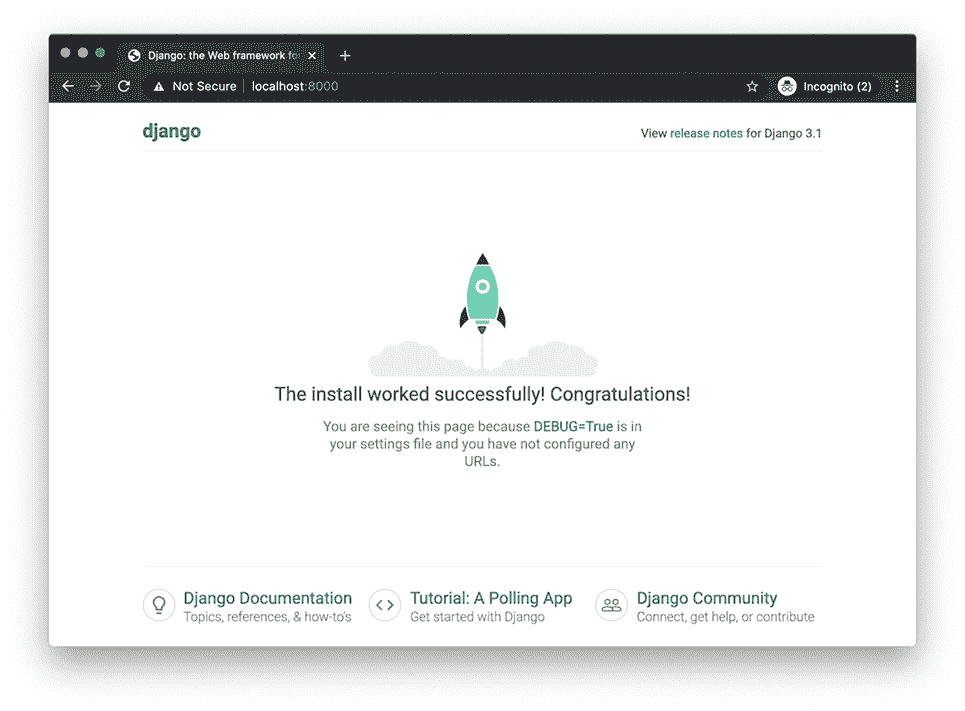

# 六、传输层安全

本章涵盖

*   抵御中间人攻击
*   了解传输层安全握手
*   构建、配置和运行 Django web 应用程序
*   用 Gunicorn 安装公钥证书
*   利用传输层安全性保护 HTTP、电子邮件和数据库流量

在前几章中，我向你介绍了密码学。您学习了哈希、加密和数字签名。在这一章中，你将学习如何使用*传输层安全* ( *TLS* )，一种无处不在的安全网络协议。该协议是数据完整性、数据认证、机密性和不可否认性的应用。

阅读完本章后，你会理解 TLS 握手和公钥证书是如何工作的。您还将学习如何生成和配置 Django web 应用程序。最后，您将了解如何使用 TLS 保护电子邮件和数据库流量。

## 6.1 SSL？TLS？TLS？HTTPS 吗？

在 之前我们潜入这个主题，让我们建立一些词汇术语。一些程序员互换使用术语 *SSL* 、 *TLS* 和 *HTTPS* ，尽管它们意味着不同的东西。

*安全套接字层* ( *SSL* )协议是 TLS 的不安全前身。SSL 的最新版本已经有 20 多年的历史了。随着时间的推移，在该协议中发现了许多漏洞。2015 年，IETF 弃用了它([https://tools.ietf.org/html/rfc7568](https://tools.ietf.org/html/rfc7568))。TLS 以更好的安全性和性能取代了 SSL。

SSL 已经死了，但是术语 *SSL* 却不幸地活了下来。它存在于方法签名、命令行参数和模块名称中；这本书包含许多例子。为了向后兼容，API 保留了这个术语。有时候程序员提到的 *SSL* 实际上指的是 *TLS* 。

*超文本传输协议安全* ( *HTTPS* )简单来说就是通过 SSL 或 TLS 的超文本传输协议(HTTP)。HTTP 是一种点对点协议，用于在互联网上传输网页、图像、视频等数据；这种情况不会很快改变。

为什么要在 TLS 上运行 HTTP？HTTP 是在 20 世纪 80 年代定义的，当时互联网是一个更小、更安全的地方。按照设计，HTTP 不提供安全性；对话是不保密的，双方都没有经过身份验证。在下一节中，您将了解一类旨在利用 HTTP 的局限性的攻击。

## 6.2 中间人攻击

*(*)是经典攻击。攻击者首先控制两个易受攻击方之间的位置。这个位置可以是网段，也可以是中介系统。攻击者可以利用他们的位置发起以下任何一种形式的 MITM 攻击:**

 ***   被动的 MITM 进攻

*   MITM 主动出击

假设窃听者 Eve 在获得对 Bob 无线网络的未授权访问后发起了被动 MITM 攻击。鲍勃向 bank.alice.com 发送 HTTP 请求，bank.alice.com 向鲍勃发送 HTTP 响应。与此同时，在鲍勃和爱丽丝不知情的情况下，伊芙被动地拦截了每个请求和响应。这使得 Eve 可以访问 Bob 的密码和个人信息。图 6.1 显示了一个被动的 MITM 攻击。

TLS 无法保护 Bob 的无线网络。然而，它会提供保密性——防止 Eve 以有意义的方式阅读对话。TLS 通过加密 Bob 和 Alice 之间的对话来做到这一点。


图 6.1 Eve 通过 HTTP 执行被动 MITM 攻击。

现在，假设伊夫在获得对鲍勃和 bank.alice.com 之间的中间网络设备的未授权访问后，发起了主动 MITM 攻击。伊芙可以监听甚至修改对话。利用这个位置，Eve 可以欺骗 Bob 和 Alice，让他们相信她是另一个参与者。通过欺骗鲍勃她是爱丽丝，通过欺骗爱丽丝她是鲍勃，夏娃现在可以在他们之间来回传递信息。在这样做的时候，Eve 修改了对话(图 6.2)。


图 6.2 Eve 通过 HTTP 执行主动 MITM 攻击。

TLS 不能保护 Bob 和 Alice 之间的网络设备。然而，这可以防止伊芙冒充鲍勃或爱丽丝。TLS 通过对对话进行认证来做到这一点，确保 Bob 直接与 Alice 通信。如果 Alice 和 Bob 想要安全地通信，他们需要开始使用 TLS 上的 HTTP。下一节将解释 HTTP 客户端和服务器如何建立 TLS 连接。

## 6.3 TLS 握手

TLS 是一种点对点的客户端/服务器协议。每个 TLS 连接都是从客户端和服务器之间的握手开始的。你可能已经听说过 *TLS 握手*。实际上，TLS 握手并不只有一次；有很多。例如，TLS 的 1.1、1.2 和 1.3 版都定义了不同的握手协议。即使在每个 TLS 版本中，握手也会受到客户端和服务器用来通信的算法的影响。此外，握手的许多部分都是可选的，比如服务器身份验证和客户端身份验证。

在这一节中，我将介绍最常见的 TLS 握手类型:您的浏览器(客户端)与现代 web 服务器执行的握手。这种握手总是由客户端发起的。客户端和服务器将使用 1.3 版的 TLS。1.3 版比 1.2 版更快、更安全，幸运的是，对你我来说，它更简单。这种握手的要点是执行三项任务:

1.  密码套件协商

2.  密钥交换

3.  服务器认证

### 6.3.1 密码套件协商

TLS 是加密和哈希的应用。为了进行通信，客户端和服务器必须首先就一套被称为*密码套件*的通用算法达成一致。每个密码套件都定义了一个加密算法和一个哈希算法。TLS 1.3 规范定义了以下五种密码套件:

*   TLS_AES_128_CCM_8_SHA256

*   TLS_AES_128_CCM_SHA256

*   TLS_AES_128_GCM_SHA256

*   TLS_AES_256_GCM_SHA384

*   TLS _ chacha 20 _ poly 1305 _ sha 256

每个密码套件的名称由三段组成。第一段是一个常见的前缀 TLS_。第二段指定一种加密算法。最后一段指定了哈希算法。例如，假设客户端和服务器同意使用密码套件 TLS_AES _128_GCM_SHA256。这意味着双方都同意在 GCM 模式下使用 128 位密钥与 AES 和 SHA-256 通信。GCM 是一种以速度著称的分组密码模式。除了机密性之外，它还提供数据认证。图 6.3 剖析了这个密码套件的结构。


图 6.3 TLS 密码套件剖析

五种密码套件很容易总结:加密归结为 AES 或 ChaCha20 哈希归结为 SHA-256 或 SHA-384。在前几章中，您已经了解了所有这四种工具。花点时间来体会一下 TLS 1.3 与其前身相比是多么简单。TLS 1.2 定义了 37 个密码套件！

请注意，所有五种密码套件都使用对称加密，而不是非对称加密。AES 和 ChaCha20 被邀请参加聚会；RSA 不是。TLS 通过对称加密来确保机密性，因为它比不对称加密高效三到四个数量级。在前一章中，您了解到对称加密的计算开销比非对称加密低。

客户端和服务器必须共享不止一个相同的密码套件来加密他们的对话。他们还必须共享一个 密钥。

### 6.3.2 密钥交换

客户端和服务器必须交换密钥。该密钥将与密码套件的加密算法结合使用，以确保机密性。该键的范围是当前对话。通过这种方式，如果密钥不知何故遭到破坏，损害将被隔离到仅一个会话中。

TLS 密钥交换是密钥分发问题的一个例子。(这个问题你在前一章已经了解过了。)TLS 1.3 用 Diffie-Hellman 方法解决了这个问题。

迪菲-赫尔曼密钥交换

*Diffie-Hellman*(*DH*)*密钥交换*方法允许双方在不安全的信道上安全地建立共享密钥。该机制是密钥分发问题的有效解决方案。

在这一部分，我将使用 Alice、Bob 和 Eve 向您介绍 DH 方法。代表客户机和服务器的 Alice 和 Bob 都将生成自己的临时密钥对。Alice 和 Bob 将使用他们的密钥对作为最终共享密钥的垫脚石。当您阅读本文时，重要的是不要将中间密钥对与最终共享密钥混为一谈。下面是 DH 方法的简化版本:

1.  爱丽丝和鲍勃公开同意两个参数。

2.  爱丽丝和鲍勃各自生成一个私钥。

3.  Alice 和 Bob 各自从参数和他们的私钥中导出一个公钥。

4.  爱丽丝和鲍勃公开交换公钥。

5.  爱丽丝和鲍勃独立计算共享密钥。

Alice 和 Bob 通过公开同意两个数字 p 和 g 来开始这个协议。这些数字是公开传输的。窃听者 Eve 可以看到这两个数字。她不是威胁。

爱丽丝和鲍勃都分别生成私钥 a 和 b。这些数字是秘密。爱丽丝对伊芙和鲍伯隐藏了她的私人钥匙。鲍勃对伊芙和爱丽丝隐藏了他的私人钥匙。

爱丽丝从 p、g 和她的私钥中得到她的公钥 A。同样，Bob 从 p，g 和他的私钥中得到他的公钥 B。

爱丽丝和鲍勃交换了他们的公钥。这些密钥是公开传输的；它们不是秘密。窃听者 Eve 可以看到两个公钥。她仍然不是威胁。

最后，Alice 和 Bob 使用彼此的公钥独立计算出一个相同的数字 K。Alice 和 Bob 扔掉了他们的密钥对，并保留 K。Alice 和 Bob 使用 K 加密他们剩余的对话。图 6.4 说明了 Alice 和 Bob 使用这个协议来获得一个共享密钥，数字 14。


图 6.4 Alice 和 Bob 用 Diffie-Hellman 方法独立计算一个共享密钥，数字 14。

在现实世界中，私钥 p 和 K 比这大得多。较大的数字使得 Eve 对私钥或 K 进行逆向工程是不可行的，尽管他已经偷听了整个对话。即使 Eve 知道 p、g 和两个公钥，她唯一的选择是暴力破解。

公钥加密

许多人惊讶地发现迄今为止握手中没有公开密钥加密；它甚至不是密码套件的一部分。SSL 和 TLS 的旧版本通常使用公钥加密进行密钥交换。最终，这个解决方案没有很好地扩展。

在此期间，硬件成本的下降使得暴力攻击更加便宜。为了弥补这一点，人们开始使用更大的密钥对，以保持暴力攻击的高成本。

然而，更大的密钥对有一个不幸的副作用:为了密钥交换，web 服务器花费了不可接受的大量时间来执行非对称加密。TLS 1.3 通过明确要求 DH 方法解决了这个问题。

与公钥加密相比，DH 方法是一种更有效的密钥分发解决方案，它使用模运算，而不是像 RSA 这样的密码系统的计算开销。这种方法实际上并没有将密钥从一方分发到另一方；密钥由双方一前一后独立创建。然而，公钥加密并没有消亡；它仍然使用进行和认证。

### 6.3.3 服务器认证

密码 套件协商和密钥交换是保密的前提。但是，如果不核实你的谈话对象的身份，私人谈话又有什么用呢？TLS 是隐私之外的*认证*手段。身份验证是双向的和可选的。对于这个版本的握手(浏览器和 web 服务器之间的握手)，服务器将由客户端进行身份验证。

服务器通过向客户端发送一个*公钥证书*来认证自己，并完成 TLS 握手。该证书包含并证明了服务器公钥的所有权。证书必须由一个致力于数字认证的组织*认证机构* ( *CA* )创建和颁发。

公钥所有者通过向 CA 发送*证书签名请求* ( *CSR* )来申请证书。CSR 包含关于公钥所有者和公钥本身的信息。图 6.5 说明了这一过程。虚线箭头表示 CSR 成功，因为 CA 向公钥所有者颁发了公钥证书。实线箭头示出了将证书安装到服务器上，并在服务器上提供给浏览器。


图 6.5 公钥证书颁发给所有者并安装在服务器上。

公钥证书

*公钥证书*在很多方面与你的驾照相似。你用驾驶执照来表明自己的身份；服务器用公钥证书来标识自己。你的执照是由政府机构发给你的；证书由证书颁发机构颁发给密钥所有者。在你被信任之前，你的执照会被警察仔细检查；在信任服务器之前，浏览器(或任何其他 TLS 客户端)会仔细检查证书。你的驾照确认了驾驶技术；证书确认公钥所有权。你的执照和证书都有到期日。

让我们剖析一下你已经用过的一个网站的公钥证书，维基百科。下一个清单中的 Python 脚本使用 `ssl` 模块下载维基百科的生产公钥证书。下载的证书是脚本的输出。

清单 6.1 获取 _ 服务器 _ 证书. py

```py
import ssl

address = ('wikipedia.org', 443)
certificate = ssl.get_server_certificate(address)      ❶
print(certificate)
```

❶ 下载维基百科的公钥证书

使用下面的命令行运行这个脚本。这将下载证书并将其写入名为 wikipedia.crt 的文件:

```py
$ python get_server_certificate.py > wikipedia.crt
```

公钥证书的结构由 X.509 定义，这是由 RFC 5280(【https://tools.ietf.org/html/rfc5280】)描述的安全标准。TLS 参与者使用 X.509 是为了实现互操作性。服务器可以向任何客户端标识自己，而客户端可以验证任何服务器的身份。

x . 509 证书的结构由一组公共字段组成。通过从浏览器的角度考虑这些领域，您可以更好地理解 TLS 身份验证。下面的 `openssl` 命令演示了如何以人类可读的格式显示这些字段:

```py
$ openssl x509 -in wikipedia.crt -text -noout | less
```

在浏览器信任服务器之前，它会解析证书并单独探测每个字段。让我们来看看一些更重要的领域:

*   主题

*   发行人

*   主体的公钥

*   证书有效期

*   证书颁发机构签名

每个证书都标识了所有者，就像驾照一样。证书所有者由主题字段指定。主题字段最重要的属性是*通用名称* ，它标识了允许提供证书的域名。

如果通用名称与请求的 URL 不匹配，浏览器将拒绝该证书；服务器身份验证和 TLS 握手将失败。下面的清单用粗体显示了 Wikipedia 公钥证书的主题字段。 `CN` 属性指定通用名称。

清单 6.2 wikipedia.org 的主题字段

```py
...
        Subject: CN=*.wikipedia.org     ❶
        Subject Public Key Info:
...
```

❶证书持有人常用名

每个证书都标识了颁发者，就像驾照一样。颁发维基百科证书的 CA 是让我们加密。这个非营利性的 CA 专门从事自动认证，免费。下面的清单用粗体显示了 Wikipedia 公钥证书的 Issuer 字段。

清单 6.3 wikipedia.org 的证书颁发者

```py
...
    Signature Algorithm: sha256WithRSAEncryption
        Issuer: C=US, O=Let's Encrypt, CN=Let's Encrypt Authority X3    ❶
        Validity
...
```

❶ 证书颁发者，我们来加密

证书所有者的公钥嵌入在每个公钥证书中。下一个清单说明了维基百科的公钥；这个是 256 位椭圆曲线公钥。在前一章中，您已经了解了椭圆曲线密钥对。

清单 6.4 wikipedia.org 的公钥

```py
...
Subject Public Key Info:
    Public Key Algorithm: id-ecPublicKey                         ❶
 Public-Key: (256 bit)                                    ❷
 pub: 
 04:6a:e9:9d:aa:68:8e:18:06:f4:b3:cf:21:89:f2: ❸
 b3:82:7c:3d:f5:2e:22:e6:86:01:e2:f3:1a:1f:9a: ❸
 ba:22:91:fd:94:42:82:04:53:33:cc:28:75:b4:33: ❸
 84:a9:83:ed:81:35:11:77:33:06:b0:ec:c8:cb:fa: ❸
                a3:51:9c:ad:dc ❸
...
```

❶ 椭圆曲线公钥

❷ 指定一个 256 位的密钥

❸ 实际公钥，已编码

每个证书都有有效期，就像驾照一样。如果当前时间不在此时间范围内，浏览器将不信任服务器。下面的列表表明 Wikipedia 的证书有三个月的有效期，以粗体显示。

清单 6.5 wikipedia.org 证书有效期

```py
...
Validity
    Not Before: Jan 29 22:01:08 2020 GMT
    Not After : Apr 22 22:01:08 2020 GMT
...
```

每个证书的底部都有一个数字签名，由签名算法字段指定。(您在前一章中学习了数字签名。)谁签了什么？在这个例子中，认证机构，让我们加密，已经签署了证书所有者的公钥——与嵌入在证书中的公钥相同。下一个清单表明，让我们通过用 SHA-256 哈希和用 RSA 私钥加密哈希值来加密签名的维基百科的公钥，用粗体显示。(在前一章中，你已经学习了如何用 Python 来做这件事。)

清单 6.6 wikipedia.org 认证机构签名

```py
...
Signature Algorithm: sha256WithRSAEncryption                  ❶
    4c:a4:5c:e7:9d:fa:a0:6a:ee:8f:47:3e:e2:d7:94:86:9e:46:    ❷
    95:21:8a:28:77:3c:19:c6:7a:25:81:ae:03:0c:54:6f:ea:52:    ❷
    61:7d:94:c8:03:15:48:62:07:bd:e5:99:72:b1:13:2c:02:5e:    ❷
...
```

❶ 让我们用 SHA-256 和 RSA 加密签名。

❷ 数字签名，编码

图 6.6 说明了该公钥证书的最重要内容。


图 6.6 wikipedia.org web 服务器将公钥证书传输到浏览器。

浏览器将验证“让我们加密”的签名。如果签名验证失败，浏览器将拒绝该证书，TLS 握手将以失败告终。如果签名通过验证，浏览器将接受证书，握手将成功结束。握手结束了；对话的其余部分使用 cipher suite 加密算法和共享密钥进行对称加密。

在本节中，您学习了如何建立 TLS 连接。典型的成功 TLS 握手建立了三个要素:

1.  一套约定的密码

2.  仅由客户端和服务器共享的密钥

3.  服务器认证

在接下来的两节中，您将在构建、配置和运行 Django web 应用服务器时应用这些知识。您将通过生成并安装您的拥有的的公钥证书来保护该服务器的流量。

## 6.4 HTTP 与 Django

在本节的 中，您将学习如何构建、配置和运行 Django web 应用程序。 *Django* 是一个你可能已经听说过的 Python web 应用框架。本书中的每个 web 示例都使用 Django。在您的虚拟环境中，运行以下命令来安装 Django:

```py
$ pipenv install django
```

安装 Django 后，django-admin 脚本将位于您的 shell 路径中。这个脚本是一个管理实用程序，它将生成 Django 项目的框架。使用以下命令启动一个简单但功能强大的 Django 项目，名为 *alice* :

```py
$ django-admin startproject alice
```

`startproject`子命令将创建一个与你的项目同名的新目录。这个目录叫做*项目根* 。在项目根目录中有一个名为 manage.py 的重要文件。在本节的后面，您将使用它来启动您的 Django 应用程序。

在项目根目录中，紧挨着 manage.py 的是一个与项目根目录同名的目录。这个模糊命名的子目录叫做 *Django 根*。许多程序员对此感到困惑，这是可以理解的。

在本节中，您将使用 Django 根目录中的一个重要模块，即 `settings` 模块。该模块是维护项目配置值的中心位置。你会在本书中多次看到这个模块，因为我涵盖了几十个与安全性相关的 Django 设置。

Django 根目录下还包含一个名为 `wsgi` 的模块。我将在本章后面介绍 `wsgi` 模块。您将使用它通过 TLS 为 Django 应用程序提供往来流量。图 6.7 展示了你的项目的目录结构。


图 6.7 新 Django 项目的目录结构

注意一些程序员对 Django 项目的目录结构非常固执己见。在本书中，所有 Django 示例都使用默认生成的项目结构。

使用以下命令运行 Django 服务器。从项目根目录中，使用 `runserver` 子命令运行 manage.py 脚本。命令行应该挂起:

```py
$ cd alice                      ❶
$ python manage.py runserver    ❷
...
Starting development server at http://127.0.0.1:8000/
Quit the server with CONTROL-C.
```

❶ 来自项目根

❷runserver 子命令应该挂起。

将浏览器指向 http:/。/localhost:8000 验证服务器是否已启动并正在运行。您将看到一个友好的欢迎页面，类似于图 6.8 中的页面。



图 6.8 Django 新项目的欢迎页面

欢迎页面上写着:“您看到此页面是因为 DEBUG=True。” `DEBUG` 设置是每个 Django 项目的重要配置参数。您可能已经猜到了， `DEBUG` 设置是在 `settings` 模块中找到的。

### 6.4.1 调试设置

Django 用 `True` 的 `DEBUG` 设置生成 settings.py。当 `DEBUG` 设置为 `True` 时，Django 显示详细的错误页面。这些错误页中的详细信息包括有关项目目录结构、配置设置和程序状态的信息。

预警 `DEBUG` 对开发来说是伟大的，对生产来说是可怕的。此设置提供的信息有助于您在开发过程中调试系统，但也揭示了攻击者可能用来危害系统的信息。在生产中总是将 `DEBUG` 设置为 `False` 。

提示您必须重启服务器，对 `settings` 模块的修改才能生效。要重启 Django，请在 shell 中按 Ctrl-C 停止服务器，然后再次使用 manage.py 脚本重启服务器。

此时，您的应用程序可以通过 HTTP 提供网页服务。正如您已经知道的，HTTP 不支持机密性或服务器认证。该应用程序在当前状态下容易受到 MITM 攻击。要解决这些问题，协议必须从 HTTP 升级到 HTTPS。

像 Django 这样的应用服务器实际上并不了解 HTTPS，也不做任何事情。它不托管公钥证书，也不执行 TLS 握手。在下一节中，您将学习如何通过 Django 和浏览器之间的另一个进程来处理这些职责。

## 6.5 HTTPS 与 Gunicorn

在本节的 中，您将学习如何使用 Gunicorn 托管公钥证书，guni corn 是 Web 服务器网关接口(WSGI )协议的纯 Python 实现。该协议由 Python 增强提案(PEP)3333([www.python.org/dev/peps/pep-3333/](https://www.python.org/dev/peps/pep-3333/))定义，旨在将 web 应用框架与 web 服务器实现解耦。

你的 Gunicorn 进程将位于你的 web 服务器和 Django 应用服务器之间。图 6.9 描述了一个 Python 应用程序栈，使用了一个 NGINX web 服务器、一个 Gunicorn WSGI 应用程序和一个 Django 应用程序服务器。


图 6.9 使用 NGINX、Gunicorn 和 Django 的常见 Python 应用程序堆栈

在您的虚拟环境中，使用以下命令安装 Gunicorn:

```py
$ pipenv install gunicorn
```

安装后， `gunicorn` 命令会在你的 shell 路径中。这个命令需要一个参数，一个 WSGI 应用程序模块。django-admin 脚本已经为您生成了一个 WSGI 应用程序模块，位于 django 根目录下。

在运行 Gunicorn 之前，确保首先停止正在运行的 Django 应用程序。在您的 shell 中按 Ctrl-C 来完成此操作。接下来，从项目根目录运行以下命令，用 Gunicorn 恢复 Django 服务器。命令行应该挂起:

```py
$ gunicorn alice.wsgi       ❶
[2020-08-16 11:42:20 -0700] [87321] [INFO] Starting gunicorn 20.0.4
...
```

t1】❶Alice . wsgi 模块位于 alice/alice/wsgi.py

将浏览器指向 http:/。/localhost:8000 并刷新欢迎页面。您的应用程序现在通过 Gunicorn 提供服务，但仍然使用 HTTP。要将应用程序升级到 HTTPS，您需要安装一个公钥证书。

### 6.5.1 自签名公钥证书

A *自签名公钥证书*顾名思义，是一种不是由 CA 颁发或签名的公钥证书。你做好它，然后签字。这是获得适当证书的一个便宜而方便的敲门砖。这些证书无需认证即可提供机密性；它们便于开发和测试，但不适合生产。创建一个自签名的公钥证书大约需要 60 秒，让浏览器或操作系统信任它最多需要 5 分钟。

使用下面的 `openssl` 命令生成密钥对和自签名公钥证书。此示例生成一个椭圆曲线密钥对和一个自签名公钥证书。证书有效期为 10 年:

```py
$ openssl req -x509 \                                  ❶
    -nodes -days 3650 \                                ❷
    -newkey ec:<(openssl ecparam -name prime256v1) \   ❸
    -keyout private_key.pem \                          ❹
    -out certificate.pem                               ❺
```

❶ 生成一个 X.509 证书

❷ 采用 10 年有效期

❸ 生成一个椭圆曲线密钥对

❹ 将私钥写到这个位置

❺ 将公钥证书写到这个位置

该命令的输出提示您输入证书主题的详细信息。你是主体。指定一个通用名称 `localhost` 以使用此证书进行本地开发:

```py
Country Name (2 letter code) []:US
State or Province Name (full name) []:AK
Locality Name (eg, city) []:Anchorage
Organization Name (eg, company) []:Alice Inc.
Organizational Unit Name (eg, section) []:
Common Name (eg, fully qualified host name) []:localhost    ❶
Email Address []:alice@alice.com
```

❶ 为地方发展

在提示符下按 Ctrl-C 停止正在运行的 Gunicorn 实例。要安装您的证书，请使用以下命令行重新启动 Gunicorn。 `keyfile` 和 `certfile` 参数分别接受您的密钥文件和证书的路径。

```py
$ gunicorn alice.wsgi \            ❶
    --keyfile private_key.pem \    ❷
    --certfile certificate.pem     ❸
```

t1】❶Alice . wsgi 模块位于 alice/alice/wsgi.py

❷ 你的私钥文件

❸ 你的公钥证书

Gunicorn 自动使用已安装的证书通过 HTTPS 而非 HTTP 为 Django 流量提供服务。将浏览器指向 https:/。/localhost:8000 再次请求欢迎页面。这将验证您的证书安装并开始 TLS 握手。记得把网址方案从 *http* 改成 *https* 。

当你的浏览器显示错误页面时，不要感到惊讶。该错误页面将特定于您的浏览器，但潜在的问题是相同的:浏览器无法验证自签名证书的签名。你现在使用 HTTPS，但是你的握手失败了。若要继续，您需要让您的操作系统信任您的自签名证书。我不能涵盖解决这个问题的所有方法，因为解决方案是针对您的操作系统的。下面列出了在 macOS 上信任自签名证书的步骤:

1.  打开由 Apple 开发的密码管理实用程序 Keychain Access。

2.  将您的自签名证书拖到“钥匙串访问”的“证书”部分。

3.  在“钥匙串访问”中连按证书。

4.  展开信任部分。

5.  在使用此证书时下拉列表中，选择始终信任。

如果您使用不同的操作系统进行本地开发，我建议您在互联网上搜索“如何信任我的操作系统>中的自签名证书”预计解决方案最多需要 5 分钟。与此同时，您的浏览器将继续防止 MITM 攻击。

在您的操作系统信任您的自签名证书之后，您的浏览器也会信任您的自签名证书。重新启动浏览器，以确保这种情况快速发生。在 https:/刷新页面。/localhost:8000 检索欢迎页面。您的应用程序现在正在使用 HTTPS，您的浏览器已经成功地完成了握手！

从安全角度来看，将你的协议从 HTTP 升级到 HTTPS 是一个巨大的飞跃。我用两件事来结束这一节，你可以做这两件事来使你的服务器更加安全:

*   禁止带有 `Strict-Transport-Security` 响应头的 HTTP 请求

*   将入站 HTTP 请求重定向到 HTTPS

### 6.5.2 严格传输安全响应报头

一个 服务器使用 HTTP `Strict-Transport-Security` (HSTS )响应头告诉一个浏览器只能通过 HTTPS 访问。例如，服务器将使用以下响应报头来指示浏览器在接下来的 3600 秒(1 小时)内只能通过 HTTPS 访问它:

```py
Strict-Transport-Security: max-age=3600
```

冒号右边的键-值对，以粗体显示，被称为*指令* 。指令用于参数化 HTTP 头。在这种情况下， `max-age` 指令代表浏览器应该仅通过 HTTPS 访问站点的时间，以秒为单位。

确保 Django 应用程序的每个响应都有一个带有 `SECURE_HSTS_SECONDS` 设置的 HSTS 报头。分配给该设置的值转换为标题的 `max-age` 指令。任何正整数都是有效值。

警告如果你正在使用一个已经投入生产的系统，那么要非常小心 `SECURE_HSTS_SECONDS` 。此设置适用于整个网站，而不仅仅是请求的资源。如果您的更改破坏了任何东西，影响可能会持续到 `max-age` 指令值。因此，将 HSTS 报头添加到具有大的 `max-age` 指令的现有系统是有风险的。从一个小数字开始增加 `SECURE_HSTS_SECONDS` 是一种更安全的方式来展开这样的变更。有多小？问问自己，如果出现故障，你能承受多长时间的停机时间。

服务器发送带有 `includeSubDomains` 指令的 HSTS 响应报头，告诉浏览器除了域之外，所有子域都只能通过 HTTPS 访问。例如，alice.com 会使用以下响应报头来指示浏览器只能通过 HTTPS 访问 alice.com 和 sub.alice.com:

```py
Strict-Transport-Security: max-age=3600; includeSubDomains
```

`SECURE_HSTS_INCLUDE_SUBDOMAINS`设置配置 Django 发送带有 `includeSubDomains` 指令的 HSTS 响应报头。该设置默认为 `False` ，如果 `SECURE_HSTS_SECONDS` 不是正的 整数则忽略。

警告凡与 `SECURE_HSTS_SECONDS` 相关的风险都适用于 `SECURE_HSTS_INCLUDE_SUBDOMAINS` 。只要 `max-age` 指令值不变，一个坏的卷展栏就会影响每个子域。如果您正在一个已经投入生产的系统上工作，从一个小的值开始。

### 6.5.3 HTTPS 重定向

HSTS 的头球是一层很好的防守，但也只能起到一个回应头球的作用；在收到 HSTS 报头之前，浏览器必须首先发送一个请求。因此，当初始请求通过 HTTP 时，将浏览器重定向到 HTTPS 是有用的。例如，请求 http:/。/alice.com 应该重定向到 https:/。/alice.com

通过将 `SECURE_SSL_REDIRECT` 设置为 `True` ，确保您的 Django 应用程序将 HTTP 请求重定向到 HTTPS。将该设置分配给 `True` 会激活另外两个设置 `SECURE_REDIRECT_EXEMPT` 和 `SECURE_SSL_HOST` ，这两个设置都将在下面介绍。

警告 `SECURE_SSL_REDIRECT` 默认为 `False` 。如果你的站点使用 HTTPS，你应该把这个设置为 `True` 。

`SECURE_REDIRECT_EXEMPT`设置是一个正则表达式列表，用于暂停对某些 URL 的 HTTPS 重定向。如果列表中的正则表达式与 HTTP 请求的 URL 匹配，Django 不会将其重定向到 HTTPS。此列表中的项目必须是字符串，而不是实际编译的正则表达式对象。默认值是一个空列表。

`SECURE_SSL_HOST`设置用于覆盖 HTTPS 重定向的主机名。如果这个值设置为 `bob.com` ，Django 将永久重定向一个 http:/的请求。/alice.com 转 https:/。/bob.com 而不是 https:/。/alice.com .默认值为 `None` 。

到目前为止，您已经了解了很多关于浏览器和 web 服务器如何与 HTTPS 通信的知识；但是浏览器并不是唯一的 HTTPS 客户端。在下一节中，您将看到如何在 Python 的 中使用 HTTPS 以编程方式发送请求 。

## 6.6 TLS 和请求包

`requests`包是 Python 的一个流行的 HTTP 库。许多 Python 应用程序使用这个包在其他系统之间发送和接收数据。在这一节中，我将介绍一些与 TLS 相关的特性。在您的虚拟环境中，使用以下命令安装 `requests` :

```py
$ pipenv install requests
```

当 URL 方案为 HTTPS 时， `requests` 包自动使用 TLS。下面代码中粗体显示的 `verify` 关键字参数禁用服务器认证。该参数不会禁用 TLS 它能放松 TLS。对话仍然是保密的，但是服务器不再被验证:

```py
>>> requests.get('https://www.python.org', verify=False)
connectionpool.py:997: InsecureRequestWarning: Unverified HTTPS request is
being made to host 'www.python.org'. Adding certificate verification is
strongly advised.
<Response [200]>
```

此功能显然不适合生产。在集成测试环境中，当系统需要与没有静态主机名的服务器通信，或者与使用自签名证书的服务器通信时，这通常很有用。

TLS 认证是双向的:除了服务器之外，客户端也可以被认证。TLS 客户端使用公钥证书和私钥进行身份验证，就像服务器一样。 `requests` 包支持使用 `cert` 关键字参数进行客户端认证。这个 kwarg(在下面的代码中以粗体显示)需要一个由两部分组成的元组。这个元组表示证书和私钥文件的路径。 `verify` kwarg 不影响客户端认证； `cert` kwarg 不影响服务器认证:

```py
>>> url = 'https://www.python.org'
>>> cert = ('/path/to/certificate.pem', '/path/to/private_key.pem')
>>> requests.get(url, cert=cert)
<Response [200]>
```

或者， `verify` 和 `cert` kwargs 的功能可通过 `requests` `Session` 对象的属性获得，此处以粗体显示:

```py
>>> session = requests.Session()
>>> session.verify=False
>>> cert = ('/path/to/certificate.pem', '/path/to/private_key.pem')
>>> session.cert = cert
>>> session.get('https://www.python.org')
<Response [200]>
```

TLS 容纳的不仅仅是 HTTP。数据库流量、电子邮件流量、Telnet、轻量级目录访问协议(LDAP)、文件传输协议(FTP)等也在 TLS 上运行。这些协议的 TLS 客户端比浏览器更有“个性”。这些客户端在功能上有很大差异，并且它们的配置更多地是特定于供应商的。本章最后看了两个超越 HTTP 的 TLS 用例:

*   数据库连接

*   电子邮件

## 6.7 TLS 与数据库的连接

应用程序应该确保数据库连接也受到 TLS 的保护。TLS 确保您的应用程序连接到正确的数据库，并且网络攻击者无法截获写入数据库和从数据库读取的数据。

Django 数据库连接由 `DATABASES` 设置管理。该字典中的每个条目代表一个不同的数据库连接。下面的清单说明了默认的 Django `DATABASES` 设置。 `ENGINE` 键指定 SQLite，一个基于文件的数据库。 `NAME` 键指定存储数据的文件。

清单 6.7 默认 Django 数据库设置

```py
DATABASES = {
   'default': {
       'ENGINE': 'django.db.backends.sqlite3',
       'NAME': os.path.join(BASE_DIR, 'db.sqlite3'),    ❶
   }
}
```

❶ 将数据存储在项目根的 db.sqlite3 中

默认情况下，SQLite 将数据存储为明文。很少有 Django 应用程序能够使用 SQLite 进行生产。大多数 Django 产品应用程序将通过网络连接到数据库。

一个数据库网络连接需要通用的自解释字段: `NAME` ， `HOST` ， `PORT` ， `USER` ， `PASSWORD` 。另一方面，TLS 配置是特定于每个数据库的。供应商特定设置由 `OPTIONS` 字段处理。这个清单展示了如何配置 Django，以便在 PostgreSQL 中使用 TLS。

清单 6.8 在 PostgreSQL 中安全地使用 Django

```py
DATABASES = {
   "default": {
       "ENGINE": "django.db.backends.postgresql",
       "NAME": "db_name",
       "HOST": db_hostname,
       "PORT": 5432,
       "USER": "db_user",
       "PASSWORD": db_password,
       "OPTIONS": {                     ❶
           "sslmode": "verify-full",    ❶
       },                               ❶
   }
}
```

❶【选项】下的供应商特定配置设置

不要假设每个 TLS 客户端都像浏览器一样执行服务器验证。如果没有配置，TLS 客户端可能不会验证服务器的主机名。比如 PostgreSQL 客户端在两种模式连接时验证证书的签名: `verify-ca` 和 `verify-full` 。在 `verify-ca` 模式下，客户端不会根据证书的通用名称验证服务器主机名。该检查仅在 `verify-full` 模式下进行。

注加密数据库流量并不能替代加密数据库本身；两者都要做。请查阅数据库供应商的文档，了解有关数据库级加密的更多信息。

## 6.8 TLS 和电子邮件

Django 的回复邮件是 `django.core.mail` 模块，是 Python 的 `smtplib` 模块的包装 API。Django 应用程序使用简单邮件传输协议(SMTP)发送电子邮件。这种流行的电子邮件协议通常使用端口 25。和 HTTP 一样，SMTP 也是 80 年代的产物。它没有试图确保机密性或认证。

攻击者非常热衷于发送和接收未经授权的电子邮件。任何易受攻击的电子邮件服务器都是垃圾邮件收入的潜在来源。攻击者可能想要获得对机密信息的未授权访问。许多网络钓鱼攻击都是从受损的电子邮件服务器发起的。

组织通过加密传输中的电子邮件来抵御这些攻击。要防止网络窃听者拦截 SMTP 流量，您必须使用 SMTPS。这就是 TLS 上的 SMTP。SMTP 和 SMTPS 类似于 HTTP 和 HTTPS。您可以使用下两节中介绍的设置将您的连接从 SMTP 升级到 SMTPS。

### 6.8.1 隐式 TLS

有两种方法可以启动与电子邮件服务器的 TLS 连接。RFC 8314 将传统方法描述为“客户端建立明文应用会话。。。随后的 TLS 握手可以升级连接。RFC 8314 推荐“一种替代机制，在这种机制中，TLS 在连接开始时立即在一个单独的端口上进行协商。”推荐的机制被称为*隐式 TLS* 。

`EMAIL_USE_SSL`和 `EMAIL_USE_TLS` 设置配置 Django 通过 TLS 发送邮件。两种设置都默认为 `False` ，只能有一种为 `True` ，且都不直观。一个合理的观察者会认为 `EMAIL_USE_TLS` 比 `EMAIL_USE_SSL` 更受青睐。毕竟，TLS 在几年前就以更好的安全性和性能取代了 SSL。可惜隐式 TLS 是由 `EMAIL_USE_SSL` 配置的，而不是 `EMAIL_USE_TLS` 。

使用 `EMAIL_USE_TLS` 总比什么都没有好，但是如果你的邮件服务器支持隐式 TLS，你应该使用 `EMAIL_USE _SSL` 。我不知道为什么 `EMAIL_USE_SSL` 不叫 `EMAIL_USE_IMPLICIT_TLS` 。

### 6.8.2 邮件客户端认证

和`requests`包一样，Django 的 email API 支持 TLS 客户端认证。 `EMAIL_SSL_KEYFILE` 和 `EMAIL_SSL_CERTFILE` 设置代表私钥和客户端证书的路径。如果 `EMAIL_USE_TLS` 或 `EMAIL_USE_SSL` 没有按预期启用，这两个选项都不起作用。

不要假设每个 TLS 客户端都执行服务器认证。在撰写本文时，Django 在发送 电子邮件时不幸没有执行服务器认证。

注意与您的数据库流量一样，加密传输中的电子邮件不能替代加密静态电子邮件；两者都要做。大多数供应商会自动为您加密静态电子邮件。如果没有，请查阅您的电子邮件供应商的文档，以了解更多关于静态电子邮件加密的信息。

### 6.8.3 SMTP 认证凭证

与 `EMAIL_USE_TLS` 和 `EMAIL_USE_SSL` 不同，`EMAIL_HOST_USER``EMAIL _HOST_PASSWORD`的设置是直观的。这些设置代表 SMTP 身份验证凭据。SMTP 不会试图在传输过程中隐藏这些凭据；如果没有 TLS，它们很容易成为网络窃听者的目标。下面的代码演示如何在以编程方式发送电子邮件时重写这些设置。

清单 6.9 以编程方式在 Django 中发送电子邮件

```py
from django.core.mail import send_mail

send_mail('subject',
         'message',
         'alice@python.org',                    ❶
         ['bob@python.org'],                    ❷
         auth_user='overridden_user_name',      ❸
         auth_password='overridden_password')   ❹
```

❶ 发来邮件

❷ 收件人列表

❸ 覆盖电子邮件 _ 主机 _ 用户

❹ 覆盖电子邮件 _ 主机 _ 密码

在本章中，您了解了许多关于传输中加密的行业标准 TLS 的知识。你知道这个协议是如何保护服务器和客户端的。您知道如何将 TLS 应用于网站、数据库和电子邮件连接。在接下来的几章中，您将使用这个协议安全地传输敏感信息，比如 HTTP 会话 id、用户认证凭证和 OAuth 令牌。您还将在本章 中创建的 Django 应用程序的基础上构建几个安全的工作流。

## 总结

*   SSL、TLS 和 HTTPS 不是同义词。

*   中间人攻击有两种形式:被动和主动。

*   TLS 握手建立密码组、共享密钥和服务器认证。

*   Diffie-Hellman 方法是密钥分配问题的有效解决方案。

*   公钥证书类似于你的驾照。

*   姜戈对 HTTPS 没有责任；格尼考恩群岛。

*   TLS 认证适用于客户端和服务器。

*   除了 HTTP 之外，TLS 还保护数据库和电子邮件流量。**