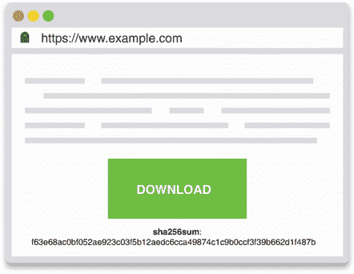
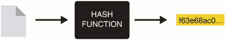
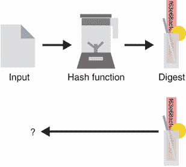
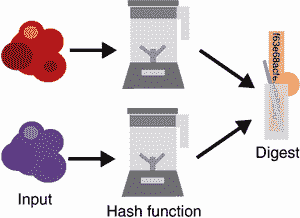
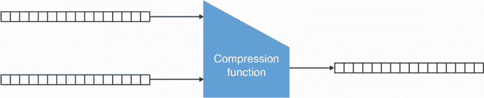
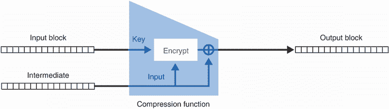
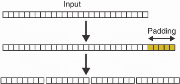
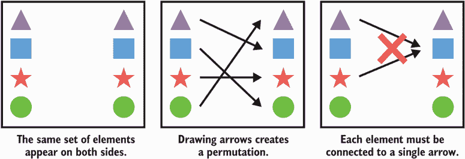
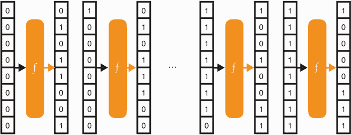
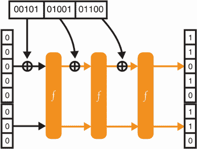

# 2 哈希函数

本章涵盖了

*   哈希函数及其安全属性
*   当今广泛采用的哈希函数
*   现有的其他类型的哈希

将全球唯一标识符赋予任何事物，这是你将在本章中学习的第一个加密构造的承诺——哈希函数*。哈希函数在密码学中无处不在——无处不在！非正式地说，它们接受你想要的任何数据作为输入，并产生一个独特的字节串作为回报。给定相同的输入，哈希函数总是再现相同的字节串。这可能看起来没什么，但是这个简单的构造对于构建许多其他的密码学结构非常有用。在这一章中，你将学到关于哈希函数的所有知识，以及为什么它们如此通用。*

 *## 2.1 什么是哈希函数？

在你面前，一个下载按钮正在占据页面的一大块。你可以阅读字母*下载*，点击它似乎会将你重定向到一个包含文件的不同网站。在它下面，躺着一长串不知所云的字母:

```
f63e68ac0bf052ae923c03f5b12aedc6cca49874c1c9b0ccf3f39b662d1f487b
```

后面是看起来像是某种缩写的东西:`sha256sum`。听起来熟悉吗？你可能在过去的生活中下载了一些也伴随着这样一个奇怪的字符串的东西(图 2.1)。



图 2.1 链接到包含文件的外部网站的网页。外部网站不能修改文件的内容，因为第一页提供了文件的哈希或摘要，这确保了下载文件的完整性。

如果你想知道那根长绳子有什么用途:

1.  点击按钮下载文件

2.  使用 SHA-256 算法对下载的文件进行*哈希*

3.  将输出(摘要)与网页上显示的长字符串进行比较

这允许你验证你下载了正确的文件。

注意哈希函数的输出通常称为*摘要*或*哈希*。我在本书中交替使用这两个词。其他人可能称为*校验和*或*和*，我避免使用，因为这些术语主要由非加密哈希函数使用，可能会导致更多的混淆。当不同的代码库或文档使用不同的术语时，请记住这一点。

为了尝试哈希，你可以使用流行的 OpenSSL 库。它提供了一个多用途命令行界面(CLI ),这是许多系统(包括 macOS)默认提供的。例如，这可以通过打开终端并写入以下行来完成:

```
$ openssl dgst -sha256 downloaded_file
f63e68ac0bf052ae923c03f5b12aedc6cca49874c1c9b0ccf3f39b662d1f487b
```

对于该命令，我们使用 SHA-256 哈希函数将输入(下载的文件)转换成一个唯一的标识符(该值由该命令回显)。这些额外的步骤提供了什么？他们提供*完整性和真实性*。它告诉你，你下载的确实是你应该下载的文件。

所有这些工作都要归功于哈希函数的一个安全属性，叫做*第二预镜像抵抗*。这个受数学启发的术语意味着，从哈希函数的长输出中，`f63e...`，你找不到另一个文件将哈希到相同的输出，`f63e....`。在实践中，它意味着这个摘要与你正在下载的文件密切相关，没有攻击者能够通过给你一个不同的文件来欺骗你。

十六进制表示法

顺便说一下，长输出串`f63e...`代表以*十六进制*显示的二进制数据(一种以 16 为基数的编码，用数字 0 到 9 和字母 *a* 到 *f* 来代表几个数据位)。我们可以用 0 和 1(基数为 2)来显示二进制数据，但这会占用更多的空间。相反，十六进制编码允许我们为遇到的每 8 位(1 字节)写入 2 个字母数字字符。它对人类来说是可读的，并且占用更少的空间。对二进制数据进行编码还有其他方法，但是最广泛使用的两种编码是十六进制和 base64。基数越大，显示一个二进制字符串所需的空间就越小，但是在某个时候，我们会用完人类可读的字符。

请注意，这个长摘要是由网页的所有者控制的，它很容易被任何能够修改网页的人替换。(如果你不相信，花点时间考虑一下。)这意味着我们需要信任提供摘要的页面、其所有者以及用于检索页面的机制(而我们不需要信任提供下载文件的页面)。从这个意义上来说，*哈希函数本身并不能提供完整性*。下载文件的完整性和真实性来自于摘要和提供摘要的可信机制(本例中为 HTTPS)。我们将在第 9 章讨论 HTTPS，但是现在，想象一下它神奇地允许你与一个网站安全地通信。

回到我们的哈希函数，可以形象化为图 2.2 中的黑盒。我们的黑盒接受一个输入，给出一个输出。



图 2.2 哈希函数接受任意长度的输入(文件、消息、视频等)，并产生固定长度的输出(例如，SHA-256 的 256 位)。哈希相同的输入产生相同的摘要或哈希。

该功能的*输入*可以是任意大小。甚至可以是空的。*输出*总是具有相同的长度和*确定性*:如果给定相同的输入，它总是产生相同的结果。在我们的例子中，SHA-256 总是提供 256 位(32 字节)的输出，它总是被编码为 64 个十六进制的字母数字字符。哈希函数的一个主要特性是不能还原算法，这意味着不能只从输出中找到输入。我们说哈希函数是单向的。

为了说明哈希函数在实践中是如何工作的，我们将使用相同的 OpenSSL CLI 通过 SHA-256 哈希函数来哈希不同的输入。以下终端会话说明了这一点。

```
$ echo -n "hello" | openssl dgst -sha256     
2cf24dba5fb0a30e26e83b2ac5b9e29e1b161e5c1fa7425e73043362938b9824    
$ echo -n "hello" | openssl dgst -sha256                                   ❶
2cf24dba5fb0a30e26e83b2ac5b9e29e1b161e5c1fa7425e73043362938b9824
$ echo -n "hella" | openssl dgst -sha256                                   ❷
70de66401b1399d79b843521ee726dcec1e9a8cb5708ec1520f1f3bb4b1dd984
$ echo -n "this is a very very very very very very                         ❸
  ➥ very very very long sentence" | openssl dgst -sha256                  ❸
1166e94d8c45fd8b269ae9451c51547dddec4fc09a91f15a9e27b14afee30006
```

❶ 哈希相同的输入产生相同的结果。

❷ 输入的微小变化完全改变了输出。

❸ 无论输入大小如何，输出总是相同的大小。

在下一节中，我们将了解哈希函数的确切安全属性。

## 2.2 哈希函数的安全属性

应用密码学中的哈希函数是通常被定义为提供三种特定安全属性的构造。这个定义随着时间的推移已经发生了变化，我们将在下一节中看到。但是现在，让我们定义一下构成哈希函数的三个坚实基础。这很重要，因为您需要了解哈希函数在哪里有用，在哪里不起作用。

第一个是*前像阻力*。这个属性确保了在给定输出的情况下，没有人能够通过反转哈希函数来恢复输入。在图 2.3 中，我们通过想象我们的哈希函数就像一个搅拌机来说明这种“单向性”，使得不可能从生产的思慕雪中恢复成分。



图 2.3 给定一个哈希函数(这里表示为 blender)产生的摘要，不可能(或者技术上很难，我们假设它永远不会发生)反转它并找到使用的原始输入。这个安全属性被称为*抗预镜像*。

警告如果你的输入很小，这是真的吗？假设它要么是*是*要么是*非*，那么对于某人来说很容易哈希所有可能的 3 个字母的单词并找出输入是什么。你的输入空间小怎么办？也就是说，你总是会乱用不同的句子，比如“我会在周一凌晨 3 点回家”。在这里，一个人可以预测这一点，但不知道确切的星期几或小时，仍然可以哈希所有可能的句子，直到它产生正确的输出。因此，第一个前映像安全属性有一个明显的警告:*你不能隐藏太小或可预测的东西*。

第二个属性是*第二个前像阻力*。当我们想要保护文件的完整性时，我们已经看到了这个安全属性。该属性说明如下:如果我给你一个输入和它哈希到的摘要，你应该找不到哈希到同一个摘要的不同输入。图 2.4 说明了这一原理。


图 2.4 考虑到一个输入及其相关的摘要，应该永远找不到一个不同的输入哈希到同一个输出。这个安全属性被称为*第二个前像阻力*。

注意*我们不控制第一个输入*。这个重点对于理解哈希函数的下一个安全属性很重要。

最后，第三个属性是*耐碰撞性*。它保证了没有人能够产生两个不同的输入哈希到同一个输出(如图 2.5 所示)。这里，攻击者可以选择两个输入，而不像前面的属性只修复其中一个输入。



图 2.5 应该永远找不到两个输入(在左边表示为两个随机的数据点)哈希到同一个输出值(在右边)。这种安全属性被称为*抗碰撞性*。

人们经常混淆碰撞阻力和二次前像阻力。花一点时间来理解这些差异。

随机神谕

此外，哈希函数通常被设计成其摘要是不可预测的和随机的(T2)。这很有用，因为我们不能总是证明一个协议是安全的，这要归功于我们讨论过的哈希函数的安全属性之一(比如抗冲突)。许多协议在*随机预言模型*中得到验证，其中使用了一个虚构的和理想的参与者，称为随机预言。在这种类型的协议中，可以将任何输入作为请求发送给随机预言机，据说随机预言机会返回完全随机的输出作为响应，就像哈希函数一样，给它相同的输入两次会返回相同的输出两次。

这个模型中的证明有时是有争议的，因为我们不能确定我们是否可以用真正的哈希函数来代替这些随机预言(在实践中)。然而，许多合法的协议使用这种方法被证明是安全的，在这种方法中，哈希函数被认为比它们可能的更理想。

## 2.3 哈希函数的安全考虑

到目前为止，我们看到了哈希函数的三个安全属性:

*   前像电阻

*   第二个前像电阻

*   碰撞阻力

这些安全属性本身通常是没有意义的；这完全取决于你如何利用哈希函数。尽管如此，在我们研究一些真实世界的哈希函数之前，理解这里的一些限制是很重要的。

首先，这些安全属性假设你(合理地)使用了哈希函数。想象一下，我或者哈希单词*是*或者单词*否*，然后我发布摘要。如果你知道我在做什么，你可以简单地把两个单词哈希，然后把结果和我给你的进行比较。因为不涉及任何秘密，并且因为我们使用的哈希算法是公开的，所以您可以自由地这样做。事实上，有人可能会认为这将打破哈希函数的前图像阻力，但我认为您的输入不够“随机”。此外，因为哈希函数接受任意长度的输入，并且总是产生相同长度的输出，所以也有无限数量的输入哈希到相同的输出。同样，你可以说，“嗯，这不是打破了第二个前像阻力吗？”第二个前像阻力仅仅是说，很难找到另一个输入，所以我们假设这在实践中是不可能的，但不是理论上不可能。

第二，消化*的大小和*有关系吗。无论如何，这都不是哈希函数的特性。所有加密算法在实践中必须关心其参数的大小。让我们想象下面这个极端的例子。我们有一个哈希函数，它以均匀随机的方式产生长度为 2 位的输出(这意味着它将在 25%的时间内输出`00`，在 25%的时间内输出`01`，以此类推)。您不需要做太多的工作来产生冲突:在哈希一些随机输入字符串后，您应该能够找到两个哈希到相同输出的字符串。为此，有一个*最小输出大小*，哈希函数*必须*在实践中产生:256 位(或 32 字节)。有了这么大的输出，碰撞应该是不可能发生的，除非在计算上有所突破。

这个数字是怎么得到的？在现实世界的密码术中，算法的目标是最低 128 位的安全性。这意味着想要破解算法(提供 128 位安全性)的攻击者必须执行大约 2128 次操作(例如，尝试长度为 128 位的所有可能的输入字符串将需要 2128 次操作)。对于提供前面提到的所有三种安全属性的哈希函数，它需要提供至少 128 位的安全性来抵御所有三种攻击。最容易的攻击通常是由于*生日限制*而发现冲突。

生日界限

生日界限源于概率论，其中生日问题揭示了一些不直观的结果。你需要几个人在一个房间里，这样至少有 50%的几率，两个人同一天生日(那就是碰撞)。原来随机抽取的 23 个人就足够达到这些赔率了！很奇怪吧？

这叫做*生日悖论*。在实践中，当我们从 2 个 <sup class="fm-superscript">N 个</sup>可能性的空间中随机生成字符串时，你可以预期在生成了大约 2 个 <sup class="fm-superscript">N/2 个</sup>字符串后，有 50%的几率有人会发现冲突。

如果我们的哈希函数生成 256 位的随机输出，所有输出的空间大小为 2 <sup class="fm-superscript1">256</sup> 。这意味着在生成 2 个 <sup class="fm-superscript1">128 个</sup>摘要之后，能够以很好的概率发现冲突(由于生日的限制)。这是我们的目标数字，这也是为什么哈希函数至少必须提供 256 位输出的原因。

某些约束有时会促使开发人员通过*截断*(删除一些字节)来减少摘要的大小。理论上，这是可能的，但会大大降低安全性。为了至少实现 128 位安全性，不得在以下情况下截断摘要:

*   256 位用于防碰撞

*   128 位用于前像和第二前像电阻

这意味着根据所依赖的属性，哈希函数的输出可以被截断以获得更短的摘要。

## 2.4 实践中的哈希函数

我们前面说过，实际中很少单独使用哈希函数。它们通常与其他元素相结合来创建加密原语或加密协议。在本书中，我们将会看到许多使用哈希函数构建更复杂对象的例子，但是本节描述了哈希函数在现实世界中的几种不同的使用方式。

### 2.4.1 承诺

想象一下，你知道市场上的一只股票将会升值，在未来一个月将达到 50 美元，但是你真的不能告诉你的朋友这件事(也许是出于某种法律原因)。你仍然希望能够告诉你的朋友你在事后知道这件事，因为你沾沾自喜(不要否认)。你能做的就是承诺这样一句话，“下个月股票 *X* 将达到 50 美元。”要做到这一点，哈希句子，给你的朋友输出。一个月后，揭示句子。您的朋友将能够哈希该句子，以观察到它确实产生了相同的输出。

这就是我们所说的*承诺计划*。密码学中的承诺通常试图实现两个属性:

*   *隐藏*—承诺必须隐藏潜在价值。

*   *绑定*—承诺必须隐藏单个值。换句话说，如果你承诺一个值 *x* ，你不应该能够在以后成功地揭示一个不同的值 *y* 。

运动

如果用作承诺方案，您能判断出哈希函数是否提供隐藏和绑定吗？

### 子资源完整性

网页导入外部 JavaScript 文件的情况(经常)发生。例如，许多网站使用内容交付网络(cdn)在它们的页面中导入 JavaScript 库或 web 框架相关的文件。这种 cdn 被放置在战略位置，以便将这些文件快速传递给访问者。然而，如果 CDN 失控并决定提供恶意 JavaScript 文件，这可能是一个真正的问题。为了解决这个问题，网页可以使用一个叫做*子资源完整性*的特性，这个特性允许在导入标签中包含一个摘要:

```
<script src="https://code.jquery.com/jquery-2.1.4.min.js"
   integrity="sha256-8WqyJLuWKRBVhxXIL1jBDD7SDxU936oZkCnxQbWwJVw="></script>
```

这与我们在本章介绍中谈到的场景完全相同。一旦检索到 JavaScript 文件，浏览器就会对其进行哈希处理(使用 SHA-256 ),并验证它是否对应于页面中硬编码的摘要。如果检查通过，JavaScript 文件将被执行，因为其完整性已经过验证。

### 2.4.3 BitTorrent

世界各地的 用户(称为*对等*)使用 BitTorrent 协议直接在彼此之间共享文件(我们也称之为*对等*)。为了分发一个文件，它被切割成块，并且每个块被单独哈希。然后，这些哈希作为信任源被共享，以表示要下载的文件。

BitTorrent 有几种机制允许对等点从不同的对等点获取文件的不同块。最后，通过哈希每个下载的块并将输出与其各自已知的摘要相匹配来验证整个文件的完整性(在从块重组文件之前)。例如，下面的“magnet link”代表 Ubuntu 操作系统 v19.04。它是一个摘要(以十六进制表示)，通过哈希有关文件的元数据以及所有块的摘要获得。

```
magnet:?xt=urn:btih:b7b0fbab74a85d4ac170662c645982a862826455
```

### 2.4.4 Tor

Tor 浏览器的目标是赋予个人匿名浏览互联网的能力。另一个特点是，人们可以创建隐藏的网页，其物理位置很难跟踪。到这些网页的连接通过使用网页公钥的协议来保护。(我们将在第 9 章讨论会话加密时详细了解其工作原理。)例如，丝绸之路曾经是毒品的易贝，直到被联邦调查局查封，才可以通过 Tor 浏览器中的`silkroad6ownowfk` `.onion`进入。这个 base32 字符串实际上代表了丝绸之路公钥的哈希。因此，通过知道洋葱地址，您可以验证您正在访问的隐藏 web 页面的公钥，并确保您正在与正确的页面对话(而不是一个模仿者)。如果这还不清楚，不要担心，我会在第 9 章再次提到这一点。

运动

顺便说一下，这个字符串不可能代表 256 位(32 字节)，对吧？根据您在 2.3 节中学到的知识，这是如何安全的呢？此外，你能猜到可怕的海盗罗伯茨(丝绸之路网站管理员的化名)是如何设法获得包含网站名称的哈希码的吗？

在本节的所有示例中，哈希函数在以下情况下提供*内容完整性*或*真实性*:

*   有人可能会篡改被哈希的内容。

*   哈希会安全地传送给您。

我们有时也说我们鉴定了 T2 的某样东西或某人。重要的是要明白，如果哈希不是安全获得的，那么任何人都可以用其他东西的哈希来替换它！因此，它本身并不提供完整性。下一章关于消息认证码将通过引入*秘密*来解决这个问题。现在让我们来看看您可以使用哪些实际的哈希函数算法。

## 2.5 标准化哈希函数

我们在前面的例子中提到了 SHA-256，这只是我们可以使用的哈希函数之一。在我们继续并列出我们这个时代推荐的哈希函数之前，让我们首先提到人们在现实世界应用中使用的不被认为是加密哈希函数的其他算法。

首先，像 CRC32 这样的函数*不是*密码哈希函数，而是检错码函数。虽然它们有助于检测一些简单的错误，但是它们不提供前面提到的任何安全属性，并且不要与我们正在讨论的哈希函数相混淆(即使它们有时可能共享名称)。它们的输出通常被称为*校验和*。

第二，像 MD5 和 SHA-1 这样流行的哈希函数现在被认为是坏的。虽然它们都是 20 世纪 90 年代被广泛接受的标准化哈希函数，但 MD5 和 SHA-1 分别在 2004 年和 2016 年被发现被破解，当时不同的研究团队发表了冲突。这些攻击之所以成功，部分是因为计算技术的进步，但主要是因为在哈希函数的设计方式中发现了缺陷。

反对是很难的

MD5 和 SHA-1 都被认为是很好的哈希函数，直到研究人员证明它们缺乏抗碰撞能力。仍然是今天，他们的前像和第二前像抵抗没有受到任何攻击的影响。这对我们来说无关紧要，因为我们只想在本书中讨论安全算法。尽管如此，你仍然会看到有人在系统中使用 MD5 和 SHA-1，这些系统只依赖于这些算法的前像阻力，而不是它们的碰撞阻力。这些攻击者经常声称，由于遗留和向后兼容的原因，他们无法将哈希函数升级到更安全的函数。由于这本书旨在经久不衰，并成为现实世界密码学未来的一束亮光，这将是我最后一次提到这些哈希函数。

接下来的两节将介绍 SHA-2 和 SHA-3，这是两种使用最广泛的哈希函数。图 2.6 介绍了这些功能。


图 2.6 SHA-2 和 SHA-3，两种最广泛采用的哈希函数。SHA-2 基于 Merkle–damg rd 结构，而 SHA-3 基于海绵结构。

### 2 . 5 . 1 SHA-2 哈希函数

既然我们已经看到了什么是哈希函数，并且对它们的潜在用例有所了解，那么我们在实践中可以使用哪些哈希函数还有待观察。在接下来的两节中，我将介绍两个被广泛接受的哈希函数，并且我还将从内部对它们的工作原理进行高层次的解释。高层次的解释不应该提供关于如何使用哈希函数的更深入的见解，因为我给出的黑盒描述应该足够了。但是不管怎样，看看这些密码原语最初是如何被密码学家设计出来的是很有趣的。

最广泛采用的哈希函数是*安全哈希算法 2* (SHA-2)。SHA-2 是由美国国家安全局发明的，并于 2001 年由 NIST 标准化。它的本意是将自己添加到 NIST 已经标准化的老化的安全哈希算法 1 (SHA-1)中。SHA-2 提供 4 种不同的版本，产生 224、256、384 或 512 位的输出。它们各自的名字省略了算法的版本:SHA-224、SHA-256、SHA-384 和 SHA-512。此外，其他两个版本，SHA-512/224 和 SHA-512/256，通过截断 SHA-512 的结果，分别提供 224 位和 256 位输出。

在下面的终端会话中，我们用 OpenSSL CLI 调用 SHA-2 的每个变体。注意，用相同的输入调用不同的变量会产生完全不同的指定长度的输出。

```
$ echo -n "hello world" | openssl dgst -sha224
2f05477fc24bb4faefd86517156dafdecec45b8ad3cf2522a563582b
$ echo -n "hello world" | openssl dgst -sha256
b94d27b9934d3e08a52e52d7da7dabfac484efe37a5380ee9088f7ace2efcde9
$ echo -n "hello world" | openssl dgst -sha384
fdbd8e75a67f29f701a4e040385e2e23986303ea10239211af907fcbb83578b3
  ➥ e417cb71ce646efd0819dd8c088de1bd
$ echo -n "hello world" | openssl dgst -sha512
309ecc489c12d6eb4cc40f50c902f2b4d0ed77ee511a7c7a9bcd3ca86d4cd86f
  ➥ 989dd35bc5ff499670da34255b45b0cfd830e81f605dcf7dc5542e93ae9cd76f
```

如今，人们大多使用 SHA-256，它为我们的三个安全属性提供所需的最低 128 位安全，而更多偏执的应用程序使用 SHA-512。现在，让我们来看看 SHA-2 是如何工作的简单解释。

异或运算

为了理解下面的内容，你需要理解“异或”运算。XOR 是一种按位运算，这意味着它是按位运算的。下图显示了这是如何工作的。XOR 在密码学中无处不在，所以一定要记住它。


异或或异或(通常表示为 ⊕ )对 2 位进行运算。除了两个操作数都是 1 的情况之外，它类似于 OR 运算。

这一切都始于一个叫做*压缩函数*的特殊函数。压缩函数接受两个一定大小的输入，并产生一个与其中一个输入大小相同的输出。简单来说，就是取一些数据，返回的数据少。图 2.7 说明了这一点。



图 2.7 压缩函数接受大小为 *X* 和 *Y* 的两个不同输入(这里都是 16 字节)，并返回大小为 *X* 或 *Y* 的输出。

虽然构建压缩功能有不同的方法，但 SHA-2 使用的是*戴维斯-迈耶*方法(见图 2.8)，该方法依赖于*分组密码*(一种可以加密固定大小数据块的密码)。我在第一章提到了 AES 分组密码，但是你还没有了解它。现在，在你阅读第 4 章认证加密之前，接受压缩函数为黑盒。



图 2.8 通过戴维斯-迈耶结构构建的压缩函数示意图。压缩函数的第一个输入(*输入块*)被用作分组密码的密钥。第二个输入(*中间值*)被用作分组密码加密的输入。然后通过将其自身与分组密码的输出进行异或运算来再次使用它。

SHA-2 是一个*Merkle–damg rd*结构，这是一个算法(由 Ralph Merkle 和 Ivan Damgå rd 独立发明)，通过迭代调用这样的压缩函数来哈希消息。具体来说，它通过以下两个步骤工作。

首先，它对我们想要哈希的输入应用一个*填充*，然后将输入切割成适合压缩函数的块。填充意味着将特定的字节添加到输入中，以使其长度是某个块大小的倍数。将填充的输入切割成相同块大小的块允许我们将这些放入压缩函数的第一个参数中。例如，SHA-256 具有 512 比特块大小。图 2.9 说明了这一步。



图 2.9 Merkle–damg rd 构造的第一步是向输入消息添加一些填充。在这一步之后，输入长度应该是正在使用的压缩函数的输入大小的倍数(例如，8 字节)。为此，我们在末尾添加了 5 个字节的填充，使其成为 32 个字节。然后，我们将消息分成 4 个 8 字节的块。

其次，它迭代地将压缩函数应用于消息块，使用压缩函数的先前输出作为压缩函数的第二参数。最后的输出是*摘要*。图 2.10 说明了这一步。


图 2.10 Merkle–damg rd 构造迭代地将压缩函数应用于要哈希的输入的每个块和先前压缩函数的输出。对压缩函数的最后一次调用直接返回摘要。

这就是 SHA-2 的工作方式，通过迭代调用输入片段的压缩函数，直到所有内容都被处理成最终的摘要。

注意 Merkle–damg rd 结构经证明是抗碰撞的，如果压缩功能本身是抗碰撞的。这样，*任意长度输入的*哈希函数的安全性就归结为*固定大小的*压缩函数的安全性，更容易设计和分析。Merkle–damg rd 建筑的独创性就在于此。

最初，压缩函数的第二个参数通常是固定的，并被标准化为一个“无中生有”的值。具体来说，SHA-256 使用第一个质数的平方根来得出这个值。一个无中生有的值是为了让加密社区相信，它不是用来削弱哈希函数的(例如，为了创建一个后门)。这是密码学中的一个流行概念。

警告虽然 SHA-2 是一个非常好的哈希函数，但它不适合哈希秘密。这是因为 Merkle-damg rd 结构的缺点，这使得 SHA-2 在用于哈希秘密时容易受到攻击(称为*长度扩展攻击*)。我们将在下一章更详细地讨论这一点。

### 2 . 5 . 2 SHA-3 哈希函数

正如我前面提到的，MD5 和 SHA-1 哈希函数最近都被破解了。这两个函数使用了我在上一节中描述的相同的 Merkle-damg rd 结构。由于这个原因，以及 SHA-2 容易受到长度扩展攻击的事实，NIST 在 2007 年决定组织一场新标准的公开竞赛: *SHA-3* 。本节介绍了较新的标准，并试图给出其内部工作原理的高级解释。

2007 年，来自不同国际研究团队的 64 名候选人参加了 SHA-3 竞赛。五年后，提交作品之一的 Keccak 被提名为获胜者，并被命名为 SHA-3。2015 年，SHA-3 在 FIPS 出版物 202(【https://nvlpubs.nist.gov/nistpubs/FIPS/NIST.FIPS.202.pdf】)中被标准化。

SHA-3 遵守我们之前讨论的三个安全属性，并提供与 SHA-2 变体一样多的安全性。此外，它不易受到长度扩展攻击，并可用于哈希秘密。因此，它现在是推荐使用的哈希函数。它提供了与 SHA-2 相同的变体，这一次在它们的命名变体中指出了全名 SHA-3:SHA-3-224、SHA-3-256、SHA-3-384 和 SHA-3-512。因此，类似于 SHA-2，例如，SHA-3-256 提供 256 比特的输出。现在让我花几页来解释 SHA-3 是如何工作的。

SHA-3 是建立在*置换*之上的加密算法。理解排列最简单的方法是想象如下:你有一组元素在左边，同样的一组元素在右边。现在追踪从左边到右边的每个元素的箭头。每个元素只能有一个从它开始到它结束的箭头。你现在有一个排列。图 2.11 说明了这一原理。根据定义，任何排列也是*可逆的*，这意味着我们可以从输出中找到输入。



图 2.11 作用于四种不同形状的排列示例。您可以使用中间图片中的箭头所描述的排列来变换给定的形状。

SHA-3 采用了*海绵结构*，这是一种不同于 Merkle–damg rd 的结构，是 SHA-3 竞赛的一部分。它基于一种叫做 *keccak-f* 的特殊排列，它接受一个输入并返回相同大小的输出。

注意我们不会解释 keccak-f 是如何设计的，但你会在第 4 章中有所了解，因为它基本上类似于 AES 算法(除了它没有密钥)。这并非偶然，因为 AES 的发明者之一也是 SHA-3 的发明者之一。

在接下来的几页中，我将使用一个 8 位排列来说明海绵结构是如何工作的。因为排列是固定不变的，你可以想象图 2.12 很好地说明了这种排列在所有可能的 8 位输入上产生的映射。与我们之前对排列的解释相比，你也可以想象每一个可能的 8 位字符串就是我们所表示的不同形状(`000...`是三角形，`100...`是正方形，等等)。



图 2.12 海绵构造利用了特定的排列 *f* 。通过对输入进行操作，我们的示例置换创建了所有可能的 8 位输入和所有可能的 8 位输出之间的映射。

为了在我们的海绵结构中使用排列，我们还需要将输入和输出任意划分为*速率*和*容量*。这有点奇怪，但坚持下去。图 2.13 说明了这一过程。


图 2.13 排列 *f* 将 8 位大小的输入随机化成相同大小的输出。在海绵结构中，这个排列的输入和输出分为两部分:速率(大小为 *r* 和容量(大小为 *c* )。

我们在这里设置的速率和容量之间的限制是任意的。不同版本的 SHA-3 使用不同的参数。我们非正式地指出，容量要像保密一样对待，容量越大，海绵构造越安全。

现在，像所有好的哈希函数一样，我们需要能够哈希一些东西，对吗？不然就有点没用了。为此，我们只需将输入与排列输入的速率进行异或运算( ⊕ )。一开始，这只是一堆 0。正如我们前面指出的，容量被视为秘密，所以我们不会对它进行任何异或运算。图 2.14 说明了这一点。


图 2.14 为了吸收输入的 5 位`00101`，一个速率为 5 位的海绵构造可以简单地将 5 位与速率(初始化为 0)进行异或运算。然后排列使状态随机化。

获得的输出现在看起来应该是随机的(尽管我们可以很容易地发现输入是什么，因为根据定义置换是可逆的)。如果我们想接受更大的输入呢？嗯，类似于我们对 SHA-2 所做的，我们会

1.  如有必要，填充输入，然后将输入分成速率大小的块。

2.  迭代调用置换，同时用置换的输入对每个块进行异或运算，并在每个块被异或后置换*状态*(最后一次运算输出的中间值)。

为了简化起见，我忽略了其余解释中的填充，但是填充是区分输入(例如`0`和`00`)的重要步骤。图 2.15 描绘了这两个步骤。



图 2.15 为了吸收大于速率大小的输入，海绵结构迭代地将输入块与速率进行异或运算，并置换结果。

到目前为止还不错，但是我们还没有制作出一个摘要。为此，我们可以简单地使用海绵的最后状态的速率(同样，我们没有触及容量)。为了获得一个更长的摘要，我们可以继续从状态的 rate 部分进行置换和读取，如图 2.16 所示。


图 2.16 为了获得海绵结构的摘要，需要反复置换状态，并根据需要检索尽可能多的速率(状态的上部)。

这就是 SHA-3 的工作原理。因为是*海绵构造*，摄取输入自然被称为*吸收*产生消化被称为*挤压*。海绵具有 1600 位排列，使用不同的值用于 *r* 和 *c* ，这取决于不同版本的 SHA-3 所宣传的安全性。

沙-3 是一个随机神谕

我之前谈到过随机神谕:一种理想的虚构结构，它对查询返回完全随机的响应，如果我们用相同的输入查询它两次，它就会重复自己。事实证明，海绵结构的行为非常接近随机预言，只要该结构使用的排列看起来足够随机。我们如何在置换上证明这样的安全性质？我们最好的方法是尝试打破它，很多次，直到我们对它的设计有了很强的信心(这就是 SHA-3 比赛期间发生的事情)。SHA-3 可以被建模为随机预言机，这一事实立即赋予了它我们期望从哈希函数中得到的安全属性。

### 2.5.3 SHAKE 和 cSHAKE:两个可扩展的输出功能(XOF)

我介绍了两大哈希函数标准:SHA-2 和 SHA-3。这些都是定义良好的哈希函数，接受任意长度的输入，产生随机外观和固定长度的输出。正如您将在后面的章节中看到的，加密协议通常需要这种类型的原语，但不希望受到哈希函数摘要的固定大小的限制。出于这个原因，SHA-3 标准引入了一个更加通用的原语，称为*可扩展输出函数*或 *XOF* (发音为“zoff”)。本节介绍两个标准化的 xof:SHAKE 和 cSHAKE。

*SHAKE* ，与 SHA-3 一起在 FIPS 202 中指定，可以看作是返回任意长度输出的哈希函数。SHAKE 与 SHA-3 的结构基本相同，只是它更快，并且在挤压阶段的烫发次数与您希望的一样多。产生不同大小的输出非常有用，不仅可以创建一个摘要，还可以创建随机数、导出密钥等等。我会在本书中再次谈到 SHAKE 的不同应用；现在，假设 SHAKE 类似于 SHA-3，只是它提供了您想要的任何长度的输出。

这种构造在密码学中非常有用，以至于在 SHA-3 被标准化一年后，NIST 出版了它的特别出版物 800-185，其中包含一个被称为 *cSHAKE* 的*可定制的摇动*。cSHAKE 很像 SHAKE，除了它也需要一个定制字符串。该自定义字符串可以为空，也可以是您想要的任何字符串。我们先来看一个在伪代码中使用 cSHAKE 的例子:

```
cSHAKE(input="hello world", output_length=256, custom_string="my_hash")
-> 72444fde79690f0cac19e866d7e6505c
cSHAKE(input="hello world", output_length=256, custom_string="your_hash")
-> 688a49e8c2a1e1ab4e78f887c1c73957
```

如你所见，尽管 cSHAKE 与 SHAKE 和 SHA-3 一样具有确定性，但这两个摘要是不同的。这是因为使用了不同的自定义字符串。一个*定制字符串*允许你定制你的 XOF！这在一些协议中是有用的，例如，在这些协议中，必须使用不同的哈希函数来进行证明。我们称这个为*域分离*。

作为密码学中的黄金法则:如果在不同的用例中使用相同的密码原语，不要使用相同的密钥(如果它需要一个密钥)或/和应用域分离。当我们在后面的章节中研究加密协议时，你会看到更多的域分离的例子。

警告 NIST 倾向于指定以比特而不是字节为参数的算法。在本例中，请求的长度为 256 位。想象一下，如果你请求了 16 个字节的长度，却得到了 2 个字节，因为程序认为你请求了 16 位的输出。这个问题有时被称为*位攻击*。

与密码学中的所有东西一样，密钥、参数和输出等密码字符串的长度与系统的安全性密切相关。重要的是不要要求 SHAKE 或 cSHAKE 输出太短。*使用 256 位的输出*永远不会出错，因为它提供了 128 位的防碰撞攻击的安全性。但是现实世界的加密有时会在使用较短加密值的受限环境中运行。如果仔细分析系统的安全性，这是可以做到的。例如，如果冲突阻力在利用该值的协议中无关紧要，则前像阻力只需要来自 SHAKE 或 cSHAKE 的 128 位长的输出。T6】

### 2.5.4 避免使用 TupleHash 进行不明确的哈希运算

在本章中，我已经谈到了不同类型的密码原语和密码算法。这包括

*   SHA-2 哈希函数，易受长度扩展攻击，但在没有秘密被哈希时仍被广泛使用

*   SHA-3 哈希函数，目前推荐的哈希函数

*   SHAKE 和 cSHAKE XOFs 是比哈希函数更通用的工具，因为它们提供可变的输出长度

我再讲一个比较好用的函数， *TupleHash* ，它是基于 cSHAKE 的，和 cSHAKE 在同一个标准中指定。TupleHash 是一个有趣的函数，它允许哈希一个*元组*(一个列表)。为了解释 TupleHash 是什么以及它为什么有用，我给你讲个故事。

几年前，作为工作的一部分，我受命审查一种加密货币。它包含了加密货币的基本特性:账户、支付等等。用户之间的交易将包含关于谁向谁发送了多少的元数据。它还包括一笔小额费用，以补偿网络处理交易的费用。

例如，Alice 可以向网络发送交易，但是要让网络接受交易，她需要提供交易来自她的证据。为此，她可以哈希该事务并签名(我在第 1 章中给出了一个类似的例子)。任何人都可以对事务进行哈希处理，并验证哈希上的签名，以确定这是 Alice 想要发送的事务。图 2.17 显示了一个中间人(MITM)攻击者，他在交易到达网络之前拦截交易，将无法篡改交易。这是因为哈希将会改变，签名将不会验证新的事务摘要。


图 2.17 Alice 发送了一个交易以及交易哈希上的签名。如果 MITM 攻击者试图篡改交易，哈希将是不同的，因此附加的签名将是不正确的。

你将在第七章看到，这样的攻击者当然无法在新的摘要上伪造爱丽丝的签名。并且由于所使用的哈希函数的第二个前映像阻力，攻击者无法找到将哈希到相同摘要的完全不同的事务。

我们的 MITM 袭击者无害吗？我们还没有脱离险境。不幸的是，对于我正在审计的加密货币，通过简单地连接每个字段来哈希交易:

```
$ echo -n "Alice""Bob""100""15" | openssl dgst -sha3-256
34d6b397c7f2e8a303fc8e39d283771c0397dad74cef08376e27483efc29bb02
```

看似完全没问题，实际上完全打破了加密货币的支付系统。这样做很容易让攻击者突破哈希函数的第二道前像防线。花点时间想想如何找到哈希到同一个摘要的不同事务，`34d6...`。

如果我们将一位数从*费用*字段移到*金额*字段，会发生什么？可以看到，以下事务哈希到 Alice 签名的同一摘要:

```
$ echo -n "Alice""Bob""1001""5" | openssl dgst -sha3-256
34d6b397c7f2e8a303fc8e39d283771c0397dad74cef08376e27483efc29bb02
```

因此，想要 Bob 多收一点钱的 MITM 攻击者将能够修改交易而不使签名无效。你可能已经猜到了，这就是 TupleHash 解决的问题。它允许您通过使用明确的编码来明确地哈希字段列表。现实中发生的事情接近于下面的内容(使用`||`字符串连接操作):

```
cSHAKE(input="5"||"Alice"||"3"||"Bob"||"3"||"100"||"2"||"10",
  ➥ output_length=256, custom_string="TupleHash"+"anything you want")
```

这次输入是通过在交易的每个字段前加上其长度来构建的。花一分钟来理解为什么这能解决我们的问题。一般来说，你可以安全地使用任何哈希函数，只要确保在哈希它之前*序列化*输入。序列化输入意味着总会有的方法来*反序列化*它(意味着恢复原始输入)。如果可以反序列化数据，那么在字段定界上就没有任何模糊性。T8T10T12】

## 2.6 哈希密码

本章你已经看到了几个有用的函数，要么是哈希函数，要么是扩展哈希函数。但是在你跳到下一章之前，我需要提一下*密码哈希*。

想象一下下面的场景:你有一个网站(这会让你成为一个网站管理员),你想让你的用户注册并登录网站，所以你为这两个功能分别创建了两个网页。突然，您想知道，您将如何存储他们的密码？你会把这些明文存储在数据库里吗？你想，这一开始好像没什么问题。尽管它并不完美。人们倾向于在任何地方重复使用同一个密码，如果(或当)你被攻破，攻击者设法转储你所有用户的密码，这将对你的用户不利，对你平台的声誉也不利。您想得多一点，您意识到能够窃取该数据库的攻击者就能够以任何用户的身份登录。以明文形式存储密码现在不太理想，您希望有更好的方法来处理这个问题。

一个解决方案是哈希你的密码，只存储摘要。当有人登录到您的网站时，流程将类似于以下内容:

1.  您收到用户的密码。

2.  你对他们给你的密码进行哈希运算，然后去掉密码。

3.  你将摘要与你之前储存的内容进行比较；如果匹配，则用户登录。

该流程允许您在有限的时间内处理用户的密码。尽管如此，进入您的服务器的攻击者仍然可以悄悄地从这个流中记录密码，直到您检测到它的存在。我们承认这仍然不是一个完美的情况，但我们仍然提高了网站的安全性。在安全方面，我们也称这种*深度防御*，这是一种行为，将不完善的防御分层，希望攻击者不会击败所有这些层。这也是真实世界密码学的内容。但是这种解决方案存在其他问题:

*   *如果攻击者检索哈希密码，就可能进行暴力攻击或穷举搜索(尝试所有可能的密码)。*这将针对整个数据库测试每个尝试。理想情况下，我们希望攻击者一次只能攻击一个哈希密码。

*   *哈希函数应该一样快。*攻击者可以利用这一点来暴力破解(每秒许多许多密码)。理想情况下，我们应该有一种机制来减缓这种攻击。

第一个问题通常通过使用*盐*来解决，这些盐是随机值，它们是公开的并且对于每个用户是不同的。在哈希时，我们使用 salt 和用户的密码，这在某种意义上类似于对 cSHAKE 使用基于用户的定制字符串:它有效地为每个用户创建了不同的哈希函数。因为每个用户使用不同的哈希函数，攻击者无法预先计算大型密码表(称为*彩虹表*)，希望通过整个被盗密码哈希数据库来测试这些表。

第二个问题是用*密码哈希*解决的，它们被设计得很慢。目前最先进的选择是从 2013 年到 2015 年举办的密码哈希比赛([【https://password-hashing.net](https://password-hashing.net))的获胜者 *Argon2* 。在撰写本文时(2021 年)，Argon2 正在被标准化为 RFC ( [、https://datatracker.ietf.org/doc/draft-irtf-cfrg-argon2/](https://datatracker.ietf.org/doc/draft-irtf-cfrg-argon2/))。实际上，也使用其他非标准算法，如 PBKDF2、bcrypt 和 scrypt。问题是，这些参数可以与不安全的参数一起使用，因此在实践中不容易配置。

此外，只有 Argon2 和 scrypt 可以抵御攻击者的大量优化，因为其他方案都不是内存硬的。术语*内存硬*是指只能通过内存访问的优化来优化算法。换句话说，优化剩下的部分并不会让你收获太多。由于即使使用专用硬件，优化内存访问也是有限的(CPU 周围只能有这么多缓存)，内存硬功能在任何类型的设备上运行都很慢。当您希望防止攻击者在计算函数时获得不可忽略的速度优势时，这是一个理想的属性。

图 2.18 回顾了你在本章中看到的不同类型的哈希函数。


图 2.18 在这一章中，你看到了四种类型的哈希函数:(1)普通类型，为任意长度的输入提供一个唯一的随机标识符；(2)相似但提供任意长度输出的可扩展输出函数；(3)明确列出哈希值的元组哈希函数；以及(4)为了安全地存储密码而不容易优化的密码哈希函数。

## 总结

*   哈希函数提供了抗冲突性、抗前像性和第二抗前像性。

    *   前像阻力意味着人们不能找到产生摘要的输入。
    *   第二个前像阻力是指从一个输入及其摘要中，人们不应该能够找到哈希到同一个摘要的不同输入。
    *   抗冲突性意味着不能找到两个随机输入哈希到同一个输出。
*   最广泛采用的哈希函数是 SHA-2，而推荐的哈希函数是 SHA-3，因为 SHA-2 缺乏对长度扩展攻击的抵抗力。

*   SHAKE 是一个可扩展的输出函数(XOF ),其作用类似于哈希函数，但提供任意长度的摘要。

*   cSHAKE(可定制的 SHAKE)允许用户轻松创建 SHAKE 的实例，就像不同的 xof 一样。这被称为域分离。

*   对象应该在被哈希之前被串行化，以避免打破哈希函数的第二个前映像阻力。像 TupleHash 这样的算法会自动处理这些问题。

*   哈希密码使用专门为此目的设计的较慢的哈希函数。Argon2 是最先进的选择。*