# 四、认证加密

本章涵盖了

*   对称加密与认证加密
*   流行的认证加密算法
*   其他类型的对称加密

保密性就是隐藏数据，不让不必要的人看到，而加密就是实现这一点的方法。加密是密码学最初发明的目的；这是大多数早期密码学家最关心的问题。他们会问自己，“我们如何防止观察者理解我们的对话？”虽然科学及其进步最初是在闭门造车的情况下发展起来的，只有政府和军队从中受益，但现在它已经向全世界开放。今天，加密在我们现代生活的各个方面都被用来增加隐私和安全性。在本章中，我们将了解什么是真正的加密，它解决什么类型的问题，以及今天的应用程序如何大量使用这种加密原语。

注 对于本章，你需要已经阅读了第 3 章关于消息认证码的内容。

## 什么是密码？

这就像你用俚语和你的兄弟姐妹谈论放学后你要做什么，所以你妈妈不知道你在做什么。

—纳塔内尔·l .(2020，【https://twitter.com/Natanael_L】T2)

让我们想象一下，我们的两个角色，爱丽丝和鲍勃，想要私下交换一些信息。实际上，他们有许多媒介可供使用(邮件、电话、互联网等等)，而这些媒介中的每一种都是默认不安全的。邮递员可以打开他们的信；电信运营商可以监听他们的电话和短信；internet 服务提供商或网络上位于 Alice 和 Bob 之间的任何服务器都可以访问正在交换的数据包的内容。

事不宜迟，我们来介绍一下爱丽丝和鲍勃的救星:*加密算法*(也叫*密码*)。现在，让我们把这个新算法想象成一个黑盒，Alice 可以用它来加密她给 Bob 的消息。通过对信息进行加密，爱丽丝将其转换成看起来随机的东西。这个的加密算法需要

*   *密钥*—关键在于这个元素是不可预测的、随机的，并且受到很好的保护，因为加密算法的安全性直接依赖于密钥的保密性。我将在第八章《机密与随机性》中详细讨论这一点。

*   *一些明文*—这就是你要加密的东西。它可以是一些文本、图像、视频或任何可以转换成比特的东西。

这个加密过程产生一个*密文*，也就是被加密的内容。Alice 可以安全地使用前面列出的媒介之一将密文发送给 Bob。对于任何不知道密钥的人来说，密文看起来是随机的，并且不会泄露任何关于消息内容(明文)的信息。一旦鲍勃收到这个密文，他就可以使用一个*解密算法*将密文还原成原始明文。解密需要

*   *一个机密密钥*——这是爱丽丝用来创建密文的同一个机密密钥。因为两种算法使用相同的密钥，我们有时称这个密钥为*对称密钥*。这也是为什么我们有时指定我们使用*对称加密*而不仅仅是*加密*。

*   *一些密文*——这是鲍勃从爱丽丝那里收到的加密信息。

然后，该过程显示原始明文。图 4.1 说明了这个流程。

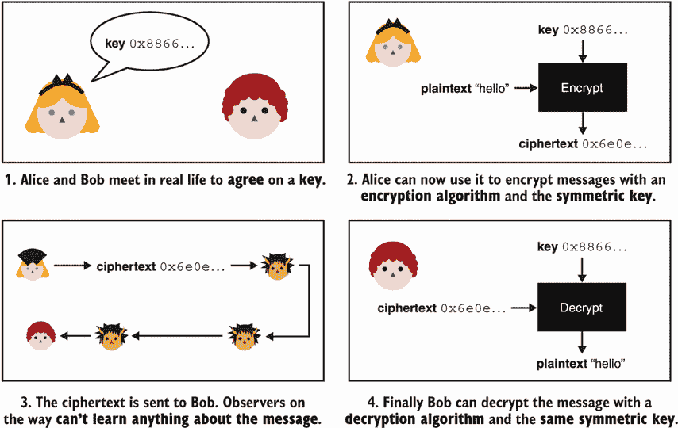

图 4.1 爱丽丝(右上)用密钥`0x8866...`(十六进制的缩写)加密明文 *hello* 。然后爱丽丝将密文发送给鲍勃。Bob(右下角)使用相同的密钥和解密算法解密接收到的密文。

加密允许爱丽丝将她的信息转换成看起来随机的东西，并且可以安全地传送给鲍勃。解密允许 Bob 将加密的消息还原为原始消息。这种新的密码原语为他们的消息提供了保密性(或机密或隐私)。

注 爱丽丝和鲍勃是如何同意使用同一个对称密钥的？现在，我们假设他们中的一个可以使用生成不可预测的密钥的算法，并且他们见面交换了密钥。在实践中，如何使用共享机密引导这样的协议通常是公司需要解决的巨大挑战之一。在这本书里，你会看到这个问题的许多不同的解决方法。

注意，我还没有介绍本章的标题“认证加密”指的是什么。到目前为止我只单独讲了加密。虽然加密本身是不安全的(稍后将详细介绍)，但在介绍认证加密原语之前，我必须解释它是如何工作的。所以请允许我先介绍一下主要的加密标准:高级加密标准 (AES)。

## 4.2 高级加密标准(AES)分组密码

1997 年，NIST 开始了一场关于*高级加密标准* (AES)的公开竞赛，旨在取代数据加密标准(DES)算法，这是他们以前的加密标准，已经开始显示出老化的迹象。比赛持续了三年，在此期间，来自不同国家的密码专家团队提交了 15 种不同的设计。比赛结束时，只有文森特·里门和琼·代蒙提交的 Rijndael 一件作品被提名为获胜者。2001 年，NIST 发布了 AES，作为 FIPS(联邦信息处理标准)197 出版物的一部分。在 FIPS 标准中描述的算法 AES 仍然是今天使用的主要密码。在这一节中，我将解释 AES 是如何工作的。

### 4 . 2 . 1 AES 提供了多少安全性？

AES 提供了三个不同的版本:AES-128 采用 128 位(16 字节)的密钥，AES-192 采用 192 位(24 字节)的密钥，AES-256 采用 256 位(32 字节)的密钥。密钥的长度决定了安全级别——*越大，越强*。尽管如此，大多数应用程序使用 AES-128，因为它提供了足够的安全性(128 位安全性)。

术语*位安全*通常是用来表示密码算法的安全性。例如，AES-128 规定，我们所知道的最好的攻击大约需要 2128 次操作。这个数字是巨大的，也是大多数应用程序追求的安全级别。

位安全是一个上限

128 位密钥提供 128 位安全性的事实是 AES 特有的；这不是一条黄金法则。在一些其他算法中使用的 128 位密钥理论上可以提供小于 128 位的安全性。虽然 128 位密钥提供的安全性低于 128 位，但它永远不会提供更多的安全性(总是存在暴力攻击)。尝试所有可能的密钥最多需要 2 次 <sup class="fm-superscript">128 次</sup>运算，将安全性降低到至少 128 位。

2<sup class="fm-superscript1">128</sup>有多大？请注意，2 的两个幂之间的数量是双倍的。例如 2 <sup class="fm-superscript1">3</sup> 是 2 <sup class="fm-superscript1">2</sup> 的两倍。如果 2 <sup class="fm-superscript1">100</sup> 操作几乎不可能实现，想象一下实现两倍的操作(2 <sup class="fm-superscript1">101</sup> )。要达到 2 <sup class="fm-superscript1">128</sup> ，您已经将初始金额翻了 128 倍！简单地说，2 <sup class="fm-superscript1">128</sup> 等于 340 十亿分之一 282 亿分之一 366 亿分之一 920 亿分之一 938 亿分之一 963 亿分之一 463 亿分之一 374 万亿分之一 607 万亿 4317 亿 6821 万 1456。很难想象这个数字有多大，但是你可以假设我们实际上永远无法达到这个数字。我们也没有考虑任何大型复杂攻击所需的空间量，这在实践中同样巨大。

可以预见的是，AES-128 将在很长一段时间内保持安全性。除非密码分析的进步发现了一个尚未发现的漏洞，可以减少攻击算法所需的运算次数。

### 4 . 2 . 2 AES 的接口

查看 AES 进行加密的界面，我们看到如下:

*   如前所述，该算法采用一个可变长度的密钥。

*   它也需要正好 128 位的明文。

*   它输出一个正好 128 位的密文。

因为 AES 加密的是固定长度的明文，所以我们称之为*分组密码*。其他一些密码可以加密任意长度的明文，你将在本章后面看到。

解密操作正好与此相反:它采用相同的密钥，一个 128 位的密文，并返回原始的 128 位明文。实际上，解密还原了加密。这是可能的，因为加密和解密操作是*确定性的*；不管你调用多少次，它们都产生相同的结果。

用专业术语来说，带密钥的分组密码是一种*排列*:它将所有可能的明文映射到所有可能的密文(参见图 4.2 中的例子)。更改键会更改映射。排列也是可逆的。从一个密文，你有一个映射回到它对应的明文(否则，解密不起作用)。


图 4.2 一个带密钥的密码可以看做一个排列:它把所有可能的明文映射到所有可能的密文。

当然，我们没有足够的空间列出所有可能的明文及其相关的密文。对于 128 位分组密码，这将是 2128 个映射。相反，我们设计 AES 之类的结构，它们的行为类似于排列，并由一个密钥随机化。我们说它们是*伪随机排列* (PRPs)。

### 4 . 2 . 3 AES 的内部结构

让我们更深入地挖掘 AES 的内部，看看里面有什么。请注意，AES 在加密过程中将明文的*状态*视为一个 4x 4 的字节矩阵(如图 4.3 所示)。

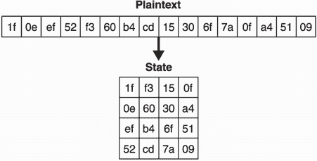

图 4.3 当进入 AES 算法时，一个 16 字节的明文被转换成一个 4x 4 的矩阵。这个状态然后被加密，最后转换成 16 字节的密文。

这在实践中并不重要，但这就是 AES 的定义。在幕后，AES 的工作原理类似于许多类似的对称加密原语，称为*分组密码*，这是一种加密固定大小块的密码。AES 也有一个*循环函数*，它从原始输入(明文)开始迭代几次。我在图 4.4 中说明了这一点。

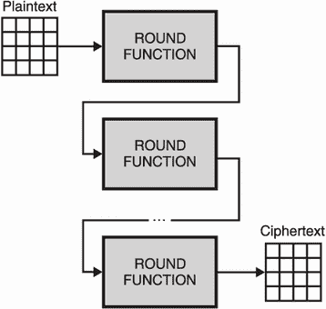

图 4.4 AES 对一个状态迭代一个舍入函数以对其进行加密。round 函数接受几个参数，包括一个密钥。(为简单起见，图中省略了这些内容。)

每次调用 round 函数都会进一步转换状态，最终生成密文。每一轮使用不同的*轮密钥*，它是从主对称密钥(在所谓的*密钥调度*期间)中导出的。这允许对称密钥的比特发生最微小的变化，以给出完全不同的加密(一种称为*扩散*的原理)。

round 函数由多个混合和转换状态字节的操作组成。AES 的循环函数特别利用了四种不同的子函数。虽然我们会回避解释子功能是如何工作的(你可以在任何一本关于 AES 的书中找到这个信息)，但是它们被命名为`SubBytes`、`ShiftRows`、`MixColumns`和`AddRoundKey`。前三个很容易可逆(你可以从运算的输出中找到输入)，最后一个不可逆。它对轮密钥和状态执行异或(XOR ),因此需要知道要反转的轮密钥。我在图 4.5 中说明了进入一轮的内容。


图 4.5 一轮典型的 AES。(第一轮和最后一轮省略了一些操作。)四个不同的函数转换状态。每个函数都是可逆的，否则解密将不起作用。圆圈内的加号( ⊕ )是 XOR 运算的符号。

AES 中 round 函数的迭代次数被选择来阻止密码分析，这通常在减少的轮数上是实用的。例如，在 AES-128 的三轮变体上存在极其有效的*总破解*(即恢复密钥的攻击)。通过多次迭代，密码将明文转换成与原始明文完全不同的东西。明文中最微小的变化也会返回完全不同的密文。这个原理被称为*雪崩效应*。

注 现实世界的密码算法通常通过它们提供的安全性、大小和速度来进行比较。我们已经讨论了 AES 的安全性和大小；它的安全性取决于密钥的大小，一次可以加密 128 位的数据块。就速度而言，许多 CPU 供应商已经在硬件中实现了 AES。例如，AES 新指令(AES-NI)是英特尔和 AMD CPUs 中可用的一组指令，可用于高效实现 AES 的加密和解密。这些特殊的指令使得 AES 在实践中非常快。

你可能还有一个问题，那就是我如何用 AES 加密多于或少于 128 位的数据？这个我接下来回答。

## 4.3 加密企鹅和 CBC 的运作模式

现在我们已经介绍了 AES 分组密码，并解释了一点它的内部原理，让我们看看如何在实践中使用它。分组密码的问题是它只能单独加密一个分组。为了加密不完全是 128 位的东西，我们必须使用*填充*以及*操作模式*。所以我们来看看这两个概念是关于什么的。

假设你想加密一条长消息。很简单，您可以将消息分成 16 字节的块(AES 的块大小)。然后，如果最后一个明文块小于 16 个字节，您可以在末尾追加更多的字节，直到明文变成 16 个字节长。这就是填充的意义！

有几种方法来指定如何选择这些*填充字节*，但是填充最重要的方面是它必须是可逆的。一旦我们解密了密文，我们就应该能够移除填充来检索原始的未填充消息。例如，简单地添加随机字节是行不通的，因为您无法辨别随机字节是否是原始消息的一部分。

最流行的填充机制通常被称为 *PKCS#7 填充*，它最早出现在 90 年代末 RSA (a 公司)发布的 PKCS#7 标准中。PKCS#7 填充指定了一个规则:每个填充字节的值必须设置为所需填充的长度。如果明文已经是 16 字节了呢？然后，我们将填充集的完整块添加到值 16。我在图 4.6 中直观地说明了这一点。要删除填充，可以很容易地检查明文最后一个字节的值，并将其解释为要删除的填充长度。


图 4.6 如果明文不是块大小的倍数，则用达到块大小倍数所需的长度进行填充。在图中，明文是 8 个字节，所以我们使用另外 8 个字节(包含值 8)来填充明文，直到 AES 所需的 16 个字节。

现在，我需要谈谈一个大问题。到目前为止，要加密一条长消息，您只需将它分成 16 个字节的块(也许您填充了最后一个块)。这种幼稚的方式被称为操作的*电子码本* (ECB)模式。正如您所了解的，加密是确定性的，因此对同一块明文加密两次会得到相同的密文。这意味着通过单独加密每个块，得到的密文可能具有重复的模式。

这看起来不错，但是允许这些重复会导致很多问题。最明显的一点是它们泄露了关于明文的信息。最著名的例子是*欧洲央行企鹅*，如图 4.7 所示。


图 4.7 著名的 ECB 企鹅是使用电子码本(ECB)操作模式对企鹅的图像进行加密。由于 ECB 不隐藏重复的模式，人们可以通过查看密文来猜测最初加密的内容。(图片取自维基百科。)

为了安全地加密超过 128 位的明文，存在更好的操作模式来“随机化”加密。 AES 最流行的操作模式之一是*密码块链接* (CBC)。CBC 通过采用一个称为*初始化向量* (IV)的附加值来随机化加密，适用于任何确定性分组密码(不仅仅是 AES)。因此，IV 是块大小的长度(对于 AES 是 16 字节)，并且必须是随机的和不可预测的。

要使用 CBC 操作模式进行加密，首先要生成一个 16 字节的随机 IV(第 8 章将告诉您如何实现这一点)，然后将生成的 IV 与明文的前 16 个字节进行异或运算，然后再对它们进行加密。这有效地随机化了加密。事实上，如果相同的明文被加密两次，但是使用不同的 IVs，那么操作模式会呈现两种不同的密文。

如果有更多的明文要加密，在加密之前，使用前面的密文(就像我们之前使用 IV 一样)与下一个明文块进行异或运算。这也使下一个加密块随机化。请记住，某些东西的加密是不可预测的，应该和我们用来创建真实 IV 的随机性一样好。图 4.8 说明了 CBC 加密。

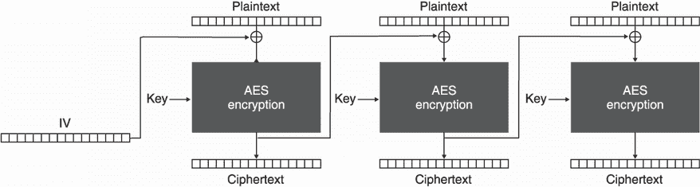

图 4.8 AES 的 CBC 操作模式。为了加密，除了填充明文(分成多个 16 字节的块)之外，我们还使用随机初始化向量(IV)。

要使用 CBC 操作模式解密，请反向操作。因为需要 IV，所以它必须以明文形式与密文一起传输。因为 IV 应该是随机的，所以通过观察值不会泄露任何信息。我在图 4.9 中说明了 CBC 解密。

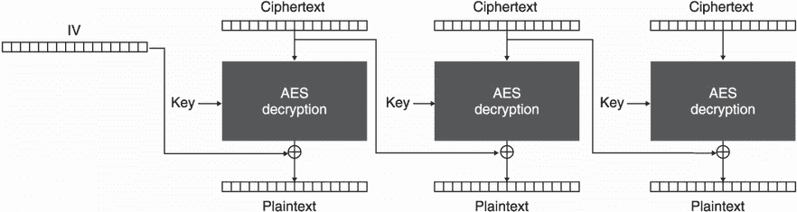

图 4.9 AES 的 CBC 操作模式。要解密，需要相关的初始化向量(IV)。

像 iv 这样的附加参数在密码学中很普遍。然而，这些通常很少被理解，并且是漏洞的一个很大的来源。在 CBC 操作模式下，IV 需要*唯一*(不能重复)以及*不可预测*(真的需要随机)。这些要求可能会因为多种原因而失败。因为开发人员经常对 IV 感到困惑，一些加密库已经消除了在用 CBC 加密时指定 IV 并自动随机生成一个 IV 的可能性。

警告 当 IV 重复或可预测时，加密再次变得确定，许多巧妙的攻击成为可能。TLS 协议上著名的 BEAST 攻击(针对 SSL/TLS 的浏览器漏洞)就是这种情况。还要注意，其他算法可能对 IVs 有不同的要求。这就是为什么阅读手册总是很重要的原因。危险的细节隐藏在细则中。

注意，操作模式和填充仍然不足以使密码可用。您将在下一节中看到原因。

## 4.4 缺乏真实性，因此 AES-CBC-HMAC

到目前为止，我们还没有解决一个根本性的缺陷:密文以及 CBC 情况下的 IV 仍然可以被攻击者修改。事实上，没有完整的机制来防止这一点！密文或 IV 的变化可能会对解密产生意想不到的影响。例如，在 AES-CBC(与 CBC 操作模式一起使用的 AES)中，攻击者可以通过翻转 IV 和密文中的位来翻转明文的特定位。我在图 4.10 中说明了这种攻击。


图 4.10 截取 AES-CBC 密文的攻击者可以进行如下操作:(1)因为 IV 是公开的，所以翻转 IV 的一位(例如从 1 到 0)也(2)翻转第一块明文的一位。(3)比特的修改也可以发生在密文块上。(4)这样的改变影响随后的解密明文块。(5)注意，篡改密文块具有扰乱该块的解密的直接效果。

因此，密码或操作模式不得按原样使用。它们缺乏某种完整性保护来确保密文及其相关参数(这里是 IV)在不触发某些警报的情况下不能被修改。

为了防止密文被修改，我们可以使用第三章中提到的*消息认证码*(MAC)。对于 AES-CBC，我们通常结合使用 HMAC(用于*基于哈希的 MAC* )和 SHA-256 哈希函数来提供完整性。然后，在填充明文并在密文和 IV 上加密它之后，我们应用 MAC 否则，攻击者仍然可以修改 IV 而不被发现。

警告这种构造叫做 *Encrypt-then-MAC* 。替代方案(如 *MAC-then-Encrypt* )有时会导致巧妙的攻击(如著名的 Vaudenay padding oracle 攻击)，因此在实践中可以避免。

所创建的认证标签可以与 IV 和密文一起发送。通常，所有这些都被连接在一起，如图 4.11 所示。此外，最佳做法是对 AES-CBC 和 HMAC 使用不同的密钥。

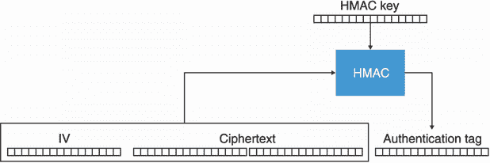

图 4.11 AES-CBC-HMAC 构造产生三个参数，它们通常按以下顺序连接:公共 IV、密文和认证标签。

在解密之前，标签需要被验证(如你在第 3 章看到的，在固定时间内)。所有这些算法的组合被称为 *AES-CBC-HMAC* ，是最广泛使用的认证加密模式之一，直到我们开始采用更现代的一体化结构。

警告 AES-CBC-HMAC 不是对开发者最友好的建筑。它通常实现得很差，如果使用不当，会有一些危险的陷阱(例如，每个加密的 IV*必须*是不可预测的)。我已经花了几页介绍这个算法，因为它仍然被广泛使用并且仍然有效，但是我建议不要使用它，而应该使用我接下来介绍的更流行的构造。

## 4.5 一体化结构:认证加密

加密的历史并不光彩。人们不仅很少了解没有认证的加密是危险的，而且误用认证也是开发人员犯的系统性错误。出于这个原因，出现了许多研究，试图标准化一体化结构，为开发人员简化加密的使用。在本节的其余部分，我将介绍这个新概念以及两个广泛采用的标准:AES-GCM 和 ChaCha20-Poly1305。

### 4.5.1 什么是关联数据认证加密(AEAD)？

目前最流行的数据加密方式是使用一种一体化结构，称为*认证加密和关联数据* (AEAD)。这种构造非常接近 AES-CBC-HMAC 所提供的，因为它也为您的明文提供保密性，同时检测密文上可能发生的任何修改。更重要的是，它提供了一种认证*关联数据*的方法。

关联的数据参数是可选的，可以为空，也可以包含与明文加密和解密相关的元数据。这些数据不会被加密，或者是隐含的，或者是与密文一起传输的。此外，密文的大小大于明文，因为它现在包含一个额外的身份验证标记(通常附加在密文的末尾)。

要解密密文，我们需要使用相同的隐含或传输的关联数据。结果要么是一个错误，表明密文在传输过程中被修改，要么是原始明文。我在图 4.12 中说明了这个新的原语。


图 4.12 Alice 和 Bob 亲自会面，就共享密钥达成一致。然后，Alice 可以使用 AEAD 加密算法和密钥来加密她发送给 Bob 的消息。她可以选择性地认证一些相关数据(`ad`)；例如，消息的发送者。收到密文和身份验证标签后，Bob 可以使用相同的密钥和相关数据对其进行解密。如果相关数据不正确或密文在传输过程中被修改，解密将失败。

让我们看看如何使用一个*密码库*来加密并使用一个经过认证的加密原语来解密。为此，我们将使用 JavaScript 编程语言和 Web Crypto API(大多数浏览器支持的官方接口，提供低级加密功能)，如下所示。

清单 4.1 JavaScript 中的 AES-GCM 认证加密

```
let config = {
    name: 'AES-GCM',
    length: 128                                                            ❶
};
let keyUsages = ['encrypt', 'decrypt'];
let key = await crypto.subtle.generateKey(config, false, keyUsages);

let iv = new Uint8Array(12);
await crypto.getRandomValues(iv);                                          ❷

let te = new TextEncoder();
let ad = te.encode("some associated data");                                ❸
let plaintext = te.encode("hello world");

let param = {
    name: 'AES-GCM',
    iv: iv,
    additionalData: ad
};
let ciphertext = await crypto.subtle.encrypt(param, key, plaintext);

let result = await window.crypto.subtle.decrypt(                           ❹
    param, key, ciphertext);                                               ❹
new TextDecoder("utf-8").decode(result);
```

❶ 为 128 位安全生成 128 位密钥

❷ 随机产生一个 12 字节的 IV

❸ 使用一些关联数据来加密我们的明文。解密必须使用相同的 IV 和相关数据。

❹ 如果 IV、密文或相关数据被篡改，解密会抛出异常。

请注意，Web Crypto API 是一个低级 API，因此不能帮助开发者避免错误。例如，它让我们指定一个 IV，这是一个危险的模式。在这个清单中，我使用了 AES-GCM，这是使用最广泛的 AEAD。接下来，我们再来详细说说这个 AES-GCM。

### 4 . 5 . 2 AES-GCM AEAD

使用最广泛的 AEAD 是 AES 与*伽罗瓦/计数器模式*(也缩写为 AES-GCM)。它通过利用对 AES 的硬件支持和使用可以有效实现的 MAC (GMAC)来实现高性能。

自 2007 年以来，AES-GCM 已被纳入 NIST 的专门出版物(SP 800-38D ),它是加密协议中使用的主要密码，包括用于保护互联网网站连接的多个版本的 TLS 协议。实际上，我们可以说 AES-GCM 加密了网络。

AES-GCM 将计数器(CTR)操作模式与 GMAC 消息认证码相结合。首先，让我们看看 CTR 模式如何与 AES 一起工作。图 4.13 显示了 AES 如何与 CTR 模式配合使用。

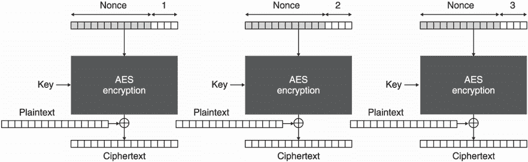

图 4.13 AES-CTR 算法结合了 AES 密码和计数器操作模式(CTR 模式)。一个唯一的随机数与一个计数器连接并被加密以产生一个密钥流。然后密钥流与明文的实际字节进行异或运算。

AES-CTR 使用 AES 来加密与一个数字(从 1 开始)而不是明文连接的随机数。这个额外的参数“一次随机数”与 IV 的目的相同:它允许操作模式随机化 AES 加密。然而，这些要求与 CBC 模式的 IV 略有不同。随机数需要是唯一的，但不能是*不可预测的*。一旦这个 16 字节的块被加密，结果被称为*密钥流*，并且它与实际的明文进行异或运算以产生加密。

注意和 iv 一样，nonces 是密码学中的一个常用术语，它们存在于不同的密码原语中。Nonces 可以有不同的要求，尽管名字通常表明它不应该重复。但是，像往常一样，重要的是手册说了什么，而不是参数的名称意味着什么。事实上，AES-GCM 的随机数有时被称为 IV。

AES-CTR 中的 nonce 是 96 位(12 个字节)，并占用了 16 个字节中的大部分进行加密。剩下的 32 位(4 字节)用作计数器，从 1 开始，每次块加密递增，直到达到最大值 2<sup class="fm-superscript1">4×8</sup>–1 = 4，294，967，295。这意味着，最多有 4，294，967，295 个 128 位的块可以用相同的 nonce 加密(因此少于 69gb)。

如果相同的随机数被使用两次，则创建相同的密钥流。通过将两个密文异或在一起，密钥流被取消，并且可以恢复两个明文的异或。这可能是毁灭性的，特别是如果您有关于两个明文之一的内容的一些信息。

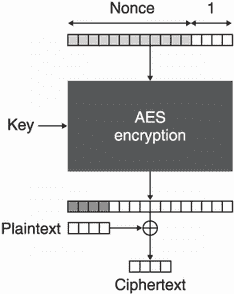

图 4.14 如果 AES-CTR 的密钥流比明文长，则在与明文进行 xor 运算之前，它会被截断到明文的长度。这允许 AES-CTR 在没有填充的情况下工作。

图 4.14 显示了 CTR 模式的一个有趣的方面:不需要填充。我们说它把分组密码(AES)变成了流密码。它逐字节加密明文。

流密码

流密码是另一类密码。它们不同于分组密码，因为我们可以通过与密钥流异或来直接使用它们加密密文。不需要填充或操作模式，允许密文与明文长度相同。

在实践中，这两类密码没有太大的区别，因为分组密码可以很容易地通过 CTR 操作模式转换成流密码。但是，从理论上讲，分组密码具有优势，因为它们在构造其他类型的原语时非常有用(类似于你在第 2 章中看到的哈希函数)。

这也是一个很好的时机来说明，默认情况下，加密并没有(或很糟糕地)隐藏你正在加密的内容的长度。因此，如果攻击者能够影响正在加密的部分内容，那么在加密之前使用压缩可能会导致攻击。

AES-GCM 的第二部分是 *GMAC* 。它是一个由带密钥的哈希(称为 *GHASH* )构建的 MAC。用专业术语来说，GHASH 是一个近乎 xor 的通用哈希(AXU)，也叫*差分不可预测函数* (DUF)。这样一个函数的需求比 hash 弱。例如，AXU 不需要抗碰撞。由于这一点，GHASH 可以明显更快。图 4.15 说明了 GHASH 算法。


图 4.15 GHASH 取一个键，以类似 CBC 模式的方式逐块吸收输入。它产生一个 16 字节的摘要。

为了用 GHASH 哈希一些东西，我们将输入分成 16 字节的块，然后以类似于 CBC 模式的方式哈希它们。由于这个哈希以一个密钥作为输入，理论上它可以被用作 MAC，但只有一次(否则，算法会崩溃)——这是一个*一次性 MAC* 。由于这个对我们来说不理想，我们使用一种技术(由于 Wegman-Carter)将 GHASH 转换成一个*多次 MAC* 。我在图 4.16 中说明了这个。


图 4.16 GMAC 使用带密钥的 GHASH 对输入进行哈希处理，然后使用不同的密钥和 AES-CTR 对其进行加密，生成一个认证标签。

GMAC 使用 AES-CTR(和不同的密钥)对 GHASH 输出进行有效加密。同样，nonce 必须是唯一的；否则，聪明的攻击者可以恢复 GHASH 使用的认证密钥，这将是灾难性的，并允许容易地伪造认证标签。

最后，AES-GCM 可以视为 CTR 模式和 GMAC 的交织组合，类似于我们之前讨论的先加密后 MAC 的结构。我在图 4.17 中说明了整个算法。

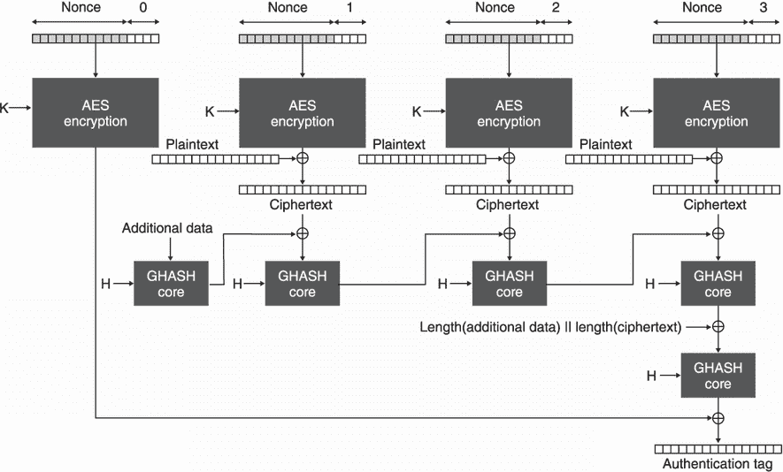

图 4.17 AES-GCM 的工作原理是使用带有对称密钥 *K* 的 AES-CTR 对明文进行加密，并使用 GMAC 对相关数据和密文进行认证，使用认证密钥 *H* 。

计数器从 1 开始加密，剩下的 0 计数器用于加密 GHASH 创建的认证标签。反过来，GHASH 获得一个独立的密钥 *H* ，这是用密钥 *K* 对全零块的加密。这样，不需要携带两个不同的密钥，因为密钥 *K* 足以导出另一个密钥。

正如我之前说过的，AES-GCM 的 12 字节 nonce 需要是唯一的，因此永远不会重复。请注意，它不必是随机的。因此，有些人喜欢把它作为一个*计数器*，从 1 开始，每次加密递增。在这种情况下，必须使用允许用户选择 nonce 的加密库。这允许在达到随机数的最大值之前加密 2 个<sup class="fm-superscript">12×8</sup>–1 消息。简单地说，这是实际上不可能达到的消息数量。

另一方面，拥有一个计数器意味着需要保持*状态*。如果机器在错误的时间崩溃，nonce 重用可能会发生。出于这个原因，有时最好是有一个*随机随机数*。实际上，有些库不让开发者选择随机数，而是随机生成随机数。这样做可以避免重复发生，因为概率太高，这在实践中是不应该发生的。然而，加密的消息越多，使用的随机数就越多，发生冲突的几率就越高。因为我们在第二章讲过的生日界限，在随机生成 nonces 时，建议不要用同一个密钥加密超过 2 个 <sup class="fm-superscript">92/3</sup> ≈ 2 <sup class="fm-superscript">30</sup> 消息。

超越生日安全

2 <sup class="fm-superscript">30</sup> 消息是数量相当大的消息。在许多情况下，这可能永远也不会实现，但是现实世界的密码术经常会突破被认为合理的极限。一些长期存在的系统需要每秒加密许多许多消息，最终达到这些限制。例如，Visa 每天处理 1.5 亿笔交易。如果它需要用一个唯一的密钥加密这些信息，它将在仅仅一周内达到 2 条 <sup class="fm-superscript">30 条</sup>信息的极限。在这些极端情况下，*密钥更新*(改变用于加密的密钥)可能是一个解决方案。还有一个名为*超越生日绑定安全性*的研究领域，旨在提高可以用同一密钥加密的消息的最大数量。T12】

### 查查 20-聚 1305

我要说的第二个 AEAD 是 *ChaCha20-Poly1305* 。它结合了两种算法:ChaCha20 流密码和 Poly1305 MAC。两者都是由 Daniel J. Bernstein 单独设计的，用于软件时速度很快，与 AES 相反，AES 在没有硬件支持时速度很慢。2013 年，谷歌对 ChaCha20-Poly1305 AEAD 进行了标准化，以便在依赖低端处理器的 Android 手机中使用。现在，它被广泛地应用于互联网协议，如 OpenSSH、TLS 和 Noise。

ChaCha20 是 Salsa20 流密码的修改，最初是由 Daniel J. Bernstein 在 2005 年左右设计的。它是 ESTREAM 竞赛中被提名的算法之一(【https://www.ecrypt.eu.org/stream/】)。像所有的流密码一样，该算法产生一个*密钥流*，一系列明文长度的随机字节。然后，它与明文进行异或运算，生成密文。解密时，使用相同的算法生成相同的密钥流，将其与密文进行异或运算，以返回明文。我在图 4.18 中说明了这两种流动。


图 4.18 ChaCha20 通过采用对称密钥和唯一随机数来工作。然后，它生成一个密钥流，该密钥流与明文(或密文)进行异或运算以产生密文(或明文)。加密是长度保持的，因为密文和明文的长度相同。

在幕后，ChaCha20 通过反复调用*块函数*产生多个 64 字节的密钥流块来生成密钥流。块函数需要

*   类似 AES-256 的 256 位(32 字节)密钥

*   类似 AES-GCM 的 92 位(12 字节)随机数

*   类似 AES-GCM 的 32 位(4 字节)计数器

加密过程与 AES-CTR 相同。(我在图 4.19 中说明了这个流程。)

1.  运行模块功能，每次递增计数器，直到产生足够的密钥流

2.  将密钥流截断到明文的长度

3.  将密钥流与明文进行异或运算

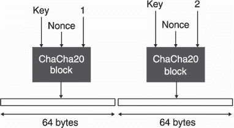

图 4.19 ChaCha20 的密钥流是通过调用内部块函数创建的，直到产生足够的字节。一个块函数调用创建 64 字节的随机密钥流。

由于计数器的上限，您可以使用 ChaCha20 加密与 AES-GCM 一样多的消息(因为它由类似的 nonce 参数化)。因为这个块函数创建的输出要大得多，所以可以加密的消息的大小也会受到影响。可以加密大小为 232 × 64 字节≈ 274 GB 的消息。如果重新使用随机数来加密明文，就会出现与 AES-GCM 类似的问题。观察者可以通过对两个密文进行异或运算来获得两个明文的异或运算，并且还可以恢复随机数的认证密钥。这些都是严重的问题，可能导致攻击者能够伪造消息！

随机数和计数器的大小

随机数和计数器的大小(实际上)并不总是处处相同(对于 AES-GCM 和 ChaCha20-Poly1305 都是如此)，但它们是所采用的标准的推荐值。尽管如此，一些加密库接受不同大小的 nonce，一些应用程序增加计数器(或 nonce)的大小，以便允许加密更大的消息(或更多的消息)。增加一个组件的大小必然会减少另一个组件的大小。

为了防止这种情况，在允许大量消息在单个密钥下加密的同时，其他标准如 XChaCha20-Poly1305 也是可用的。这些标准增加了 nonce 的大小，同时保持其余部分不变，这在 nonce 需要随机生成而不是作为系统中跟踪的计数器的情况下非常重要。

在 ChaCha20 块函数内部，形成一个状态。图 4.20 说明了这种状态。


图 4.20 chacha 20 功能块的状态。它由每个 32 字节的 16 个字(用正方形表示)组成。第一行存储常数，第二和第三行存储 32 字节的对称密钥，接下来的字存储 4 字节的计数器，最后 3 个字存储 12 字节的 nonce。

然后，通过循环函数迭代 20 次，将该状态转换为 64 字节的密钥流(因此算法的名称为 20)。这类似于 AES 及其 round 函数所做的工作。round 函数本身在每一轮中调用*四分之一轮* (QR) *函数* 4 次，每次根据轮数是奇数还是偶数对内部状态的不同字进行操作。图 4.21 显示了这个过程。

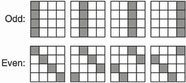

图 4.21 chacha 20 中的一轮影响一个状态中包含的所有字。由于四分之一圆(QR)函数只接受 4 个参数，因此必须对不同的字(在图中显示为灰色)至少调用 4 次，以修改状态的所有 16 个字。

QR 函数采用四个不同的参数，并且仅使用加法、旋转和异或运算来更新它们。我们说它是一个 *ARX* 流密码。这使得 ChaCha20 在软件上非常容易实现并且速度很快。

*Poly1305* 是通过威格曼-卡特技术创造的 MAC，很像我们之前谈到的 GMAC。图 4.22 说明了这种加密 MAC。


图 4.22 Poly1305 的核心函数通过将一个附加累加器初始设置为 0 和一个认证密钥 *r* 一次吸收一个输入块。输出作为累加器提供给核心函数的下一次调用。最终，输出被添加到随机值 *s* 中，成为认证标签。

在图中， *r* 可以看作是该方案的认证密钥，就像 GMAC 的认证密钥 *H* 一样。并且 *s* 通过加密结果使 MAC 对于多次使用是安全的，因此它对于每次使用必须是唯一的。

*poly 1305 核心函数*将密钥与累加器(一开始设置为 0)和消息混合进行认证。运算是简单的常数模乘法 *P* 。

注 显然，我们的描述中遗漏了很多细节。我很少提到如何对数据进行编码，或者在采取行动之前应该如何填充一些参数。这些都是实现细节，对我们来说并不重要，因为我们试图直观地了解这些东西是如何工作的。

最后，我们可以使用 ChaCha20 和一个设置为 0 的计数器来生成一个密钥流，并导出 Poly1305 所需的 16 字节 *r* 和 16 字节 *s* 值。我在图 4.23 中说明了生成的 AEAD 密码。


图 4.23 ChaCha20-Poly1305 的工作原理是使用 ChaCha20 加密明文，并导出 Poly1305 MAC 所需的密钥。然后，Poly1305 用于验证密文和相关数据。

首先使用普通的 ChaCha20 算法推导出 Poly1305 所需的认证机密 *r* 和 *s* 。然后计数器递增，ChaCha20 用于加密明文。此后，相关数据和密文(以及它们各自的长度)被传递给 Poly1305，以创建认证标签。

为了解密，应用完全相同的过程。ChaCha20 首先通过收到的标签验证密文和相关数据的真实性。然后它解密密文。

## 4.6 其他种类的对称加密

让我们暂停片刻，回顾一下到目前为止你所学的对称加密算法:

*   *非认证加密*—具有操作模式但没有 MAC 的 AES。这在实践中是不安全的，因为密文可能被篡改。

*   *认证加密* —AES-GCM 和 ChaCha20-Poly1305 是最广泛采用的两种密码。

这一章可以到此结束，一切都会好的。然而，现实世界的密码学并不总是关于公认的标准；这也是关于大小、速度、格式等方面的约束(T2)。为此，让我简要介绍一下当 AES-GCM 和 ChaCha20-Poly1305 不适用时，可以使用的其他对称加密类型。

### 4.6.1 密钥包装

基于随机数的 AEADs 的一个问题是它们都需要一个随机数，这需要额外的空间。请注意，在加密密钥时，您可能不一定需要随机化，因为加密的内容已经是随机的，不会以很高的概率重复(或者即使重复，也没什么大不了)。一个众所周知的密钥包装标准是 NIST 的特别出版物 800-38F:“分组密码操作模式的推荐:密钥包装方法”这些密钥包装算法不需要额外的 nonce 或 IV，而是基于它们正在加密的内容来随机化它们的加密。由于这一点，他们不必在密文旁边存储额外的 nonce 或 IV。

### 4.6.2 随机数防误用认证加密

2006 年，Phillip Rogaway 发表了一种新的密钥包装算法，叫做*合成初始化向量* (SIV)。作为提议的一部分，罗加威指出，SIV 不仅对加密密钥有用，而且作为一个通用的 AEAD 方案，对随机数重复更加宽容。正如您在本章中了解到的，AES-GCM 或 ChaCha20-Poly1305 中重复的 nonce 可能会产生灾难性的后果。它不仅揭示了两个明文的 XOR，而且还允许攻击者恢复身份验证密钥并伪造有效的消息加密。

nonce 防误用算法的要点是，用相同的 nonce 加密两个明文只显示两个明文是否相等，仅此而已。不是很棒，但显然没有泄露一个认证密钥那么糟糕。该方案已经引起了很多人的兴趣，并在 RFC 8452 中被标准化:“AES-GCM-SIV: Nonce 防误用认证加密”SIV 背后的技巧是，AEAD 中用于加密的随机数是从明文本身生成的，这使得两个不同的明文不太可能在同一个随机数下被加密。

### 4.6.3 磁盘加密

对笔记本电脑或手机的存储进行加密有一些严格的限制:它必须很快(否则用户会注意到)，而且你只能就地加密(节省空间对大量设备来说很重要)。因为加密不能扩展，所以需要 nonce 和认证标签的 AEADs 并不适合。相反，使用未经验证的加密。

为了保护免受*比特翻转攻击*，大数据块(想想几千字节)被加密，一次比特翻转就能打乱整个数据块的解密。这样，攻击使设备崩溃的可能性比达到目标的可能性更大。这些构造被称为*宽分组密码*，尽管这种方法也被戏称为*穷人认证*。

Linux 系统和一些 Android 设备已经采用了这种使用 Adiantum 的方法，Adiantum 是一种包装 ChaCha 密码的宽块结构，由谷歌在 2019 年标准化。尽管如此，大多数设备使用非理想的解决方案:微软和苹果都使用 AES-XTS，这是未经认证的，不是一个宽块密码。

### 4.6.4 数据库加密

在数据库中加密数据是很棘手的。因为整个要点是防止数据库漏洞泄漏数据，所以用于加密和解密数据的密钥必须存储在远离数据库服务器的地方。因为客户自己没有数据，所以他们查询数据的方式受到严重限制。

最简单的解决方案叫做*透明数据加密* (TDE)，简单来说就是加密选定的列。这在某些情况下工作得很好，尽管需要小心地验证标识被加密的行和列的相关数据；否则，可以交换加密的内容。然而，人们不能搜索加密的数据，因此查询必须使用未加密的列。

*可搜索加密*是旨在解决这个问题的研究领域。已经提出了许多不同的方案，但似乎没有灵丹妙药。不同的方案提出了不同级别的“可搜索性”以及不同的安全性降级。例如，盲索引只允许您搜索精确匹配，而保序加密和揭示顺序加密允许您对结果进行排序。底线是，这些解决方案的安全性需要仔细考虑，因为它们确实是权衡的结果。

## 总结

*   加密(或称对称加密)是一种加密原语，可用于保护数据的机密性。安全性依赖于需要保密的对称密钥。

*   对称加密需要认证(之后我们称之为认证加密)才是安全的，否则密文就可能被篡改。

*   通过使用消息认证码，可以从对称加密算法构造认证加密。但是最佳实践是使用关联数据认证加密(AEAD)算法，因为它们是一体式结构，很难被误用。

*   只要双方都知道相同的对称密钥，他们就可以使用认证加密来隐藏他们的通信。

*   AES-GCM 和 ChaCha20-Poly1305 是两种最广泛采用的 AEADs。如今，大多数应用程序都使用这两者之一。

*   重用 nonces 破坏了 AES-GCM 和 ChaCha20-Poly1305 的认证。像 AES-GCM-SIV 这样的方案是抗随机数误用的，而密钥加密可以避免这个问题，因为随机数是不必要的。

*   现实世界的密码学是关于约束的，AEADs 并不总是适合所有场景。例如，数据库或磁盘加密就是这种情况，需要开发新的结构。