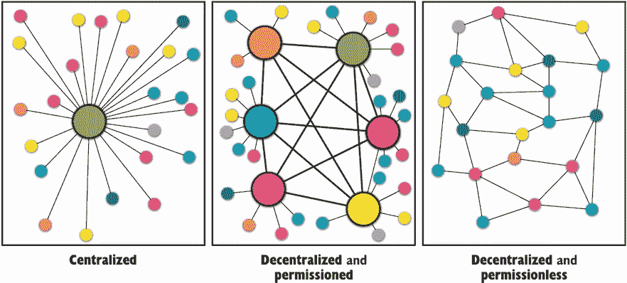
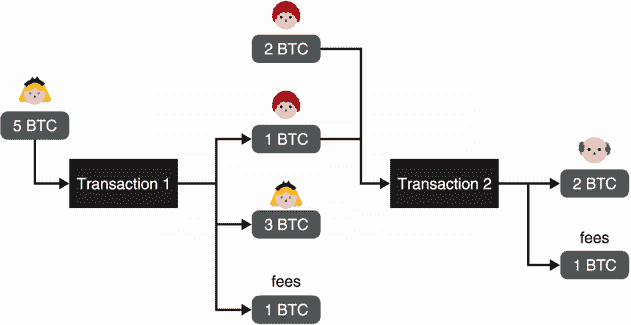
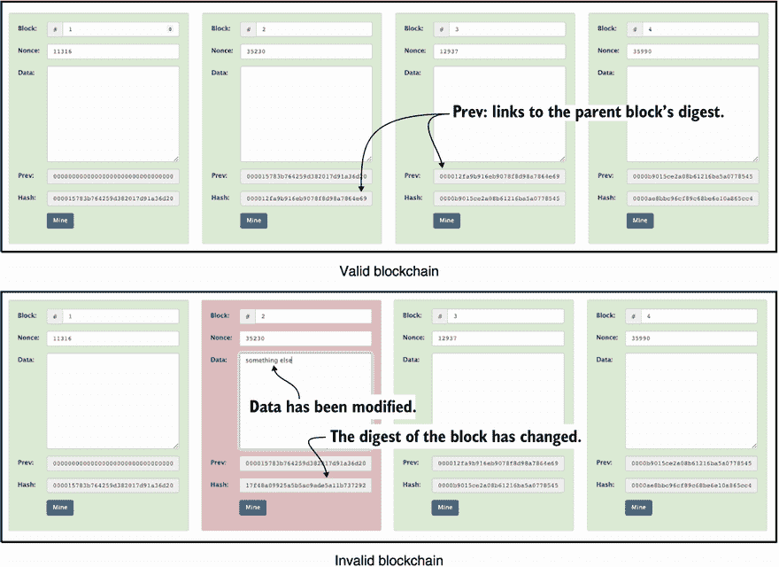
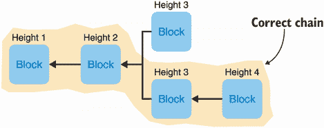
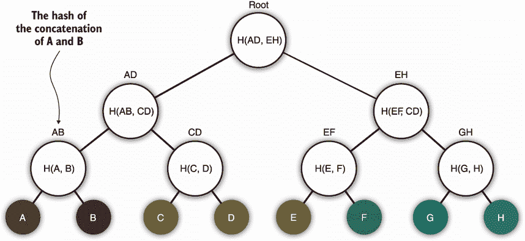
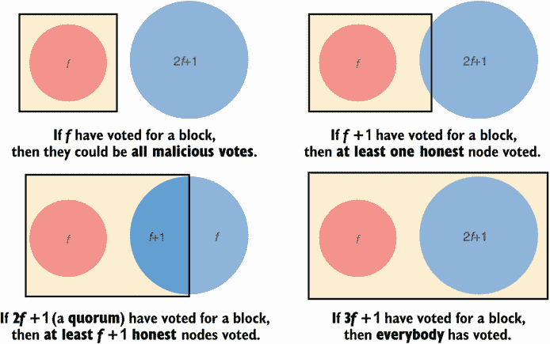
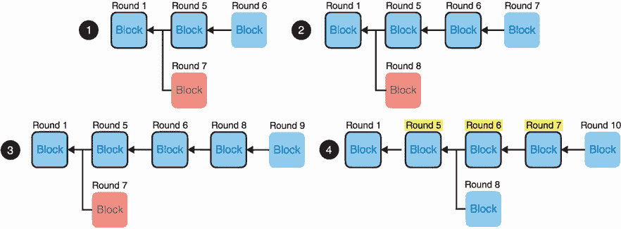

# 12 Crypto作为加密货币？

本章涵盖了

*   共识协议及其如何使加密货币成为可能
*   不同类型的加密货币
*   比特币和Diem加密货币在实践中是如何工作的

密码学能成为新金融系统的基础吗？这是至少自2008年以来加密货币一直试图回答的问题，当时比特币是由中本聪(他至今仍未透露自己的身份)提出的。在此之前，术语 *crypto* 总是被用来指代密码学领域。但自从比特币诞生以来，我看到它的含义迅速发生了变化，现在也被用来指代加密货币。反过来，加密货币爱好者对学习密码学越来越感兴趣。这是有意义的，因为密码学是加密货币的核心。

什么是*加密货币*？这是两件事:

*   *是数字货币。*简单地说，它允许人们通过电子方式交易货币。有时使用政府支持的货币(如美元)，有时使用虚构的货币(如比特币)。你可能已经在使用数字货币了——无论何时你给网上的人寄钱或者使用支票账户，你都在使用数字货币！事实上，你不再需要通过邮件发送现金，今天的大多数货币交易只是更新数据库中的行。

*   这是一种严重依赖加密技术来避免使用可信的第三方并提供透明度的货币。在加密货币中，没有可以盲目信任的中央机构，比如政府或银行。我们经常把这个属性称为*去中心化*(比如“我们正在去中心化信任”)。因此，正如你将在本章中看到的，加密货币被设计为容忍一定数量的恶意行为者，并允许人们验证它们是否正常运行。

加密货币相对较新，因为第一个成功的实验是2008年全球金融危机期间提出的比特币。虽然危机始于美国，但它迅速蔓延到世界其他地区，侵蚀了人们对金融系统的信任，并为比特币等更透明的举措提供了平台。当时，许多人开始意识到金融交易的现状是低效的，维护成本高，并且对大多数人来说是不透明的。剩下的就是历史了，我相信这本书是第一本包含加密货币一章的密码学书籍。

## 12.1拜占庭容错(BFT)一致性算法简介

假设你想创造一种新的数字货币。它实际上并不需要太多的工作。您可以在专用服务器上建立一个数据库，用于跟踪用户及其余额。这样，您为人们提供了一个界面来查询他们的余额或让他们发送付款，这将减少他们在数据库中的余额，并增加另一行中的余额。最初，你也可以随机地将你的一些虚构货币归于你的朋友，这样他们就可以开始向你的系统转账。但是这样一个简单的系统有许多缺陷。

### 12.1.1弹性问题:救援的分布式协议

我们刚才看到的系统是一个*单点故障*。如果你失去电力，你的用户将无法使用该系统。更糟糕的是，如果一些自然灾害意外地摧毁了你的服务器，每个人都可能永远失去平衡。为了解决这个问题，有一些众所周知的技术可以用来为您的系统提供更多的弹性。*分布式系统*的领域研究这样的技术。

在这种情况下，大多数大型应用程序通常使用的解决方案是将数据库的内容实时复制到其他备份服务器。然后，这些服务器可以分布在不同的地理位置，随时可以用作备份，甚至可以在主服务器出现故障时接管。这就是所谓的*高可用性*。你现在有一个*分布式数据库*。

对于服务于大量查询的大型系统，通常情况下，这些备份数据库并不只是坐在一旁等待有用，而是用于向状态提供读取。让多个数据库接受写入和更新是很困难的，因为这样可能会产生冲突(同样，两个人编辑同一个文档也是很危险的)。因此，您通常希望单个数据库充当*领导者*并命令对数据库的所有写入和更新，而其他数据库可以用来读取状态。

数据库内容的复制可能会很慢，预计您的一些数据库将落后于领先者，直到他们赶上来。如果他们位于世界上更远的地方，或者由于某种原因正在经历网络延迟，这种情况尤其如此。当使用复制的数据库读取状态时，这种延迟就会成为一个问题。(假设您和您的朋友看到不同的帐户余额，因为你们都在查询不同的服务器。)

在这些情况下，编写应用程序通常是为了容忍这种滞后。这被称为*最终一致性*，因为最终数据库的状态变得一致。(存在更强的一致性模型，但是它们通常很慢并且不切实际。)这样的系统还有其他问题:如果主数据库崩溃，哪一个成为主数据库？另一个问题是，如果主数据库崩溃时备份数据库落后了，我们会丢失一些最新的更改吗？

这就是当你需要整个系统就某个决策达成一致(或达成一致)时，更强的算法— *一致算法*(也称为*日志复制*、*状态机复制*或*原子广播*)发挥作用的地方。想象一下，一个共识算法解决了一群人试图就点什么披萨达成一致的解决方案。如果每个人都在同一个房间里，就很容易看出大多数人想要什么。但是，如果每个人都通过网络进行通信，而网络中的消息可能会被延迟、丢弃、截获和修改，那么就需要一个更复杂的协议。

让我们看看如何利用共识来回答前两个问题。在崩溃的情况下哪个数据库接管的第一个问题被称为*领导者选举*，并且共识算法通常被用来确定哪个将成为下一个领导者。第二个问题通常通过在两个不同的步骤中查看数据库变更来解决:*待决*和*已提交*。对数据库状态的更改最初总是待定的，并且只有在足够多的数据库同意提交时才能被设置为已提交(这也是可以使用一致协议的地方)。一旦提交，对状态的更新就不容易丢失，因为大多数参与的数据库已经提交了更改。

一些著名的共识算法包括Paxos(由Lamport于1989年发表)及其后续简化Raft(由Ongaro和Ousterhout于2013年发表)。您可以在大多数分布式数据库系统中使用这些算法来解决不同的问题。(关于Raft的精彩互动解释，请查看https://thesecretlivesofdata.com/raft的。)

### 12.1.2信任问题？分权有所帮助

分布式系统(从操作角度来看)为充当单点故障的系统提供了一种弹性替代方案。大多数分布式数据库系统使用的一致性算法不能很好地容忍错误。一旦机器开始崩溃，或者由于硬件故障开始行为失常，或者开始与其他机器断开连接，比如网络分区，问题就出现了。此外，从用户的角度来看，没有办法检测到这一点，如果服务器受到威胁，这将是一个更大的问题。

如果我查询一个服务器，它告诉我爱丽丝的账户里有50亿美元，我只能相信它。如果服务器在其响应中包括自时间开始以来她接收和发送的所有汇款，并对其进行求和，我可以验证其结果，即她账户中的50亿美元是正确的。但是什么告诉我服务器没有骗我？也许当Bob询问不同的服务器时，它返回Alice账户的完全不同的余额和/或历史。我们称之为*分叉*(两个矛盾的状态被呈现为有效)，这是历史上本不该发生的分支。因此，您可以想象其中一个复制数据库的损坏会导致非常严重的后果。

在第九章中，我提到了*证书透明性*，一个旨在检测网络公钥基础设施(PKI)中此类分叉的八卦协议。金钱的问题在于，仅仅检测是不够的。你要从一开始就防止分叉的发生！1982年，Paxos共识算法的作者Lamport提出了*拜占庭容错* (BFT) *共识算法*的思想。

*我们想象一下，拜占庭军队的几个师在一座敌方城市外扎营，每个师都由自己的将军指挥。将军们只能通过信使相互交流。观察敌人后，他们必须决定一个共同的行动计划。然而，一些将军可能是叛徒，试图阻止忠诚的将军达成协议*。

—兰波特等人(《拜占庭将军问题》，1982)

凭借他的拜占庭类比，Lamport开创了BFT共识算法领域，旨在防止糟糕的共识参与者在就决策达成一致时对系统产生不同的冲突观点。这些BFT共识算法与之前的共识算法如Paxos和Raft非常相似，只是复制的数据库(协议的参与者)不再盲目地相互信任。BFT协议通常大量使用加密技术来认证消息和决策，而这些消息和决策又可以被其他人用来对共识协议输出的决策进行加密验证。

因此，这些《BFT共识协议》解决了我们的弹性和信任问题。不同的复制数据库可以运行这些BFT算法以就新的系统状态(例如，用户余额)达成一致，同时通过验证状态转换(用户之间的事务)是有效的并且已经被大多数参与者同意来监管彼此。我们说信任现在是*去中心化*。

第一个发明的真实世界BFT共识算法是*实用BFT* (PBFT)，发表于1999年。PBFT是一种基于领导者的算法，类似于Paxos和Raft，其中一个领导者负责提出建议，而其他人则试图就这些建议达成一致。不幸的是，PBFT非常复杂、缓慢，并且不能很好地扩展到超过12个参与者。今天，大多数现代加密货币使用更有效的PBFT变体。例如，脸书在2019年推出的加密货币Diem就是基于HotStuff，这是一种受PBFT启发的协议。

### 12.1.3规模问题:未经许可和抵制审查的网络

这些基于PBFT的共识算法的一个局限是，它们都需要一组已知且固定的参与者。更有问题的是，超过一定数量的参与者后，他们开始分裂:交流的复杂性急剧增加，他们变得极其缓慢，选举领导人变得复杂，等等。

加密货币如何决定谁是共识参与者？有几种方法，但最常见的两种方法是

*   *授权证明*(PoA)——共识参与者提前决定。

*   *利害关系证明*(PoS)—共识参与者是动态挑选的，基于哪一个具有最大的利害关系(因此，攻击协议的动机较低)。一般来说，基于PoS的加密货币根据其持有的数字货币数量来选择参与者。

尽管如此，并不是所有的共识协议都是经典的BFT共识协议。例如，比特币采取了不同的方法，它提出了一个没有已知参与者名单的共识机制。这在当时是一个相当新颖的想法，比特币通过放松经典BFT共识协议的限制实现了这一点。正如你将在本章后面看到的，由于这种方法，比特币可以分叉，这引入了它自己的一系列挑战。

没有参与者，你如何挑选一个领导者？你可以使用一个PoS系统(例如，大毒蛇共识协议就可以做到这一点)。相反，比特币的共识依赖于一种被称为“T2”工作证明的概率机制。在比特币中，这意味着人们试图找到谜题的答案，以成为参与者和领导者。这个谜题是一个密码问题，你将在本章后面看到。

由于缺乏已知的参与者，比特币被称为*无许可*网络。在一个无许可的网络中，你不需要额外的许可就可以加入共识；任何人都可以参与。这与*允许的*网络形成对比，后者有一组固定的参与者。我在图12.1中总结了一些新概念。

图12.1集中式网络可视为单点故障，而分布式和分散式网络可抵御大量服务器关闭或恶意行为。有权限的网络有一组已知的和固定的主要参与者，而在无权限的网络中，任何人都可以参与。

直到最近，人们还不知道如何在一个允许任何人加入的无许可网络中使用经典的BFT共识协议。今天，存在许多使用PoS来动态挑选参与者的较小子集作为共识参与者的方法。其中最值得注意的是2017年出版的Algorand，它根据参与者和领导者持有的货币数量动态挑选参与者和领导者。

比特币还声称可以抵抗审查，因为你无法提前知道谁将成为下一任领导者，因此无法阻止系统选举新的领导者。尚不清楚这在PoS系统中是否可行，因为在PoS系统中可能更容易找出大额货币背后的身份。

我应该提到的是，并不是所有的BFT共识协议都是基于领导者的。有些是群龙无首的T2，他们不通过选举产生的领导人来决定下一次的国家过渡。相反，每个人都可以提出更改，共识协议帮助每个人就下一个状态达成一致。2019年，Avalanche推出了这样一种加密货币，允许任何人提出改变并参与达成共识。

最后，如果你认为对于一个分散的支付系统来说，共识是必要的，那也不完全正确。2018年，Guerraoui、Kuznetsov、Monti、Pavlovic和Seredinschi在“AT2:异步可信传输”中提出了无共识协议。考虑到这一点，我不会在本章谈论无共识协议，因为它们相对较新，还没有经过实战考验。在本章的其余部分，我将介绍两种不同的加密货币，以展示该领域的不同方面:

*   *比特币*——基于PoW的最流行的加密货币，于2008年推出。

*   *Diem*——一种基于BFT共识协议的加密货币，由脸书和其他一些公司在2019年宣布。T6】

## 12.2比特币如何运作？

2008年10月31日，一位匿名研究人员以笔名中本聪发表了《比特币:一种点对点的电子现金系统》。直到今天，中本聪是谁仍然不得而知。不久之后，“他们”发布了比特币核心客户端，这是一个任何人都可以运行的软件，以便加入和参与比特币网络。这是比特币唯一需要的东西:足够多的用户运行相同的软件或至少相同的算法。第一种加密货币诞生了——比特币(或称BTC)。

比特币是一个真正的成功故事。加密货币已经运行了十多年(在撰写本文时)，并允许世界各地的用户使用数字货币进行交易。2010年，开发商Laszlo Hanyecz花1万BTC买了两个披萨。当我写下这些文字时(2021年2月)，一辆BTC价值近57000美元。因此，人们已经可以认为加密货币有时非常不稳定。

### 12.2.1比特币如何处理用户余额和交易

让我们更深入地探究比特币的内部，先看看比特币是如何处理用户余额和交易的。作为比特币的用户，你直接和密码学打交道。您没有用户名和密码，无法像任何银行一样登录网站；相反，您有一个自己生成的ECDSA(椭圆曲线数字签名算法)密钥对。用户的余额只是与公钥相关联的BTC的数量，因此，要接收BTC，您只需与其他人共享您的公钥。

要使用您的BTCs，您需要用您的私钥签署交易。一个事务就像你想的那样说，“我将 *X* BTC发送给公钥 *Y* ，”忽略了一些细节，我将在后面解释。

注 在第七章，我提到比特币用ECDSA的secp256k1曲线。这条曲线不要与NIST的P-256曲线混淆，后者被称为secp256r1。

您资金的安全与您私人密钥的安全直接相关。如您所知，密钥管理很难。在过去十年中，加密货币中的密钥管理问题导致了价值数百万美元的密钥意外丢失(或被盗)。小心点！

比特币存在不同类型的交易，网络上看到的大部分交易实际上都是通过哈希运算来隐藏接收者的公钥。在这些情况下，公钥的散列被称为账户的*地址*。(比如这是我的比特币地址:`bc1q8y6p4x3rp32dz80etpyffh6764ray9842egchy`。)地址有效地隐藏了帐户的实际公钥，直到帐户所有者决定花费BTCs(在这种情况下，需要显示地址的预映像，以便其他人可以验证签名)。这使得地址更短，并防止有人检索你的私人密钥，以防ECDSA有一天打破。

不同交易类型的存在是比特币的一个有趣的细节。事务不仅仅是包含一些信息的有效载荷；它们实际上是用虚构的非常有限的指令集编写的简短脚本。处理事务时，需要先执行脚本，然后生成的输出才能确定事务是否有效，如果有效，需要采取什么步骤来修改所有帐户的状态。

像以太坊这样的加密货币通过允许更复杂的程序(所谓的*智能合约*)在交易执行时运行，将这种脚本思想推向了极限。这里有几件事我没有提到:

*   交易中有什么？

*   被执行的交易意味着什么？谁来执行呢？

我将在下一节解释第二项。现在，让我们看看事务中有什么。

比特币的一个特殊性是没有真正的账户余额数据库。取而代之的是，用户拥有可供他们消费的BTC口袋，它们被称为*未用交易输出* (UTXOs)。你可以把UTXOs的概念想象成一个大碗，每个人都看得见，里面装着只有主人才能消费的硬币。当交易花费了一些硬币时，硬币从碗中消失，新的硬币出现在同一交易的收款人面前。这些新币只是交易中列出的输出。

要知道你的账户中有多少BTC，你必须计算分配给你的地址的所有UTXOs。换句话说，你必须计算所有寄给你但你还没有花掉的钱。图12.2给出了一个例子来说明UTXOs是如何在事务中使用的。

图12.2交易1由爱丽丝签名，并将1 BTC转给鲍勃。因为它使用5个BTC的UTXO，所以交易还需要将更改发送回Alice，并保留一些更改作为费用。交易2由Bob签名，并组合两个UTXOs以将2个BTC转移给Felix。(注意，实际上，费用要低得多。)

现在有一个先有鸡还是先有蛋的问题:第一批UTXOs来自哪里？这个，我会在下一节回答。

### 12.2.2黄金数字时代的BTC开采

你现在明白了比特币交易的内容，以及如何管理你的账户或计算某人的余额。但是谁真正记录所有这些交易呢？答案是所有人！

的确，使用比特币意味着每一笔交易都必须公开分享并被历史记录。比特币是一个*只添加分类账*——一本交易的书，其中每一页都与前一页相连。我想在这里强调一下，append-only意味着你不能返回去修改书中的一页。还要注意的是，因为每个交易都是公开的，所以你得到的匿名的唯一表象是，可能很难搞清楚谁是谁(换句话说，什么公钥与现实生活中的什么人相关联)。

通过下载一个比特币客户端并使用它来下载整个历史，人们可以很容易地检查自比特币诞生以来发生的任何交易。通过这样做，你成为了网络的一部分，必须根据比特币客户端中编码的规则重新执行每一笔交易。当然，比特币的历史是相当庞大的:在撰写本文时，它大约有300 GB，根据你的连接情况，下载整个比特币分类账可能需要几天时间。您可以通过使用为您做繁重工作的在线服务来更容易地检查交易(只要您信任在线服务)。我在图12.3中给出了这些所谓的*区块链探险家*的例子。

图12.3一个随机交易我选择在【https://blockchain.com】()上分析。交易使用一个输入(约1.976 BTCs)并将其分成两个输出(约0.009 BTC和1.967 BTCs)。总投入量和总产出量的差额就是交易费用(不表示为产出)。其他字段是使用比特币的脚本语言编写的脚本，以便花费输入中的UTXOs或使输出中的UTXOs可花费。

比特币实际上是从其诞生(我们称之为*起源*)到现在为止所有已处理交易的列表。这应该会让你疑惑:谁在这个账本里负责选择和排序交易？

为了就交易顺序达成一致，比特币允许任何人(甚至是你)提出一份交易清单，纳入下一页分类账。用比特币的术语来说，这份包含交易清单的提案被称为“T2区块”。但让任何人提出阻止都是一种灾难，因为比特币有很多参与者。相反，我们希望只有一个人对下一笔交易提出建议。为了做到这一点，比特币让每个人都参与一些概率谜题，并且只允许首先解决谜题的人提出他们的区块。这就是我之前谈到的工作证明(PoW)机制。比特币的强大之处在于，它能找到一个比某个值更小的块。换句话说，块的摘要必须有一个以给定数量的零开始的二进制表示。

除了要包含的事务，该块还必须包含前一个块的散列。因此，比特币分类账实际上是一连串的区块，每个区块都指向前一个区块，一直到第一个区块，即创世纪区块。这就是比特币所说的*区块链*。区块链的美妙之处在于，对一个块的最轻微的修改都会使链无效，因为块的摘要也会改变，从而破坏下一个块对它的引用。

请注意，作为一个希望提出下一个块的参与者，您不必对您的块做太多修改就可以从中获得新的散列。您可以先修复它的大部分内容(它包含的事务、它扩展的块的散列等。)然后只修改一个字段(称为块的nonce)来影响块的散列。您可以将该字段视为一个计数器，递增该值，直到找到符合游戏规则的摘要，或者您可以生成一个随机值。我在图12.4中说明了区块链的这一思想。

图12.4在https://andersbrownworth.com/blockchain/blockchain上，人们可以与玩具区块链互动玩耍。每个块都包括其父块的摘要，并且每个块都包含一个随机随机数，该随机数允许其摘要以四个0开始。请注意，对于顶部的区块链来说确实如此，但是底部的一个包含一个已被修改的块(编号2)(其数据最初为空)。由于修改更改了块的摘要，它不再由后续块进行身份验证。

所有这些之所以有效，是因为每个人都在使用相同的规则运行相同的协议。当您与区块链同步时，您从其他对等方下载每个数据块，并验证:

*   散列每个块确实给出了比某个期望值更小的摘要。

*   每个块指的是历史中的前一个块。

不是每个人都要求婚，但如果你想，你可以。如果你这样做，你就被称为*矿工*。这意味着，为了在区块链进行交易，你需要矿工的帮助(如图12.5所示)。

图12.5比特币网络是由若干节点(矿工与否)相互连接而成。要提交事务，您必须将它发送给一个可以将它放入区块链的挖掘器(通过将它包含到一个块中)。由于您不知道哪个矿工将成功开采一个区块，因此您必须通过网络传播您的事务，以到达尽可能多的矿工。

矿工不是免费工作的。如果一个矿工发现了一块石头，他们会收集:

*   *奖励*—固定数量的BTC将被创建并发送到你的地址。开始时，每开采一个区块，矿工将获得50个BTC。但奖励值每210，000块减半，最终将减少到0，从而将可创建的BTC总数限制为2，100万。

*   *区块中包含的所有交易费用*—这就是为什么增加交易费用可以让你更快地被接受，因为采矿者往往会在他们开采的区块中包含费用更高的交易。

这就是比特币用户被激励推动协议向前发展的方式。一个区块总是包含一个所谓的 *coinbase* ，也就是收集奖励和费用的地址。矿工通常将coinbase设置为他们自己的地址。

现在我们可以回答本节开始时的问题了:第一批UTXOs来自哪里？答案是，历史上所有的BTC都是作为矿工集体奖励的一部分而产生的。

### 12.2.3分叉地狱！解决采矿中的冲突

比特币通过基于PoW的系统分配选择下一组待处理交易的任务。你挖掘一个块的机会与你能计算的散列的数量直接相关，因此，你能产生的计算的数量。如今，大量的计算能力被用于挖掘比特币或其他基于PoW的加密货币中的区块。

注意 PoW可以被视为比特币解决 *sybil攻击*的方式，这些攻击是攻击，它们利用了这样一个事实，即你可以在一个协议中创建尽可能多的账户，让你对不诚实的参与者拥有不对称的优势。在比特币中，获得更大能力的唯一方法实际上是购买更多硬件来计算哈希，而不是在网络中创建更多地址。

尽管如此，仍然有一个问题:找到低于某个值的散列并不容易。如果是，那么网络将有太多的参与者同时开采一个有效区块。如果发生这种情况，哪个开采的区块是链中合法的下一个区块？这本质上就是我们所说的*叉*。

解决分叉，比特币有两种机制。首先是*保持PoW* 的硬度。如果块被挖掘得太快或太慢，每个人都在运行的比特币算法会动态适应网络条件，增加或减少PoW的*难度*。简化后，矿工必须找到一个或多或少有零的块摘要。

注意 如果难度要求一个块摘要需要以0字节开始，你需要尝试2个 8个不同的块(更具体地说是不同的随机数，如前所述)，直到你能找到一个有效的摘要。将这个值提高到2个字节，你将会尝试2个不同的块。到达那里所需的时间取决于你拥有的能量以及你是否有专门的硬件来更快地计算这些散列。目前，比特币的算法动态改变难度，以便每10分钟挖掘一个区块。

我们的第二个机制是确保如果发生分叉，每个人都有相同的前进方式。为此，规则是*跟随工作量最大的链*。2008年的比特币论文称，“最长的链不仅可以证明目睹的事件序列，还可以证明它来自最大的CPU能力池”，规定参与者应该尊重他们所看到的最长的链。该协议后来被更新为遵循具有最高累积工作量的链，但是这种区别在这里并不太重要。我在图12.6中对此进行了说明。

图12.6区块链的一个岔口:两个矿工在高度3(意味着创世纪之后的3个街区)发布一个有效街区。随后，另一名矿工开采高度为4的区块，该区块指向高度为3的第二个区块。由于第二个分叉现在更长了，所以它是矿工应该继续延伸的有效分叉。注意，从块中出来的箭头指向父块(它们延伸的块)。

我之前说过比特币的共识算法不是BFT协议。这是因为共识算法允许这样的分叉。因此，如果您正在等待您的事务被处理，您应该绝对*而不是*依赖于简单地观察您的事务被包含在一个块中！观察到的块实际上可能是一个分叉，并且是一个失败的(到一个更长的分叉)。

您需要更多的保证来决定您的交易何时真正得到处理。大多数钱包和交易平台会等待大量的*确认区块*被挖掘到你的区块之上。在包含您的事务的块之上的块越多，链被重组为另一个的机会就越小，因为现有的分支更长。

确认次数通常设置为6次，这使得您的交易确认时间在一小时左右。也就是说，比特币仍然不能100%保证6个街区以外的分叉永远不会发生。如果挖掘难度调整得好，那么应该没问题，我们有理由相信比特币也是如此。

随着加密货币变得越来越流行，比特币破解难度也逐渐增加。现在的难度如此之高，以至于大多数人都买不起开采一个区块所需的硬件。如今，大多数矿工聚集在所谓的“T2”矿池中，分配开采一个区块所需的工作。然后他们分享奖励。

*同block 632874。。。]比特币区块链的预期累计工作超过了2 92 双SHA256哈希*。

——Pieter wuville(2020，[【http://mng . BZ/aznj】](http://mng.bz/aZNJ)

为了理解为什么分叉是破坏性的，让我们想象以下场景。Alice从你那里买了一瓶酒，你一直在等她把她账户里的5 BTCs发给你。最后，您观察到高度为10的新块(意味着创世纪之后的10个块)包含她的事务。出于谨慎，你决定再等6个积木加在上面。等了一会儿，你终于看到一个高度为16的积木，它延伸了包含高度为10的积木的链。你把那瓶酒送给爱丽丝，然后收工。但这并不是故事的结尾。

稍后，一个高度为30的街区不知从哪里冒出来，延伸出一个不同的区块链，它的分支就在你的街区之前(高度为9)。因为新链更长，最后被大家接受为合法链。你之前所在的链条(从你10楼的街区开始)被丢弃，网络中的参与者简单地重组他们的链条，现在指向新的最长的链条。正如您所猜测的，这个新链没有包含Alice事务的任何块。相反，它包括将她的所有资金转移到另一个地址的交易，防止您重新发布将她的资金转移到您的地址的原始交易。爱丽丝有效地加倍花掉了T2的钱。

这是一次 *51%的攻击*。这个名字来源于爱丽丝执行攻击所需的计算能力；她比其他人需要的多一点。([https://crypto 51 . app](https://crypto51.app)有一个有趣的表格，列出了基于PoW对不同加密货币进行51%攻击的代价。)这不仅仅是理论上的攻击！51%的攻击发生在现实世界中。例如，在2018年，一名攻击者成功地在对Vertcoin货币的51%攻击中双重花费了大量资金。

攻击者基本上重写了账本的部分历史，然后利用他们占优势的散列能力产生最长的链，说服其余的矿工验证这个新版本的区块链。这样，他或她就可能犯下终极秘密罪行:重复消费之前的交易，让之前的收款人持有作废的硬币。

—迈克尔·j·凯西(“Vertcoin的斗争是真实的:为什么最新的Crypto 51%攻击很重要，”2018年)

2019年，以太坊经典(以太坊的变种)也发生了同样的事情，在深度超过100块的几次重组中，造成了当时超过100万美元的损失。2020年，比特币黄金(比特币的一种变体)也遭受了51%的攻击，从加密货币的历史上删除了29个区块，并在不到两天的时间内双倍消费了超过7万美元。

### 12.2.4使用Merkle树减小块的大小

我想说的比特币最后一个有趣的方面是它如何压缩一些可用的信息。比特币中的一个区块实际上不包含任何交易！事务是单独共享的，相反，一个块包含一个对事务列表进行身份验证的摘要。该摘要可以简单地是块中包含的所有事务的散列，但它比这更聪明一点。相反，这份摘要是一棵*大树*的根。

什么是Merkle树？简单地说，它是一棵树(数据结构)，其中内部节点是其子节点的散列。这可能有点令人困惑，一张图胜过千言万语，所以请看图12.7。

图12.7 Merkle树，一种认证其叶子中元素的数据结构。在树中，内部节点是其子节点的散列。根哈希可以用来认证整个结构。在图中，`H()`表示一个散列函数，逗号分隔的输入可以实现为一个连接(只要没有歧义)。

Merkle树是有用的结构，你会在所有类型的真实世界协议中发现它们。他们可以将大量数据压缩成一个固定大小的小值，即树根。不仅如此，你不一定需要所有的叶子来重建根。

例如，假设您知道Merkle树的根，因为它包含在一个比特币块中，并且您想知道一个交易(树中的一片叶子)是否包含在该块中。如果是在树上，我能做的就是和你分享到根的路径中的邻居节点作为*成员证明*。(一个在树的深度大小上是对数的证明。)留给您的是通过散列路径中的每一对来计算直到树根的内部节点。用文字来解释这个有点复杂，所以我在图12.8中举例说明了证明。

图12.8已知Merkle树的根，可以通过从所有叶子重构根散列来验证一个叶子属于该树。为此，首先需要所有的叶子，在我们的图中是8个摘要(假设叶子是某个对象的散列)。如果您不需要所有其他叶子，有一种更有效的方法来构造成员资格证明:您只需要从叶子到根的路径中的邻居节点，包括您的叶子在内有4个摘要。然后，验证者可以使用这些邻居节点来计算到根的路径中所有缺失节点的散列，直到他们重建根散列并查看它是否与他们所期望的相匹配。

在块中使用Merkle树而不是直接列出所有交易的原因是为了减轻需要下载的信息，以便在区块链上执行简单的查询。例如，假设您想要检查您最近的交易是否包含在一个块中，而不必下载比特币区块链的全部历史。您可以做的是只下载块头，块头比较轻，因为它们不包含事务，一旦您下载了块头，请一个对等点告诉您哪个块包含您的事务。如果有这样一个块，它们应该能够向您提供一个证据，证明您的事务位于由块头中的摘要认证的树中。

关于比特币还有很多要说的，但这本书只剩下这么多页了。相反，我将利用这一章剩余的篇幅带你参观这个领域，并解释经典的BFT共识协议是如何工作的。T5】

## 12.3加密货币之旅

比特币是第一种成功的加密货币，尽管有数百种其他加密货币被创造出来，但它仍然是市场份额和价值最大的加密货币。有趣的是，比特币过去和现在都有许多其他加密货币试图解决的问题(其中一些取得了成功)。更有趣的是，加密货币领域已经利用了许多密码原语，这些原语直到现在还没有很多实际应用或者甚至不存在！所以事不宜迟，下面几节列出了自比特币出现以来已经研究过的问题。

### 12.3.1挥发性

目前大多数人使用加密货币作为投机工具。比特币的价格显然有助于这个故事，因为它已经表明，它可以在一天内轻松地上下移动数千美元。一些人声称，随着时间的推移，稳定将会到来，但事实仍然是，比特币现在不能作为货币使用。其他加密货币已经尝试了稳定币T4的概念，将它们的代币价格与现有的法定货币(如美元)挂钩。

### 12.3.2潜伏期

你可以用很多方法来衡量一种加密货币的效率。加密货币的*吞吐量*是指它每秒可以处理的交易数量。例如，比特币的吞吐量相当低，每秒只有7笔交易。另一方面， *finality* 是指一旦您的交易包含在区块链中，它被视为已完成所需的时间。由于分叉，比特币的终结性永远不会完全实现。认为在事务被包括在新块中至少一个小时之后，事务被恢复的概率变得可接受。这两个数字对*延迟*有很大影响，从用户的角度来看，延迟是完成一个事务所花费的时间。在比特币中，延迟包括交易的创建、通过网络传播交易所需的时间、交易被包含在块中所需的时间，以及等待块被确认的时间。

这些速度问题的解决方案可以通过BFT协议来解决，这些协议通常提供几秒钟的终结性，确保不会出现分叉，以及每秒几千个事务的吞吐量。然而，这有时仍然不够，并且正在探索不同的技术。所谓的*第二层协议*试图提供额外的解决方案，可以制定更快的链外支付，同时在主区块链(相比之下称为第一层)上定期保存进度。

### 12.3.3区块链规模

比特币和其他加密货币的另一个常见问题是，区块链的大小可能会迅速增长到不切实际的大小。当希望使用加密货币(例如，查询其账户余额)的用户被期望首先下载整个链以便与网络交互时，这产生了可用性问题。总部位于BFT、每秒处理大量交易的加密货币预计将在几个月甚至几周内轻松达到万亿字节的数据量。有几种尝试可以解决这个问题。

最有趣的一个是Mina，它不需要你下载整个区块链的历史就可以到达最新的状态。相反，Mina使用零知识证明(zkp ),在第7章中提到过，我将在第15章更深入地讨论，将所有历史压缩到一个固定大小的11 KB证明中。这对于像移动电话这样的轻量级客户端尤其有用，这些客户端通常必须信任第三方服务器才能查询区块链。T3】

### 保密

比特币提供*伪匿名*，因为账户只绑定公钥。只要没有人能将公钥与个人联系起来，相关的账户就保持匿名。请记住，该帐户的所有交易都是公开的，仍然可以创建社交图表，以便了解谁更经常与谁交易，以及谁拥有多少货币。

有许多加密货币试图使用ZKPs或其他技术来解决这些问题。 *Zcash* 是最知名的机密加密货币之一，因为它的交易可以加密发送者地址、接收者地址和交易金额。所有这些都使用ZKPs！

### 12.3.5能源效率

比特币因耗电过多而饱受批评。事实上，剑桥大学最近评估说，开采BTC花费的所有能源为世界上前30名能源用户(如果视为一个国家)带来了比特币，比阿根廷这样的国家一年消耗的能源还多(2021年2月；https://cbeci.org/)。另一方面，BFT协议不依赖于PoW，因此避免了这种沉重的开销。这就是为什么任何现代加密货币似乎都避免基于PoW的共识，甚至像以太坊这样重要的基于PoW的加密货币也宣布计划转向更环保的共识协议。在进入下一章之前，让我们看看这些基于BFT共识协议的加密货币。

## 12.4 DiemBFT:一个拜占庭容错(BFT)共识协议

许多现代加密货币已经抛弃了比特币的PoW方面，转而采用更环保、更高效的共识协议。这些共识协议中的大多数都是基于经典的BFT共识协议，这些协议大多是原始PBFT协议的变体。在最后一节中，我将使用Diem来说明这样的BFT协议。

*Diem* (之前称为Libra)是一种数字货币，最初由脸书在2019年宣布，由Diem协会管理，该协会是一个由公司、大学和非营利组织组成的组织，旨在推动开放的全球支付网络。Diem的一个特点是它由真实货币支持，使用法定货币储备。这使得这种数字货币不像它的兄弟比特币那样稳定。为了以安全和开放的方式运行支付网络，使用了名为 *DiemBFT* 的BFT共识协议，这是HotStuff的变体。在这一节中，我们来看看DiemBFT是如何工作的。

### 安全性和活性:BFT共识协议的两个性质

BFT共识协议旨在实现两个性质，即使存在可容忍百分比的恶意参与者。这些属性包括

*   *安全*—不能就任何矛盾状态达成一致，这意味着分叉不应该发生(或者发生的概率可以忽略不计)。

*   *—当人们提交交易时，国家最终会处理它们。换句话说，没有人能阻止协议发挥作用。*

 *注意，如果参与者不按照协议行事，他们通常会被视为恶意的(也称为*拜占庭*)。这可能意味着他们没有做任何事情，或者他们没有以正确的顺序遵循协议的步骤，或者他们没有遵守一些旨在确保没有分叉的强制性规则，等等。

对于BFT共识协议来说，实现安全性通常是非常简单的，而活性却很难实现。事实上，Fischer、Lync和Paterson早在1985年就提出了一个众所周知的不可能性结果(“有一个错误过程的分布式共识的不可能性”)，并与BFT协议联系在一起，该协议指出，在一个*异步*网络中，没有任何*确定性*共识协议能够容忍失败(在该网络中，消息可以花费它们想要到达的时间)。大多数BFT协议通过认为网络有点同步(事实上，如果你的网络长时间瘫痪，没有协议是有用的)或者通过在算法中引入随机性来避免这种不可能的结果。

由于这个原因，DiemBFT从不分叉，即使在极端的网络条件下。此外，即使存在网络分区，网络的不同部分无法到达网络的其他部分，只要网络在足够长的时间内结束修复和稳定，它也总是会取得进展。

### 12 . 4 . 2 DiemBFT方案中的一轮

Diem在一个允许的环境中运行，参与者(称为*验证者*)是预先知道的。该协议在严格增加的回合(回合1、2、3等)中前进。)，在此期间验证器轮流提出事务块。在每一轮中

1.  被选择领导(确定性地)的验证者收集大量的事务，将它们分组到一个扩展区块链的新块中，然后对该块进行签名并将其发送给所有其他验证者。

2.  收到提议的块后，其他验证者可以通过签名并把签名发送给下一轮的领导者来投票证明它。

3.  如果下一轮的领导者为该区块收到足够的选票，他们可以将所有选票捆绑在所谓的*法定人数证书* (QC)中，该证书认证该区块，并使用QC提议一个新的区块(在下一轮中)来扩展现在已认证的区块。

另一种看待这个问题的方式是，在比特币中，一个块只包含它扩展的块的散列，而在DiemBFT中，一个块还包含该散列上的许多签名。(签名的数量很重要，但稍后会更详细。)

注意，如果验证者在一轮中没有看到提议(例如，因为领导者是AFK ),他们可以超时并警告其他验证者什么也没发生。在这种情况下，触发下一轮，提议者可以扩展他们看到的最高认证区块。我在图12.9中重述了这一点。

图12.9每一轮DiemBFT开始时，指定的领导者提出一个扩展他们看到的最后一个方块的方块。然后，其他验证者可以通过将他们的投票发送给下一轮的领导者来对该块进行投票。如果下一轮的领导者收集了足够的票数来形成法定证书(QC)，他们可以提出一个包含QC的新块，有效地扩展先前看到的块。

### 12.4.3方案可以容忍多少不诚实行为？

我们假设我们希望最多能够容忍 *f* 个恶意验证者(即使他们都串通好了)，那么DiemBFT说至少需要有3个 *f* + 1个验证者参与协议(换句话说，对于 *f* 个恶意验证者，至少需要有2个 *f* + 1个诚实验证者)。只要这个假设成立，协议就提供了安全性和活性。

考虑到这一点，QCs只能由大多数诚实的验证者投票组成，如果有3个 *f* + 1个参与者，则为2个 *f* + 1个签名。这些数字可能有点难以想象，所以我在图12.10中展示了它们如何影响我们观察到的投票的信心。

图12.10在DiemBFT协议中，至少三分之二的验证者必须诚实，协议才能安全(不会分叉)和存活(会取得进展)。换句话说，如果至少有2个 *f* + 1个验证者是诚实的，那么协议可以容忍 *f* 个不诚实的验证者。一个被认证的块已经收到至少2 *f* + 1票，因为这是能够代表大多数诚实验证者的最低票数。

### 12 . 4 . 4 DiemBFT投票规则

验证者必须始终遵循两个投票规则，没有这两个规则，他们就被认为是拜占庭式的:

1.  他们不能过去投票(比如你刚投完第3轮，只能投第4轮及以上)。

2.  他们只能在他们喜欢的回合或更高回合中投票支持延长街区的街区。

什么是*首选回合*？默认情况下，它是0，但是如果你投票给一个扩展块的块(我的意思是你投票给一个有祖父块的块)，那么祖父块的回合成为你的首选回合，除非你之前的首选回合更高。复杂？我知道，所以我做了图12.11。

图12.11在为一个块投票后，验证者将他们的首选回合设置为祖父块的回合，如果它高于他们当前的首选回合。要对某个块进行投票，其父块的回合必须大于或等于首选回合。

### 12.4.5交易何时被视为最终完成？

注意，被认证的区块还没有最终确定，或者我们也说，*提交*。任何人都不应该认为包含在挂起块中的事务不会被恢复。只有当*提交规则*被触发时，块及其包含的事务才能被认为是最终完成的。提交规则(如图12.12所示)表明，如果满足以下条件，一个块及其扩展的所有未决块都将被提交:

*   区块开始一个由3个区块组成的链，这些区块在*连续回合*中被提议(例如，在回合1、2和3中)。

*   3-区块链的最后一块获得认证。

图12.12三个连续的回合(3，4，5)恰好有一个认证区块链。任何观察到第9轮的QC对第5轮中的最后一个块的认证的验证器可以在第3轮提交链的第一个块，以及它的所有祖先(这里是第1轮的块)。任何矛盾的分支(例如，第二轮的方块)都会被丢弃。

这就是该协议在高层次上的全部内容。但是，当然，魔鬼又一次出现在细节中。

### 12 . 4 . 6 DiemBFT安全性背后的直觉

当我鼓励你阅读DiemBFT论文中一页纸的安全证明时，我想用几页纸给你一个直觉，告诉你为什么它会起作用。首先，我们注意到在同一轮中不能认证两个不同的区块。这是一个重要的属性，我在图12.13中直观地解释了它。

图12.13假设在3 *f* + 1个验证者的协议中最多只能有 *f* 个恶意验证者，并且从2 *f* + 1个签名投票中创建一个法定证书，那么每轮只能有一个认证块。这个图表显示了一个矛盾的证明，一个不能证明的证明，因为这将与我们最初的假设相矛盾。

利用在给定回合中只有一个区块可以被认证的性质，我们可以简化我们如何谈论区块:区块3在回合3，区块6在回合6，等等。现在，看一下图12.14，花点时间弄清楚为什么一个认证的块，或者两个认证的块，或者三个认证的块在不连续的循环中不能导致提交而没有分叉的风险。

图12.14在所有这些场景中，提交第5块可能会导致分叉。只有在场景4中，提交块5才是安全的。你能说出为什么在除了4的所有场景中提交块5都是危险的吗？

你找到了所有场景的答案了吗？简短的回答是，除了最后一种情况，所有的情况都为一个区块留出了扩展第一轮的空间。这个晚期块有效地分支，并且可以根据共识协议的规则进一步扩展。如果发生这种情况，随着另一个较早的分支被提交，块5和扩展它的其他块将被丢弃。对于情景1和情景2，这可能是因为提议者没有看到前面的区块。在场景3中，可能由于网络延迟，或者更糟糕的是，由于验证器在正确的时刻阻止了它，一个更早的块可能比预期的要晚出现。我在图12.15中进一步解释了这一点。

图12.15在图12.14的基础上，除了最后一个场景，所有场景都考虑到了一个并行链，该并行链最终可以赢得并丢弃块5的分支。最后一种情况是由连续几轮的三个认证区块组成的链。这意味着第7区拥有大多数诚实的投票者，反过来，他们将首选回合更新为第5回合。在此之后，没有块可以在块5之前分支并同时获得QC。最坏的情况是块扩展块5或块6，这最终会导致相同的结果—提交块5。

## 总结

*   加密货币是为了分散支付网络，以避免单点故障。

*   为了让每个人都同意加密货币的状态，我们可以使用共识算法。

*   拜占庭容错(BFT)共识协议于1982年发明，并且已经发展得更快、更容易理解。

*   BFT共识协议需要一组已知且固定的参与者来工作(许可网络)。这种协议可以决定谁是这个参与者集合的一部分(授权证明或PoA ),或者基于他们持有的货币数量动态地选择参与者集合(股份证明或PoS)。

*   比特币的共识算法(Nakamoto consensus)使用工作证明(PoW)来验证正确的链，并允许任何人参与(无许可网络)。

*   比特币的力量让参与者(称为矿工)计算大量散列，以便找到一些带有特定前缀的散列。成功地找到一个有效的摘要允许矿工决定下一次交易，并收取报酬和交易费。

*   比特币中的账户只是使用secp256k1曲线的ECDSA密钥对。用户通过查看所有尚未花费的交易输出(UTXOs)来知道他们的账户持有多少BTC。因此，事务是一个签名的消息，它授权将许多旧的事务输出转移到新的输出，可用于不同的公钥。

*   比特币使用Merkle树来压缩块的大小，并允许交易包容性的验证在大小上较小。

*   稳定币是试图稳定其价值的加密货币，通常是通过将其代币与美元等法定货币的价值挂钩来实现的。

*   加密货币使用所谓的第二层协议，通过定期处理链外交易和保存链上进度来减少延迟。

*   零知识证明(zkp)被用在许多不同的区块链应用中(例如，在Zcash中用于提供机密性，在Coda中用于将整个区块链压缩成一个简短的有效性证明)。

*   Diem是一种稳定的货币，它使用一种叫做DiemBFT的BFT共识协议。只要3个 *f* + 1个参与者中不超过 *f* 的恶意参与者存在，它就保持安全(没有分叉)和存活(总是在进步)。

*   DiemBFT的工作方式是让参与者提出一个扩展前一个交易块的交易块。然后，其他参与者可以为该块投票，如果收集到足够的票数(2 *f* + 1)，可能会创建一个法定证书(QC)。

*   在DiemBFT中，当触发提交规则(连续轮次的3个认证块链)时，块及其事务完成。当这种情况发生时，提交链的第一个块及其扩展的块。*