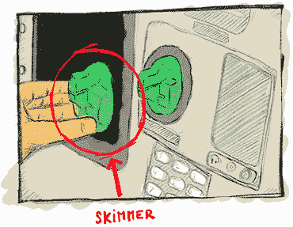
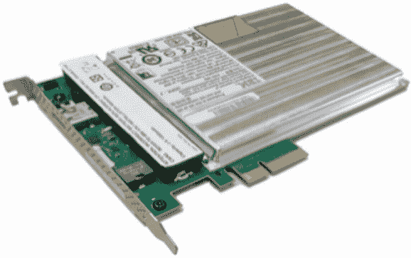
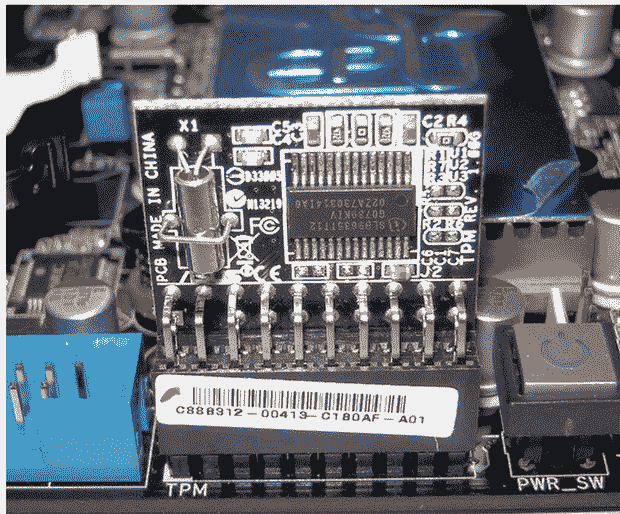

# 十三、硬件密码术

本章涵盖了

*   高度敌对环境中的密码学问题
*   增加攻击者成本的硬件解决方案
*   旁路攻击和软件缓解

密码原语和协议通常被描述为孤立的构建模块，就好像它们运行在远离任何对手的星系中。在实践中，这是一个不切实际的假设，而且经常被证明是错误的。在现实世界中，加密技术可以在各种环境中运行，并且会受到各种威胁。在这一章中，我们将看看更极端的场景——*高度敌对的环境*——以及在这些情况下你能做些什么来保护你的密钥和数据。(剧透提醒:涉及到使用专门的硬件。)

## 13.1 现代密码学攻击者模型

当今的计算机和网络安全始于这样一个假设，即存在一个我们可以信任的域。例如:如果我们加密数据在互联网上传输，我们通常假设进行加密的计算机没有受到威胁，并且有一些其他的“端点”可以安全地解密数据。

—Joanna Rutkowska(“英特尔 x86 被认为有害”，2015 年)

过去，密码学是关于“爱丽丝想在伊芙无法截获的情况下给鲍勃加密一条信息。”如今，很多内容都变成了类似于“爱丽丝想给鲍勃加密一条消息，但是爱丽丝已经暴露了。”这是一个完全不同的攻击者模型，这在理论密码学中是没有预料到的。我这么说是什么意思？让我给你举几个例子:

*   在自动柜员机(ATM)上使用您的信用卡，自动柜员机可能会增加*套币机*，这是一种小偷可以放在读卡器顶部的设备，以便复制您银行卡的内容(见图 13.1)

*   在手机上下载危害操作系统(OS)的应用程序

*   在共享网络托管服务中托管网络服务器，而另一个恶意客户可能与你共享同一台机器

*   在一个被来自不同国家的间谍访问的数据中心管理高度敏感的机密



图 13.1 skimmer，一种恶意设备，可以放置在 ATM 或支付终端读卡器前，以复制卡磁条中包含的数据。磁条通常包含账号、截止日期和其他元数据，您可以使用这些元数据在网上或许多支付终端中进行支付。Skimmers 有时还带有一个隐藏的摄像头来获取您的 PIN，这可能使小偷能够使用 ATM 取款和支付终端强制输入 PIN。

所有这些例子都是加密技术在威胁模型中的现代应用，而许多密码学家都忽略或完全没有意识到这一点。事实上，你在文献中读到的大多数密码原语都会假设，例如，Alice 可以完全控制她的执行环境，并且只有当密文(或签名或公钥)被加密时。。。)离开她的电脑通过网络，中间人(MITM)攻击者能够表演他们的把戏吗？但是，在现实生活和现代社会中，我们经常在更具对抗性的模型中使用加密技术。

警告 安全毕竟是你对潜在攻击者的假设和预期的产物。如果你的假设是错误的，那你就倒霉了。

现实世界的应用程序如何协调理论密码学和这些更强大的攻击者？他们做出*妥协*。换句话说，他们试图让攻击者的生活更加艰难。这类系统的安全性通常以*成本*(攻击者要花多少钱才能攻破系统？)而不是计算复杂度。

在这一章中，你将会学到很多不完善的 T2 加密技术，在现实世界中，我们称之为深度 T4。有很多东西需要学习，这一章有很多新的缩写和不同的解决方案，这些都是不同的供应商和他们的营销团队和销售人员想出来的。因此，让我们开始了解不可信环境中的可信系统。

## 13.2 不可信环境:硬件拯救

在实践中，攻击系统有不同的方式。对它们进行分类的一种方法是思考:

*   *软件攻击*—利用运行在您设备上的代码的攻击

*   *硬件攻击*—这种攻击要求对手在物理上靠近您的设备

虽然我在前面的章节中已经反复讨论了针对加密技术的软件攻击以及如何减轻它们，但是如果您利用硬件解决方案，有些软件攻击更容易防御。例如，通过在连接到计算机的独立设备上生成和使用密钥，攻击计算机的病毒将无法提取密钥。

然而，硬件攻击更加棘手，因为获得设备访问权限的攻击者几乎可以做任何他们想做的事情:磁盘上的数据可以被任意修改，激光可以射向目标位置以迫使计算产生错误的值(所谓的*故障攻击*)，芯片可以被打开以显示其部件，聚焦离子束(FIB)显微镜可以用于逆向工程组件，等等。天空是无限的，很难防范这种动机的攻击者。通常，不同的解决方案都可以归结为尽可能增加多层防御，以使攻击者的日子更加难过。这一切都是为了提高成本！

邪恶的女仆袭击

不是所有的硬件攻击者都是一样的。例如，一些攻击者能够在您的设备上花费一些宝贵的时间，而其他人可能只有有限的时间。想象以下场景:您将手机或笔记本电脑留在酒店房间无人看管，一个“恶意”女佣进来，打开设备，使用一个低预算的现成工具修改系统，然后在您回到房间之前将设备留在原来的地方。在文献中，这被称为*邪恶女仆攻击*，可以概括为许多情况(例如，在飞行时在托运行李中携带设备，在不安全的数据中心存储敏感密钥，等等)。

当然，并不是所有的系统都需要防御最强大的硬件攻击，也不是所有的应用程序都需要应对相同级别的威胁。不同的硬件解决方案适用于不同的环境，因此本节的其余部分是关于理解“这样和那样”之间的区别

### 13.2.1 白盒加密，一个坏主意

在进入不可信环境的硬件解决方案之前，为什么不使用软件解决方案？密码学可以提供不泄露自己密钥的原语吗？

*白盒加密*正是这样:一个加密领域，试图用它使用的密钥扰乱加密实现。目标是防止从观察者那里提取密钥。攻击者用固定的密钥获得了某个白盒 AES 实现的源代码，它可以很好地加密和解密，但是密钥与实现混合得很好，任何人都很难从算法中提取它。至少理论上是这样。实际上，还没有发现任何公开的白盒加密算法是安全的，因此大多数商业解决方案都是闭源的。

注意 *通过模糊和迷惑实现安全*(扰码使看起来难以理解)是通常不被认可的技术，因为它们还没有被证明是有效的。也就是说，在现实世界中，这些技术有时有它们的位置，可以用来拖延和挫败对手。

总而言之，白盒加密是一个大行业，它向需要*数字版权管理* (DRM)解决方案(控制客户对所购产品的访问权限的工具)的企业销售可疑产品。例如，您可以在播放您在商店购买的电影的硬件中，或者在播放您在流媒体服务上观看的电影的软件中找到这些白盒解决方案。实际上，DRM 并不能很好地防止这些攻击；这只会让他们客户的生活更加艰难。更严重的是，有一个密码学分支叫做*不可区分性混淆* (iO ),它试图用密码学的方法做到这一点。信息作战是一个理论性的，不切实际的，而且到目前为止，还没有真正被证实的研究领域。我们要看看那件事会怎么样，但我不会屏住呼吸。

### 13.2.2 它们在你的钱包里:智能卡和安全元件

白盒加密技术并不伟大，但它几乎是抵御强大对手的最佳软件解决方案。因此，让我们转向硬件方面寻求解决方案。(剧透:事情将变得更加复杂和令人困惑。)如果你认为现实世界的密码术是混乱的，并且有太多的标准或方法来做同样的事情，那么等到你阅读了硬件世界正在发生的事情。不同的术语以不同的方式被创造和使用，不幸的是，标准和加密标准一样多(如果不是更多的话)。

为了了解所有这些硬件解决方案是什么以及它们之间有何不同，让我们从一些必要的历史开始。*智能卡*是封装在塑料卡(如银行卡)中的小芯片，发明于 20 世纪 70 年代早期，伴随着微电子技术的进步。智能卡最初是作为给每个人一台袖珍计算机的实用方法出现的！事实上，现代智能卡嵌入了自己的 CPU、不同类型的可编程或不可编程存储器(ROM、RAM 和 EEPROM)、输入和输出、硬件随机数发生器(也称为 TRNG，如您在第 8 章中所学)等等。

它们之所以“聪明”,是因为它们可以运行程序，不像不那么聪明的卡只能通过磁条存储数据，而磁条可以很容易地通过我之前提到的 skimmers 复制。大多数智能卡允许开发者编写可以在智能卡上运行的小型应用程序。智能卡支持的最流行的标准是 *JavaCard* ，它允许开发者编写类似 Java 的应用程序。

要使用智能卡，首先需要将其插入读卡器进行激活。最近，卡已经增加了近场通信(NFC)协议，以通过无线电频率实现相同的结果。这允许你靠近读卡器来使用卡，而不是直接触摸它。

银行和传统加密技术

顺便说一下，银行利用智能卡来存储每张卡的独特机密，它能够说，“我确实是你给这位顾客的卡。”直觉上，您可能认为这是通过公钥加密实现的，但银行业仍然停留在过去，使用对称加密(由于大量遗留软件和硬件仍在使用)！

更具体地说，大多数银行卡都存储了一个 T2 的三重 DES 对称密钥，这是一种老式的 64 位分组密码，旨在使 T4 的不安全数据加密标准(DES)变得安全。该算法不是用于加密，而是用于通过某种挑战产生 MAC(消息认证码)。持有每个客户当前 3DES 对称密钥的银行可以验证 MAC。这是真实世界密码学的一个很好的例子:到处都在以危险的方式使用传统算法。(这也是为什么密钥轮换是一个如此重要的概念，为什么你必须定期更换银行卡。)

智能卡混合了许多物理和逻辑技术，以防止对其执行环境和部分内存(存储机密的地方)的观察、提取和修改。通常存在许多试图破坏这些卡和硬件设备的攻击。这些攻击可以分为三个不同的类别:

*   *非侵入式攻击*—不影响目标设备的攻击。例如，差分功耗分析(DPA)攻击评估智能卡的功耗，同时执行加密操作以提取其密钥。

*   *半侵入式攻击*—利用对芯片表面的非破坏性访问来利用漏洞的攻击。例如，差分故障分析(DFA)攻击使利用热量、激光和其他技术来修改智能卡上运行的程序的执行，以便泄漏密钥。

*   *侵入式攻击*—打开芯片探测或修改硅片本身的电路，以改变芯片的功能并泄露其机密的攻击。这些攻击是显而易见的，因为它们会损坏设备，并有更大的机会使设备无法使用。

硬件芯片非常小且封装紧密，这使得攻击变得非常困难。但是专用硬件通常更进一步，使用不同的材料层来防止拆包和物理观察，并使用硬件技术来增加已知攻击的不准确性。

智能卡很快变得非常流行，很明显，在其他设备中安装这样一个安全的黑匣子会非常有用。一个*安全元素*的概念诞生了:一个防篡改的微控制器，可以以可插拔的形式出现(例如，你的手机中的 SIM 卡需要访问你的运营商的网络)，或者直接绑定在芯片和主板上(例如，连接到 iPhone 的 NFC 芯片上的嵌入式安全元素用于支付)。安全元件实际上只是一个小而独立的硬件，用于保护您的机密及其在加密操作中的使用。

安全元素是保护*物联网*(物联网)中的加密操作的一个重要概念，物联网是一个口语化的(也是超负荷的)术语，指的是可以与其他设备通信的设备(想想信用卡、电话、生物特征护照、车库钥匙、智能家居传感器等等)。您可以看到，本节中的所有解决方案都是以不同的形式实现的安全元素，使用不同的技术来实现几乎相同的功能，但提供了不同级别的安全性和速度。

围绕安全元素的主要定义和标准由全球平台制定，这是一个非盈利性协会，旨在满足业内不同参与者的需求，促进不同供应商和系统之间的互操作性。存在更多的标准和认证，这些标准和认证集中于来自诸如通用标准(CC)、NIST 或 EMV(针对 Europay、Mastercard 和 Visa)的标准机构的安全元素的安全声明。

由于安全元素是高度保密的秘籍，将它们集成到您的产品中意味着您将不得不签署保密协议并使用闭源硬件和固件。对于许多项目来说，这被视为透明度的严重限制，但可以理解，因为这些芯片的安全性部分来自于它们设计的模糊性。

### 13.2.3 银行喜欢它们:硬件安全模块(HSM)

如果你明白什么是安全元件，那么*硬件安全模块* (HSM)基本上是一个更大更快的安全元件，像一些安全元件一样，一些 HSM 也可以运行任意代码。然而，这并不总是正确的。一些 HSM 很小(如 YubiHSM，一种类似于 YubiKey 的微型 USB 加密狗)，术语*硬件安全模块*可以用于表示不同人的不同事情。

许多人会认为，到目前为止讨论的所有硬件解决方案都是不同形式的 HSM，安全元素只是由 GlobalPlatform 指定的 HSM，而 TPM(可信平台模块)是由可信计算组织指定的 HSM。但大多数时候，当人们谈论 HSM 时，他们指的是大东西。

HSM 通常根据 FIPS 140-2“加密模块的安全要求”进行分类这份文件很老了，是 2001 年出版的，自然没有考虑到出版后发现的一些攻击。幸运的是，在 2019 年，它被更现代的版本 FIPS 140-3 取代。FIPS 140-3 现在依赖于两个国际标准:

*   *ISO/IEC 19790:2012——为硬件安全模块定义了四个安全级别。1 级 HSM 不提供任何针对物理攻击的保护(您可以将这些视为纯软件实现)，而 3 级 HSM 在检测到任何入侵时会擦除其机密！*

**   *【ISO 24759:2017】—定义必须如何测试 HSM，以标准化 HSM 产品的认证。** 

 **不幸的是，这两个标准都不是免费的。如果你想看的话，你得付钱。

美国、加拿大和其他一些国家强制银行等特定行业使用根据 FIPS 140 标准认证的设备。世界各地的许多公司也遵循这些相同的建议。

注 抹秘籍是一种叫做*归零*的做法。与 3 级 HSM 不同，4 级 HSM 可以多次覆盖机密数据，即使在断电的情况下，这要归功于备用内部电池。

通常，您会发现 HSM 是一种外部设备，它在机架上有自己的托架(见图 13.2)，插在数据中心的企业服务器上，或者是插在服务器主板上的 PCIe 卡，甚至是类似硬件安全令牌的小型加密狗。它们可以通过 USB 设备插入到您的硬件中(如果您不介意较低的性能)。总而言之，这些 HSM 中的一些可以使用智能卡来管理，以安装应用程序、备份密钥等等。



图 13.2 一个 IBM 4767 HSM 作为 PCI 卡。图片来自维基百科(【http://mng.bz/XrAG】T2)。

一些行业高度利用 HSM。例如，每次你在自动取款机上输入个人密码，这个密码都会被某个地方的 HSM 验证。每当您通过 HTTPS 连接到一个网站时，信任的根来自一个证书颁发机构(CA ),该机构将其私钥存储在一个 HSM 中，并且 TLS 连接可能被一个 HSM 终止。你有安卓或者 iPhone 吗？谷歌或苹果有可能会用大量的短信为你的手机安全备份。最后一种情况很有趣，因为威胁模型是相反的:用户不信任云的数据，因此，云服务提供商声称其服务无法看到用户的加密备份，也无法访问用于加密备份的密钥。

HSM 并没有真正的标准接口，但它们中的大多数至少会实现*公钥加密标准 11* (PKCS#11)，这是由 RSA 公司开始的旧标准之一，并在 2012 年逐步转移到 OASIS 组织，以促进标准的采用。虽然 PKCS#11 的最新版本(v2.40)是在 2015 年发布的，但它仅仅是 1994 年开始的标准的更新。出于这个原因，它指定了许多旧的加密算法，或者旧的做事方式，这些都可能导致漏洞。尽管如此，它对于许多用途来说已经足够好了，并且指定了一个接口，允许不同的系统容易地相互操作。好消息是，PKCS#11 v3.0 于 2020 年发布，包括许多现代密码算法，如 Curve25519、EdDSA 和 SHAKE 等。

虽然 HSM 的真正目标是确保任何人都无法从中提取关键资料，但它们的安全性并不总是令人满意。这些硬件解决方案的安全性很大程度上依赖于其高昂的价格、未公开的硬件防御技术，以及主要关注硬件方面的认证(如 FIPS 和通用标准)。在实践中，会发现毁灭性的软件错误，如果您使用的 HSM 存在这些漏洞的风险，这并不总是一目了然的。2018 年，让·巴普蒂斯特·贝都因人和加布里埃尔·坎帕纳在他们的研究(“大家都冷静点，这是抢劫”)中展示了一种从流行的 HSM 中提取密钥的软件攻击。

可以加起来！

此外，我还没有触及所有这些解决方案中的“房间里的大象”:虽然您可以防止大多数攻击者获得您的密钥，但您无法防止攻击者破坏系统并自己呼叫 HSM(除非 HSM 的逻辑要求几个签名或存在一定数量的智能卡才能运行)。但是，在大多数情况下，HSM 提供的唯一服务是防止攻击者机密窃取机密并在其他时间使用。当集成 HSMs 等硬件解决方案时，最好先了解您的威胁模型、您希望阻止的攻击类型，以及我在第 8 章中提到的多重签名等阈值方案是否是更好的解决方案。

### 13.2.4 可信平台模块(TPMs):安全元素的有用标准化

虽然安全元素和 HSM 被证明是有用的，但它们仅限于特定的用例，而且编写定制应用程序的过程也是众所周知的繁琐。出于这个原因，*可信计算组织* (TCG)(另一个由行业参与者组成的非营利组织)提出了一个现成的替代方案，目标是个人和企业计算机。这被称为可信平台模块*(TPM)。*

 *TPM 不是芯片，而是标准(TPM 2.0 标准)；任何选择这样做的供应商都可以实现它。符合 TPM 2.0 标准的 TPM 是一种安全的微控制器，它带有硬件随机数生成器、用于存储机密的安全存储器，可以执行加密操作，并且整体是防篡改的。这种描述可能听起来很熟悉，事实上，TPM 被实现为安全元素的重新打包是很常见的。您通常会发现 TPM 直接焊接或插入到企业服务器、笔记本电脑和台式计算机的主板中(参见图 13.3)。



图 13.3 插入主板的实现 TPM 2.0 标准的芯片。这个芯片可以被系统的主板组件以及运行在计算机操作系统上的用户应用程序调用。图片来自维基百科(【http://mng.bz/Q2je】T2)。

与智能卡和安全元件不同，TPM 不会运行任意代码。相反，它提供了一个更好的系统可以利用的定义良好的接口。TPMs 通常非常便宜，今天许多商用笔记本电脑都有一个。

坏消息:TPM 和处理器之间的通信信道通常只是一个总线接口，如果你设法窃取或获得对设备的临时物理访问，它很容易被拦截。虽然许多 TPM 提供了对物理攻击的高水平抵抗，但是它们的通信信道稍微开放的事实确实减少了它们主要防御软件攻击的用例。

为了解决这些问题，人们已经转向将类似 TPM 的芯片直接集成到主处理器中。例如，苹果有 Secure Enclave，微软有 Pluton。不幸的是，这些安全处理器似乎都没有遵循一个标准，这意味着用户应用程序很难甚至不可能利用它们的功能。让我们看一些例子来了解像 TPMs 这样的硬件安全芯片可以做什么。

TPMs 最简单的使用案例是保护数据。要保护密钥，很简单:只需在安全芯片中生成密钥并禁止提取。如果你需要密钥，让芯片执行加密操作。要保护数据，请加密数据。这个概念是称为*基于文件的加密* (FBE)如果你正在加密单个文件和*全磁盘加密* (FDE)如果它是整个磁盘。FDE 听起来要好得多，因为它是一种要么全有要么全无的方法。大多数笔记本电脑和台式机都是这么用的。实际上，FDE 并没有那么伟大:它没有考虑到我们人类如何使用我们的设备。我们经常将设备锁定，而不是关闭，以便后台功能可以继续运行。计算机通过保存数据加密密钥(DEK)来处理这个问题，即使你的计算机被锁住了。(下次你去星巴克的洗手间，忘了带锁的电脑，想想这个吧。)现代手机提供了更多的安全性，根据你的手机是锁定还是关机来加密不同类型的文件。

注 在实践中，FDE 和 FBE 都有很多执行问题。2019 年，Meijer 和 Gastel(在《自加密欺骗:固态硬盘(SSD)加密中的弱点》中)表明，几家 SSD 供应商都有完全不安全的解决方案。2021 年，Zinkus 等人(在“移动设备上的数据安全:当前的技术水平、公开的问题和建议的解决方案”)发现，手机磁盘加密也有许多问题。

当然，在解密数据之前，应该对用户进行身份验证。这通常通过要求用户输入 PIN 或密码来实现。然而，PIN 或密码是不够的，因为它会允许简单的暴力攻击(特别是在 4 或 6 位 PIN 上)。一般来说，解决方案试图将 DEK 绑定到用户凭证和 enclave 上保存的对称密钥。

但是芯片制造商不可能在他们生产的每一个设备中硬编码相同的密钥；这导致了像 DUHK 攻击(【https://duhkattack.com】)这样的攻击，在这种攻击中，数以千计的设备被发现硬编码了相同的机密。这反过来意味着一个设备的妥协导致所有设备的妥协！解决方案是每个设备一个密钥，它要么在制造时被融合到芯片中，要么由芯片本身通过被称为物理不可克隆功能的硬件组件创建。例如，每个 Apple Secure Enclave 都有一个 UID，每个 TPM 都有一个唯一的认可密钥和证明密钥，等等。为了防止暴力攻击，苹果的 Secure Enclave 将 UID 密钥和用户 PIN 与基于密码的密钥导出函数(我们在第 2 章中讨论过)混合在一起，以导出 DEK。除了我撒了个谎:为了允许用户快速更改他们的 PIN，DEK 不是直接导出的，而是通过密钥加密密钥(KEK)加密的。

再比如*安全引导*。当启动你的电脑时，会有不同的阶段运行，直到你最终到达你想要的屏幕。用户面临的一个问题是病毒和恶意软件，如果它们感染了启动过程，你就会在一个邪恶的操作系统上运行。

为了保护 boot 的完整性，TPMs 和集成的安全芯片提供了信任的基础，这是我们 100%信任的东西，并允许我们信任其他东西。这种信任的根源通常是一些不能被覆盖的只读存储器(ROM)(也称为*一次性可编程存储器*，因为它是在制造过程中写入的，不能被更改)。例如，当给一个最新的苹果设备加电时，执行的第一个代码是位于苹果的安全飞地 ROM 中的引导 ROM。那个引导 ROM 很小，所以通常它唯一能做的就是:

1.  准备一些受保护的内存，并加载下一个要在那里运行的程序(通常是一些其他的引导加载程序)

2.  对程序进行哈希运算，并根据 ROM 中的硬编码公钥验证其签名

3.  执行程序

下一个引导加载程序做同样的事情，以此类推，直到最后一个引导加载程序启动操作系统。顺便说一下，这就是为什么没有苹果签名的操作系统更新不能安装在你的手机上。

胎压监测系统和类似胎压监测系统的集成芯片是一项有趣的发展，近年来它们极大地提高了我们设备的安全性。随着它们变得越来越便宜，一个成功的标准出现，更多的设备将能够从中受益。

### 13.2.5 可信执行环境下的保密计算(TEE)

智能卡、安全元件、HSM、TPM 是独立的芯片或模块；它们携带自己的 CPU、内存、TRNG 等，其他组件可以通过一些电线或支持 NFC 的芯片中的无线电频率与它们交谈。类似 TPM 的芯片(微软的 Pluton 和苹果的 Secure Enclave)也是独立的芯片，尽管与片上系统(SoC)内的主处理器紧密耦合。在本节中，我将讨论您可以在安全硬件分类中采取的下一个逻辑步骤，即主处理器本身内的*集成安全*，硬件强制安全。

集成了安全性的处理器据说可以通过扩展处理器的指令集来为用户代码创建一个*可信执行环境* (TEE)，从而允许程序在一个独立的安全环境中运行。这个安全环境与我们已经习惯处理的环境(通常称为*富执行环境*)之间的分离是通过硬件实现的。最终发生的情况是，现代 CPU 同时运行普通操作系统和安全操作系统。两者都有自己的一组寄存器，但共享 CPU 架构的大部分其余部分。通过使用 CPU 强制逻辑，来自安全世界的数据不能从正常世界访问。例如，CPU 通常会将其内存拆分，其中一部分供 TEE 专用。因为 TEE 直接在主处理器上实现，这不仅意味着 TEE 是比 TPM 或安全元件更快更便宜的产品，而且在许多现代 CPU 中也是免费的。

与所有其他硬件解决方案一样，TEE 是由不同供应商独立开发的概念，也是(全球平台)试图追赶的标准。最著名的 tee 是英特尔的软件保护扩展(SGX)和 ARM 的 TrustZone。

发球台有什么用？让我们看一个例子。在过去的几年里，出现了一种新的模式——云，由大公司运行服务器来托管您的数据。亚马逊有 AWS，谷歌有 GCP，微软有 Azure。另一种说法是，人们正在从自己运行东西转向在别人的电脑上运行东西。这在一些隐私很重要的场景中产生了一些问题。为了解决这个问题， *confidential computing* 试图提供运行客户端代码的解决方案，而无法查看或修改其行为。如今，SGX 的主要用例似乎正是如此:客户机运行服务器看不到或篡改的代码。

一个有趣的问题出现了，例如，我们如何相信来自请求的响应来自 SGX，而不是来自某个模仿者。这就是*认证*试图解决的问题。有两种证明:

*   *本地证明*—运行在同一平台上的两个飞地需要相互通信并证明自己是安全飞地。

*   *远程证明*—客户端查询一个远程飞地，并需要确保它是产生请求结果的合法飞地。

每个 SGX 芯片在制造时都有唯一的密钥对*根密封密钥*。然后，公钥部分由某个 Intel CA 签名。第一个假设是，如果我们忽略硬件是安全的假设，英特尔只为安全的 SGX 芯片正确地签署公钥。考虑到这一点，您现在可以从英特尔的 CA 获得一份签名证明，证明您正在与一个真实的 SGX 飞地对话，并且它正在运行一些特定的代码。

TEE 的目标首先是挫败*软件攻击*。虽然所声称的软件安全性看起来很有吸引力，但实际上，由于现代 CPU 及其动态状态的极端复杂性，很难在同一芯片上分离执行。针对 SGX 和 TrustZone 的众多软件攻击([https://forbesodeaction . eu](https://foreshadowattack.eu)，[https://mdsattacks.com](https://mdsattacks.com)，[https://plundervolt.com](https://plundervolt.com)，[https://sgaxe.com](https://sgaxe.com))就证明了这一点。

作为一个概念，TEE 对物理攻击有一定的抵抗力，因为在这种微观水平上的东西太小了，而且紧密地包装在一起，如果没有昂贵的设备就无法分析。面对有动机的攻击者，事情可能会有所不同。

## 13.3 什么解决方案对我有好处？

本章你已经了解了很多硬件产品。概括一下，下面是我在图 13.4 中展示的列表:

*   *智能卡是需要像支付终端这样的外部设备开启的微型计算机。*他们可以运行小型定制的类似 Java 的应用程序。银行卡是广泛使用的智能卡的一个例子。

*   *安全元素是智能卡的一种概括，它依赖于一套全球平台标准。* SIM 卡就是安全元素的一个例子。

*   *HSM(硬件安全模块)可以看作是企业服务器更大的可插拔安全元素。*它们更快更灵活，主要出现在数据中心存储密钥，使得对密钥的攻击更加明显。

*   *TPM(可信平台模块)是插入个人和企业计算机主板的重新打包的安全元件。*他们遵循可信计算组织的标准化 API，可以为操作系统和最终用户提供功能。

*   *安全处理器是类似 TPM 的芯片，构建在离主处理器非常近的地方，不可编程。*他们没有标准，不同的玩家开发出不同的技术。

*   像 TrustZone 和 SGX 这样的可信执行环境可以被认为是在 CPU 指令集内实现的可编程安全元素。它们更快更便宜，主要是抵御软件攻击。大多数现代 CPU 都配有 tee 和各种级别的硬件攻击防御措施。


图 13.4 您在本章中学到的不同硬件解决方案以及它们的大致外观。

对你来说最好的解决方案是什么？试着问自己一些问题来缩小你的选择范围:

*   *以什么形式出现？*例如，对小型设备中安全元素的需求决定了你不能使用什么解决方案。

*   *需要多大速度？*每秒需要执行大量加密操作的应用将在它们可以使用的解决方案方面受到高度限制，可能仅限于 HSM 和 tee。

*   *你需要多大的安全感？*供应商的认证和声明对应于不同级别的软件或硬件安全。天空是无限的。

谨记，没有任何硬件解决方案是万能的；你只会增加攻击的成本。对于一个老练的攻击者来说，所有这些都是无用的。设计您的系统，使一个受损设备并不意味着所有设备都受损。

## 13.4 抗泄漏加密或如何减轻软件中的旁道攻击

我们看到了硬件是如何试图阻止对密钥的直接观察和提取的，但硬件能做的也就这么多了。一天结束时，尽管所有这些硬件加固，软件也可能不关心并给出密钥。该软件可以直接这样做(像一个后门)，也可以通过泄漏足够的信息让某人重建密钥来间接这样做。后一种选择被称为*旁路*，旁路漏洞在大多数时候是无意的错误(至少人们希望如此)。

我在第 3 章提到了定时攻击，你在那里了解到 MAC 认证标签必须在恒定时间内进行比较；否则，攻击者可以在向您发送许多不正确的标签并测量他们等待您响应的时间后推断出正确的标签。定时攻击通常在现实世界密码学的所有领域都受到重视，因为它们有可能通过网络远程执行，这与物理侧信道不同。

最重要也是已知的旁道是*功耗*，我在本章前面提到过。1998 年，Kocher、Jaffe 和 Jun 发现这是一种被称为*差分功耗分析* (DPA)的攻击，当时他们意识到他们可以将一个示波器连接到一个设备，并在对已知明文进行加密的同时观察设备消耗的电力随时间的变化。这种差异显然取决于所用密钥的位数，以及像 XORing 这样的操作会消耗或多或少的功率，这取决于操作数位是否置位。这一观察将引向*密钥提取攻击*(所谓的*总破解*)。

这个概念可以用*简单功耗分析* (SPA)攻击来说明。在理想情况下，当没有针对功率分析攻击实施硬件或软件缓解时，测量和分析涉及机密密钥的单个密码操作的功耗就足够了。我在图 13.5 中对此进行了说明。


图 13.5 一些加密算法通过其功耗泄漏了如此多的信息，以至于对单个功率轨迹的简单功率分析(测量时间内消耗的功率)可能会泄漏算法的私钥。例如，该图表示 RSA 取幂的轨迹(消息被取幂到私有指数；参见第 6 章)。RSA 取幂是用平方乘算法实现的，该算法遍历私有指数的位；对于每个位，仅当该位被置位时，它应用平方运算，然后是乘法运算。在这个例子中，乘法显然消耗更多的功率；因此，电源轨迹清晰。

权力并不是唯一的实体渠道。一些攻击依靠电磁辐射、振动，甚至硬件发出的声音。让我仍然提及另外两个非物质的侧通道。我知道我们正处于以硬件为中心的阶段，但这些非物理的旁道攻击非常重要，因为它们需要在许多现实世界的加密应用中得到缓解。

首先，返回的错误有时会泄露关键信息。例如，在 2018 年，机器人攻击找到了一种方法，在许多实现了 TLS 协议(在第 9 章中介绍)中的 RSA PKCS#1 v1.5 解密的服务器上利用 Bleichenbacher 攻击(在第 6 章中提到)。Bleichenbacher 的攻击只有在您能够区分 RSA 密文是否有有效填充的情况下才有效。为了防止这种攻击，安全实现在恒定时间内执行填充验证，并避免在检测到填充无效时提前返回。例如，在 TLS 中的 RSA 密钥交换中，如果 RSA 有效负载的填充不正确，服务器必须伪造其响应，就好像它完成了成功的握手一样。然而，如果在填充验证结束时，实现决定向客户端返回不同的错误(基于填充的有效性)，那么这一切都是徒劳的。

其次，访问内存可能需要更多或更少的时间，这取决于数据之前是否被访问过。这是由于计算机中存在大量的缓存层。例如，如果 CPU 需要某样东西，它首先检查它是否已经缓存在内存中。如果没有，它就会到达离它越来越远的缓存。离缓存越远，花费的时间就越多。不仅如此，有些缓存是特定于一个内核的(例如，L1 缓存)，而有些缓存是在多核机器中的内核之间共享的(L3 缓存、RAM、磁盘)。

*缓存攻击*利用了这样一个事实，即恶意程序有可能使用与敏感加密程序相同的加密库在同一台机器上运行。例如，许多云服务在同一台机器上托管不同的虚拟服务器，许多服务器使用 OpenSSL 库进行加密操作或提供 TLS 页面。恶意程序会想方设法清除加载到与受害者进程共享的缓存中的部分库，然后定期测量重新读取该库的某些部分所需的时间。如果需要很长时间，那么受害者并没有执行这部分程序；如果不需要很长时间，那么受害者访问程序的这一部分，并重新填充缓存，以避免再次将程序提取到远处的缓存中，或者更糟的是从磁盘中提取。您所获得的是一个类似于 power trace 的跟踪，它确实可以以类似的方式被利用！

好了，边道攻击到此为止。如果你对通过这些旁门左道攻击密码学感兴趣，有比这本书更好的资源。在这一节中，我只想讨论加密实现可以并且应该实现的软件缓解措施，以防止一般的旁路攻击。这整个研究领域被称为*抗泄漏密码术*，因为密码学家的目标是不泄漏任何东西。

防御物理攻击者是一场无休止的战斗，这解释了为什么许多这些缓解措施是专有的，类似于混淆。这一节显然不是详尽的，但是应该让您了解应用密码学家正在处理的旁路攻击的类型。

### 13.4.1 恒定时间编程

任何密码实现的第一道防线都是在常数时间内实现其密码敏感部分(想想任何涉及机密的计算)。很明显，在恒定时间内实现某些东西会消除计时攻击，但这也消除了许多类攻击，如缓存攻击和简单的功耗分析攻击。

如何在恒定时间内实现某件事？永不*分支*。换句话说，不管输入是什么，总是做同样的事情。例如，清单 13.1 展示了 Golang 语言如何为 HMAC 算法实现认证标签的常量时间比较。直观上，如果两个字节相等，那么它们的异或将是 0。如果我们比较的每一对字节都验证了这个属性，那么对它们进行“或”运算也会得到一个 0 值(否则会得到一个非零值)。请注意，如果这是您第一次查看常量时间技巧，那么阅读这段代码可能会非常令人不安。

清单 13.1 Golang 如何实现两个字节数组之间的常数时间比较

```
func ConstantTimeCompare(x, y []byte) byte {
    if len(x) != len(y) {                        ❶
        return 0                                 ❶
    }                                            ❶

    var v byte                                   ❷
    for i := 0; i < len(x); i++ {                ❷
        v |= x[i] ^ y[i]                         ❷
    }                                            ❷

    return v                                     ❸
}
```

❶ 如果两个字符串长度不同，那么在常数时间内比较它们是没有意义的。

❷ 这里就是神奇发生的地方。循环 OR 将每个字节的 XOR 累加到值 v 中。

❸ 仅当 v 等于 0 时返回 0，否则返回非零值

对于一个 MAC 认证标签比较，在这里停下来通过分支(使用一个条件表达式比如`if`)检查结果是否为 0 就足够了。另一个有趣的例子是椭圆曲线加密中的*标量乘法*，正如你在第五章中所学的，它包括给自身增加一个点 *x* 次，其中 *x* 就是我们所说的标量。这个过程可能会有些慢，因此存在一些聪明的算法来加速这一部分。其中一个流行的算法叫做 Montgomery's ladder，相当于我前面提到的 RSA 的平方乘算法(但是在不同的组中)。

*蒙哥马利阶梯算法*在两个点的相加和一个点的加倍(将点加到自身)之间交替。RSA 的平方乘算法和 Montgomery ladder 算法都有一个简单的方法来减轻计时攻击:它们不转移，总是执行这两种运算。(而这也是为什么常数时间内的 RSA 取幂算法通常被称为*平方乘总*。)

注意 在第 7 章中，我提到过签名方案可能以多种方式出错，密钥恢复攻击存在于泄漏他们使用的随机数的几个字节的实现中(在像 ECDSA 这样的签名方案中)。这就是大约同时发生的 Minerva 和 TPM-Fail 攻击中发生的情况。这两种攻击都发现，由于签名操作需要大量的时间变化，许多设备容易受到攻击。

在实践中，减轻计时攻击并不总是直截了当的，因为并不总是清楚用于乘法或条件移动的 CPU 指令是否在恒定时间内。此外，当使用不同的编译标志时，编译器如何编译高级代码并不总是很清楚。出于这个原因，有时会对生成的汇编进行手工检查，以便对编写的常数时间代码更有信心。存在不同的工具来分析常数时间代码(比如 ducdect、ct-verif、SideTrail 等等)，但是它们很少在实践中使用。

### 13.4.2 不要使用机密！掩蔽和致盲

另一种阻止或至少迷惑攻击者的常见方法是在任何涉及机密的操作中添加间接层。其中一种技术被称为 *blinding* ，这通常是可能的，这要归功于公钥密码算法的算术结构。你在第 11 章中看到了盲法在不经意算法中的应用，比如密码认证的密钥交换算法，我们可以用同样的方式使用盲法，让不经意的一方成为攻击者，观察我们计算中的漏洞。下面以 RSA 为例说一下。

记住，RSA 通过获取密文 *c* 并将其提升到私有指数 *d* 来解密，其中私有指数 *d* 取消了用于计算密文的公共指数 *e* 为*m*T11】emodT15】N。如果你不记得细节，一定要查阅第六章。增加间接性的一种方法是对攻击者不知道的密文值执行解密操作。这种方法称为*基础盲法*，其过程如下:

1.  生成随机盲因子 *r*

2.  计算*讯息* = ( *塞浦路斯文字*×*r*<sup class="fm-superscript2">e</sup>)<sup class="fm-superscript2">d</sup>修改

3.  通过计算*real _ message*=*message*×*r*<sup class="fm-superscript1">–1</sup>mod*N*，其中*r*<sup class="fm-superscript1">–1</sup>是 *r* 的逆

这个方法隐藏了与机密一起使用的值，但是我们也可以隐藏机密本身。例如，椭圆曲线标量乘法通常与机密标量一起使用。但是，由于计算是在一个循环组中进行的，所以给这个机密增加一个倍数的阶数并不会改变计算结果。这种技术被称为*标量致盲*，过程如下:

1.  生成一个随机值*k*T3】1

2.  计算一个标量*k*T3】2=*d*+*k*T9】1×*阶*，其中 *d* 为原始机密标量，*阶*为其阶

3.  计算 *Q* = *P* ，改为计算*Q*=[*k*<sub class="fm-subscript">2</sub>*P*，结果相同

所有这些技术都被证明或多或少是有效的，并且经常与其他软件和硬件缓解措施结合使用。在对称加密中，使用了另一种有点类似的技术，称为*屏蔽*。

屏蔽的概念是在将输入传递给算法之前转换输入(在密码的情况下是明文或密文)。例如通过将输入与随机值进行异或运算。然后，为了获得最终的正确输出，输出被解除屏蔽。由于任何中间状态都被屏蔽，这为加密计算提供了一定量的与输入数据的去相关，并使旁道攻击更加困难。该算法必须知道这种屏蔽，以正确执行内部操作，同时保持原始算法的正确行为。

### 13.4.3 故障攻击怎么办？

我之前讲过*故障攻击*，一种更具侵入性的旁路攻击类型，通过诱导故障来修改算法的执行。注入故障可以用许多创造性的方法来完成，例如，通过增加系统的热量，或者甚至通过向目标芯片中计算好的点发射激光。

令人惊讶的是，故障也可以通过软件诱发。在 Plundervolt 和 V0LTpwn 攻击中独立发现了一个例子，它们设法改变 CPU 的电压以引入自然故障。这也发生在臭名昭著的 rowhammer 攻击中，该攻击发现重复访问某些 DRAM 设备的内存可能会翻转附近的位。这些类型的攻击很难实现，但是非常强大。在密码学中，计算错误的结果有时会泄露密钥。例如，通过一些特定优化实现的 RSA 签名就是这种情况。

虽然完全缓解这些攻击是不可能的，但一些技术可能会增加成功攻击的复杂性；例如，通过多次计算相同的操作并比较结果以确保它们在释放之前匹配，或者通过在释放之前验证结果。对于签名，可以在返回签名之前通过公钥验证签名。

故障攻击也会对随机数发生器产生巨大的影响。一个简单的解决方案是使用每次运行时不使用新的随机性的算法。例如，在第 7 章中，你学习了 EdDSA，一种签名算法，与 ECDSA 签名算法相反，它不需要新的随机性来签名。

总而言之，这些技术都不是万无一失的。在高度敌对的环境中进行加密总是要考虑你能为攻击者承担多少额外的成本。T5】

## 总结

*   今天的威胁不仅仅是攻击者截取网络上的消息，而是攻击者窃取或篡改运行您的加密系统的设备。所谓的物联网(IoT)中的设备经常遇到威胁，并且在默认情况下，无法抵御老练的攻击者。最近，云服务也被认为是用户的威胁模型。

*   在高度敌对的环境中，硬件有助于保护加密应用及其机密。其中一个想法是提供一种带有防篡改芯片的设备来存储和执行加密操作。也就是说，如果设备落入攻击者手中，提取密钥或修改芯片的行为将很困难。

*   人们普遍认为，必须结合不同的软件和硬件技术来强化敌对环境中的加密技术。但是硬件保护的加密技术并不是万能的；它只是深度防御，有效地减缓和增加攻击的成本。拥有无限时间和金钱的对手总是会破坏您的硬件。

*   降低攻击的影响也有助于阻止攻击者。这必须通过良好的系统设计来实现(例如，确保一个设备的损坏并不意味着所有设备的损坏)。

*   虽然有许多硬件解决方案，但最受欢迎的如下:

    *   智能卡是第一批这样的安全微控制器之一，可以用作微型计算机来存储机密和执行加密操作。他们应该使用一些技术来阻止物理攻击者。智能卡的概念被概括为安全元素，这是一个在不同领域使用不同的术语，但归结为智能卡可以在已经有主处理器的更大系统中用作协处理器。
    *   硬件安全模块(HSM)通常被称为可插拔卡，其作用类似于安全元件。它们不遵循任何标准接口，但通常实现加密操作的 PKCS#11 标准。HSM 可以通过一些 NIST 标准(FIPS 140-3)进行不同安全级别的认证。
    *   可信平台模块(TPM)类似于安全元素，具有标准化为 TPM 2.0 的指定接口。TPM 通常插在笔记本电脑或服务器主板上。
    *   可信执行环境(TEE)是一种隔离安全执行环境和潜在不安全执行环境的方法。tee 通常被实现为 CPU 指令集的扩展。
*   硬件不足以在高度敌对的环境中保护加密操作，因为软件和硬件旁道攻击可以利用以不同方式(计时、功耗、电磁辐射等)发生的泄漏。为了防御旁道攻击，加密算法实现了软件缓解:

    *   严格的加密实现基于常数时间算法，并避免所有依赖于机密数据的分支和内存访问。
    *   基于隐蔽和屏蔽的缓解技术将敏感操作与已知要操作的机密或数据去相关。
    *   故障攻击更难防范。缓解措施包括多次计算一个操作，并在发布结果之前比较和验证操作的结果(例如，用公钥验证签名)。
*   在敌对环境中强化加密技术是一场永无止境的战斗。应该结合使用软件和硬件缓解措施来增加成功攻击的成本和时间，直至达到预期的可接受风险。人们还应该通过使用每个设备的唯一密钥以及潜在地每个加密操作的唯一密钥来降低攻击的影响。***