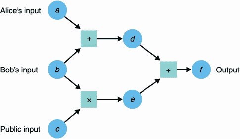
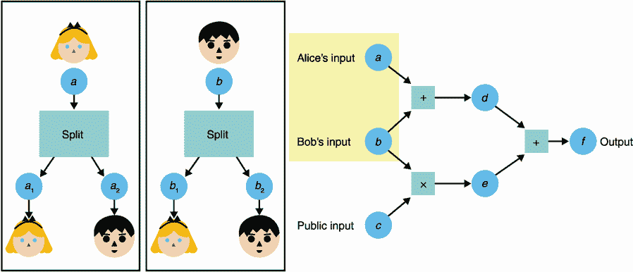
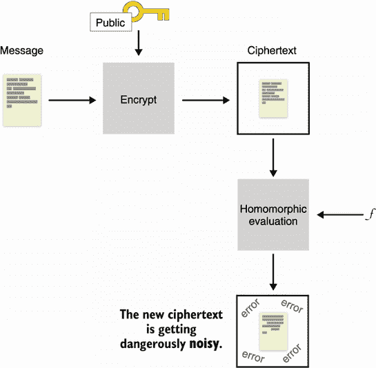
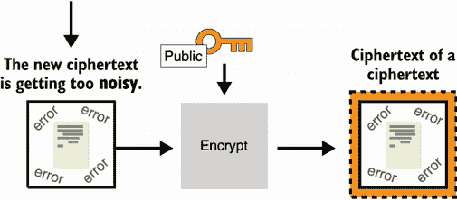
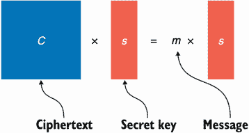
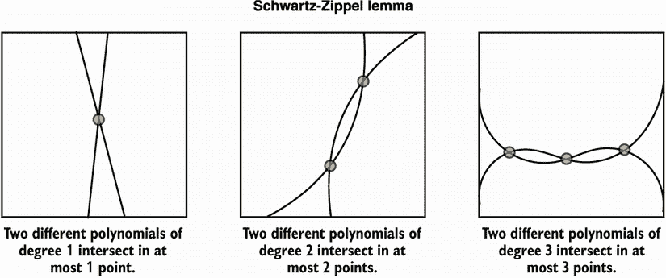

# 15 就是这个吗？下一代密码学

本章涵盖了

*   通过安全多方计算(MPC)摆脱可信第三方
*   允许他人通过全同态加密对加密数据进行操作(FHE)
*   通过零知识证明隐藏程序执行的一部分

我写这本书的想法是，阅读完大部分章节的读者也会对现实世界密码学的未来感兴趣。当你正在阅读一本关注当今使用的应用和实践书籍时，密码学领域正在快速变化(例如，正如我们近年来看到的加密货币)。

当你正在阅读这本书的时候，许多理论上的密码原语和协议正在进入应用密码学的世界——也许是因为这些理论原语最终找到了一个用例，或者是因为它们最终变得足够有效，可以在现实世界的应用中使用。不管是什么原因，真正的密码学世界肯定在成长，而且越来越令人兴奋。在这一章中，我将通过简要介绍三个基本要素，让您领略一下真实世界的密码学的未来(可能在未来 10 到 20 年内):

*   *安全多方计算*(MPC)——密码学的一个子领域，允许不同的参与者一起执行一个程序，而不需要向程序透露他们自己的输入。

*   *全同态加密*(FHE)——密码学的圣杯，一种用于允许对加密数据进行任意计算的原语。

*   *通用零知识证明*(ZKPs)——你在第七章中了解到的原语，它允许你证明你知道某件事而不暴露那件事，但这次，它更普遍地应用于更复杂的程序。

这一章包含了书中最先进、最复杂的概念。因此，我建议你浏览一下，然后继续阅读第 16 章的结论。当你有动力去学习更多关于这些更高级的概念的内部时，回到这一章。我们开始吧！

## 15.1 越多越好:安全多方计算(MPC)

安全多方计算(MPC)是 1982 年随着著名的百万富翁问题而产生的密码学领域。安德鲁·c·姚在他 1982 年的论文《安全计算协议》中写道，“两个百万富翁想知道谁更富有；然而，他们不想无意中发现任何关于对方财富的额外信息。他们怎么能进行这样的谈话呢？”简单地说，MPC 是多个参与者一起计算一个程序的一种方式。但是在了解这个新原语之前，让我们看看它为什么有用。

我们知道，在可信任的第三方的帮助下，任何分布式计算都可以轻松完成。这个可信的第三方也许可以维护每个参与者输入的隐私，也可能限制计算向特定参与者透露的信息量。然而，在现实世界中，我们不太喜欢可信的第三方；我们知道他们很难得到，而且他们并不总是遵守他们的承诺。

MPC 允许我们从分布式计算中完全移除可信任的第三方，并使参与者能够自己计算，而不会向彼此透露他们各自的输入。这是通过加密协议完成的。记住这一点，在系统中使用 MPC 相当于使用一个可信任的第三方(见图 15.1)。


图 15.1 安全多方计算(MPC)协议将可以通过可信第三方计算的分布式计算(左图)变成了不需要可信第三方帮助的计算(右图)。

请注意，您已经看到了一些 MPC 协议。第八章中介绍的门限签名和分布式密钥生成就是 MPC 的例子。更具体地说，这些例子是 MPC 的一个子领域的一部分，称为*阈值密码术*，它在最近几年受到了的青睐，例如，NIST 在 2019 年年中启动了阈值密码术的标准化进程。

### 15.1.1 私人设置交叉口(PSI)

解决这个问题的一个方法是使用你在第 11 章学到的不经意伪随机函数(OPFR)结构。(我在图 15.2 中说明了这个协议。)如果你还记得

1.  鲍勃为 OPRF 生成了一个密钥。

2.  爱丽丝使用 OPRF 协议为她列表中的每个单词获得随机值， *PRF* ( *密钥*，*字*)(因此她不学习 PRF 密钥，鲍勃也不学习单词)。

3.  然后，Bob 可以计算他自己的单词的 *PRF* ( *键*，*字*)值的列表，并将其发送给 Alice，Alice 然后能够将其与她自己的 PRF 输出进行比较，以查看 Bob 的 PRF 输出中是否有匹配的。


图 15.2 私人集合交集(PSI)让爱丽丝了解到她和鲍勃有哪些共同语言。首先，她隐藏列表中的每个单词，并与 Bob 一起使用 OPRF 协议，使用 Bob 的密钥对每个单词应用 PRF。最后，鲍勃把他的钥匙的 PRF 和他的话一起发给了她。然后爱丽丝可以看看是否有匹配的词，以了解他们有什么共同之处。

PSI 是一个很有前途的领域，近年来开始被越来越多的人采用，因为它已经显示出比过去更加实用。例如，谷歌集成到 Chrome 浏览器中的密码检查功能使用 PSI 来警告你，当你的一些密码在密码泄露后被检测到时，实际上并没有看到你的密码。有趣的是，微软也为其 Edge 浏览器这样做，但使用完全同态加密(我将在下一节介绍)来执行私有集合交集。另一方面，Signal messaging 应用程序(在第 10 章中讨论)的开发人员认为，PSI 太慢，无法执行联系人发现，从而无法根据您手机的联系人列表确定您可以与谁通话，相反，他们使用 SGX(在第 13 章中讨论)作为可信的第三方。

### 通用多功能计算机

更一般地说，MPC 针对任意程序的计算有许多不同的解决方案。通用 MPC 解决方案都提供不同级别的效率(从几小时到几毫秒)和不同类型的属性。例如，协议可以容忍多少不诚实的参与者？参与者是恶意的，还是只是诚实但好奇(也称为*半诚实*，MPC 协议中的一种参与者，它愿意正确执行协议，但可能试图了解其他参与者的输入)？如果部分参与者提前终止协议，对所有参与者公平吗？

在程序可以用 MPC 安全计算之前，它需要被翻译成一个*运算电路*。算术电路是一连串的加法和乘法，因为它们是图灵完全的，它们可以代表*任何*程序！关于算术电路的图示，见图 15.3。



图 15.3 算术电路是连接输入和输出的许多加法或乘法门。在图中，值从左向右移动。比如 *d* = *a* + *b* 。这里，电路只输出一个值*f*=*a*+*b*+*BC*，但理论上可以有多个输出值。请注意，电路的不同输入由不同的参与者提供，但它们也可能是公共输入(众所周知)。

在看下一个原语之前，让我给你一个通过 Shamir 的秘密共享构建的(诚实多数)通用 MPC 的简化示例。还有更多的方案，但这个方案足够简单，可以用三个步骤来解释:分享电路中每个输入的足够信息，评估电路中的每个门，并重构输出。让我们更详细地看一下每个步骤。

第一步是让每个参与者都有足够的电路输入信息。公共输入是公开共享的，而私有输入是通过 Shamir 的秘密共享来共享的(在第 8 章中讨论)。我在图 15.4 中对此进行了说明。



图 15.4 具有秘密共享的通用 MPC 的第一步是让参与者拆分他们各自的秘密输入(使用 Shamir 的秘密共享方案)并将这些部分分发给所有参与者。例如，这里爱丽丝将她的输入 *a* 拆分成*a*T5】1 和*a*T9】2。因为本例中只有两个参与者，所以她将第一份给了自己，将第二份给了 Bob。

第二步是评估电路的每个门。由于技术原因，我将在这里省略，加法门可以在本地计算，而乘法门必须交互计算(参与者必须交换一些消息)。对于加法门，只需将你拥有的投入份额相加；对于乘法门，将输入份额相乘。你得到的是如图 15.5 所示的结果的一部分。此时，份额可以交换(以便重构输出)或保持分离以继续计算(如果它们表示中间值)。


图 15.5 具有秘密共享的通用 MPC 的第二步是让参与者计算电路中的每个门。例如，参与者可以通过将他们拥有的两个输入 Shamir 份额相加来计算加法门，从而产生输出的 Shamir 份额。

最后一步是重建输出。此时，参与者应该都拥有一份输出，他们可以使用 Shamir 秘密共享方案的最后一步来重建最终输出。

### 15 . 1 . 3 MPC 的状态

在过去的十年里，MPC 已经取得了巨大的进步。这是一个有许多不同用例的领域，人们应该关注可以从这个新的原语中受益的潜在应用程序。注意，不幸的是，没有真正的标准化工作存在，尽管对于今天的许多用例来说，一些 MPC 实现可以被认为是实用的，但是它们不容易使用。

顺便提一下，我在本节前面解释的通用 MPC 构造是基于秘密共享的，但是还有更多方法来构造 MPC 协议。一个众所周知的替代方案叫做*乱码电路*，这是一种由姚在 1982 年介绍 MPC 的论文中首次提出的结构类型。另一种选择是基于全同态加密，这是一种原语，您将在下一节中了解到。

## 15.2 全同态加密(FHE)和加密云的承诺

长期以来在密码学中，有一个问题一直困扰着很多密码学家:有没有可能在加密数据上计算任意程序？想象一下，您可以分别加密值 *a* 、 *b* 和 *c* ，将密文发送给一个服务，并请求该服务返回对*a*×3*b*+2*c*+3 的加密，然后您可以对其进行解密。这里的重要思想是，服务永远不会了解您的值，并且总是处理密文。这种计算可能不太有用，但是通过加法和乘法，可以计算加密数据的实际程序。

这个有趣的概念最初由 Rivest、Adleman 和 Dertouzos 在 1978 年提出，我们称之为*全同态加密* (FHE)(或者过去被称为密码学的*圣杯*)。我在图 15.6 中说明了这个密码原语。


图 15.6 全同态加密(FHE)是一种允许对加密内容进行任意计算的加密方案。只有密钥的所有者才能解密计算结果。

### 15.2.1 同态加密与 RSA 加密的示例

顺便说一下，你已经看到了一些加密方案，应该会让你觉得你知道我在说什么。想想 RSA(在第六章讨论过):给定一个*密文* = *消息*<sup class="fm-superscript4">e</sup>mod*N*，有人可以很容易地计算出密文的一些受限函数

*<sup class="fm-superscript4">【e】</sup>*【塞浦路斯文本】*=**【短信】<sup class="fm-superscript4">和</sup>***

 **为他们想要的任何数字 *n* (虽然不能太大)。结果是一个密文，解密为

*n* × *消息*

当然，这并不是 RSA 所希望的行为，也导致了一些攻击(比如第六章提到的 Bleichenbacher 的攻击)。实际上，RSA 通过使用填充方案来破坏同态性。请注意，RSA 只对乘法是同态的，这不足以计算任意函数，因为乘法和加法都需要。由于这个限制，我们说 RSA 是*部分同态*。

### 15.2.2 不同类型的同态加密

其他类型的同态加密包括

*   *——指对一个运算(加法或乘法)部分同态，对另一个运算有限同态。例如，加法是无限的，直到某个数字，但只有少数乘法可以做。*

**   *拉平同态*—加法和乘法都可以达到一定的次数。

    *   *全同态*—加法和乘法无限制(真本事)。* 

 *在 FHE 发明之前，已经提出了几种同态加密方案，但是没有一种能够达到完全同态加密所承诺的效果。原因是通过对加密数据进行电路评估，一些*噪声*增长；在某个点之后，噪声达到了一个使解密不可能的阈值。而且，多年来，一些研究人员试图证明，也许有一些信息理论可以表明，完全同态加密是不可能的；也就是说，直到它被证明是可能的。

### 15.2.3 自举，全同态加密的密钥

一天晚上，爱丽丝梦见了巨大的财富，洞穴里堆满了银、金和钻石。然后，一条巨龙吞噬了财富，并开始吃自己的尾巴！她带着一种平静的感觉醒来。当她试图理解她的梦时，她意识到她已经找到了解决问题的方法。

—Craig Gentry(“计算加密数据的任意函数”，2009 年)

2009 年，Dan Boneh 的博士生 Craig Gentry 提出了第一个全同态加密构造。Gentry 的解决方案被称为*自举*，其效果是时常评估密文上的解密电路，以便将噪声降低到可管理的阈值。有趣的是，解密电路本身不会泄露私钥，并且可以被不可信方计算出来。自举允许把一个拉平的 FHE 计划变成一个 FHE 计划。Gentry 的建造过程缓慢且不切实际，据报道每个基本钻头操作大约需要 30 分钟，但正如任何突破一样，随着时间的推移，它只会越来越好。它还表明完全同态加密是可能的。

自举是如何工作的？让我们看看我们是否能获得一些洞察力。首先，我需要提到的是，我们不需要对称加密系统，而是需要公钥加密系统，公钥可以用来加密，私钥可以用来解密。现在，想象你在一个密文上执行一定数量的加法和乘法，并且达到一定程度的噪声。噪声足够低，仍然可以让您正确地解密密文，但是噪声太高，在不破坏加密内容的情况下，无法让您执行更多的同态运算。我在图 15.7 中对此进行了说明。



图 15.7 用全同态加密算法对消息进行加密后，对其进行操作会将其噪声增加到危险的阈值，此时解密变得不可能。

你可能会认为自己被困住了，但是自举通过去除密文中的噪音，让你摆脱困境。为此，您使用另一个公钥(通常称为*自举密钥*)重新加密有噪声的密文，以获得对有噪声的密文的加密。注意，新的密文没有噪声。我在图 15.8 中对此进行了说明。



图 15.8 建立在图 15.7 的基础上，消除密文的噪声，就可以解密了。但是，因为您没有密钥，而是在另一个公钥(称为自举密钥)下重新加密有噪声的密文，以获得没有错误的有噪声的密文的新密文。

神奇的是:你得到了初始私钥，不是明文的，而是用引导密钥加密的。这意味着您可以使用它与解密电路同态解密内部的噪声密文。如果解密电路产生了可接受的噪声量，那么它就工作了，并且您将得到在自举密钥下加密的第一个同态运算的结果。我在图 15.9 中对此进行了说明。


图 15.9 在图 15.9 的基础上，您使用加密到自举密钥的初始密钥将解密电路应用到新的密文。这有效地解密了有噪声的密文，消除了错误。由于解密电路，会有一些误差。

如果剩余的错误量允许你至少再做一次同态运算(+或×),那么你就是黄金:你有一个完全同态的加密算法，因为在实践中，你总是可以在每次运算之后或之前运行引导。请注意，您可以将引导密钥对设置为与初始密钥对相同。这有点奇怪，因为你得到一些奇怪的循环安全，但它似乎工作，没有已知的安全问题。

### 15.2.4 基于带误差学习问题的 FHE 方案

在继续之前，让我们看一个基于我们在第 14 章看到的带错误学习问题的 FHE 方案的例子。我将解释一个简化版的 GSW 方案，它是以作者 Craig Gentry、Amit Sahai 和 Brent Waters 的名字命名的。为了简单起见，我将介绍该算法的一个秘密密钥版本，但是请记住，将这样一个方案转换成一个公开密钥变体是相对简单的，这是我们进行引导所需要的。看看下面这个等式其中 **C** 是方阵， **s** 是向量， *m* 是标量(一个数):

**Cs** = *m* **s**

在这个方程中， **s** 被称为*特征向量*，而 *m* 是*特征值*。如果这些单词对你来说是陌生的，不用担心；他们在这里无关紧要。

在我们的 FHE 方案中，第一直觉是通过查看特征向量和特征值获得的。观察结果是，如果我们设置 *m* 为我们想要加密的单个比特， **C** 为密文， **s** 为密钥，那么我们有一个(不安全的)同态加密方案来加密一个比特。(当然，我们假设有一种方法可以从固定的位 *m* 和固定的密钥 **s** 获得随机密文 **C** 。)我在图 15.10 中用一种乐高的方式来说明这一点。



图 15.10 我们可以产生一个不安全的同态加密方案，通过将 *m* 解释为特征值，将 **s** 解释为特征向量，然后找到关联矩阵 **C** ，用秘密向量 **s** 加密单比特 *m* ，这将是密文。

为了解密密文，你将矩阵乘以秘密向量 **s** ，看看你是否得到秘密向量或 0。您可以通过检查相加在一起的两个密文的解密(**C**T5】1+**C**T9】2)导致相关联的位相加在一起，来验证该方案是完全同态的:

(**<sub class="calibre16">【1】</sub>+**【c】**<sub class="calibre16">【2】</sub>)**=**【c12】******

 ****同样，对相乘在一起的两个密文的解密(**C**T3】1×**C**T7】2)导致相关联的位相乘在一起:

**c**<sub class="calibre16">【1】</sub>×**【c】**<sub class="calibre16">【2】</sub>)****【c】****

不幸的是，该方案是不安全的，因为从 **C** 中检索特征向量(秘密向量 **s** )是微不足道的。增加一点噪音怎么样？我们可以稍微改变一下这个等式，让它看起来像我们的带错误的学习问题:

**cs**=*m***s**+**e**

这个应该看起来更眼熟。同样，我们可以验证加法仍然是同态的:

(**<sub class="calibre16">【1】</sub>+**【c】**<sub class="calibre16">【2】</sub>) **s**=******+**【C18】<sub class="calibre16">【2】</sub>**********

 ****这里注意误差越来越大(**e**<sub class="calibre16">1</sub>+**e**<sub class="calibre16">2</sub>)，这是我们所预期的。我们还可以验证乘法运算仍然有效:

**c**<sub class="calibre16">【1】</sub>×**【c】**<sub class="calibre16">【2】</sub>)****【c】** <sub class="calibre16">=*b*<sub class="calibre16">【2】</sub>**【c4t 40】<sub class="calibre16">****+【c4t 46】<sub class="calibre16">1</sub>****</sub>**</sub>**

=(*b*<sub class="calibre16">2</sub>×*b*<sub class="calibre16">1</sub>)**s**+*b*<sub class="calibre16">2</sub>**e**<sub class="calibre16">1</sub>+**C**<sub class="calibre16">1</sub>**e**<sub class="calibre16">2</sub>

在这里，*b*<sub class="calibre16">2</sub>T5【e<sub class="calibre16">1</sub>很小(因为它要么是 **e** <sub class="calibre16">1</sub> 要么是 0)，但**C**<sub class="calibre16">1</sub>**e**<sub class="calibre16">2</sub>可能很大。这显然是一个问题，为了避免过多地挖掘细节，我打算忽略这个问题。如果你有兴趣了解更多，请务必阅读 Shai Halevi 的“同态加密”报告(2017)，该报告在解释所有这些事情以及更多方面做了出色的工作。

### 15.2.5 用在什么地方？

FHE 最被吹捧的用例一直是云。如果我可以继续将我的数据存储在云中而不被别人看到会怎么样？此外，如果云能够对加密数据进行有用的计算，会怎么样呢？事实上，人们可以想到许多 FHE 有用的应用。一些例子包括

*   垃圾邮件检测器可以扫描你的电子邮件而不看它们。

*   基因研究可以在你的 DNA 上进行，而实际上不必存储和保护你的隐私敏感的人类代码。

*   数据库可以在服务器端加密存储和查询，而不会泄露任何数据。

然而，菲利普·罗加威在他 2015 年关于“密码工作的道德品质”的开创性论文中指出，“FHE [。。。]引发了新一轮的繁荣。在拨款提案、媒体采访和会谈中，领先的理论家谈到 FHE。。。]作为改变游戏规则的标志，我们已经来到了哪里。似乎没有人强调这一切会对实践产生任何影响的推测性。”

虽然罗加威没有错，但 FHE 仍然很慢，该领域的进展令人振奋。在撰写本文时(2021 年)，运算速度比正常运算速度慢了大约十亿倍，然而自 2009 年以来，速度已经加快了 10 倍。毫无疑问，我们正朝着这样一个未来前进:FHE 至少在某些有限的应用中是可能的。

此外，并不是每个应用程序都需要完整的原语；某种程度上同态加密也可以在广泛的应用中使用，并且比 FHE 更有效。标准化是一个很好的标志，表明理论密码学的雏形正在进入现实世界，事实上，FHE 对此并不陌生。https://homomorphicencryption.org 的标准化工作包括许多大公司和大学。目前还不清楚同态加密将在何时、何地、以何种形式进入现实世界。明确的是会发生的，敬请期待！T8】

## 15.3 通用零知识证明(zkp)

我在第七章签名上讲过零知识证明(ZKPs)。在那里，我指出签名类似于离散对数的非交互式知识 zkp。这种 zkp 是由沙菲·戈德瓦瑟、希尔维奥·米卡利和查理斯·拉科夫教授在 20 世纪 80 年代中期发明的。不久之后，Goldreich、Micali 和 Wigderson 发现我们可以证明的不仅仅是离散对数或其他类型的难题；我们还可以证明任何程序的正确执行，即使我们删除了一些输入或输出(见图 15.11 中的例子)。本节重点介绍这种通用类型的 ZKP。


图 15.11 通用 ZKPs 允许证明者说服验证者执行轨迹的完整性(程序的输入和执行后获得的输出),同时隐藏计算中涉及的一些输入或输出。这方面的一个例子是一个证明者试图证明数独是可以解决的。

从早年开始，ZKP 作为一个领域已经有了巨大的发展。这种增长的一个主要原因是加密货币的繁荣，以及为链上交易提供更多保密性和优化空间的需求。在撰写本文时，ZKP 领域仍在飞速发展，很难跟踪现有的所有现代方案以及通用 zkp 的类型。

对我们来说幸运的是，这个问题变得足够大，以至于触发了*标准化阈值*，这是一条想象中的线，当达到这条线时，几乎总是会激励一些人一起努力来澄清这个领域。2018 年，来自行业和学术界的行动者共同组成了 ZKProof 标准化工作，目标是“标准化加密零知识证明的使用”。直到今天，这仍然是一个持续的努力。你可以在 https://zkproof.org 的 T5 了解更多。

你可以在很多不同的情况下使用通用 zkp，但是据我所知，到目前为止，它们主要用于加密货币领域，这可能是因为有很多人对密码学感兴趣，并且愿意尝试前沿的东西。尽管如此，通用 zkp 在许多领域都有潜在的应用:身份管理(能够在不暴露年龄的情况下证明自己的年龄)、压缩(能够隐藏大部分计算)、机密性(能够隐藏协议的部分内容)等等。更多应用程序采用通用 zkp 的最大障碍似乎如下:

*   大量的 ZKP 计划以及每年都有更多的计划被提出的事实。

*   掌握这些系统如何工作以及如何将它们用于特定用例的难度。

不同提议方案之间的区别是非常重要的。因为这是一个很大的混乱来源，这里是如何划分这些方案:

*   *零知识与否*—如果一些信息需要对一些参与者保密，那么我们需要零知识。注意，没有秘密的证明也是有用的。例如，您可能希望将一些密集的计算委托给一个服务，反过来，该服务必须向您证明它们提供的结果是正确的。

*   *交互式或非交互式*—大多数 ZKP 方案可以做成非交互式的(有时使用我在第 7 章中谈到的 Fiat-Shamir 变换)，协议设计者似乎对该方案的非交互式版本最感兴趣。这是因为在协议中来回交换可能很耗时，而且因为交互有时是不可能的。所谓的非交互证明通常被称为 *NIZKs* 对于*非交互 ZKPs* 。

*   *简洁证明与否*——聚光灯下的 ZKP 方案大多常被称为 *zk-SNARKs* 对于*知识的零知识简洁非交互论证*。虽然的定义可以有所不同，但它关注的是这种系统产生的证明的大小(通常在数百字节的数量级)，以及验证它们所需的时间量(在毫秒的范围内)。因此，zk-SNARKs 很短，易于用来验证 zkp。注意，一个不是 zk-SNARK 的方案并不会使它在现实世界中失去资格，因为通常不同的属性在不同的用例中可能是有用的。

*   *透明设置或不透明*—像每个加密原语一样，zkp 需要一个设置来就一组参数和公共值达成一致。这被称为*公共参考字符串* (CRS)。但是 zkp 的设置可能比最初想象的更加限制或者危险。有三种类型的设置:

    *   *可信*——意思是无论是谁创建了 CRS，他都有机会接触到允许他们伪造证据的秘密(因此，这就是为什么这些秘密有时被称为“有毒废物”)。这是一个相当大的问题，因为我们又回到了拥有一个可信的第三方，然而表现出这一特性的方案通常是最有效的，并且具有最短的证明长度。为了降低风险，MPC 可以让许多参与者帮助创建这些危险的参数。如果一个参与者诚实地在仪式后删除了他们的钥匙，有毒废物就会被冲走。
    *   否则它是特定于单个电路的。
    *   *—幸运的是，许多方案也提供透明设置，这意味着不需要可信的第三方在场来创建系统参数。透明方案在设计上是通用的。*

 *因为 zk-SNARKs 是在我写这篇文章的时候出现的，所以让我告诉你我对它们如何工作的看法。

### 15 . 3 . 1 ZK-SNARKs 的工作原理

首先也是最重要的，有很多很多的 zk-SNARK 方案——实在是太多了。大多数都建立在这种结构上:

*   一种证明系统，允许证明者向验证者证明某些东西。

*   将程序翻译或编译成证明系统可以证明的东西。

第一部分并不太难理解，而第二部分需要一门研究生课程。首先，让我们看一下第一部分。

zk-SNARKs 的主要思想是，它们都是关于证明你知道某个多项式 *f* ( *x* )有根。我所说的根是指验证者心中有一些值(例如，1 和 2)，而证明者必须证明他们心中的秘密多项式对于这些值的计算结果为 0(例如， *f* (1) = *f* (2) = 0)。顺便说一句，一个以 1 和 2 为根的多项式(如我们的例子)可以写成*f*(*x*)=(*x*–1)(*x*–2)*h*(*x*)对于某个多项式 *h* ( *x* )。(如果你不相信，试着在 *x* = 1 和 *x* = 2 时进行评估。)我们说证明者必须证明他们知道一个 *f* ( *x* )和 *h* ( *x* )使得*f*(*x*)=*t*(*x*)*h*(*x*)对于某个目标多项式 *t 在这个例子中，1 和 2 是验证者想要检查的根。*

但就是这样！这就是 zk-SNARKs 证明系统通常提供的:证明你知道某个多项式的东西。我重复这一点是因为我第一次了解到它对我来说毫无意义。如果你能证明的只是你知道一个多项式，你怎么能证明你知道一个程序的秘密输入呢？这就是为什么 zk-SNARK 的第二部分如此困难。它是关于把一个程序翻译成多项式。但稍后会详细介绍。

回到我们的证明系统，一个人如何证明自己知道这样一个函数 *f* ( *x* )？他们得证明自己认识一个 *h* ( *x* )这样你就可以把 *f* ( *x* )写成*f*(*x*)=*t*(*x*)*h*(*x*)。呃，...这里没那么快。我们说的是*零知识*证明对吧？不给出 *f* ( *x* )怎么证明这个？答案就在以下三招中:

*   *同态承诺*—一个类似于我们在其他 zkp 中使用的承诺方案(包含在第 7 章中)

*   *双线性对*——一种数学构造，它有一些有趣的性质；稍后会详细介绍

*   事实上*不同的多项式在大多数时候会计算出不同的值*

那么，让我们逐一检查一下，好吗？

### 15.3.2 同态承诺隐藏部分的证明

第一个技巧是使用*承诺*来隐藏我们发送给证明者的值。但是我们不仅要隐藏它们，我们还希望允许验证者对它们执行一些操作，以便他们可以验证证明。具体来说，他们需要验证如果证明者提交了他们的多项式 *f* ( *x* )以及 *h* ( *x* )，那么我们已经

*com*(*f*(*x*)=*com*(*t*(*x*)*com*(*h*(*x*)=*com*(*t*(*x*)*h*

 *其中，承诺 *com* ( *t* ( *x* ))由验证者作为多项式上的约定约束来计算。这些操作被称为*同态操作*，如果我们使用哈希函数作为提交机制(如第 2 章所述)，我们就无法执行它们。由于这些同态承诺，我们可以“隐藏指数中的值”(例如，对于值 *v* ，发送承诺*g*<sup class="fm-superscript4">v</sup>mod*p*)并执行有用的身份检查:

*   承诺的平等——平等*g*T3】a=*g*<sup class="fm-superscript2">b</sup>意味着 *a* = *b*

*   承诺的加法——等式*g*T3】a=*g*<sup class="fm-superscript2">b</sup>*g*<sup class="fm-superscript2">c</sup>表示*a*=*b*+*c*

*   承诺比例——等式*g*T3】a=(*g*T7】b)<sup class="fm-superscript2">c</sup>意味着 *a* = *bc*

注意，最后一次检查只有在 *c* 是公共值而不是承诺值的情况下才有效( *gc* )。仅使用同态承诺，我们无法检查承诺的倍增，而这正是我们所需要的。幸运的是，密码术有另一个工具来获得隐藏在指数中的这样的方程——双线性对*。T9】*

### 15.3.3 双线性对来改善我们的同态承诺

双线性对可以用来解除阻塞，这是*为什么我们在 zk-SNARK 中使用双线性对的唯一原因*(实际上，只是为了能够乘以承诺内的值)。我不想深究什么是双线性对，但我只想知道它是我们工具箱中的另一个工具，它允许我们通过将元素从一个组移动到另一个组来相乘之前无法相乘的元素。

使用 *e* 作为写双线性对的典型方式，我们有*e*(*g*T7】1，*g*<sub class="fm-subscript">2</sub>)=*h*<sub class="fm-subscript">3</sub>，其中 *g* <sub class="fm-subscript">1</sub> ， *g* <sub class="fm-subscript">2</sub> 和*h*这里，我们将使用左边的同一个生成器(*g*<sub class="fm-subscript">1</sub>=*g*<sub class="fm-subscript">2</sub>)使配对对称。我们可以使用双线性配对通过以下等式来执行隐藏在指数中的乘法:**

*e*(*g*T5】b，*g*<sup class="fm-superscript2">c</sup>)=*e*(*g*)<sup class="fm-superscript4">BC</sup>

再次，我们使用双线性对来使我们的承诺不仅对加法同态，而且对乘法同态。(注意，这不是一个完全同态的方案，因为乘法仅限于单个。)双线性对也用于密码学中的其他地方，并慢慢成为更常见的构建块。它们可以在同态加密方案和签名方案中看到，比如 BLS(我在第八章提到过)。

### 15.3.4 简洁来自哪里？

最后，zk-SNARKs 的*简洁*来自于两个不同的函数大部分时间对不同的点求值。这对我们意味着什么？假设我没有一个多项式 *f* ( *x* )真正具有我们用验证器选择的根，这意味着 *f* ( *x* )不等于*t*(*x*)*h*(*x*)。那么，在任意一点对 *f* ( *x* )和*t*(*x*)*h*(*x*)进行求值 *r* 大部分时候不会返回相同的结果*。对于几乎所有的 *r* 、*f*(*r*)≦*t*(*r*)*h*(*r*)。这被称为施瓦茨-齐佩尔引理*，我在图 15.12 中对此进行了说明。**

 *

图 15.12 Schwartz-Zippel 引理说，两个不同次数的 *n* 多项式最多可以在 *n* 点相交。换句话说，两个不同的多项式在大多数点上是不同的。

知道了这些，就足以证明*com*(*f*(*r*)=*com*(*t*(*r*)*h*(*r*))对于某个随机点 *r* 。这就是 zk-SNARK 证明如此之小的原因:通过比较一组中的点，你最终会比较大得多的多项式。但这也是大多数 zk-SNARK 构造中所需的可信设置背后的原因。如果证明者知道将用于检查等式的随机点 *r* ，那么他们可以伪造一个仍然验证等式的无效多项式。因此，可信设置是关于

1.  创建随机值 *r*

2.  对 *r* 进行不同的幂运算(例如， g 、gT7】r、g<sup class="fm-superscript1">*r*<sup class="calibre17">2</sup></sup>、g<sup class="fm-superscript1">*r*<sup class="calibre17">3</sup></sup>、。。。)以便证明者可以使用这些值来计算它们的多项式，而无需知道点 *r*

3.  破坏值 *r*

第二点有意义吗？如果我作为证明者的多项式是*f*(*x*)= 3*x*<sup class="fm-superscript1">2</sup>+*x*+2，那么我要做的就是计算(g<sup class="fm-superscript1">*r*<sup class="calibre17">2</sup></sup>)<sup class="fm-superscript1">3</sup>g<sup class="fm-superscript4">r</sup>g

### 15.3.5 从程序到多项式

到目前为止，证明者必须找到的多项式的约束条件是它需要有一些根:一些用我们的多项式求值为 0 的值。但是我们如何将一个更一般的陈述转化为一个多项式知识证明呢？加密货币是目前使用 zk-SNARKs 最多的应用程序，其典型声明具有以下形式:

*   证明一个值在[0，2 <sup class="fm-superscript1">64</sup> 的范围内(这叫做范围证明)

*   证明一个(秘密的)值包含在某个给定的(公开的)Merkle 树中

*   证明一些值的和等于其他一些值的和

*   以此类推

这就是困难的部分。正如我前面所说，将程序执行转换成多项式的知识是非常困难的。好消息是，我不会告诉你所有的细节，但我会告诉你足够的东西，让你有一个事情是如何工作的感觉。从那里，你应该能够理解我的解释中遗漏了哪些部分，并按照你的意愿填补空白。接下来将要发生的事情如下:

1.  我们的程序将首先被转换成一个算术电路，就像我们在 MPC 部分看到的那样。

2.  该运算电路将被转换成具有某种形式的方程组(称为秩 1 约束系统或 R1CS)。

3.  然后，我们使用一个技巧将我们的方程组转换成多项式。

### 15.3.6 程序用于计算机；我们需要算术电路来代替

首先，我们假设几乎任何程序都可以在数学上或多或少地轻松重写。我们想这么做的原因应该是显而易见的:我们不能证明代码，但我们可以证明数学。例如，下面的清单提供了一个函数，其中每个输入都是公共的，除了`a`，它是我们的秘密输入。

清单 15.1 简单函数

```
fn my_function(w, a, b) {
  if w == true {
    return a * (b + 3);
   } else {
    return a + b;
   }
}
```

在这个简单的例子中，如果除了`a`之外的所有输入和输出都是公共的，我们仍然可以推断出`a`是什么。这个列表也是一个例子，告诉你在一无所知的情况下不应该试图证明什么。无论如何，这个程序可以用这个等式重写:

*w*×(*a*×(*b*+3))+(1—*w*)×(*a*+*b*)=*v*

其中 *v* 为输出 *w* 为 0 ( `false`)或 1 ( `true`)。请注意，这个等式实际上不是一个程序或电路，它只是看起来像一个约束。如果正确执行程序，然后填入等式中得到的输入和输出，等式应该是正确的。如果等式不正确，那么你的输入和输出就不符合程序的有效执行。

这就是你对这些通用 zkp 的看法。我们不是在零知识的情况下执行一个函数(这实际上没有多大意义)，而是使用 zk-SNARKs 来证明一些给定的输入和输出正确地匹配程序的执行，即使当一些输入或输出被省略时。

### 15.3.7 秩 1 约束系统(R1CS)的运算电路

在任何情况下，我们只是进入了将我们的执行力转化为我们可以用 zk-SNARKs 证明的东西的过程中的一步。下一步是将它转换成一系列约束，然后可以转换成证明某个多项式的知识。zk-SNARKs 想要的是一个*秩 1 约束系统* (R1CS)。R1CS 实际上只是一系列形式为 *L* × *R* = *O* 的方程，其中 *L* 、 *R* 和 *O* 只能是一些变量的加法，因此唯一的乘法是在 *L* 和 *R* 之间。为什么我们需要把我们的算术电路转换成这样一个方程组，这真的无关紧要，除了它在转换成我们可以证明的最终东西时有所帮助。试着用我们有的方程来做这个，我们得到了类似这样的结果

*   *a*×(*b*+3)=*m*

*   *w*×(*m*–*a*–*b*)=*v*–*a*–*b*

我们实际上忘记了约束条件，即 *w* 要么是 0，要么是 1，我们可以通过一个巧妙的技巧将其添加到我们的系统中:

*   T1 a×*b*+3)=*m*

*   *w*×(*m*–*a*–*b*)=*v*–*a*–*b*

*   *w*×*w*=*w*

这有意义吗？你真的应该把这个系统看作一组约束:如果你给我一组你声称匹配我的程序执行的输入和输出的值，那么我应该能够验证这些值也正确地验证了等式。如果其中一个等式是错的，那么它一定意味着程序没有输出你给我的输入值。另一种思考方式是，zk-SNARKs 允许您可验证地删除程序正确执行的副本的输入或输出。

### 15.3.8 从 R1CS 到多项式

问题依然是:我们如何将这个系统转化为多项式？我们就要到了，一如既往，答案是一系列的技巧！因为我们的系统中有三个不同的方程，所以第一步是就多项式的三个根达成一致。我们可以简单的选择 1，2，3 作为根，意思是我们的多项式求解 *x* = 1， *x* = 2， *x* = 3 的 *f* ( *x* ) = 0。为什么这么做？通过这样做，我们可以使我们的多项式同时表示我们系统中的所有方程，当值为 1 时表示第一个方程，当值为 2 时表示第二个方程，依此类推。证明者现在的工作是创建一个多项式 *f* ( *x* )，使得:

*   *f*(1)=*a*×(*b*+3)–*m*

*   *f*(2)=*w*×(*m*–*a*–*b*–(*v*–*a*–*b*)

*   *f*(3)=*w*×*w*–*w*

注意，如果这些值正确地匹配我们原始程序的执行，那么所有这些等式的值都应该为 0。换句话说，我们的多项式 *f* ( *x* )只有在我们正确创建的情况下才有根 1，2，3。记住，这就是 zk-SNARKs 的全部内容:我们有协议来证明，事实上，我们的多项式 *f* ( *x* )有这些根(证明者和验证者都知道)。

如果我的解释到此为止，那就太简单了，因为现在的问题是证明者在选择他们的多项式 *f* ( *x* )时有太多的自由。他们可以简单地找到一个有根 1，2，3 的多项式，而不关心值 *a* 、 *b* 、 *m* 、 *v* 和 *w* 。他们可以做任何他们想做的事情！相反，我们想要的是一个锁定多项式每个部分的系统，除了验证者必须*而不是*了解的秘密值。

### 15.3.9 需要两个来评估隐藏在指数中的多项式

让我们回顾一下，我们想要一个证明者，它必须正确地执行带有秘密值 *a* 和公开值 *b* 和 *w* 的程序，并获得他们可以发布的输出 *v* 。然后，证明者必须创建一个多项式，只填充验证者不能知道的部分:值 *a* 和 *m* 。因此，在一个真实的 zk-SNARK 协议中，当证明者创建他们的多项式，然后对它进行随机求值时，你希望证明者具有尽可能少的自由度。

为了做到这一点，通过让证明者只填写他们的部分，然后让验证者填写其他部分，多项式被动态地创建。举个例子，我们取第一个方程，*f*(1)=*a*×(*b*+3)–*m*，表示为

*f*<sub class="fm-subscript">1</sub>(*x*)=*al*<sub class="fm-subscript">***x*)×(**</sub>

其中*L*T3】1(*x*)，*R*T9】1(*x*)，*O*<sub class="fm-subscript">1</sub>(*x*)是多项式，对于 *x* = 1，其值为 1；对于 *x* = 2，*x*= 2，其值为 0 这是必要的，以便它们只影响我们的第一个方程。(注意，通过像拉格朗日插值这样的算法很容易找到这样的多项式。)现在，再注意两件事:

*   我们将输入、中间值和输出作为多项式的系数。

*   多项式 *f* ( *x* )是和*f*<sub class="fm-subscript">1</sub>(*x*)+*f*<sub class="fm-subscript">2</sub>(*x*)+*f*<sub class="fm-subscript">3</sub>(*x*，这里我们可以定义 *f* <sub class="fm-subscript">2</sub>

如你所见，我们的第一个方程仍然表示在点 *x* = 1:

*f*(1)=*f*T5】1(1)+*f*<sub class="fm-subscript">2</sub>(1)+*f*<sub class="fm-subscript">3</sub>(1)

=*f*T3】1①* 

*=*al*<sub class="fm-subscript">****【1)×*【b】*+3)*【r】*****</sub>*【1】**【mo】**

=*a*×(*b*+3)–*m*

有了这种表示我们方程的新方法(记住，表示我们程序的执行)，证明者现在可以通过以下方式计算多项式中与它们相关的部分:

1.  对隐藏在指数中的随机点 *r* 取幂重构多项式*L*T5】1(*r*)和*O*<sub class="fm-subscript">1</sub>(*r*

2.  用秘密值 *a* 求幂 g <sup class="fm-superscript1">L <sub class="calibre18">1</sub> (r)</sup> 得到(g<sup class="fm-superscript1">L<sub class="calibre18">1</sub>(r)</sup><sup class="fm-superscript2">a</sup>=g<sup class="fm-superscript1">aL<sub class="calibre18">1</sub>(r)</sup>，代表*a*×

3.  用秘密中间值 *m* 对 g <sup class="fm-superscript1">O <sub class="calibre18">1</sub> (r)</sup> 求幂得到(g<sup class="fm-superscript1">O<sub class="calibre18">1</sub>(r)</sup>)<sup class="fm-superscript1">m</sup>=g<sup class="fm-superscript1">mO<sub class="calibre18">1</sub>(r)【T22)，代表*mO*</sup>的评价

然后，验证者可以通过使用与证明者所使用的相同的技术来重构(g<sup class="fm-superscript1">R<sub class="calibre18">1</sub>(R)</sup>)<sup class="fm-superscript2">b</sup>和(g<sup class="fm-superscript1">R<sub class="calibre18">0</sub>(R)</sup>)<sup class="fm-superscript1">3</sup>以获得一些商定的值 *b* ，从而填充缺失的部分。将两者相加，验证者得到 g<sup class="fm-superscript1">bR<sub class="calibre18">1</sub>(R)</sup>+g<sup class="fm-superscript1">3R<sub class="calibre18">1</sub>(R)</sup>，它代表在一个未知的随机点*对(*b*+3)×*R*<sub class="calibre16">1</sub>(*x*)的(隐藏)评估最后，验证者可以通过使用双线性配对来重构隐藏在指数中的*f*<sub class="calibre16">1</sub>(*r*):*

e(g<sup class="fm-superscript1">al<sub class="calibre18">1</sub>【r】</sup>，g<sup class="fm-superscript1">(b+ 3)r【r】</sup>

如果你把这些技术推广到整个多项式 *f* ( *x* ，你就能算出最终的协议。当然，这仍然是对真实 zk-SNARK 协议的粗略简化；这仍然给证明者留下了太多的权力。

zk-SNARKs 中使用的所有其他技巧都是为了进一步限制证明者可以做的事情，确保他们正确、一致地填充缺失的部分，并优化可以优化的部分。顺便说一句，我读过的最好的解释是 Maksym Petkus 的论文“zk-SNARK 为什么和如何工作:明确的解释”,它更深入地解释了我忽略的所有部分。

ZK-SNARKs 到此为止。这真的只是一个介绍；实际上，理解和使用 zk-SNARKs 要复杂得多！不仅将一个程序转换成可以被证明是不简单的工作量，有时还会给加密协议增加新的约束。例如，主流的散列函数和签名方案对于通用的 ZKP 系统来说通常过于繁重，这使得许多协议设计者研究不同的 ZKP 友好方案。此外，正如我前面所说的，有许多不同的 zk-SNARKs 构造，也有许多不同的非 zk-SNARKs 构造，根据您的用例，它们可能更适合作为通用 ZKP 构造。

但是，不幸的是，似乎不存在放之四海而皆准的 ZKP 方案(例如，具有透明设置、简洁、通用和抗量子的 ZKP 方案)，也不清楚在何种情况下使用哪种方案。这个领域还很年轻，每年都有新的更好的方案问世。几年后可能会出现更好的标准和易于使用的库，所以如果您对这个领域感兴趣，请继续关注！T5】

## 总结

*   最近十年，许多理论密码原语在效率和实用性方面取得了巨大的进步；有些人正在走向现实世界。

*   安全多方计算(MPC)是一个原语，它允许多个参与者一起正确地执行一个程序，而不暴露他们各自的输入。门限签名开始在加密货币中采用，而私有集合交集(PSI)协议正在用于现代和大规模的协议，如谷歌的密码检查。

*   全同态加密(FHE)允许在不解密的情况下对加密数据计算任意函数。它在云中有潜在的应用，可以阻止除用户之外的任何人访问数据，同时仍然允许云平台为用户对数据进行有用的计算。

*   通用零知识证明(zkp)已经发现了许多用例，最近在快速验证的小证明方面有了突破。它们主要用于加密货币，以增加隐私或压缩区块链的大小。不过，它们的用例似乎更广泛，随着更好的标准和更易用的库进入现实世界，我们可能会看到它们被越来越多地使用。*************